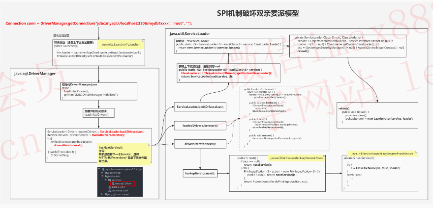
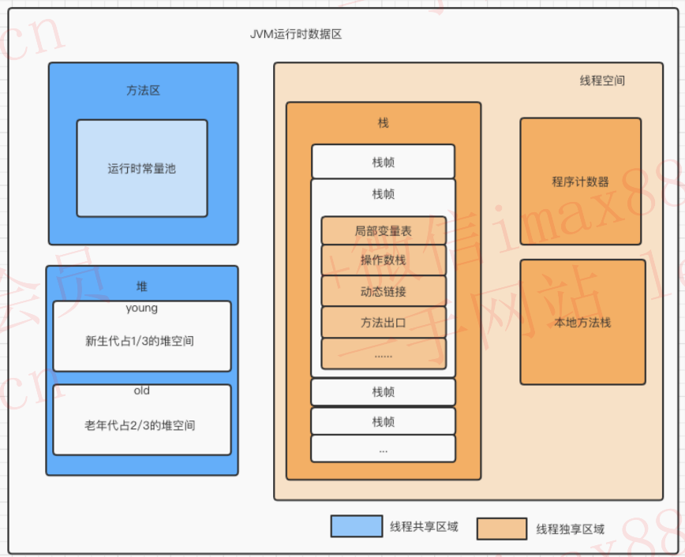
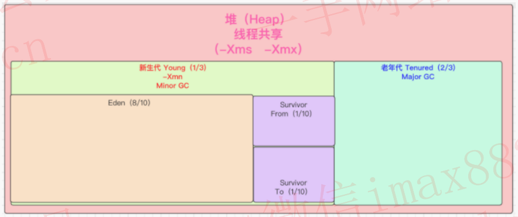
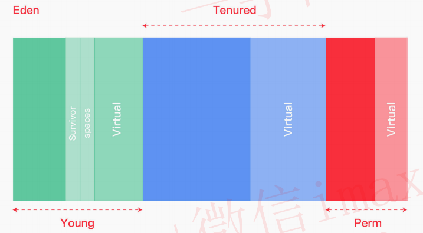
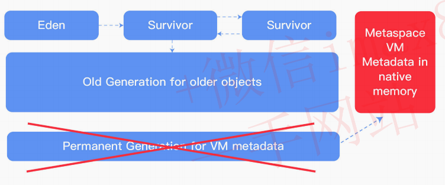
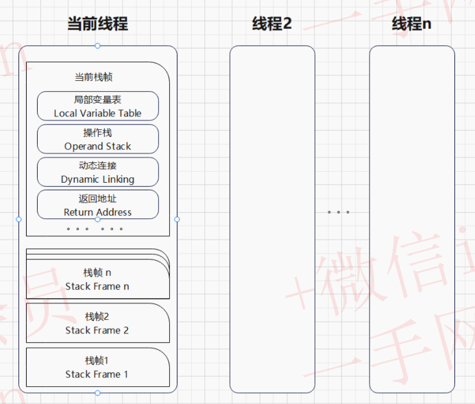
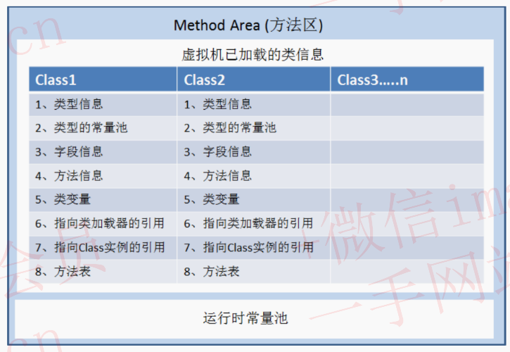
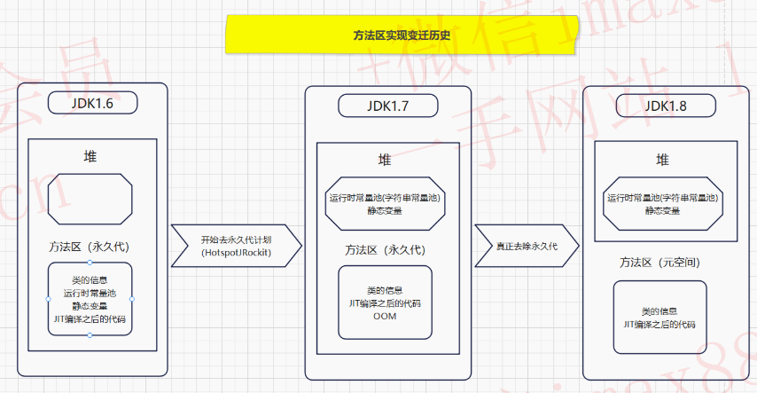
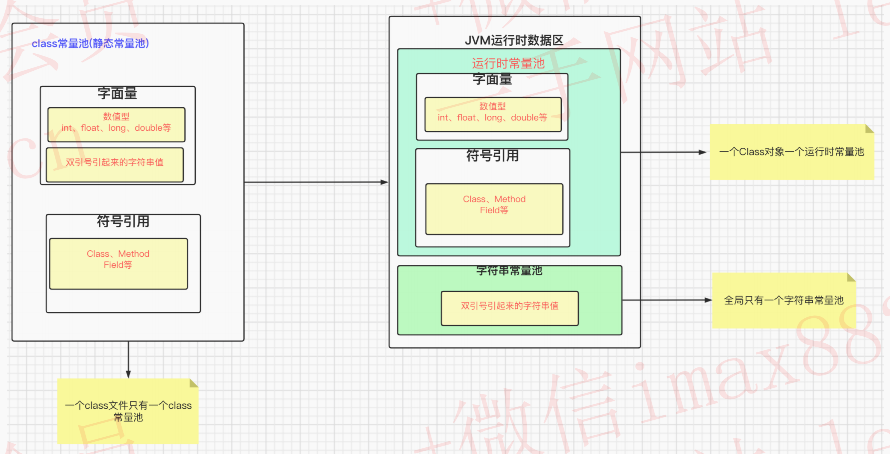

# 【JVM】Java虚拟机

> 基本知识 -> 类加载系统 -> 运行时数据区 -> 对象的生命周期 -> GC

***

## 1 JVM 基本知识

平时我们所说的 JVM 广义上指的是一种规范。狭义上的是 JDK 中的 JVM 虚拟机。JVM 的实现是由各个厂商来做的。比如现在流传最广泛的是 hotspot。

**JVM 是运行 class 文件的环境，至于字节码文件如何产生，可以由多种语言（不仅限于 Java）开发出** 。


***

## 2 类加载器

### 2.1 类加载器分类

**JVM 的类加载是通过 `ClassLoader` 及其子类来实现的** ，类加载器的分类：

- **启动类加载器（`Bootstrap ClassLoader`）**
  - 负责加载 `JAVA_HOME/lib` 目录的或通过 `-Xbootclasspath` 参数指定路径中的且被虚拟机认可的类库
- **扩展类加载器（`Extension ClassLoader`）**
  - 负责加载 `JAVA_HOME/lib/ext` 目录或通过 `java.ext.dirs` 系统变量指定路径中的类库
- **应用类加载器（`Application ClassLoader`）**
  - 负责加载用户路径 classpath 上的类库
- **自定义类加载器（`Custom ClassLoader`）**
  - 加载应用之外（非 classpath 中的）的类文件

### 2.2 类加载器的执行顺序

- **检查顺序是自底向上** ：加载过程中会先检查类是否被已加载，从 Custom 到 BootStrap 逐层检查，只要某个类加载器已加载就视为此类已加载，保证此类所有 ClassLoader 只加载一次。
- **加载的顺序是自顶向下** ：也就是由上层来逐层尝试加载此类。


### 2.3 类加载的时机与过程

类加载的四个时机：

- 遇到 `new` 、`getStatic` 、`putStatic` 、`invokeStatic` 四条指令时；

  ```java
  public class Student {
  		public static int age;
    	public static void method();
  }
  
  // Student.age;
  // Student.method();
  // new Student();
  ```

- 使用 `java.lang.reflect` 包方法时，对类进行 **反射调用** ；

  ```java
  Class c = Class.forname("tech.songjian.Student");
  ```

- 初始化一个类时，发现其父类还没初始化，要先初始化其父类

- 当虚拟机启动时，用户需要指定一个主类 main，需要先将 **主类加载**

类加载的过程（做了什么）：

- 定位：根据 **类全限定名** 使用 **二进制字节流** 读取 class 文件
- 读到内存：把 **字节流静态数据** 存储在内存中的 **方法区（永久代、元空间）** 中，到目前还是字节流数据
- 对象化：把字节数据转化成 **字节码 Class 对象**

### 2.4  类加载途径

这里说的类加载途径，就是指 class 文件的来源。因为只要是合法的字节码文件都能进行加载：

- jar/war
- jsp生成的class
- 数据库中的二进制字节流
- 网络中的二进制字节流
- 动态代理生成的二进制字节流


### 2.5 案例：自定义类加载器

**目标：自定义类加载器，加载指定路径在本地 lib 文件夹下的类**

**步骤：**

- 新建一个类 `Test.java`
- 编译 `Test.java` 本地 lib 文件夹下
- 自定义类加载器 `MyClassLoader` ，继承 `ClassLoader`：
  - 重写 `findClass()` 
  - 重写 `defineClass()`
- 测试

（1）`Test.java`

```java
package tech.songjian.classloader;

public class Test {
    public void say(){
        System.out.println("Hello MyClassLoader");
    }
}

```

（2）使用 `javac Test.java` 生成字节码文件 `Test.class`，放到本地 lib 文件夹下


（3）自定义类加载器，代码如下：

```java
public class MyClassLoader extends ClassLoader{

    private String classpath;

    public MyClassLoader(String classpath) {
        this.classpath = classpath;
    }

    /**
     *
     * @param name 类全限定名，定位 class 文件
     *
     * @return
     * @throws ClassNotFoundException
     */
    @Override
    protected Class<?> findClass(String name) throws ClassNotFoundException {
        try {
            byte[] classData = getData(name);
            if(classData != null) {
                // 使用 defineClass 方法将 字节数组数据 转化为 字节码对象
                return defineClass(name, classData, 0, classData.length);
            }
        } catch (IOException e) {
            throw new RuntimeException(e);
        }
        return super.findClass(name);
    }

    /**
     * 加载类的字节数据
     * @param className
     * @return
     * @throws IOException
     */
    private byte[] getData(String className) throws IOException {
        // 根据 className 生成 class 对应的路径
        String path = classpath + File.separatorChar +
                className.replace('.', File.separatorChar) + ".class";
        try (InputStream in = new FileInputStream(path);
             ByteArrayOutputStream out = new ByteArrayOutputStream()) {
            byte[] buffer = new byte[2048];
            int len = 0;
            while ((len = in.read(buffer)) != -1) {
                out.write(buffer, 0, len);
            }
            return out.toByteArray();
        }
    }
}
```

测试结果：


### 2.6 双亲委派模型与打破双亲委派

双亲委派： **当一个类加载器收到类加载任务，会先交给其父类加载器去完成** 。因此，最终加载任务都会传递到顶层的启动类加载器，**只有当父类加载器无法完成加载任务时，子类才会尝试执行加载任务** 。

双亲委派的作用：

- 考虑到安全因素，**双亲委派可以避免重复加载** ，当父亲已经加载了该类的时候，就没有必要子 `ClassLoader` 再加载一次。
- 比如：加载位于 `rt.jar` 包中的类 `java.lang.Object` ，不管是哪个加载器加载这个类，最终都是委托给顶层的启动类加载器进行加载，这样就保证了使用不同的类加载器最终得到的都是同样一个 `Object` 对象，

**打破双亲委派** 的作用：

- 在实际应用中，**双亲委派解决了Java 基础类统一加载** 的问题，但是却存在着缺陷。JDK 中的基础类作为典型的 API 被用户调用，但是也存在 **API 调用用户代码** 的情况，典型的如：SPI 代码。这种情况就需要打破双亲委派模式。
- 举个栗子：数据库驱动 DriverManager。以 Driver 接口为例，Driver 接口定义在 JDK 中，其 **实现由各个数据库的服务商来提供，由系统类加载器加载** 。这个时候就需要 **启动类加载器** 来 **委托** 子类来加载 Driver实现，这就破坏了双亲委派。

**如何打破双亲委派？**

（1）**方法一：重写 `ClassLoader` 的 `loadClass` 方法**	

（2）**方法二：SPI，父类委托子类加载器加载 `Class`，以数据库驱动 DriverManager 为例**



***

## 3 运行时数据区

###  3.1 概述



**按照线程使用情况和指责分成两大类：**

- **线程独享（程序执行区域，不需要 GC ）**
  - 程序技术器
  - 虚拟机栈
  - 本地方法栈
- **线程共享 （数据存储区域，需要 GC）**
  - 方法区 和 堆
  - 用于存储类的静态数据和对象数据

### 3.2 堆

Java 堆在 JVM 启动时创建内存区域去实现 **对象、数组与运行时常量** 的内存分配，它是虚拟机管理最大的，也是垃圾回收的主要内存区域。



#### 为什么堆内存会划分为新生代和老年代？

**分代收集理论**：当前商业虚拟机的垃圾收集器，大多数都遵循了 **分代收集（Generational Collection）** 的理论进行设计，分代收集名为理论，实质是一套符合大多数程序运行实际情况的经验法则，它建立在两个分代假说之上：

- **弱分代假说** （Weak Generational Hypothesis）：**绝大多数对象都是朝生夕灭的** 。
- **强分代假说** （Strong Generational Hypothesis）：**熬过越多次垃圾收集过程的对象就越难以消亡** 。

这两个分代假说共同奠定了多款常用的垃圾收集器的一致的设计原则：收集器应该将 Java 堆划分出不同的区域，然后将回收对象依据其年龄（年龄即对象熬过垃圾收集过程的次数）分配到不同的区域之中存储。

- 新生代：如果一个区域中大多数对象都是朝生夕灭，难以熬过垃圾收集过程的话，那么把它们集中放在一起，每次回收时只关注如何保留少量存活而不是去标记那些大量将要被回收的对象，就能 **以较低代价回收到大量的空间** ；
- 老年代：如果剩下的都是难以消亡的对象，那把它们集中放在一块，虚拟机便可以使用 **较低的频率来回收这个区域** 。

#### 内存模型的变迁

**（1）Java 1.7**



- **Young（新生代）** ：主要保存年轻对象，分为三部分，Eden 区、两个 Survivor 区。
- **Tenured（老年代）** ：主要保存年长对象，当对象在 `Young` 复制转移一定的次数后，对象就会被转移到 `Tenured` 区。
- **Perm（永久代）** ：主要保存 class、method、filed 对象，这部份的空间一般不会溢出，除非一次性加载了很多的类，不过在涉及到热部署的应用服务器的时候，有时候会遇到 `OOM : PermGen space` 的错误。
- **Virtual 区**： 最大内存和初始内存的差值，就是 Virtua l区。

**（2）Java 1.8**



- 由 2 部分组成，**新生代（Eden + 2 * Survivor ）** + **年老代（OldGen ）**

- JDK1.8 中变化最大的是 **Perm（永久代）用 Metaspace 进行了替换**

  > 注意：Metaspace 所占用的内存空间不是在虚拟机内部，而是在本地内存空间中。区别于 JDK1.7

**（3）Java 1.9**


- 取消新生代、老年代的 **物理划分**
- 将堆划分为若干个 **区域（Region）**，这些区域中包含了有 **逻辑上的新生代、老年代区域** 

### 3.3 虚拟机栈

栈内存为线程私有的空间，**每个线程都会创建私有的栈内存，生命周期与线程相同** ，每个 Java 方法在执行的时候都会创建一个 **栈帧（Stack Frame）** 。栈内存大小决定了方法调用的深度，栈内存过小则会导致方法调用的深度较小，如递归调用的次数较少。 

**栈帧（Stack Frame）** 是用于支持虚拟机进行 **方法执行** 的数据结构。栈帧存储了 **方法的局部变量表、操作数栈、动态连接和方法返回地址** 等信息。每一个方法从调用至执行完成的过程，都对应着一个栈帧在虚拟机栈里从入栈到出栈的过程。



一个线程中方法的调用链可能会很长，所以会有很多栈帧。只有位于 JVM 虚拟机栈栈顶的元素才是有效的，即称为 **当前栈帧** ，与这个栈帧相关连的方法称为 **当前方法** ，定义这个方法的类叫做 **当前类** 。

执行引擎运行的所有 **字节码指令** 都只针对 **当前栈帧** 进行操作。如果当前方法调用了其他方法，或者当前方法执行结束，那这个方法的栈帧就不再是当前栈帧了。

**栈异常** 的两种情况：

- 如果线程请求的栈深度大于虚拟机所允许的深度（Xss 默认 1m），会抛出 `StackOverflowError` 异常
  - 方法调用链过长
- 如果在创建新的线程时，没有足够的内存去创建对应的虚拟机栈，会抛出 `OutOfMemoryError` 异常
  - 线程创建太多

### 3.4 本地方法栈

**本地方法栈** 和 **虚拟机栈** 相似，区别就是虚拟机栈为虚拟机执行 Java 服务（字节码服务），而 **本地方法栈为虚拟机使用到的 `Native` 方法（比如C++方法）服务** 。

简单地讲，一个 Native Method 就是一个 **Java 调用非 Java 代码的接口** 。如 `Thread` 类中有使用很多本地方法。

### 3.5 方法区

方法区（Method Area）是可供各个线程共享的运行时内存区域，方法区本质上是 Java 语言 **编译后代码存储区域**，它存储每一个类的结构信息，例如：**运行时常量池** 、成员变量、方法数据、构造方法和普通方法的字节码指令等内容。

方法区的具体实现：**永久代（PermGen）、元空间（Metaspace）**

#### 方法区存储内容



方法区存储的数据主要有三种类型：

- Class
  - 类型信息，比如 Class（com.hero.User 类）
  - 方法信息，比如 Method（方法名称、方法参数列表、方法返回值信息）
  - 字段信息，比如 Field（字段类型，字段名称需要特殊设置才能保存的住）
  - 类变量（静态变量）：JDK1.7 之后，转移到堆中存储
  - 方法表（方法调用的时候） 在 A 类的 main 方法中去调用 B 类的 method1 方法，是根据 B 类的方法表去查找合适的方法，进行调用的
- 运行时常量池（字符串常量池）：从 class 中的常量池加载而来，Java1.7 后转移到堆内存存储
- JIT 编译器编译之后的代码缓存

#### 永久代和元空间的区别是什么？

 JDK1.8 之前使用的方法区实现是 **永久代** ，JDK1.8 及以后使用的方法区实现是 **元空间** 。

-  **存储位置不同：**
  - **永久代** 所使用的内存区域是 JVM 进程所使用的区域，它的大小受整个 JVM 的大小所限制。
  - **元空间** 所使用的内存区域是物理内存区域。那么元空间的使用大小只会受物理内存大小的限制。
- **存储内容不同：**
  - 永久代存储的信息基本上就是上面方法区存储内容中的数据。
  - **元空间只存储类的元信息** ，而 **静态变量 和 运行时常量池 都挪到堆中** 。



### 3.6 程序计数器

程序计数器（Program Counter Register），也叫PC寄存器，是一块较小的内存空间，它可以看作是**当前线程所执行的字节码指令的行号指示器** 。字节码解释器的工作就是通过改变这个计数器的值来选取下一条需要执行的字节码指令。分支，循环，跳转，异常处理，线程恢复等都需要依赖这个计数器来完成。

由于 Java 虚拟机的多线程是 **通过线程轮流切换并分配处理器执行时间** 的方式来实现的，在任何一个确定的时刻，一个处理器（针对多核处理器来说是一个内核）都只会执行一条线程中的指令。因此，为了线程切换（**系统上下文切换**）后能恢复到正确的执行位置，每条线程都需要有一个独立的程序计数器，各条线程之间计数器互不影响，独立存储。

### 补充：字符串常量池详解

三种常量池：

- **class常量池** ：一个 class 文件只有一个 class 常量池
  - 字面量：数值型（int、float、long、double）、双引号引起来的字符串值等
  - 符号引用：Class、Method、Field 等
- **运行时常量池** ：一个 class 对象有一个运行时常量池
  - 字面量：数值型（int、float、long、double）、双引号引起来的字符串值等
  - 符号引用：Class、Method、Field 等
- **字符串常量池：全局只有一个字符串常量池**
  - 双引号引起来的字符串值



#### 字符串常量池的存储数据方式

字符串常量池使用的是 `StringTable` 的数据结构存储数据，类似于 `HashTable` （哈希表）

```java
public static void test() { 
  String str1 = "abc"; 
  String str2 = new String("abc"); 
  System.out.println(str1 == str2);//false 
  
  String str3 = new String("abc"); 
  System.out.println(str3 == str2);//false 

  String str4 = "a" + "b"; 
  System.out.println(str4 == "ab");//true 
  
  String s1 = "a"; 
  String s2 = "b"; 
  String str6 = s1 + s2; 
  System.out.println(str6 == "ab");//false 
  
  String str7 = "abc".substring(0,2); 
  System.out.println(str7 == "ab");//false 
  
  String str8 = "abc".toUpperCase();
  System.out.println(str8 == "ABC");//false 
  
  String s5 = "a"; 
  String s6 = "abc";
  String s7 = s5 + "bc"; 
  System.out.println(s6 == s7.intern());//true 
}
```

结论：

- 单独使用 **引号 `" "`**  创建字符串都是常量，编译期存入 `StringPool`
- 使用 `new` 创建的字符串对象会存入 `heap` ，运行期创建
- **只包含常量** 的字符串连接符 `+` ，编译期存入 `StringPool`
- **含变量** 的字符串连接符 `+` ，运行期创建，存储到 heap
- 运行期调用 `String` 的 `intern()` 方法，可以动态向 `StringPool` 加字符串

### 补充：直接内存

直接内存并不是虚拟机运行时数据区的一部分，也不是 Java 虚拟机规范中定义的内存区域。

在 JDK1.4 中新加入了 `NIO (New Input/Output)` 类，引入了一种基于通道（Channel）与缓冲区（Buffer）的 I/O 方式，它可以使用 native 函数库直接分配堆外内存，然后通过一个存储在Java堆中的 **`DirectByteBuffer`** 对象作为这块内存的引用进行操作。这样能在一些场景中显著提高性能，因为避免了在 Java 堆和 Native 堆中来回复制数据。

本机直接内存的分配不会受到 Java 堆大小的限制，受到本机总内存大小限制。

**直接内存（堆外内存）与堆内存比较：**

- 直接内存申请空间耗费更高的性能，当频繁申请到一定量时尤为明显
- 直接内存 IO 读写的性能要优于普通的堆内存，在多次读写操作的情况下差异明显


