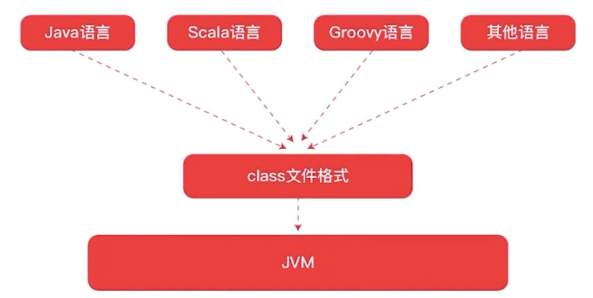
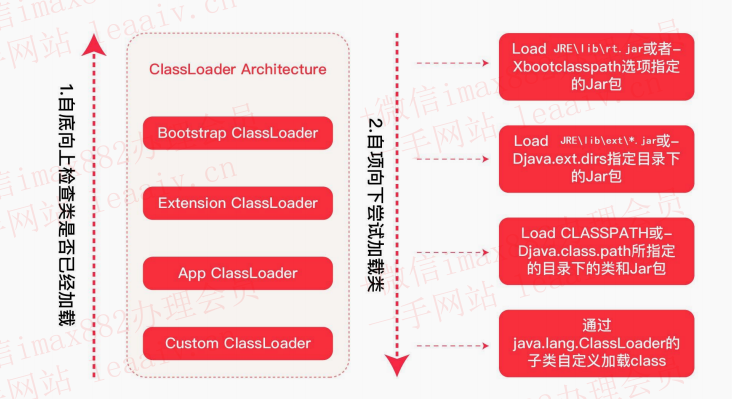
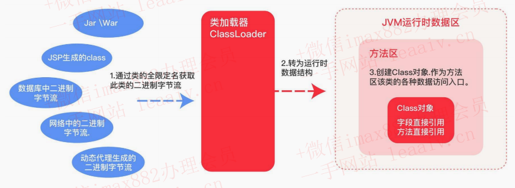
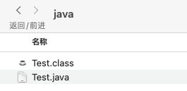
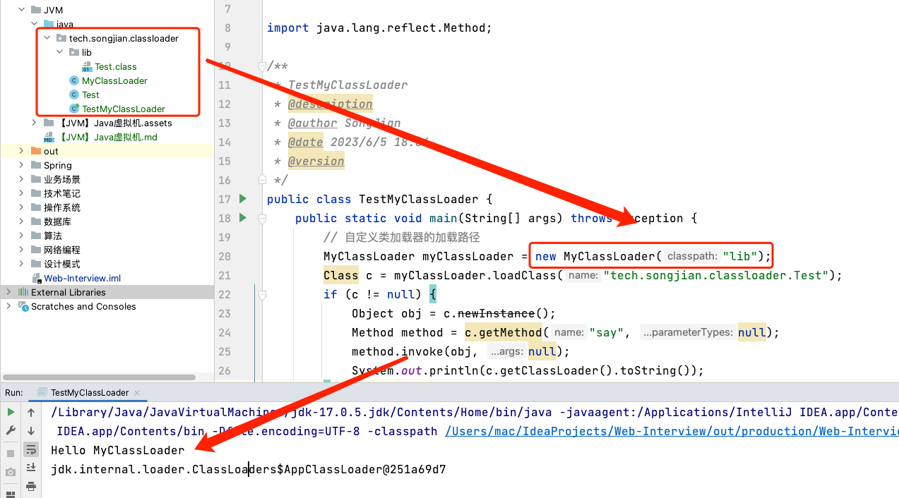

# 【JVM】Java虚拟机

> 基本知识 -> 类加载系统 -> 运行时数据区 -> 对象的生命周期 -> GC

## 1 JVM 基本知识

平时我们所说的 JVM 广义上指的是一种规范。狭义上的是 JDK 中的 JVM 虚拟机。JVM 的实现是由各个厂商来做的。比如现在流传最广泛的是 hotspot。

**JVM 是运行 class 文件的环境，至于字节码文件如何产生，可以由多种语言（不仅限于 Java）开发出** 。



## 2 类加载器

### 2.1 类加载器分类

**JVM 的类加载是通过 `ClassLoader` 及其子类来实现的** ，类加载器的分类：

- **启动类加载器（`Bootstrap ClassLoader`）**
  - 负责加载 `JAVA_HOME/lib` 目录的或通过 `-Xbootclasspath` 参数指定路径中的且被虚拟机认可的类库
- **扩展类加载器（`Extension ClassLoader`）**
  - 负责加载 `JAVA_HOME/lib/ext` 目录或通过 `java.ext.dirs` 系统变量指定路径中的类库
- **应用类加载器（`Application ClassLoader`）**
  - 负责加载用户路径 classpath 上的类库
- **自定义类加载器（`Custom ClassLoader`）**
  - 加载应用之外（非 classpath 中的）的类文件

### 2.2 类加载器的执行顺序

- **检查顺序是自底向上** ：加载过程中会先检查类是否被已加载，从 Custom 到 BootStrap 逐层检查，只要某个类加载器已加载就视为此类已加载，保证此类所有 ClassLoader 只加载一次。
- **加载的顺序是自顶向下** ：也就是由上层来逐层尝试加载此类。



### 2.3 类加载的时机与过程

类加载的四个时机：

- 遇到 `new` 、`getStatic` 、`putStatic` 、`invokeStatic` 四条指令时；

  ```java
  public class Student {
  		public static int age;
    	public static void method();
  }
  
  // Student.age;
  // Student.method();
  // new Student();
  ```

- 使用 `java.lang.reflect` 包方法时，对类进行 **反射调用** ；

  ```java
  Class c = Class.forname("tech.songjian.Student");
  ```

- 初始化一个类时，发现其父类还没初始化，要先初始化其父类

- 当虚拟机启动时，用户需要指定一个主类 main，需要先将 **主类加载**

类加载的过程（做了什么）：

- 定位：根据 **类全限定名** 使用 **二进制字节流** 读取 class 文件
- 读到内存：把 **字节流静态数据** 存储在内存中的 **方法区（永久代、元空间）** 中，到目前还是字节流数据
- 对象化：把字节数据转化成 **字节码 Class 对象**

### 2.4  类加载途径

这里说的类加载途径，就是指 class 文件的来源。因为只要是合法的字节码文件都能进行加载：

- jar/war
- jsp生成的class
- 数据库中的二进制字节流
- 网络中的二进制字节流
- 动态代理生成的二进制字节流



### 2.5 案例：自定义类加载器

**目标：自定义类加载器，加载指定路径在本地 lib 文件夹下的类**

**步骤：**

- 新建一个类 `Test.java`
- 编译 `Test.java` 本地 lib 文件夹下
- 自定义类加载器 `MyClassLoader` ，继承 `ClassLoader`：
  - 重写 `findClass()` 
  - 重写 `defineClass()`
- 测试

（1）`Test.java`

```java
package tech.songjian.classloader;

public class Test {
    public void say(){
        System.out.println("Hello MyClassLoader");
    }
}

```

（2）使用 `javac Test.java` 生成字节码文件 `Test.class`，放到本地 lib 文件夹下



（3）自定义类加载器，代码如下：

```java
public class MyClassLoader extends ClassLoader{

    private String classpath;

    public MyClassLoader(String classpath) {
        this.classpath = classpath;
    }

    /**
     *
     * @param name 类全限定名，定位 class 文件
     *
     * @return
     * @throws ClassNotFoundException
     */
    @Override
    protected Class<?> findClass(String name) throws ClassNotFoundException {
        try {
            byte[] classData = getData(name);
            if(classData != null) {
                // 使用 defineClass 方法将 字节数组数据 转化为 字节码对象
                return defineClass(name, classData, 0, classData.length);
            }
        } catch (IOException e) {
            throw new RuntimeException(e);
        }
        return super.findClass(name);
    }

    /**
     * 加载类的字节数据
     * @param className
     * @return
     * @throws IOException
     */
    private byte[] getData(String className) throws IOException {
        // 根据 className 生成 class 对应的路径
        String path = classpath + File.separatorChar +
                className.replace('.', File.separatorChar) + ".class";
        try (InputStream in = new FileInputStream(path);
             ByteArrayOutputStream out = new ByteArrayOutputStream()) {
            byte[] buffer = new byte[2048];
            int len = 0;
            while ((len = in.read(buffer)) != -1) {
                out.write(buffer, 0, len);
            }
            return out.toByteArray();
        }
    }
}
```

测试结果：




