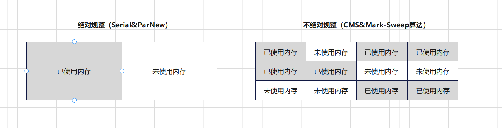

# 【JVM】Java虚拟机

> 基本知识 -> 类加载系统 -> 运行时数据区 -> 对象的生命周期 -> GC

***

## 1 JVM 基本知识

平时我们所说的 JVM 广义上指的是一种规范。狭义上的是 JDK 中的 JVM 虚拟机。JVM 的实现是由各个厂商来做的。比如现在流传最广泛的是 hotspot。

**JVM 是运行 class 文件的环境，至于字节码文件如何产生，可以由多种语言（不仅限于 Java）开发出** 。


***

## 2 类加载器

### 2.1 类加载器分类

**JVM 的类加载是通过 `ClassLoader` 及其子类来实现的** ，类加载器的分类：

- **启动类加载器（`Bootstrap ClassLoader`）**
  - 负责加载 `JAVA_HOME/lib` 目录的或通过 `-Xbootclasspath` 参数指定路径中的且被虚拟机认可的类库
- **扩展类加载器（`Extension ClassLoader`）**
  - 负责加载 `JAVA_HOME/lib/ext` 目录或通过 `java.ext.dirs` 系统变量指定路径中的类库
- **应用类加载器（`Application ClassLoader`）**
  - 负责加载用户路径 classpath 上的类库
- **自定义类加载器（`Custom ClassLoader`）**
  - 加载应用之外（非 classpath 中的）的类文件

### 2.2 类加载器的执行顺序

- **检查顺序是自底向上** ：加载过程中会先检查类是否被已加载，从 Custom 到 BootStrap 逐层检查，只要某个类加载器已加载就视为此类已加载，保证此类所有 ClassLoader 只加载一次。
- **加载的顺序是自顶向下** ：也就是由上层来逐层尝试加载此类。


### 2.3 类加载的时机与过程

类加载的四个时机：

- 遇到 `new` 、`getStatic` 、`putStatic` 、`invokeStatic` 四条指令时；

  ```java
  public class Student {
  		public static int age;
    	public static void method();
  }
  
  // Student.age;
  // Student.method();
  // new Student();
  ```

- 使用 `java.lang.reflect` 包方法时，对类进行 **反射调用** ；

  ```java
  Class c = Class.forname("tech.songjian.Student");
  ```

- 初始化一个类时，发现其父类还没初始化，要先初始化其父类

- 当虚拟机启动时，用户需要指定一个主类 main，需要先将 **主类加载**

类加载的过程（做了什么）：

- 定位：根据 **类全限定名** 使用 **二进制字节流** 读取 class 文件
- 读到内存：把 **字节流静态数据** 存储在内存中的 **方法区（永久代、元空间）** 中，到目前还是字节流数据
- 对象化：把字节数据转化成 **字节码 Class 对象**

### 2.4  类加载途径

这里说的类加载途径，就是指 class 文件的来源。因为只要是合法的字节码文件都能进行加载：

- jar/war
- jsp生成的class
- 数据库中的二进制字节流
- 网络中的二进制字节流
- 动态代理生成的二进制字节流


### 2.5 案例：自定义类加载器

**目标：自定义类加载器，加载指定路径在本地 lib 文件夹下的类**

**步骤：**

- 新建一个类 `Test.java`
- 编译 `Test.java` 本地 lib 文件夹下
- 自定义类加载器 `MyClassLoader` ，继承 `ClassLoader`：
  - 重写 `findClass()` 
  - 重写 `defineClass()`
- 测试

（1）`Test.java`

```java
package tech.songjian.classloader;

public class Test {
    public void say(){
        System.out.println("Hello MyClassLoader");
    }
}

```

（2）使用 `javac Test.java` 生成字节码文件 `Test.class`，放到本地 lib 文件夹下


（3）自定义类加载器，代码如下：

```java
public class MyClassLoader extends ClassLoader{

    private String classpath;

    public MyClassLoader(String classpath) {
        this.classpath = classpath;
    }

    /**
     *
     * @param name 类全限定名，定位 class 文件
     *
     * @return
     * @throws ClassNotFoundException
     */
    @Override
    protected Class<?> findClass(String name) throws ClassNotFoundException {
        try {
            byte[] classData = getData(name);
            if(classData != null) {
                // 使用 defineClass 方法将 字节数组数据 转化为 字节码对象
                return defineClass(name, classData, 0, classData.length);
            }
        } catch (IOException e) {
            throw new RuntimeException(e);
        }
        return super.findClass(name);
    }

    /**
     * 加载类的字节数据
     * @param className
     * @return
     * @throws IOException
     */
    private byte[] getData(String className) throws IOException {
        // 根据 className 生成 class 对应的路径
        String path = classpath + File.separatorChar +
                className.replace('.', File.separatorChar) + ".class";
        try (InputStream in = new FileInputStream(path);
             ByteArrayOutputStream out = new ByteArrayOutputStream()) {
            byte[] buffer = new byte[2048];
            int len = 0;
            while ((len = in.read(buffer)) != -1) {
                out.write(buffer, 0, len);
            }
            return out.toByteArray();
        }
    }
}
```

测试结果：


### 2.6 双亲委派模型与打破双亲委派

双亲委派： **当一个类加载器收到类加载任务，会先交给其父类加载器去完成** 。因此，最终加载任务都会传递到顶层的启动类加载器，**只有当父类加载器无法完成加载任务时，子类才会尝试执行加载任务** 。

双亲委派的作用：

- 考虑到安全因素，**双亲委派可以避免重复加载** ，当父亲已经加载了该类的时候，就没有必要子 `ClassLoader` 再加载一次。
- 比如：加载位于 `rt.jar` 包中的类 `java.lang.Object` ，不管是哪个加载器加载这个类，最终都是委托给顶层的启动类加载器进行加载，这样就保证了使用不同的类加载器最终得到的都是同样一个 `Object` 对象，

**打破双亲委派** 的作用：

- 在实际应用中，**双亲委派解决了Java 基础类统一加载** 的问题，但是却存在着缺陷。JDK 中的基础类作为典型的 API 被用户调用，但是也存在 **API 调用用户代码** 的情况，典型的如：SPI 代码。这种情况就需要打破双亲委派模式。
- 举个栗子：数据库驱动 DriverManager。以 Driver 接口为例，Driver 接口定义在 JDK 中，其 **实现由各个数据库的服务商来提供，由系统类加载器加载** 。这个时候就需要 **启动类加载器** 来 **委托** 子类来加载 Driver实现，这就破坏了双亲委派。

**如何打破双亲委派？**

（1）**方法一：重写 `ClassLoader` 的 `loadClass` 方法**	

（2）**方法二：SPI，父类委托子类加载器加载 `Class`，以数据库驱动 DriverManager 为例**


***

## 3 运行时数据区

###  3.1 概述


**按照线程使用情况和指责分成两大类：**

- **线程独享（程序执行区域，不需要 GC ）**
  - 程序技术器
  - 虚拟机栈
  - 本地方法栈
- **线程共享 （数据存储区域，需要 GC）**
  - 方法区 和 堆
  - 用于存储类的静态数据和对象数据

### 3.2 堆

Java 堆在 JVM 启动时创建内存区域去实现 **对象、数组与运行时常量** 的内存分配，它是虚拟机管理最大的，也是垃圾回收的主要内存区域。


#### 为什么堆内存会划分为新生代和老年代？

**分代收集理论**：当前商业虚拟机的垃圾收集器，大多数都遵循了 **分代收集（Generational Collection）** 的理论进行设计，分代收集名为理论，实质是一套符合大多数程序运行实际情况的经验法则，它建立在两个分代假说之上：

- **弱分代假说** （Weak Generational Hypothesis）：**绝大多数对象都是朝生夕灭的** 。
- **强分代假说** （Strong Generational Hypothesis）：**熬过越多次垃圾收集过程的对象就越难以消亡** 。

这两个分代假说共同奠定了多款常用的垃圾收集器的一致的设计原则：收集器应该将 Java 堆划分出不同的区域，然后将回收对象依据其年龄（年龄即对象熬过垃圾收集过程的次数）分配到不同的区域之中存储。

- 新生代：如果一个区域中大多数对象都是朝生夕灭，难以熬过垃圾收集过程的话，那么把它们集中放在一起，每次回收时只关注如何保留少量存活而不是去标记那些大量将要被回收的对象，就能 **以较低代价回收到大量的空间** ；
- 老年代：如果剩下的都是难以消亡的对象，那把它们集中放在一块，虚拟机便可以使用 **较低的频率来回收这个区域** 。

#### 内存模型的变迁

**（1）Java 1.7**


- **Young（新生代）** ：主要保存年轻对象，分为三部分，Eden 区、两个 Survivor 区。
- **Tenured（老年代）** ：主要保存年长对象，当对象在 `Young` 复制转移一定的次数后，对象就会被转移到 `Tenured` 区。
- **Perm（永久代）** ：主要保存 class、method、filed 对象，这部份的空间一般不会溢出，除非一次性加载了很多的类，不过在涉及到热部署的应用服务器的时候，有时候会遇到 `OOM : PermGen space` 的错误。
- **Virtual 区**： 最大内存和初始内存的差值，就是 Virtua l区。

**（2）Java 1.8**


- 由 2 部分组成，**新生代（Eden + 2 * Survivor ）** + **年老代（OldGen ）**

- JDK1.8 中变化最大的是 **Perm（永久代）用 Metaspace 进行了替换**

  > 注意：Metaspace 所占用的内存空间不是在虚拟机内部，而是在本地内存空间中。区别于 JDK1.7

**（3）Java 1.9**


- 取消新生代、老年代的 **物理划分**
- 将堆划分为若干个 **区域（Region）**，这些区域中包含了有 **逻辑上的新生代、老年代区域** 

### 3.3 虚拟机栈

栈内存为线程私有的空间，**每个线程都会创建私有的栈内存，生命周期与线程相同** ，每个 Java 方法在执行的时候都会创建一个 **栈帧（Stack Frame）** 。栈内存大小决定了方法调用的深度，栈内存过小则会导致方法调用的深度较小，如递归调用的次数较少。 

**栈帧（Stack Frame）** 是用于支持虚拟机进行 **方法执行** 的数据结构。栈帧存储了 **方法的局部变量表、操作数栈、动态连接和方法返回地址** 等信息。每一个方法从调用至执行完成的过程，都对应着一个栈帧在虚拟机栈里从入栈到出栈的过程。


一个线程中方法的调用链可能会很长，所以会有很多栈帧。只有位于 JVM 虚拟机栈栈顶的元素才是有效的，即称为 **当前栈帧** ，与这个栈帧相关连的方法称为 **当前方法** ，定义这个方法的类叫做 **当前类** 。

执行引擎运行的所有 **字节码指令** 都只针对 **当前栈帧** 进行操作。如果当前方法调用了其他方法，或者当前方法执行结束，那这个方法的栈帧就不再是当前栈帧了。

**栈异常** 的两种情况：

- 如果线程请求的栈深度大于虚拟机所允许的深度（Xss 默认 1m），会抛出 `StackOverflowError` 异常
  - 方法调用链过长
- 如果在创建新的线程时，没有足够的内存去创建对应的虚拟机栈，会抛出 `OutOfMemoryError` 异常
  - 线程创建太多

### 3.4 本地方法栈

**本地方法栈** 和 **虚拟机栈** 相似，区别就是虚拟机栈为虚拟机执行 Java 服务（字节码服务），而 **本地方法栈为虚拟机使用到的 `Native` 方法（比如C++方法）服务** 。

简单地讲，一个 Native Method 就是一个 **Java 调用非 Java 代码的接口** 。如 `Thread` 类中有使用很多本地方法。

### 3.5 方法区

方法区（Method Area）是可供各个线程共享的运行时内存区域，方法区本质上是 Java 语言 **编译后代码存储区域**，它存储每一个类的结构信息，例如：**运行时常量池** 、成员变量、方法数据、构造方法和普通方法的字节码指令等内容。

方法区的具体实现：**永久代（PermGen）、元空间（Metaspace）**

#### 方法区存储内容


方法区存储的数据主要有三种类型：

- Class
  - 类型信息，比如 Class（com.hero.User 类）
  - 方法信息，比如 Method（方法名称、方法参数列表、方法返回值信息）
  - 字段信息，比如 Field（字段类型，字段名称需要特殊设置才能保存的住）
  - 类变量（静态变量）：JDK1.7 之后，转移到堆中存储
  - 方法表（方法调用的时候） 在 A 类的 main 方法中去调用 B 类的 method1 方法，是根据 B 类的方法表去查找合适的方法，进行调用的
- 运行时常量池（字符串常量池）：从 class 中的常量池加载而来，Java1.7 后转移到堆内存存储
- JIT 编译器编译之后的代码缓存

#### 永久代和元空间的区别是什么？

 JDK1.8 之前使用的方法区实现是 **永久代** ，JDK1.8 及以后使用的方法区实现是 **元空间** 。

-  **存储位置不同：**
  - **永久代** 所使用的内存区域是 JVM 进程所使用的区域，它的大小受整个 JVM 的大小所限制。
  - **元空间** 所使用的内存区域是物理内存区域。那么元空间的使用大小只会受物理内存大小的限制。
- **存储内容不同：**
  - 永久代存储的信息基本上就是上面方法区存储内容中的数据。
  - **元空间只存储类的元信息** ，而 **静态变量 和 运行时常量池 都挪到堆中** 。


### 3.6 程序计数器

程序计数器（Program Counter Register），也叫PC寄存器，是一块较小的内存空间，它可以看作是**当前线程所执行的字节码指令的行号指示器** 。字节码解释器的工作就是通过改变这个计数器的值来选取下一条需要执行的字节码指令。分支，循环，跳转，异常处理，线程恢复等都需要依赖这个计数器来完成。

由于 Java 虚拟机的多线程是 **通过线程轮流切换并分配处理器执行时间** 的方式来实现的，在任何一个确定的时刻，一个处理器（针对多核处理器来说是一个内核）都只会执行一条线程中的指令。因此，为了线程切换（**系统上下文切换**）后能恢复到正确的执行位置，每条线程都需要有一个独立的程序计数器，各条线程之间计数器互不影响，独立存储。

### 补充：字符串常量池详解

三种常量池：

- **class常量池** ：一个 class 文件只有一个 class 常量池
  - 字面量：数值型（int、float、long、double）、双引号引起来的字符串值等
  - 符号引用：Class、Method、Field 等
- **运行时常量池** ：一个 class 对象有一个运行时常量池
  - 字面量：数值型（int、float、long、double）、双引号引起来的字符串值等
  - 符号引用：Class、Method、Field 等
- **字符串常量池：全局只有一个字符串常量池**
  - 双引号引起来的字符串值


#### 字符串常量池的存储数据方式

字符串常量池使用的是 `StringTable` 的数据结构存储数据，类似于 `HashTable` （哈希表）

```java
public static void test() { 
  String str1 = "abc"; 
  String str2 = new String("abc"); 
  System.out.println(str1 == str2);//false 
  
  String str3 = new String("abc"); 
  System.out.println(str3 == str2);//false 

  String str4 = "a" + "b"; 
  System.out.println(str4 == "ab");//true 
  
  String s1 = "a"; 
  String s2 = "b"; 
  String str6 = s1 + s2; 
  System.out.println(str6 == "ab");//false 
  
  String str7 = "abc".substring(0,2); 
  System.out.println(str7 == "ab");//false 
  
  String str8 = "abc".toUpperCase();
  System.out.println(str8 == "ABC");//false 
  
  String s5 = "a"; 
  String s6 = "abc";
  String s7 = s5 + "bc"; 
  System.out.println(s6 == s7.intern());//true 
}
```

结论：

- 单独使用 **引号 `" "`**  创建字符串都是常量，编译期存入 `StringPool`
- 使用 `new` 创建的字符串对象会存入 `heap` ，运行期创建
- **只包含常量** 的字符串连接符 `+` ，编译期存入 `StringPool`
- **含变量** 的字符串连接符 `+` ，运行期创建，存储到 heap
- 运行期调用 `String` 的 `intern()` 方法，可以动态向 `StringPool` 加字符串

### 补充：直接内存

直接内存并不是虚拟机运行时数据区的一部分，也不是 Java 虚拟机规范中定义的内存区域。

在 JDK1.4 中新加入了 `NIO (New Input/Output)` 类，引入了一种基于通道（Channel）与缓冲区（Buffer）的 I/O 方式，它可以使用 native 函数库直接分配堆外内存，然后通过一个存储在Java堆中的 **`DirectByteBuffer`** 对象作为这块内存的引用进行操作。这样能在一些场景中显著提高性能，因为避免了在 Java 堆和 Native 堆中来回复制数据。

本机直接内存的分配不会受到 Java 堆大小的限制，受到本机总内存大小限制。

**直接内存（堆外内存）与堆内存比较：**

- 直接内存申请空间耗费更高的性能，当频繁申请到一定量时尤为明显
- 直接内存 IO 读写的性能要优于普通的堆内存，在多次读写操作的情况下差异明显


***

## 4 对象的生命周期

**常量池检查：**检查 `new` 指令是否能在 **常量池中定位到这个类的符号引用，** 检查类之前是否被加载过。

**分配内存空间：**

- 指针碰撞：GC 不带压缩功能，Serial 和 ParNew
- 空闲列表：GC 带压缩功能，CMS

**必要信息设置：**对象类的元数据，对象哈希码，GC 分代年龄 → **对象头**


### 4.1 对象的内存分配方式

有两种方式：

- **指针碰撞** ：内存地址是连续的（新生代）
- **空闲链表** ：内存地址不连续的（老年代）



#### 内存分配的安全问题

问题：在分配内存的时候，虚拟机给 A 线程分配内存过程中，指针未修改。此时 B 线程同时使用了同样一块内存。

在 JVM 中有两种解决办法：

1. CAS 是 **乐观锁** 的一种实现方式。虚拟机采用 CAS  配上失败重试的方式保证更新操作的原子性。

2. TLAB **本地线程分配缓冲 (Thread Local Allocation Buffer)** ：为每一个线程预先分配一块内存。

**JVM 在第一次给线程中的对象分配内存时，首先使用 CAS 进行 TLAB 的分配。当对象大于 TLAB 中的剩余内存或 TLAB 的内存已用尽时，再采用上述的 CAS 进行内存分配** 。

### 4.2 对象怎样才会进入老年代？

对象进入老年代的流程：


对象内存分配：

- 新生代：新对象大多数都默认进入新生代的 Eden 区
- 进入老年代的条件：四种情况
  - **存活年龄太大，默认超过 15次【-XX:MaxTenuringThreshold】**
  - 动态年龄判断：MinorGC 之后，发现 **Survivor 区中的一批对象的总大小大于了这块 Survivor 区的 50%，那么就会将此时大于等于这批对象年龄最大值的所有对象，直接进入老年代** 。
  - 大对象直接进入老年代：**前提是 Serial 和 ParNew 收集器**
  - MinorGC 后，存活对象太多无法放入 Survivor

#### 为什么在新生代设置两个 Survivor 区？

原因是：**希望 MinorGC 同时能够清理 Eden 和 Survivor** 。

- 在第一次 MinorGC 时，会把 Eden 中的幸存对象复制到 Survivor0
- 第二次 MinorGC 时，同时对 Survivor0 进行清理，幸存的对象复制到 Survivor1
- 以此反复


#### 内存担保机制

内存担保机制：当新生代无法分配内存的时候，我们想把新生代的 **老对象** 转移到老年代，然后把 **新对象** 放入腾空的新生代。此种机制我们称之为 **内存担保** 。

- MinorGC 前，判断老年代可用内存是否小于新时代对象全部对象大小，如果小于则继续判断；
- 判断老年代可用内存大小是否小于之前每次 MinorGC 后进入老年代的对象平均大小：
  - 如果是，则会进行一次 FullGC，判断是否放得下，放不下 OOM
  - 如果否，则会进行一些 MinorGC：
    - MinorGC 后，剩余存活对象小于 Survivor 区大小，直接进入 Survivor 区
    - MinorGC 后，剩余存活对象大于 Survivor 区大小，但是小于老年代可用内存，直接进入老年代
    - MinorGC 后，剩余存活对象大于 Survivor 区大小，也大于老年代可用内存，进行 FullGC 
    - FullGC 之后，任然没有足够内存存放 MinorGC 的剩余对象，就会 OOM

### 4.3 对象内存布局

堆内存中，一个对象在内存中存储的布局可以分为三块区域：

- 对象头：**Java 对象头占 8 byte** 。如果是 **数组则占 12 byte** ，因为 JVM 里数组 size 需要使用 4 byte 存储。
  - **标记字段 MarkWord**：
    - 用于存储对象自身的运行时数据，它是 **synchronized 实现 轻量级锁 和 偏向锁 的关键** 。
    - 默认存储：对象 HashCode、GC 分代年龄、锁状态等等信息。
    - 为了节省空间，也会随着锁标志位的变化，存储数据发生变化。
  - **类型指针 KlassPoint** ：
    - 是对象指向它的类元数据的指针，虚拟机 **通过这个指针来确定这个对象是哪个类的实例** 。
    - 开启指针压缩存储空间 4 byte，不开启 8 byte。
    - JDK1.6+ 默认开启
  - **数组长度** ：如果对象是数组，则记录数组长度，占 4 个 byte，如果对象不是数组则不存在。
  - **对齐填充** ：保证数组的大小永远是 8 byte 的整数倍。
- **实例数据** （Instance Data）：生成对象的时候，对象的非静态成员变量也会存入堆空间。
- **对齐填充** （Padding）：JVM内对象都采用 8 byte 对齐，不够 8 byte 的会自动补齐。


#### 标记字段 MarkWord

对象头信息是与对象自身定义的数据无关的额外存储成本。考虑到虚拟机的空间效率，MarkWord 被设计成一个 **非固定的数据结构** ，以便在极小的空间内，尽量多的存储数据，它会根据对象的状态复用自己的存储空间，也就是说，MarkWord 会随着程序的运行发生变化，变化状态如下（JDK1.8）。


> MarkWord 中包含了和 Java 对象息息相关的一些信息，**它的实际大小一般和 CPU 字长保持一致** ，如在 32 位 CPU 上 MarkWord 的大小一般为 32 位，即 4 字节；而在 64  位 CPU 上 MarkWord  的大小一般为 64 位，即 8 字节。

#### 案例：空对象的内存空间

```java
import org.openjdk.jol.info.ClassLayout; 

public class ObjLock01 { 
  public static void main(String[] args) {
    Object o = new Object(); 
    System.out.println("new Object:" +
                       ClassLayout.parseInstance(o).toPrintable()); 
  } 
}
```


- 首先对象头是包含 **MarkWord** 和 **类型指针** 这两部分信息的；
- 开启指针压缩的情况下，存放 Class 指针的空间大小是 4 字节，MarkWord 是 8 字节，对象头为 12 字节；
- 新建 Object 对象，会在内存占用 16 个字节，其中 Header占 12 个（MarkWord 占 8 个+ KlassPoint 占 4个），没有实例数据，补充对齐4个。

### 4.4 如何访问一个对象？

有两种方式：

1. **句柄** ：稳定，对象被移动只要修改句柄中的地址

   

2. **直接指针** ：访问速度快，节省了一次指针定位的开销

   

***

## 5 垃圾收集 GC

### 5.1  如何找到垃圾？

主要有两种方法：引用计数法、可达性分析法。

**（1）引用计数法**

通过引用计数方法，找到这个垃圾：


当这个对象引用都消失了，消失一个计数减一，当引用都消失了，计数就会变为0。此时这个对象就会变成垃圾。

在堆内存中主要的引用关系有如下三种：**单一引用、循环引用、无引用** 。


引用计数法的致命缺点：**无法解决循环引用问题，并且效率低！**

**（2）可达性分析法**

基本思路就是通过一系列的名为 **“GC Root”** 的对象作为起始点，从这些节点开始向下搜索，搜索所走过的路径称为 **引用链（Reference Chain）** ，当一个对象到 GCRoot 没有任何引用链相连时，则证明此对象是不可用的，也就是不可达的。

通过 GCRoots 作为对象起点向下搜索，当一个对象到 GCRoots 没有任何 **引用链** 时，**此对象是垃圾** 。

**什么是 GCRoots 呢？**

- **线程栈变量**：虚拟机栈中，栈帧本地变量表引用的对象
- **静态变量**：方法区中，类静态属性引用的对象
- **常量池**：方法区中，常量引用对象
- **JNI 指针**：本地方法栈中，JNI 引用的对象
- **虚拟机内部的引用**

> 判断对象已死，至少要经历两次标记过程：
>
> - **第一次标记**：如果对象可达性分析后，发现没有与 GC Roots 相连接的引用链，那它将会被第一次标记；
> - **第二次标记**：第一次标记后，接着会进行一次筛选。筛选条件：此对象是否有必要执行 `finalize()` 方法。在 `finalize()` 方法中 **没有重新与引用链建立关联关系的，将被进行第二次标记** 。
>
> 第二次标记成功的对象将真的会被回收，如果失败则继续存活。

### 5.2 对象引用类型

非常常考的知识点，四大引用类型：强、软、弱、虚。


 **（1）强引用**

代码中普遍存在，只要强引用还在，就不会被 GC。

```java
Object obj = new Object(); 
```

**（2）软引用**

非必须引用，内存溢出之前进行回收，如内存还不够，才会抛异常。

```java
Object obj = new Object(); 
SoftReference<Object> sf = new SoftReference<Object>(obj); 
obj = null; 
Object o = sf.get();//有时候会返回null System.out.println("o = " + o); 12345
```

应用场景：**软引用可用来实现内存敏感的高速缓存** 。 举例：

```java
Map<String, SoftReference<Bitmap>> fileCache = 
  new HashMap<String, SoftReference<Bitmap>>
```

- 应用需要读取大量本地文件，如果每次读取都从硬盘读取会严重影响性能，如果一次性全部加载到内存，内存可能会溢出。
- 可以使用软引用解决这个问题，使用一个 HashMap 来保存文件路径和文件对象管理的软引用之间的映射关系。
- **内存不足时，JVM 会自动回收缓存文件对象的占用空间，有效地避免了 OOM 问题** 。

**（3）弱引用**

非必须引用，只要有 GC，就会被回收。

弱引用是在第二次垃圾回收时回收，短时间内通过弱引用取对应的数据，可以取到，当执行过第二次垃圾回收时，将返回 null。

```java
Object obj = new Object(); 

WeakReference<Object> wf = new WeakReference<Object>(obj); 
obj = null; 

//System.gc(); 

Object o = wf.get();//有时候会返回 null
boolean enqueued = wf.isEnqueued();//返回是否被垃圾回收器标记为即将回收的垃圾
System.out.println("o = " + o); 
System.out.println("enqueued = " + enqueued);
```

作用：监控对象是否已经被垃圾回收器标记为即将回收的垃圾，可以通过弱引用的 `isEnQueued` 方法返回对象是否被垃圾回收器标记。

**（4）虚引用**

虚引用是最弱的一种引用关系。垃圾回收时直接回收。

**一个对象是否有虚引用的存在，完全不会对其生存时间构成影响，也无法通过虚引用来取得一个对象实例** 。虚引用是每次垃圾回收的时候都会被回收，通过虚引用的 get 方法永远获取到的数据为 null，因此也被成为幽灵引用。

```java
Object obj = new Object(); 
PhantomReference<Object> pf = 
  new PhantomReference<Object>(obj, new ReferenceQueue<>()); 

obj=null; 
Object o = pf.get();//永远返回null 

boolean enqueued = pf.isEnqueued();//返回是否从内存中已经删除 
System.out.println("o = " + o); 
System.out.println("enqueued = " + enqueued);
```

作用：**跟踪对象被垃圾回收的状态** ，仅仅是提供一种确保对象被回收后，做某些事情的机制。类似事件监听机制

### 5.3 垃圾清除算法

三种垃圾收集算法：标记-清除、复制 和 标记-整理。

（1）**标记清除算法（Mark-Sweep）**

分为 **标记** 和 **清除** 两个阶段：

- 标记：标记出所有需要回收对象
- 清除：统一回收掉所有对象


**缺点：**

- 执行效率不稳定
- 空间碎片：会产生大量不连续内存碎片

（2）**复制算法（Copying）**

内存分为两块，清除垃圾时，将存活对象复制到另一块。

- S0 和 S1 区就是基于这个算法诞生的
- Eden:S = 8:2
- 不用担心 S 区不够，因为 Old 是担保人


**优缺点：**

- 优点：没有内存空间碎片化
- 缺点：存在空间浪费

（3）**标记-整理算法（Mark-Compact）**

- 标记：标记出所有需要回收对象
- 清除：统一回收掉所有对象
- 整理：将所有存活对象向一端移动


**优缺点：**

- 优点：空间没有浪费，没有内存碎片化问题
- 缺点：性能较低

### 5.4 垃圾收集器

**有** **8** **种不同的垃圾回收器**，它们分别用于不同分代的垃圾回收。

- 新生代回收器：Serial、ParNew、Parallel Scavenge
- 老年代回收器：Serial Old、Parallel Old、CMS
- 整堆回收器：G1、ZGC

两个垃圾回收器之间有连线表示它们可以搭配使用，可选的搭配方案如下：


#### 串行收集器：Serial 与 Serial Old

配置参数 ` -XX:+UseSerialGC`  ：年轻串行（**Serial**），老年串行（**Serial Old**）

使用单线程进行垃圾回收的收集器，每次回收时，串行收集器只有一个工作线程，对于并行能力较弱的计算机来说，串行收集器性能会更好。串行收集器可以在新生代和老年代中使用，根据作用于不同的堆空间，分为 **新生代串行收集器** 和 **老年代串行收集器** 。


- **Serial** 新生代收集器，单线程执行，使用复制算法
- **SerialOld** 老年代收集器，单线程执行，使用标记-整理算法
- 进行垃圾收集时，必须暂停用户线程（STW）

> **什么是 Safe point？**
>
> - 防止 **弄乱速度 > 打扫速度**
>
> **Safepoint 挂起线程的点主要有:** 
>
> - 循环的末尾
> - 方法返回前
> - 调用方法的 call 之后
> - 抛出异常的位置

#### 并行收集器： Parallel Scavenge（吞吐量优先）

配置参数： `-XX:+UseParallelGC`


Parallel Scavenge：

- **吞吐量优先收集器**，垃圾收集需要暂停用户线程
-  新生代使用 **并行回收器** ，采用复制算法
- 老年代使用 **串行收集器** ，采用标记-整理算法

吞吐量越大，则运行用户代码时间越长，STW 的时间越短。


#### 并行收集器： Parallel Old（吞吐量优先）

配置参数： `-XX:+UseParallelOldGC`


- **PS收集器的老年代版本**
- **吞吐量优先收集器**，垃圾收集需要暂停用户线程，对CPU敏感
- 老年代使用并行收集器，采用标记-整理算法

#### 并行收集器：ParNew（响应时间优先）

配置参数： `-XX:+UseParNewGC`

配置参数： `-XX:ParallelGCThreads=n`，垃圾收集线程数


**特点：**

- **新生代并行 ParNew，老年代串行 SerialOld**
- Serial 的多线程版
- 单核 CPU 不建议使用

#### 并行收集器：CMS（响应时间优先）

配置参数：`-XX:+UseConcMarkSweepGC`

**特点：**

- **低延时，减少 STW 对用户的影响**
- **并发收集**，用户线程与收集线程一起执行，对 CPU 资源敏感
- 不会等待堆填满再收集，**到达阈值** 就开始收集
- 采用 **标记-清除** 算法，所以会产生内存碎片


具体步骤：

- **初始标记阶段：会 STW** ，标记出 GCRoots 可以 **直接关联** 到的对象，关联对象较少，所以很快。
- **并发标记阶段：不会 STW** ，遍历GCRoots直接对象的引用链，耗时长。
- **重新标记阶段：会 STW** ，修正并发标记期间的新对象记录。
- **并发清除阶段：不会 STW** ，清除垃圾对象，释放内存空间。

> 尽管 CMS 收集器采用的是 **并发回收**，但是在其初始标记和重新标记这两个阶段中仍然需要执行“STW”暂停程序中的工作线程，不过暂停时间并不会太长，**目前所有的垃圾收集器都做不到完全不需要“STW”，只是尽可能地缩短暂停时间** 。

由于最耗费时间的并发标记与并发清除阶段都不需要暂停工作，所以整体的回收是低停顿的。另外，由于在垃圾收集阶段 **用户线程没有中断** ，所以在 CMS 回收过程中，还应该确保应用程序用户线程有足够的内存可用。

#### 并行收集器：Garbage-First（整堆收集）

配置参数：`-XX:+UseG1GC`

Garbage First（简称G1）收集器是垃圾收集器技术发展历史上的里程碑式的成果，它开创了收集器 **面向局部收集** 的设计思路和 **基于 Region 的内存布局** 形式。

- JDK 8 以后 G1 收集器才被 Oracle 官方称为 **“全功能的垃圾收集器”**。
- G1是一款 **面向服务端应用的垃圾收集器** ，**大内存** 企业配置的垃圾收集器大多都是 G1。
- JDK 9 发布之日 G1 宣告取代 Parallel Scavenge 加 Parallel Old 组合，成为服务端模式下的默认垃圾收集器，而 CMS 则被声明为不推荐使用（Deprecate）。
- G1最大堆内存是 `32MB * 2048 = 64G` ，G1最小堆内存 `1MB * 2048 = 2GB` ，低于此值建议使用其它收集器。
- 吞吐量和低延时都行的 **整堆垃圾收集器** 。
- 全局使用 **标记-整理算法 **收集，局部采用 **复制算法** 收集


具体步骤：

- **初始标记阶段：会 STW** ，标记出 GCRoots 可以 **直接关联** 到的对象，关联对象较少，所以很快。
- **并发标记阶段：不会 STW** ，遍历 GCRoots 直接对象的引用链，耗时长。
- **最终标记阶段：会 STW** ，修正并发标记期间的新对象记录。
- **筛选回收阶段：不会 STW** ，对各个 Region 的 **回收价值和成本排序** ，根据用户期望 GC 停顿时间确定回收计划。

G1 的内存划分：

G1垃圾收集器相对比其他收集器而言，最大的区别在于它取消了新生代、老年代的物理划分，取而代之的是将堆划分为 **若干个区域（Region）** ，这些区域中包含了有逻辑上的新生代、老年代区域。

> **Region区类型：**在逻辑上有 Eden、Survivor、Old、Humongous
>
> **Humongous区域：**当对象的容量超过了 Region 的 50% ，则被认为是巨型对象。
>
> - 默认直接会被分配在老年代。
> - 但是，如果是一个 **短期存在的巨型对象，在分区之间来回拷贝，就会对垃圾收集器造成负面影响** 。为了解决这个问题，G1 划分了 Humongous 区，它用来专门存放巨型对象。如果一个 H 区装不下一个巨型对象，那么 G1 会寻找连续的 H 分区来存储。

好处：**不用单独的空间对每个代进行设置，不用考虑每个代内存如何分配** 。 


**局部采用复制算法：**

- G1 新生代垃圾收集依然采用暂停所有应用线程的方式，将存活对象拷贝到老年代或者 Survivor 空间

**全局采用标记-整理算法：**

- G1 通过将对象从一个区域复制到另外一个区域，完成了清理工作。 相当于在正常的处理过程中，G1 完成了堆的压缩，这样就不会有cms内存碎片问题了。


#### 并行收集器：ZGC（整堆收集）

Z Garbage Collector，也称为 ZGC，在 JDK11 中引入的一种 **可扩展的低延迟垃圾收集器**，在 JDK15 中发布稳定版。ZGC的目标：

- **< 1ms** 最大暂停时间（jdk < 16 是 10ms，jdk >=16 是 <1ms ）
- 暂停时间不会随着堆、live-set 或 root-set 的大小而增加
- **适用内存大小从 8MB 到16TB 的堆**

ZGC 收集器是一款基于 Region 内存布局的， 不设分代的，使用了读屏障、染色指针和内存多重映射等技术来实现 **可并发的标记-整理算法的，以低延迟为首要目标的一款垃圾收集器** 。ZGC 的核心是一个并发垃圾收集器，这意味着所有繁重的工作都在 Java 线程继续执行的同时完成。这极大地限制了垃圾收集对应用程序响应时间的影响。

