# 【JUC】J.U.C

JUC指的是，Java 并发工具包：`java.util.concurrent` 

## 1 AQS原理

全称是 `AbstractQueuedSynchronizer` ，是 **阻塞式锁** 和相关的同步器工具的框架。

特点：

- 用 `state` 属性来表示资源的状态（分独**「占模式」**和**「共享模式」**）

  ```java
  private volatile int state;
  ```

  - **子类需要定义如何维护这个状态**，控制如何获取锁和释放锁
  - `getState`： 获取 state 状态
  - `setState`： 设置 state 状态
  - `compareAndSetState`： cas 机制设置 state 状态
  - **独占模式是只有一个线程能够访问资源，而共享模式可以允许多个线程访问资源**

- 提供了基于 FIFO 的 **「等待队列」**，类似于 Monitor 的 EntryList

- **「条件变量」**来实现等待、唤醒机制，支持多个条件变量，类似于 Monitor 的 WaitSet

子类主要实现这样一些方法（默认抛出 UnsupportedOperationException）：

- tryAcquire
- tryRelease
- tryAcquireShared
- tryReleaseShared
- isHeldExclusively

### 实现不可重入锁

首先自定义 **同步器** ：

```java
final class MySync extends AbstractQueuedSynchronizer {
  	
  	// 自定义子类同步器 MySync，继承于 AbstractQueuedSynchronizer
  	// 0：无锁，1：加锁
  	
    @Override
    protected boolean tryAcquire(int acquires) {
        if (acquires == 1){
            if (compareAndSetState(0, 1)) {
              	// 加上锁，并设置 owner 为当前线程
                setExclusiveOwnerThread(Thread.currentThread());
                return true;
            }
        }
        return false;
    }
    @Override
    protected boolean tryRelease(int acquires) {
        if(acquires == 1) {
            if(getState() == 0) {
                throw new IllegalMonitorStateException();
            }
          	// 设置 owner 为 null
            setExclusiveOwnerThread(null);
          	// 解锁
            setState(0);
            return true;
        }
        return false;
    }
    protected Condition newCondition() {
        return new ConditionObject();
    }
  
  	// 是否持有独占锁
    @Override
    protected boolean isHeldExclusively() {
        return getState() == 1; 
    }
}
```

自定义锁：

```java
class MyLock implements Lock {
  	// 上面的自定义的同步器
    static MySync sync = new MySync();
    @Override
    // 尝试，不成功，进入等待队列
    public void lock() {
        sync.acquire(1);
    }
    @Override
    // 尝试，不成功，进入等待队列，可打断
    public void lockInterruptibly() throws InterruptedException {
        sync.acquireInterruptibly(1);
    }
    @Override
    // 尝试一次，不成功返回，不进入队列
    public boolean tryLock() {
        return sync.tryAcquire(1);
    }
    @Override
    // 尝试，不成功，进入等待队列，有时限
    public boolean tryLock(long time, TimeUnit unit) throws InterruptedException {
        return sync.tryAcquireNanos(1, unit.toNanos(time));
    }
    @Override
    // 释放锁
    public void unlock() {
        sync.release(1);
    }
    @Override
    // 生成条件变量
    public Condition newCondition() {
        return sync.newCondition();
    }
}
```

## 2 ReentrantLock原理

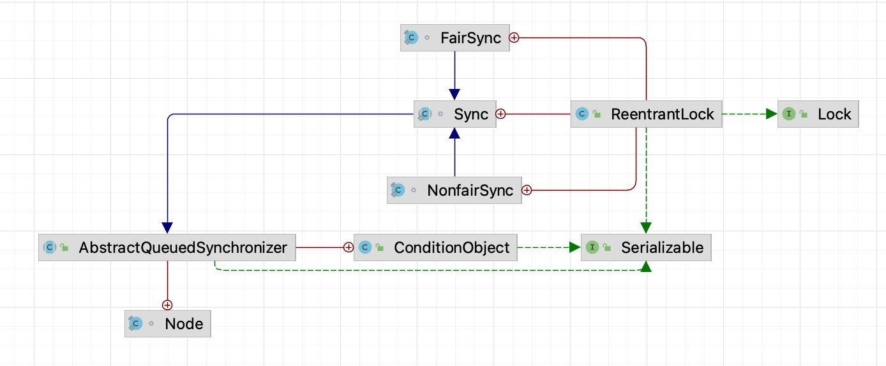

ReentrantLock 里面维护了一个**「同步器类」**，这个同步器类就是继承于抽象父类 `AbstractQueuedSynchronizer`，但这个同步器类 `Sync` 也是抽象的，里面有两个具体的实现：

- `FairSync` 公平锁
- `NonFairSync` 非公平锁

默认情况下，**ReentrantLock 使用的是非公平锁**：

```java
/** Synchronizer providing all implementation mechanics */
private final Sync sync;

public ReentrantLock() {
    sync = new NonfairSync();
}
```

### 2.1 非公平锁实现原理

非公平锁类，继承了 ReentrantLock 的同步器 Sync：

```java
static final class NonfairSync extends Sync {
    private static final long serialVersionUID = 7316153563782823691L;

    /**
     * Performs lock.  Try immediate barge, backing up to normal
     * acquire on failure.
     */
    final void lock() {
      	// 0 代表未加锁，1 代表加锁
      	// 首先尝试使用 CAS 修改 AQS 中的 state
        if (compareAndSetState(0, 1))
          	// 修改成功，则设置 Owner
            setExclusiveOwnerThread(Thread.currentThread());
        else
          	// 否则，调用 acquire
            acquire(1);
    }

    protected final boolean tryAcquire(int acquires) {
        return nonfairTryAcquire(acquires);
    }
}
```

没有竞争时：

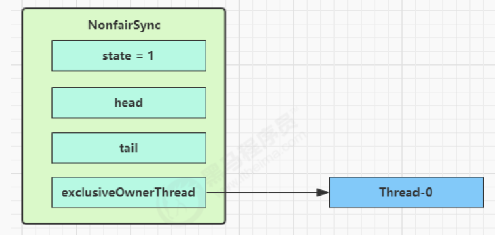

第一个竞争出现时：

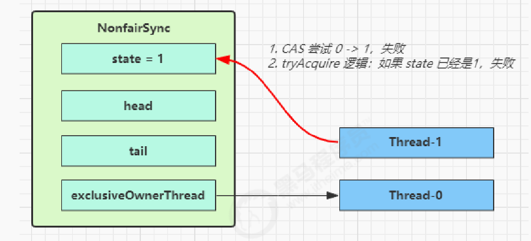

Thread-1 执行了：

- CAS 尝试将 state 由 0 改为 1，结果失败

- 进入 `tryAcquire` 逻辑，这时 state 已经是1，结果仍然失败

- 接下来进入 `addWaiter` 逻辑，构造 Node 队列

  - 图中黄色三角表示该 Node 的 waitStatus 状态，其中 0 为默认正常状态
  - Node 的创建是懒惰的
  - 其中 **第一个 Node 称为 Dummy（哑元）或哨兵，用来占位，并不关联线程**

  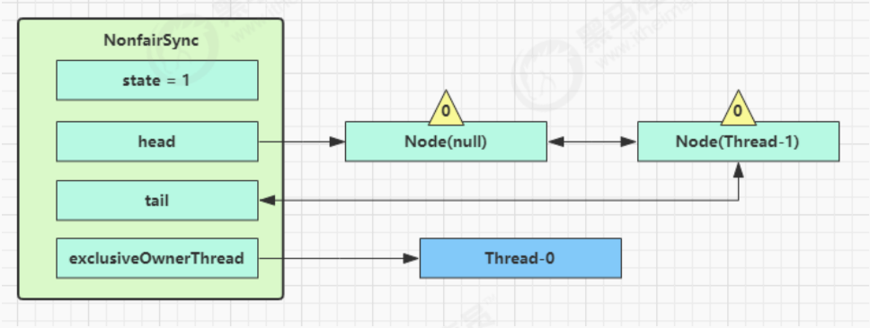

- 当前线程进入 `acquireQueued` 逻辑

  ```java
  final boolean acquireQueued(final Node node, int arg) {
      boolean failed = true;
      try {
          boolean interrupted = false;
        	// 死循环
          for (;;) {
              final Node p = node.predecessor();
              if (p == head && tryAcquire(arg)) {
                  setHead(node);
                  p.next = null; // help GC
                  failed = false;
                  return interrupted;
              }
              if (shouldParkAfterFailedAcquire(p, node) &&
                  parkAndCheckInterrupt())
                  interrupted = true;
          }
      } finally {
          if (failed)
              cancelAcquire(node);
      }
  }
  ```

  - acquireQueued 会在一个死循环中不断尝试获得锁，失败后进入 park 阻塞

  - 如果自己是紧邻着 head（排第二位），那么再次 tryAcquire 尝试获取锁，当然这时 state 仍为 1，失败

  - 进入 `shouldParkAfterFailedAcquire` 逻辑，将前驱 node，即 head 的 waitStatus 改为 -1，这次返回 false

    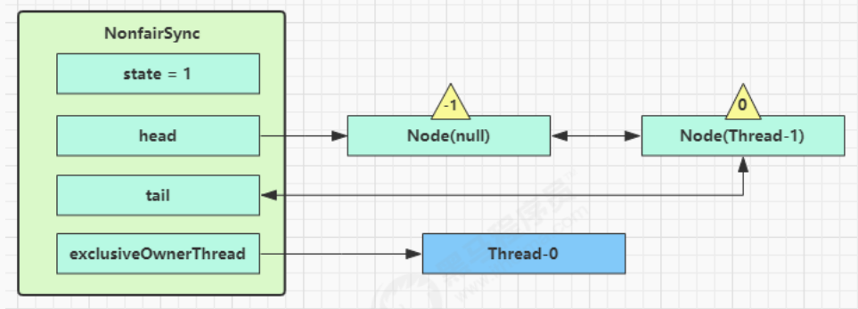

  - `shouldParkAfterFailedAcquire` 执行完毕回到 acquireQueued ，再次 tryAcquire 尝试获取锁，当然这时

    state 仍为 1，失败

  - 当再次进入 `shouldParkAfterFailedAcquire` 时，这时因为其前驱 node 的 waitStatus 已经是 -1，这次返回

    true

  - 进入 parkAndCheckInterrupt， Thread-1 park（灰色表示）

    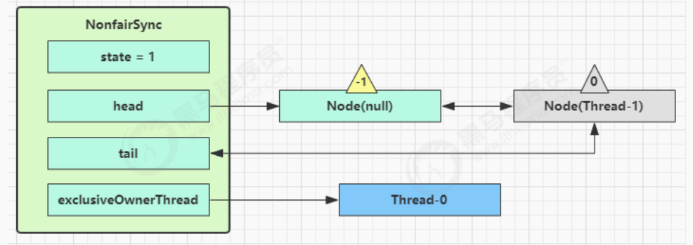

- 再次有多个线程经历上述过程竞争失败，变成这个样子

  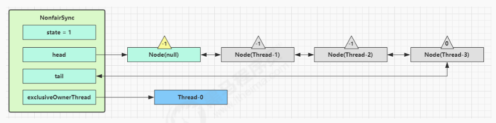

Thread-0 释放锁，进入 tryRelease 流程。

如果成功：

- 设置 exclusiveOwnerThread 为 null
- state = 0

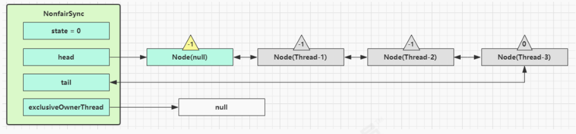

```java
public final boolean release(int arg) {
  	// 尝试释放锁
    if (tryRelease(arg)) {
        Node h = head;
        if (h != null && h.waitStatus != 0)
          	// 如果等待链表不为空，并且存在等待线程
          	// 唤醒后继线程
            unparkSuccessor(h);
        return true;
    }
    return false;
}
```

当前队列不为 null，并且 head 的 `waitStatus = -1` ，进入 `unparkSuccessor` 流程：

- 找到队列中离 head 最近的一个 Node（没取消的），unpark 恢复其运行，本例中即为 Thread-1

- 回到 Thread-1 的 acquireQueued 流程

  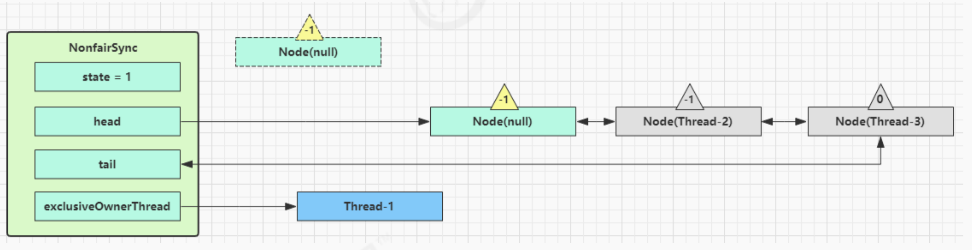

**如果加锁成功（没有竞争）**，会设置：

- exclusiveOwnerThread 为 Thread-1，state = 1
- head 指向刚刚 Thread-1 所在的 Node，该 Node 清空 Thread
- 原本的 head 因为从链表断开，而可被垃圾回收

**如果这时候有其它线程来竞争（非公平的体现）**，例如这时有 Thread-4 来了：

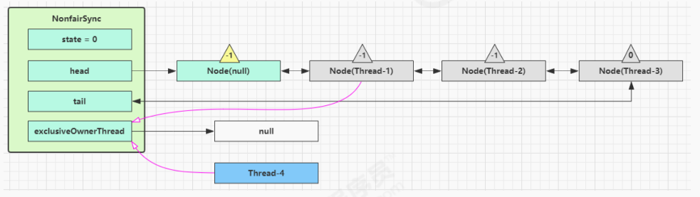

如果不巧又被 Thread-4 占了先：

- Thread-4 被设置为 exclusiveOwnerThread，state = 1
- Thread-1 再次进入 acquireQueued 流程，获取锁失败，重新进入 park 阻塞

### 2.2 可重入原理

重入加锁过程：

```java
abstract static class Sync extends AbstractQueuedSynchronizer {
  
  // .....
  
  /**
   * Performs non-fair tryLock.  tryAcquire is implemented in
   * subclasses, but both need nonfair try for trylock method.
   */
  // acquires 传过来的是整型参数 1，意味着加锁
  final boolean nonfairTryAcquire(int acquires) {
      // 获得当前线程
      final Thread current = Thread.currentThread();
      // 检查 AQS 的 state 是否为 0
      int c = getState();
      // 如果是 0，说明当前没有人获得锁
      if (c == 0) {
          // 尝试使用 CAS 修改状态，进行加锁
          if (compareAndSetState(0, acquires)) {
              // 设置 Owner 
              setExclusiveOwnerThread(current);
              // 加锁成功
              return true;
          }
      }
      // 重入判断，如果当前线程等于当前的 Owner
      else if (current == getExclusiveOwnerThread()) {
          // 锁重入
          // 让 AQS 里面的 state 字段 +1
          int nextc = c + acquires;
          if (nextc < 0) // overflow
              // 如果为负数，溢出了
              throw new Error("Maximum lock count exceeded");
          // 设置 state 状态
          setState(nextc);
          // 加锁成功
          return true;
      }

      // 否则都失败
      return false;
  }
}
```

重入释放锁：

```java
abstract static class Sync extends AbstractQueuedSynchronizer {
  
  // ...
  
  protected final boolean tryRelease(int releases) {
      // state --
      int c = getState() - releases;
      if (Thread.currentThread() != getExclusiveOwnerThread())
          throw new IllegalMonitorStateException();
      boolean free = false;
      // 只有 state = 0 时，才释放锁成功
      if (c == 0) {
          free = true;
          // 设置 Owner 为 null
          setExclusiveOwnerThread(null);
      }
      // 修改状态
      setState(c);
      return free;
  }
}
```

### 2.3 不可打断原理

#### 不可打断模式

默认情况是不可打断的。在此模式下，**即使它被打断，仍会驻留在 AQS 队列中，一直要等到获得锁后方能得知自己被打断了** 。

```java
/**
 * Convenience method to park and then check if interrupted
 *
 * @return {@code true} if interrupted
 */
private final boolean parkAndCheckInterrupt() {
  	// 如果打断标记已经是 true，
    LockSupport.park(this);
  	// interrupted 会清除打断标记
    return Thread.interrupted();
}

/**
 * 以独占不可中断模式 获取队列中已经存在的线程 。用于条件等待方法以及获取。
 */
final boolean acquireQueued(final Node node, int arg) {
    boolean failed = true;
    try {
        boolean interrupted = false;
        for (;;) {
          	// 得到当前进程的前驱节点
            final Node p = node.predecessor();
          	// 尝试获取锁
            if (p == head && tryAcquire(arg)) {
              	// 获取锁成功
                setHead(node);
                p.next = null; // help GC
                failed = false;
              	// 还是需要获取锁之后，才返回打断状态
                return interrupted;
            }
          	// 获取锁失败，继续 park
            if (shouldParkAfterFailedAcquire(p, node) &&
                parkAndCheckInterrupt())
              	// 如果争抢失败，被打断，打断状态仍为 true
                interrupted = true;
        }
    } finally {
        if (failed)
            cancelAcquire(node);
    }
}
```

#### 可打断模式

```java
// 可被打断的尝试获取锁
public final void acquireInterruptibly(int arg) throws InterruptedException {
    if (Thread.interrupted())
        throw new InterruptedException();
    if (!tryAcquire(arg))
      	// 如果没有获得锁，则进入（）
        doAcquireInterruptibly(arg);
}

// 可打断的获取锁流程
private void doAcquireInterruptibly(int arg) throws InterruptedException {
    final Node node = addWaiter(Node.EXCLUSIVE);
    boolean failed = true;
    try {
        for (;;) {
            final Node p = node.predecessor();
            if (p == head && tryAcquire(arg)) {
                setHead(node);
                p.next = null; // help GC
                failed = false;
                return;
            }
            if (shouldParkAfterFailedAcquire(p, node) &&
                parkAndCheckInterrupt())
              	// 区别在这，如果被唤醒，直接抛异常
              	// 退出 for 循环
                throw new InterruptedException();
        }
    } finally {
        if (failed)
            cancelAcquire(node);
    }
}
```

### 2.4 公平锁原理

#### 公平锁

怎么实现公平？排队，有资源的时候，看看有没有别人排在自己前面（前面有没有队伍），没有才去抢资源。

```java
// 与非公平锁主要区别在于 tryAcquire 方法的实现
protected final boolean tryAcquire(int acquires) {
    final Thread current = Thread.currentThread();
    int c = getState();
    if (c == 0) {
        // 先检查 AQS 队列中是否有前驱节点, 没有才去竞争
        if (!hasQueuedPredecessors() && compareAndSetState(0, acquires)) {
            setExclusiveOwnerThread(current);
            return true;
        }
    }
    else if (current == getExclusiveOwnerThread()) {
        int nextc = c + acquires;
        if (nextc < 0)
            throw new Error("Maximum lock count exceeded");
        setState(nextc);
        return true;
    }
    return false;
}
```

#### 非公平锁

非公平，就是不管有没有队，不管前面有没有人，直接抢资源

```java
final boolean nonfairTryAcquire(int acquires) {
    final Thread current = Thread.currentThread();
    int c = getState();
    if (c == 0) {
        if (compareAndSetState(0, acquires)) {
          	// 直接 CAS 抢资源，不管有没有队列，不去检查
            setExclusiveOwnerThread(current);
            return true;
        }
    }
    else if (current == getExclusiveOwnerThread()) {
        int nextc = c + acquires;
        if (nextc < 0) // overflow
            throw new Error("Maximum lock count exceeded");
        setState(nextc);
        return true;
    }
    return false;
}
```

### 2.5 条件变量实现原理

每个条件变量其实就对应着一个 **等待队列**，其实现类是 `ConditionObject` 。

> 作用相当于，`Synchronized` 中的 `waitSet` 

- 条件不满足，去 await 流程
- 当条件满足了，去 signal 唤醒

#### await流程

```java
public final void await() throws InterruptedException {
    if (Thread.interrupted())
        throw new InterruptedException();
  	// 加入条件变量链表
    Node node = addConditionWaiter();
  	// fullyRelease 考虑到有可能有重入，一次性释放完
  	// 在释放的同时，unpark 下一个节点
    int savedState = fullyRelease(node);
    int interruptMode = 0;
    while (!isOnSyncQueue(node)) {
      	// 把自己当前线程阻塞住了，park
        LockSupport.park(this);
        if ((interruptMode = checkInterruptWhileWaiting(node)) != 0)
            break;
    }
    if (acquireQueued(node, savedState) && interruptMode != THROW_IE)
        interruptMode = REINTERRUPT;
    if (node.nextWaiter != null) // clean up if cancelled
        unlinkCancelledWaiters();
    if (interruptMode != 0)
        reportInterruptAfterWait(interruptMode);
}
```

开始 Thread-0 持有锁，调用 await，进入 ConditionObject 的 addConditionWaiter 流程：

- 创建新的 Node 状态为 **-2**（ `Node.CONDITION` ），关联 Thread-0，加入等待队列尾部

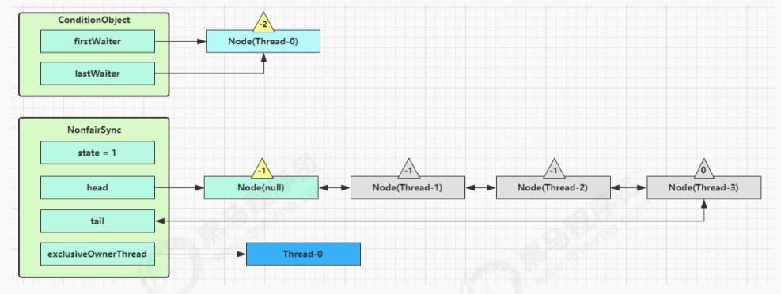

- 接下来进入 AQS 的 `fullyRelease` 流程，释放同步器上的锁

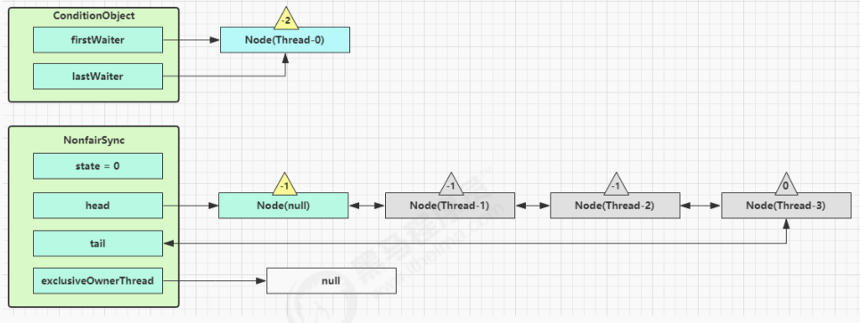

- `unpark` AQS 队列中的下一个节点，竞争锁，假设没有其他竞争线程，那么 Thread-1 竞争成功

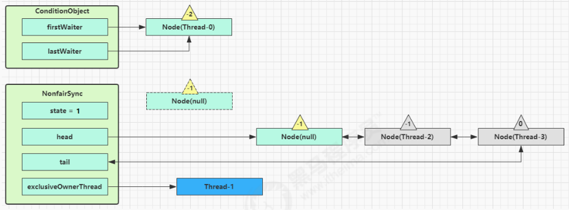

- `park` 阻塞 Thread-0

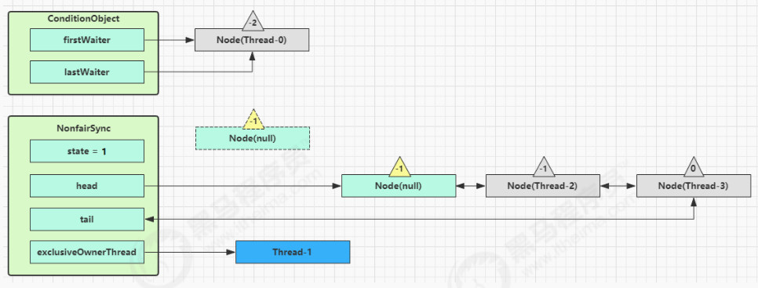

#### signal流程

```java
public final void signal() {
    if (!isHeldExclusively())
      	// 如果不是锁的持有者调用的 signal
      	// 只有锁的持有者才能唤醒，否则抛异常
        throw new IllegalMonitorStateException();
  	// 找条件变量中队首元素
    Node first = firstWaiter;
    if (first != null)
      	// 如果队首不为空，则发 signal
        doSignal(first);
}

private void doSignal(AbstractQueuedSynchronizer.Node first) {
        do {
            if ( (firstWaiter = first.nextWaiter) == null)
                lastWaiter = null;
          	// 把队首元素从条件变量链表中断开
            first.nextWaiter = null;
          	// transferForSignal 尝试把当前节点，转移到竞争锁的 AQS 队列中
        } while (!transferForSignal(first) &&
                 // 如果转移失败，则唤醒 frist 的下一个节点
                (first = firstWaiter) != null);
}
```

假设 Thread-1 要来唤醒 Thread-0

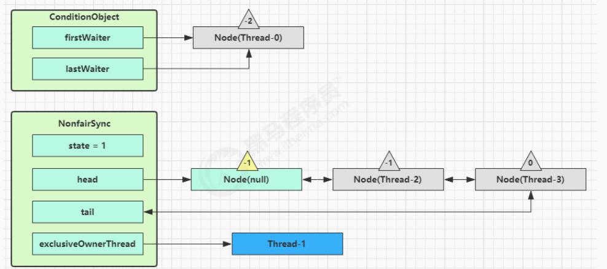

进入 ConditionObject 的 `doSignal` 流程，取得等待队列中第一个 Node，即 Thread-0 所在 Node

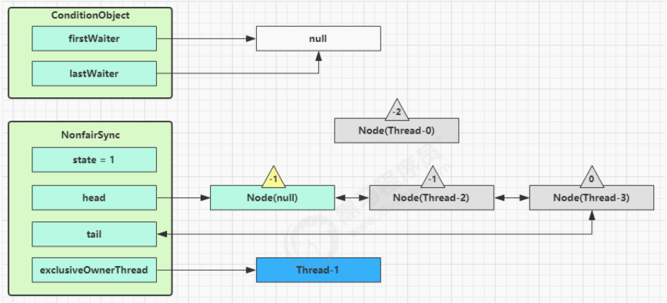

执行 `transferForSignal` 流程，**将该 Node 加入 AQS 队列尾部**，将 Thread-0 的 waitStatus 改为 0，Thread-3 的waitStatus 改为 -1

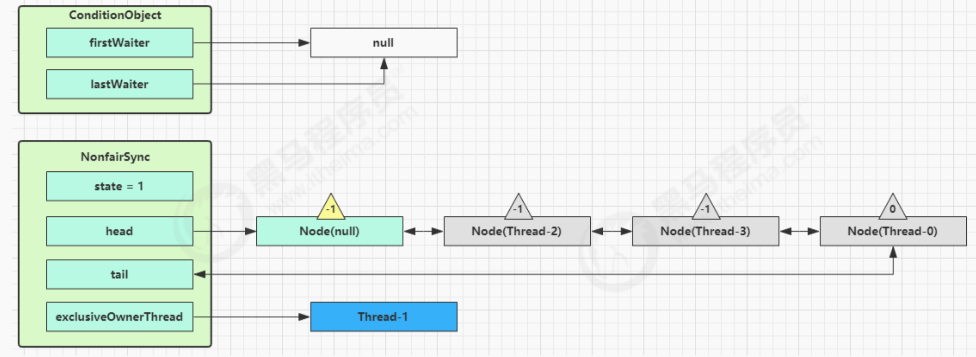

Thread-1 释放锁，进入 unlock 流程，略


