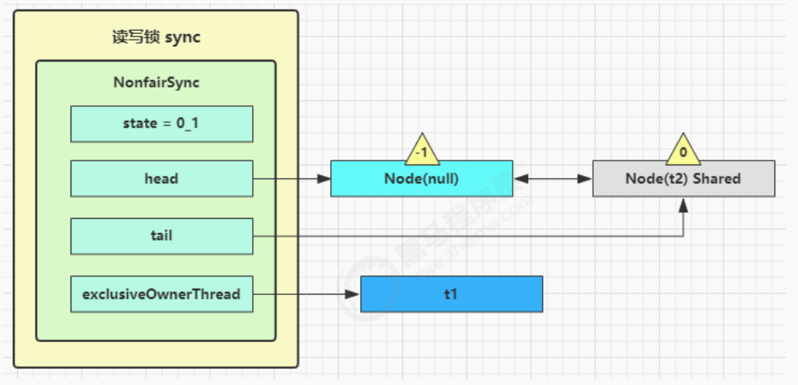

# 【JUC】J.U.C

JUC指的是，Java 并发工具包：`java.util.concurrent` 

## 1 AQS原理

全称是 `AbstractQueuedSynchronizer` ，是 **阻塞式锁** 和相关的同步器工具的框架。

特点：

- 用 `state` 属性来表示资源的状态（分独**「占模式」**和**「共享模式」**）

  ```java
  private volatile int state;
  ```

  - **子类需要定义如何维护这个状态**，控制如何获取锁和释放锁
  - `getState`： 获取 state 状态
  - `setState`： 设置 state 状态
  - `compareAndSetState`： cas 机制设置 state 状态
  - **独占模式是只有一个线程能够访问资源，而共享模式可以允许多个线程访问资源**

- 提供了基于 FIFO 的 **「等待队列」**，类似于 Monitor 的 EntryList

- **「条件变量」**来实现等待、唤醒机制，支持多个条件变量，类似于 Monitor 的 WaitSet

子类主要实现这样一些方法（默认抛出 UnsupportedOperationException）：

- tryAcquire
- tryRelease
- tryAcquireShared
- tryReleaseShared
- isHeldExclusively

### 实现不可重入锁

首先自定义 **同步器** ：

```java
final class MySync extends AbstractQueuedSynchronizer {
  	
  	// 自定义子类同步器 MySync，继承于 AbstractQueuedSynchronizer
  	// 0：无锁，1：加锁
  	
    @Override
    protected boolean tryAcquire(int acquires) {
        if (acquires == 1){
            if (compareAndSetState(0, 1)) {
              	// 加上锁，并设置 owner 为当前线程
                setExclusiveOwnerThread(Thread.currentThread());
                return true;
            }
        }
        return false;
    }
    @Override
    protected boolean tryRelease(int acquires) {
        if(acquires == 1) {
            if(getState() == 0) {
                throw new IllegalMonitorStateException();
            }
          	// 设置 owner 为 null
            setExclusiveOwnerThread(null);
          	// 解锁
            setState(0);
            return true;
        }
        return false;
    }
    protected Condition newCondition() {
        return new ConditionObject();
    }
  
  	// 是否持有独占锁
    @Override
    protected boolean isHeldExclusively() {
        return getState() == 1; 
    }
}
```

自定义锁：

```java
class MyLock implements Lock {
  	// 上面的自定义的同步器
    static MySync sync = new MySync();
    @Override
    // 尝试，不成功，进入等待队列
    public void lock() {
        sync.acquire(1);
    }
    @Override
    // 尝试，不成功，进入等待队列，可打断
    public void lockInterruptibly() throws InterruptedException {
        sync.acquireInterruptibly(1);
    }
    @Override
    // 尝试一次，不成功返回，不进入队列
    public boolean tryLock() {
        return sync.tryAcquire(1);
    }
    @Override
    // 尝试，不成功，进入等待队列，有时限
    public boolean tryLock(long time, TimeUnit unit) throws InterruptedException {
        return sync.tryAcquireNanos(1, unit.toNanos(time));
    }
    @Override
    // 释放锁
    public void unlock() {
        sync.release(1);
    }
    @Override
    // 生成条件变量
    public Condition newCondition() {
        return sync.newCondition();
    }
}
```

## 2 ReentrantLock原理


ReentrantLock 里面维护了一个**「同步器类」**，这个同步器类就是继承于抽象父类 `AbstractQueuedSynchronizer`，但这个同步器类 `Sync` 也是抽象的，里面有两个具体的实现：

- `FairSync` 公平锁
- `NonFairSync` 非公平锁

默认情况下，**ReentrantLock 使用的是非公平锁**：

```java
/** Synchronizer providing all implementation mechanics */
private final Sync sync;

public ReentrantLock() {
    sync = new NonfairSync();
}
```

### 2.1 非公平锁实现原理

非公平锁类，继承了 ReentrantLock 的同步器 Sync：

```java
static final class NonfairSync extends Sync {
    private static final long serialVersionUID = 7316153563782823691L;

    /**
     * Performs lock.  Try immediate barge, backing up to normal
     * acquire on failure.
     */
    final void lock() {
      	// 0 代表未加锁，1 代表加锁
      	// 首先尝试使用 CAS 修改 AQS 中的 state
        if (compareAndSetState(0, 1))
          	// 修改成功，则设置 Owner
            setExclusiveOwnerThread(Thread.currentThread());
        else
          	// 否则，调用 acquire
            acquire(1);
    }

    protected final boolean tryAcquire(int acquires) {
        return nonfairTryAcquire(acquires);
    }
}
```

没有竞争时：


第一个竞争出现时：


Thread-1 执行了：

- CAS 尝试将 state 由 0 改为 1，结果失败

- 进入 `tryAcquire` 逻辑，这时 state 已经是1，结果仍然失败

- 接下来进入 `addWaiter` 逻辑，构造 Node 队列

  - 图中黄色三角表示该 Node 的 waitStatus 状态，其中 0 为默认正常状态
  - Node 的创建是懒惰的
  - 其中 **第一个 Node 称为 Dummy（哑元）或哨兵，用来占位，并不关联线程**

  

- 当前线程进入 `acquireQueued` 逻辑

  ```java
  final boolean acquireQueued(final Node node, int arg) {
      boolean failed = true;
      try {
          boolean interrupted = false;
        	// 死循环
          for (;;) {
              final Node p = node.predecessor();
              if (p == head && tryAcquire(arg)) {
                  setHead(node);
                  p.next = null; // help GC
                  failed = false;
                  return interrupted;
              }
              if (shouldParkAfterFailedAcquire(p, node) &&
                  parkAndCheckInterrupt())
                  interrupted = true;
          }
      } finally {
          if (failed)
              cancelAcquire(node);
      }
  }
  ```

  - acquireQueued 会在一个死循环中不断尝试获得锁，失败后进入 park 阻塞

  - 如果自己是紧邻着 head（排第二位），那么再次 tryAcquire 尝试获取锁，当然这时 state 仍为 1，失败

  - 进入 `shouldParkAfterFailedAcquire` 逻辑，将前驱 node，即 head 的 waitStatus 改为 -1，这次返回 false

    

  - `shouldParkAfterFailedAcquire` 执行完毕回到 acquireQueued ，再次 tryAcquire 尝试获取锁，当然这时

    state 仍为 1，失败

  - 当再次进入 `shouldParkAfterFailedAcquire` 时，这时因为其前驱 node 的 waitStatus 已经是 -1，这次返回

    true

  - 进入 parkAndCheckInterrupt， Thread-1 park（灰色表示）

    

- 再次有多个线程经历上述过程竞争失败，变成这个样子

  

Thread-0 释放锁，进入 tryRelease 流程。

如果成功：

- 设置 exclusiveOwnerThread 为 null
- state = 0


```java
public final boolean release(int arg) {
  	// 尝试释放锁
    if (tryRelease(arg)) {
        Node h = head;
        if (h != null && h.waitStatus != 0)
          	// 如果等待链表不为空，并且存在等待线程
          	// 唤醒后继线程
            unparkSuccessor(h);
        return true;
    }
    return false;
}
```

当前队列不为 null，并且 head 的 `waitStatus = -1` ，进入 `unparkSuccessor` 流程：

- 找到队列中离 head 最近的一个 Node（没取消的），unpark 恢复其运行，本例中即为 Thread-1

- 回到 Thread-1 的 acquireQueued 流程

  

**如果加锁成功（没有竞争）**，会设置：

- exclusiveOwnerThread 为 Thread-1，state = 1
- head 指向刚刚 Thread-1 所在的 Node，该 Node 清空 Thread
- 原本的 head 因为从链表断开，而可被垃圾回收

**如果这时候有其它线程来竞争（非公平的体现）**，例如这时有 Thread-4 来了：


如果不巧又被 Thread-4 占了先：

- Thread-4 被设置为 exclusiveOwnerThread，state = 1
- Thread-1 再次进入 acquireQueued 流程，获取锁失败，重新进入 park 阻塞

### 2.2 可重入原理

重入加锁过程：

```java
abstract static class Sync extends AbstractQueuedSynchronizer {
  
  // .....
  
  /**
   * Performs non-fair tryLock.  tryAcquire is implemented in
   * subclasses, but both need nonfair try for trylock method.
   */
  // acquires 传过来的是整型参数 1，意味着加锁
  final boolean nonfairTryAcquire(int acquires) {
      // 获得当前线程
      final Thread current = Thread.currentThread();
      // 检查 AQS 的 state 是否为 0
      int c = getState();
      // 如果是 0，说明当前没有人获得锁
      if (c == 0) {
          // 尝试使用 CAS 修改状态，进行加锁
          if (compareAndSetState(0, acquires)) {
              // 设置 Owner 
              setExclusiveOwnerThread(current);
              // 加锁成功
              return true;
          }
      }
      // 重入判断，如果当前线程等于当前的 Owner
      else if (current == getExclusiveOwnerThread()) {
          // 锁重入
          // 让 AQS 里面的 state 字段 +1
          int nextc = c + acquires;
          if (nextc < 0) // overflow
              // 如果为负数，溢出了
              throw new Error("Maximum lock count exceeded");
          // 设置 state 状态
          setState(nextc);
          // 加锁成功
          return true;
      }

      // 否则都失败
      return false;
  }
}
```

重入释放锁：

```java
abstract static class Sync extends AbstractQueuedSynchronizer {
  
  // ...
  
  protected final boolean tryRelease(int releases) {
      // state --
      int c = getState() - releases;
      if (Thread.currentThread() != getExclusiveOwnerThread())
          throw new IllegalMonitorStateException();
      boolean free = false;
      // 只有 state = 0 时，才释放锁成功
      if (c == 0) {
          free = true;
          // 设置 Owner 为 null
          setExclusiveOwnerThread(null);
      }
      // 修改状态
      setState(c);
      return free;
  }
}
```

### 2.3 不可打断原理

#### 不可打断模式

默认情况是不可打断的。在此模式下，**即使它被打断，仍会驻留在 AQS 队列中，一直要等到获得锁后方能得知自己被打断了** 。

```java
/**
 * Convenience method to park and then check if interrupted
 *
 * @return {@code true} if interrupted
 */
private final boolean parkAndCheckInterrupt() {
  	// 如果打断标记已经是 true，
    LockSupport.park(this);
  	// interrupted 会清除打断标记
    return Thread.interrupted();
}

/**
 * 以独占不可中断模式 获取队列中已经存在的线程 。用于条件等待方法以及获取。
 */
final boolean acquireQueued(final Node node, int arg) {
    boolean failed = true;
    try {
        boolean interrupted = false;
        for (;;) {
          	// 得到当前进程的前驱节点
            final Node p = node.predecessor();
          	// 尝试获取锁
            if (p == head && tryAcquire(arg)) {
              	// 获取锁成功
                setHead(node);
                p.next = null; // help GC
                failed = false;
              	// 还是需要获取锁之后，才返回打断状态
                return interrupted;
            }
          	// 获取锁失败，继续 park
            if (shouldParkAfterFailedAcquire(p, node) &&
                parkAndCheckInterrupt())
              	// 如果争抢失败，被打断，打断状态仍为 true
                interrupted = true;
        }
    } finally {
        if (failed)
            cancelAcquire(node);
    }
}
```

#### 可打断模式

```java
// 可被打断的尝试获取锁
public final void acquireInterruptibly(int arg) throws InterruptedException {
    if (Thread.interrupted())
        throw new InterruptedException();
    if (!tryAcquire(arg))
      	// 如果没有获得锁，则进入（）
        doAcquireInterruptibly(arg);
}

// 可打断的获取锁流程
private void doAcquireInterruptibly(int arg) throws InterruptedException {
    final Node node = addWaiter(Node.EXCLUSIVE);
    boolean failed = true;
    try {
        for (;;) {
            final Node p = node.predecessor();
            if (p == head && tryAcquire(arg)) {
                setHead(node);
                p.next = null; // help GC
                failed = false;
                return;
            }
            if (shouldParkAfterFailedAcquire(p, node) &&
                parkAndCheckInterrupt())
              	// 区别在这，如果被唤醒，直接抛异常
              	// 退出 for 循环
                throw new InterruptedException();
        }
    } finally {
        if (failed)
            cancelAcquire(node);
    }
}
```

### 2.4 公平锁原理

#### 公平锁

怎么实现公平？排队，有资源的时候，看看有没有别人排在自己前面（前面有没有队伍），没有才去抢资源。

```java
// 与非公平锁主要区别在于 tryAcquire 方法的实现
protected final boolean tryAcquire(int acquires) {
    final Thread current = Thread.currentThread();
    int c = getState();
    if (c == 0) {
        // 先检查 AQS 队列中是否有前驱节点, 没有才去竞争
        if (!hasQueuedPredecessors() && compareAndSetState(0, acquires)) {
            setExclusiveOwnerThread(current);
            return true;
        }
    }
    else if (current == getExclusiveOwnerThread()) {
        int nextc = c + acquires;
        if (nextc < 0)
            throw new Error("Maximum lock count exceeded");
        setState(nextc);
        return true;
    }
    return false;
}
```

#### 非公平锁

非公平，就是不管有没有队，不管前面有没有人，直接抢资源

```java
final boolean nonfairTryAcquire(int acquires) {
    final Thread current = Thread.currentThread();
    int c = getState();
    if (c == 0) {
        if (compareAndSetState(0, acquires)) {
          	// 直接 CAS 抢资源，不管有没有队列，不去检查
            setExclusiveOwnerThread(current);
            return true;
        }
    }
    else if (current == getExclusiveOwnerThread()) {
        int nextc = c + acquires;
        if (nextc < 0) // overflow
            throw new Error("Maximum lock count exceeded");
        setState(nextc);
        return true;
    }
    return false;
}
```

### 2.5 条件变量实现原理

每个条件变量其实就对应着一个 **等待队列**，其实现类是 `ConditionObject` 。

> 作用相当于，`Synchronized` 中的 `waitSet` 

- 条件不满足，去 await 流程
- 当条件满足了，去 signal 唤醒

#### await流程

```java
public final void await() throws InterruptedException {
    if (Thread.interrupted())
        throw new InterruptedException();
  	// 加入条件变量链表
    Node node = addConditionWaiter();
  	// fullyRelease 考虑到有可能有重入，一次性释放完
  	// 在释放的同时，unpark 下一个节点
    int savedState = fullyRelease(node);
    int interruptMode = 0;
    while (!isOnSyncQueue(node)) {
      	// 把自己当前线程阻塞住了，park
        LockSupport.park(this);
        if ((interruptMode = checkInterruptWhileWaiting(node)) != 0)
            break;
    }
    if (acquireQueued(node, savedState) && interruptMode != THROW_IE)
        interruptMode = REINTERRUPT;
    if (node.nextWaiter != null) // clean up if cancelled
        unlinkCancelledWaiters();
    if (interruptMode != 0)
        reportInterruptAfterWait(interruptMode);
}
```

开始 Thread-0 持有锁，调用 await，进入 ConditionObject 的 addConditionWaiter 流程：

- 创建新的 Node 状态为 **-2**（ `Node.CONDITION` ），关联 Thread-0，加入等待队列尾部


- 接下来进入 AQS 的 `fullyRelease` 流程，释放同步器上的锁


- `unpark` AQS 队列中的下一个节点，竞争锁，假设没有其他竞争线程，那么 Thread-1 竞争成功


- `park` 阻塞 Thread-0


#### signal流程

```java
public final void signal() {
    if (!isHeldExclusively())
      	// 如果不是锁的持有者调用的 signal
      	// 只有锁的持有者才能唤醒，否则抛异常
        throw new IllegalMonitorStateException();
  	// 找条件变量中队首元素
    Node first = firstWaiter;
    if (first != null)
      	// 如果队首不为空，则发 signal
        doSignal(first);
}

private void doSignal(AbstractQueuedSynchronizer.Node first) {
        do {
            if ( (firstWaiter = first.nextWaiter) == null)
                lastWaiter = null;
          	// 把队首元素从条件变量链表中断开
            first.nextWaiter = null;
          	// transferForSignal 尝试把当前节点，转移到竞争锁的 AQS 队列中
        } while (!transferForSignal(first) &&
                 // 如果转移失败，则唤醒 frist 的下一个节点
                (first = firstWaiter) != null);
}
```

假设 Thread-1 要来唤醒 Thread-0


进入 ConditionObject 的 `doSignal` 流程，取得等待队列中第一个 Node，即 Thread-0 所在 Node


执行 `transferForSignal` 流程，**将该 Node 加入 AQS 队列尾部**，将 Thread-0 的 waitStatus 改为 0，Thread-3 的waitStatus 改为 -1


Thread-1 释放锁，进入 unlock 流程，略。

## 3 读写锁

### 3.1 ReentrantReadWriteLock

#### 应用

当读操作远远高于写操作时，这时候使用 **读写锁** 让 **读-读** 可以并发，提高性能。 

提供一个 **数据容器类** 内部分别使用读锁保护数据的 `read()` 方法，写锁保护数据的 `write()` 方法，例如：

```java
class DataContainer {
    private Object data;
    private ReentrantReadWriteLock rw = new ReentrantReadWriteLock();
    private ReentrantReadWriteLock.ReadLock r = rw.readLock();
    private ReentrantReadWriteLock.WriteLock w = rw.writeLock();
  	
  	// 读取操作，使用读锁 r 保护
    public Object read() {
        log.debug("获取读锁...");
        r.lock();
        try {
            log.debug("读取");
            sleep(1);
            return data;
        } finally {
            log.debug("释放读锁..."); r.unlock();
        }
    }
  	// 写入操作，使用写锁 w 保护
    public void write() {
        log.debug("获取写锁...");
        w.lock();
        try {
            log.debug("写入");
            sleep(1);
        } finally {
            log.debug("释放写锁...");
            w.unlock();
        }
    }
}
```

测试**「读-读」**可以并发：

```java
DataContainer dataContainer = new DataContainer();
new Thread(() -> {
    dataContainer.read();
}, "t1").start();
new Thread(() -> {
    dataContainer.read();
}, "t2").start();
```


「读-写」是互斥的：


「写-写」是互斥的：


> 注意：
>
> - **读锁不支持条件变量**
> - **重入时升级不支持**：即「持有读锁」的情况下去「获取写锁」，会导致获取写锁永久等待
> - **重入时降级支持**：即「持有写锁」的情况下去「获取读锁」

#### 原理

「读写锁」用的是 **同一个 Sycn 同步器**，因此等待队列、state 等也是同一个！

1. `t1 w.lock，t2 r.lock`

```java
// 子类重写父类的方法：尝试加「写锁」
protected final boolean tryAcquire(int acquires) {
    Thread current = Thread.currentThread();
    int c = getState();
    int w = exclusiveCount(c);
    if (c != 0) {
      	// 表示有可能加了写锁或者读锁
      	// w == 0，表示现在有人加了 「读锁」，并且当前线程并没有获得过锁（读或写）
        if (w == 0 || current != getExclusiveOwnerThread())
          	// 加锁失败
            return false;
      	// 加写锁重入溢出
        if (w + exclusiveCount(acquires) > MAX_COUNT)
            throw new Error("Maximum lock count exceeded");
        // 重入写锁
        setState(c + acquires);
        return true;
    }
  	// 现在还没有加锁
    if (writerShouldBlock() ||
        !compareAndSetState(c, c + acquires))
      	// 如果 CAS 操作失败，则返回 false，加写锁失败
        return false;
  	// 加锁成功
    setExclusiveOwnerThread(current);
    return true;
}
```

- t1 成功上锁，流程与 ReentrantLock 加锁相比没有特殊之处，不同是写锁状态占了 state 的低 16 位，而读锁

  使用的是 state 的高 16 位 


- t2 执行 r.lock，这时进入读锁的 `sync.acquireShared(1)` 流程，首先会进入 tryAcquireShared 流程。如果有写锁占据，那么 tryAcquireShared 返回 -1 表示失败

  > tryAcquireShared 返回值表示: -1 表示失败；0 表示成功，但后继节点不会继续唤醒；正数表示成功，而且数值是还有几个后继节点需要唤醒，读写锁返回 1


```java
public final void acquireShared(int arg) {
    if (tryAcquireShared(arg) < 0)
        doAcquireShared(arg);
}

// 子类重写父类的方法：尝试加「读锁」
protected final int tryAcquireShared(int unused) {
  	// 获取当前线程、当前状态
    Thread current = Thread.currentThread();
    int c = getState();
  	// 检查当前资源状态是否被「写锁」独占，并且独占的线程不是当前线程
    if (exclusiveCount(c) != 0 &&
        getExclusiveOwnerThread() != current)
      	// 被别人独占了，自己加共享的「读锁」就失败了
      	// 案例中，t2 在这里返回 -1
        return -1;
    int r = sharedCount(c);
    if (!readerShouldBlock() &&
        r < MAX_COUNT &&
        compareAndSetState(c, c + SHARED_UNIT)) {
        if (r == 0) {
            firstReader = current;
            firstReaderHoldCount = 1;
        } else if (firstReader == current) {
            firstReaderHoldCount++;
        } else {
            HoldCounter rh = cachedHoldCounter;
            if (rh == null || rh.tid != getThreadId(current))
                cachedHoldCounter = rh = readHolds.get();
            else if (rh.count == 0)
                readHolds.set(rh);
            rh.count++;
        }
        return 1;
    }
    return fullTryAcquireShared(current);
}


```

- 这时会进入 sync.doAcquireShared(1) 流程，首先也是调用 addWaiter 添加节点，不同之处在于节点被设置为`Node.SHARED` 模式 **而非** `Node.EXCLUSIVE` 模式，**注意此时 t2 仍处于活跃状态**

```java
private void doAcquireShared(int arg) {
  	// 这里加入的节点状态是 Node.SHARED 共享
    final Node node = addWaiter(Node.SHARED);
    boolean failed = true;
    try {
        boolean interrupted = false;
        for (;;) {
            final Node p = node.predecessor();
            if (p == head) {
              	// 如果自己是老二，则再次尝试争抢锁
                int r = tryAcquireShared(arg);
              	// 争抢成功的逻辑：
                if (r >= 0) {
                    setHeadAndPropagate(node, r);
                    p.next = null; // help GC
                    if (interrupted)
                        selfInterrupt();
                    failed = false;
                    return;
                }
            }
          	// 竞争读锁失败
            if (shouldParkAfterFailedAcquire(p, node) &&
                parkAndCheckInterrupt())
                interrupted = true;
        }
    } finally {
        if (failed)
            cancelAcquire(node);
    }
}
```


- t2 会看看自己的节点是不是老二，如果是，还会再次调用 tryAcquireShared(1) 来尝试获取锁
- 如果没有成功，在 doAcquireShared 内 `for (;;)` 循环一次，把前驱节点的 waitStatus 改为 -1，再 `for (;;)` 循环一次尝试 tryAcquireShared(1) 如果还不成功，那么在 `parkAndCheckInterrupt()` 处 park

> 相当于，一个老二线程决定 `park` 之前，会 **尝试三次** 竞争锁！



2. `t3 r.lock，t4 w.lock`

这种状态下，假设又有 t3 加读锁和 t4 加写锁，这期间 t1 仍然持有锁，就变成了下面的样子:


3. `t1 w.unlock()`

这时会走到写锁的 `sync.release(1)` 流程，调用 `sync.tryRelease(1)` 成功，变成下面的样子：


```java
 public static class WriteLock implements Lock, java.io.Serializable {
   
   // 写锁的同步器
   private final Sync sync;

   // ReentrantReadWriteLock
   protected WriteLock(ReentrantReadWriteLock lock) {
     sync = lock.sync;
   }

  // 写锁释放
  public void unlock() {
      sync.release(1);
  }
   
  // 调用父类 AQS 
  public final boolean release(int arg) {
        if (tryRelease(arg)) {
          	// 如果释放成功
            Node h = head;
            if (h != null && h.waitStatus != 0)
              	// 唤醒后继节点
                unparkSuccessor(h);
            return true;
        }
        return false;
    }
   
   // 尝试释放锁
   protected final boolean tryRelease(int releases) {
      if (!isHeldExclusively())
          throw new IllegalMonitorStateException();
      int nextc = getState() - releases;
      boolean free = exclusiveCount(nextc) == 0;
      if (free)
        	// 释放锁成功，设置 Owner 为 null
          setExclusiveOwnerThread(null);
      setState(nextc);
      return free;
  }
	
   // ...
 
}
```

- 接下来执行唤醒流程 sync.unparkSuccessor，即让老二恢复运行，这时 t2 在 doAcquireShared 内  `parkAndCheckInterrupt()` 处恢复运行
- 这回再来一次 `for (;;)` 执行 `tryAcquireShared` 成功则让读锁计数加一


- 这时 t2 已经恢复运行，接下来 t2 调用 `setHeadAndPropagate(node, 1)` ，它原本所在节点被置为头节点


- 事情还没完，在 setHeadAndPropagate 方法内 **还会检查下一个节点是否是 shared** ，如果是则调用 `doReleaseShared()` 将 head 的状态从 -1 改为 0 并唤醒老二，这时 t3 在 `doAcquireShared` 内 `parkAndCheckInterrupt()` 处恢复运行


- 这回再来一次 `for (;;)` 执行 `tryAcquireShared` 成功则让读锁计数加一


- 这时 t3 已经恢复运行，接下来 t3 调用 `setHeadAndPropagate(node, 1)` ，它原本所在节点被置为头节点


- 下一个节点不是 `shared` 了，因此 **不会继续唤醒 t4** 所在节点

3. `t2 r.unlock，t3 r.unlock`

```java
// 读锁类
public static class ReadLock implements Lock, java.io.Serializable {
	
  // 读锁释放
  public void unlock() {
      sync.releaseShared(1);
  }
  
  // 释放锁
  public final boolean releaseShared(int arg) {
    	 // 尝试释放锁
       if (tryReleaseShared(arg)) {
           doReleaseShared();
           return true;
       }
       return false;
   }
    protected final boolean tryReleaseShared(int unused) {
      Thread current = Thread.currentThread();
      if (firstReader == current) {
          // assert firstReaderHoldCount > 0;
          if (firstReaderHoldCount == 1)
              firstReader = null;
          else
              firstReaderHoldCount--;
      } else {
          HoldCounter rh = cachedHoldCounter;
          if (rh == null || rh.tid != getThreadId(current))
              rh = readHolds.get();
          int count = rh.count;
          if (count <= 1) {
              readHolds.remove();
              if (count <= 0)
                  throw unmatchedUnlockException();
          }
          --rh.count;
      }
      for (;;) {
          int c = getState();
          int nextc = c - SHARED_UNIT;
          if (compareAndSetState(c, nextc))
              // Releasing the read lock has no effect on readers,
              // but it may allow waiting writers to proceed if
              // both read and write locks are now free.
              return nextc == 0;
      }
  }
  // ....
}
```

- t2 进入 `sync.releaseShared(1)` 中，调用 `tryReleaseShared(1)` 让计数减一，但由于 **计数state** 还不为零


- t3 进入 `sync.releaseShared(1)` 中，调用 `tryReleaseShared(1)` 让计数减一，这回计数为零了，进入 `doReleaseShared()` 将头节点从 -1 改为 0 并唤醒老二，即


- 之后 t4 在 `acquireQueued` 中 `parkAndCheckInterrupt` 处恢复运行，再次 `for (;;)` 这次自己是老二，并且没有其他竞争，`tryAcquire(1)` 成功，修改头结点，流程结束


#### 代码分析

1. 「**写锁**」加/解锁流程

```java
// 写锁类
public static class WriteLock implements Lock, java.io.Serializable {
    private static final long serialVersionUID = -4992448646407690164L;
  
  	// 同步器
    private final Sync sync;
		
  	// 同步器使用的是 ReentrantReadWriteLock 中的同步器
    protected WriteLock(ReentrantReadWriteLock lock) {
        sync = lock.sync;
    }
  	
  	// 上锁
		public void lock() {
      	// 调用同步器继承自 AQS 的方法 acquire 获取锁
    		sync.acquire(1);
		}
  	
  	// 释放锁
    public void unlock() {
      	sync.release(1);
  	}
  	// ...
}

// 非公平同步器
static final class NonfairSync extends Sync {
    // ... 省略无关代码

    // AQS 继承过来的方法, 方便阅读, 放在此处
    public final void acquire(int arg) {
        if (// 尝试获得写锁失败
            !tryAcquire(arg) &&
            // 将当前线程关联到一个 Node 对象上, 模式为独占模式
            // 进入 AQS 队列阻塞
             acquireQueued(addWaiter(Node.EXCLUSIVE), arg)) {
            selfInterrupt();
        }
    }

    // Sync 继承过来的方法, 方便阅读, 放在此处
    protected final boolean tryAcquire(int acquires) {
        // 获得低 16 位, 代表写锁的 state 计数
        Thread current = Thread.currentThread();
        int c = getState();int w = exclusiveCount(c);

        if (c != 0) {
            if (
                // c != 0 and w == 0 表示有读锁, 或者
                    w == 0 ||
                            // 如果 exclusiveOwnerThread 不是自己
                            current != getExclusiveOwnerThread()
            ) {
                // 获得锁失败
                return false;
            }
            // 写锁计数超过低 16 位, 报异常
            if (w + exclusiveCount(acquires) > MAX_COUNT)
                throw new Error("Maximum lock count exceeded");
            // 写锁重入, 获得锁成功
            setState(c + acquires);
            return true;
        }
        if (
            // 判断写锁是否该阻塞, 或者
                writerShouldBlock() ||
                        // 尝试更改计数失败
                        !compareAndSetState(c, c + acquires)
        ) {
            // 获得锁失败
            return false;
        }
        // 获得锁成功
        setExclusiveOwnerThread(current);
        return true;
    }
		
  	
  	// Sync 继承过来的方法, 方便阅读, 放在此处
    protected final boolean tryRelease(int releases) {
        if (!isHeldExclusively())
            throw new IllegalMonitorStateException();
        int nextc = getState() - releases;
      
        // 因为可重入的原因, 写锁计数为 0, 才算释放成功
        boolean free = exclusiveCount(nextc) == 0;
      
        if (free) {
          	// 设置 Owner
            setExclusiveOwnerThread(null);
        }
        setState(nextc);
        return free;
    }
  	
    // 非公平锁 writerShouldBlock 总是返回 false, 无需阻塞
    final boolean writerShouldBlock() {
        return false;
    }
}
```

2. 「读锁」加锁/释放锁

```java
public static class ReadLock implements Lock, java.io.Serializable {
  	private final Sync sync;


    protected ReadLock(ReentrantReadWriteLock lock) {
        sync = lock.sync;
    }
  	
  	// 读锁上锁
  	public void lock() {
        sync.acquireShared(1);
    }
  	
  	// 继承自 AQS 实现
  	public final void acquireShared(int arg) {
      	// tryAcquireShared 返回负数, 表示获取读锁失败
        if (tryAcquireShared(arg) < 0)
            doAcquireShared(arg);
    }
  	
  	// 继承自 Sync 实现
  	protected final int tryAcquireShared(int unused) {
        // 当前节点，当前状态
        Thread current = Thread.currentThread();
        int c = getState();
      
      	// 如果是其它线程持有写锁, 获取读锁失败
        if (exclusiveCount(c) != 0 &&
            getExclusiveOwnerThread() != current)
            return -1;
        int r = sharedCount(c);
      	
      	// 读锁不该阻塞(如果老二是写锁，读锁该阻塞), 并且
      	// 小于读锁计数, 并且
      	// 尝试增加计数成功
        if (!readerShouldBlock() &&
            r < MAX_COUNT &&
            compareAndSetState(c, c + SHARED_UNIT)) {
            if (r == 0) {
                firstReader = current;
                firstReaderHoldCount = 1;
            } else if (firstReader == current) {
                firstReaderHoldCount++;
            } else {
                HoldCounter rh = cachedHoldCounter;
                if (rh == null || rh.tid != getThreadId(current))
                    cachedHoldCounter = rh = readHolds.get();
                else if (rh.count == 0)
                    readHolds.set(rh);
                rh.count++;
            }
            return 1;
        }
        return fullTryAcquireShared(current);
    }
  
  	// 非公平锁 readerShouldBlock 看 AQS 队列中第一个节点是否是写锁
		// true 则该阻塞, false 则不阻塞
    final boolean readerShouldBlock() {
        return apparentlyFirstQueuedIsExclusive();
    }
 
}
```


