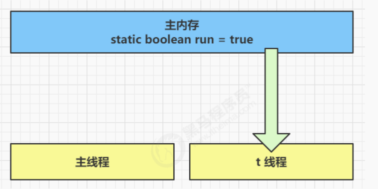
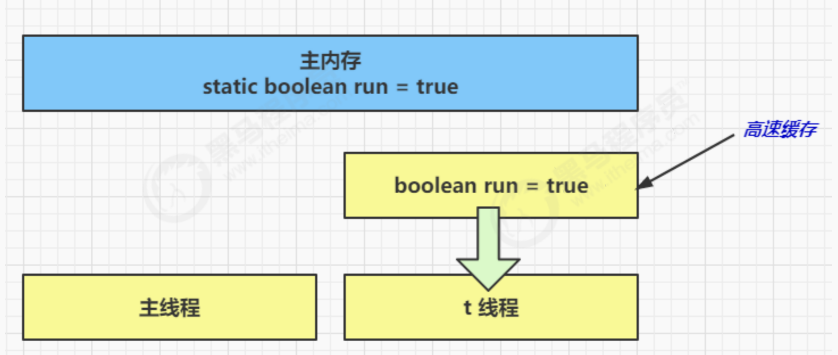
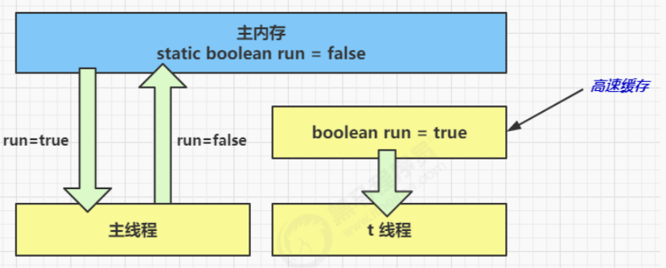

# 【JUC】Java内存模型

## 1 基本介绍

JMM 即 Java Memory Model，它定义了主存、工作内存抽象概念，底层对应着 CPU 寄存器、缓存、硬件内存、CPU 指令优化等。Java 语言在遵循内存模型的基础上推出了 **JMM 规范**，目的是 **解决由于多线程通过共享内存进行通信时，存在的本地内存数据不一致、编译器会对代码指令重排序、处理器会对代码乱序执行等带来的问题** 。

JMM 体现在以下几个方面：

- 原子性 - 保证指令不会受到线程上下文切换的影响
- 可见性 - 保证指令不会受 cpu 缓存的影响
- 有序性 - 保证指令不会受 cpu 指令并行优化的影响

## 2 三大特性

### 2.1 可见性

先来看一个现象，main 线程对 run 变量的修改对于 t 线程 **不可见** ，导致了 t 线程无法停止：

```java
static boolean run = true;

public static void main(String[] args) throws InterruptedException {

    Thread t = new Thread(()->{
        while(run){
            // ....
        }
    });
    t.start();
  
    sleep(1);
    run = false; // 线程t不会如预想的停下来
}
```

原因分析：

1. 初始状态，t 线程从主内存读取了 run 的值到 **工作内存** 。



2. 因为 t 线程要频繁从主内存中读取 run 的值，**JIT 编译器会将 run 的值缓存至自己工作内存中的高速缓存中** ，减少对主存中 run 的访问，提高效率。

   

3. 1 秒之后，main 线程修改了 run 的值，并同步至主存，而 t 是从自己工作内存中的高速缓存中读取这个变量的值，结果永远是旧值。

   

#### 解决方法：volatile 易变关键字

它可以用来修饰 **成员变量** 和 **静态成员变量** ，可以避免线程从自己的 **工作缓存** 中查找变量的值，必须到主存中获取它的值。

线程操作 volatile 变量都是 **直接操作主存** 。

```java
volatile static boolean run = true;
```

#### 解决方法：synchronized

但 synchronized 需要创建 monitor，比较重量级操作，性能较低。

```java
final static Object lock = new Object();
static boolean run = true;
public static void main(String[] args) throws InterruptedException {
    Thread t = new Thread(()->{
        while(true){
            synchronized (lock) {
                if(!run) {
                    break;
                }
            }
        }
    });
    t.start();

    sleep(1);
    synchronized (lock) {
        run = false;
    }
}
```

### 2.2 有序性

指令重排：JVM 会在不影响正确性的前提下，可以调整语句的执行顺序。

```java
static int i;
static int j;
// 在某个线程内执行如下赋值操作
i = ...;
j = ...;
```

可以看到，至于是先执行 i 还是 先执行 j ，对最终的结果不会产生影响。所以，上面代码真正执行时，既可以是：

```java
i++;
j++;
```

也可以是：

```java
j++;
i++;
```

这种特性称之为**『指令重排』**，多线程下『指令重排』会影响正确性。


