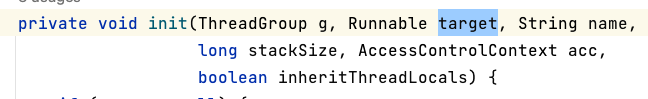
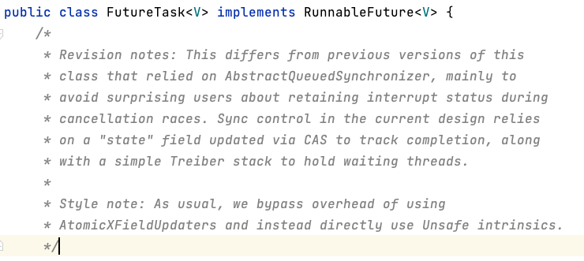
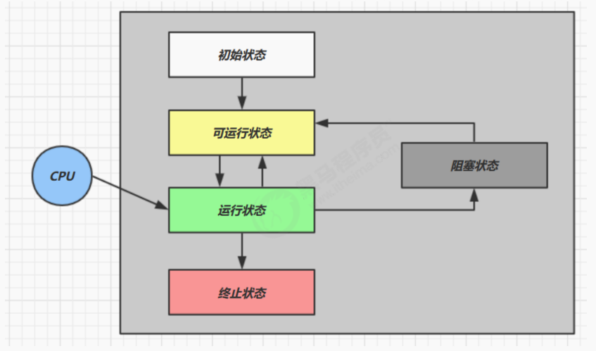
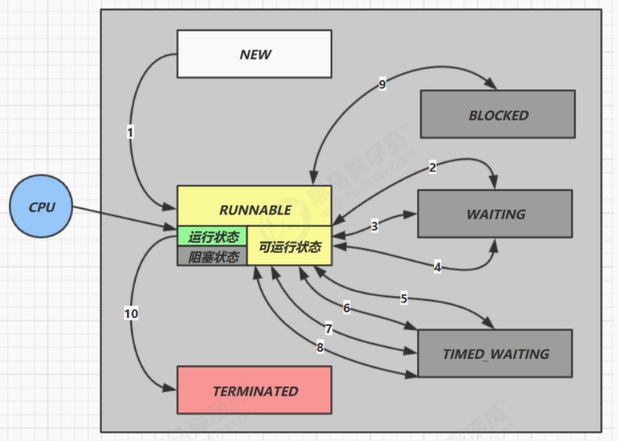

# 【JUC】Java线程

> 主要内容：
>
> - 线程创建
> - 线程相关api
> - 线程状态
> - 应用
>   - 异步调用：主线程执行时，其他线程异步执行耗时操作
>   - 同步等待：`join()` 

## 1 创建线程

### 方法一：直接使用 Thread

```java
public static void test1() {
    Thread t = new Thread(){
        @Override
        public void run() {
            log.debug("running");
        }
    };
  	// 设置线程名称
    t.setName("t1");
  	// 启动线程
    t.start();
}
```

### 方法二：使用 Runnable 配合 Thread

这种创建方法，可以将「线程」和「任务」分开：

- Thread：线程
- Runnable：可执行的线程任务

```java
public static void main(String[] args) {
  	// 任务对象
    Runnable r = () -> {log.debug("running");};
		// 线程对象
    Thread t = new Thread(r, "t2");
		// 启动线程
    t.start();
}
```

方法二是把 `Runnable` 对象设置为 `Thread.target` ，然后在 `Thread.run()` 方法中会去执行 `target.run()`。



```java
@Override
public void run() {
    if (target != null) {
        target.run();
    }
}
```

### 方法三：FutureTask 配合 Thread

FutureTask 能够接收 Callable 类型的参数，**用来处理有返回结果的情况** 。

```java
// 创建任务对象
FutureTask<Integer> task3 = new FutureTask<>(() -> {
   log.debug("hello");
   return 100;
});

// 参数1 是任务对象; 参数2 是线程名字，推荐
new Thread(task3, "t3").start();

// 主线程阻塞，同步等待 task 执行完毕的结果
Integer result = task3.get();
log.debug("结果是:{}", result);
```

`FutureTask` 实现了 `RunnableFuture` 接口：



而 `RunnableFuture` 接口继承了 `Runnable`，因此作为线程的任务对象。

```java
public interface RunnableFuture<V> extends Runnable, Future<V> {
    /**
     * Sets this Future to the result of its computation
     * unless it has been cancelled.
     */
    void run();
}
```

## 2 查看进程与线程方法

在 Linux 下：

- `ps -ef` 查看所有进程
- `ps -fT -p <PID>` 查看某个进程（PID）的所有线程
- `kill` 杀死进程
- `top` 按大写 H 切换是否显示线程
- `top -H -p <PID>` 查看某个进程（PID）的所有线程

在 java 中：

- `jps` 命令查看所有 Java 进程
- `jstack <PID>` 查看某个 Java 进程（PID）的所有线程状态
- `jconsole` 来查看某个 Java 进程中线程的运行情况（图形界面）

## 3 常见线程方法

|       方法        | static | 功能                                                       | 注意                                                         |
| :---------------: | ------ | :--------------------------------------------------------- | :----------------------------------------------------------- |
|     `start()`     |        | 启动一个新线程，在新的线程运行 run 方法                    | start 方法只是让 **线程进入就绪态** ，里面代码不一定立刻运行（CPU 的时间片还没分给它）。每个线程对象的 start 方法只能调用一次，如果调用了多次会出现 `IllegalThreadStateException` |
|      `run()`      |        | 新线程启动后会调用的方法                                   | 如果在构造 Thread 对象时传递了 Runnable 参数，则线程启动后会调用 Runnable 中的 run 方法，否则默认不执行任何操作。但可以创建 Thread 的子类对象，来覆盖默认行为 |
|     `join()`      |        | 等待线程运行结束                                           | 可以使用 `join` 来实现同步                                   |
|  `join(long n)`   |        | 等待线程运行结束，最多等待n毫秒                            |                                                              |
|     `getId()`     |        | 获取线程long id                                            | id 唯一                                                      |
|    `getName()`    |        | 获取线程名                                                 |                                                              |
|    `setName()`    |        | 修改线程名                                                 |                                                              |
|  `sleep(long n)`  | static | 让当前执行的线程休眠n毫秒，休眠时让出cpu的时间片给其他线程 |                                                              |
|     `yield()`     | static | 提示线程调度器让出当前线程对CPU的使用                      | 主要是为了测试和调试                                         |
|   `interrupt()`   |        | 打断线程                                                   | 如果被打断线程正在 sleep，wait，join 会导致被打断的线程抛出 `InterruptedException` ，并清除 **打断标记** ；如果打断的正在运行的线程，则会设置 **打断标记** ；park 的线程被打断，也会设置 **打断标记** |
|  `interrupted()`  | static | 判断当前线程是否被打断                                     | 会清除 **打断标记**                                          |
| `isInterrupted()` |        | 判断是否被打断                                             | 不会清除 **打断标记**                                        |
| `currentThread()` | static | 获取当前正在执行的线程                                     |                                                              |
|   `getState() `   |        | 获取线程状态                                               | Java 中线程状态是用 6 个 enum 表示，分别为：NEW, RUNNABLE, BLOCKED, WAITING, TIMED_WAITING, TERMINATED |

### interrupt方法

#### 打断 sleep，ait，join 的线程

这几个方法都会让线程进入阻塞状态。打断 sleep 的线程, 会清空打断状态，以 sleep 为例

```java
public static void main(String[] args) throws InterruptedException {
    Thread t1 = new Thread(() -> {
        log.debug("sleep...");
        try {
            Thread.sleep(5000); // wait, join
        } catch (InterruptedException e) {
            e.printStackTrace();
        }
    },"t1");
		// 启动线程
    t1.start();
  	// 进入阻塞状态
    Thread.sleep(1000);
    log.debug("interrupt");
  	// 打断线程阻塞
    t1.interrupt();
    log.debug("打断标记:{}", t1.isInterrupted());	// 输出为 false
}
```

#### 打断正常运行的线程

打断不是强制的！！而是收到打断信号 `isInterrupted()`，根据信号自定义打断逻辑。

```java
public static void main(String[] args) throws InterruptedException {
    Thread t1 = new Thread(() -> {
        while(true) {
            boolean interrupted = Thread.currentThread().isInterrupted();
            if(interrupted) {
              	// 需要对打断标记进行判断，
              	// 如果收到打断信号，可决定是否退出循环
              	// 如果不break，该线程即便被interrupt，也不会终止
                log.debug("被打断了, 退出循环");
                break;
            }
        }
    }, "t1");
    t1.start();
		
    Thread.sleep(1000);
    log.debug("interrupt");
    t1.interrupt();
}
```

### 主线程与守护线程

默认情况下，Java 进程需要等待所有线程都运行结束，才会结束。有一种特殊的线程叫做 **守护线程**，**只要其它非守护线程运行结束了，即使守护线程的代码没有执行完，也会强制结束。**

```java
public static void main(String[] args) throws InterruptedException {
    Thread t1 = new Thread(() -> {
        while (true) {
            if (Thread.currentThread().isInterrupted()) {
                break;
            }
        }
        log.debug("结束");
    }, "t1");
  
  	// 将 t1 设置为守护线程
    t1.setDaemon(true);
    t1.start();

    Thread.sleep(1000);
    log.debug("结束");
}
```

> **垃圾回收线程就是一种守护线程！** 如果用户程序停止了，GC过程则会被强制停止。

### start方法

`start()` 方法启动线程

```java
public synchronized void start() {
    if (threadStatus != 0)
        throw new IllegalThreadStateException();
    group.add(this);
    boolean started = false;
    try {
        start0();
        started = true;
    } finally {
        try {
            if (!started) {
                group.threadStartFailed(this);
            }
        } catch (Throwable ignore) {
            /* do nothing. If start0 threw a Throwable then
              it will be passed up the call stack */
        }
    }
}
```

本质上调用了本地方法 `start0()`：

```java
private native void start0();
```

## 4 线程状态模型

### 五状态模型



- **初始状态**：仅在语言层面上创建了线程对象，还未与操作系统的线程进行关联
- **可运行（就绪）状态**：线程已经被创建（与操作系统线程关联），随时可以被CPU调度执行
- **运行状态**：获取了CPU时间片运行中的状态
  - 当CPU时间片用完，会从「运行状态」转至「可运行状态」，导致线程上下文切换
- **阻塞状态**：
  - 如果调用了阻塞API，如BIO读写文件，此时线程实际不会用到CPU，会导致线程上下文切换，进入阻塞状态
  - 等待 BIO 操作完毕，会由操作系统唤醒，转换至可运行状态
- **终止状态**：线程已经执行完毕，生命周期已经结束

### 六状态模型

这是从 **Java API** 层面来描述的，根据 `Thread.State` 枚举，分为六种状态。

```java
public enum State {
    NEW,
    RUNNABLE,
    BLOCKED,
    WAITING,
    TIMED_WAITING,
    TERMINATED;
}
```

转移情况：



- `NEW` ：线程刚被创建，但是还没有调用 `start()` 方法
- `RUNNABLE` ：当调用了 `start()` 方法之后，注意，**Java API** 层面的 RUNNABLE 状态涵盖了 **操作系统** 层面的「可运行状态」、「运行状态」和「阻塞状态」（由于 BIO 导致的线程阻塞，在 Java 里无法区分，仍然认为是可运行）
- `BLOCKED` ， `WAITING` ， `TIMED_WAITING` 都是 **Java API** 层面对「阻塞状态」的细分
- `TERMINATED` 当线程代码运行结束

测试：

```java
public class TestState {
    public static void main(String[] args) throws IOException {
        /**
         * t1 线程只是代码实现了，并没有与操作系统线程进行关联
         * 未调用 start() 方法
         * 状态为 NEW
         */
        Thread t1 = new Thread("t1") {
            @Override
            public void run() {
                log.debug("running...");
            }
        };

        /**
         * t2 正常执行，正常 start()
         * 状态为 RUNNABLE
         */
        Thread t2 = new Thread("t2") {
            @Override
            public void run() {
                while(true) { // runnable

                }
            }
        };
        t2.start();

        /**
         * t3 线程正常运行，并且很快运行结束
         * 最终是 TERMINATED 状态
         */
        Thread t3 = new Thread("t3") {
            @Override
            public void run() {
                log.debug("running...");
            }
        };
        t3.start();

        /**
         * t4 线程首先获得了一个锁，然后进入睡眠
         * 状态为 TIME_WAITING 的阻塞状态
         */
        Thread t4 = new Thread("t4") {
            @Override
            public void run() {
                synchronized (TestState.class) {
                    try {
                        Thread.sleep(1000000); // timed_waiting
                    } catch (InterruptedException e) {
                        e.printStackTrace();
                    }
                }
            }
        };
        t4.start();

        /**
         * t5 线程会等待 t2 线程执行完毕
         * 因此属于 WAITING 的阻塞状态
         */
        Thread t5 = new Thread("t5") {
            @Override
            public void run() {
                try {
                    t2.join(); // waiting
                } catch (InterruptedException e) {
                    e.printStackTrace();
                }
            }
        };
        t5.start();

        /**
         * t6 线程需要锁来执行自己的方法，但锁对象已经被 t2 线程抢了
         * 所以需要一直等到 t2 释放锁
         * 状态为 BLOCKED 的阻塞状态
         */
        Thread t6 = new Thread("t6") {
            @Override
            public void run() {
                synchronized (TestState.class) { // blocked
                    try {
                        Thread.sleep(1000000);
                    } catch (InterruptedException e) {
                        e.printStackTrace();
                    }
                }
            }
        };
        t6.start();

        try {
            Thread.sleep(500);
        } catch (InterruptedException e) {
            e.printStackTrace();
        }
        log.debug("t1 state {}", t1.getState());
        log.debug("t2 state {}", t2.getState());
        log.debug("t3 state {}", t3.getState());
        log.debug("t4 state {}", t4.getState());
        log.debug("t5 state {}", t5.getState());
        log.debug("t6 state {}", t6.getState());
        System.in.read();
    }
}
```


