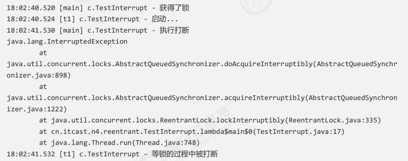

# 【JUC】ReentrantLock

## 1 基本介绍

与 synchronized 相比，ReentrantLock 具有如下特点：

- 可中断
- 可设置超时时间
- 可设置为公平锁
- 支持多个条件变量

与 synchronized 相同，都支持可重入。

基本语法：

```java
// 获取锁
reentrantLock.lock();
try{
  // 临界区
} finally {
  reentrantLock.unlock();
}
```

## 2 相关特性

### 2.1 可重入

可重入是指 **同一个线程** 如果首次获得了这把锁，那么因为它是这把锁的拥有者，因此有权利 **再次获取** 这把锁。

如果是不可重入锁，那么第二次获得锁时，自己也会被锁挡住。

```java
/**
	测试 ReentrantLock 的可重入性！
*/
static ReentrantLock lock = new ReentrantLock();
public static void main(String[] args) {
    method1();
}
public static void method1() {
  	// 第一次加锁
    lock.lock();
    try {
        log.debug("execute method1");
        method2();
    } finally {
        lock.unlock();
    }
}
public static void method2() {
  	// 第二次加锁
    lock.lock();
    try {
        log.debug("execute method2");
        method3();
    } finally {
        lock.unlock();
    }
}
public static void method3() {
  	// 第三次加锁
    lock.lock();
    try {
        log.debug("execute method3");
    } finally {
        lock.unlock();
    }
}
```

### 2.2 可打断

使用方法 `lock.lockInterruptibly()` 可以设置被打断。

```java
ReentrantLock lock = new ReentrantLock();
Thread t1 = new Thread(() -> {
    log.debug("启动...");
    try {
        // 如果没有竞争，那么此方法就会获取 lock 对象锁
        // 如果有竞争，就进入阻塞队列，此时，可以被其他线程 interrupt 打断！
        lock.lockInterruptibly();
    } catch (InterruptedException e) {
        e.printStackTrace();
      	// 被打断了，没有获得到锁，返回
        log.debug("等锁的过程中被打断");
        return;
    }
    try {
        log.debug("获得了锁");
    } finally {
        lock.unlock();
    }
}, "t1");

// 主线程竞争锁
lock.lock();
log.debug("获得了锁");

// 启动线程 t1
t1.start();

try {
    sleep(1);
    // 打断线程 t1
    t1.interrupt();
    log.debug("执行打断");
} finally {
    lock.unlock();
}
```

输出：



但是，如果使用的是：

```java
Thread t1 = new Thread(() -> {
    log.debug("启动...");
  	// 没有使用 lockInterruptibly()
  	// 则不会被 interrupt，一直等待，直到获得锁
    lock.lock();
    try {
        log.debug("获得了锁");
    } finally {
        lock.unlock();
    }
}, "t1");

```

可打断的机制优点是 **防止无限制的等待，避免死锁** 。

### 2.3 锁超时

**可打断** 是一种 **被动式** 的结束等待方式，而 **锁超时** 是一种 **主动式** 的方式去结束等待。

使用的方法是 `lock.tryLock()` 方法，它 **可以设置等待时间，也可以被打断** 。

```java
private static ReentrantLock lock = new ReentrantLock();

public static void main(String[] args) {
    Thread t1 = new Thread(() -> {
        log.debug("尝试获得锁");
        try {
            // tryLock() 方法可尝试获得锁
            // 如果在 时间内 没有获得到锁，则返回 false
            if (! lock.tryLock(1, TimeUnit.SECONDS)) {
                log.debug("获取等待 1s 后失败，返回");
                return;
            }
        } catch (InterruptedException e) {
            e.printStackTrace();
            log.debug("获取不到锁");
            return;
        }
        try {
            log.debug("获得到锁");
        } finally {
            lock.unlock();
        }
    }, "t1");

    // 主线程上锁
    lock.lock();
    log.debug("获得到锁");
    t1.start();
    sleep(2);
    log.debug("释放了锁");
    lock.unlock();
}
```


### 2.4 公平锁

公平锁一般没有必要，会降低并发度。

ReentrantLock **默认是不公平的** 。

```java
public static void main(String[] args) throws InterruptedException {
    ReentrantLock lock = new ReentrantLock(false);

    lock.lock();
    for (int i = 0; i < 20; i++) {
        new Thread(() -> {
            lock.lock();
            try {
                System.out.println(Thread.currentThread().getName() + " running...");
            } finally {
                lock.unlock();
            }
        }, "t" + i).start();
    }

    // 1s 之后去争抢锁
    Thread.sleep(1000);
    for (int i = 0; i < 5; i++) {
        new Thread(() -> {
            lock.lock();
            try {
                System.out.println(Thread.currentThread().getName() + " running...");
            } finally {
                lock.unlock();
            }
        }, "强行插入").start();
    }
    lock.unlock();
}
```


在构造函数中：

```java
public ReentrantLock(boolean fair) {
    sync = fair ? new FairSync() : new NonfairSync();
}
```

如果 `fair = true`，则创建公平锁，先入先得；否则就是非公平锁。

改为公平锁后：


强制插入总是在最后才输出！

### 2.5 多个条件变量

synchronized 中也有条件变量，就是那个 waitSet 休息室，当条件不满足时进入 waitSet 等待。

ReentrantLock 的条件变量比 synchronized 强大之处在于，它是 **支持多个条件变量** 的，这就好比：

- synchronized 是那些不满足条件的线程都在一间休息室等消息
- ReentrantLock 支持多间休息室，有专门等烟的休息室、专门等早餐的休息室、**唤醒时也是按休息室来唤醒**

使用要点：

- **await 前需要获得锁**
- **await 执行后，会释放锁，进入 conditionObject 等待**
- **await 的线程被唤醒（或打断、或超时）取重新竞争 lock 锁**
- **竞争 lock 锁成功后，从 await 后继续执行**

```java
public class TestCondition {
  	// 锁对象
    static ReentrantLock lock = new ReentrantLock();
  	// 条件变量1，等待烟
    static Condition waitCigaretteQueue = lock.newCondition();
  	// 条件变量2，等待早餐
    static Condition waitbreakfastQueue = lock.newCondition();
    static volatile boolean hasCigrette = false;
    static volatile boolean hasBreakfast = false;

    public static void main(String[] args) {
        new Thread(() -> {
            try {
                lock.lock();
                while (!hasCigrette) {
                    try {
                      	// 进入等待条件变量
                        waitCigaretteQueue.await();
                    } catch (InterruptedException e) {
                        e.printStackTrace();
                    }
                }
                log.debug("等到了它的烟");
            } finally {
                lock.unlock();
            }
        }).start();

        new Thread(() -> {
            try {
                lock.lock();
                while (!hasBreakfast) {
                    try {
                      	// 进入等待条件变量
                        waitbreakfastQueue.await();
                    } catch (InterruptedException e) {
                        e.printStackTrace();
                    }
                }
                log.debug("等到了它的早餐");
            } finally {
                lock.unlock();
            }
        }).start();

        sleep(1);
        sendBreakfast();
        sleep(1);
        sendCigarette();
    }

    private static void sendCigarette() {
        lock.lock();
        try {
            log.debug("送烟来了");
            hasCigrette = true;
          	// 唤醒等烟休息室
            waitCigaretteQueue.signal();
        } finally {
            lock.unlock();
        }
    }

    private static void sendBreakfast() {
        lock.lock();
        try {
            log.debug("送早餐来了");
            hasBreakfast = true;
						// 唤醒等早餐休息室
            waitbreakfastQueue.signal();
        } finally {
            lock.unlock();
        }
    }
}
```


