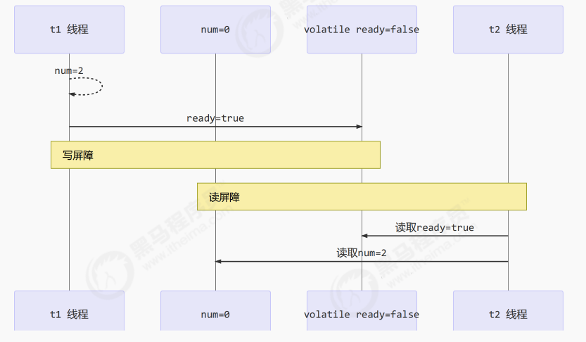

# 【JUC】volatile

## 1 基本介绍

volatile 能够保证 **有序性** 和 **可见性**，但无法保证原子性！

volatile 的底层实现原理是 **内存屏障（Memory Barrier）**：

- 对 volatile 变量的写指令后，会加入 **写屏障**
- 对 volatile 变量的读指令后，会加入 **读屏障**

## 2 如何保证可见性？

**写屏障（sfence）** 保证在该屏障之前的，**对共享变量的改动**，都同步到主存当中：

```java
public void actor2(I_Result r) {
    num = 2;
    ready = true; // ready 是 volatile 赋值带写屏障
    // 写屏障
}
```

也就是不管是 ready 变量会被同步到主存中，num 变量的修改也会同步到主存中。

**读屏障（lfence）** 保证在该屏障之后，**对共享变量的读取**，加载的是主存中最新数据：

```java
public void actor1(I_Result r) {
    // 读屏障
    // ready 是 volatile 读取值带读屏障
    if(ready) {
        r.r1 = num + num;
    } else {
        r.r1 = 1;
    }
}
```



## 3 如何保证有序性？

写屏障会确保指令重排序时，**不会将写屏障之前的代码排在写屏障之后** 。

读屏障会确保指令重排序时，**不会将读屏障之后的代码排在读屏障之前** 。

> 还是那句话，**不能解决指令交错** ：
>
> - 写屏障仅仅是保证之后的 **读能够读到最新的结果** ，但不能保证读跑到它前面去
> - 有序性的保证也只是保证了 **本线程内相关代码** 不被重排序