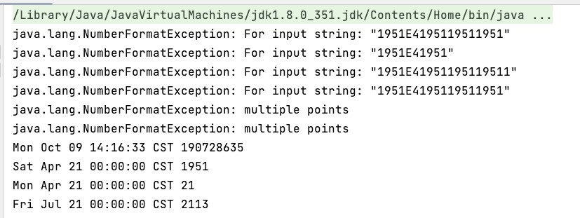
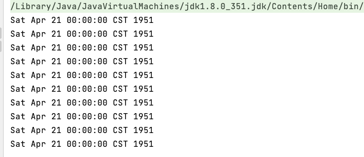
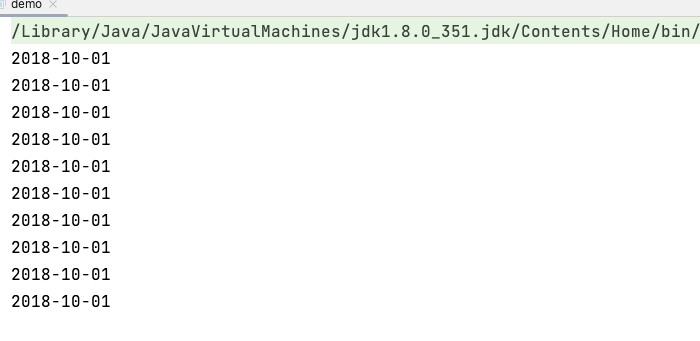

# 【JUC】不可变

> 把一个类设计成不可变类，也可以实现线程安全！

## 1 可变类的问题

可变类无法保证线程安全，除非对他进行加锁处理，如：

```java
public static void main(String[] args) throws NoSuchFieldException, IllegalAccessException {
    SimpleDateFormat sdf = new SimpleDateFormat("yyyy-MM-dd");
    for (int i = 0; i < 10; i++) {
        new Thread(() -> {
            try {
                System.out.println(sdf.parse("1951-04-21"));
            } catch (Exception e) {
                System.out.println(e);
            }
        }).start();
    }
}
```



在多线程情况下，无法正常使用。加锁：

```java
public static void main(String[] args) throws NoSuchFieldException, IllegalAccessException {
    SimpleDateFormat sdf = new SimpleDateFormat("yyyy-MM-dd");
    for (int i = 0; i < 10; i++) {
        new Thread(() -> {
            synchronized (sdf) {
                try {
                    System.out.println(sdf.parse("1951-04-21"));
                } catch (Exception e) {
                    System.out.println(e);
                }
            }
        }).start();
    }
}
```



发现没啥问题了，但使用 `sychronized` 的代价比较大。还有别的方法吗？

**如果一个对象在不能够修改其内部状态（属性），那么它就是线程安全的，因为不存在并发修改啊！**这样的对象在 Java 中有很多，例如在 Java 8 后，提供了一个新的日期格式化类：

```java
public static void main(String[] args) throws NoSuchFieldException, IllegalAccessException {
    DateTimeFormatter dtf = DateTimeFormatter.ofPattern("yyyy-MM-dd");
    for (int i = 0; i < 10; i++) {
        new Thread(() -> {
            LocalDate date = dtf.parse("2018-10-01", LocalDate::from);
            System.out.println(date);
        }).start();
    }
}
```



## 2 不可变类实现线程安全

这里以 `String` 为例，说明如何设计一个不可变类！

```java
public final class String
    implements java.io.Serializable, Comparable<String>, CharSequence {
    /** The value is used for character storage. */
    private final char value[];

    /** Cache the hash code for the string */
    private int hash; // Default to 0
  
  	// ...
}
```

### 2.1 final的使用

发现该类、类中所有属性都是 final 的：

- 属性用 `final` 修饰保证了该属性是只读的，不能修改
- 类用 `final` 修饰保证了该类中的方法不能被覆盖，防止子类无意间破坏不可变性

### 2.2 保护性拷贝

以 substring 为例：

```java
public String substring(int beginIndex) {
    if (beginIndex < 0) {
        throw new StringIndexOutOfBoundsException(beginIndex);
    }
    int subLen = value.length - beginIndex;
    if (subLen < 0) {
        throw new StringIndexOutOfBoundsException(subLen);
    }
  	// 构造方法构造了新字符串
    return (beginIndex == 0) ? this : new String(value, beginIndex, subLen);
}
```

发现其内部是调用 String 的构造方法创建了一个新字符串，再进入这个构造看看，是否对 `final char[] value` 做出了修改：

```java
public String(char value[], int offset, int count) {
    if (offset < 0) {
        throw new StringIndexOutOfBoundsException(offset);
    }
    if (count <= 0) {
        if (count < 0) {
            throw new StringIndexOutOfBoundsException(count);
        }
        if (offset <= value.length) {
            this.value = "".value;
            return;
        }
    }
    // Note: offset or count might be near -1>>>1.
    if (offset > value.length - count) {
        throw new StringIndexOutOfBoundsException(offset + count);
    }
    this.value = Arrays.copyOfRange(value, offset, offset+count);
}
```


结果发现也没有，构造新字符串对象时，会生成新的 `char[] value` ，**对内容进行复制** 。

这种通过 **创建副本对象来避免共享** 的手段称之为**「保护性拷贝（defensive copy）」** 。