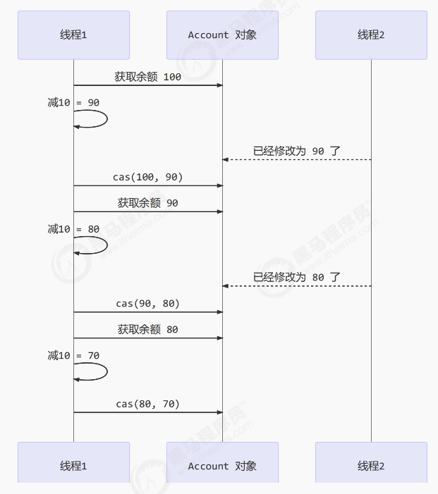
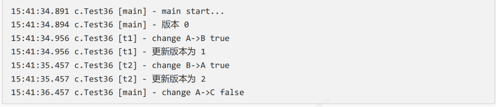
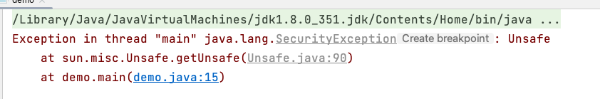
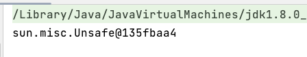

# 【JUC】无锁并发

## 1 CAS

CompareAndSet，称为 CAS，它保证 **比较和设置两个操作具有原子性** 。

CAS 操作包含三个操作数，`内存位置（V）、预期原值（A）和新值（B）`。如果 **内存位置的值与预期原值** 相匹配，那么处理器会自动将该位置值更新为新值。否则，处理器不做任何操作。



### 1.1 与volatile配合

获取共享变量时，为了保证该变量的可见性，需要使用 `volatile` 修饰。

它可以用来修饰成员变量和静态成员变量，他可以避免线程从自己的工作缓存中查找变量的值，必须到主存中获取它的值，线程操作 volatile 变量都是直接操作主存。即一个线程对 volatile 变量的修改，对另一个线程可见。

> **CAS 必须借助 volatile 才能读取到共享变量的最新值，从而实现「比较与交换」的效果。**

### 1.2 为什么无锁效率高？

无锁情况下，**即使重试失败，线程始终在高速运行**，没有停歇，而 synchronized 会让线程在没有获得锁的时候，**发生上下文切换，进入阻塞**。打个比喻：线程就好像高速跑道上的赛车，高速运行时，速度超快，一旦发生上下文切换，就好比赛车要减速、熄火，等被唤醒又得重新打火、启动、加速... 恢复到高速运行，代价比较大。

但无锁情况下，因为线程要保持运行，需要额外 CPU 的支持，CPU 在这里就好比高速跑道，没有额外的跑道，线程想高速运行也无从谈起，**虽然不会进入阻塞，但由于没有分到时间片，仍然会进入可运行状态，还是会导致上下文切换。**

所以，CAS 最好在多核 CPU 机器上使用。

### 1.3 CAS的特点

结合 CAS 和 volatile 可以实现无锁并发，适用于 **线程数少、多核 CPU** 的场景下。

- CAS 是基于 **乐观锁** 的思想：最乐观的估计，不怕别的线程来修改共享变量
- synchronized 是基于 **悲观锁** 的思想：最悲观的估计，得防着其它线程来修改共享变量
- CAS 体现的是 **无锁并发、无阻塞并发** 
  - 因为没有使用 synchronized，所以线程不会陷入阻塞，这是效率提升的因素之一
  - 但如果竞争激烈，可以想到重试必然频繁发生，反而效率会受影响

### 1.4 原子整数

基本原子类的功能，是通过原子方式更新 Java 基础类型变量的值。

JUC 并发包提供了：

- `AtomicInteger` ：整型原子类。
- `AtomicLong` ：长整型原子类。 
- `AtomicBoolean` ：布尔型原子类。

```java
AtomicInteger i = new AtomicInteger(0);

// 获取并自增（i = 0, 结果 i = 1, 返回 0），类似于 i++
System.out.println(i.getAndIncrement());

// 自增并获取（i = 1, 结果 i = 2, 返回 2），类似于 ++i
System.out.println(i.incrementAndGet());

// 自减并获取（i = 2, 结果 i = 1, 返回 1），类似于 --i
System.out.println(i.decrementAndGet());

// 获取并自减（i = 1, 结果 i = 0, 返回 1），类似于 i--
System.out.println(i.getAndDecrement());

// 获取并加值（i = 0, 结果 i = 5, 返回 0）
System.out.println(i.getAndAdd(5));

// 加值并获取（i = 5, 结果 i = 0, 返回 0）
System.out.println(i.addAndGet(-5));

// 获取并更新（i = 0, p 为 i 的当前值, 结果 i = -2, 返回 0）
// 其中函数中的操作能保证原子，但函数需要无副作用
System.out.println(i.getAndUpdate(p -> p - 2));

// 更新并获取（i = -2, p 为 i 的当前值, 结果 i = 0, 返回 0）
// 其中函数中的操作能保证原子，但函数需要无副作用
System.out.println(i.updateAndGet(p -> p + 2));

// 获取并计算（i = 0, p 为 i 的当前值, x 为参数1, 结果 i = 10, 返回 0）
// 其中函数中的操作能保证原子，但函数需要无副作用
// getAndUpdate 如果在 lambda 中引用了外部的局部变量，要保证该局部变量是 final 的
// getAndAccumulate 可以通过 参数1 来引用外部的局部变量，但因为其不在 lambda 中因此不必是 final
System.out.println(i.getAndAccumulate(10, (p, x) -> p + x));

// 计算并获取（i = 10, p 为 i 的当前值, x 为参数1, 结果 i = 0, 返回 0）
// 其中函数中的操作能保证原子，但函数需要无副作用
System.out.println(i.accumulateAndGet(-10, (p, x) -> p + x));
```

### 1.5 原子引用

引用原子类主要包括了以下三个：

- `AtomicReference`：引用类型原子类。
- `AtomicMarkableReference` ：带有 **更新标记位** 的原子引用类型。
- `AtomicStampedReference` ：带有 **更新版本号** 的原子引用类型。

使用 `AtomicReference` 来让 BigDecimal 线程安全。

```java
class DecimalAccountSafeCas implements DecimalAccount {
    AtomicReference<BigDecimal> ref;
    public DecimalAccountSafeCas(BigDecimal balance) {
        ref = new AtomicReference<>(balance);
    }
    @Override
    public BigDecimal getBalance() {
        return ref.get();
    }
    @Override
    public void withdraw(BigDecimal amount) {
        while (true) {
            BigDecimal prev = ref.get();
            BigDecimal next = prev.subtract(amount);
            if (ref.compareAndSet(prev, next)) {
                break;
            }
        }
    }
}
```

但是，上述代码存在一个问题（ABA）问题，**主线程仅能判断出共享变量的值与最初值 A 是否相同，不能感知到这种从 A 改为 B 又 改回 A 的情况**。

> 简单来说就是，只在乎最后比较时候的值的大小，而不在乎中间是不是被修改过！

怎么解决呢？可以使用 `AtomicStampedReference` ：

```java
static AtomicStampedReference<String> ref = new AtomicStampedReference<>("A", 0);
public static void main(String[] args) throws InterruptedException {
    log.debug("main start...");
    // 获取值 A
    String prev = ref.getReference();
    // 获取版本号
    int stamp = ref.getStamp();
    log.debug("版本 {}", stamp);
  
    // 如果中间有其它线程干扰，发生了 ABA 现象
    other();
    sleep(1);

    // 尝试改为 C
    log.debug("change A->C {}", ref.compareAndSet(prev, "C", stamp, stamp + 1));
}
private static void other() {
    new Thread(() -> {
        log.debug("change A->B {}", ref.compareAndSet(ref.getReference(), "B",
                ref.getStamp(), ref.getStamp() + 1));
        log.debug("更新版本为 {}", ref.getStamp());
    }, "t1").start();
    sleep(0.5);
    new Thread(() -> {
        log.debug("change B->A {}", ref.compareAndSet(ref.getReference(), "A",
                ref.getStamp(), ref.getStamp() + 1));
        log.debug("更新版本为 {}", ref.getStamp());
    }, "t2").start();
}
```



`AtomicStampedReference` 可以给原子引用加上版本号，追踪原子引用整个的变化过程，如：`A -> B -> A -> C` ，通过`AtomicStampedReference`，我们可以知道，引用变量中途被更改了几次。

但是有时候，并不关心引用变量更改了几次，只是单纯的关心 **是否更改过**，所以就有了 `AtomicMarkableReference`。

### 1.6 原子数组

数组原子类的功能，是通过原子方式更数组里的某个元素的值。数组原子类主要包括了以下三个：

- `AtomicIntegerArray` ：整型数组原子类。
- `AtomicLongArray` ：长整型数组原子类。
- `AtomicReferenceArray` ：引用类型数组原子类。

### 1.7 字段更新器

字段更新原子类主要包括了以下三个：

- `AtomicIntegerFieldUpdater` ：原子更新整型字段的更新器。 
- `AtomicLongFieldUpdater` ：原子更新长整型字段的更新器。
- `AtomicReferenceFieldUpdater` ：原子更新引用类型里的字段。

利用字段更新器，可以针对对象的某个域（Field）进行原子操作，**只能配合 volatile 修饰的字段使用**，否则会出现异常。

```java
public class Test5 {
    // 必须要加 volatile
    private volatile int field;
    
    public static void main(String[] args) {
        AtomicIntegerFieldUpdater fieldUpdater =AtomicIntegerFieldUpdater.newUpdater(Test5.class, "field");
        Test5 test5 = new Test5();
        fieldUpdater.compareAndSet(test5, 0, 10);
        // 修改成功 field = 10
        
        System.out.println(test5.field);
        // 修改成功 field = 20
        
        fieldUpdater.compareAndSet(test5, 10, 20);
        System.out.println(test5.field);
        // 修改失败 field = 20
        
        fieldUpdater.compareAndSet(test5, 10, 30);
        System.out.println(test5.field);
    }
}
```

### 1.8 CAS的缺点

1. **ABA问题**

因为 CAS 需要在操作值的时候检查下值有没有发生变化，如果没有发生变化则更新，但是如果一个值原来是A，变成了B，又变成了A，那么使用 CAS 进行检查时会发现它的值没有发生变化，但是实际上却变化了。

JDK 提供了两个类 `AtomicStampedReference`、`AtomicMarkableReference` 来解决 ABA 问题。

2. **只能保证一个共享变量的原子操作**

一个比较简单的规避方法为：**把多个共享变量合并成一个共享变量来操作**。 JDK 提供了 `AtomicReference` 类来保证引用对象之间的原子性，可以把多个变量放在一个 AtomicReference 实例后再进行 CAS 操作。比如有两个共享变量 i＝1、j=2，可以将二者合并成一个对象，然后用 CAS 来操作该合并对象的 AtomicReference 引用。

3. **循环时间长开销大**

高并发下N多线程同时去操作一个变量，会造成大量线程 CAS 失败，然后处于自旋状态，导致严重浪费 CPU 资源，降低了并发性。

**解决 CAS 恶性空自旋** 的较为常见的方案为：

- 分散操作热点，使用 `LongAdder` 替代基础原子类 `AtomicLong`。
- 使用队列削峰，将发生 CAS 争用的线程加入一个队列中排队，降低 CAS 争用的激烈程度。JUC 中非常重要的基础类 AQS（抽象队列同步器）就是这么做的。

## 2 Unsafe

`Unsafe` 对象提供了非常底层的，操作内存、线程的方法，`theUnsafe` 对象不能直接调用，**只能通过反射获得**。

由于 Java 方法无法直接访问底层系统，需要通过本地（Native）方法来访问，Unsafe 相当于一个后门，基于该类可以直接操作特定的内存数据。Unsafe 类存在 sun.misc 包中，其内部方法操作可以像 C 的指针一样直接操作内存，**因为 Java 中的 CAS 操作的执行依赖于 Unsafe 类的方法。** 

> 这里的 unsafe 指的 **并不是线程不安全**，而是说 **它提供了很多操作线程、内存的方法，误用可能会导致不安全的发生** 。

上述中提供的「原子类型」都是基于 `Unsafe` 来实现的！

```java
private static final Unsafe unsafe = Unsafe.getUnsafe();
```

提供了许多原子 JNI ：

```java
public final native boolean compareAndSwapObject(Object var1, long var2, Object var4, Object var5);

public final native boolean compareAndSwapInt(Object var1, long var2, int var4, int var5);

public final native boolean compareAndSwapLong(Object var1, long var2, long var4, long var6);
```

### 2.1 Unsafe的获取

为什么只能通过反射来获得呢？来看看下面的代码：

```java
public class demo {
    public static void main(String[] args) {
        Unsafe unsafe = Unsafe.getUnsafe();
        System.out.println(unsafe);
    }
}
```



`Unsafe` 暴露了一个 `getUnsafe()` 方法，你以为能够获得吗，并不能！因为这里存在类加载器的检查！

> Java 自带三种类加载器，bootstrap 类加载器是 JVM 启动的时候负责加载 `jre/lib/rt.jar` 这个类是 c++ 写的，在java 中看不到。其它两个是 `ExtClassLoader` 和 `AppClassLoader` 都是继承 `ClassLoader` 类。
>
> isSystemDomainLoader 会进行判断如果传入的 null 返回 true，否则返回 false。
>
> 在启动阶段，加载 `rt.jar` 所有类的是 `bootstrap` 类加载器，所以调用 `caller.getClassLoader()` 会返回 null，isSystemDomainLoader 就会返回 true。
>
> 但是在我们自己写的类代码中直接调用这个类就不行了，此时是 AppClassLoader，会返回 false，直接抛异常。

```java
@CallerSensitive
public static Unsafe getUnsafe() {
    Class var0 = Reflection.getCallerClass();
  	// VM.isSystemDomainLoader 检查类加载器
    if (!VM.isSystemDomainLoader(var0.getClassLoader())) {
        throw new SecurityException("Unsafe");
    } else {
        return theUnsafe;
    }
}
```

> jvm 的开发者认为这些方法危险，不希望开发者调用，就把这种危险的方法用 `@CallerSensitive` 修饰，并在“jvm”级别检查。

所以，要想使用，只能通过反射获取到！

```java
public class demo {
    public static void main(String[] args) throws NoSuchFieldException, IllegalAccessException {
        // Unsafe unsafe = Unsafe.getUnsafe();
        Field f = Unsafe.class.getDeclaredField("theUnsafe");
        // setAccessible 获取私有字段的值
        f.setAccessible(true);
        Unsafe unsafe = (Unsafe)f.get(null);
        System.out.println(unsafe);
    }
}
```



### 2.2 使用Unsafe中的CAS方法

这里还是以 `AtomicInteger` 为例：

```java
/**
 * Atomically sets to the given value and returns the old value.
 * 原子性地更新新值，并返回旧值
 * @param newValue the new value
 * @return the previous value
 */
public final int getAndSet(int newValue) {
  	// 使用unsafe提供的原子方法
    return unsafe.getAndSetInt(this, valueOffset, newValue);
}
```


