# 【JUC】管程与synchronized

## 1 共享带来的问题

### 1.1 举个例子

两个线程对初始值为 0 的静态变量一个做自增，一个做自减，各做 5000 次，结果是 0 吗？

```java
public class Test17 {
    public static void main(String[] args) throws InterruptedException {
        Room room = new Room();
        Thread t1 = new Thread(() -> {
            for (int i = 0; i < 5000; i++) {
                room.increment();
            }
        }, "t1");

        Thread t2 = new Thread(() -> {
            for (int i = 0; i < 5000; i++) {
                room.decrement();
            }
        }, "t2");

        t1.start();
        t2.start();
        t1.join();
        t2.join();
        log.debug("{}", room.getCounter());
    }
}

class Room {
    private int counter = 0;

    public void increment() {
        counter++;
    }

    public void decrement() {
        counter--;
    }

    public int getCounter() {
        return counter;
    }
}
```

以上的结果可能是正数、负数、零。为什么呢？**因为 Java 中对静态变量的自增，自减并不是原子操作**，要彻底理解，必须从字节码来进行分析。

例如对于 `i++` 而言（i 为静态变量），实际会产生如下的 JVM 字节码指令：

```java
getstatic i // 获取静态变量i的值
iconst_1 		// 准备常量1
iadd 				// 自增
putstatic i // 将修改后的值存入静态变量i
```

而对应 `i--` 也是类似：

```java
getstatic i // 获取静态变量i的值
iconst_1 		// 准备常量1
isub 				// 自减
putstatic i // 将修改后的值存入静态变量i
```

而 Java 的内存模型如下，完成静态变量的自增，自减需要在主存和工作内存中进行数据交换：

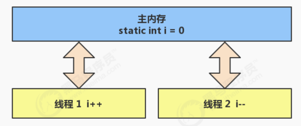

如果是单线程，则以上 8 行代码是顺序执行（不会交错）没有问题：

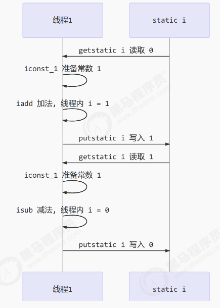

但多线程下，这 8 行代码可能交错运行：

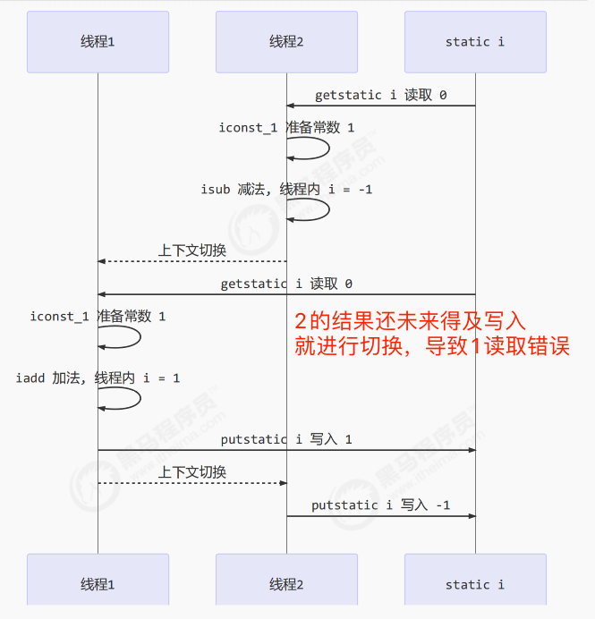

正数情况也是类似。

### 1.2 临界区

一个程序运行多个线程本身是没有问题的，问题出在多个线程访问 **共享资源**：

- 多线程对 **共享资源** 进行 **读** 操作，没问题
- 多线程对 **共享资源** 进行 **读写** 操作，会导致指令交错，出问题

> 一段代码块内如果存在对 **共享资源** 的多线程读写操作，称这段代码块为 **临界区** 。

例如，下面代码中的临界区：

```java
private int counter = 0;
public void increment() {
  	// 临界区
    counter++;
}
public void decrement() {
  	// 临界区
    counter--;
}
public int getCounter() {
    return counter;
}
```

### 1.3 竞态条件

> 多个线程在临界区内执行，由于代码的 **执行序列不同** 而导致结果无法预测，称之为发生了 **竞态条件** 。

为了避免临界区的竞态条件发生，有多种手段可以达到目的：

- 阻塞式的解决方案：`synchronized`，`Lock`
- 非阻塞式的解决方案：原子变量

## 2 synchronized解决方案

阻塞式的解决方案：`synchronized`，即俗称的「对象锁」，它采用 **互斥** 的方式让同一时刻至多只有一个线程能持有「对象锁」，其它线程再想获取这个「对象锁」时就会阻塞住。这样就能保证 **拥有锁的线程可以安全的执行临界区内的代码** ，不用担心线程上下文切换。

>注意：
>
>虽然 java 中的互斥和同步都可以采用 `synchronized` 关键字来完成，但他们仍有区别：
>
>- 互斥是保证临界区的竞态条件不发生，**同一时刻只能有一个线程执行临界区代码**
>- 同步是由于线程执行的先后、顺序不同，**需要一个线程等待其它线程运行到某个点**

### 2.1 语法

```java
synchronized (对象) // 线程1， 线程2(blocked)
{
 		临界区
}
```

### 2.2 解决

```java
public class Test17 {
    public static void main(String[] args) throws InterruptedException {
        Room room = new Room();
        Thread t1 = new Thread(() -> {
            for (int i = 0; i < 5000; i++) {
                room.increment();
            }
        }, "t1");

        Thread t2 = new Thread(() -> {
            for (int i = 0; i < 5000; i++) {
                room.decrement();
            }
        }, "t2");

        t1.start();
        t2.start();
        t1.join();
        t2.join();
        log.debug("{}", room.getCounter());
    }
}

class Room {
    private int counter = 0;
		
  	// 实际上也是锁了 this 对象，等价于下面
    public synchronized void increment() {
        counter++;
    }

    public void decrement() {
      	// 相当于上面的表达式
      	synchronized (this) {
         		counter--;
        }
    }

    public synchronized int getCounter() {
        return counter;
    }
}
```

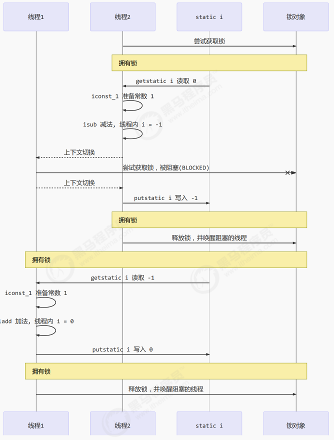

`synchronized` 实际是用 **对象锁** 保证了 **临界区内代码的原子性** ，临界区内的代码对外是不可分割的，不会被线程切换所打断。

### 2.3 方法上的 synchronize

在普通方法上加 `synchronized` 关键字，相当于给 `this` 对象进行加锁。

```java
class Test{
 		public synchronized void test() {
 
 		}
}

// 等价于
  
class Test{
     public void test() {
         synchronized(this) {

         }
     }
}
```

在静态方法上加 `synchronized` 关键字，相当于给 `XXX.class` 对象加锁：

```java
class Test{
     public synchronized static void test() {
       
     }
}

// 等价于

class Test{
     public static void test() {
         synchronized(Test.class) {

         }
     }
}
```

## 3 变量的线程安全分析

### 3.1 成员变量和静态变量是否线程安全？

如果它们 **没有共享** ，则线程安全。

如果它们 **被共享了** ，根据它们的状态是否能够改变，又分两种情况：

- 如果只有读操作，则线程安全
- 如果有 `读写` 操作，则这段代码是临界区，需要考虑线程安全

### 3.2 局部变量是否线程安全？

局部变量是 **线程安全** 的！

但局部变量 **引用的对象** 则未必：

- 如果该对象没有逃离方法的作用访问，它是线程安全的
- 如果该对象 `逃离方法的作用范围` ，需要考虑线程安全

如：每个线程调用 `test1()` 方法时局部变量 i，会在每个线程的栈帧内存中被创建多份，因此 **不存在共享** 。

```java
public static void test1() {
 		int i = 10;
 		i++; 
}
```

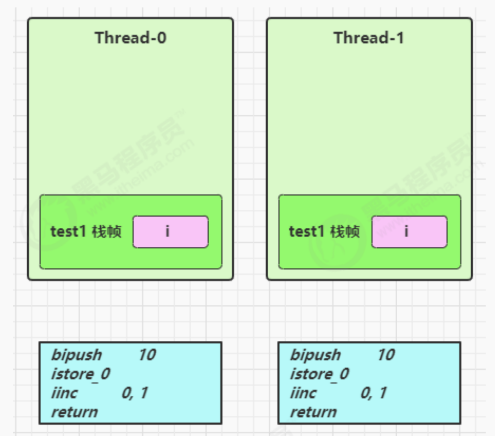

局部变量的引用稍有不同，先看一个成员变量的例子：

```java
class ThreadUnsafe {
  	// 成员变量
    ArrayList<String> list = new ArrayList<>();
    public void method1(int loopNumber) {
        for (int i = 0; i < loopNumber; i++) {
          	// 临界区
            method2();
            method3();
        }
    }

    private void method2() {
        list.add("1");
    }

    private void method3() {
        list.remove(0);
    }
}
```

执行：

```java
static final int THREAD_NUMBER = 2;
static final int LOOP_NUMBER = 200;
public static void main(String[] args) {
   ThreadUnsafe test = new ThreadUnsafe();
     for (int i = 0; i < THREAD_NUMBER; i++) {
       new Thread(() -> {
         test.method1(LOOP_NUMBER);
       }, "Thread" + i).start();
   }
}
```

其中一种情况是，如果线程2 还未 `add` ，线程1 `remove` 就会报错：

```
Exception in thread "Thread1" java.lang.IndexOutOfBoundsException: Index: 0, Size: 0
```

无论哪个线程中的 method2 引用的都是同一个对象中的 list 成员变量

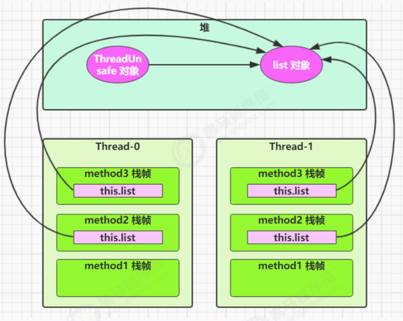

但只需要把 `list` 改为局部变量就没问题了：

```java
// 成员变量
public void method1(int loopNumber) {
  	ArrayList<String> list = new ArrayList<>();
    for (int i = 0; i < loopNumber; i++) {
      	// 临界区
        method2();
        method3();
    }
}
```

`list` 是局部变量，每个线程调用时会创建其不同实例，没有共享。而 method2 的参数是从 method1 中传递过来的，与 method1 中引用同一个对象。

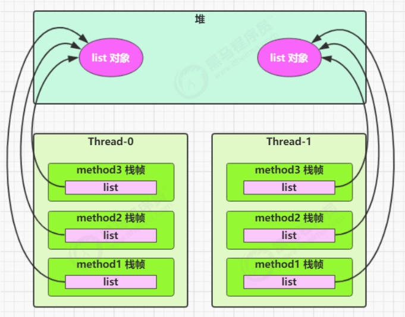

> 方法访问修饰符带来的思考，如果把 method2 和 method3 的方法修改为 public 会不会代理线程安全问题？

会！在 **情况1** 的基础上，为 ThreadSafe 类添加子类，子类覆盖 method2 或 method3 方法，即

```java
class ThreadSafeSubClass extends ThreadSafe{
   @Override
   public void method3(ArrayList<String> list) {
     new Thread(() -> {
       list.remove(0);
     }).start();
   }
}
```

从这个例子可以看出 `private` 或 `final `提供【安全】的意义所在。

## 4 常见的线程安全类

- String
- Integer
- StringBuffer
- Random
- Vector
- Hashtable
- java.util.concurrent 包下的类

线程安全的是指，**多个线程调用它们 同一个实例 的某个方法时，是线程安全的** 。也可以理解为

```java
Hashtable table = new Hashtable();

new Thread(() -> {
  table.put("key", "value1");
}).start();

new Thread(() -> {
  table.put("key", "value2");
}).start();
```

注意：

- 他们的每个方法都是原子的
- 但 **注意** 它们 **多个方法的组合** 不是原子的

### 线程安全类的方法组合

下面代码是线程安全的嘛？

```java
Hashtable table = new Hashtable();
	// 线程1，线程2
if( table.get("key") == null) {
 	table.put("key", value);
}
```

并不是，因为有可能发生：

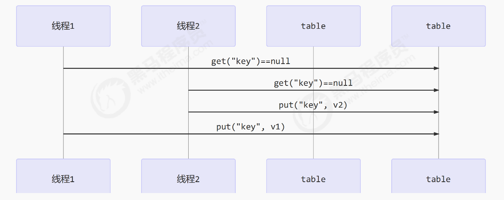

### 不可变类的线程安全性

String、Integer 等都是不可变类，**因为其内部的状态不可以改变，因此它们的方法都是线程安全的** 。

## 5 Monitor

### 5.1 Java对象头

对象头是我们需要关注的重点，它是 synchronized 实现锁的基础，因为 synchronized 申请锁、上锁、释放锁都与对象头有关。

对象头主要结构是由 `Mark Word` 和 `Class Metadata Address` 组成：（以 32 位虚拟机为例）

**普通对象**

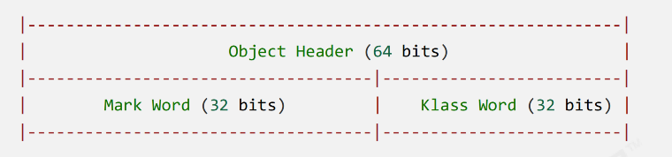

**数组对象**

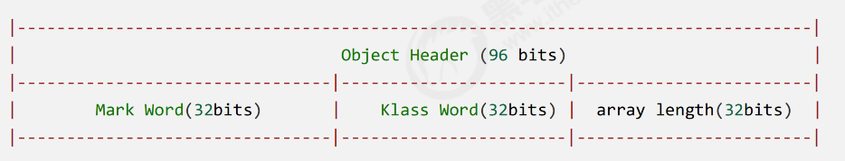

其中 Mark Word 结构为:

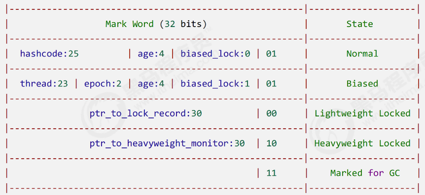

### 5.2 Monitor（锁）

Monitor，常被称为 **监视器** 或 **管程** 。

**在 Java 虚拟机（HotSpot）中，Monitor 是由 ObjectMonitor 实现的**

每个 Java 对象都可以关联一个 Monitor 对象，如果使用 `synchronized` 给对象上锁（重量级）之后，该对象头的 `Mark Word` 中就被设置 **指向 Monitor 对象的指针** 。

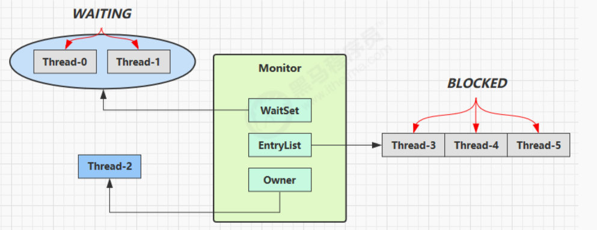

具体步骤：

1. 一开始，Monitor 中的 **Owner** 为 null
2. 当 Thread-2 执行 `synchronized(obj)` 就会将 Monitor 的所有者 Owner 置为 Thread-2，Monitor 中只能有一个 **Owner**
3. 在 Thread-2 上锁的过程中，如果 Thread-3，Thread-4，Thread-5 也来执行 `synchronized(obj)`，就会进入 **EntryList** ，并设置状态为 **BLOCKED**
4. Thread-2 执行完同步代码块的内容，然后 **唤醒** **EntryList** 中等待的线程来竞争锁，竞争时是非公平的
5. 图中 **WaitSet** 中的 Thread-0，Thread-1 是之前获得过锁，但条件不满足，进入 **WAITING** 状态的线程

> 注意！
>
> - `synchronized` 必须是进入同一个对象的 `monitor` 才有上述的效果
> - 不加 `synchronized` 的对象不会关联监视器，不遵从以上规则

## 6 synchronized原理

首先需要明确，`synchronized` 的特性：

- **原子性**：一个操作或者多个操作，要么全部执行并且执行的过程不会被任何因素打断，要么就都不执行
- **可见性**：多个线程访问一个资源时，该资源的状态、值信息等对于其他线程都是可见的
- **有序性**：程序执行的顺序按照代码先后执行
- **可重入性**：当一个线程试图操作一个由其他线程持有的对象锁的临界资源时，将会处于阻塞状态，但当一个线程再次请求自己持有对象锁的临界资源时，这种情况属于重入锁。通俗一点讲就是说一个线程拥有了锁仍然还可以重复申请锁。

来执行下列代码：

```java
static final Object lock = new Object();
static int counter = 0;
public static void main(String[] args) {
   synchronized (lock) {
   		counter++;
   }
}
```

对应的字节码为：

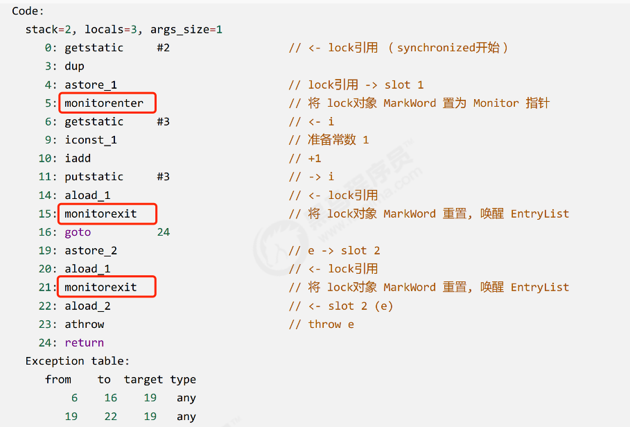

- **monitorenter**：每个对象都是一个监视器锁(monitor)。当 monitor 被占用时就会处于锁定状态，线程执行  monitorenter 指令时尝试获取 monitor 的所有权
- **monitorexit**：执行 monitorexit 的线程必须是 objectref 所对应的 monitor 的所有者。指令执行时，monitor 的进入数减 1，如果减 1 后进入数为 0，那线程退出 monitor，不再是这个 monitor 的所有者。其他被这个 monitor 阻塞的线程可以尝试去获取这个 monitor 的所有权。

### 6.1 轻量级锁

使用场景：如果一个对象虽然有多线程要加锁，**但加锁的时间是错开的（也就是没有竞争）**，那么可以使用轻量级锁来优化。

轻量级锁对使用者是透明的，即语法仍然是 `synchronized` 。

假设有两个方法同步块，利用同一个对象加锁：

```java
static final Object obj = new Object();
public static void method1() {
   synchronized( obj ) {
     // 同步块 A
     method2();
   }
}
public static void method2() {
   synchronized( obj ) {
     // 同步块 B
   }
}
```

步骤：

1. 创建锁记录（Lock Record）对象，每个线程都的栈帧都会包含一个锁记录的结构，内部可以存储锁定对象的 `Mark Word`

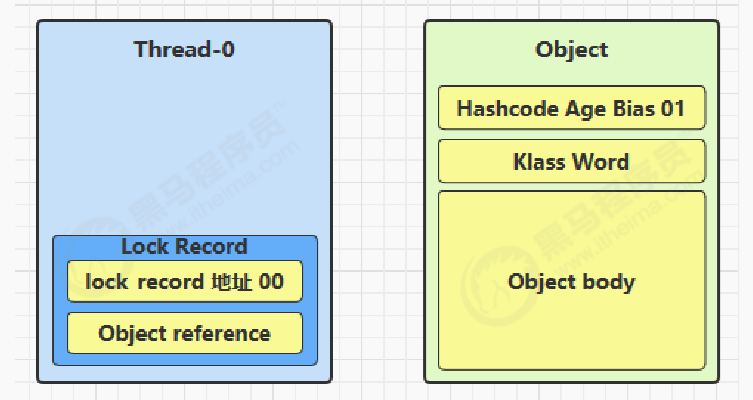

2. 让锁记录中 `Object reference` 指向锁对象，并尝试用 CAS 替换 Object 的 Mark Word，将 Mark Word 的值存入锁记录

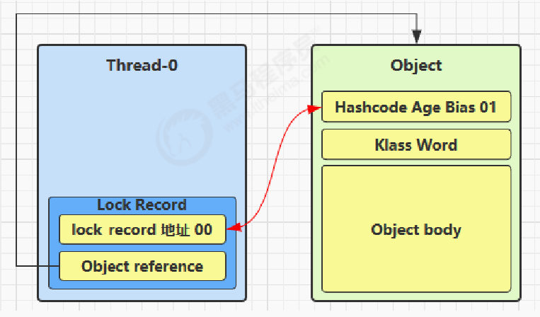

3. 如果 CAS 替换成功，对象头中存储了 `锁记录地址和状态 00` ，表示由该线程给对象加锁，这时图示如下

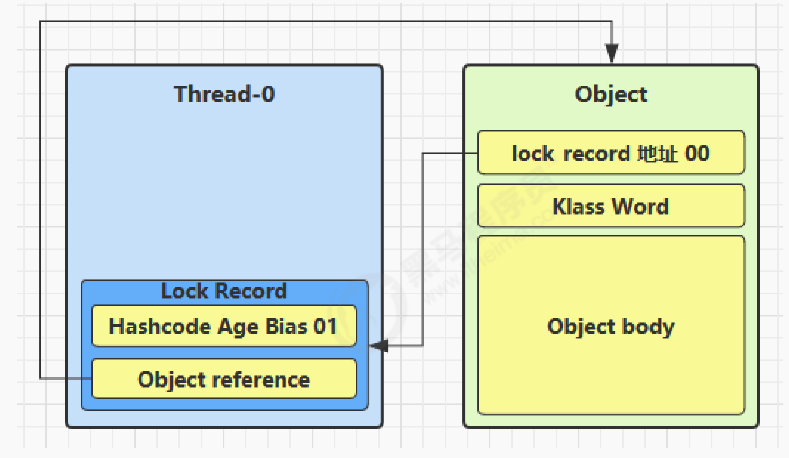

4. 如果 CAS 失败，有两种情况：
   - 如果是其它线程已经持有了该 Object 的轻量级锁，这时表明有竞争，进入 **锁膨胀** 过程
   - 如果是自己执行了 synchronized **锁重入**，那么再 **添加** 一条 Lock Record 作为 **重入的计数**

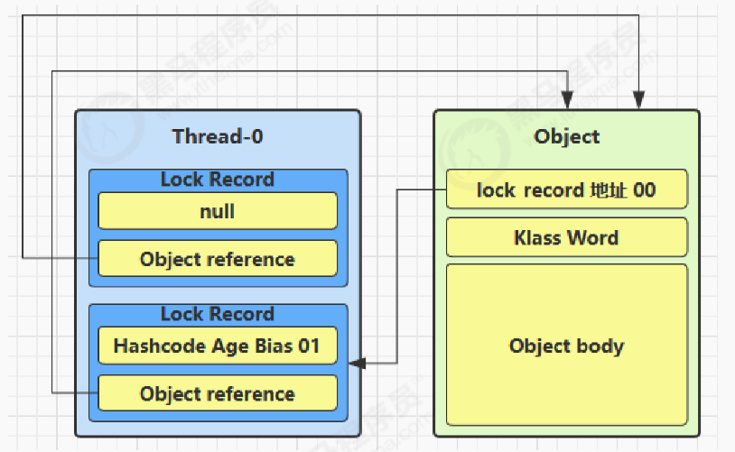

5. 当退出 synchronized 代码块（解锁时）**如果有取值为 `null` 的锁记录，表示有重入**，这时重置锁记录，表示重入计数减一

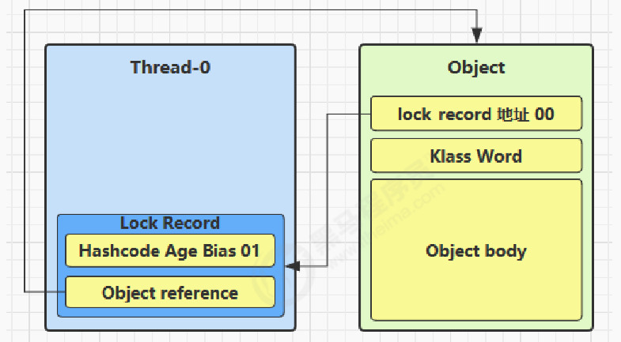

6. 当退出 synchronized 代码块（解锁时）锁记录的值不为 null，这时使用 CAS 将 Mark Word 的值恢复给对象头
   - 成功，则解锁成功
   - 失败，说明轻量级锁进行了 **锁膨胀** 或已经升级为 **重量级锁**，进入重量级锁解锁流程

### 6.2 锁膨胀

如果在尝试加轻量级锁的过程中，CAS 操作无法成功，这时一种情况就是 **有其它线程为此对象加上了轻量级锁（有竞争）**，这时需要进行锁膨胀，**将轻量级锁变为重量级锁** 。

1. 当 Thread-1 进行轻量级加锁时，Thread-0 已经对该对象加了轻量级锁

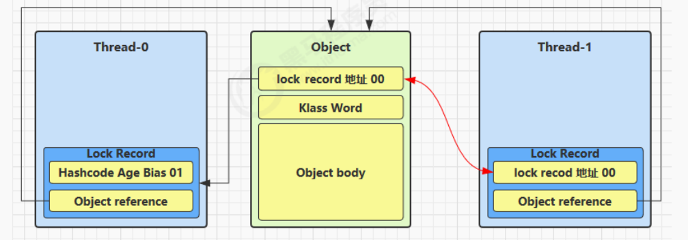

2. 这时 Thread-1 加轻量级锁失败，进入锁膨胀流程
   - 为 Object 对象申请 Monitor 锁，让 Object 指向重量级锁地址
   - 然后自己进入 Monitor 的 EntryList BLOCKED

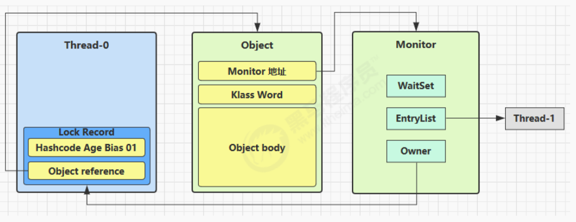

3. 当 Thread-0 退出同步块解锁时，使用 CAS 将 Mark Word 的值恢复给对象头，失败。这时会进入 **重量级解锁** 流程

   即 **按照 Monitor 地址找到 Monitor 对象，设置 Owner 为 null，唤醒 EntryList 中 BLOCKED 线程**

### 6.3 自旋优化

重量级锁竞争的时候，还可以使用自旋来进行优化，如果当前线程 **自旋成功**（即这时候持锁线程已经退出了同步块，释放了锁），这时当前线程就可以 **避免阻塞**。

自旋重试成功的情况：

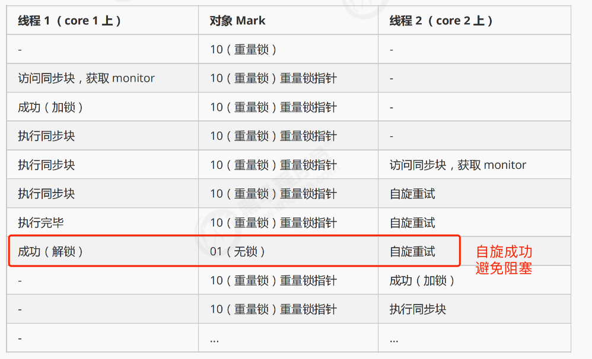

自旋重试失败的情况：

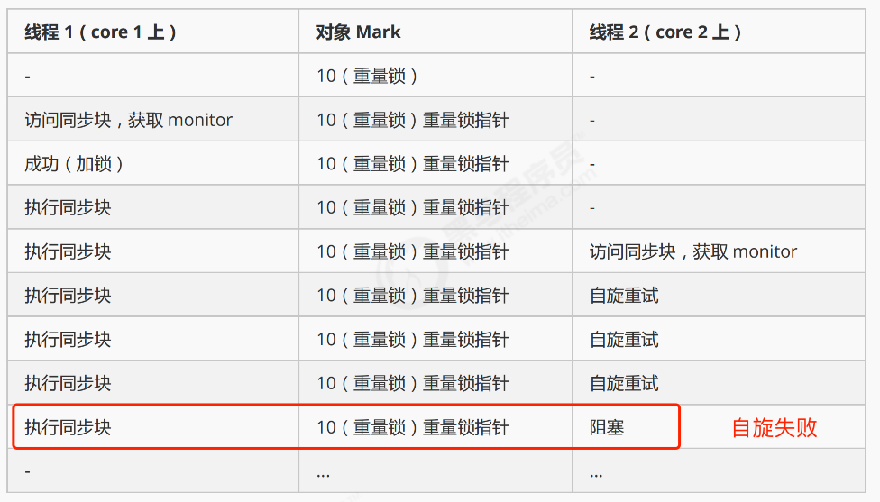

>注意：
>
>- 自旋会占用 CPU 时间，单核 CPU 自旋就是浪费，**多核 CPU 自旋才能发挥优势** 。
>- 在 Java 6 之后 **自旋锁是自适应的** ，比如对象刚刚的一次自旋操作成功过，那么认为这次自旋成功的可能性会高，就多自旋几次；反之，就少自旋甚至不自旋。
>- Java 7 之后 **不能控制是否开启自旋功能** 。

### 6.4 偏向锁

> 一句话总结它的作用：**减少同一线程获取锁的代价**。
>
> 在大多数情况下，锁不存在多线程竞争，总是由同一线程多次获得，那么此时就是偏向锁。
>
> 轻量级锁在没有竞争时（就自己这个线程），每次 **重入** 仍然需要执行 **CAS** 操作。

Java 6 中引入了 **偏向锁** 来做进一步优化：只有第一次使用 CAS 将线程 ID 设置到对象的 Mark Word 头，之后发现这个线程 ID 是自己的就表示没有竞争，**不用重新 CAS**。以后只要不发生竞争，这个对象就归该线程所有。

轻量级锁：

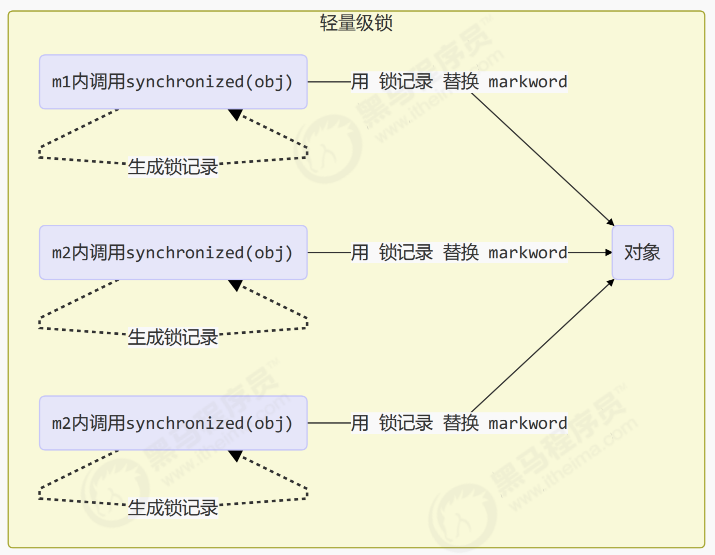

偏向锁：

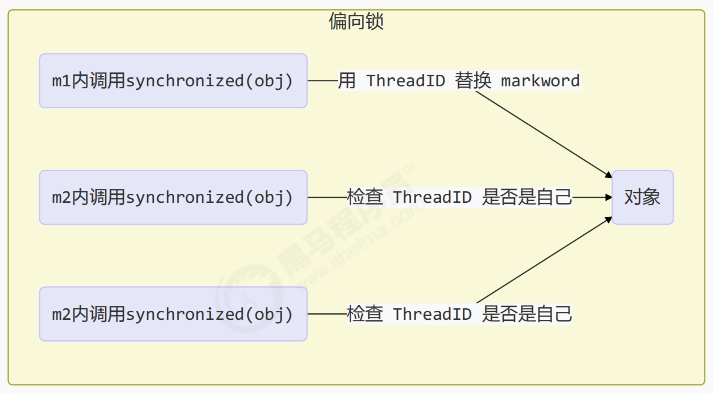

#### 偏向状态

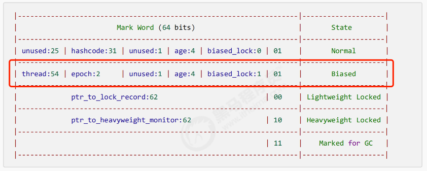

一个对象创建时：

- 如果开启了偏向锁（**默认开启**），那么对象创建后，markword 值为 `0x05`，即最后 3 位为 `101`，此时它的 thread、epoch 和 age 都为 0
- 偏向锁是 **默认是延迟的** ，不会在程序启动时立即生效，如果想避免延迟，可以加 VM 参数来禁用延迟

#### 测试偏向锁

```java
// 添加虚拟机参数 -XX:BiasedLockingStartupDelay=0 
public static void main(String[] args) throws IOException {
     Dog d = new Dog();
     ClassLayout classLayout = ClassLayout.parseInstance(d);
     new Thread(() -> {
         log.debug("synchronized 前");
         System.out.println(classLayout.toPrintableSimple(true));
       
         synchronized (d) {
             log.debug("synchronized 中");
             System.out.println(classLayout.toPrintableSimple(true));
         }
       		
         log.debug("synchronized 后");
         System.out.println(classLayout.toPrintableSimple(true));
     }, "t1").start();
}
```

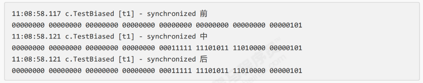

> 处于偏向锁的对象解锁后，线程 id 仍存储于对象头中，直到别的线程对其加锁！

#### 批量重偏向

如果对象虽然被多个线程访问，但没有竞争，这时偏向了线程 T1 的对象仍有机会重新偏向 T2，重偏向会重置对象的 Thread ID。

当撤销偏向锁阈值超过 `20` 次后，jvm 会这样觉得，我是不是偏向错了呢，于是会在给这些对象加锁时 **重新偏向至加锁线程 **。

首先线程 t1 创建三十个对象，并对他们进行加锁解锁：

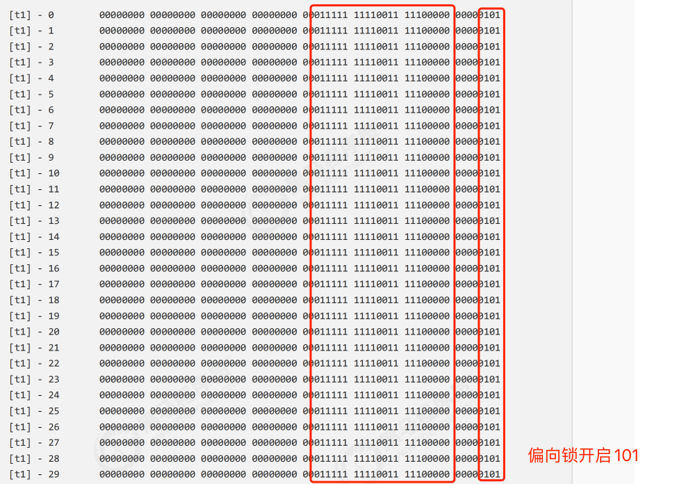

然后，线程 t2 再对这些对象进行加锁解锁。注意，这里故意错开 t1 和 t2 的执行：

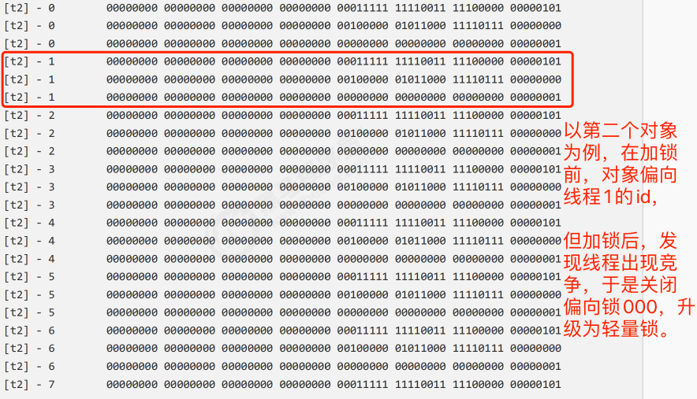

这种情况持续到第二十个对象（序号为19）：

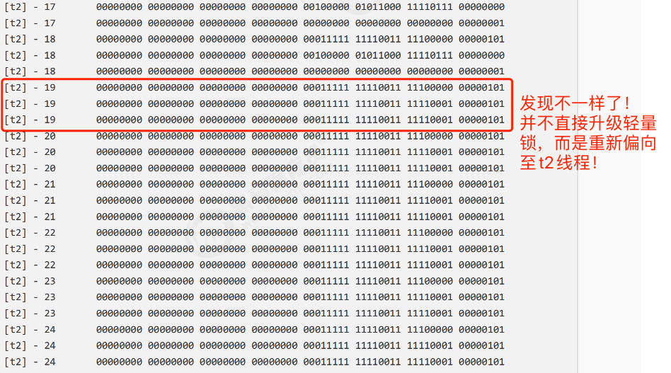

#### 批量撤销

当 **撤销偏向锁** 阈值超过 `40` 次后，jvm 会这样觉得，自己确实偏向错了，根本就不该偏向。

**于是整个类的所有对象都会变为不可偏向的，新建的对象也是不可偏向的！**

### 6.5 锁消除

锁消除是在 **编译器级别** 的事情。

在即时编译器（JIT）时，**如果发现不可能被共享的对象，则可以消除这些对象的锁操作** 。

```java
public class TestLockEliminate {
    public static String getString(String s1, String s2) {
        StringBuffer sb = new StringBuffer();
        sb.append(s1);
        sb.append(s2);
        return sb.toString();
    }
 
    public static void main(String[] args) {
        long tsStart = System.currentTimeMillis();
        for (int i = 0; i < 1000000; i++) {
            getString("TestLockEliminate ", "Suffix");
        }
        System.out.println("一共耗费：" + (System.currentTimeMillis() - tsStart) + " ms");
    }
}
```

上述代码中的 `StringBuffer.append` 是一个同步操作，但是 `StringBuffer` 却是一个 **局部变量**，并且方法也并没有把StringBuffer 返回，所以不可能会有多线程去访问它。那么此时 StringBuffer 中的同步操作就是没有意义的。

开启锁消除：

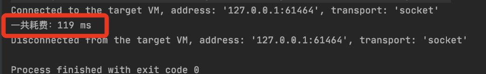

关闭锁消除：

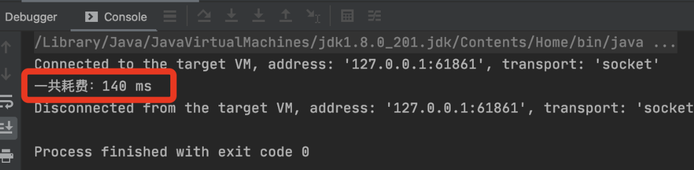

## 7 wait与notify

这里就是对上面 Monitor 的回顾：


有的线程获得锁之后，发现条件不满足（还有别的资源没有得到），那么这时不要一直占用着锁，而是进入 `WaitSet` 进行等待。

- Owner 线程发现条件不满足，调用 `wait` 方法，即可进入 **WaitSet** 变为 **WAITING** 状态
- **BLOCKED** 和 **WAITING** 的线程都处于 **阻塞状态** ，不占用 CPU 时间片
- **BLOCKED** 线程会在 Owner 线程 **释放锁** 时唤醒
- **WAITING** 线程会在 Owner 线程调用 `notify` 或 `notifyAll` 时唤醒
  - 但 **唤醒后并不意味者立刻获得锁，仍需进入 EntryList 重新竞争**

### 相关API

- `obj.wait()` 让进入 object 监视器的线程到 waitSet 等待
- `obj.notify()` 在 object 上正在 waitSet 等待的线程中挑一个唤醒
- `obj.notifyAll()` 让 object 上正在 waitSet 等待的线程全部唤醒

### 与sleep比较

sleep(long n) 和 wait(long n) 的区别：

- sleep 是 **Thread** 方法，而 wait 是 **Object** 的方法
- sleep 不需要强制和 synchronized 配合使用，但 wait 需要和 synchronized 一起用
- sleep 在睡眠的同时，不会释放对象锁的，但 wait 在等待的时候会释放对象锁
- 它们状态都是 **TIMED_WAITING**

## 8 多把锁

一间大屋子有两个功能：睡觉、学习，互不相干。现在小南要学习，小女要睡觉，但如果只用一间屋子（一个对象锁）的话，那么并发度很低。解决方法是准备多个房间（多个对象锁）：

```java
public class TestMultiLock {
    public static void main(String[] args) {
        BigRoom bigRoom = new BigRoom();
        new Thread(() -> {
            bigRoom.study();
        },"小南").start();
        new Thread(() -> {
            bigRoom.sleep();
        },"小女").start();
    }
}

@Slf4j(topic = "c.BigRoom")
class BigRoom {
		
  	// 在 bigroom 的基础上，细粒度划分多把锁
    private final Object studyRoom = new Object();

    private final Object bedRoom = new Object();

    public void sleep() {
        synchronized (bedRoom) {
            log.debug("sleeping 2 小时");
            Sleeper.sleep(2);
        }
    }

    public void study() {
        synchronized (studyRoom) {
            log.debug("study 1 小时");
            Sleeper.sleep(1);
        }
    }
}
```

> 注意，将锁的粒度细分：
>
> - 优点：**可以增强并发度**
> - 缺点：**如果一个线程需要同时获得多把锁，就容易发生死锁**

## 9 线程的活跃性

线程的活跃性主要包括：死锁、活锁、饥饿

### 9.1 死锁

一个线程需要 **同时获取多把锁** ，这时就容易发生死锁。

举个例子：**t1 线程** 获得 **A对象** 锁，接下来想获取 B对象 的锁，**t2 线程** 获得 **B对象** 锁，接下来想获取 A对象 的锁。

#### 如何定位死锁？

检测死锁可以使用 **jconsole** 工具，或者使用 jps 定位进程 id，再用 **jstack** 定位死锁。

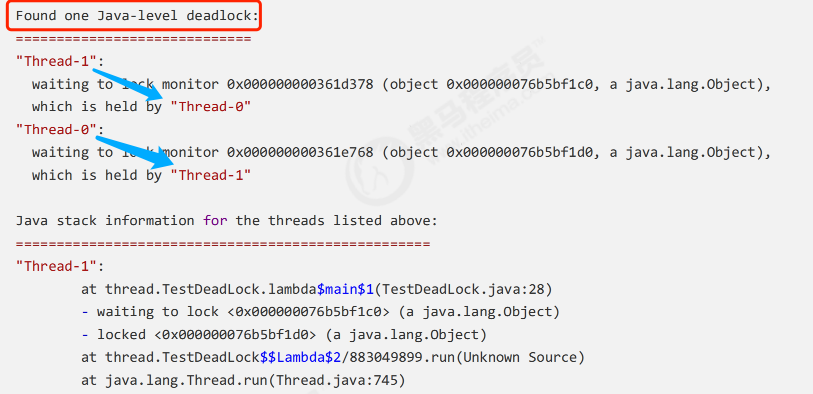

另外，如果由于某个线程进入了死循环，导致其它线程一直等待，对于这种情况 linux 下可以通过 `top` 先定位到 CPU 占用高的 Java 进程，再利用 `top -Hp 进程id` 来定位是哪个线程，最后再用 **jstack** 排查。

### 9.2 活锁

活锁出现在 **两个线程互相改变对方的结束条件，最后谁也无法结束** ，例如：

```java
public class TestLiveLock {
    static volatile int count = 10;
    static final Object lock = new Object();

    public static void main(String[] args) {
        new Thread(() -> {
            // 期望减到 0 退出循环
            while (count > 0) {
                sleep(0.2);
                count--;
                log.debug("count: {}", count);
            }
        }, "t1").start();
        new Thread(() -> {
            // 期望超过 20 退出循环
            while (count < 20) {
                sleep(0.2);
                count++;
                log.debug("count: {}", count);
            }
        }, "t2").start();
    }
}
```

### 9.3 饥饿

线程饥饿：一个线程由于优先级太低，始终得不到 CPU 调度执行，也不能够结束。

解决：ReentrantLock

