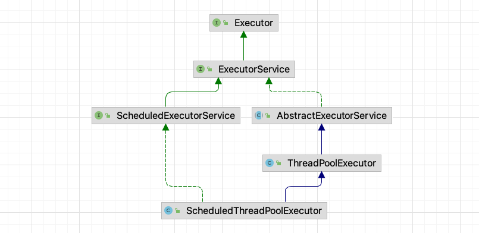
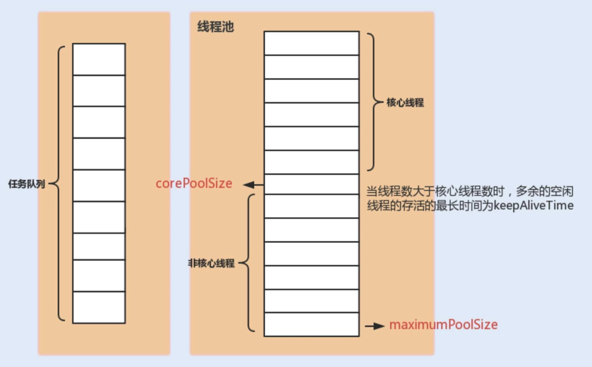
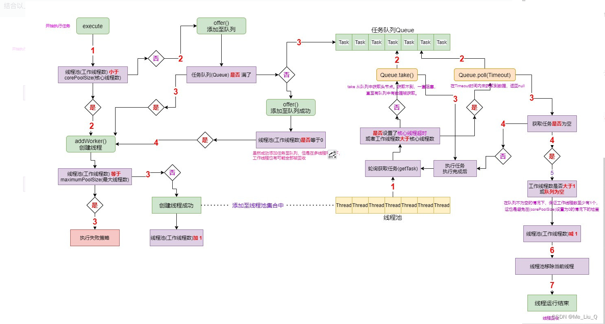
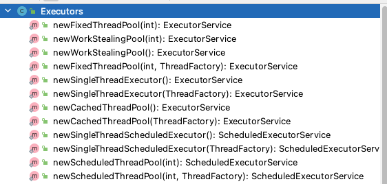

# 【JUC】线程池

JDK 为我们提供的线程池实现：`ThreadPoolExecutor`



## 1 基本介绍

### 1.1 线程池状态

`ThreadPoolExecutor` 使用 int 的高 3 位来表示「线程池状态」，低 29 位表示「线程数量」。

线程池共有五种状态：

|   状态名   | 高 3 位 | 接收新任务 | 处理阻塞队列任务 | 说明                                        |
| :--------: | :-----: | :--------: | :--------------: | :------------------------------------------ |
|  RUNNING   |   111   |     Y      |        Y         |                                             |
|  SHUTDOWN  |   000   |     Y      |        Y         | 不会接收新任务，但会处理阻塞队列剩余任务    |
|    STOP    |   001   |     N      |        N         | 会中断正在执行的任务，并抛弃阻塞队列        |
|  TIDYING   |   010   |     -      |        -         | 任务全部执行完毕，活动线程位0，即将进入终结 |
| TERMINATED |   011   |     -      |        -         | 终结状态                                    |

从数字上比较，`TERMINATED > TIDYING > STOP > SHUTDOWN > RUNNING`

### 1.2 构造方法（重要）

```java
public ThreadPoolExecutor(int corePoolSize,
                          int maximumPoolSize,
                          long keepAliveTime,
                          TimeUnit unit,
                          BlockingQueue<Runnable> workQueue,
                          ThreadFactory threadFactory,
                          RejectedExecutionHandler handler)
```

- `corePoolSize`：核心线程数（最多保留的线程数）
- `maximumPoolSize`：最大线程数
- `keepAliveTime`：针对救急线程的生存时间
- `unit`：生存时间的单位
- `workQueue`：阻塞队列
- `threadFactory`：线程工厂（可以起个好名字）
- `handle`：拒绝策略



### 1.3 工作流程（重要）

大致流程描述：

- 线程池中 **刚开始没有线程**，当一个任务提交给线程池后，线程池会创建一个新线程来执行任务。

- 当线程数达到 `corePoolSize` 并没有线程空闲，这时再加入任务，新加的任务会被加入 `workQueue` 队列排

  队，直到有空闲的线程。

- 如果队列选择了 **有界队列**，那么任务超过了队列大小时，会创建 `maximumPoolSize - corePoolSize` 数目的线

  程来救急。

- 如果线程到达 `maximumPoolSize` 仍然有新任务这时会执行 **拒绝策略**。拒绝策略 jdk 提供了 4 种实现，其它

  著名框架也提供了实现：

  - `AbortPolicy`：让调用者抛出 `RejectedExecutionException` 异常，这是默认策略
  - `DiscardPolicy`：放弃本次任务
  - `DiscardOldestPolicy`：放弃队列中最早的任务，本任务取而代之
  - `CallerRunsPolicy`：让调用者运行任务

- 当高峰过去后，超过 `corePoolSize` 的救急线程如果一段时间没有任务做，需要结束节省资源，这个时间由 `keepAliveTime` 和 `unit` 来控制。

### 1.4 线程工厂

默认的线程工厂 `DefaultThreadFactory`：

```java
static class DefaultThreadFactory implements ThreadFactory {
    private static final AtomicInteger poolNumber = new AtomicInteger(1);
    private final ThreadGroup group;
    private final AtomicInteger threadNumber = new AtomicInteger(1);
    private final String namePrefix;

    DefaultThreadFactory() {
        SecurityManager s = System.getSecurityManager();
        group = (s != null) ? s.getThreadGroup() :
                              Thread.currentThread().getThreadGroup();
        namePrefix = "pool-" +
                      poolNumber.getAndIncrement() +
                     "-thread-";
    }
  	//....
}
```

当然，我们也可以实现 `ThreadFactory` 自定义线程工厂。

## 2 代码分析

### 2.1 工厂方法创建线程池

`Executors` 中，提供了许多静态工厂方法，来帮助创建线程池！



#### newFixedThreadPool

newFixedThreadPool 可以创建**「固定大小」**的线程池：

```java
public static ExecutorService newFixedThreadPool(int nThreads) {
    return new ThreadPoolExecutor(nThreads, nThreads,
            0L, TimeUnit.MILLISECONDS,
            new LinkedBlockingQueue<Runnable>());
}
```

可以看到：

- 它的「核心线程数」=「最大线程数」，也就是说没有就急线程，因此也无需设置超时时间
- 阻塞队列也是无界的，`LinkedBlockingQueue` 可以放任意数量的任务

> 适用场景：任务数量已知，相对耗时的任务

#### newCachedThreadPool

```java
public static ExecutorService newCachedThreadPool() {
    return new ThreadPoolExecutor(0, Integer.MAX_VALUE,
            60L, TimeUnit.SECONDS,
            new SynchronousQueue<Runnable>());
}
```

- 核心线程数是 `0`，最大线程数是 `Integer.MAX_VALUE` ，救急线程的空闲生存时间是 `60s`，意味着
  - **全部都是救急线程（60s 后可以回收）**
  - **救急线程可以无限创建**
- 队列采用了 `SynchronousQueue` 实现特点是，**它没有容量，没有线程来取是放不进去的**（一手交钱、一手交货）

整个线程池表现为线程数会根据任务量不断增长，没有上限，当任务执行完毕，空闲 1 分钟后释放线程。

> 适合场景：任务数比较密集，但每个任务执行时间较短的情况

#### newSingleThreadExecutor

```java
public static ExecutorService newSingleThreadExecutor() {
    return new FinalizableDelegatedExecutorService
            (new ThreadPoolExecutor(1, 1,
                    0L, TimeUnit.MILLISECONDS,
                    new LinkedBlockingQueue<Runnable>()));
}
```

> 使用场景：希望多个任务排队执行。**线程数固定为 1，任务数多于 1 时，会放入无界队列排队。**任务执行完毕，这唯一的线程也不会被释放。

与「不用线程池」的区别：

- 自己创建一个单线程串行执行任务，**如果任务执行失败而终止那么没有任何补救措施**
- 而 `newSingleThreadExecutor` 线程池还会新建一个线程，保证池的正常工作

### 2.2 提交任务

线程池中提交任务的方式：

```java
// 执行任务
void execute(Runnable command);

// 提交任务 task，用返回值 Future 获得任务执行结果（保护性暂停方式接收返回值）
<T> Future<T> submit(Callable<T> task);

// 提交 tasks 中所有任务
<T> List<Future<T>> invokeAll(Collection<? extends Callable<T>> tasks)
        throws InterruptedException;

// 提交 tasks 中所有任务，带超时时间
<T> List<Future<T>> invokeAll(Collection<? extends Callable<T>> tasks,
                              long timeout, TimeUnit unit)
        throws InterruptedException;

// 提交 tasks 中所有任务，哪个任务先成功执行完毕，返回此任务执行结果，其它任务取消
<T> T invokeAny(Collection<? extends Callable<T>> tasks)
        throws InterruptedException, ExecutionException;

// 提交 tasks 中所有任务，哪个任务先成功执行完毕，返回此任务执行结果，其它任务取消，带超时时间
<T> T invokeAny(Collection<? extends Callable<T>> tasks,
                long timeout, TimeUnit unit)
        throws InterruptedException, ExecutionException, TimeoutException;
```

### 2.3 关闭线程池

#### shutdown

```java
void shutdown();
```

- 线程池状态变为 `SHUTDOWN`
- 不会接收新任务，但已提交任务会执行完
- 此方法不会阻塞调用线程的执行

```java
public void shutdown() {
    final ReentrantLock mainLock = this.mainLock;
    mainLock.lock();
    try {
        checkShutdownAccess();
        // 修改线程池状态
        advanceRunState(SHUTDOWN);
        // 仅会打断空闲线程
        interruptIdleWorkers();
        onShutdown(); // 扩展点 ScheduledThreadPoolExecutor
    } finally {
        mainLock.unlock();
    }
    // 尝试终结(没有运行的线程可以立刻终结，如果还有运行的线程也不会等)
    tryTerminate();
}
```

#### shutdownNow

```java
List<Runnable> shutdownNow();
```

- 线程池状态变为 `STOP`
- 不会接收新任务
- 会将队列中的任务返回，并用 interrupt 的方式中断正在执行的任务

```java
public List<Runnable> shutdownNow() {
    List<Runnable> tasks;
    final ReentrantLock mainLock = this.mainLock;
    mainLock.lock();
    try {
        checkShutdownAccess();
      	// 修改线程池状态
        advanceRunState(STOP);
      	// 打断所有线程
        interruptWorkers();
      	// 获取队列中剩余任务
        tasks = drainQueue();
    } finally {
        mainLock.unlock();
    }
  	// 终结
    tryTerminate();
    return tasks;
}
```

#### 其他方法

```java
// 不在 RUNNING 状态的线程池，此方法就返回 true
boolean isShutdown();

// 线程池状态是否是 TERMINATED
boolean isTerminated();

// 调用 shutdown 后，由于调用线程并不会等待所有任务运行结束，
// 因此如果它想在线程池 TERMINATED 后做些事情，可以利用此方法等待
boolean awaitTermination(long timeout, TimeUnit unit) throws InterruptedException;
```

