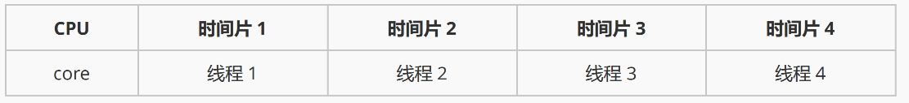
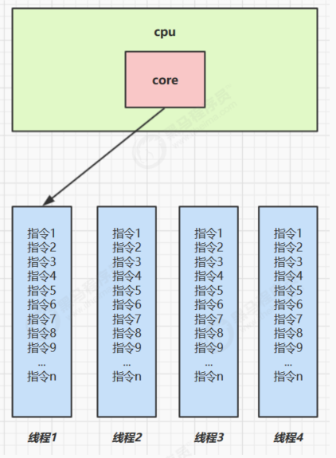
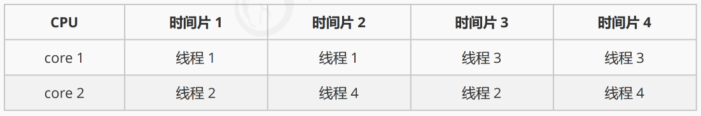
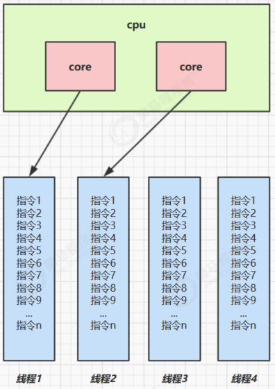

# 【JUC】基本概念

## 1、进程与线程

### 进程

程序由指令和数据组成，但这些指令要运行，数据要读写，就必须将指令加载至 CPU，数据加载至内存。在指令运行过程中还需要用到磁盘、网络等设备。

> **进程就是用来 加载指令、管理内存、管理 IO 的。**

当一个程序被运行，从磁盘加载这个程序的代码至内存，这时就开启了一个进程。进程就可以视为程序的一个实例。大部分程序可以同时运行多个实例进程（例如记事本、画图、浏览器等），也有的程序只能启动一个实例进程（例如网易云音乐、360 安全卫士等）

### 线程

一个进程之内可以分为一到多个线程。

**一个线程就是一个指令流**，将指令流中的一条条指令以一定的顺序交给 CPU 执行。

> Java 中，**线程作为最小调度单位**，**进程作为资源分配的最小单位** 。 在 windows 中进程是不活动的，只是作为线程的容器。

### 二者对比

1. 进程基本上相互独立的，而线程存在于进程内，是进程的一个子集。
2. 进程拥有共享的资源，如内存空间等，供其内部的线程共享。
3. 进程间通信较为复杂，线程通信相对简单，因为它们共享进程内的内存，一个例子是多个线程可以访问同一个共享变量。
4. **线程更轻量，线程上下文切换成本一般上要比进程上下文切换低** 。

## 2、并行与并发

### 并发

一般会将 **线程轮流使用 CPU 的做法称为并发**，`concurrent`



单核 cpu 下，线程实际还是 **串行执行** 的。操作系统中有一个组件叫做任务调度器，将 cpu 的时间片（windows 下时间片最小约为 15 毫秒）分给不同的程序使用，只是由于 cpu 在线程间（时间片很短）的切换非常快，人类感觉是同时运行的。总结为一句话就是： **微观串行，宏观并行** 。



### 并行

多核 cpu下，每个 **核（core）** 都可以调度运行线程，这时候线程可以是 **并行** 的。





> 也就是：
>
> - 并发（concurrent）是 **同一时间应对（dealing with）多件事情的能力**
>
> - 并行（parallel）是 **同一时间动手做（doing）多件事情的能力**

## 3、同步与异步

从方法调用的角度而言，如果：

- 需要等待结果返回，才能够继续运行的，称为 **同步**
- 不需要等待结果放回，就能继续运行的，称为 **异步**

同步：

```java
@Slf4j(topic = "c.Sync")
public class Sync {
		// 同步：需要读完文件，才打印日志
    public static void main(String[] args) {
        FileReader.read(Constants.MP4_FULL_PATH);
        log.debug("do other things ...");
    }
}
```

异步：

```java
@Slf4j(topic = "c.Async")
public class Async {
		// 异步：无需等待读完文件
    public static void main(String[] args) {
        new Thread(() -> FileReader.read(Constants.MP4_FULL_PATH)).start();
        log.debug("do other things ...");
    }

}
```


