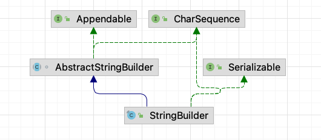

# 【源码分析】StringBuilder

> 本源码分析基于 `Java8`，后续可能会有变化。

## 1 基本概要

`StringBuilder` 表示一个 **可变的字符序列**，并且是 **非线程安全** 的。继承与父类 `AbstractStringBuilder`。



## 2 源码分析

### 2.1 定义

从定义可知，继承于父类 `AbstractStringBuilder`，并且被 `final` 修饰，**不能被继承**！

```java
public final class StringBuilder
    extends AbstractStringBuilder
    implements Serializable, CharSequence
```

实际上，`AbstractStringBuilder` 类具体实现了可变字符序列的一系列操作。

比如：`append()`、`insert()`、`delete()`、`replace()`、`charAt()` 方法等。

`StringBuilder` 类实现了 2 个接口：

- **Serializable** 序列化接口，表示对象可以被序列化。
- **CharSequence** 字符序列接口，提供了几个对字符序列进行只读访问的方法，比如：length()、charAt()、subSequence()、toString()方法等。

### 2.2 主要变量

这两个变量都是定义在抽象父类 `abstract class AbstractStringBuilder` 中的：

`value` 用来存储字符序列中的字符。`value` 是一个 **动态的数组**，当存储容量不足时，会对它进行扩容。

`count` 表示 `value` 数组中已存储的字符数。

```java
// AbstractStringBuilder

char[] value;

int count;
```

### 2.3 构造方法

```java
// 默认构造方法：设置 value 数组大小为 16
public StringBuilder() {
    super(16);
}

// 指定 value 数组大小
public StringBuilder(int capacity) {
    super(capacity);
}

// 接收一个 String 对象，设置 value 数组的初始容量为 （16 + String对象数组的长度）
// 并通过 append 方法添加到 value 数组中
public StringBuilder(String str) {
    super(str.length() + 16);
    append(str);
}

// 接收 CharSequence 对象作为参数，设置 value 数组的初始容量为 （16 + CharSequence对象的长度）
// 并把 CharSequence 对象中的字符添加到 value 数组中
public StringBuilder(CharSequence seq) {
    this(seq.length() + 16);
    append(seq);
}
```

### 2.4 append()

`append()` 方法将 **指定参数类型的字符串** 追加到字符序列的末尾。`StringBuilder` 类提供了一系列的 `append()` 方法，它可以接受 `boolean、char、char[]、CharSequence、double、float、int、long、Object、String、StringBuffer` 这些类型的参数。

这些方法最终都调用了父类 `AbstractStringBuilder` 类中对应的方法。最后，`append()` 方法返回了 `StringBuilder` 对象自身，以便用户可以链式调用 `StringBuilder` 类中的方法。

```java
@Override
public StringBuilder append(boolean b) {
    super.append(b);
    return this;
}

// AbstractStringBuilder.java
public AbstractStringBuilder append(boolean b) {
    if (b) {
        ensureCapacityInternal(count + 4);
        value[count++] = 't';
        value[count++] = 'r';
        value[count++] = 'u';
        value[count++] = 'e';
    } else {
        ensureCapacityInternal(count + 5);
        value[count++] = 'f';
        value[count++] = 'a';
        value[count++] = 'l';
        value[count++] = 's';
        value[count++] = 'e';
    }
    return this;
}    

@Override
public StringBuilder append(String str) {
    super.append(str);
    return this;
}

// AbstractStringBuilder.java
public AbstractStringBuilder append(String str) {
    if (str == null)
        return appendNull();
    int len = str.length();
    ensureCapacityInternal(count + len);
    str.getChars(0, len, value, count);
    count += len;
    return this;
}
```

`append()` 方法在追加字符到 value 数组中之前都会调用 `ensureCapacityInternal()` 方法来确保 value 数组有足够的容量，然后才把字符追加到 value 数组中。

### 2.5 ensureCapacityInternal()

`ensureCapacityInternal()` 方法判断 value 数组的容量是否足够，如果不够，那么调用 `expandCapacity()` 方法进行扩容。

**扩容后的新数组大小 = 2 * 旧数组长度 + 2**

```java
private void ensureCapacityInternal(int minimumCapacity) {
    // overflow-conscious code
  	// 当前需要的最小容量，大于现有的 value 数组长度
  	// 需要进行扩容
    if (minimumCapacity - value.length > 0)
        expandCapacity(minimumCapacity);
}

void expandCapacity(int minimumCapacity) {
  
  	// 扩容长度 = 2 ✖️ 原数组长度 + 2
  	// +2 是 防止定义为 0 长度，直接 ✖️2 无法扩容
    int newCapacity = value.length * 2 + 2;
    if (newCapacity - minimumCapacity < 0)
        newCapacity = minimumCapacity;
  
    if (newCapacity < 0) {
      	// minimumCapacity < 0 就是发生溢出了
        if (minimumCapacity < 0) // overflow
            throw new OutOfMemoryError();
        newCapacity = Integer.MAX_VALUE;
    }
  	// 数据拷贝到新数组上
    value = Arrays.copyOf(value, newCapacity);
}

// Arrays.java
// 数组拷贝
public static char[] copyOf(char[] original, int newLength) {
    char[] copy = new char[newLength];
    System.arraycopy(original, 0, copy, 0,
                     Math.min(original.length, newLength));
    return copy;
}
```

### 2.6 delete()

`delete()` 方法 **删除指定位置的字符**。删除的字符从指定的 `start` 位置开始，直到 `end-1` 位置。`delete()` 方法也调用了父类 `AbstractStringBuilder` 类中对应的方法。

`delete()` 方法首先检查参数的合法性。当 `end` 大于 `value` 数组中已存储的字符数 `count` 时，`end` 取 `count` 值。最后，当需要删除的字符数大于 1 的时候，调用 System 类的 `arraycopy()` 静态方法进行数组拷贝完成删除字符的操作，并更新 count 的值。

```java
@Override
public StringBuilder delete(int start, int end) {
    super.delete(start, end);
    return this;
}

// AbstractStringBuilder.java
public AbstractStringBuilder delete(int start, int end) {
  	// 参数检查
    if (start < 0)
        throw new StringIndexOutOfBoundsException(start);
    if (end > count)
        end = count;
    if (start > end)
        throw new StringIndexOutOfBoundsException();
    int len = end - start;
    if (len > 0) {
      	// 调用 System.arraycopy 完成拷贝
        System.arraycopy(value, start+len, value, start, count-end);
        count -= len;
    }
    return this;
}
```

### 2.7 replace()

`replace()` 方法 **将指定位置的字符替换成指定字符串中的字符**。替换的字符从指定的 start 位置开始，直到 end-1 位置。

`replace()` 方法也调用了父类 `AbstractStringBuilder` 类中对应的方法。

`replace()` 方法首先检查参数的合法性。当 end 大于 value 数组中已存储的字符数 count 时，end 取 count 值。然后调用 `ensureCapacityInternal()` 方法确保 value 数组有足够的容量。接着调用 System 类的 `arraycopy()` 静态方法进行数组拷贝，主要的作用是从 start 位置开始空出替换的字符串长度 len 大小的位置。最后，调用 String 类的 `getChars() ` 方法将替换的字符串中的字符拷贝到 value 数组中。这样就完成了替换字符的操作。

```java
@Override
public StringBuilder replace(int start, int end, String str) {
    super.replace(start, end, str);
    return this;
}

// AbstractStringBuilder.java
public AbstractStringBuilder replace(int start, int end, String str) {
  	// 检查参数合法
    if (start < 0)
        throw new StringIndexOutOfBoundsException(start);
    if (start > count)
        throw new StringIndexOutOfBoundsException("start > length()");
    if (start > end)
        throw new StringIndexOutOfBoundsException("start > end");

    if (end > count)
        end = count;
    int len = str.length();
    int newCount = count + len - (end - start);
  	// 保证有足够的容量
    ensureCapacityInternal(newCount);
		
  	// 拷贝实现替换
  	// 从 start 位置开始空出替换的字符串长度 len 大小的位置
    System.arraycopy(value, end, value, start + len, count - end);
  	// 将替换的字符串中的字符拷贝到 value 数组中
    str.getChars(value, start);
    count = newCount;
    return this;
}

// String.java
void getChars(char dst[], int dstBegin) {
    System.arraycopy(value, 0, dst, dstBegin, value.length);
}
```

### 2.8 charAt()

`charAt()` 方法返回指定索引处的 char 字符。索引的范围从 0 到 count-1。`charAt()` 方法定义在父类 `AbstractStringBuilder` 类中。

```java
// AbstractStringBuilder.java
@Override
public char charAt(int index) {
    if ((index < 0) || (index >= count))
        throw new StringIndexOutOfBoundsException(index);
    return value[index];
}
```

### 2.9 toString()

`toString()` 方法返回一个表示该字符序列的字符串。

```java
@Override
public String toString() {
    // Create a copy, don't share the array
    return new String(value, 0, count);
}
```

## 3 总结

`StringBuilder` 类：

- 非线程安全，并没有使用 `sychronized` 关键字修饰
- 的对象是一个可变的字符串序列
- 使用了一个 char 数组来存储字符。该数组是一个动态的数组，当存储容量不足时，会对它进行扩容。


