# 【Java IO】题目汇总

### 1 什么是 IO，Java 中 IO 的抽象类基类是什么？

IO 指的是 Input/Output，即输入/输出。

- 输入：把数据从外部存储中输入到计算机内存（**入内存**）
- 输出：把数据从计算机内存中输出到外部存储（**出内存**）

Java 中 IO 的抽象基类有四个：

- **InputStream**：字节输入流。`java.io.InputStream` 抽象类是所有字节输入流的父类。
  - `FileInputStream` 是一个比较常用的字节输入流对象，可直接指定文件路径，可以直接读取单字节数据，也可以读取至字节数组中。
- **OutputStream**：字节输出流。`java.io.OutputStream` 抽象类是所有字节输出流的父类。
- **Reader**：字符输入流。`java.io.Reader` 抽象类是所有字符输入流的父类。
- **Writter**：字符输出流。`java.io.Writer` 抽象类是所有字节输出流的父类。

### 2 常用的字符编码（字符集）所占位数？

常见字符集有 `utf-8`，`unicode` 和 `gbk` ：

- `utf-8` ：英文 1 字节，中文 3 字节
- `unicode` ：任何字符都占 2 字节
- `gbk` ：英文 1 字节，中文 2 字节

### 3 什么是缓冲流？有什么作用？

**字节（字符）缓冲流** 就是在原始的 **字节（字符）缓冲流** 的基础上，采用 **装饰器设计模式**，来增强子类对象的功能。它在原始流的基础上增加了一个缓冲区，避免频繁的 IO 操作。

缓冲流将数据加载至 **缓冲区（长度为 8192 的字节（字符）数组）**，一次性读取/写入多个字节，从而避免频繁的 IO 操作，提高流的传输效率。

### 4 Linux IO 的读写方式有哪些？

在 DMA 技术出现前，应用程序与磁盘间的 I/O 操作 **都通过 CPU 中断** 完成。外部存储设备 **采用中断方式主动通知 CPU** ，**CPU 负责拷贝数据到内核缓冲区，再拷贝到用户缓冲区**，每次就会有 **上下文切换的开销 及 CPU 拷贝的时间** 。


DMA 全称叫 **直接内存存取（Direct Memory Access）**，是一种 **允许外围设备直接访问系统主存的机制**。

CPU 通知 **DMA 控制器拷贝外部存储设备数据到内核缓冲区**，完成后再通知 CPU 拷贝到用户缓冲区。和 I/O 中断方式相比，改由内存来执行外部存储器数据的 I/O 操作，**减轻了CPU负担**，且 CPU 读取内存比读取外部存储设备速度要快。目前大多数硬件设备，包括磁盘、网卡、声卡等都支持 DMA 技术。

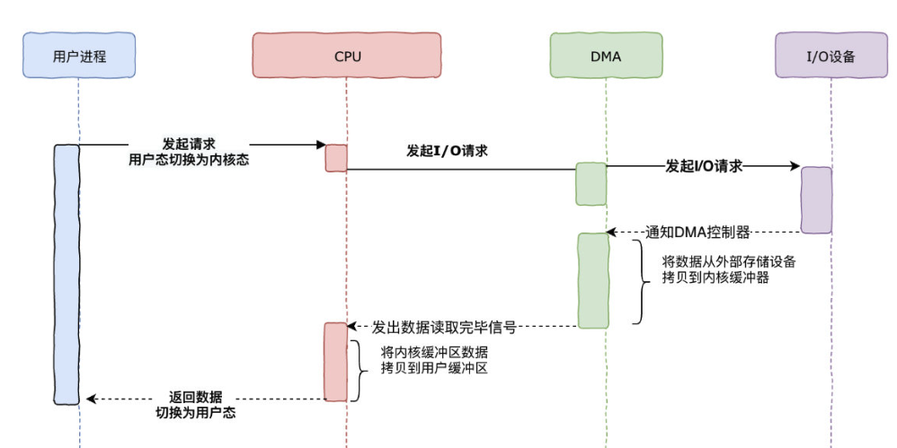

### 5 什么是零拷贝？

**零拷贝** 是指 **计算机执行 IO 操作时，CPU 不需要将数据从一个存储区域复制到另一个存储区域**，进而减少上下文切换以及 CPU 的拷贝时间。它是一种 **IO 操作优化技术** 。

如下图，传统 IO 需要做 **4 次上下文切换**，和 **4 次拷贝（2 次 CPU、2 次 DMA）**。

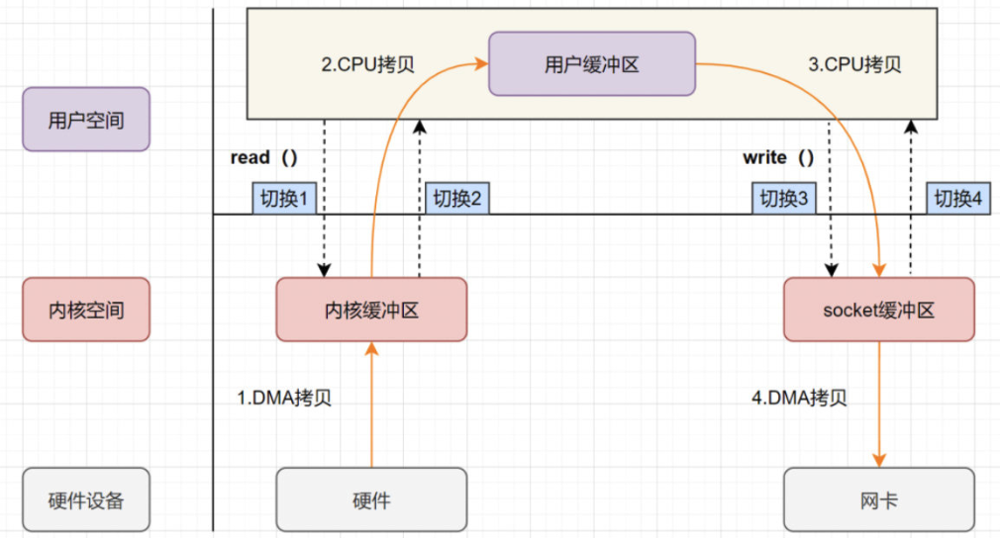

**零拷贝并不是没有拷贝数据，而是 减少用户态、内核态的切换次数 以及 CPU拷贝次数！** 主要有以下三个技术：

#### mmap

> 在虚拟内存中，可以把 内核空间 和 用户空间 的 **虚拟地址映射到同一个物理地址，从而减少数据拷贝次数！**

mmap 就是用了 **虚拟内存** 这个特点，**它将内核中的读缓冲区与用户空间的缓冲区进行映射，所有的 IO 都在内核中完成**。mmap+write 实现的零拷贝流程如下：

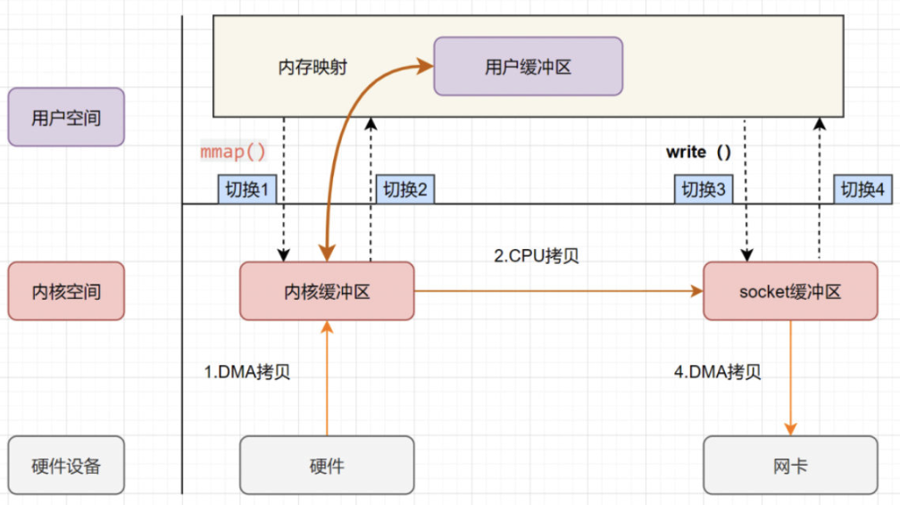

> 1. 用户进程通过调用mmap方法向操作系统内核发起IO调用，***上下文从用户态切换至内核态***
> 2. CPU利用DMA控制器，将数据从硬盘拷贝到内核缓冲区
> 3. ***上下文从内核态切换回用户态***，mmap方法返回
> 4. 用户进程通过调用write方法向操作系统内核再次发起IO调用，***上下文从用户态切换至内核态***
> 5. CPU将内核缓冲区的数据拷贝到socket缓冲区
> 6. CPU利用DMA控制器，将数据从socket缓冲器拷贝到网卡，***上下文从内核态切换至用户态***，write方法返回

整个 MMAP 过程，发生了 **4 次上下文切换 + 1 次 CPU 拷贝 + 2 次 DMA 拷贝**。比传统的 IO 能够减少一次 CPU 拷贝。

#### sendfile

sendfile 表示 **在两个 文件描述符 之间传输数据，它是在操作系统内核中操作的**，避免了数据从内核缓冲区和用户缓冲区之间的拷贝操作，因此可以使用它来实现零拷贝。

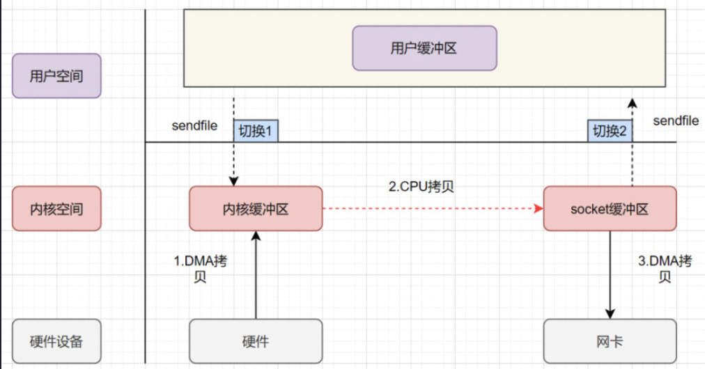

> 1. 用户进程发起sendfile系统调用，***上下文从用户态切换至内核态***
> 2. DMA控制器将数据从硬盘拷贝到内核缓冲区
> 3. CPU将读缓冲区中的数据拷贝到socket缓冲区
> 4. DMA控制器异步把数据从socket缓冲器拷贝到网卡
> 5. ***上下文从内核态切换至用户态***，sendfile函数返回

sendfile实现的零拷贝仅仅发生了 **2 次上下文切换以及 3 次拷贝（2 次 DMA 拷贝+1 次 CPU 拷贝）**

偶然看到，Nginx支持 sendfile 拷贝：

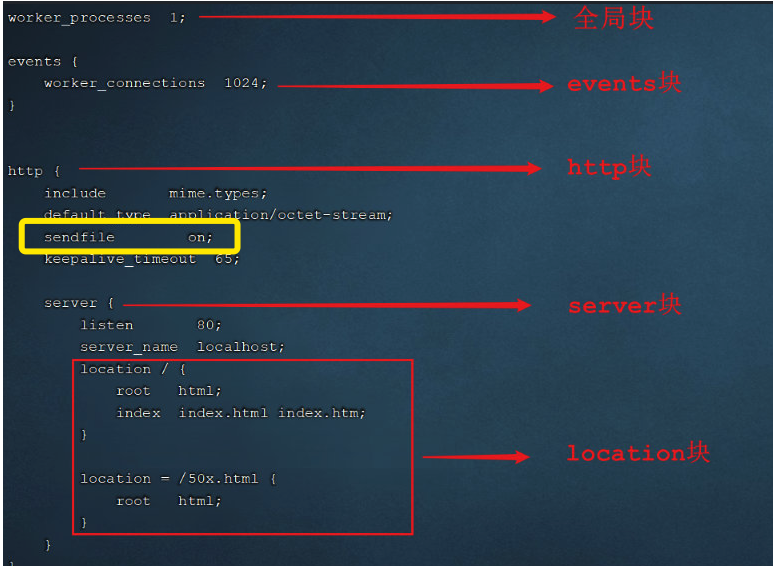

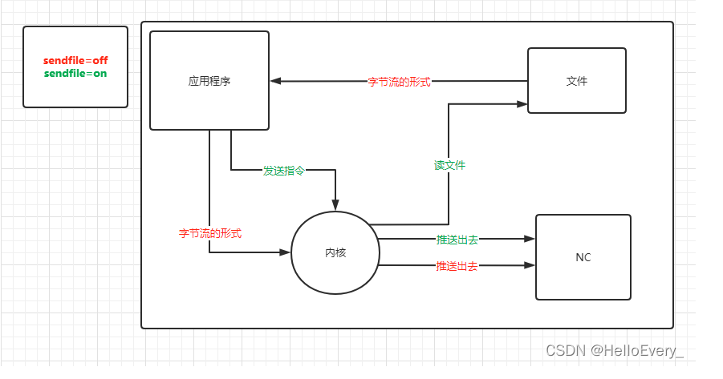

#### sendfile + DMA scatter/gather 实现的零拷贝

linux2.4 对 sendfile 做了优化升级，引入 **SG-DMA** 技术，其实就是对 DMA 拷贝加入了 scatter/gather 操作，它 **可以直接从内核空间缓冲区中将数据读取到网卡** 。

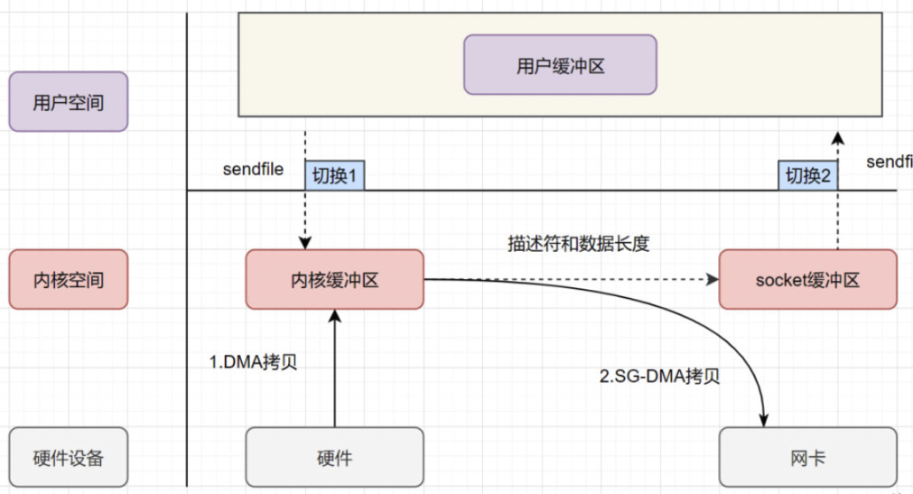

> 1. 用户进程发起sendfile系统调用，***上下文从用户态切换至内核态***
> 2. DMA控制器将数据从磁盘拷贝到内核缓冲器
> 3. CPU把内核缓冲区中的**文件描述符信息**（包括内核缓冲区的内存地址和偏移量）直接发送到socket缓冲区
> 4. DMA控制器根据文件描述符信息直接把数据从内核缓冲区拷贝到网卡
> 5. ***上下文切换至用户态***，sendfile返回

**可以发现 sendfile + DMA scatter/gather 实现的零拷贝发生了 2 次上下文切换以及 2 次数据拷贝，这就是真正的零拷贝技术，全程没有通过 CPU 来搬运数据，所有的数据都是通过 DMA 进行传输的。**

### 6 什么是打印流？

`System.out` 实际是用于获取一个 `PrintStream` 对象，`print`方法实际调用的是 `PrintStream` 对象的 `write` 方法。

`PrintStream` 属于字节打印流，与之对应的是 `PrintWriter` （字符打印流）。

`PrintStream` 是 `OutputStream` 的子类，`PrintWriter` 是 `Writer` 的子类。

```java
public class PrintStream extends FilterOutputStream
    implements Appendable, Closeable {
}
public class PrintWriter extends Writer {
}
```

### 7 什么是随机访问流？有什么作用？

随机访问流指的是支持随意跳转到文件的任意位置进行读写的 `RandomAccessFile` 。

`RandomAccessFile` 的构造方法如下，我们可以指定 `mode`（读写模式）。

```java
// openAndDelete 参数默认为 false 表示打开文件并且这个文件不会被删除
public RandomAccessFile(File file, String mode)
    throws FileNotFoundException {
    this(file, mode, false);
}
// 私有方法
private RandomAccessFile(File file, String mode, boolean openAndDelete)  throws FileNotFoundException{
  // 省略大部分代码
}
```

读写模式主要有下面四种：

- `r` : 只读模式。
- `rw`: 读写模式
- `rws`: 相对于 `rw`，`rws` 同步更新对 **“文件的内容”或“元数据”** 的修改到外部存储设备。
- `rwd` : 相对于 `rw`，`rwd` 同步更新对 **“文件的内容”** 的修改到外部存储设备。

文件内容指的是文件中实际保存的数据，元数据则是用来描述文件属性比如文件的大小信息、创建和修改时间。

`RandomAccessFile` 中有一个 **文件指针** 用来表示下一个将要被写入或者读取的字节所处的位置。我们可以通过 `RandomAccessFile` 的 `seek(long pos)` 方法来 **设置文件指针的偏移量** （距文件开头 `pos` 个字节处）。

如果想要获取文件指针当前的位置的话，可以使用 `getFilePointer()` 方法。

```java
RandomAccessFile randomAccessFile = new RandomAccessFile(new File("input.txt"), "rw");
System.out.println("读取之前的偏移量：" + randomAccessFile.getFilePointer() + ",当前读取到的字符" + (char) randomAccessFile.read() + "，读取之后的偏移量：" + randomAccessFile.getFilePointer());
// 指针当前偏移量为 6
randomAccessFile.seek(6);
System.out.println("读取之前的偏移量：" + randomAccessFile.getFilePointer() + ",当前读取到的字符" + (char) randomAccessFile.read() + "，读取之后的偏移量：" + randomAccessFile.getFilePointer());
// 从偏移量 7 的位置开始往后写入字节数据
randomAccessFile.write(new byte[]{'H', 'I', 'J', 'K'});
// 指针当前偏移量为 0，回到起始位置
randomAccessFile.seek(0);
System.out.println("读取之前的偏移量：" + randomAccessFile.getFilePointer() + ",当前读取到的字符" + (char) randomAccessFile.read() + "，读取之后的偏移量：" + randomAccessFile.getFilePointer());
```

#### 随机访问流的作用

`RandomAccessFile` 比较常见的一个应用就是实现大文件的 **断点续传** 。

何谓断点续传？简单来说就是上传文件中途暂停或失败（比如遇到网络问题）之后，不需要重新上传，只需要上传那些未成功上传的文件分片即可。分片（先将文件切分成多个文件分片）上传是断点续传的基础。

`RandomAccessFile` 的实现依赖于 `FileDescriptor` (文件描述符) 和 `FileChannel` （内存映射文件）。

### 8 Java中的BIO

**BIO 属于同步阻塞 IO 模型** 。

同步阻塞 IO 模型中，应用程序发起 read 调用后，会一直阻塞，直到内核把数据拷贝到用户空间。

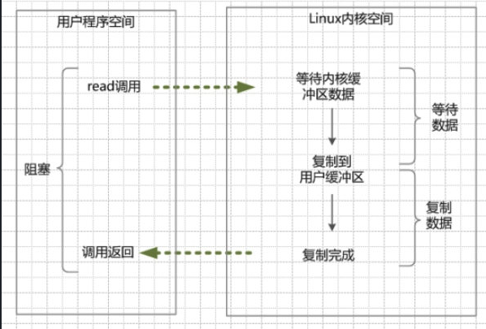

**BIO 的优点：**

程序简单，在阻塞等待数据期间，用户线程挂起。用户线程基本不会占用 CPU 资源。

**BIO 的缺点：**

一般情况下，会为每个连接配套一条独立的线程，或者说一条线程维护一个连接成功的 IO 流的读写。在并发量小的情况下，这个没有什么问题。但是，当在高并发的场景下，需要大量的线程来维护大量的网络连接，内存、线程切换开销会非常巨大。因此，基本上，BIO 模型在高并发场景下是不可用的。

### 9 Java中的NIO

Java 中的 NIO 于 Java 1.4 中引入，对应 `java.nio` 包，提供了 `Channel` , `Selector`，`Buffer` 等抽象。NIO 中的 N 可以理解为 Non-blocking，不单纯是 New。

它是支持 **面向缓冲** 的，基于 **通道的 I/O** 操作方法。 对于高负载、高并发的（网络）应用，应使用 NIO 。

Java 中的 NIO 可以看作是 **I/O 多路复用模型** 。也有很多人认为，Java 中的 NIO 属于同步非阻塞 IO 模型。

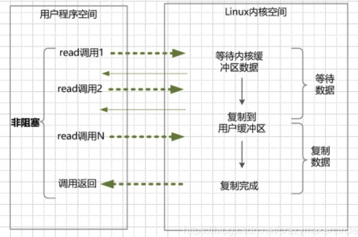

1. 在内核数据没有准备好的阶段，用户线程发起 IO 请求时，**立即返回**。用户线程需要不断地发起 IO 系统调用。
2. 内核数据到达后，用户线程发起系统调用，用户线程阻塞。内核开始复制数据。它就会将数据从 kernel 内核缓冲区，拷贝到用户缓冲区（用户内存），然后 kernel 返回结果。
3. 用户线程才解除 block 的状态，重新运行起来。经过多次的尝试，用户线程终于真正读取到数据，继续执行。

同步非阻塞 IO 模型中，应用程序会 **一直发起 read** 调用，等待数据从内核空间拷贝到用户空间的这段时间里，线程依然是阻塞的，直到在内核把数据拷贝到用户空间。

相比于同步阻塞 IO 模型，同步非阻塞 IO 模型确实有了很大改进。通过轮询操作，避免了一直阻塞。

但是，这种 IO 模型同样存在问题：**应用程序不断进行 I/O 系统调用轮询数据是否已经准备好的过程是十分消耗 CPU 资源的**。

这个时候，**I/O 多路复用模型** 就上场了。

> Java NIO（New IO） 不是IO模型中的NIO模型，而是另外的一种模型，叫做 **IO多路复用模型（IO multiplexing）**。

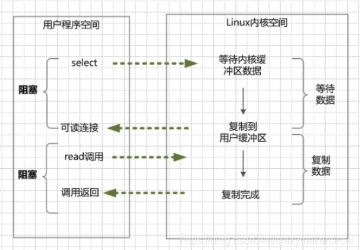

1. 进行 `select/epoll` 系统调用，查询可以读的连接。kernel 会查询所有 select 的可查询 socket 列表，当任何一个socket 中的数据准备好了，select 就会返回。当用户进程调用了 select，那么整个线程会被 block（阻塞掉）。
2. 用户线程获得了目标连接后，发起 read 系统调用，用户线程阻塞。内核开始复制数据。它就会将数据从 kernel 内核缓冲区，拷贝到用户缓冲区（用户内存），然后 kernel 返回结果。
3. 用户线程才解除 block 的状态，用户线程终于真正读取到数据，继续执行。

IO 多路复用模型中，线程首先发起 `select` 调用，询问内核数据是否准备就绪，等内核把数据准备好了，用户线程再发起 `read` 调用。`read` 调用的过程（数据从内核空间 -> 用户空间）还是阻塞的。

> 目前支持 IO 多路复用的系统调用，有 select，epoll 等等。select 系统调用，目前几乎在所有的操作系统上都有支持。
>
> - **select 调用** ：内核提供的系统调用，它支持一次查询多个系统调用的可用状态。几乎所有的操作系统都支持。
> - **epoll 调用** ：linux 2.6 内核，属于 select 调用的增强版本，优化了 IO 的执行效率。

**IO 多路复用模型，通过减少无效的系统调用，减少了对 CPU 资源的消耗。**

Java 中的 NIO ，有一个非常重要的 **选择器 ( Selector )** 的概念，也可以被称为 **多路复用器** 。通过它，只需要一个线程便可以管理多个客户端连接。当客户端数据到了之后，才会为其服务。

**多路复用IO的优点：**

用 select/epoll 的优势在于，它可以同时处理成千上万个连接（connection）。与一条线程维护一个连接相比，I/O多路复用技术的最大优势是：系统不必创建线程，也不必维护这些线程，从而大大减小了系统的开销。

**Java 的 NIO（new IO）技术，使用的就是 IO 多路复用模型**。在 linux 系统上，使用的是 epoll 系统调用。

**多路复用IO的缺点：**

本质上，select/epoll 系统调用，属于同步 IO，也是阻塞 IO。都需要在读写事件就绪后，自己负责进行读写，也就是说这个读写过程是阻塞的。

### 10 Java中的AIO

AIO 也就是 NIO 2。Java 7 中引入了 NIO 的改进版 NIO 2,它是异步 IO 模型。

异步 IO 是 **基于事件和回调机制** 实现的，也就是应用操作之后会直接返回，不会堵塞在那里，当后台处理完成，操作系统会 **通知** 相应的线程进行后续的操作。

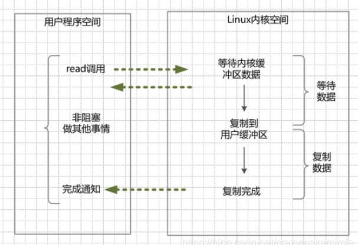

1. 当用户线程调用了read系统调用，立刻就可以开始去做其它的事，用户线程不阻塞。
2. 内核（kernel）就开始了IO的第一个阶段：准备数据。当kernel一直等到数据准备好了，它就会将数据从kernel内核缓冲区，拷贝到用户缓冲区（用户内存）。
3. kernel会给用户线程发送一个信号（signal），或者回调用户线程注册的回调接口，告诉用户线程read操作完成了。
4. 用户线程读取用户缓冲区的数据，完成后续的业务操作。

### Java IO 基本知识

#### 阻塞与非阻塞

- **阻塞 IO，指的是需要内核 IO 操作彻底完成后，才返回到用户空间，执行用户的操作。** 阻塞指的是用户空间程序的执行状态，用户空间程序需等到 IO 操作彻底完成。传统的 IO 模型都是同步阻塞 IO。在 java 中，默认创建的 socket 都是阻塞的。
- **非阻塞 IO，指的是用户程序不需要等待内核 IO 操作完成。** 内核立即返回给用户一个状态值，用户空间无需等到内核的 IO 操作彻底完成，可以立即返回用户空间，执行用户的操作，处于非阻塞的状态。

> 阻塞是指用户空间（调用线程）一直在等待，而且别的事情什么都不做；非阻塞是指用户空间（调用线程）拿到状态就返回，IO 操作可以干就干，不可以干，就去干的事情。

#### 同步与异步

- 同步 IO，是一种用户空间与内核空间的调用发起方式。**同步 IO 是指 用户空间线程 是 主动 发起IO请求的一方**，内核空间是被动接受方。
- 异步 IO 则反过来，是指 **内核 kernel 是主动发起 IO 请求的一方，用户线程是被动接受方。**
