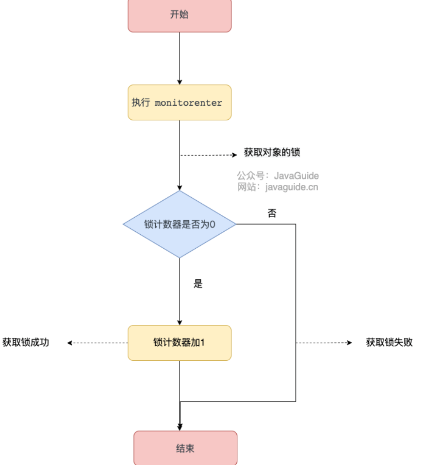

# 【八股】JUC

## 1 synchronized关键字

### 1.1 synchronized 是什么？有什么用？

`synchronized` 是 Java 中的一个关键字。

主要解决的是 **多个线程之间访问资源的同步性**，可以 **保证被它修饰的方法或者代码块在任意时刻只能有一个线程执行** 。

在 Java 早期版本中，`synchronized` 属于 **重量级锁**，效率低下。这是因为 **监视器锁（monitor）** 是依赖于底层的操作系统的 `Mutex Lock` 来实现的，Java 的线程是映射到操作系统的原生线程之上的。如果要挂起或者唤醒一个线程，都需要操作系统帮忙完成，而操作系统实现线程之间的切换时需要从用户态转换到内核态，这个状态之间的转换需要相对比较长的时间，时间成本相对较高。

在 Java 6 之后， `synchronized` 引入了大量的优化如 **自旋锁、适应性自旋锁、锁消除、偏向锁、轻量级锁** 等技术来减少锁操作的开销，这些优化让 `synchronized` 锁的效率提升了很多。因此， `synchronized` 还是可以在实际项目中使用的，像 JDK 源码、很多开源框架都大量使用了 `synchronized`。

如：`HashTable`、`Vector` 等

### 1.2 如何使用 synchronized？

`synchronized` 关键字的使用方式主要有下面 3 种：

1. 修饰实例方法

   相当于 `synchronized(this){}`，也就是给当前 **对象实例** 加锁，进入同步代码前要获得 **当前对象实例的锁** 。

2. 修饰静态方法

   相当于 `synchronized(XXX.class){}`，也就是给当前类加锁，会作用于 **类的所有对象实例** ，进入同步代码前要获得 **当前 class 的锁**。

3. 修饰代码块，对括号里指定的对象/类加锁：

   - `synchronized(object)` 表示进入同步代码库前要获得 **给定对象的锁**。
   - `synchronized(类.class)` 表示进入同步代码前要获得 **给定 Class 的锁**

### 1.3 synchronized 底层原理了解吗？

`synchronized` 同步语句块的实现使用的是 `monitorenter` 和 `monitorexit` 指令，其中 `monitorenter` 指令指向同步代码块的开始位置，`monitorexit` 指令则指明同步代码块的结束位置。

当执行 `monitorenter` 指令时，线程试图获取锁也就是获取 **对象监视器 `monitor`** 的持有权。如果锁的计数器为 0 则表示锁可以被获取，获取后将锁计数器设为 1 也就是加 1。

对象锁的的拥有者线程才可以执行 `monitorexit` 指令来释放锁。在执行 `monitorexit` 指令后，将锁计数器设为 0，表明锁被释放，其他线程可以尝试获取锁。

如果获取对象锁失败，那当前线程就要阻塞等待，直到锁被另外一个线程释放为止。

### 1.4 JDK1.6 之后的 synchronized 底层做了哪些优化？

JDK1.6 对锁的实现引入了大量的优化，如 **偏向锁、轻量级锁、自旋锁、适应性自旋锁、锁消除、锁粗化** 等技术来减少锁操作的开销。

锁主要存在四种状态，依次是：**无锁状态、偏向锁状态、轻量级锁状态、重量级锁状态，他们会随着竞争的激烈而逐渐升级（锁膨胀）** 。注意锁可以升级不可降级，这种策略是为了提高获得锁和释放锁的效率。

### 1.5 synchronized 和 volatile 有什么区别？

`synchronized` 关键字和 `volatile` 关键字是 **两个互补** 的存在，而不是对立的存在！

- `volatile` 关键字是 **线程同步的轻量级实现** ，所以 `volatile` 性能肯定比 `synchronized` 关键字要好 。
  - 但是 `volatile` 关键字 **只能用于变量** 而 `synchronized` 关键字可以 **修饰方法以及代码块** 。
- `volatile` 关键字能 **保证数据的可见性，但不能保证数据的原子性** 。`synchronized` 关键字 **两者都能保证** 。
- `volatile`关键字主要用于 **解决变量在多个线程之间的可见性** ，而 `synchronized` 关键字解决的是 **多个线程之间访问资源的同步性** 。

## 2 ReentrantLock

### 2.1 Synchronized和ReentrantLock的区别？

1. 获取锁和释放锁的机制不同：ReentrantLock **显式** 地获得、释放锁；Synchronized **隐式** 地获得、释放锁
2. 响应中断不同：ReentrantLock **可响应中断**，可轮回；Synchronized **不可响应中断**
3. 底层实现不同：ReentrantLock 是通过 **AQS（AbstractQueuedSynchronizer）程序级别的 API 实现**；synchronized 是 **JVM 层面通过监视器（Monitor）实现的**
4. 锁类型不同：ReentrantLock 可以实现 **公平和非公平锁**；Synchronized 只是非公平锁
5. 用法不同：ReentrantLock 只能用于代码块；synchronized 可以用来修饰普通方法、静态方法和代码块。

