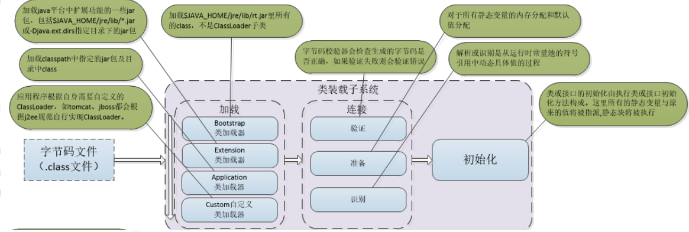

# 【八股】JVM

## 一、内存区域与对象

### 1、Java 的运行时内存区域划分了几块？分别有什么作用？哪些是线程私有的？

一共有五个部分，分别是：

- **程序计数器**
  - 可看作当前线程所执行的字节码的行号指示器，用来控制程序执行流程，如分支、跳转、循环等
  - 线程私有
  - 不会报 OutOfMemoryError
  
- **Java 虚拟机栈**
  
  - 指的是 Java 方法执行的线程内存模型。每个方法被执行的时候，JVM 会同步创建一个栈帧，用于存储局部变量表、操作数栈、动态链接和方法出口等信息。每个方法被调用时入栈，执行完毕后出栈。
  - 线程私有
  - 栈不够深会报 StackOverflowError，栈不够内存扩展会报 OutOfMemoryError
  
- **本地方法栈**
  - 与 Java 虚拟机栈相似，不同之处在于虚拟机栈是为执行的 Java 方法服务；而本地方法栈是为虚拟机使用到的本地方法服务
  - 本地方法：`Object` 类的 `hashCode()`
  - 线程私有
  
- **Java 堆**
  - 用于存放对象实例
  - 共享内存区域
  - 垃圾收集器管理的内存区域
  - 堆无法扩展时，会报 OutOfMemoryError
  
- **方法区**
  - 用于存储已被虚拟机加载的类型信息、常量、静态变量等数据
  - 共享内存区域
  - 可以被垃圾收集器管理：常量池回收和类型的卸载
  - 注意：在 JAVA8 之前，是通过永久代实现；**在 JAVA8 后，是在本机内存中的元空间实现**
  
  

### 2、运行时常量池在内存中的哪里？能否在运行期间加入新的常量？

运行时常量池在 **方法区** 中。具体过程：

- 在进行编译的过程中，会将产生的 **字面量、符号引用** 等信息记录为 **常量池表**，存在 Class 文件中
- 当类加载后，常量池表的内容就放入 **方法区的运行时常量池** 中

运行时常量池的特点就是 **动态性** ！能够支持运行期间加入新的常量，如使用 `String#intern()` 方法。

### 4、字符串常量池StringTable存放在哪？

StringTable 是 Java 虚拟机中的一种数据结构，**它用于存储 字符串常量池 中的字符串对象** ，并且它是 **方法区** 中的一部分。

在 `JDK6` 及之前版本的 JVM 中，方法区的实现是 **永久代(Permanent Generation)**，所以运行时常量池也是在永久代的。

但 `JDK7` 及之后版本的 JVM 已经将字符串常量池从方法区中移了出来，在 **堆（Heap）** 中开辟了一块区域存放运行时常量池。

### 5、Integer等包装类的常量池存放在哪？

**Integer 等包装类的常量池存储在 Java 虚拟机的 方法区 中**。

**在 Java 8 及之前版本中，Integer 类维护了一个缓存区，用于存储在 -128 到 127 之间的整数对象**，这些整数对象是提前创建好的。在需要使用这些整数对象时，会直接从缓存区获取。这个缓存区存储在 IntegerCache 类中，也是存储在方法区中的。而在**Java 9中，这个缓存区被移除，因此 Integer 类中的整数对象都是动态创建的。**

## 二、垃圾收集

### 1、Java中的四种引用类型？区别？

四种引用类型：

- 强引用：最传统的“引用”的定义，代码中的引用赋值。**只要强引用关系还存在，GC永远不会回收被引用的对象！**
- 软引用：还有用，非必需的对象。在系统 **将要发生内存溢出之前，会把这些对象列进回收范围之中进行二次回收** 。
- 弱引用：强度比软引用更弱一点。**弱引用关联的对象，只能存活到下一次 GC 发生为止** 。
- 虚引用：最弱的引用。给一个对象设置虚引用的 **唯一目的只是为了在这个对象被 GC 时收到一个系统调用。**

### 2、如何判断一个对象是否该被垃圾收集？

主要有两种方法：

1. **引用计数法** ：每个对象都有一个引用计数器，当有新的引用指向该对象时，计数器加一，引用失效时，计数器减一。当计数器为0 时，说明该对象不再被引用，可以被垃圾收集器回收。但是，该方法无法解决 **循环引用** 的问题。
2. **可达性分析法** ：从一组 GC Root 出发，只有与 GC Root 对象直接或间接关联的对象才不会被收集，也就是在 GC Root 的引用链上，被引用对象不会被收集。常见的 GC Root：
   - 虚拟机栈中引用的对象。如正在运行的方法的参数，局部变量等
   - 本地方法栈中JNI引用的对象
   - 方法区中静态属性引用的对象，常量引用的对象。如常量池的引用。
   - Java虚拟机内部的引用。如基本数据类型对应的Class对象，常见的异常对象
   - 所有被同步锁（sychronized）持有的对象

### 3、常见的垃圾收集算法有哪些？优缺点

主要有三种，它们都需要对回收的对象进行标记，也就是判定垃圾的过程：

1. 标记-清除：直接回收所有垃圾对象。
   - 优点：快速、简单
   - 缺点：执行效率不稳定（随着大量可回收对象增多，时间增长）；内存空间碎片化（可能导致出发另一次GC）
2. 标记-复制：把堆内存划分为两块，当一块快满了，就把上面还存活的对象复制到另一块，原始块直接全部清除
   - 优点：不存在内存空间碎片；可回收对象一般较少，因此复制成本不会很高
   - 缺点：堆内存空间利用率不高，内存缩小为原来的一半；复制操作也会带来开销
3. 标记-整理：不划分堆内存，让存活的对象都向内存一端移动，然后直接清理掉边界之外的内存
   - 优点：不存在内存空间碎片化
   - 缺点：移动过程需要暂停用户线程 STW，开销较大

### 4、常见的垃圾收集器有哪些？

### 5、G1垃圾收集器

## 三、类加载与类加载器

### 1、描述一下类加载的过程？类的生命周期？

一个类从被加载到虚拟机内存中开始，到被卸载出内存为止，它的生命周期主要包括：

- **加载**，加载过程主要分为三步：
  1. 通过一个类的全限定名，获取定义此类的二进制字节流
  2. 将这个字节流所代表的静态存储结构转化为方法区的运行时数据结构
  3. 在堆内存中生成一个代表此类的 `Class` 对象，作为方法区这个类的各种数据的访问入口
- **连接**
  - **验证** ：确保 Class 文件里的字节流中包含的信息符合《JVM规范》的全部约束
  - **准备** ：为类中的静态变量（static）变量，分配内存并设置类变量的初始值
  - **解析** ：将常量池内的符号引用解析为直接引用
- **初始化** ：执行类构造器 `clinit<>()` 方法，该方法自动收集所有类变量的赋值动作和静态代码块的语句，通过 Javac 编译器自动生成。
- 使用
- 卸载

### 2、什么是符号引用和直接引用？

### 3、常见的类加载器？

### 4、什么是双亲委派模型？

