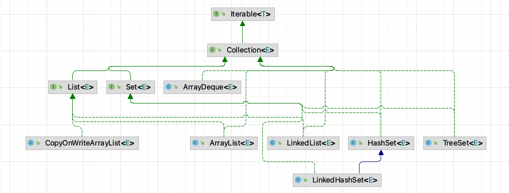
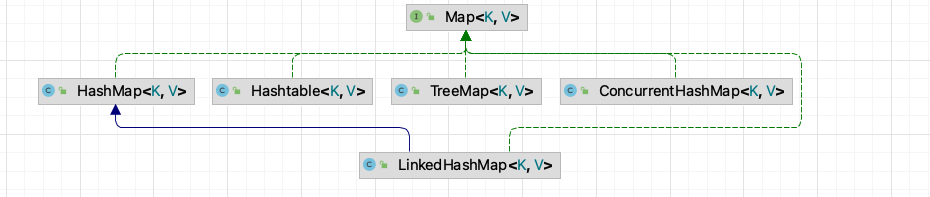

# 【八股】Java容器

**Collection（单列）** 重点容器类：



**Map（双列）** 重点容器类：



- Map 用于保存具有映射关系的数据，键值对形式存储
- Map 中的 key 不允许重复，value 可重复
- 当有相同的 key 插入时，会进行替换

## 1 ArrayList

### 1.1 ArrayList是线程安全的吗？

`ArrayList` 是 Java 提供的容器之一，其内部采用了动态数组实现，同时 **并不是线程安全的**。在多线程的情况下，让线程去修改 数组，会报 `ConcurrentModificationException` 异常，即并发修改异常。

### 1.2 ArrayList不是线程安全的，如何解决？

主要有三种解决方法：

1. 使用 `Vector` 替代 `ArrayList` 

在 `Vector` 中，使用 `synchronized` 关键字实现了线程安全。如 `add(E e)` 方法：

```java
public synchronized boolean add(E e) {
	modCount++;
	ensureCapacityHelper(elementCount + 1);
	elementData[elementCount++] = e;
	return true;
}
```

2. 使用 `Collections` 类提供的方法来修饰 `ArrayList` 

   使用 `Collections.synchronizedList()` 修饰容器可以实现线程安全。

   ```java
   List<String> list = Collections.synchronizedList(new ArrayList<>());
   ```

   但在 **使用迭代器遍历 List 时，需要手动进行同步：**

   ```java
   static class SynchronizedList<E>
           extends SynchronizedCollection<E>
           implements List<E> {
           private static final long serialVersionUID = -7754090372962971524L;
   
           final List<E> list;
   
           SynchronizedList(List<E> list) {
               super(list);
               this.list = list;
           }
           SynchronizedList(List<E> list, Object mutex) {
               super(list, mutex);
               this.list = list;
           }
   
           public boolean equals(Object o) {
               if (this == o)
                   return true;
               synchronized (mutex) {return list.equals(o);}
           }
           public int hashCode() {
               synchronized (mutex) {return list.hashCode();}
           }
   
           public E get(int index) {
               synchronized (mutex) {return list.get(index);}
           }
           public E set(int index, E element) {
               synchronized (mutex) {return list.set(index, element);}
           }
           public void add(int index, E element) {
               synchronized (mutex) {list.add(index, element);}
           }
           public E remove(int index) {
               synchronized (mutex) {return list.remove(index);}
           }
   
           public int indexOf(Object o) {
               synchronized (mutex) {return list.indexOf(o);}
           }
           public int lastIndexOf(Object o) {
               synchronized (mutex) {return list.lastIndexOf(o);}
           }
   
           public boolean addAll(int index, Collection<? extends E> c) {
               synchronized (mutex) {return list.addAll(index, c);}
           }
   
           public ListIterator<E> listIterator() {
               return list.listIterator(); // Must be manually synched by user
           }
   
           public ListIterator<E> listIterator(int index) {
               return list.listIterator(index); // Must be manually synched by user
           }
     .........
   ```

   `SynchronizedList` 就是在 `List` 的操作外包加了一层 `synchronized` 同步控制。

3. 使用 `CopyOnWriteArrayList` 替代 `ArrayList`

   `CopyOnWriteArrayList` 采用的是 **写时复制** 的思想。

   ```java
   List<String> list = new CopyOnWriteArrayList<>();
   ```

   **读不需要锁，可以并行，读和写也可以并行，但多个线程不能同时写，每个写操作都需要先获取锁。** 

   `CopyOnWriteArrayList` 内部使用 `ReentrantLock` 锁：

   ```java
   // 锁声明	
   final transient ReentrantLock lock = new ReentrantLock();
   .....
   // add 方法
   	public boolean add(E e) {
   		final ReentrantLock lock = this.lock;
   		lock.lock();
   		try {
   			Object[] elements = getArray();
   			int len = elements.length;
   			Object[] newElements = Arrays.copyOf(elements, len + 1);
   			newElements[len] = e;
   			setArray(newElements);
   			return true;
   		} finally {
   		lock.unlock();
   		}
   	}
   ```

### 1.3 ArrayList的扩容机制是怎么样的？

`ArrayList` 是一个数组结构的存储容器，**默认情况下，数组的长度为 `10`**，同时我们也可以在构建 `ArrayList` 时指定数组初始长度。随着程序运行，不断地向 `ArrayList` 中添加数据，当添加的数据达到 `10` 个的时候，`ArrayList` 中就没有足够的容量去存储后续的数据，此时 `ArrayList` 会触发自动扩容。扩容的流程：

1. 首先创建一个新的数组，**这个新数组的长度是原来数组长度的 `1.5` 倍**
2. 然后，使用 `Arrays.copyOf()` 方法，把老数组里面的数据拷贝到新的数组里面
3. 扩容完成之后，再把当前需要添加的元素加入到新数组里面

### 1.4 `Arrays.copyOf()` 与 `System.arraycopy()` 区别？

首先来看看 `Arrays.copyOf()`：

```java
public static int[] copyOf(int[] original, int newLength) {
	// 申请一个新的数组
    int[] copy = new int[newLength];
// 调用System.arraycopy,将源数组中的数据进行拷贝,并返回新的数组
    System.arraycopy(original, 0, copy, 0,
                     Math.min(original.length, newLength));
    return copy;
}
```

发现里面实际上还是调用了 `System.arraycopy()`:

    // 我们发现 arraycopy 是一个 native 方法,接下来我们解释一下各个参数的具体意义
    /**
    *   复制数组
    * @param src 源数组
    * @param srcPos 源数组中的起始位置
    * @param dest 目标数组
    * @param destPos 目标数组中的起始位置
    * @param length 要复制的数组元素的数量
    */
    public static native void arraycopy(Object src,  int  srcPos,
                                        Object dest, int destPos,
                                        int length);

**联系：**

看两者源代码可以发现 `copyOf()` 内部实际调用了 `System.arraycopy()` 方法

**区别：**

`arraycopy()` 需要目标数组，将原数组拷贝到你自己定义的数组里或者原数组，而且可以选择拷贝的起点和长度以及放入新数组中的位置 `copyOf()` 是系统自动在内部新建一个数组，并返回该数组。

## 2 LinkedList

### 2.1 LinkedList的底层是如何实现的？有什么特点？

`LinkedList` 的内部是由 **双向链表** 实现的，它同时实现了 `List`、`Deque`、`Queue` 接口，因此可以作为 **队列、双端队列 和 栈** 进行使用。由于是基于双向链表的逻辑结构进行实现，因此：

- 可按需分配空间，不需要预先分配很多空间
- 不支持随机访问，按照索引位置访问的效率也比较低
- 在双端添加、删除元素效率很高
- 在中间插入、删除元素效率很低

### 2.2 Queue接口中，添加、删除、取首元素的方法均有两个，有什么区别？

在 `Queue` 接口中：

- 添加元素：`add`、`offer`
- 删除元素：`remove`、`poll`
- 取首元素：`element`、`peek`

他们的用法一致，区别在于 **对特殊情况的处理方式不同，即在队列为空或队列为满的情况下，处理方式有差异。**

**`add`、`remove` 和 `element` 在特殊情况下会抛出异常，而剩下的则不会！**

> 注意：在 `LinkedList` 中，队列长度是没有限制的，因此不存在满的情况，但在别的 `Queue` 实现类中可能有限制。

## 3 HashSet

### 3.1 HashSet 与 HashMap 之间的区别？

`HashSet` 源码的话就应该知道：`HashSet` 底层就是基于 `HashMap` 实现的。

（`HashSet` 的源码非常非常少，因为除了 `clone()`、`writeObject()`、`readObject()` 是 `HashSet` 自己不得不实现之外，其他方法都是直接调用 `HashMap` 中的方法。

|               `HashMap`                |                          `HashSet`                           |
| :------------------------------------: | :----------------------------------------------------------: |
|           实现了 `Map` 接口            |                       实现 `Set` 接口                        |
|               存储键值对               |                          仅存储对象                          |
|     调用 `put()` 向 map 中添加元素     |             调用 `add()` 方法向 `Set` 中添加元素             |
| `HashMap` 使用键（Key）计算 `hashcode` | `HashSet` 使用成员对象来计算 `hashcode` 值，对于两个对象来说 `hashcode` 可能相同，所以`equals()`方法用来判断对象的相等性 |

### 3.2 Set 接口的特点有什么？

`Set` 的三大特点：

- 无序。无序性是指存储的数据在底层数组中 **并非按照数组索引的顺序** 添加 ，而是根据 **数据的哈希值** 决定的。
- 去重。不可重复性是指添加的元素按照 `equals()` 判断时，返回 false，需要同时重写 `equals()` 方法和 `hashCode()` 方法。

### 3.3 HashSet 的特点有什么？

- 无序
- 去重
- **高效地添加、删除、判断元素是否存在**，效率都为 $O(1)$

### 3.4 比较 HashSet、LinkedHashSet 和 TreeSet 三者的异同

- `HashSet`、`LinkedHashSet` 和 `TreeSet` 都是 `Set` 接口的实现类，**都能保证元素唯一，并且都不是线程安全的**。
- `HashSet`、`LinkedHashSet` 和 `TreeSet` 的主要区别在于底层数据结构不同。`HashSet` 的底层数据结构是 **哈希表**（基于 `HashMap` 实现）。`LinkedHashSet` 的底层数据结构是 **双向链表和哈希表**，元素的插入和取出顺序满足 FIFO。`TreeSet` 底层数据结构是 **红黑树**，元素是有序的，排序的方式有自然排序和定制排序。
- 底层数据结构不同又导致这三者的应用场景不同。`HashSet` 用于不需要保证元素插入和取出顺序的场景，`LinkedHashSet` 用于保证元素的插入和取出顺序满足 FIFO 的场景，`TreeSet` 用于支持对元素自定义排序规则的场景。

## 4 HashMap

### 4.1 HashMap的底层实现？

在 `java1.8` 后，`HashMap` 采用的是 `数组+链表+红黑树` 的底层结构。当链表长度大于阈值（默认为 8）（将链表转换成红黑树前会判断，如果当前数组的长度小于 64，那么会选择先进行数组扩容，而不是转换为红黑树）时，**将链表转化为红黑树，以减少搜索时间**。

> `TreeMap`、`TreeSet` 以及 JDK1.8 之后的 `HashMap` 底层都用到了红黑树。
>
> **红黑树就是为了解决二叉查找树的缺陷，因为二叉查找树在某些情况下会退化成一个线性结构。**

### 4.2 HashMap 的长度为什么是 2 的幂次方?

取余 (%) 操作中 **如果除数是 2 的幂次** 则等价于与其除数减一的与 (&) 操作（也就是说 `hash%length==hash&(length-1)` 的前提是 length 是 2 的 n 次方），并且采用二进制位操作 `&`，相对于 `%` 能够 **提高运算效率**，这就解释了 HashMap 的长度为什么是 2 的幂次方。

（**均匀地散列到新的桶中**）桶数组长度为 2 的正整数幂时，如果桶发生扩容（长度翻倍），则桶中的元素大概只有一半需要切换到新的桶中，另一半留在原先的桶中就可以，并且这个概率可以看做是均等的。

### 4.3 桶中的元素链表何时转换为红黑树，什么时候转回链表，为什么要这么设计？

当链表长度大于或等于阈值（默认为 8）的时候，如果同时还满足容量大于或等于 `MIN_TREEIFY_CAPACITY`（默认为 64）的要求，就会把链表转换为红黑树。同样，后续如果由于删除或者其他原因调整了大小，当红黑树的节点小于或等于 `6` 个以后，又会恢复为链表形态。

单个 `TreeNode` 需要占用的空间大约是普通 `Node` 的两倍，所以只有当包含足够多的 Nodes 时才会转成 TreeNodes，而是否足够多就是由 `TREEIFY_THRESHOLD` 的值决定的。而当桶中节点数由于移除或者 `resize` 变少后，又会变回普通的链表的形式，以便节省空间。

### 4.4 你知道 hash() 的实现吗？为什么要这样实现？为什么要用异或运算符？

JDK 1.8 中，是通过 `hashCode()` 的 **高 16 位异或低 16 位实现的**：`(h = k.hashCode()) ^ (h >>> 16)`。

主要是从速度，功效和质量来考虑的，减少系统的开销，也不会造成因为高位没有参与下标的计算，从而引起的碰撞。 

异或运算符：保证了对象的 `hashCode` 的 32 位值只要有一位发生改变，整个 `hash()` 返回值就会改变，尽可能的减少碰撞。

### 4.5 HashMap 中 put() 方法的过程？

1. 调用哈希函数获取 Key 对应的 hash 值，再计算其数组下标；
2. 如果没有出现哈希冲突，则直接放入数组；如果出现哈希冲突，则以链表的方式放在链表后面；
3. 如果链表长度超过阀值(`TREEIFY THRESHOLD==8`)，就把链表转成红黑树，链表长度低于 6，就把红黑树转回链表;
4. 如果结点的 key 已经存在，则替换其 value 即可；
5. 如果集合中的键值对大于 `12（16*0.75）`，调用 resize 方法进行数组扩容。

### 4.6 拉链法导致的链表过深问题为什么不用二叉查找树代替，而选择红黑树？为什么不一直使用红黑树？

之所以选择红黑树是为了解决二叉查找树的缺陷，**二叉查找树在极端情况下会变成一条线性结构**（这就跟原来使用链表结构一样了，造成很深的问题），遍历查找会非常慢。

而红黑树在插入新数据后可能需要通过左旋，右旋、变色这些操作来 **保持平衡**，引入红黑树就是为了查找数据快 $O(logN)$，解决链表查询深度的问题，我们知道红黑树属于平衡二叉树，但是为了保持“平衡”是需要付出代价的，但是该代价所损耗的资源要比遍历线性链表要少，所以当长度大于8的时候，会使用红黑树，如果链表长度很短的话，根本不需要引入红黑树，引入反而会慢。

### 4.7 说说你对红黑树的见解？

- 每个节点非红即黑
- **根节点总是黑色的**
- **如果节点是红色的，则它的子节点必须是黑色的（反之不一定）**
- **每个叶子节点都是黑色的空节点（NIL节点）**
- **从根节点到叶节点或空子节点的每条路径，必须包含相同数目的黑色节点（即相同的黑色高度）**

### 4.8 HashMap，LinkedHashMap，TreeMap 有什么区别？使用场景？

`LinkedHashMap` 保存了记录的插入顺序，在用 `Iterator` 遍历时，先取到的记录肯定是先插入的；遍历比 HashMap 慢；

`TreeMap` 实现 `SortMap` 接口，能够把它保存的记录根据键排序（默认按键值升序排序，也可以指定排序的比较器）

一般情况下，使用最多的是 HashMap。

- HashMap：在 Map 中插入、删除和定位元素时；

- TreeMap：在需要按自然顺序或自定义顺序遍历键的情况下；

- LinkedHashMap：在需要输出的顺序和输入的顺序相同的情况下。

### 4.9 HashMap 和 HashTable 有什么区别？

- HashMap 是线程不安全的，HashTable 是线程安全的；
- 由于线程安全，所以 HashTable 的效率比不上 HashMap；
- **HashMap 最多只允许一条记录的键为 null，允许多条记录的值为 null，而 HashTable 不允许；**
- HashMap 默认初始化数组的大小为 16，HashTable 为 11，前者扩容时 `扩大两倍`，后者 `扩大两倍 + 1`；
- **HashMap 需要重新计算 hash 值，而 HashTable 直接使用对象的 hashCode**
