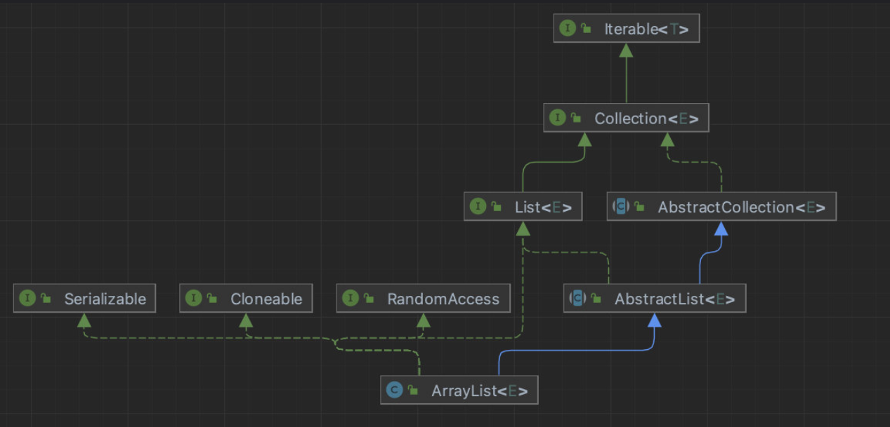
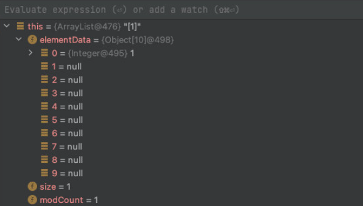
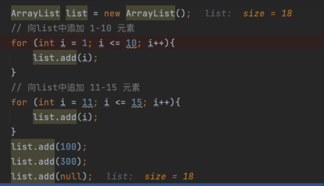

# ArrayList源码分析

> 注意：本笔记分析对象为 `Java8` 版本，随版本不同，源码会发生变化。

## 1 ArrayList类图与简介

`ArrayList`是一个 **非线程安全，基于数组实现的一个动态数组**。可以看到，它的顶层接口是 `Collection<E>` 集合类。



Note：

- `ArrayList` 可以存放所有元素，包括 `null` 
- 底层是由数组实现的
- 基本等同于 `Vector` ，除了 `ArrayList` 是非线程安全的
- 多线程时，建议使用 `vector` 或者 `CopyOnWriteArrayList` 或者 `SynchronizedList`

## 2 ArrayList的扩容

我们来运行以下代码：

```java
public class Main {
    public static void main(String[] args) {
      	// 无指定大小
        ArrayList list = new ArrayList();
        // 向list中添加 1-10 元素
        for (int i = 1; i <= 10; i++){
            list.add(i);
        }
        // 向list中追加 11-15 元素
        for (int i = 11; i <= 15; i++){
            list.add(i);
        }
        list.add(100);
        list.add(300);
        list.add(null);
    }
}
```

打个断点，看看怎么执行的。

### 初始化

首先来到的是，`ArrayList` 的无参构造器。

```java
public ArrayList() {
  this.elementData = DEFAULTCAPACITY_EMPTY_ELEMENTDATA;
}
```

`DEFAULTCAPACITY_EMPTY_ELEMENTDATA` 在类中有定义：

```java
// 共享空数组实例用于默认大小的空实例。
// 我们将它与 EMPTY_ELEMENTDATA 区分开来，以了解添加第一个元素时要膨胀多少。
private static final Object[] DEFAULTCAPACITY_EMPTY_ELEMENTDATA = {};
```

也就是创建了一个空的 `elementData` 数组。

### 添加元素

首先会把 `int` 型数据进行自动装箱：

```java
public static Integer valueOf(int i) {
  if (i >= IntegerCache.low && i <= IntegerCache.high)
    return IntegerCache.cache[i + (-IntegerCache.low)];
  return new Integer(i);
}
```

然后，进入到 `add()` 方法：

```java
public boolean add(E e) {
  // 先确定是否要扩容
  ensureCapacityInternal(size + 1);  // Increments modCount!!
  // 添加元素
  elementData[size++] = e;
  return true;
}
```

我们发现，它首先会调用 `ensureCapacityInternal` ：

> 可以看到 `minCapacity` 就是当前数组大小加一，它意味着，如果想要添加一个元素，最少需要的容量大小！

```java
private void ensureCapacityInternal(int minCapacity) {
  ensureExplicitCapacity(calculateCapacity(elementData, minCapacity));
}
```

我们发现，它又调用 `ensureExplicitCapacity` 和 `calculateCapacity` 这两个方法，我们先来看内层：

```java
private static int calculateCapacity(Object[] elementData, int minCapacity) {
  if (elementData == DEFAULTCAPACITY_EMPTY_ELEMENTDATA) {
    // 如果当前数组为空数组，则返回 DEFAULT_CAPACITY 和 minCapacity 中的最大值
    // 提供一个基本保证
    return Math.max(DEFAULT_CAPACITY, minCapacity);
  }
  // 如果不为空，则满足最小的容量需求即可
  return minCapacity;
}
```

那这里的 `DEFAULT_CAPACITY` 是多大呢？

```java
// 默认初始化容量
private static final int DEFAULT_CAPACITY = 10;
```

也就是，现在虽然我们只需要添加一个元素，但 JVM 帮我们分配了一个大小为 10 的数组。


继续，带着容量 10 进入 `ensureExplicitCapacity` 方法：

```java
private void ensureExplicitCapacity(int minCapacity) {
  modCount++;

  // overflow-conscious code
  // 如果当前最小需求容量 - 现在的实际容量 > 0
  // 说明现在的容量不够，则需要扩容
  // 否则不进入 if ，直接返回即可
  if (minCapacity - elementData.length > 0)
    grow(minCapacity);
}
```

好了，又遇到新东西了，这个 `modCount` 是啥呢？来看看定义：

```java
// 记录当前集合被修改的次数
// 防止有多个线程同时修改它
protected transient int modCount = 0;
```

### 第一次扩容：10

那我们现在 `minCapacity=10` 而 `elementData.length=0`，肯定不够，因此会进行一次扩容操作。

```java
private void grow(int minCapacity) {
  // overflow-conscious code
  // oldCapacity 为 原始大小长度
  int oldCapacity = elementData.length;
  // newCapacity 为 扩容后数组长度
  // 首先会尝试，原始数组长度的 1.5 倍的长度作为扩容数组长度
  int newCapacity = oldCapacity + (oldCapacity >> 1);
  // 如果分了 1.5 被长度满足要求了，直接跳过下面两个if
  if (newCapacity - minCapacity < 0)
    // 1.5倍太少了，不满足 minCapacity 的要求
    // 那就按 minCapacity 的来
    newCapacity = minCapacity;
  if (newCapacity - MAX_ARRAY_SIZE > 0)
    // 如果超过了最大分配容量
    newCapacity = hugeCapacity(minCapacity);
  // minCapacity is usually close to size, so this is a win:
  elementData = Arrays.copyOf(elementData, newCapacity);
}
```

又出现了一个新常量，我们来看看他是啥：

```java
// 分配的数组的最大大小
// 有些虚拟机在数组中保留一些 header。尝试分配更大的数组可能会导致OutOfMemoryError
private static final int MAX_ARRAY_SIZE = Integer.MAX_VALUE - 8;
```

是用来判断是否超过最大数组长度的，目前还不涉及，先不管。

好，回到正题，我们来看看里面具体的值：


显然，我们第一次进来，`oldCapacity=0`，即便乘上 1.5 倍还是 0，肯定不行。于是会进入第一个 `if` 判断，将扩容后的数组长度设置为我们传入的 `newCapacity = minCapacity;`。

> 第一次比较特殊，因为初始数组为空。而后基本上都是按照 1.5 倍扩容进行。

最后，我们可以根据 `newCapacity` 进行扩容了，调用 `Arrays.copyOf` 。

```java
public static <T> T[] copyOf(T[] original, int newLength) {
  return (T[]) copyOf(original, newLength, original.getClass());
}


public static <T,U> T[] copyOf(U[] original, int newLength, Class<? extends T[]> newType) {
  @SuppressWarnings("unchecked")
  // 创建一个新数组，长度为 newLength
  T[] copy = ((Object)newType == (Object)Object[].class)
    ? (T[]) new Object[newLength]
    : (T[]) Array.newInstance(newType.getComponentType(), newLength);
  // 拷贝
  System.arraycopy(original, 0, copy, 0, Math.min(original.length, newLength));
  return copy;
}
```

最后，逐层返回，返回到 `add()` 方法，我们就可以顺利地添加元素了。



### 第二次扩容：15

进入第二个循环，与之前一样。自动装箱，然后调用 `add()` 方法，随后一路进来，发现 `elementData.length=10` 已经不满足 `minCapacity` 了，需要进行第二次扩容。


进入 `grow()` 后，此时 `newCapacity` 设置为原来的 1.5 倍足够满足要求，于是直接扩容至15。


于是，接下来的循环都能够顺利添加了。

### 第三次扩容

到这里，list 又满了（15个元素），发现又要添加元素：

```java
list.add(100);
list.add(300);
list.add(null);
```

所以，还要进行第三次扩容：


这次 `15 >> 1 = 7`，因此又需要扩 7 个大小空间。


扩完之后，顺利地添加 `100`、 `300` 和 `null`。



## 3 ArrayList的初始化

上面我们其实已经看到了 `ArrayList` 的无参初始化，接下来看看如果带有初始化大小参数的构造器是怎么走的。

```java
// 使用带参数初始化 Main.java
ArrayList list = new ArrayList(8);

// ArrayList.java
public ArrayList(int initialCapacity) {
  if (initialCapacity > 0) {
    // 直接初始化一个长度为 initialCapacity 的数组
    this.elementData = new Object[initialCapacity];
  } else if (initialCapacity == 0) {
    this.elementData = EMPTY_ELEMENTDATA;
  } else {
    throw new IllegalArgumentException("Illegal Capacity: "+initialCapacity);
  }
}
```

也就是，如果指定了大小，它直接创建了一个长度为指定大小的 `Object` 数组。

## 4 ArrayList的元素删除

主要看看 `remove()` 方法：

```java
public E remove(int index) {
  	// 首先确认 index 是否合法
    rangeCheck(index);
		
    modCount++;
  	// 保存旧值
    E oldValue = elementData(index);
		
  	// 计算需要进行移动的元素个数
    int numMoved = size - index - 1;
    if (numMoved > 0)
      	// 使用 System.arraycopy 进行元素移动（复制）
        System.arraycopy(elementData, index+1, elementData, index,
                         numMoved);
  
  	// 减少 size，并且设置最后元素为 null，以便垃圾收集
    elementData[--size] = null; // clear to let GC do its work

    return oldValue;
}
```

判断 index 是否合法的函数：

```java
private void rangeCheck(int index) {
    if (index >= size)
      	// 如果大于当前数组长度，则 IndexOutOfBoundsException
        throw new IndexOutOfBoundsException(outOfBoundsMsg(index));
}
```


