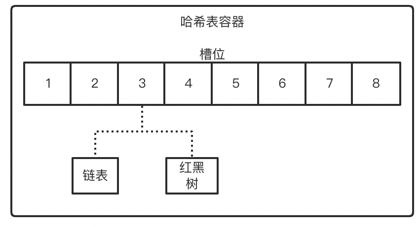

# 【源码分析】ConcurrentHashMap

## 1 基本概述

ConcurrentHashMap 属于线程安全集合类。

> 线程安全集合类：
>
> - （`Sychronized`）遗留的线程安全集合，如：`HashTable`、`Vector` 
> - （`Sychronized` + 装饰器模式）使用 `Collections` 修饰的线程安全集合类
> - （推荐使用）JUC 包内的安全集合类
>   - `Blocking`：大部分实现基于锁，并提供用来阻塞的方法
>   - `CopyOnWrite`：修改时拷贝，适用于读多写少的场景，修改开销较重
>   - `Concurrent` ：
>     - 内部很多操作使用 cas 优化，一般可以提供较高的吞吐量
>     - 弱一致性 

线程安全：保证 Map 中的数据不被破坏，而无法保证多线程并发读写是安全的。



## 2 代码分析

先要明确 `Node` 数据结构：

```java
static class Node<K,V> implements Map.Entry<K,V> {
    final int hash;
    final K key;
    volatile V val;
    volatile Node<K,V> next;
  	// ...
}
```

由于有 `volatile` 修饰 `val` 和 `next`，因此保证了可见性，从而使得并发读不用加锁。

### 2.0 初始化方法

在 jdk8 的 `ConcurrentHashMap` 中一共有 5 个构造方法，这四个构造方法中都没有对内部的数组做初始化，只是对一些变量的初始值做了处理。jdk8 的 ConcurrentHashMap 的数组初始化是在 **第一次添加元素时完成** 。

（1）无参构造：

```java
//没有维护任何变量的操作，如果调用该方法，数组长度默认是 16
public ConcurrentHashMap() {
}
```

（2）传入指定容量大小：

指定大小并不是直接初始化对应大小的 Node 数组，而是计算对应大小，赋值给 `sizeCtl` 变量。真正初始化数组是在 `put` 的时候。

```java
//传递进来一个初始容量，ConcurrentHashMap 会基于这个值计算一个比 这个值大的2的幂次方数 作为初始容量
public ConcurrentHashMap(int initialCapacity) {
    if (initialCapacity < 0)
        throw new IllegalArgumentException();
    int cap = ((initialCapacity >= (MAXIMUM_CAPACITY >>> 1)) ?
               MAXIMUM_CAPACITY :
               tableSizeFor(initialCapacity + (initialCapacity >>> 1) + 1));
    this.sizeCtl = cap;
}
```

例如，传入的 `initialCapacity = 32`，则初始容量为 64！（比它大的，2 的幂次方数）

> 注意区别：调用这个方法，得到的初始容量和 HashMap 以及 jdk7 的 ConcurrentHashMap 不同，即使你传递的是一个 2 的幂次方数，该方法计算出来的 **初始容量依然是比这个值大的 2 的幂次方数**

（3）传入指定初始大小和加载因子的初始化方法：

```java
public ConcurrentHashMap(int initialCapacity, float loadFactor) {
  	// 调用三个参数的构造
    this(initialCapacity, loadFactor, 1);
}
```

（4）传入指定初始大小、加载因子和并发度的初始化方法：

```java
public ConcurrentHashMap(int initialCapacity, float loadFactor, int concurrencyLevel) {
    if (!(loadFactor > 0.0f) || initialCapacity < 0 || concurrencyLevel <= 0)
        throw new IllegalArgumentException();
    if (initialCapacity < concurrencyLevel)   // Use at least as many bins
        initialCapacity = concurrencyLevel;   // as estimated threads
    long size = (long)(1.0 + (long)initialCapacity / loadFactor);
    int cap = (size >= (long)MAXIMUM_CAPACITY) ?
        MAXIMUM_CAPACITY : tableSizeFor((int)size);
    this.sizeCtl = cap;
}
```

（5） 基于一个Map集合，构建一个ConcurrentHashMap

```java
public ConcurrentHashMap(Map<? extends K, ? extends V> m) {
  	// 初始容量为 16
    this.sizeCtl = DEFAULT_CAPACITY;
    putAll(m);
}
```

### 2.1 put 方法

```java
public V put(K key, V value) {
    return putVal(key, value, false);
}
```

与 `put` 方法相似的 `putIfAbsent`，他们都调用了 `putVal` 方法，只是传入的 `boolean` 参数有所区别。

```java
public V putIfAbsent(K key, V value) {
    return putVal(key, value, true);
}
```

我们来看看 `putVal` 方法：

```java
final V putVal(K key, V value, boolean onlyIfAbsent) {
  	// key 和 value 不允许为 null
    if (key == null || value == null) throw new NullPointerException();
  	// 基于传入的 key 计算 hash 值
    int hash = spread(key.hashCode());
  	// 声明了一个标识
    int binCount = 0;
  	// 死循环，声明 tab，为当前 ConcurrentHashMap 的 Node 数组
    for (Node<K,V>[] tab = table;;) {
      	// n: 数组长度
        Node<K,V> f; int n, i, fh;
      
      	// 如果数组为 null，或者数组长度为 0
        if (tab == null || (n = tab.length) == 0)
          	// 初始化数组
            tab = initTable();
      
      	// 说明数组已经初始化了，将数据插入到 map 中
      	// tabAt 获取数组中某一个索引位置的数据（tab[i]），保证可见性
      	// (n - 1) & hash 把 hash 值映射到 [0:n-1] 内
      	// i：Node 数组中的对应 key 的索引
      	// f：当前索引 i 位置的数据
        else if ((f = tabAt(tab, i = (n - 1) & hash)) == null) {
          	// 如果当前索引 i 位置的数据为空，则直接以 CAS 的方式存入数据
          	// casTabAt(数组, i, 2, 3)：以 cas 方式，将数组中 i 位置的数据从 2 修改为 3
            if (casTabAt(tab, i, null, new Node<K,V>(hash, key, value, null)))
              	// 插入成功，返回 true；插入失败，返回 false
                break;
        }
      
      	//如果 hash 计算得到的桶位置元素的 hash 值为 MOVED，证明正在扩容，那么协助扩容
        else if ((fh = f.hash) == MOVED)
            tab = helpTransfer(tab, f);
      	
      	// 桶内元素不为空，并且没有在扩容，则进行元素添加
        else {
          	// 出现了 Hash 冲突，需要将数据挂到链表上，或者添加到红黑树中
            V oldVal = null;
          	// synchronized 锁定的是桶！保证桶内的元素插入是线程安全的！
            synchronized (f) {
              	// 拿到 i 索引位置的数据，判断跟锁是否是同一个
                if (tabAt(tab, i) == f) {
                  	// 当前桶下是链表，或者是空！
                    if (fh >= 0) {
                        binCount = 1;
                        for (Node<K,V> e = f;; ++binCount) {
                            K ek;
                          	// 当前数据的哈希值，是否等于要插入数据的哈希值
                            if (e.hash == hash &&
                                // 值一样，不是添加，是修改操作
                                ((ek = e.key) == key ||
                                 (ek != null && key.equals(ek)))) {
                              	// 获取当前位置的 val 值
                                oldVal = e.val;
                              	// 是否是 onlyIfAbsent 
                              	// 如果为 false，则覆盖数据
                              	// 如果为 true，则什么都不做
                                if (!onlyIfAbsent)
                                    e.val = value;
                                break;
                            }
                          	// 说明是追加操作，而不是修改
                            Node<K,V> pred = e;
                          	// 尾插法
                            if ((e = e.next) == null) {
                              	// 如果 next 指向的是 null，就直接插入到后面
                                pred.next = new Node<K,V>(hash, key, value, null);
                                break;
                            }
                        }
                    }
                  	// 说明桶下是树
                    else if (f instanceof TreeBin) {
                        Node<K,V> p;
                        binCount = 2;
                        if ((p = ((TreeBin<K,V>)f).putTreeVal(hash, key, value)) != null) {
                            oldVal = p.val;
                            if (!onlyIfAbsent)
                                p.val = value;
                        }
                    }
                }
            }
          	// 判断 binCount 
            if (binCount != 0) {
              	// 是否大于等于 TREEIFY_THRESHOLD = 8
              	// 如果大于等于 8 ，判断是否需要将链表转化为红黑树
                if (binCount >= TREEIFY_THRESHOLD)
                    treeifyBin(tab, i);
                if (oldVal != null)
                    return oldVal;
                break;
            }
        }
    }
  	// 集合长度维护
    addCount(1L, binCount);
    return null;
}
```

可以看到，在 `put` 的时候，**锁定的是哈希桶（即链表的头节点或者红黑树的根节点）**。一方面可以保证多线程情况下，添加元素是线程安全的；另一方面，对某个桶的加锁，不影响其他桶的添加操作，提升多线程的并发效率。

链表长度 8 的设置是通过统计学的泊松分布计算而来，是一个小概率事件。

### 2.2 spread 方法

`spread` 方法是散列算法，旨在如何尽量避免哈希冲突。

可以看到，`putVal` 中调用了 `spread` 来计算对应 key 的哈希值。

```java
static final int spread(int h) {
  	// h = key.hashCode();
  	// 把 哈希值 进行无符号右移了 16 位，并且与 h 进行异或运算
  	// HASH_BITS = 0x7fffffff 最高位为0，最低位全是1
  	// 保证 key 的哈希值一定是正数！
    return (h ^ (h >>> 16)) & HASH_BITS;
}
```

这么做的好处在于 **同时考虑高 16 位和 低 16 位的哈希值，尽可能地避免哈希冲突** 。

`HASH_BITS` 的作用是 **保证哈希值一定是正数** ！因为负数有特殊的含义：

```java
static final int MOVED     = -1; // hash for forwarding nodes 
static final int TREEBIN   = -2; // hash for roots of trees 
static final int RESERVED  = -3; // hash for transient reservations
```

### 2.3 initTable 方法

初始化数组的方法，在 `putVal` 中也出现过。初始化方法，没有使用锁，而是采用 **CAS + 自旋** 的方式达到线程安全！

```java
/**
 * Initializes table, using the size recorded in sizeCtl.
 */
private final Node<K,V>[] initTable() {
    Node<K,V>[] tab; int sc;
  	// 判断 Node 数组是否初始化
  	// sizeCtl 用于控制数组初始化和扩容
    while ((tab = table) == null || tab.length == 0) {
      
      	// sizeCtl 赋值给 sc，并判断是否小于 0
        if ((sc = sizeCtl) < 0)
          	// 说明已经有线程正在初始化了，当前线程让出 cpu 的执行权
            Thread.yield();
      
      	// sizeCtl >= 0，以 CAS 的方式，将 sizeCtl 设置为 -1
        else if (U.compareAndSwapInt(this, SIZECTL, sc, -1)) {
            try {
              	// 开始初始化！！！
              	// 再次进行判断（Double Check）
                if ((tab = table) == null || tab.length == 0) {
                  	// n：数组初始化长度
                  	// DEFAULT_CAPACITY = 16
                    int n = (sc > 0) ? sc : DEFAULT_CAPACITY;
                    Node<K,V>[] nt = (Node<K,V>[])new Node<?,?>[n];
                  	// table 初始化完毕
                    table = tab = nt;
                  	// 得到下次扩容的阈值，赋值给 sc
                  	// n - (1/4) n = 0.75n
                    sc = n - (n >>> 2);
                }
            } finally {
              	// 将 sc 赋值给 sizeCtl
              	// sizeCtl 记录了扩容阈值
                sizeCtl = sc;
            }
            break;
        }
    }
    return tab;
}
```

`sizeCtl`：

- `= -1`：当前数组正在初始化
- `< -1`：当前数组正在扩容的线程个数，`-(1+n)` 表示有 n 个线程正在扩容
- `= 0`：当前数组还未初始化，且数组的初始容量为 16
- `> 0`：若未初始化，则代表要初始化的长度；如果已经初始化了，则代表扩容的阈值

### 2.4 treeifyBin 方法

该方法在 **桶内元素大于等于 8 时** 调用，用于尝试转红黑树。

如果 Node 数组的长度小于 64，则优先尝试扩容数组，而非转红黑树。这是因为，**导致哈希冲突过高的一个原因可能是 Node 数组过小；同时，数组的查询效率高于红黑树，优先转化为数组** 。

```java
private final void treeifyBin(Node<K,V>[] tab, int index) {
    Node<K,V> b; int n, sc;
    if (tab != null) {
      	// 获取 Node 数组长度是否小于 MIN_TREEIFY_CAPACITY = 64
        if ((n = tab.length) < MIN_TREEIFY_CAPACITY)
          	// 小于 64，先尝试扩容
          	// 扩容大小为原数组的 2 倍
            tryPresize(n << 1);
      	// 转红黑树
        else if ((b = tabAt(tab, index)) != null && b.hash >= 0) {
            synchronized (b) {
                if (tabAt(tab, index) == b) {
                    TreeNode<K,V> hd = null, tl = null;
                    for (Node<K,V> e = b; e != null; e = e.next) {
                        TreeNode<K,V> p = new TreeNode<K,V>(e.hash, e.key, e.val, null, null);
                        if ((p.prev = tl) == null)
                            hd = p;
                        else
                            tl.next = p;
                        tl = p;
                    }
                    setTabAt(tab, index, new TreeBin<K,V>(hd));
                }
            }
        }
    }
}
```

### 2.5 tryPresize 方法

```java
private final void tryPresize(int size) {
  	// 对扩容数组长度进行判断
  	// c 是扩容数组的新长度 
    int c = (size >= (MAXIMUM_CAPACITY >>> 1)) ? MAXIMUM_CAPACITY :
  			// 保证是 2 的 n 次幂
        tableSizeFor(size + (size >>> 1) + 1);
    int sc;
  	// 拿到 sizeCtl，判断是否大于等于0
  	// 有两种情况：第一种是未初始化，第二种是已经初始化
    while ((sc = sizeCtl) >= 0) {
        Node<K,V>[] tab = table; int n;
      	// 未初始化
        if (tab == null || (n = tab.length) == 0) {
          	// 初始化数组的操作
            n = (sc > c) ? sc : c;
            if (U.compareAndSwapInt(this, SIZECTL, sc, -1)) {
                try {
                    if (table == tab) {
                        Node<K,V>[] nt = (Node<K,V>[])new Node<?,?>[n];
                        table = nt;
                        sc = n - (n >>> 2);
                    }
                } finally {
                    sizeCtl = sc;
                }
            }
        }
      
      	// 如果扩容长度，小于扩容阈值，说明已经扩容完事了
      	// 或者，如果数组长度大于等于最大长度了
      	// 都跳出循环，不进行扩容
        else if (c <= sc || n >= MAXIMUM_CAPACITY)
            break;
      
      	// 开始扩容
        else if (tab == table) {
          	// 得到一个扩容戳，长度为 32 位的数值
          	// 高 16 位为扩容标识，低 16 位为扩容线程数
            int rs = resizeStamp(n);
            if (sc < 0) {
              	// 已经开始扩容了，帮助扩容
                Node<K,V>[] nt;
                if ((sc >>> RESIZE_STAMP_SHIFT) != rs || sc == rs + 1 ||
                    sc == rs + MAX_RESIZERS || (nt = nextTable) == null ||
                    transferIndex <= 0)
                    break;
                if (U.compareAndSwapInt(this, SIZECTL, sc, sc + 1))
                    transfer(tab, nt);
            }
          	// 没有线程扩容，则先设置 SIZECTL 标记，开始扩容
            else if (U.compareAndSwapInt(this, SIZECTL, sc, (rs << RESIZE_STAMP_SHIFT) + 2))
                transfer(tab, null);
        }
    }
}
```

### 2.6 addCount 方法

该方法用于维护数组长度，并且，在添加元素后，调用该方法判断是否达到了扩容阈值。

```java
private final void addCount(long x, int check) {
    CounterCell[] as; long b, s;
  
  	// 判断 counterCells 数组为空
    if ((as = counterCells) != null ||
        // 如果 counterCells 数组为空，则执行 CAS 操作，尝试修改 baseCount 的值，s = b + x
        // 修改成功返回 true，就跳出 if 块
        // 如果修改失败，则返回 false，进入 if 块
        !U.compareAndSwapLong(this, BASECOUNT, b = baseCount, s = b + x)) {
      	
        CounterCell a; long v; int m;
        boolean uncontended = true;
      	// 判断 counterCells 是否为空
        if (as == null || (m = as.length - 1) < 0 ||
            (a = as[ThreadLocalRandom.getProbe() & m]) == null ||
            !(uncontended =
              U.compareAndSwapLong(a, CELLVALUE, v = a.value, v + x))) {
          	// 对 counterCells 数组中某一个位置的 value 进行加运算
            fullAddCount(x, uncontended);
            return;
        }
        if (check <= 1)
            return;
      	// 获取当前集合长度 = baseCount + CounterCell 数组中 value 累加
        s = sumCount();
    }
  
  	// 只有在添加元素的时候才会 大于等于 0
    if (check >= 0) {
        Node<K,V>[] tab, nt; int n, sc;
      	// 判断集合长度是否大于等于 sizeCtl （扩容阈值）
      	// 并且数组不为空，并且小于最大容量
        while (s >= (long)(sc = sizeCtl) && (tab = table) != null &&
               (n = tab.length) < MAXIMUM_CAPACITY) {
            int rs = resizeStamp(n);
          	// 如果 sc 小于 0，说明有别的线程正在扩容
            if (sc < 0) {
                if ((sc >>> RESIZE_STAMP_SHIFT) != rs || sc == rs + 1 ||
                    sc == rs + MAX_RESIZERS || (nt = nextTable) == null ||
                    transferIndex <= 0)
                    break;
                if (U.compareAndSwapInt(this, SIZECTL, sc, sc + 1))
                  	// 协助扩容
                    transfer(tab, nt);
            }
          	// 把 SIZECTL 改成小于 0 的值
            else if (U.compareAndSwapInt(this, SIZECTL, sc,
                                         (rs << RESIZE_STAMP_SHIFT) + 2))
              	// 进行扩容
                transfer(tab, null);
            s = sumCount();
        }
    }
}
```

### 2.7 fullAddCount 方法

- 当 CounterCell 数组不为空，优先对 CounterCell 数组中的 CounterCell 的 value 累加
- 当 CounterCell 数组为空，会去创建 CounterCell 数组，默认长度为 2，并对数组中的 CounterCell 的 value 累加
- 当数组为空，并且此时有别的线程正在创建数组，那么尝试对 baseCount 做累加，成功即返回，否则自旋

```java
private final void fullAddCount(long x, boolean wasUncontended) {
    int h;
    //获取当前线程的hash值
    if ((h = ThreadLocalRandom.getProbe()) == 0) {
        ThreadLocalRandom.localInit();      // force initialization
        h = ThreadLocalRandom.getProbe();
        wasUncontended = true;
    }
    //标识是否有冲突，如果最后一个桶不是null，那么为true
    boolean collide = false;                // True if last slot nonempty
    for (;;) {
        CounterCell[] as; CounterCell a; int n; long v;
      
        //数组不为空，优先对数组中CouterCell的value累加
        if ((as = counterCells) != null && (n = as.length) > 0) {
            //线程对应的 cell 为 null
            if ((a = as[(n - 1) & h]) == null) {
                if (cellsBusy == 0) {            // Try to attach new Cell
                    //创建 CounterCell 对象
                    CounterCell r = new CounterCell(x); // Optimistic create
                    //利用 CAS 修改cellBusy状态为1，成功则将刚才创建的CounterCell对象放入数组中
                    if (cellsBusy == 0 &&
                        U.compareAndSwapInt(this, CELLSBUSY, 0, 1)) {
                        boolean created = false;
                        try {               // Recheck under lock
                            CounterCell[] rs; int m, j;
                            //桶位为空， 将CounterCell对象放入数组
                            if ((rs = counterCells) != null &&
                                (m = rs.length) > 0 &&
                                rs[j = (m - 1) & h] == null) {
                                rs[j] = r;
                                //表示放入成功
                                created = true;
                            }
                        } finally {
                            cellsBusy = 0;
                        }
                        if (created) //成功退出循环
                            break;
                        //桶位已经被别的线程放置了已给 CounterCell 对象，继续循环
                        continue;           // Slot is now non-empty
                    }
                }
                collide = false;
            }
          
            //桶位不为空，重新计算线程hash值，然后继续循环
            else if (!wasUncontended)       // CAS already known to fail
                wasUncontended = true;      // Continue after rehash
          
            //重新计算了hash值后，对应的桶位依然不为空，对value累加
            //成功则结束循环
            //失败则继续下面判断
            else if (U.compareAndSwapLong(a, CELLVALUE, v = a.value, v + x))
                break;
          	
            //数组被别的线程改变了，或者数组长度超过了可用cpu大小，重新计算线程hash值，否则继续下一个判断
            else if (counterCells != as || n >= NCPU)
                collide = false;            // At max size or stale
          	
            //当没有冲突，修改为有冲突，并重新计算线程hash，继续循环
            else if (!collide)
                collide = true;
          	
            //如果CounterCell的数组长度没有超过cpu核数，对数组进行两倍扩容
            //并继续循环
            else if (cellsBusy == 0 &&
                     U.compareAndSwapInt(this, CELLSBUSY, 0, 1)) {
                try {
                    if (counterCells == as) {// Expand table unless stale
                        CounterCell[] rs = new CounterCell[n << 1];
                        for (int i = 0; i < n; ++i)
                            rs[i] = as[i];
                        counterCells = rs;
                    }
                } finally {
                    cellsBusy = 0;
                }
                collide = false;
                continue;                   // Retry with expanded table
            }
            h = ThreadLocalRandom.advanceProbe(h);
        }
      	
        //CounterCell数组为空，并且没有线程在创建数组，修改标记，并创建数组
        else if (cellsBusy == 0 && counterCells == as &&
                 U.compareAndSwapInt(this, CELLSBUSY, 0, 1)) {
            boolean init = false;
            try {                           // Initialize table
                if (counterCells == as) {
                    CounterCell[] rs = new CounterCell[2];
                    rs[h & 1] = new CounterCell(x);
                    counterCells = rs;
                    init = true;
                }
            } finally {
                cellsBusy = 0;
            }
            if (init)
                break;
        }
      	
        //数组为空，并且有别的线程在创建数组，那么尝试对baseCount做累加，成功就退出循环，失败就继续循环
        else if (U.compareAndSwapLong(this, BASECOUNT, v = baseCount, v + x))
            break;                          // Fall back on using base
    }
}
```

### 2.8 transfer 方法

扩容方法。

```java
private final void transfer(Node<K,V>[] tab, Node<K,V>[] nextTab) {
    int n = tab.length, stride;
  
  	// 如果是多cpu，那么每个线程划分任务，最小任务量是16个桶位的迁移
    if ((stride = (NCPU > 1) ? (n >>> 3) / NCPU : n) < MIN_TRANSFER_STRIDE)
        stride = MIN_TRANSFER_STRIDE; // subdivide range
  	
  	// 如果是扩容线程，此时新数组为null
    if (nextTab == null) {            // initiating
        try {
            @SuppressWarnings("unchecked")
          	// 新建了一个 两倍原始长度 的数组
            Node<K,V>[] nt = (Node<K,V>[])new Node<?,?>[n << 1];
            nextTab = nt;
        } catch (Throwable ex) {      // try to cope with OOME
            sizeCtl = Integer.MAX_VALUE;
            return;
        }
      	// nextTable 记录新数组
        nextTable = nextTab;
      	// transferIndex 记录当前旧数组的 size
      	// 记录线程开始迁移的桶位，从后往前迁移
        transferIndex = n;
    }
  	// 记录新数组的末尾
    int nextn = nextTab.length;
  	//已经迁移的桶位，会用这个节点占位（这个节点的hash值为-1--MOVED）
    ForwardingNode<K,V> fwd = new ForwardingNode<K,V>(nextTab);
    boolean advance = true;
    boolean finishing = false; // to ensure sweep before committing nextTab
    for (int i = 0, bound = 0;;) {
        Node<K,V> f; int fh;
        while (advance) {
            int nextIndex, nextBound;
          	
          	// i 记录当前正在迁移桶位的索引值
          	// bound 记录下一次任务迁移的开始桶位
          	// --i >= bound 成立表示当前线程分配的迁移任务还没有完成
            if (--i >= bound || finishing)
                advance = false;
          	
          	 // 没有元素需要迁移 -- 后续会去将扩容线程数减 1，并判断扩容是否完成
            else if ((nextIndex = transferIndex) <= 0) {
                i = -1;
                advance = false;
            }
          
          	// 计算下一次任务迁移的开始桶位，并将这个值赋值给 transferIndex
            else if (U.compareAndSwapInt
                     (this, TRANSFERINDEX, nextIndex,
                      nextBound = (nextIndex > stride ?
                                   nextIndex - stride : 0))) {
                bound = nextBound;
                i = nextIndex - 1;
                advance = false;
            }
        }
      	// 如果没有更多的需要迁移的桶位，就进入该if
        if (i < 0 || i >= n || i + n >= nextn) {
            int sc;
          	// 扩容结束后，保存新数组，并重新计算扩容阈值，赋值给 sizeCtl
            if (finishing) {
                nextTable = null;
                table = nextTab;
                sizeCtl = (n << 1) - (n >>> 1);
                return;
            }
          	// 扩容任务线程数减1
            if (U.compareAndSwapInt(this, SIZECTL, sc = sizeCtl, sc - 1)) {
              	// 判断当前所有扩容任务线程是否都执行完成
                if ((sc - 2) != resizeStamp(n) << RESIZE_STAMP_SHIFT)
                    return;
              	 // 所有扩容线程都执行完，标识结束
                finishing = advance = true;
                i = n; // recheck before commit
            }
        }
      
      	// 当前迁移的桶位没有元素，直接在该位置添加一个 fwd 节点
        else if ((f = tabAt(tab, i)) == null)
            advance = casTabAt(tab, i, null, fwd);
      
      	// 当前节点已经被迁移
        else if ((fh = f.hash) == MOVED)
            advance = true; // already processed
      
        else {
            synchronized (f) {
                if (tabAt(tab, i) == f) {
                    Node<K,V> ln, hn;
                    if (fh >= 0) {
                        int runBit = fh & n;
                        Node<K,V> lastRun = f;
                        for (Node<K,V> p = f.next; p != null; p = p.next) {
                            int b = p.hash & n;
                            if (b != runBit) {
                                runBit = b;
                                lastRun = p;
                            }
                        }
                        if (runBit == 0) {
                            ln = lastRun;
                            hn = null;
                        }
                        else {
                            hn = lastRun;
                            ln = null;
                        }
                        for (Node<K,V> p = f; p != lastRun; p = p.next) {
                            int ph = p.hash; K pk = p.key; V pv = p.val;
                            if ((ph & n) == 0)
                                ln = new Node<K,V>(ph, pk, pv, ln);
                            else
                                hn = new Node<K,V>(ph, pk, pv, hn);
                        }
                        setTabAt(nextTab, i, ln);
                        setTabAt(nextTab, i + n, hn);
                        setTabAt(tab, i, fwd);
                        advance = true;
                    }
                    else if (f instanceof TreeBin) {
                        TreeBin<K,V> t = (TreeBin<K,V>)f;
                        TreeNode<K,V> lo = null, loTail = null;
                        TreeNode<K,V> hi = null, hiTail = null;
                        int lc = 0, hc = 0;
                        for (Node<K,V> e = t.first; e != null; e = e.next) {
                            int h = e.hash;
                            TreeNode<K,V> p = new TreeNode<K,V>
                                (h, e.key, e.val, null, null);
                            if ((h & n) == 0) {
                                if ((p.prev = loTail) == null)
                                    lo = p;
                                else
                                    loTail.next = p;
                                loTail = p;
                                ++lc;
                            }
                            else {
                                if ((p.prev = hiTail) == null)
                                    hi = p;
                                else
                                    hiTail.next = p;
                                hiTail = p;
                                ++hc;
                            }
                        }
                        ln = (lc <= UNTREEIFY_THRESHOLD) ? untreeify(lo) :
                            (hc != 0) ? new TreeBin<K,V>(lo) : t;
                        hn = (hc <= UNTREEIFY_THRESHOLD) ? untreeify(hi) :
                            (lc != 0) ? new TreeBin<K,V>(hi) : t;
                        setTabAt(nextTab, i, ln);
                        setTabAt(nextTab, i + n, hn);
                        setTabAt(tab, i, fwd);
                        advance = true;
                    }
                }
            }
        }
    }
}
```


