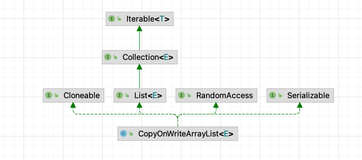
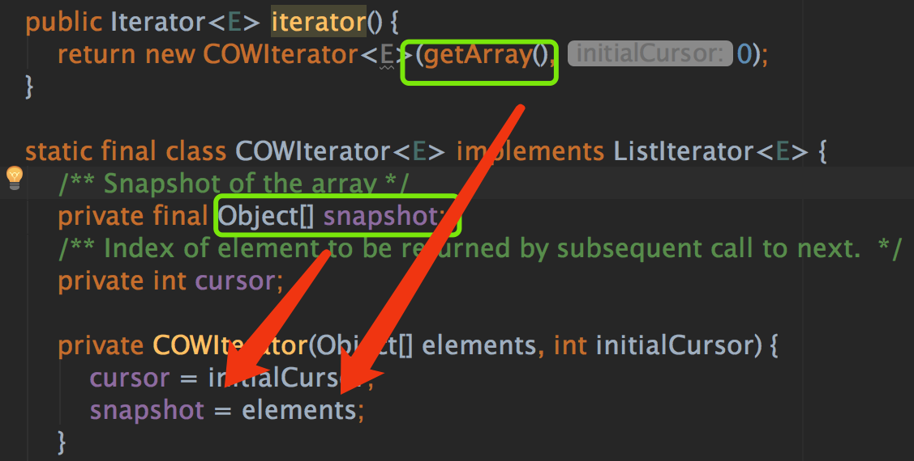
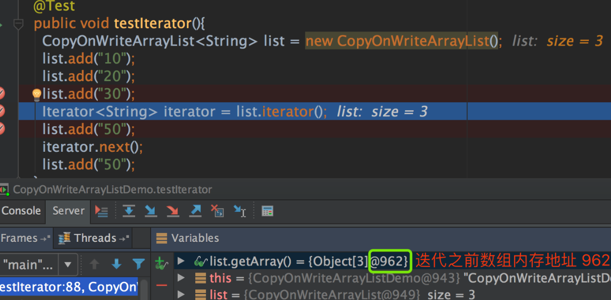
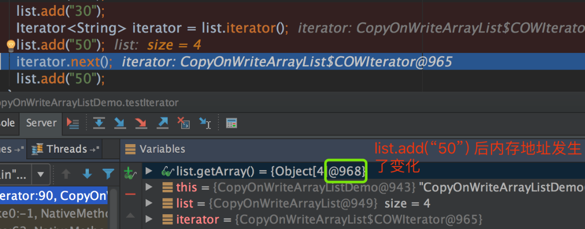
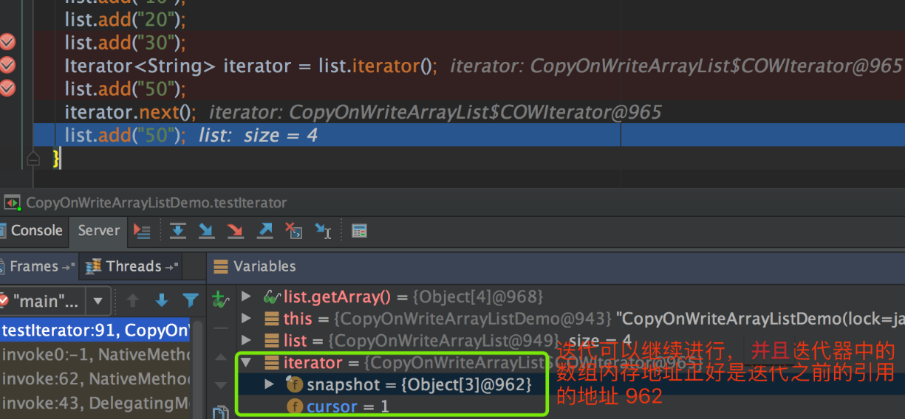

# 【源码分析】CopyOnWriteArrayList

## 1 基本介绍

`CopyOnWriteArrayList` 中的所有操作都是线程安全的，因为 **操作都是在新拷贝数组上** 进行的。数组的拷贝虽然有一定的成本，但往往比一般的替代方案效率高。



特点：

- 线程安全的，多线程环境下可以直接使用，无需加锁
- 通过 `可重入锁 + 数组拷贝 + volatile 关键字` 保证了线程安全
- 每次数组操作，都会把数组 **拷贝** 一份出来，**在新数组上进行操作，操作成功之后再赋值回去** 
- **写时复制策略**，写操作需要在锁保证同步，**读操作无锁**
  - 读、写可以并发

## 2 代码分析

整体结构来说，`CopyOnWriteArrayList` 数据结构和 `ArrayList` 是一致的，底层是个数组，只不过 `CopyOnWriteArrayList` 在对数组进行操作的时候，基本会分 4 步：

- 加锁
- 从原数组中拷贝新数组
- 在新数组上进行操作，并把新数组赋值给数组容器；
- 解锁

除了加锁之外，CopyOnWriteArrayList 的底层数组还被 volatile 关键字修饰。

也就是 **一旦数组被修改，其它线程立马能够感知到**，代码如下：

```java
private transient volatile Object[] array;
```

>`volatile`：
>
>- 用来修饰被 **不同线程访问** 和 **修改** 的变量
>- 某个线程对volatile修饰的变量进行 **修改**，其他线程都是 **可见** 的，即当一个共享变量被 `volatile` 修饰时，它会保证修改的值 **立即更新** 到内存中。
>- 对于一个 volatile 变量的 **写操作** 先行发生于后面对这个变量的 **读操作**
>- volatile 能够保证有序性和可见性，但不能保证原子性
>
>`transient`：
>
>- 使得属性 `不` 需要被 **序列化** ，例如:用户的密码等敏感信息，为了安全起见，不需要其被序列化。
>- 为了保存在内存中的各种状态，并且可以把 **保存对象的状态读出来** 。

可重入锁：

```java
final transient ReentrantLock lock = new ReentrantLock();
```

### 2.1 add方法

整个 `add` 过程都是在 **持有锁的状态下** 进行的，通过加锁，来保证同一时刻只能有一个线程能够对同一个数组进行 `add` 操作。

```java
public void add(int index, E element) {
    final ReentrantLock lock = this.lock;
		// 加锁
    lock.lock();
    try {
      	// 得到原始数组
        Object[] elements = getArray();
      	// 数组长度
        int len = elements.length;
      	// 判断插入index的合法性
        if (index > len || index < 0)
            throw new IndexOutOfBoundsException("Index: "+index+
                                                ", Size: "+len);
				// 创建新数组
        Object[] newElements;
      	// 计算需要移动的元素数量
        int numMoved = len - index;
        if (numMoved == 0)
          	// 不用移动，说明插入位置index就是数组末尾
          	// 将旧数组拷贝到新数组上
            newElements = Arrays.copyOf(elements, len + 1);
        else {
          	// 否则，说明插入的位置index在数组中间
          	// 数组，设置长度
            newElements = new Object[len + 1];
						// 两次数组拷贝
            System.arraycopy(elements, 0, newElements, 0, index);
            System.arraycopy(elements, index, newElements, index + 1,
                             numMoved);
        }
      	// 在 新数组 上进行插入！！！！
        newElements[index] = element;
				// 最后才把 新数组 设置回 旧数组！！！
        setArray(newElements);
    } finally {
      	// 解锁
        lock.unlock();
    }
}
```

「重点」有一个问题：**都已经加锁了，为什么需要拷贝数组，而不是在原来数组上面进行操作呢？**，原因主要为：

- `volatile` 关键字 **修饰的是数组** ，如果我们简单的在原来数组上修改其中某几个元素的值，**是无法触发可见性的** ，我们必须通过 **修改数组的内存地址** 才行，也就说要对数组进行重新赋值才行。
- 在新的数组上进行操作，对老数组没有任何影响，**只有新数组完全拷贝完成之后，外部才能访问到** ，降低了在赋值过程中，老数组数据变动的影响。

> 从 add 系列方法可以看出，`CopyOnWriteArrayList` 通过 **加可重入锁 + 数组拷贝+ volatile** 来保证了线程安全，每一个要素都有着其独特的含义：
>
> - **加锁**：意味着每一个时刻，只有一个线程能够对数组进行操作
> - **数组拷贝**：保证数组的内存地址发生变化，从而触发 volatile 的可见性，其它线程可以立马知道数组已经被修改
> - **volatile**：值被修改后，其它线程能够立马感知最新值

### 2.2 remove方法

指定数组索引位置删除的源码：

> 锁被 `final` 修饰的，保证了在加锁过程中，**锁的内存地址肯定不会被修改** ，finally 保证锁一定能够被释放，数组拷贝是为了删除其中某个位置的元素。

```java
// 删除某个索引位置的数据
public E remove(int index) {
    final ReentrantLock lock = this.lock;
    // 加锁
    lock.lock();
    try {
        Object[] elements = getArray();
        int len = elements.length;
        // 先得到老值
        E oldValue = get(elements, index);
        int numMoved = len - index - 1;
        // 如果要删除的数据正好是数组的尾部，直接删除
        if (numMoved == 0)
            setArray(Arrays.copyOf(elements, len - 1));
        else {
            // 如果删除的数据在数组的中间，分三步走
            // 1. 设置新数组的长度减一，因为是减少一个元素
            // 2. 从 0 拷贝到数组新位置
            // 3. 从新位置拷贝到数组尾部
            Object[] newElements = new Object[len - 1];
            System.arraycopy(elements, 0, newElements, 0, index);
            System.arraycopy(elements, index + 1, newElements, index,
                             numMoved);
            setArray(newElements);
        }
        return oldValue;
    } finally {
      	// 解锁
        lock.unlock();
    }
}
```

### 2.3 迭代

在 `CopyOnWriteArrayList` 类注释中，明确说明了：

**在其迭代过程中，即使数组的原值被改变，也不会抛出 `ConcurrentModificationException` 异常！**

其根源在于数组的每次变动，都会生成新的数组，不会影响老数组，这样的话，迭代过程中，**根本就不会发生迭代数组的变动** ，我们截几个图说明一下：

**迭代是直接持有原有数组的引用**，也就是说迭代过程中，一旦原有数组的值内存地址发生变化，必然会影响到迭代过程，下图源码演示的是 CopyOnWriteArrayList 的迭代方法，我们可以看到迭代器是直接持有原数组的引用：



迭代之前：



我们使用 `add(“50”)` 代码给数组新增一个数据后，数组内存地址发生了变化，内存地址从原来的 962 变成了 968，这是因为 CopyOnWriteArrayList 的 add 操作，会生成新的数组，所以数组的内存地址发生了变化：



我们发现迭代器中的地址仍然是迭代之前引用的地址，是 962，而不是新的数组的内存地址：



即使 CopyOnWriteArrayList 的结构发生变动了，也不会抛出 ConcurrentModificationException 异常的原因：CopyOnWriteArrayList **迭代持有的是老数组的引用** ，而 CopyOnWriteArrayList 每次的数据变动，都会产生新的数组，对老数组的值不会产生影响，所以迭代也可以正常进行。

> 就是做了一个快照，我们的迭代过程是在快照上进行的，不会影响迭代过程！