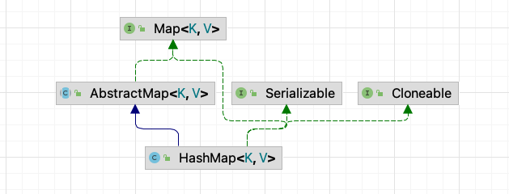
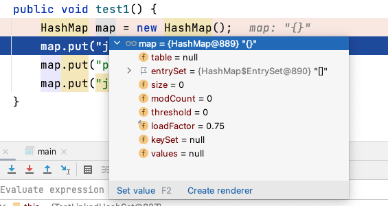
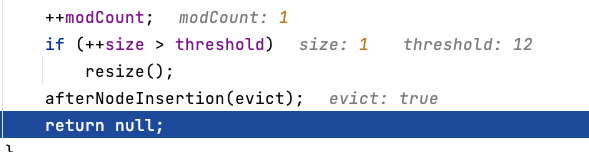
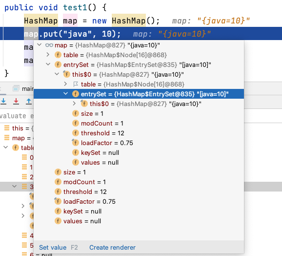
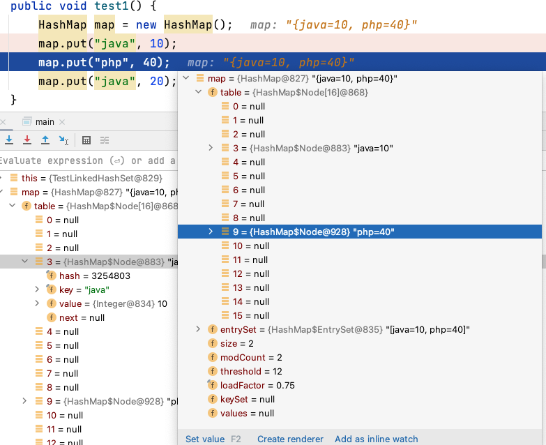
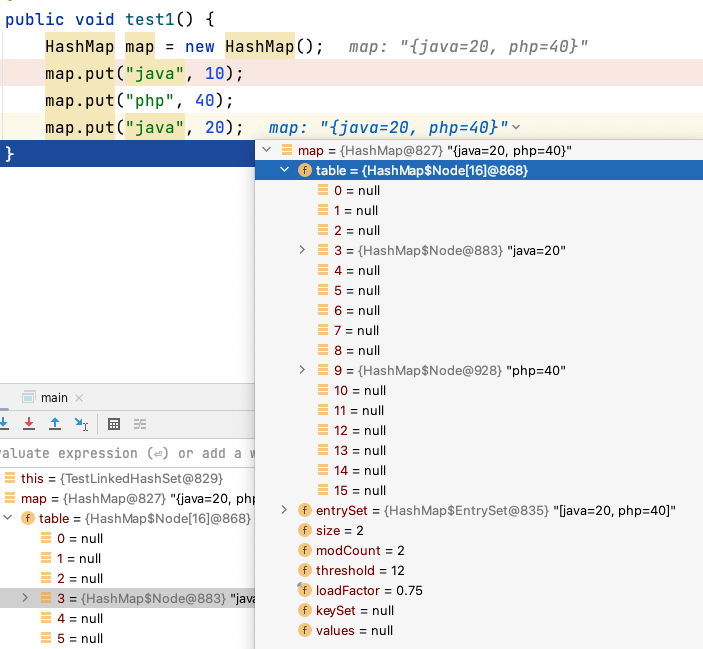

# 【源码分析】HashMap

> 注：本文源码分析基于 `java8`，后续版本可能有所区别。

## 1 基本介绍

`HashMap` 是一个散列表，它存储的内容是键值对映射，实现了 `Map` 接口，根据键的 HashCode 值存储数据，具有很快的访问速度，最多允许一条记录的键为 null，不支持线程同步。



> 特点总结：
>
> - **无序**，无法保证插入顺序与遍历顺序一致，因为是根据 `hashCode` 进行映射的
> - **去重**，key 不能重复，但值可以重复
> - **非线程安全**，不支持线程同步
> - Jdk8 下，底层是 **数组+链表+红黑树**

## 2 源码分析

跑下面的简单代码：

```java
public void test1() {
    HashMap map = new HashMap();
    map.put("java", 10);
    map.put("php", 40);
    map.put("java", 20);
}
```

### 2.1 初始化

`HashMap` 底层维护了一个 `Node[]` 数组 `table`，并且初始化数组大小（默认）为 `16`，装载因子（默认）为 `0.75`。

```java
transient Node<K,V>[] table;
// ...
static final float DEFAULT_LOAD_FACTOR = 0.75f;
static final int DEFAULT_INITIAL_CAPACITY = 1 << 4; // aka 16
// ...
public HashMap() {
    this.loadFactor = DEFAULT_LOAD_FACTOR; // all other fields defaulted
}
```

刚完成初始化时，`table` 为空。



### 2.2 扩容机制

第一步，添加 `map.put("java", 10);`，调用 `put()` 方法：

```java
public V put(K key, V value) {
    return putVal(hash(key), key, value, false, true);
}
```

接着，进入 `putVal()` 方法：

```java
final V putVal(int hash, K key, V value, boolean onlyIfAbsent,
               boolean evict) {
  	// 辅助变量
    Node<K,V>[] tab; Node<K,V> p; int n, i;
  	// table 初始化后为空，进入 if
    if ((tab = table) == null || (n = tab.length) == 0)
      	// 先会进行 resize() 扩容，然后得到当前长度：16 -> n
        n = (tab = resize()).length;  // n: 16
 		// 获取 table 中对应索引（hash值）上的对象 p，判断为空，进入 if
    if ((p = tab[i = (n - 1) & hash]) == null)
      	// 创建新节点，放入对应索引上
        tab[i] = newNode(hash, key, value, null);
    else {
        // ....
    }
    ++modCount;
  	// 如果大于 threshold 就进行扩容
    if (++size > threshold)  // threshold: 12；size: 1
        resize();
    afterNodeInsertion(evict);
    return null;
}
```



于是，`"java",10` 被顺利添加：



第二步，添加 `map.put("php", 40);`，还是同样最后来到 `putVal()` 方法：

```java
final V putVal(int hash, K key, V value, boolean onlyIfAbsent,
               boolean evict) {
    Node<K,V>[] tab; Node<K,V> p; int n, i;
    if ((tab = table) == null || (n = tab.length) == 0)
        // ...
    // 执行此 if 语句
    if ((p = tab[i = (n - 1) & hash]) == null)
      	// 创建新节点添加入 table 中
        tab[i] = newNode(hash, key, value, null);
    else {
        // ...
    }
    ++modCount;
    if (++size > threshold)  // threshold: 12；size: 2，不需要扩容
        resize();
    afterNodeInsertion(evict);
    return null;
}
```

添加成功：



第三步，添加 `map.put("java", 20);`：

```java
final V putVal(int hash, K key, V value, boolean onlyIfAbsent,
               boolean evict) {
    Node<K,V>[] tab; Node<K,V> p; int n, i;
    if ((tab = table) == null || (n = tab.length) == 0)
        // ...
    if ((p = tab[i = (n - 1) & hash]) == null)
        // ...
    // 前两个 if 条件不满足，执行 else
    else {
        Node<K,V> e; K k;
      	// 判断 hash 值是否相同，判断是否同一对象或者equals相同
        if (p.hash == hash &&
            ((k = p.key) == key || (key != null && key.equals(k))))
          	// 如果相同，则不进行添加操作
            e = p;
        else if (p instanceof TreeNode)
            // ...
        else {
            // ...
            }
        }
  			// 进行替换
        if (e != null) { // existing mapping for key
            V oldValue = e.value;
            if (!onlyIfAbsent || oldValue == null)
              	// 相同 key 对应的 value 进行替换
                e.value = value;
            afterNodeAccess(e);
            return oldValue;
        }
    }
    ++modCount;
    if (++size > threshold)
        resize();
    afterNodeInsertion(evict);
    return null;
}
```

因此，`java` 对应的值从 `10` 变为了 `20`。



补充添加节点的代码解读：

```java
final V putVal(int hash, K key, V value, boolean onlyIfAbsent,
               boolean evict) {
    Node<K,V>[] tab; Node<K,V> p; int n, i;
    if ((tab = table) == null || (n = tab.length) == 0)
        //...
    if ((p = tab[i = (n - 1) & hash]) == null)
        // ...
    else {
        Node<K,V> e; K k;
        if (p.hash == hash &&
            ((k = p.key) == key || (key != null && key.equals(k))))
            e = p;
     		// 如果当前节点已经树化了，则添加的新节点也按照对应的数据结构进行树化
        else if (p instanceof TreeNode)
            e = ((TreeNode<K,V>)p).putTreeVal(this, tab, hash, key, value);
        else {
          	// 如果找到的节点，后面是链表，就进行循环比较
            for (int binCount = 0; ; ++binCount) {
                if ((e = p.next) == null) {
                    p.next = newNode(hash, key, value, null);
                  	// 加入后，判断当前链表的节点个数，是否已经到达 8 个
                  	// 到达八个后，就执行 treeifyBin 进一步判断需要扩容还是树化
                    if (binCount >= TREEIFY_THRESHOLD - 1) // -1 for 1st
                        treeifyBin(tab, hash);
                    break;
                }
              	// 如果在循环比较时，发现有相同的，则不添加了
                if (e.hash == hash &&
                    ((k = e.key) == key || (key != null && key.equals(k))))
                    break;
                p = e;
            }
        }
      	// 替换
        if (e != null) { // existing mapping for key
            V oldValue = e.value;
            if (!onlyIfAbsent || oldValue == null)
                e.value = value;
            afterNodeAccess(e);
            return oldValue;
        }
    }
    ++modCount;
    if (++size > threshold)
        resize();
    afterNodeInsertion(evict);
    return null;
}
```

关于代码解读这块没看懂的可以去看看 `HashSet` 那部分。

> 扩容机制总结：
>
> - 第一次添加元素时，需要扩容 table 容量（默认大小）为 `16`，临界值（threshold）为 `12 (16 * 0.75)`。
>
> - 往后再扩容，则需要扩容 table 容量为原来的 `2` 倍，临界值为原来的 `2` 倍，以此类推。
> - 在 `java8` 中，如果一条链表的元素个数超过 `TREEIFY_THRESHOLD (默认为 8)`，并且 table 的容量大小大于等于 `MIN_TREEIFY_CAPACITY (默认为 64)`，就会进行树化。

