# 【源码分析】HashSet

> 注：本源码分析基于 `Java 8`，版本不同可能导致源码有少许差别！

## 1 HashSet基本介绍与类图

`HashSet` 实现了 `Set` 接口，具有 `Set` 的一切特点，所以 `HashSet` 是一个没有重复元素的集合，不保证集合的迭代顺序，所以随着时间元素的顺序可能会改变。

```java
public class HashSet<E>
       extends AbstractSet<E>
       implements Set<E>, Cloneable, java.io.Serializable
```

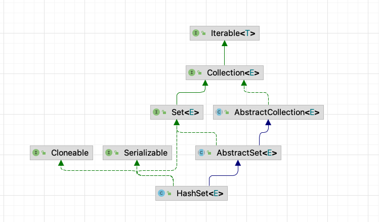

**`HashSet` 的特点** ：

- **本质上是 `HashMap`** ，可以通过它的构造函 数看出：

  ```java
  public HashSet() {
      map = new HashMap<>();
  }
  ```

- **线程不安全！**

- 可以存放 `null` 值，但是只能有一个 `null`

  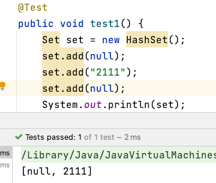

- （无序）不能保证元素的存取顺序一致

- （去重）没有相同的元素

- （无索引）没有带索引的方法，所以不能通过普通的 `for` 循环遍历

## 2 源码分析

### 2.1 去重原理

我们先来看个简单案例：

```java
public void test2() {
    Set set = new HashSet();
    System.out.println(set.add("song"));
    System.out.println(set.add("jian"));
    System.out.println(set.add("niu"));
    System.out.println(set.add("song"));
    System.out.println(set.add("bi"));
    System.out.println("set=" + set);
}
```

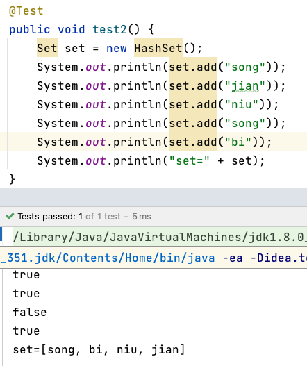

结果说明了两个问题：

- `HashSet` 是无序的（因为本身就实现了 `Set` 接口）
- **如果向 `HashSet` 中插入已经存在的元素，会插入失败（显示 `false`）**

接着，看看接下来的代码：

```java
class Dog {
    private String name;

    public Dog(String name) {
        this.name = name;
    }
}
// .....
public void test3() {
    Set set = new HashSet();
    System.out.println(set.add("song"));
    System.out.println(set.add("song"));

    System.out.println(set.add(new Dog("Tom")));
    System.out.println(set.add(new Dog("Tom")));

    System.out.println("set=" + set);
}
```

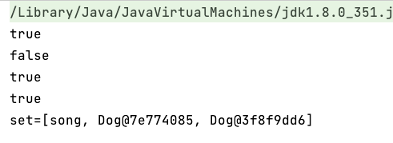

可以看到两个看似相同的 `new Dog("Tom")` ，但实际上 `new` 会在 Java 堆中创建两个不同的对象，因此可以添加成功！

> 但实际上，我们写这段代码的本意是想让 `Set` 帮助我们去重，但功能并没有实现，这也是为什么需要重写 `hashCode()` 和 `equals()` 方法的原因。

接下来，才是重点！我们把 `Dog` 换成 `String` 试试：

```java
public void test4() {
    Set set = new HashSet();

    System.out.println(set.add(new String("Tom")));
    System.out.println(set.add(new String("Tom")));

    System.out.println("set=" + set);
}
```

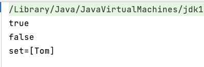

这是为什么呢？看完下面就懂了。

### 2.2 添加方法

> 添加元素的流程：
>
> - 得到元素的 `hash` 值，转化成索引值
> - 在存储表 `table` 中，查看对应索引值下是否已经存放了元素
>   - 如果没有，则直接插入
>   - 如果有，则调用 `equals()` 比较
>     - 如果判断相同，则放弃添加（去重）
>     - 如果判断不同，则添加到最后（链表形式）
> - 在 `Java8` 中，**如果一条链表的元素个数超过 `TREE_THRESHOLD` （默认为 8），并且 `table` 大小 `>=MIN_TREEIFY_CAPACITY` （默认 64），则会进行树化（红黑树）**
>
> `static final int TREEIFY_THRESHOLD = 8;`
>
> `static final int MIN_TREEIFY_CAPACITY = 64;`

测试代码：

```java
public void test2() {
    Set set = new HashSet();
    System.out.println(set.add("song"));
    System.out.println(set.add("jian"));
    System.out.println(set.add("song"));
    System.out.println("set=" + set);
}
```

#### 【1】执行构造器

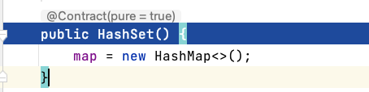

#### 【2】第一次添加字符串："song"

```java
// 这个 PRESENT 对象其实没有任何意义，只是起到占位的作用
private static final Object PRESENT = new Object();

// ...

public boolean add(E e) {  	// e = "song"
    return map.put(e, PRESENT)==null;
}
```

**注意**：这个 `PRESENT` 对象其实没有任何意义，只是起到占位的作用！

可以发现，`add()` 实际上调用了 `HashMap` 的 `put()` 方法。 

```java
public V put(K key, V value) {
    return putVal(hash(key), key, value, false, true);
}
```

`put()` 会执行 `hash()` 方法来计算 key 对应的哈希值，来看看 `hash(key)` 是如何计算的：

```java
static final int hash(Object key) {
    int h;
  	// 无符号右移 16 位，是降低 hash 冲突的概率，减少碰撞
    return (key == null) ? 0 : (h = key.hashCode()) ^ (h >>> 16);
}
```

所以，这里计算出来的 `hash(key)` 并不等于 `key.hashCode()`！

进入 `putVal()` 方法：

```java
final V putVal(int hash, K key, V value, boolean onlyIfAbsent, boolean evict) {
  	// 辅助变量：tab、p、n、i
    Node<K,V>[] tab; Node<K,V> p; int n, i;
  
  	// table 是 HashMap 的一个属性，类型是 Node<K, V>[] 数组
 		// 此时是第一次添加元素，因此 table = null，进入 if 块
    if ((tab = table) == null || (n = tab.length) == 0)
      	// resize() 重要！这是第一次扩容！
      	// 调用完 resize() 后，tab 的空间就变成 16 大小的 Node 数组了
        n = (tab = resize()).length;		// n = 16
  
  	// i = (n - 1) & hash 是根据 hash 值计算当前存入的元素，在 table 表中的索引是多少
  	// 将对应索引上的元素取出，赋给辅助变量 p
    if ((p = tab[i = (n - 1) & hash]) == null)
      	// p 为空，说明对应索引上没有元素
      	// 创建一个 newNode，存入 table 中 i 位置
      	// key = "song"，value = PRESENT，hash = 3536160
        tab[i] = Node(hash, key, value, null);
  
    else {
      	// p 不为空
        // ...
    }
    ++modCount;		// modCount = 1
    if (++size > threshold)		// size = 1，threshold = 12
     		// 并没有超过阈值，不需要扩容
        resize();
 		
 		// 这个是 HashMap 提供给子类实现的方法，可以做一些特别的处理
  	// Callbacks to allow LinkedHashMap post-actions
  	// 所以这里什么都没干
    afterNodeInsertion(evict);		// evict = true
    return null;
}
```

> 这里有意思哦！`afterNodeInsertion()` 使用了 **模版方法设计模式**，交给子类处理！

（上述代码）创建节点：

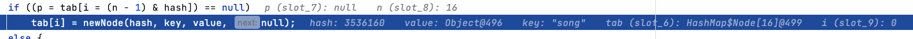

（上述代码）存入 table[i] 中：

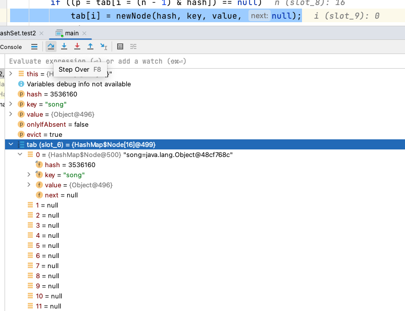

进入 `resize()` 方法：

```java
final Node<K,V>[] resize() {
    Node<K,V>[] oldTab = table;			// table = null，oldTab = null
    int oldCap = (oldTab == null) ? 0 : oldTab.length;		// oldCap = 0
    int oldThr = threshold;		// threshold = 0
    int newCap, newThr = 0;
    if (oldCap > 0) {
        // ...
    }
    else if (oldThr > 0) 
        // ....
    else {               
      	// oldCap = 0，进入到此处
      	// 默认初始容量 DEFAULT_INITIAL_CAPACITY = 16
        newCap = DEFAULT_INITIAL_CAPACITY;	
      
      	// 加载因子 DEFAULT_LOAD_FACTOR = 0.75
      	// 设置加载因子为 0.75 倍的初始容量大小，也就是 12
      	// 当元素个数超过 12 就进行扩容
        newThr = (int)(DEFAULT_LOAD_FACTOR * DEFAULT_INITIAL_CAPACITY);
    }
    if (newThr == 0) {
        //...
    }
    threshold = newThr;		// threshold = 12
    @SuppressWarnings({"rawtypes","unchecked"})

  	// 关键：创建一个大小为 newCap 的 Node 数组
    Node<K,V>[] newTab = (Node<K,V>[])new Node[newCap];
  	// 把创建的空间，赋给 HashMap 的属性 table
    table = newTab;
  
    if (oldTab != null) {
        // ...
    }
    return newTab;
}
```

（上述代码）`table = newTab;` 后：

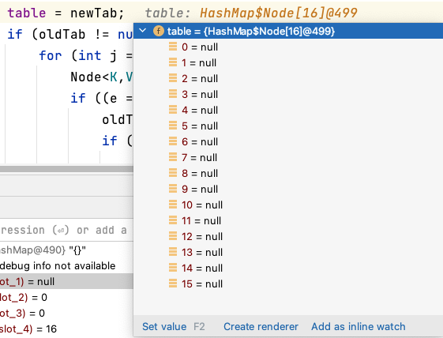

最后一路返回吧

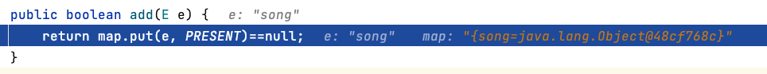

添加成功！我们来看看 `set` 里面的结构：

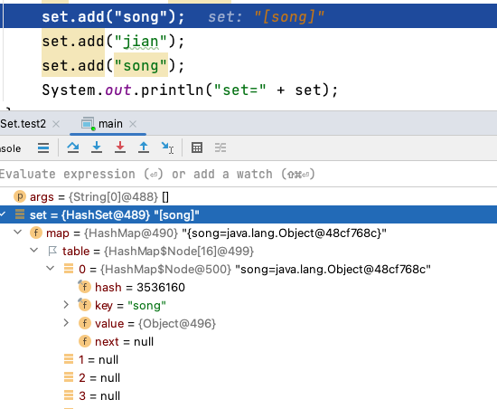

#### 【3】第二次添加字符串："jian"

同样是走 `map.put()`：

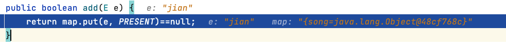

一直快进到 `putVal`：

```java
final V putVal(int hash, K key, V value, boolean onlyIfAbsent, boolean evict) {
    Node<K,V>[] tab; Node<K,V> p; int n, i;
    if ((tab = table) == null || (n = tab.length) == 0)
      	// 此时 table 不为空，不会进入这块
        // ...
      
    // 取出 tab[i] 赋给 p，判断 p 是否为空
    if ((p = tab[i = (n - 1) & hash]) == null) 	// p = null，i = 13
      	// 创建新节点，存入 tab[i]
        tab[i] = newNode(hash, key, value, null);
  
    else {
        // ...
    }
    ++modCount;		// modCount = 2
    if (++size > threshold)		// size = 2，threshold = 12
        resize();
    afterNodeInsertion(evict);
    return null;
}
```

（上述代码）`tab[i] = newNode(hash, key, value, null);` 后：

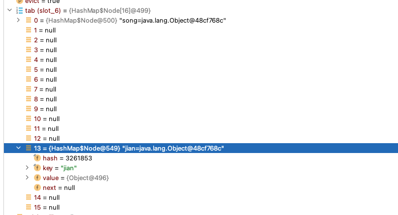

添加成功！看看 `set` 内容：

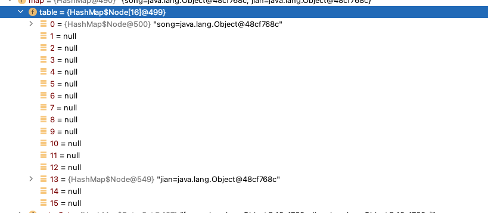

#### 【4】第三次添加字符串："song"

前面一样，直接快进到 `putVal()`：

```java
final V putVal(int hash, K key, V value, boolean onlyIfAbsent, boolean evict) {
  	// 辅助变量
    Node<K,V>[] tab; Node<K,V> p; int n, i;
    if ((tab = table) == null || (n = tab.length) == 0)
        // ...
    if ((p = tab[i = (n - 1) & hash]) == null)
      	// 此时 p 不为空，因此，不执行此块！
        // ...
     
    else {
      	// 辅助变量
        Node<K,V> e; K k;
      
      	// 如果当前索引位置对应的链表首元素 和 准备添加的 key 的 hash 值一样
        if (p.hash == hash &&
            // 并且，满足下面两个条件之一：
           	// 	(1) key 对象相同
            // 	(2) key 对象不同，但重写了 equals() 自定义他们相同
            ((k = p.key) == key || (key != null && key.equals(k))))			// 条件成立
          	// 则不能加入，把 p 赋值给 e
            e = p;
      
      	// 可以加入，判断 p 是不是一棵红黑树
        else if (p instanceof TreeNode)
          	// 如果是红黑树，则使用 putTreeVal 进行添加
            e = ((TreeNode<K,V>)p).putTreeVal(this, tab, hash, key, value);
      
      	// 可以加入，当前 table 索引位置是一个链表（还没树化）
        else {
          	// 对链表进行遍历
            for (int binCount = 0; ; ++binCount) {
              
								// 如果遍历到最后，发现没有重复
                if ((e = p.next) == null) {
                  	// 将其添加在链表末尾
                    p.next = newNode(hash, key, value, null);
                  	// 判断链表元素是否超过 TREEIFY_THRESHOLD
                    if (binCount >= TREEIFY_THRESHOLD - 1)
                      	// 超过 TREEIFY_THRESHOLD 数量则调用 treeifyBin()
                        treeifyBin(tab, hash);
                    break;
                }
              
              	// 只要存在一个重复元素，就 break 出循环
                if (e.hash == hash &&
                    ((k = e.key) == key || (key != null && key.equals(k))))
                    break;
                p = e;
            }
        }
      	
        if (e != null) { 	// 条件满足，e != null
            V oldValue = e.value;
            if (!onlyIfAbsent || oldValue == null)
                e.value = value;
            afterNodeAccess(e);
            return oldValue;
        }
    }
    ++modCount;
    if (++size > threshold)
        resize();
    afterNodeInsertion(evict);
    return null;
}
```

（上述代码）判断 hash 相同：

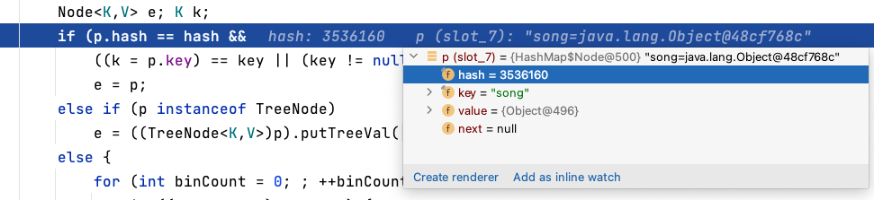

（上述代码）p 赋值给 e：

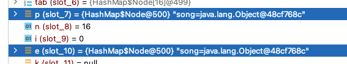

（上述代码）返回：

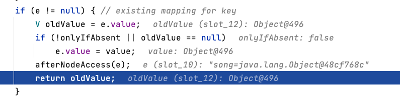

简单来看看 `treeifyBin`：

```java
final void treeifyBin(Node<K,V>[] tab, int hash) {
    int n, index; Node<K,V> e;
  	// 如果 tab 为空，或者 tab 长度小于 MIN_TREEIFY_CAPACITY（默认 64）
    if (tab == null || (n = tab.length) < MIN_TREEIFY_CAPACITY)
      	// 不会进行树化，而是先扩容
        resize();
    else if ((e = tab[index = (n - 1) & hash]) != null) {
        TreeNode<K,V> hd = null, tl = null;
        do {
            TreeNode<K,V> p = replacementTreeNode(e, null);
            if (tl == null)
                hd = p;
            else {
                p.prev = tl;
                tl.next = p;
            }
            tl = p;
        } while ((e = e.next) != null);
        if ((tab[index] = hd) != null)
            hd.treeify(tab);
    }
}
```

最后，添加 `add()` 方法返回 `false`：

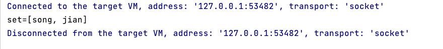

### 2.3 扩容机制

#### 2.3.1 链表扩容

我们尝试下面代码：

```java
public static void main(String[] args) {
    Set set = new HashSet();
    for (int i = 0; i < 100; i++) {
        set.add(i);
    }
}
```

首先，第一次添加元素。创建了一个大小为 `16` 的 table，并且设置 `threshold` 为 `12`。

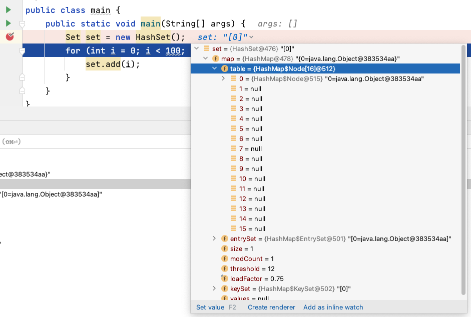

这不是重点，我们直接跑到阈值处，看看添加到 12 会发生什么：

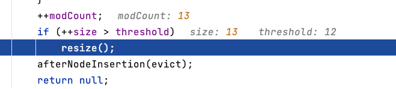

```java
final Node<K,V>[] resize() {
    Node<K,V>[] oldTab = table;
    int oldCap = (oldTab == null) ? 0 : oldTab.length;	// oldCap = 16
    int oldThr = threshold;		// oldThr = 12
    int newCap, newThr = 0;
  
    if (oldCap > 0) {
        if (oldCap >= MAXIMUM_CAPACITY) {
            // ...
        }
      	// 设置 新容量 = 当前容量 ✖️ 2，新容量 小于 最大容量，
      	// 并且当前容量大于等于默认容量
        else if ((newCap = oldCap << 1) < MAXIMUM_CAPACITY &&		// newCap：16 -> 32
                 oldCap >= DEFAULT_INITIAL_CAPACITY)
          	// 阈值 threshold ✖️ 2
          	// 也就是从 12 -> 24
            newThr = oldThr << 1;
    }
    else if (oldThr > 0)
        // ...
    else { 
        // ...
    }
    if (newThr == 0) {
        // ...
    }
    threshold = newThr;		// threshold = 24
    @SuppressWarnings({"rawtypes","unchecked"})
  
  	// 创建含有 newCap 个节点的新 table
    Node<K,V>[] newTab = (Node<K,V>[])new Node[newCap];
    table = newTab;		
  	// 将旧 tab 上的数据拷贝到新 tab 上
    if (oldTab != null) {
        // ...
    }
    return newTab;
}
```

最终，`table` 容量达到 `32`，`threshold` 为 `24`。

#### 2.3.2 树化

定义一个 `A` 类，固定他的 `hashCode`，这样会使添加的元素往同一个索引位置进行链表插入：

```java
public class A {
    private int n;
    public A(int n) {
        this.n = n;
    }

    @Override
    public int hashCode() {
        return 100;
    }
}
```

循环代码：

```java
public static void main(String[] args) {
    Set set = new HashSet();
    for (int i = 1; i < 100; i++) {
        set.add(new A(i));
    }
}
```

先添加前 8 个元素：

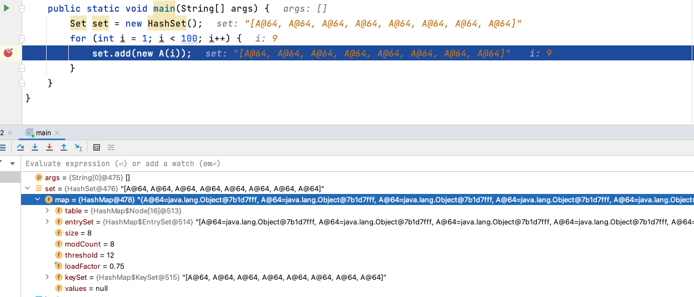

添加第 9 个元素，不进行树化（因为目前 `16 < 64`），但进行扩容。扩容从 `16 -> 32，12->24`

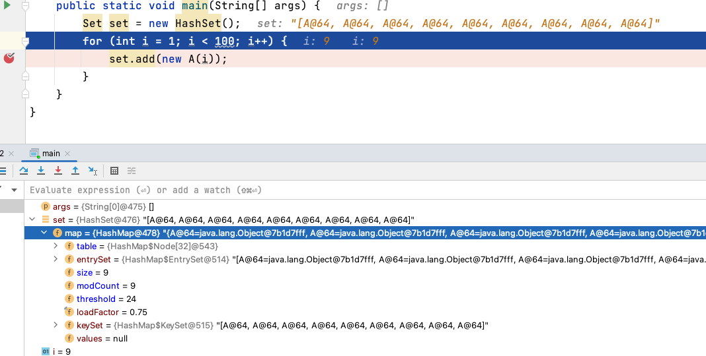

添加第 10 个元素，不进行树化（因为目前 `32 < 64`），但进行扩容。扩容从 `32 -> 64，24->48`

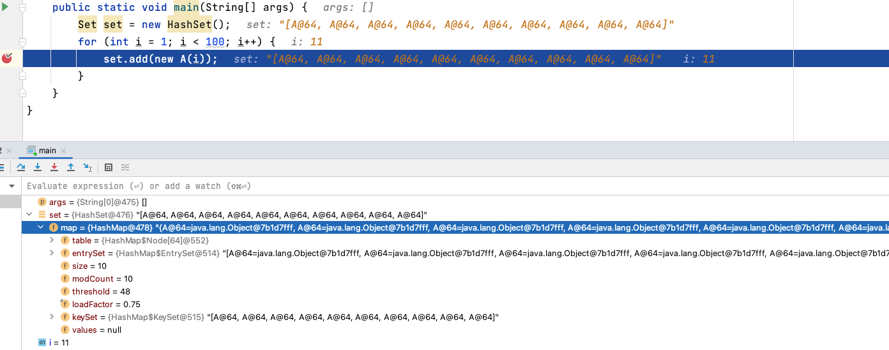

添加第 11 个元素，进行树化（因为目前 `64 = 64`）。

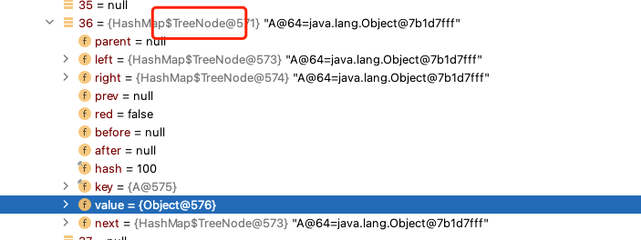
