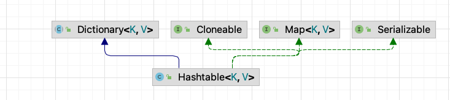
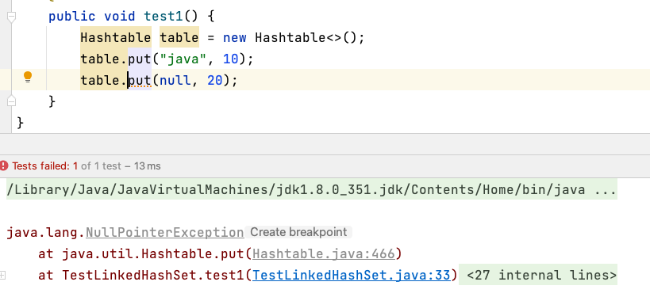
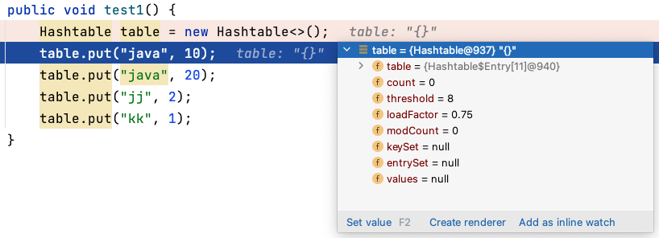
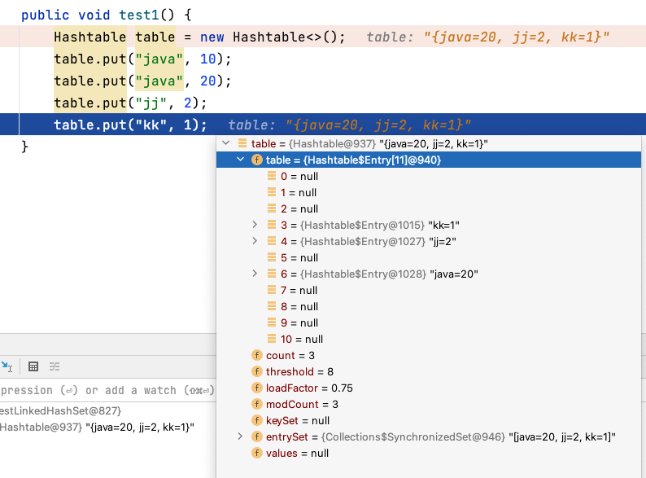

# 【源码分析】Hashtable

## 1 基本介绍

Hashtable 存放的是键值对，即 `K-V`，它的键和值都不能为 `null`，否则会抛出 `NullPointerException`。Hashtable 是 **线程安全** 的，基本使用方法与 HashMap 一致。



**键和值** 都不能为 `null`：



> 特点总结：
>
> - **线程安全**，使用 `sychronized` 关键字实现线程安全
> - **键和值** 都不允许为空(`null`)
> - 对于高并发情况下性能效果较差，建议使用 `ConcurrentHashMap` 进行代替

## 2 源码分析

### 2.1 构造方法

首先调用无参构造方法：

```java
// Constructs a new, empty hashtable with a 
// default initial capacity (11) and load factor (0.75).
public Hashtable() {
    this(11, 0.75f);
}
```

这里设置了 `Hashtable` 的初始容量大小为 `11`，装载因子为 `0.75`。进一步调用有参构造方法：

```java
public Hashtable(int initialCapacity, float loadFactor) {
    if (initialCapacity < 0)
        throw new IllegalArgumentException("Illegal Capacity: "+ initialCapacity);
    if (loadFactor <= 0 || Float.isNaN(loadFactor))
        throw new IllegalArgumentException("Illegal Load: "+loadFactor);

    if (initialCapacity==0)
        initialCapacity = 1;
    this.loadFactor = loadFactor;
    table = new Entry<?,?>[initialCapacity];
    threshold = (int)Math.min(initialCapacity * loadFactor, MAX_ARRAY_SIZE + 1);
}
```

完成初始化后，初始容量为 11，阈值为 8，装载因子为 0.75。



### 2.2 添加元素

添加元素，调用的是 `put()` 方法：

```java
public synchronized V put(K key, V value) {
    // 保证 value 非空
    if (value == null) {
        throw new NullPointerException();
    }

    // 确保 key 不在 hashtable 中存在
    Entry<?,?> tab[] = table;
    int hash = key.hashCode();
    int index = (hash & 0x7FFFFFFF) % tab.length;
    @SuppressWarnings("unchecked")
    Entry<K,V> entry = (Entry<K,V>)tab[index];
  	// 遍历查找 key，如果存在，则对其进行覆盖
    for(; entry != null ; entry = entry.next) {
        if ((entry.hash == hash) && entry.key.equals(key)) {
            V old = entry.value;
            entry.value = value;
            return old;
        }
    }
		// 到这里，说明不存在了，因此可以调用 addEntry 进行添加
    addEntry(hash, key, value, index);
    return null;
}
```

调用 `addEntry` 方法添加：

```java
private void addEntry(int hash, K key, V value, int index) {
    modCount++;

    Entry<?,?> tab[] = table;
  	// 如果当前元素数量大于 threshold
  	// 需要进行扩容，rehash();
    if (count >= threshold) {
        rehash();

        tab = table;
        hash = key.hashCode();
        index = (hash & 0x7FFFFFFF) % tab.length;
    }

    // 创建一个新 Entry 对象 
    @SuppressWarnings("unchecked")
    Entry<K,V> e = (Entry<K,V>) tab[index];
  	// 添加元素
    tab[index] = new Entry<>(hash, key, value, e);
    count++;
}
```



### 2.3 扩容机制

扩容机制主要看 `rehash()`：

```java
@SuppressWarnings("unchecked")
protected void rehash() {
    int oldCapacity = table.length;
    Entry<?,?>[] oldMap = table;

    // 新容量大小 = 旧容量大小 * 2 + 1
    int newCapacity = (oldCapacity << 1) + 1;
    if (newCapacity - MAX_ARRAY_SIZE > 0) {
      	// 如果扩容所需容量等于最大允许分配容量
        if (oldCapacity == MAX_ARRAY_SIZE)
            // 则保持最大允许分配容量，返回
            return;
     		// 如果扩容所需容量大于最大允许分配容量，则设置为最大允许分配容量
        newCapacity = MAX_ARRAY_SIZE;
    }
 		// 分配新 Entry 数组
    Entry<?,?>[] newMap = new Entry<?,?>[newCapacity];
	
    modCount++;
  	// 计算新的 threshold
    threshold = (int)Math.min(newCapacity * loadFactor, MAX_ARRAY_SIZE + 1);
    table = newMap;

    for (int i = oldCapacity ; i-- > 0 ;) {
        for (Entry<K,V> old = (Entry<K,V>)oldMap[i] ; old != null ; ) {
            Entry<K,V> e = old;
            old = old.next;

            int index = (e.hash & 0x7FFFFFFF) % newCapacity;
            e.next = (Entry<K,V>)newMap[index];
            newMap[index] = e;
        }
    }
}
```

