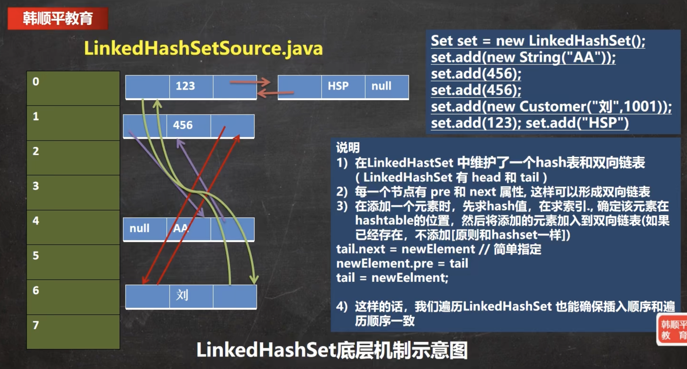

# 【源码分析】LinkedHashSet

> 本文源码分析基于 `java8`，后续版本可能有所改动。

## 1 基本介绍

`LinkedHashSet` 是 `HashSet` 的一个子类，并实现了 `Set` 接口。

```java
public class LinkedHashSet<E>
    extends HashSet<E>
    implements Set<E>, Cloneable, java.io.Serializable
```


`LinkedHashSet` 的底层实现是基于 `LinkedHashMap` 的，底层维护了一个 **数组 + 双向链表**。它根据元素的 `hashCode` 值来决定元素的存储位置，同时 **使用链表维护元素的次序**，使得元素开起来是以插入顺序保存的。

> 这里注意与 `HashSet`/ `HashMap` 进行区分。

重点总结：

- `LinkedHashSet` 中的元素没有重复
- `LinkedHashSet` 中的元素 **有顺序**，维护了添加顺序
- `LInkedHashSet` 可以存储 null 值
- `LinkedHashSet` 是一个 **线程不安全** 的容器
- 继承了 `HashSet`，所以它是在 `HashSet` 的基础上维护了元素添加顺序的功能

## 2 源码分析

### 2.1 构造方法

先看一段简单的代码：

```java
public void test() {
    Set set = new LinkedHashSet();
    set.add(null);
    set.add("2111");
    set.add(new String("AA"));
    System.out.println(set);
}
```

构造：

```java
public LinkedHashSet() {
    super(16, .75f, true);
}
```

可以看到了，它调用了父类的构造器。进一步：

```java
/**
     * Constructs a new, empty linked hash set.  (This package private
     * constructor is only used by LinkedHashSet.) The backing
     * HashMap instance is a LinkedHashMap with the specified initial
     * capacity and the specified load factor.
**/
HashSet(int initialCapacity, float loadFactor, boolean dummy) {
    map = new LinkedHashMap<>(initialCapacity, loadFactor);
}
```

可以看到，在 `HashMap` 构造时，底层维护了一个 `LinkedHashMap` 对象。而  `LinkedHashMap` 是 `HashMap` 的子类，调用了 `HashMap` 的构造方法进行构造：


在第一次添加时，直接将 **数组table** 扩容到 16，并且存放的节点类型是 `LinkedHashMap$Entry`。


这个 `Entry` 又是什么类呢？找到 `LinkedHashMap` 类，它继承于 `HashMap.Node`，在 `Node` 基础上维护了双向链表的指针 `before` 和 `after`：

```java
static class Entry<K,V> extends HashMap.Node<K,V> {
  	// 用于进行双向链表的连接
    Entry<K,V> before, after;
    Entry(int hash, K key, V value, Node<K,V> next) {
        super(hash, key, value, next);
    }
}
```

### 2.2 添加元素

添加元素就比较简单了，还是走 `add()` 方法，调用 `map.put()`，然后到 `putVal()` 中：


唯一不同的是，这里 `LinkedHashMap` 重写了父类 `HashMap` 的钩子函数，在创建新节点时，按照双向链表的形式构建：

```java
Node<K,V> newNode(int hash, K key, V value, Node<K,V> e) {
    LinkedHashMap.Entry<K,V> p =
        new LinkedHashMap.Entry<K,V>(hash, key, value, e);
    linkNodeLast(p);
    return p;
}
```





