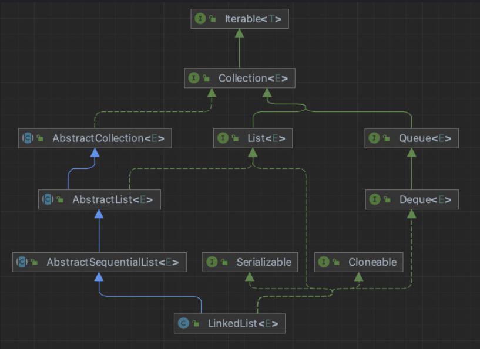
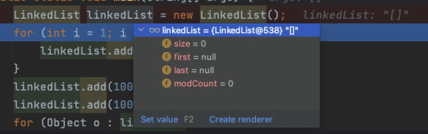
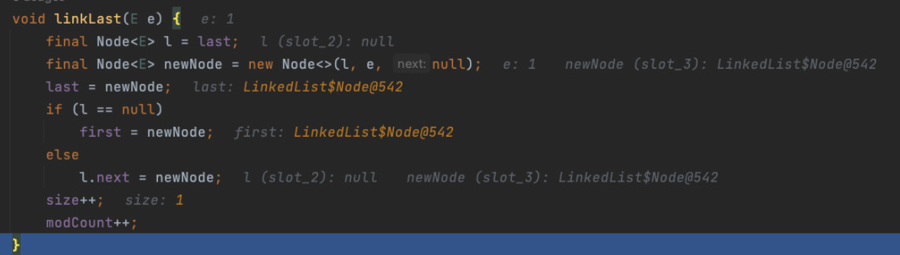
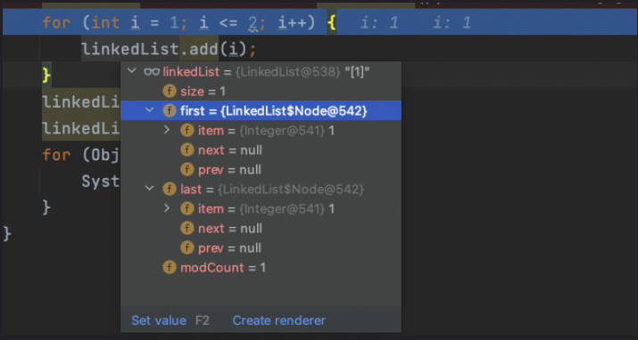
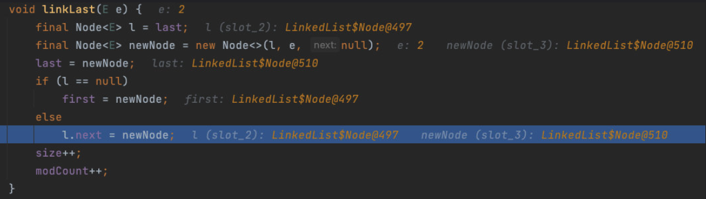
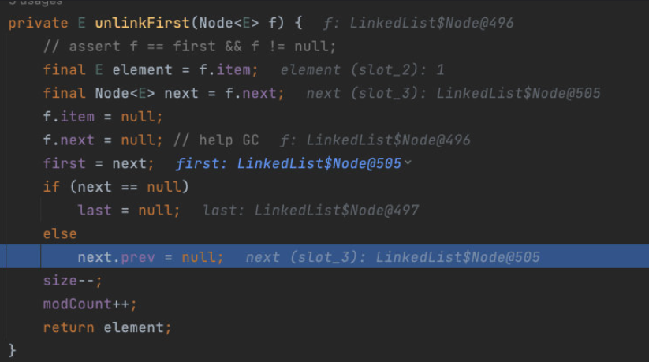
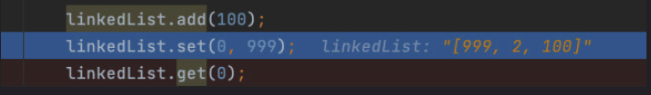

# LinkedList源码分析

> 注意：本笔记分析对象为 `Java8` 版本，随版本不同，源码会发生变化。

## 基本介绍与类图

`LinkedList` 同时实现了 `List` 接口和 `Deque` 对口，也就是收它既可以看作一个顺序容器，又可以看作一个队列（Queue），同时又可以看作一个栈（stack）。

这样看来，`linkedList` 简直就是无敌的，当你需要使用栈或者队列时，可以考虑用 `LinkedList` 。

> 关于栈或队列，现在首选是 `ArrayDeque` ，它有着比 `LinkedList` （当作栈或队列使用时）更好的性能。

`LinkedList` 底层通过 **双向链表** 实现，双向链表的每个节点用内部类 `Node` 表示。`LinkedList` 通过 `first` 和 `last` 引用分别指向链表的第一个和最后一个元素。



首先我们来分析它的构造方法和添加方法，对下面这段程序进行 debug：

```java
public class LinkedListTest {
    public static void main(String[] args) {
        LinkedList linkedList = new LinkedList();
        for (int i = 1; i <= 2; i++) {
            linkedList.add(i);
        }
        linkedList.add(100);
        linkedList.add(100);
        for (Object o : linkedList) {
            System.out.println(o);
        }
    }
}
```

## 初始化

```java
// 无参构造器
public LinkedList() {
}
```

可以看到，这里没啥可讲的，啥也没干。那里面有啥呢？



此时，`linkedlist` 的属性为空或为0。

## 添加元素

首先还是对 `int` 类型的自动装箱：

```java
public static Integer valueOf(int i) {
  if (i >= IntegerCache.low && i <= IntegerCache.high)
    return IntegerCache.cache[i + (-IntegerCache.low)];
  return new Integer(i);
}
```

然后，我们来到 `add()` 方法：

```java
public boolean add(E e) {
  linkLast(e);
  return true;
}
```

这里面又调用了 `linkLast()` 方法：

```java
// 创建新节点，将新节点加入双向链表最后
void linkLast(E e) {
  final Node<E> l = last;
  // 使用元素 e 创建新节点
  final Node<E> newNode = new Node<>(l, e, null);
  last = newNode;
  if (l == null)
    first = newNode;
  else
    l.next = newNode;
  size++;
  modCount++;
}
```

由于我们现在刚初始化完，里面啥都没有，因此 `last=null`，而第一句赋值使得 `l=null`，因此会进入 `if` 条件中，使得 `first=last=newNode`。



于是，返回后便添加成功了：



最后来看看 `Node` 类。

```java
// 双向链表节点
private static class Node<E> {
  E item;
  Node<E> next;
  Node<E> prev;

  Node(Node<E> prev, E element, Node<E> next) {
    this.item = element;
    this.next = next;
    this.prev = prev;
  }
}
```

接下来开始第二次添加元素，与前一次相同。不同的是在上面的代码中，`last` 不为空了。于是它走的是 `else` 中的代码。



## 删除元素

### 删除头节点

`public E remove()` ：检索并删除双向链表头节点。

`public E removeFirst() ` ：检索并删除双向链表头节点。

好家伙，直接调用了 `removeFirst()`。

```java
public E remove() {
  return removeFirst();
}

public E removeFirst() {
  final Node<E> f = first;
  // 判断头节点是否为空
  if (f == null)
    throw new NoSuchElementException();
  // 不为空则删除
  return unlinkFirst(f);
}
```

好了， 看来 `unlinkFirst()` 才是真正删除节点的方法。

```java
// 双向链表删除头节点 f
private E unlinkFirst(Node<E> f) {
  // assert f == first && f != null;
  final E element = f.item;
  // 找到头节点的下一个节点
  final Node<E> next = f.next;
  f.item = null;
  f.next = null; // help GC
  // 头节点设置为 next
	first = next;
  // 如果 next 为空，说明原本的链表只有一个节点
  // 删除之后就没有节点了
  if (next == null)
    // 删除之后链表就为空了
    last = null;
  else
    // 删除之后还有节点
    // 删除前向指针
    next.prev = null;
  size--;
  modCount++;
  return element;
}
```

我们这里因为添加了多个节点，因此删除头节点后仍有节点存在，因此走的是 `else`。



随后就成功删除了。

### 删除尾节点

`public E removeLast()` ：删除并返回双向链表中最末尾的节点。

与删除头节点一样，这里也是先要判断一下尾节点是否存在，不存在的话我还删啥，直接报错了。

```java
public E removeLast() {
  final Node<E> l = last;
  if (l == null)
    throw new NoSuchElementException();
  return unlinkLast(l);
}
```

如果存在，我才调用 `unlinkLast(l)` 进行删除。

```java
private E unlinkLast(Node<E> l) {
  // assert l == last && l != null;
  final E element = l.item;
  final Node<E> prev = l.prev;
  l.item = null;
  l.prev = null; // help GC
  last = prev;
  if (prev == null)
    first = null;
  else
    prev.next = null;
  size--;
  modCount++;
  return element;
}
```

也是跟之前一样，唯一不同的是关注点不同。删除头节点时，我们需要修改好 `next` 指向的元素。而在这里，我们要关注的是修改好 `prev` 指针指向的元素。

### 删除指定索引的节点

`public E remove(int index)` ：移除此列表中指定位置的元素。将所有后续元素向左移动(从它们的索引中减去1)。返回从列表中删除的元素。

```java
public E remove(int index) {
  // 检查该索引是不是正确的
  checkElementIndex(index);
  // 删除操作
  return unlink(node(index));
}
```

我们可以看到，它实际上是分成了两步进行。首先是判断要删除的索引是不是合法的，即 `checkElementIndex()` 方法。

怎么判断呢？很简单，大于等于 0 并且小于 size 即可。

```java
private void checkElementIndex(int index) {
  // 判断传入的index是不是该链表中的index
  if (!isElementIndex(index))
    throw new IndexOutOfBoundsException(outOfBoundsMsg(index));
}

// 判断合法性
private boolean isElementIndex(int index) {
  return index >= 0 && index < size;
}
```

第二步，`unlink(node(index))`，这是在干什么呢？

要删除某个index对应的元素，肯定要先检索出来才能删除呀。所以先要检索，也就是这里的 `node(index)`。

```java
// 返回指定元素索引处的(非空)Node
Node<E> node(int index) {
  // assert isElementIndex(index);
  // 可以看到，这里做了一个小优化，利用双向链表可以正搜和反搜的特点
  // 如果要搜索的index在链表的前半段，直接正向搜索
  if (index < (size >> 1)) {
    Node<E> x = first;
    for (int i = 0; i < index; i++)
      x = x.next;
    return x;
  } else {
    // 如果要搜索的index在链表的后半段，则使用反向搜索
    Node<E> x = last;
    for (int i = size - 1; i > index; i--)
      x = x.prev;
    return x;
  }
}
```

最后就是删除操作了：

```java
// 删除节点x，并返回 x 内的元素 item
E unlink(Node<E> x) {
  // assert x != null;
  final E element = x.item;
  final Node<E> next = x.next;
  final Node<E> prev = x.prev;
	
  // 如果删除节点的 prev = null
  if (prev == null) {
    // 说明删除的节点时头节点
    first = next;
  } else {
    // 否则修改 prev 节点的 next 指针
    prev.next = next;
    x.prev = null;
  }
	
  // 如果删除节点的 next = null
  if (next == null) {
    // 说明删除的是尾节点
    last = prev;
  } else {
    // 否则修改 next 节点 prev 指针
    next.prev = prev;
    x.next = null;
  }

  x.item = null;
  size--;
  modCount++;
  return element;
}
```

## 修改元素

`public E set(int index, E element)` ：修改索引下的元素内容（索引从 0 开始），并返回旧值。

执行代码：

```java
linkedList.set(0, 999);
```

首先还是对 999 进行自动装箱，这里不细说了。然后是调用下面的 `set` 方法。

```java
public E set(int index, E element) {
  // 前面看过了，检查索引
  checkElementIndex(index);
  // 前面看过了，根据index获取节点
  Node<E> x = node(index);
  E oldVal = x.item;
  x.item = element;
  return oldVal;
}
```



## 查找元素

`public E get(int index)` ：返回此链表中指定位置的元素。

查找元素的方法跟修改的一样，也是先严查合法性，然后查找。

```java
public E get(int index) {
  // 前面看过了，检查索引
  checkElementIndex(index);
  // 前面看过了，根据index获取节点
  return node(index).item;
}
```

到这里，增删改查就顺利结束咯！

