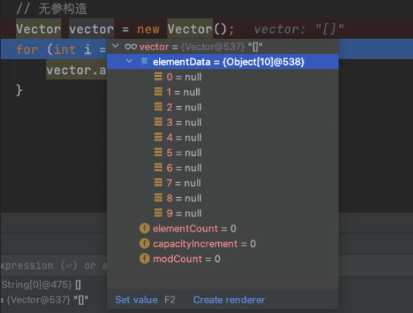

# Vector源码分析

## 1 Vector基本介绍与类图

`Vector` 类实现了一个动态数组。和 `ArrayList` 很相似，但是两者是不同的：

- `Vector` 是同步访问的。
- `Vector` 包含了许多传统的方法，这些方法不属于集合框架。

`Vector` 主要用在事先不知道数组的大小，或者只是需要一个可以改变大小的数组的情况。


**Note**:

- `Vector` 底层使用的是对象数组 `elementData` 
- `Vector` 是线程同步的，即线程安全。它的操作方法带有 `synchronized` 
- 在开发时，需要线程同步安全时，考虑使用 `Vector`

|             | 底层结构 |  版本  | 线程安全、效率 | 扩容倍数 |
| :---------: | :------: | :----: | :------------: | :------: |
| `ArrayList` | 可变数组 | Jdk1.2 | 不安全、效率高 |  1.5倍   |
|  `Vector`   | 可变数组 | Jdk1.0 | 安全、效率不高 |   2倍    |

## 2 Vertor的初始化

我们来 debug 下面这段代码。

```java
public static void main(String[] args) {
  // 无参构造
  Vector vector = new Vector();
  for (int i = 1; i <= 10; i++) {
    vector.add(i);
  }
}
```

可以看到，构造器直接创建了一个大小为 `10` 的 `Object` 数组。

```java
public Vector() {
  this(10);		// initialCapacity = 10
}

public Vector(int initialCapacity) {
  this(initialCapacity, 0);
}

public Vector(int initialCapacity, int capacityIncrement) {
  super();
  if (initialCapacity < 0)
    throw new IllegalArgumentException("Illegal Capacity: "+initialCapacity);
  // 大小为 10
  this.elementData = new Object[initialCapacity];
  this.capacityIncrement = capacityIncrement;
}
```



如果使用的是有参构造器，则它直接初始化参数大小的数组。

## 3 Vector的扩容机制

我们开始向 `Vector` 中添加数据。首先还是需要对基本数据类型进行自动装箱，然后进入 `add()` 方法。

```java
public synchronized boolean add(E e) {
  modCount++;
  ensureCapacityHelper(elementCount + 1);
  elementData[elementCount++] = e;
  return true;
}
```

> 注意：这里的方法带有了 `synchronized` 关键字，能够保证线程安全。 

继续，发现一个很眼熟的方法 `ensureCapacityHelper` ，我们进去看看：

```java
private void ensureCapacityHelper(int minCapacity) {
  // overflow-conscious code
  if (minCapacity - elementData.length > 0)
    grow(minCapacity);
}
```

这不就跟 `ArrayList` 的 `ensureExplicitCapacity` 几乎一样。

因为初始化了 10 个大小的空间，所以这次无需扩容。那如果这时候再多加一个元素呢？

```java
vector.add(1);
```

此时可以看到


于是第一次进入了 `grow()` 函数：

```java
private void grow(int minCapacity) {
  // overflow-conscious code
  int oldCapacity = elementData.length;
  int newCapacity = oldCapacity + ((capacityIncrement > 0) ?
                                   capacityIncrement : oldCapacity);
  if (newCapacity - minCapacity < 0)
    newCapacity = minCapacity;
  if (newCapacity - MAX_ARRAY_SIZE > 0)
    newCapacity = hugeCapacity(minCapacity);
  elementData = Arrays.copyOf(elementData, newCapacity);
}
```

这里与 `ArrayList` 有所区别，它扩容的大小是原数组的 2 倍。


