# 【Java开发笔记】Nginx

## 基本介绍


Nginx是一款轻量级的Web服务器/反向代理服务器及电子邮件（IMAP/POP3）代理服务器。其特点是 **占用内存少，并发能力强** ，事实上nginx的并发能力在同类型的网页服务器中表现较好，中国大陆使用nginx的网站有：百度、京东、新浪、网易、腾讯、淘宝等。

Nginx是由 **伊戈尔·赛索耶夫** 为俄罗斯访问量第二的 Rambler.ru 站点（俄文：Рамблер）开发的，第一个公开版本0.1.0发布于2004年10月4日。

官网：https://nginx.org/

## 下载与安装

### 安装依赖包

由于nginx是基于c语言开发的，所以需要安装c语言的编译环境，及正则表达式库等第三方依赖库。

```
yum -y install gcc pcre-devel zlib-devel openssl openssl-devel
```

### 下载 Nginx 安装包

```
yum install wget
wget https://nginx.org/download/nginx-1.22.1.tar.gz
```

> 【Note】wget命令用来从指定的URL下载文件。wget非常稳定，它在带宽很窄的情况下和不稳定网络中有很强的适应性，如果是由于网络的原因下载失败，wget会不断的尝试，直到整个文件下载完毕。如果是服务器打断下载过程，它会再次联到服务器上从停止的地方继续下载。
>

执行完wget指令后，就会在当前所在目录看到下载下来的文件。

### 解压nginx压缩包

```
tar -zxvf nginx-1.22.1.tar.gz
```

### 配置Nginx编译环境

```
cd nginx-1.22.1
./configure --prefix=/usr/local/nginx
```

说明: --prefix 指定的目录，就是我们安装Nginx的目录。

### 编译&安装

```
make & make install
```

### 查看目录结构

安装完Nginx后，我们可以切换到Nginx的安装目录(/usr/local/nginx)，先来熟悉一下Nginx的目录结构，如下图：

```
tree nginx
```

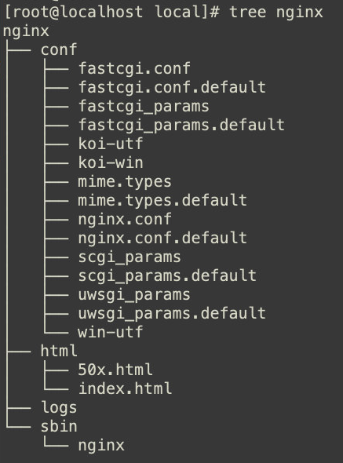

重点目录和文件如下: 

| 目录/文件       | 说明                                | 备注                                                      |
| --------------- | ----------------------------------- | --------------------------------------------------------- |
| conf            | 配置文件的存放目录                  |                                                           |
| conf/nginx.conf | Nginx的核心配置文件                 | conf下有很多nginx的配置文件，我们主要操作这个核心配置文件 |
| html            | 存放静态资源(html, css, )           | 部署到Nginx的静态资源都可以放在html目录中                 |
| logs            | 存放nginx日志(访问日志、错误日志等) |                                                           |
| sbin/nginx      | 二进制文件，用于启动、停止Nginx服务 |                                                           |

## 常用命令

在 `/nginx/sbin/` 下

### 查看版本

```
./nginx -v
```

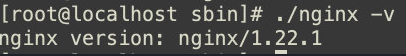

### 检查配置文件

修改了 nginx.conf 核心配置文件之后，在启动 Nginx 服务之前，可以先检查一下 conf/nginx.conf 文件配置的是否有错误，命令如下：

```
./nginx -t
```

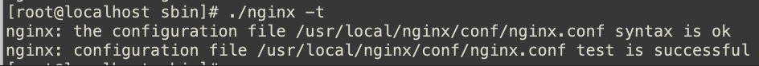

### 启动

```
./nginx
```

启动之后，我们可以通过 `ps -ef` 指令来查看nginx的进程是否存在。

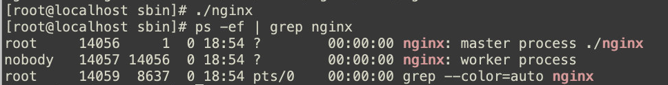

> 注意： nginx 服务启动后，默认就会有两个进程。

启动之后，我们可以直接访问 Nginx 的 80 端口， http://192.168.223.130

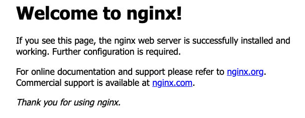

> 要想正常访问Nginx，需要关闭防火墙或开放指定端口号，执行的指令如下： 
>
> - 关闭防火
>
>   ```
>   systemctl stop firewalld
>   ```
>
> - 开放80端口
>
> ```
> firewall-cmd --zone=public --add-port=80/tcp --permanent
> firewall-cmd --reload
> ```

### 停止

```
./nginx -s stop
```

停止之后，我们可以查看nginx的进程： 

```
ps -ef|grep nginx
```

### 重新加载

当修改了Nginx配置文件后，需要重新加载才能生效，可以使用下面命令重新加载配置文件：

```
./nginx -s reload
```

### 配置环境变量

在 `/etc/profile` 中追加：

```
PATH=$PATH:/usr/local/nginx/sbin
```

然后

```
source /etc/profile
```

最后就可以直接：

```
nginx						# 启动nginx
nginx -s stop   # 关闭nginx
```

## 配置文件结构

nginx的配置文件( `conf/nginx.conf` )整体上分为三部分: 全局块、events块、http块。

| 区域     | 职责                                     |
| -------- | ---------------------------------------- |
| 全局块   | 配置和nginx运行相关的全局配置            |
| events块 | 配置和网络连接相关的配置                 |
| http块   | 配置代理、缓存、日志记录、虚拟主机等配置 |

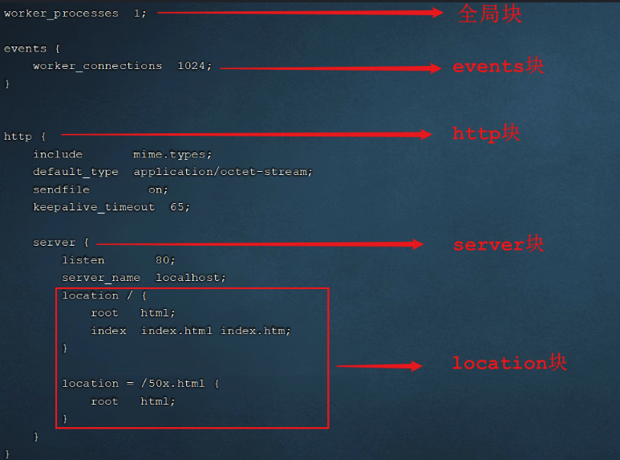

> 在全局块、events块以及http块中，我们经常配置的是http块。
>
> 在http块中可以包含多个server块,每个server块可以配置多个location块。

## 具体应用

### 部署静态资源

Nginx 可以作为 **静态 web 服务器** 来部署静态资源。这里所说的静态资源是指在服务端真实存在，并且能够直接展示的一些文件，比如常见的 html 页面、css 文件、js 文件、图片、视频等资源。

相对于 Tomcat，Ngin x处理静态资源的能力更加高效，所以 **在生产环境下，一般都会将静态资源部署到 Nginx 中。**

将静态资源部署到 Nginx 非常简单，只需要将文件复制到 Nginx 安装目录下的 html 目录中即可。

```
server {
    listen 80;				#监听端口	
    server_name localhost;	#服务器名称
    location / {			#匹配客户端请求url
        root html;			#指定静态资源根目录
        index index.html;	#指定默认首页
    }
}
```

创建了一个 `hello.html`，放到 `html目录` 下，开启 nginx 即可访问。


### 反向代理

#### 正向代理与反向代理

正向代理服务器是一个位于客户端和原始服务器 (origin server) 之间的服务器，为了从原始服务器取得内容，客户端向代理发送一个请求并指定目标(原始服务器)，然后代理向原始服务器转交请求并将获得的内容返回给客户端。

正向代理的典型用途是为在防火墙内的局域网客户端提供访问 Internet 的途径。

正向代理一般是 **在客户端设置代理服务器**，通过代理服务器转发请求，最终访问到目标服务器。


#### 反向代理

反向代理服务器位于用户与目标服务器之间，但是对于用户而言，反向代理服务器就相当于目标服务器，即用户直接访问反向代理服务器就可以获得目标服务器的资源，反向代理服务器负责将请求转发给目标服务器。用户不需要知道目标服务器的地址，也无须在用户端作任何设定，**对于用户来说，访问反向代理服务器是完全无感知的。**

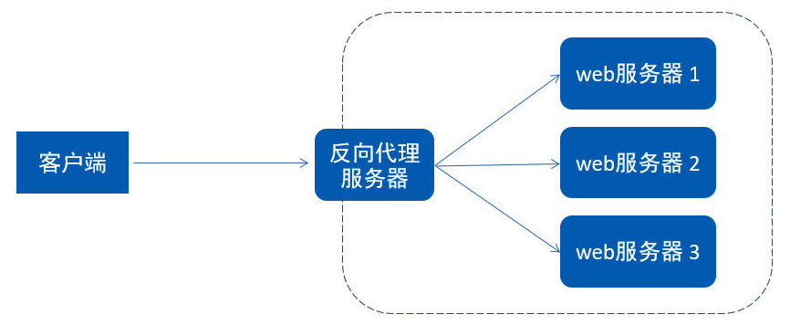

在 nginx 中，我们可以在 `nginx.conf` 中配置反向代理: 

```properties
server {
    listen 82;
    server_name localhost;
    location / {
        proxy_pass http://192.168.223.130:8080; 	# 反向代理配置，将请求转发到指定服务
    }
}
```

上述配置的含义为: 当我们访问 nginx 的 82 端口时，根据反向代理配置，会将请求转发到 http://192.168.223.130:8080 对应的服务上。

### 负载均衡

早期的网站流量和业务功能都比较简单，单台服务器就可以满足基本需求，但是随着互联网的发展，业务流量越来越大并且业务逻辑也越来越复杂，单台服务器的性能及单点故障问题就凸显出来了，因此需要多台服务器组成应用集群，进行性能的水平扩展以及避免单点故障出现。

**应用集群：**将同一应用部署到多台机器上，组成应用集群，接收负载均衡器分发的请求，进行业务处理并返回响应数据

**负载均衡器：**将用户请求根据对应的负载均衡算法分发到应用集群中的一台服务器进行处理

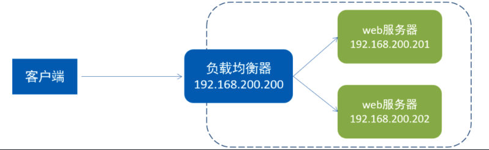

此处的负载均衡器，可以使用 Nginx 来实现，而 Nginx 的负载均衡是 **基于反向代理的**，只不过此时所代理的服务器不是一台，而是多台。

#### 负载均衡配置

**1). 将资料中提供的两个jar包，上传到192.168.200.201服务器上**

| jar                                                          | 运行端口 | 请求链接 | 响应数据 |
| ------------------------------------------------------------ | -------- | -------- | -------- |
|  | 8080     | /hello   | 8080     |
| ](https://camo.githubusercontent.com/652b0b9caea11e355a800a261174ea03616f8f72a5d9ac078009de0a1caee672/68747470733a2f2f747661312e73696e61696d672e636e2f6c617267652f303038767876674767793168393468683762656b306a333037673030737132732e6a7067) | 8081     | /hello   | 8081     |

> 我们在测试时，并没有那么多服务器，我们可以在一台服务器中启动多个服务，运行在不同的端口号上进行测试。

**2). 运行上传上来的两个jar包，运行端口分别是 8080 ， 8081**

由于我们执行 java -jar 指令会占用前台窗口，所以我们可以开启两个窗口进行测试。

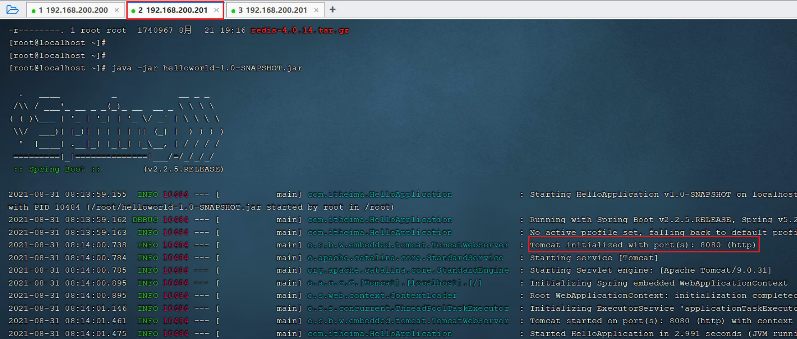

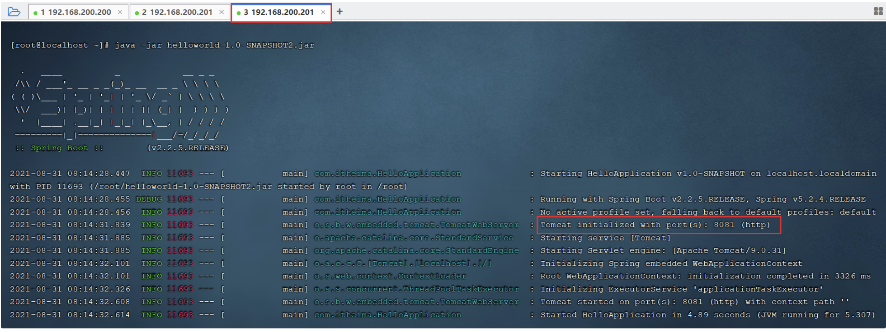

**3). 在nginx中配置负载均衡**

打开nginx的配置文件nginx.conf并增加如下配置: 

```properties
#upstream指令可以定义一组服务器
upstream targetserver{	
    server 192.168.200.201:8080;
    server 192.168.200.201:8081;
}

server {
    listen       8080;
    server_name  localhost;
    location / {
        proxy_pass http://targetserver;
    }
}
```

具体的配置位置如下: 

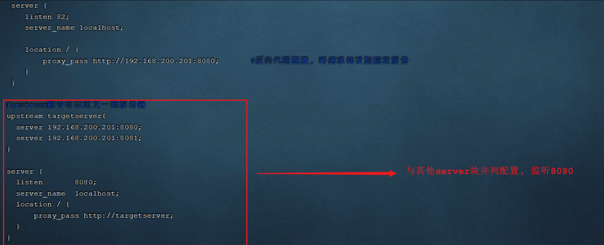

**4). 重新加载nginx配置文件,访问**

```shell
nginx -s reload
```

测试时,我们直接访问 nginx 的8080端口(http://192.168.200.200:8080), 此时 nginx 会根据负载均衡策略，将请求转发到后面的两台服务器。


在上述的测试过程中，我们看到请求均衡的转发到了 8080 和 8081，因为模式的负载均衡策略是轮询。

#### 负载均衡策略

处理上述默认的轮询策略以外，在Nginx中还提供了其他的负载均衡策略，如下： 

|  **名称**  |     **说明**     |                             特点                             |
| :--------: | :--------------: | :----------------------------------------------------------: |
|    轮询    |     默认方式     |                                                              |
|   weight   |     权重方式     |         根据权重分发请求，权重大的分配到请求的概率大         |
|  ip_hash   |  依据ip分配方式  | 根据客户端请求的IP地址计算hash值，根据hash值来分发请求，同一个IP发起的请求，会发转发到同一个服务器上 |
| least_conn | 依据最少连接方式 |     哪个服务器当前处理的连接少，请求优先转发到这台服务器     |
|  url_hash  | 依据url分配方式  | 根据客户端请求url的hash值，来分发请求，同一个url请求，会发转发到同一个服务器上 |
|    fair    | 依据响应时间方式 |            优先把请求分发给处理请求时间短的服务器            |

权重的配置： 

```properties
#upstream指令可以定义一组服务器
upstream targetserver{	
    server 192.168.223.130:8080 weight=10;
    server 192.168.223.131:8081 weight=5;
}
```

上述配置的 weight 权重是相对的，在上述的配置中，效果就是，在大数据量的请求下，最终 8080 接收的请求数是 8081 的两倍。


