# 【Java开发笔记】SpringSecurity

## 1 认证授权概述

### 1.1 认证授权概念

#### 认证

在互联网中，我们每天都会使用到各种各样的 APP 和网站，在使用过程中通常还会遇到需要注册登录的情况，输入你的用户名和密码才能正常使用，也就是说 **成为这个应用的合法身份才可以访问应用的资源，这个过程就是认证**。

**认证是为了保护系统的隐私数据与资源，用户的身份合法方可访问该系统的资源。** 当然认证的方式有很多，常见的账号密码登录，手机验证码登录，指纹登录，刷脸登录等等。简单说: 认证就是让系统知道我们是谁。

#### 授权

认证是为了保护身份的合法性，授权则是为了更细粒度的对数据进行划分。**授权是在认证通过的前提下发生的，控制不同的用户能够访问不同的资源。**

授权是用户认证通过后根据用户的权限来控制用户访问资源的过程，拥有资源的访问权限则正常访问，没有权限则拒绝访问。例如视频网站的 VIP 用户，可以查看到普通用户看不到的资源信息。

### 1.2 权限数据模型

授权过程中，我们需要知道如何对用户访问的资源进行控制，需要了解一些简单的授权数据模型。

授权可以非常简单的理解成谁（Who）对什么（What）进行怎么样（How）的操作。

| 名词 | 含义             | 备注                                                         |
| ---- | ---------------- | ------------------------------------------------------------ |
| Who  | 主体(Subject)    | 一般指用户，也可以是应用程序                                 |
| What | 资源(Resource)   | 例如商品信息，订单信息，页面按钮或程序中的接口等信息         |
| How  | 权限(Permission) | 规定了用户或程序对资源操作的许可。例如普通用户只能查看订单，管理员可修改或删除订单，这是因为普通用户和管理员用户对订单资源的操作权限不一样。 |

#### 主体、资源、权限的关系

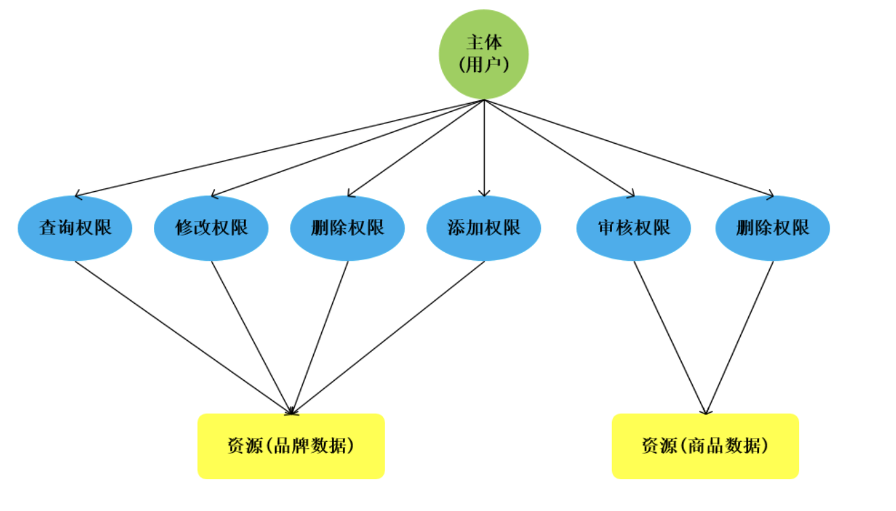

根据上图关系，可以做出下列 **数据模型（表）**：

- 主体（用户id、账号、密码、...） 
- 资源（资源id、资源名称、访问地址、...） 
- 权限（**权限id**、权限标识、权限名称、**资源id**、...） 
- 主体（用户）和权限关系（**用户id**、**权限id**、...）

#### 主体、资源、权限的表结构关系

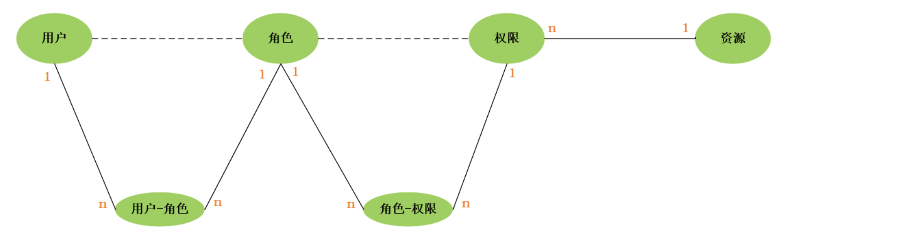

你会发现权限中包含了一个资源ID，多个权限可指向一个资源，我们是否可以直接在权限信息中把资源信息包含进来呢？当然，这也是很多企业开发中的做法，将权限和资源合并为 `权限(权限ID、权限标识、权限名称、资源名称、资源访问地址、...)`

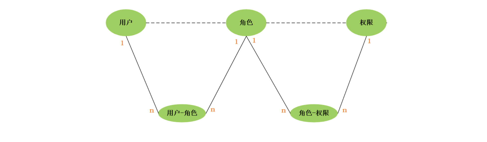 

### 1.3 RBAC权限模型

业界通常基于 **RBAC 模型（Role-Based Access Control, 基于角色的访问控制）**实现授权。RBAC 认为授权实际就是who,what,how 三者之间的关系(3W)，即 who 对 what 进行 how 的操作。

#### 基于角色的访问控制

RBAC 基于角色的访问控制（Role-Based Access Control）是按角色进行授权，比如：主体的角色为总经理可以查询企业运营报表，查询员工工资信息等，访问控制流程如下： 

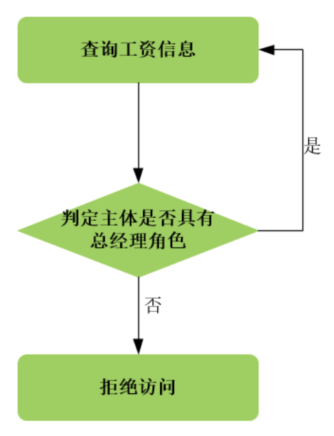

根据上图中的判断逻辑，授权代码可表示如下： 

```java
if(主体.hasRole("总经理角色标识")){
    //查询工资 
}else{
    //权限不足
}
```

如果上图中查询工资所需要的角色变化为总经理和部门经理，此时就需要修改判断逻辑为“判断用户的角色是否是 总经理或部门经理”，修改代码如下： 

```java
if(主体.hasRole("总经理角色标识") || 主体.hasRole("部门经理角色标识")){ 
	//查询工资 
}else{
    //权限不足
}
```

根据上边的例子发现，**当需要修改角色的权限时就需要修改授权的相关代码，系统可扩展性差。** 

#### 基于资源的访问控制

**RBAC 基于资源的访问控制 (Resource-Based Access Control)** 是按 **资源（或权限）**进行授权。

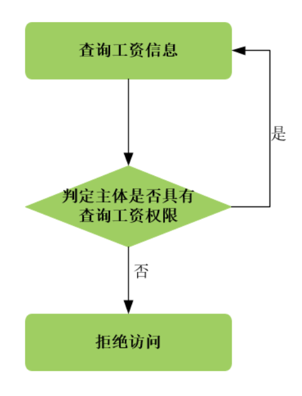

 同样是上面的需求，这时候我们的代码变成了

```java
if(Subject.hasPermission("查询员工工资的权限标识")){
	// 查询员工工资
}
```

优点：系统设计时定义好查询工资的权限标识，即使查询工资所需要的角色变化为总经理和部门经理也不需要修授权代码，**系统可扩展性强**。

### 1.4 常见的认证方式

#### Cookie-Session

早期互联网以 web 为主，客户端是浏览器，所以 Cookie-Session 方式最那时候最常用的方式，直到现在，一些 web 网站依然用这种方式做认证。

**认证过程大致如下：**

A. 用户输入用户名、密码或者用短信验证码方式登录系统；

B. 服务端验证后，创建一个 Session 记录用户登录信息 ，并且将 SessionID 存到 cookie，响应回浏览器；

C. 下次客户端再发起请求，自动带上 cookie 信息，服务端通过 cookie 获取 Session 信息进行校验；

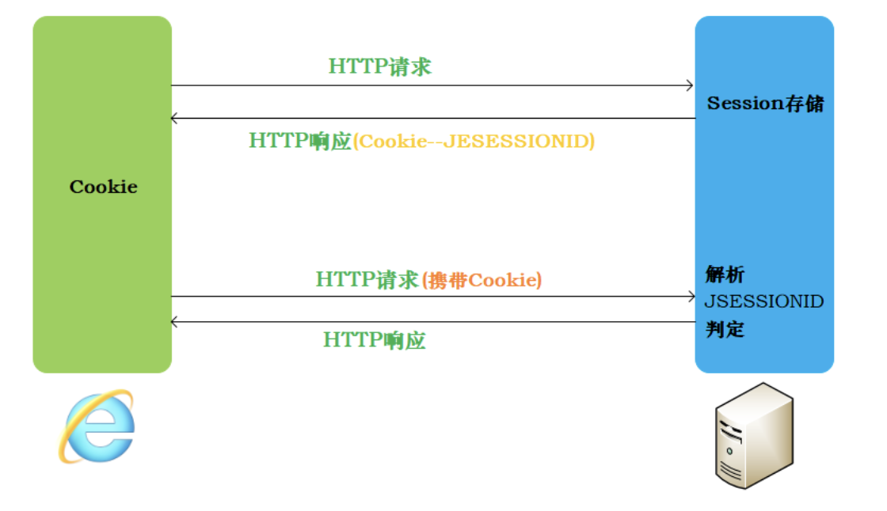

 **弊端**

- 只能在 web 场景下使用，如果是 APP 中，不能使用 cookie 的情况下就不能用了
- 即使能在 web 场景下使用，也要考虑跨域问题，**因为 cookie 不能跨域**（域名或者ip一致，端口号一致，协议要一致）
- cookie 存在 CSRF（跨站请求伪造）的风险；
- 如果是分布式服务，需要考虑 **Session 同步问题**；

#### jwt令牌无状态认证

JSON Web Token（JWT-字符串）是一个非常轻巧的规范。这个规范允许我们使用 JWT 在用户和服务器之间传递安全可靠的信息。

**认证过程: **

A. 依然是用户登录系统；

B. 服务端验证，并通过指定的算法 **生成令牌** 返回给客户端;

C. 客户端拿到返回的 Token，存储到 `local storage/Cookie` 中；

D. 下次客户端再次发起请求，将 Token 附加到 header 中；

E. 服务端获取 header 中的 Token ，通过相同的算法对 Token 进行验证，**如果验证结果相同，则说明这个请求是正常的，没有被篡改。这个过程可以完全不涉及到查询 Redis 或其他存储。**

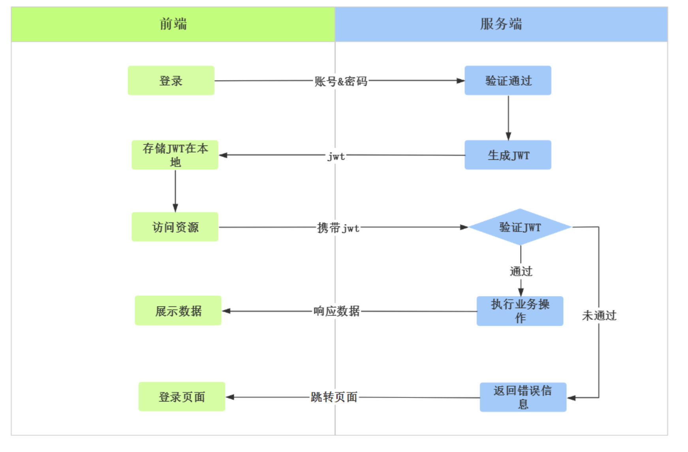

**优点**

A. 使用 json 作为数据传输，有广泛的通用型，并且体积小，便于传输；

B. 不需要在服务器端保存相关信息，节省内存资源的开销；

C. jwt 载荷部分可以存储业务相关的信息（非敏感的），例如用户信息、角色等；

### 1.5 技术实现

| 技术           | 概述                                                         |
| -------------- | ------------------------------------------------------------ |
| Apache Shiro   | Apache 旗下的一款安全框架                                    |
| SpringSecurity | Spring 家族的一部分, Spring 体系中提供的安全框架, 包含认证、授权两个大的部分 |
| CAS            | CAS 是一个单点登录(SSO)服务，开始是由耶鲁大学的一个组织开发，后来归到 apereo 去管 |
| 自行实现       | 自行通过业务代码实现, 实现繁琐, 代码量大                     |

## 2 密码加密概述

### 2.1 可逆加密算法

可逆加密算法，就是在加密后，密文可以反响解密得到密码原文。

#### 对称加密

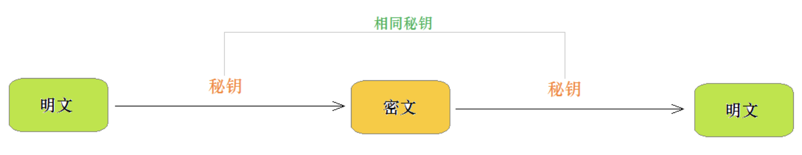

对称加密，指 **加密和解密使用 相同密钥 的加密算法**。

- 优点: 对称加密算法的优点是算法公开、计算量小、加密速度快、加密效率高
- 缺点: 没有非对称加密安全

常见的对称加密算法：`DES、3DES、DESX、Blowfish、RC4、RC5、RC6 和 AES`

#### 非对称加密

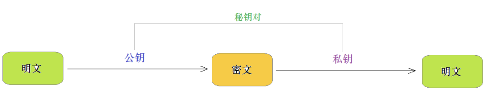

非对称加密，指 **加密和解密使用 不同密钥 的加密算法，也称为公私钥加密**。

假设两个用户要加密交换数据，双方交换公钥，使用时一方用对方的公钥加密，另一方即可用自己的私钥解密。

加密和解密:

- 私钥加密，持有私钥或公钥才可以解密
- 公钥加密，持有私钥才可解密

优点: 非对称加密与对称加密相比，其安全性更好；
缺点: 非对称加密的缺点是加密和解密花费时间长、速度慢，只适合对少量数据进行加密。

### 2.2 不可逆加密算法

不可逆加密算法，**一旦加密就不能反向解密得到密码原文**。通常用于 **密码数据加密**。

常见的不可逆加密算法有：`MD5 、SHA、HMAC`

### 2.3 MD5 与 Bcrypt

#### MD5

MD5 是比较常见的加密算法，广泛的应用于软件开发中的密码加密，通过 MD5 生成的密文，是无法解密得到明文密码的。但是现在在大数据背景下，很多的网站通过大数据可以将简单的 MD5 加密的密码破解。

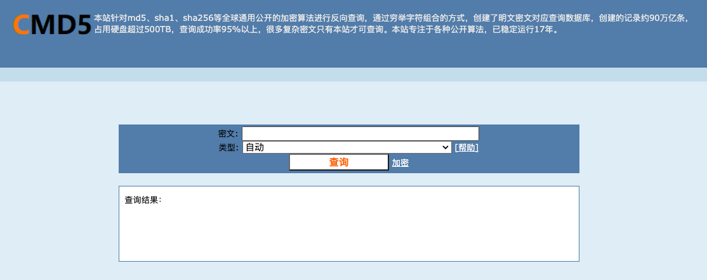

网址： https://www.cmd5.com/

可以在用户注册时，限制用户输入密码的长度及复杂度，从而增加破解难度。

#### Bcrypt

用户表的密码通常使用 MD5 等不可逆算法加密后存储，**为防止彩虹表破解，会先使用一个特定的字符串（如域名）加密，然后再使用一个随机的 salt（盐值）加密**。特定字符串是程序代码中固定的，salt 是每个密码单独随机，一般给用户表加一个字段单独存储，比较麻烦。 

BCrypt 算法将 salt 随机并混入最终加密后的密码，验证时也无需单独提供之前的 salt，从而无需单独处理 salt 问题。

加密密码: 

```java
BCryptPasswordEncoder bCryptPasswordEncoder = new BCryptPasswordEncoder();
for (int i = 0; i < 10; i++) {
	System.out.println(bCryptPasswordEncoder.encode("123456"));
}
```

得到结果: 

```
$2a$10$C6YynRFeJsSy7D/kg3d30OWnuwko7KQIEK5JrX0mWND.vuz2TqwpK
$2a$10$aSJfxH2oBtopFMbkMJ.PQ.sbSBXJH9g.9bv1mCyte/BtcU9VTs7lG
$2a$10$nVoB.eV5Uhc9FNUC36Pn0OosGh7aKlp7Sjfxaiml8NCSJ6PX1q6.m
$2a$10$2RM3mRNjz1LoZ5eeLdj.Hu15vlWIIj2zJC09vwTevBlIi5rjJStam
$2a$10$5bTOnk9hITzJd6EJMsX47uX9UdjASrPl4sEG6GJjfZGTk9f/37Q/q
$2a$10$0.PfbDnlBBWzpsw8PBjDcOtjUnwRgbSPCmhrAg5APUWor/4eQ0VVy
$2a$10$jfpPFH0DuTENicQ6vv38BeBO5YUXolS03bk1Ti3fmCrhQmBL1hYj.
$2a$10$pxR.jhV79v1po1vbhWi8CudiLTaw.W5lpl.E/dOEodfGXCJIPrJ4i
$2a$10$MvWb5LvCojzloYX9QLA8buL2Mkci2qaiMIdIH2PzGDssHUzEU21R2
$2a$10$7HLclohKrBZHvsBLDm8U/eTqe0KP2qV4F9d6jNvP4vO0pJG4wmeQy
```

验证密码: 

```java
BCryptPasswordEncoder bCryptPasswordEncoder = new BCryptPasswordEncoder();
boolean matches = 
   bCryptPasswordEncoder.matches("123456", "$2a$10$c2sZT/LtM1ExWfZjO0yIPeTGSqMSlX7oi.SvliMbeZpT9Y4qIBDue");
System.out.println(matches);//返回值为true, 则代表验证通过; 反之, 验证不通过
```

## 3 SpringSecurity基本介绍

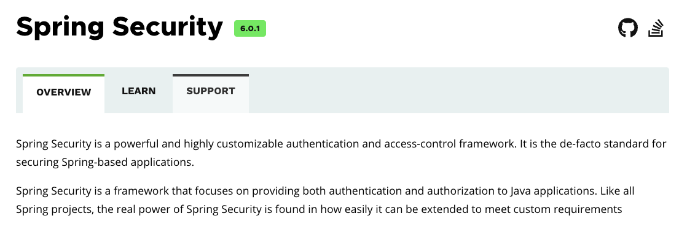

Spring Security 是为基于 Spring 的企业应用系统提供 **声明式（即配置或注解）** 的安全访问控制解决方案的安全框架（包含: 认证、授权两个方面）。它提供了完整的安全性解决方案，可以在 Web 请求级别和方法调用级别处理身份认证和授权充分利用了 Spring IOC，DI（控制反转 Inversion of Control ,DI:Dependency Injection 依赖注入）和 AOP（面向切面编程）功能，为应用系统提供声明式的安全访问控制功能。

官网地址: https://spring.io/projects/spring-security

### 3.1 入门案例

#### 工程搭建

创建一个新的 Spring 项目：

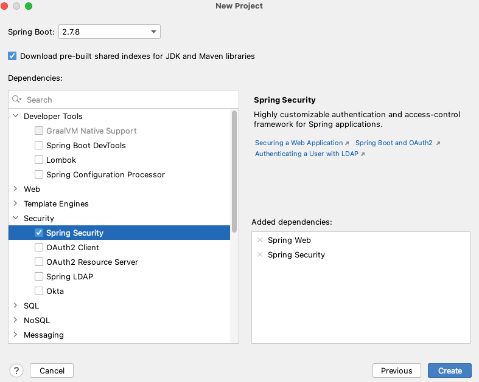

依赖：

```xml
<dependencies>
    <dependency>
        <groupId>org.springframework.boot</groupId>
        <artifactId>spring-boot-starter-security</artifactId>
    </dependency>
    <dependency>
        <groupId>org.springframework.boot</groupId>
        <artifactId>spring-boot-starter-web</artifactId>
    </dependency>

    <dependency>
        <groupId>org.springframework.boot</groupId>
        <artifactId>spring-boot-starter-test</artifactId>
        <scope>test</scope>
    </dependency>
</dependencies>
```

编写一个简单的 controller：

```java
/**
 * HelloController
 * @description
 * @author SongJian
 * @date 2023/2/15 21:39
 * @version
 */
@RestController
public class HelloController {
    @GetMapping("/hello")
    public String hello(){
        return "hello security";
    }
    @GetMapping("/say")
    public String say(){
        return "say security";
    }
    @GetMapping("/register")
    public String register(){
        return "register security";
    }
}
```

在 `localhost:8080` 访问：

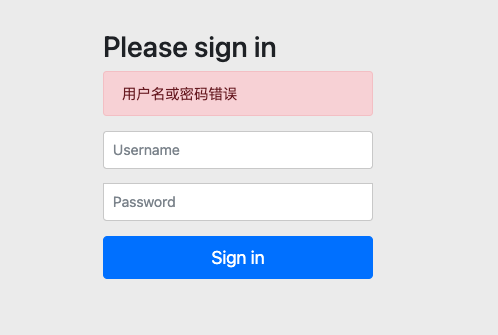

这是 SpringSecurity 内置的页面，密码在idea命令行有所展示。

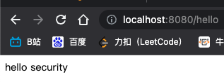

集成完毕。

> 注意：我们可以在配置文件中配置上述的用户名和密码，但在实际开发中不应使用明文配置

```properties
spring.security.user.name=user
spring.security.user.password=6666
```

#### 认证配置

上述的入门程序中, 用户名密码是框架默认帮我们生成的, 我们并没有指定。

如果我们想指定系统的访问用户名及密码, 可以通过 **配置的形式** 声明, 声明一个 `UserDetailsService` 类型的 `Bean`。

编写 `/config/SecurityConfig`：

```java
@Configuration
// 开启 springsecurity 安全设置
@EnableWebSecurity
public class SecurityConfig extends WebSecurityConfiguration {

    /**
     * 定义加载用户信息的服务bean
     * 当用户登入时，输入账号和密码会通过该服务下的user进行比对
     * @return
     */
    @Bean
    public UserDetailsService userDetailsService() {
        // 定义加载用户信息的服务
        InMemoryUserDetailsManager userDetailsManager = new InMemoryUserDetailsManager();
        // 构建用户信息
        UserDetails u1 = User.builder()
                .username("songjian")
                // noop 表示不对密码进行加密处理
                .password("{noop}123456")
                .authorities("P6", "ROLE_ADMIN").build();

        UserDetails u2 = User.builder()
                .username("test")
                // noop 表示不对密码进行加密处理
                .password("{noop}123456")
                .authorities("P5", "ROLE_ADMIN").build();
        userDetailsManager.createUser(u1);
        userDetailsManager.createUser(u2);
        return userDetailsManager;
    }
}
```

在 `userDetailsService()` 方法中 ，我们返回了一个 `UserDetailsService` 给 Spring 容器，Spring Security 会使用它来获取用户信息。我们暂时使用 `InMemoryUserDetailsManager` 实现类，并在其中分别创建了 songjian、test 两个用户，并设置密码和权限。

#### 授权设置

##### 方式一：编码方式

```java
@Configuration
// 开启 springsecurity 安全设置
@EnableWebSecurity
// 注解开发需要开启，设置为 true
@EnableGlobalMethodSecurity(prePostEnabled = true)
public class SecurityConfig extends WebSecurityConfigurerAdapter {

    /**
     * 定义加载用户信息的服务bean
     * 当用户登入时，输入账号和密码会通过该服务下的user进行比对
     * @return
     */
    @Bean
    public UserDetailsService userDetailsService() {
        // 定义加载用户信息的服务
        InMemoryUserDetailsManager userDetailsManager = new InMemoryUserDetailsManager();
        // 构建用户信息
        UserDetails u1 = User.builder()
                .username("songjian")
                // noop 表示不对密码进行加密处理
                .password("{noop}123456")
                .authorities("P6", "ADMIN").build();

        UserDetails u2 = User.builder()
                .username("test")
                // noop 表示不对密码进行加密处理
                .password("{noop}123456")
                .authorities("P5", "ADMIN").build();
        userDetailsManager.createUser(u1);
        userDetailsManager.createUser(u2);
        return userDetailsManager;
    }

    @Override
    protected void configure(HttpSecurity http) throws Exception {
        http.formLogin()
                .and()
                .logout()
                .permitAll()
                .and()
                .csrf().disable()
                .authorizeRequests()
                //不登录即可访问
                .antMatchers("/register").permitAll()
                //具有P5权限才可以访问
                .antMatchers("/hello").hasAuthority("P5")
                //具有 ROLE_ADMIN 角色才可以访问
                .antMatchers("/say").hasRole("ADMIN")
                //其他的登录之后就可以访问
                .anyRequest().authenticated();
    }
}
```

##### 方式二：注解方式

在控制方法/URL的权限时, 可以通过配置类中配置的方式进行控制, 也可以使用 **注解 `@PreAuthorize` 来进行控制**, 推荐使用注解:

```java
/**
 * HelloController
 * @description
 * @author SongJian
 * @date 2023/2/15 21:39
 * @version
 */
@RestController
public class HelloController {

    @PreAuthorize("hasAuthority('ADMIN')")
    @GetMapping("/hello")
    public String hello(){
        return "hello security";
    }
    
    @PreAuthorize("hasAuthority('P6')")
    @GetMapping("/say")
    public String say(){
        return "say security";
    }
    
    @PermitAll
    @GetMapping("/register")
    public String register(){
        return "register security";
    }
}
```

使用 `@PreAuthorize`，需要开启全局方法授权开关,加上注解 `@EnableGlobalMethodSecurity(prePostEnabled=true)`

经过上述的入门程序的演示，我们对于 SpringSecurity 的基本使用有了一定的了解，但是在入门程序中存在两个问题: 

> A. 密码采用的是明文的，不安全！
>
> B. 用户名/密码直接通过程序硬编码，不够灵活！

### 3.2 使用密码加密处理

在配置类 SecurityConfig 中配置 `Bean`: 

```java
//配置密码加密器 ;
@Bean
public BCryptPasswordEncoder bCryptPasswordEncoder(){
	return new BCryptPasswordEncoder();
}

//配置认证信息 , 密码使用BCryptPasswordEncoder加密 ;
@Bean
public UserDetailsService userDetailsService(){
	InMemoryUserDetailsManager inMemoryUserDetailsManager = new InMemoryUserDetailsManager();
	inMemoryUserDetailsManager.createUser(User.withUsername("songjian")
	               .password("$2a$10$qcKkkvsoClF9tO8c9wlR/ebgU8VM39GP5ZUdsts.XSPDmE40l.BP2").authorities("P1","ROLE_ADMIN").build());
    inMemoryUserDetailsManager.createUser(User.withUsername("test")
                   .password("$2a$10$qcKkkvsoClF9tO8c9wlR/ebgU8VM39GP5ZUdsts.XSPDmE40l.BP2").authorities("O1","ROLE_SELLER").build());
    return inMemoryUserDetailsManager;
}
```

### 3.3 (重点) 动态查询用户

上述的案例中, 用户名密码都是在代码中写死的, 现在实际项目中, 是需要动态从数据库查询;简易的数据库表如下: 

```sql
create database security_demo default charset=utf8mb4;
use security_demo;

CREATE TABLE `tb_user` (
  `id` int(11) NOT NULL AUTO_INCREMENT,
  `username` varchar(100) DEFAULT NULL,
  `password` varchar(100) DEFAULT NULL,
  `roles` varchar(100) DEFAULT NULL,
  PRIMARY KEY (`id`)
) ENGINE=InnoDB DEFAULT CHARSET=utf8mb4;

INSERT INTO `tb_user` VALUES (1, 'itcast', '$2a$10$f43iK9zKD9unmgLao1jqI.VluZ.Rr/XijizVEA73HeOu9xswaUBXC', 'ROLE_ADMIN,P1');
INSERT INTO `tb_user` VALUES (2, 'itheima', '$2a$10$f43iK9zKD9unmgLao1jqI.VluZ.Rr/XijizVEA73HeOu9xswaUBXC', 'ROLE_SELLER,O1');
```

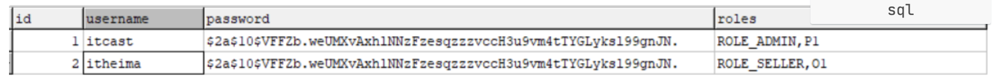 

**A. pom.xml**

```xml
        <dependency>
            <groupId>org.mybatis.spring.boot</groupId>
            <artifactId>mybatis-spring-boot-starter</artifactId>
            <version>2.1.4</version>
        </dependency>

        <dependency>
            <groupId>mysql</groupId>
            <artifactId>mysql-connector-java</artifactId>
        </dependency>
```

**B. application.yml**

```yml
# 应用名称
spring.application.name=security_test
# 应用服务 WEB 访问端口
server.port=8080

# 配置用户名和密码
#spring.security.user.name=user
#spring.security.user.password=6666

#下面这些内容是为了让MyBatis映射
#指定Mybatis的Mapper文件
mybatis.mapper-locations=classpath:mapper/*xml
#指定Mybatis的实体目录
mybatis.type-aliases-package=com.itheima.security.pojo

# 数据库驱动：
spring.datasource.driver-class-name=com.mysql.cj.jdbc.Driver
# 数据库连接地址
spring.datasource.url=jdbc:mysql://192.168.188.130:3306/security_demo?serverTimezone=UTC
# 数据库用户名&密码：
spring.datasource.username=root
spring.datasource.password=root
```

**C. 实体类**

```java
@Data
@NoArgsConstructor
@AllArgsConstructor
@Builder
public class TbUser implements Serializable {
    /**
     * 
     */
    private Integer id;

    /**
     * 
     */
    private String username;

    /**
     * 
     */
    private String password;

    /**
     * 
     */
    private String roles;

    private static final long serialVersionUID = 1L;
}
```

**D. mapper**

```java
@Mapper
public interface TbUserMapper {

    int deleteByPrimaryKey(Long id);

    int insert(TbUser record);

    int insertSelective(TbUser record);

    TbUser selectByPrimaryKey(Long id);

    int updateByPrimaryKeySelective(TbUser record);

    int updateByPrimaryKey(TbUser record);
  
    TbUser findByUserName(@Param("userName") String userName);

}
```

xml:

~~~xml
<?xml version="1.0" encoding="UTF-8"?>
<!DOCTYPE mapper
        PUBLIC "-//mybatis.org//DTD Mapper 3.0//EN"
        "http://mybatis.org/dtd/mybatis-3-mapper.dtd">
<mapper namespace="com.itheima.security.mapper.TbUserMapper">

    <resultMap id="BaseResultMap" type="com.itheima.security.pojo.TbUser">
            <id property="id" column="id" jdbcType="INTEGER"/>
            <result property="username" column="username" jdbcType="VARCHAR"/>
            <result property="password" column="password" jdbcType="VARCHAR"/>
            <result property="roles" column="roles" jdbcType="VARCHAR"/>
    </resultMap>

    <sql id="Base_Column_List">
        id,username,password,
        roles
    </sql>

    <select id="selectByPrimaryKey" parameterType="java.lang.Long" resultMap="BaseResultMap">
        select
        <include refid="Base_Column_List" />
        from tb_user
        where  id = #{id,jdbcType=INTEGER} 
    </select>
    <select id="findByUserName" resultMap="BaseResultMap">
        select <include refid="Base_Column_List"/> from tb_user where username=#{userName}
    </select>

    <delete id="deleteByPrimaryKey" parameterType="java.lang.Long">
        delete from tb_user
        where  id = #{id,jdbcType=INTEGER} 
    </delete>
    <insert id="insert" keyColumn="id" keyProperty="id" parameterType="com.itheima.security.pojo.TbUser" useGeneratedKeys="true">
        insert into tb_user
        ( id,username,password
        ,roles)
        values (#{id,jdbcType=INTEGER},#{username,jdbcType=VARCHAR},#{password,jdbcType=VARCHAR}
        ,#{roles,jdbcType=VARCHAR})
    </insert>
    <insert id="insertSelective" keyColumn="id" keyProperty="id" parameterType="com.itheima.security.pojo.TbUser" useGeneratedKeys="true">
        insert into tb_user
        <trim prefix="(" suffix=")" suffixOverrides=",">
                <if test="id != null">id,</if>
                <if test="username != null">username,</if>
                <if test="password != null">password,</if>
                <if test="roles != null">roles,</if>
        </trim>
        <trim prefix="values (" suffix=")" suffixOverrides=",">
                <if test="id != null">id = #{id,jdbcType=INTEGER},</if>
                <if test="username != null">username = #{username,jdbcType=VARCHAR},</if>
                <if test="password != null">password = #{password,jdbcType=VARCHAR},</if>
                <if test="roles != null">roles = #{roles,jdbcType=VARCHAR},</if>
        </trim>
    </insert>
    <update id="updateByPrimaryKeySelective" parameterType="com.itheima.security.pojo.TbUser">
        update tb_user
        <set>
                <if test="username != null">
                    username = #{username,jdbcType=VARCHAR},
                </if>
                <if test="password != null">
                    password = #{password,jdbcType=VARCHAR},
                </if>
                <if test="roles != null">
                    roles = #{roles,jdbcType=VARCHAR},
                </if>
        </set>
        where   id = #{id,jdbcType=INTEGER} 
    </update>
    <update id="updateByPrimaryKey" parameterType="com.itheima.security.pojo.TbUser">
        update tb_user
        set 
            username =  #{username,jdbcType=VARCHAR},
            password =  #{password,jdbcType=VARCHAR},
            roles =  #{roles,jdbcType=VARCHAR}
        where   id = #{id,jdbcType=INTEGER} 
    </update>
</mapper>
~~~

**D. （重点）自定义UserDetailsService**

我们之前用的 `UserDetailsService` 是 SpringSecurity 内置提供给我们的，它实现了 `UserDetailsService` 接口。

我们可以自己实现 `UserDetailsService` 接口从而自定义。

```java
@Component
public class UserDetailsServiceImpl implements UserDetailsService {

    @Autowired
    private TbUserMapper tbUserMapper;

    @Override
    public UserDetails loadUserByUsername(String userName) throws UsernameNotFoundException {
        TbUser user = tbUserMapper.findByUserName(userName);
        if (user==null) {
            throw new UsernameNotFoundException("用户不存在");
        }
        //构建认证明细对象
        //获取用户权限
      	List<GrantedAuthority> list = AuthorityUtils.commaSeparatedStringToAuthorityList(user.getRoles());
      
        UserDetails userDetails = User.builder()
                .username(user.getUserName())
                .password(user.getPassWord())
                .authorities(list).build();
      	return userDetails
    }
}
```

在 SecurityConfig 中注释掉 inMemoryUserDetailsManager bean，并配置加密bean：

~~~java
    @Bean
    public PasswordEncoder passwordEncoder(){
        return new BCryptPasswordEncoder();
    }
~~~

整体访问流程如下：

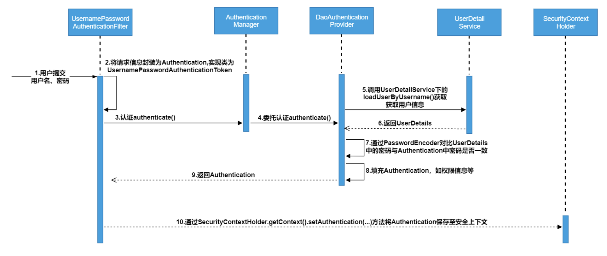

### 3.4 认证原理分析

Spring Security 所解决的问题就是安全访问控制，而 **安全访问控制功能其实就是对所有进入系统的请求进行拦截，校验每个请求是否能够访问它所期望的资源。**因此，可以通过 Filter 或 AOP 等技术来实现，**Spring Security 对 Web 资源的保护是靠 Filter 实现的**，所以从这个 Filter 来入手，逐步深入 Spring Security 原理。 当初始化 Spring Security 时，会创建一个名为 `SpringSecurityFilterChain的Servlet` 过滤器，类型为 `org.springframework.security.web.FilterChainProxy`，它实现了 `javax.servlet.Filter` ，因此外部的请求会经过此类，下图是 Spring Security 过虑器链结构图：

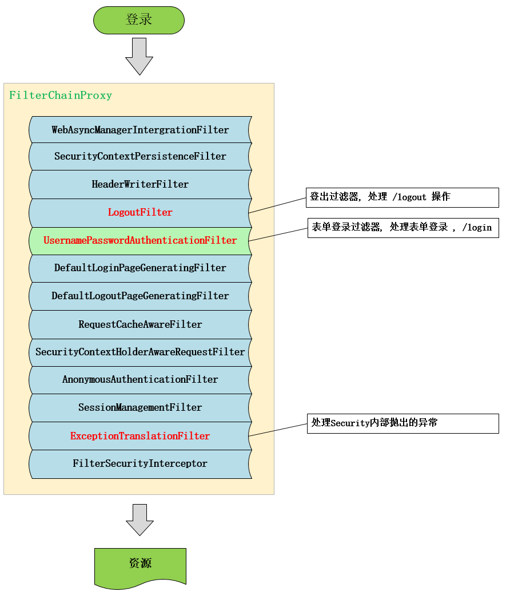

FilterChainProxy 是一个代理，真正起作用的是 FilterChainProxy 中 SecurityFilterChain 所包含的各个 Filter，同时 这些 Filter 作为 Bean 被 Spring 管理，它们是 Spring Security 核心，各有各的职责，但他们并不直接处理用户的认证，也不直接处理用户的授权，而是把它们交给了 **认证管理器（AuthenticationManager）**和 **决策管理器 （AccessDecisionManager）**进行处理。

下面介绍过滤器链中主要的几个过滤器及其作用：

- SecurityContextPersistenceFilter 这个 Filter 是整个拦截过程的入口和出口（也就是第一个和最后一个拦截器），会在请求开始时从配置好的 SecurityContextRepository 中获取 SecurityContext，然后把它设置给 SecurityContextHolder。在请求完成后将SecurityContextHolder 持有的 SecurityContext 再保存到配置好 的SecurityContextRepository，同时清除 securityContextHolder 所持有的 SecurityContext；
- **UsernamePasswordAuthenticationFilter 用于处理来自表单提交的认证。**该表单必须提供对应的用户名和密码，其内部还有登录成功或失败后进行处理的 AuthenticationSuccessHandler 和 AuthenticationFailureHandler，这些都可以根据需求做相关改变；
- FilterSecurityInterceptor 是用于保护 web 资源的，使用 AccessDecisionManager 对当前用户进行授权访问，前面已经详细介绍过了；
- ExceptionTranslationFilter 能够捕获来自 FilterChain 所有的异常，并进行处理。但是它只会处理两类异常： AuthenticationException 和 AccessDeniedException，其它的异常它会继续抛出。

## 4 Web项目集成SpringSecurity

SpringSecurity 提供了 **基于 form 表单认证** 的方式，那如何实现 **ajax 异步提交登录信息** 的功能呢？

通过研究 `UsernamePasswordAuthenticationFilter` 内置认证过滤器，我们可以仿照这个登录过滤器自定义认证规则：

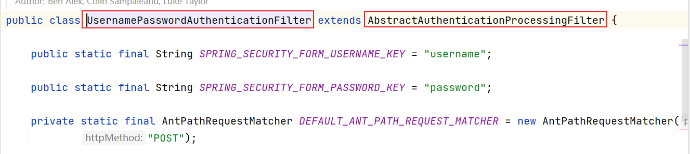

### 4.1 自定义Security认证过滤器

自定义的 Security 用户名密码认证过滤器，可以按照 `UsernamePasswordAuthenticationFilter` 的思路进行自定义。

```java
/**
 * MyUsernamePasswordAuthenticationFilter
 * @description 自定义认证过滤器，来获取认证时，传入的 json 数据
 * @author SongJian
 * @date 2023/2/16 14:08
 * @version
 */
public class MyUsernamePasswordAuthenticationFilter extends AbstractAuthenticationProcessingFilter {

    private String username = "username";
    private String password = "password";

    /**
     * 有参构造器，通过构造器，指定登入的url地址
     * @param defaultFilterProcessesUrl 指定的登入路径
     */
    protected MyUsernamePasswordAuthenticationFilter(String defaultFilterProcessesUrl) {
        super(defaultFilterProcessesUrl);
    }

    /**
     *
     * @param request
     * @param response
     * @return
     * @throws AuthenticationException
     * @throws IOException
     * @throws ServletException
     */
    @Override
    public Authentication attemptAuthentication(HttpServletRequest request, HttpServletResponse response) throws AuthenticationException, IOException, ServletException {
        String name = null;
        String pwd = null;
        // 判断当前请求是否是 ajax json 方式请求
        // equalsIgnoreCase 比较字符串时，忽略大小写
        if ((request.getContentType().equalsIgnoreCase(MediaType.APPLICATION_JSON_VALUE)
                || request.getContentType().equalsIgnoreCase(MediaType.APPLICATION_JSON_UTF8_VALUE))
                && request.getMethod().equalsIgnoreCase("POST")) {
            // 获取请求流中的用户信息
            ServletInputStream inputStream = request.getInputStream();
            // 解析流，获取信息
            HashMap<String, String> mapInfo = new ObjectMapper().readValue(inputStream, HashMap.class);
            // 获取用户名和密码信息
            name = mapInfo.get(username);
            pwd = mapInfo.get(password);
        } else {
            name = request.getParameter("username");
            pwd = request.getParameter("password");
        }
        // 将用户信息组装成 token 对象  UsernamePasswordAuthenticationToken
        UsernamePasswordAuthenticationToken authRequest = new UsernamePasswordAuthenticationToken(name, pwd);
        // 将组装的 token 对象委托给 认证管理器 做后续的认证处理
      	// 认证管理器底层会调用 UserDetailService 方法获取数据库中的用户信息，
      	// 然后与 token 对象下的信息进行密码比对
      	// 如果一致，则将从数据库中查询的权限集合信息封装到 token 对象下
        // 这样，用户在访问资源时，会带着这个 token 对象，访问什么资源，就从 token 中判断用户是否对资源的权限
        return this.getAuthenticationManager().authenticate(authRequest);
    }
}
```

### 4.2 自定义SecurityConfig类

配置默认认证过滤器，保证自定义的认证过滤器要在默认的认证过滤器之前；

```java
/**
 * SecurityConfig
 * @description 自定义 web 安全配置类
 * @author SongJian
 * @date 2023/2/15 21:49
 * @version
 */
@Configuration
// 开启 springsecurity 安全设置
@EnableWebSecurity
@EnableGlobalMethodSecurity(prePostEnabled = true)
public class SecurityConfig extends WebSecurityConfigurerAdapter {
  
    @Override
    protected void configure(HttpSecurity http) throws Exception {
        http.formLogin()
                .and()
                .logout()
                .permitAll()
                .and()
                .csrf().disable()
                .authorizeRequests()
                //其他的登录之后就可以访问
                .anyRequest().authenticated();
        // 设置自定义的认证过滤器要在默认的认证过滤器之前执行，这么做避免了自带的过滤器做无用的过滤处理
        http.addFilterBefore(myUserNamePasswordAuthenticationFilter(), UsernamePasswordAuthenticationFilter.class).csrf().disable();
    }


    @Bean
    public MyUsernamePasswordAuthenticationFilter myUserNamePasswordAuthenticationFilter() throws Exception {
        // 设置默认登录路径
        MyUsernamePasswordAuthenticationFilter myfilter =
                new MyUsernamePasswordAuthenticationFilter("/authentication/form");
        // 设置认证管理器
        myfilter.setAuthenticationManager(authenticationManagerBean());
        return myfilter;
    }
}
```

### 4.3 认证成功后响应token实现

在自定义的登录过滤器：`MyUserNamePasswordAuthenticationFilter` 内实现响应 jwt token 实现 `successfulAuthentication`，该方法在认证成功后会被执行。

~~~java
    /**
     * 认证工程处理方法
     * @param request
     * @param response
     * @param chain
     * @param authResult
     * @throws IOException
     * @throws ServletException
     */
    @Override
    protected void successfulAuthentication(HttpServletRequest request,
                                            HttpServletResponse response,
                                            FilterChain chain,
                                            Authentication authResult) throws IOException, ServletException {
        //认证主体信息
        UserDetails principal = (UserDetails) authResult.getPrincipal();
        //组装响应前端的信息
        String username = principal.getUsername();
        String password = principal.getPassword();
        Collection<? extends GrantedAuthority> authorities = principal.getAuthorities();
        // 构建 JwtToken
      	// 根据用户名和权限生成 JwtToken
        String token = JwtTokenUtil.createToken(username, new Gson().toJson(authorities));
        HashMap<String, String> info = new HashMap<>();
        info.put("name",username);
        info.put("token",token);
        //设置响应格式
        response.setContentType(MediaType.APPLICATION_JSON_VALUE);
        response.getWriter().write(new Gson().toJson(info));
    }
~~~

完成该方法后，当用户输入了正确的用户名和密码后（即认证通过），后端会根据 **用户信息和用户权限信息** 生成一个 **JwtToken** ，并将其发送给用户，用户后续的请求可以带上这个 **JwtToken**。

### 4.4 自定义授权过滤器

因此，我们只需要解析 JwtToken，然后生成 **认证凭证对象 (UsernamePasswordAuthenticationToken)** 即可。

我们需要继承 `OncePerRequestFilter`，该过滤器是 Spring 内置的，每次请求只过滤一次。

```java
/**
 * MyOncePerRequestFilter
 * @description 过滤用户请求，获取请求头中携带的 token，用于用户的权限校验
 * @author SongJian
 * @date 2023/2/16 15:19
 * @version
 */
public class MyOncePerRequestFilter extends OncePerRequestFilter {
    /**
     * 定义过滤规则
     * @param request
     * @param response
     * @param filterChain 过滤链对象
     * @throws ServletException
     * @throws IOException
     */
    @Override
    protected void doFilterInternal(HttpServletRequest request, HttpServletResponse response, FilterChain filterChain) throws ServletException, IOException {
        // 获取请求头中的 token 信息
        String token = request.getHeader(JwtTokenUtil.TOKEN_HEADER);
        // 判断 token 是否存在
        if (token == null) {
            // 如果 token 不存在，则放行请求，去完成认证登入
            filterChain.doFilter(request, response);
            // 终止当前操作
            return;
        }
        // 如果 token 存在，解析 token，获取用户名和权限信息
        Claims claims = JwtTokenUtil.checkJWT(token);
        if (claims == null) {
            // 票据无效
            response.getWriter().write("当前票据失效！");
            return;
        }
        // 获取用户名和权限信息
        String username = JwtTokenUtil.getUsername(token);
        // 格式如下：ROLE_ADMIN,P6
        String permissions = JwtTokenUtil.getUserRole(token);
        // 因此需要转化成权限集合
        List<GrantedAuthority> authentications = AuthorityUtils.commaSeparatedStringToAuthorityList(permissions);
        // 将用户名和权限信息组装成 UsernamePasswordAuthenticationToken 对象
        // 参数：用户名，密码，权限集合
        UsernamePasswordAuthenticationToken tokenObj = new UsernamePasswordAuthenticationToken(username, null, authentications);
        // 将组装的 token 对象存入 security 上下文
        // 那么当前请求走到哪里，security 框架都能按照需求获取
        SecurityContextHolder.getContext().setAuthentication(tokenObj);
        // 放行，其他过滤器进行后续操作
        filterChain.doFilter(request, response);
    }
}
```

同样，需要配置成 `Bean`

```java
@Bean
public MyOncePerRequestFilter myOncePerRequestFilter() {
    MyOncePerRequestFilter myOncePerRequestFilter = new MyOncePerRequestFilter();
    return myOncePerRequestFilter;
}
```

同时，这个过滤器应该在 `MyUsernamePasswordAuthenticationFilter` 之前去执行：

```java
@Override
protected void configure(HttpSecurity http) throws Exception {
    http.formLogin()
            .and()
            .logout()
            .permitAll()
            .and()
            .csrf().disable()
            .authorizeRequests()
            //其他的登录之后就可以访问
            .anyRequest().authenticated();
    // 设置自定义的认证过滤器要在默认的认证过滤器之前执行，这么做避免了自带的过滤器做无用的过滤处理
    http.addFilterBefore(myUserNamePasswordAuthenticationFilter(), UsernamePasswordAuthenticationFilter.class);
    http.addFilterBefore(myOncePerRequestFilter(), MyUsernamePasswordAuthenticationFilter.class);
}
```

### 4.5 自定义拒绝策略

自定义权限拒绝策略：

```java
@Override
protected void configure(HttpSecurity http) throws Exception {
    http.formLogin()
            .and()
            .logout()
            .permitAll()
            .and()
            .csrf().disable()
             // 禁用seesion
            .sessionManagement().sessionCreationPolicy(SessionCreationPolicy.NEVER)
            .and()
            .authorizeRequests()
            //其他的登录之后就可以访问
            .anyRequest().authenticated();
    // 设置自定义的认证过滤器要在默认的认证过滤器之前执行，这么做避免了自带的过滤器做无用的过滤处理
    http.addFilterBefore(myUserNamePasswordAuthenticationFilter(), UsernamePasswordAuthenticationFilter.class);
    http.addFilterBefore(myOncePerRequestFilter(), MyUsernamePasswordAuthenticationFilter.class);
    // 自定义拒绝策略
    http.exceptionHandling().accessDeniedHandler(new AccessDeniedHandler() {
        @Override
        public void handle(HttpServletRequest request,
                           HttpServletResponse response,
                           AccessDeniedException accessDeniedException) throws IOException, ServletException {
            //权限拒绝处理策略
            response.getWriter().write("no permission......reject....");
        }
    });
}
```


