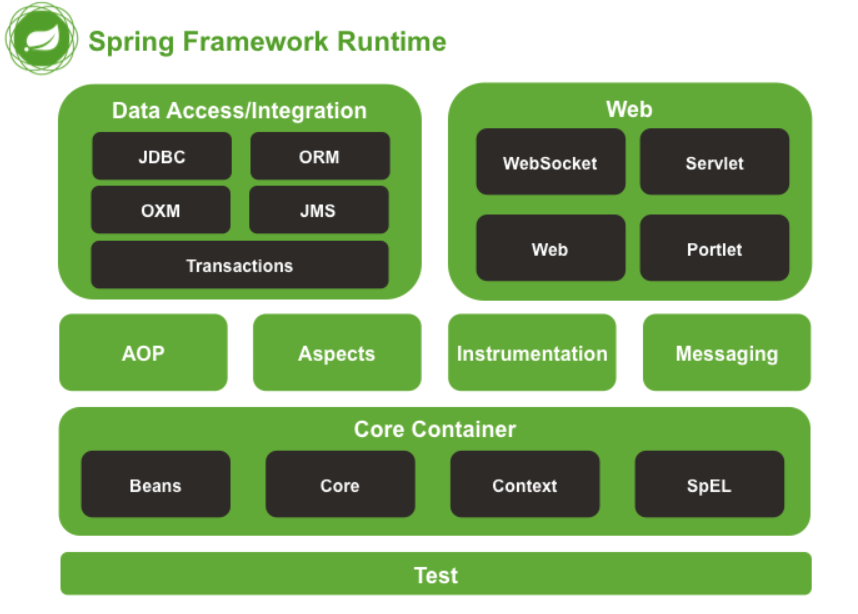

# 【八股】Spring-基础

## 1 基本概念

### 1.1 为什么要使用Spring框架？

> 其实就是问Spring的优点

Spring 是一个轻量级的应用框架，它提供了 IOC 和 AOP 两个核心功能。

它的核心目的是为了 **简化企业级的应用开发**，使开发者 **只需要关心业务上的需求，不需要关心 Bean 的管理**，以及通过切面的方式对功能进行增强，从而减少代码的侵入性。

Spring本身的特性而言，有几个关键优势：

- 轻量级
- 通过 IOC 容器实现 Bean 的生命周期的管理，以及通过 DI 实现依赖注入，从而实现对象依赖松耦合的管理
- 提供了 AOP 的面向前面编程功能，把业务逻辑和系统功能之间进行切分
- 提供了 MVC 的框架
- 事务管理，通过 AOP 实现事务的统一管理，对应用开发中的事务处理提供灵活的支持
- 生态庞大，在业务开发的领域，提供了非常完善的支持
- 社区活跃度和技术的成熟度都非常高

### 1.2 Spring、Spring Boot 和 Spring MVC 的关系？

Spring 包含了多个功能模块，其中最重要的是 `Spring-Core`（主要提供 IoC 依赖注入功能的支持） 模块， Spring 中的其他模块（比如 Spring MVC）的功能实现基本都需要依赖于该模块。

S**pring MVC 是 Spring 中的一个很重要的模块，主要赋予 Spring 快速构建 MVC 架构的 Web 程序的能力**。MVC 是模型(Model)、视图(View)、控制器(Controller)的简写，其核心思想是通过将业务逻辑、数据、显示分离来组织代码。

使用 Spring 进行开发各种配置过于麻烦比如开启某些 Spring 特性时，需要用 XML 或 Java 进行显式配置。于是，Spring Boot 诞生了！

**Spring 旨在简化 J2EE 企业应用程序开发。Spring Boot 旨在简化 Spring 开发**（减少配置文件，开箱即用！）。

**Spring Boot 只是简化了配置**，如果你需要构建 MVC 架构的 Web 程序，你还是需要使用 Spring MVC 作为 MVC 框架，只是说 Spring Boot 帮你简化了 Spring MVC 的很多配置，真正做到开箱即用！

