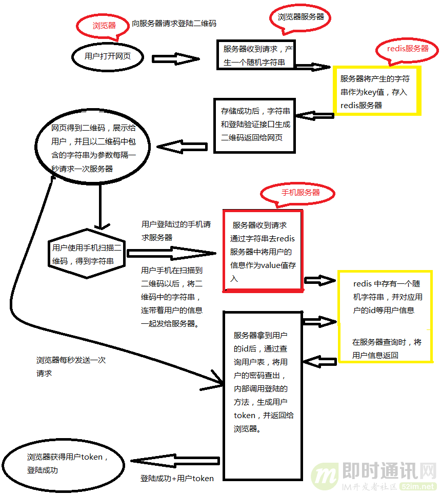

# 【八股】业务场景

## 1 如何实现一个扫码登录功能？

扫码登录本质是解决 **将 APP 端的用户登录信息（通常是Token）通过扫码的形式安全稳定地同步给 Web 端**。

### 技术逻辑

1. 网页端与服务器的配合逻辑：

- 用户打开网站的登录页面的时候，向 web 服务器发送获取登录二维码的请求
- 服务器收到请求后，随机生成一个 `uuid`，将这个 id 作为 key 值存入 redis 服务器，同时设置一个过期时间，再过期后，用户登录二维码需要进行刷新重新获取
- 同时，将这个 key 值和本公司的验证字符串合在一起，通过二维码生成接口，生成一个二维码的图片
- 然后，将二维码图片和 `uuid` 一起返回给用户浏览器
- 浏览器拿到二维码和 `uuid` 后，会每隔一秒向服务器发送一次，登录是否成功的请求，请求中携带有 `uuid` 作为当前页面的标识符

2. 手机端与服务器的配合逻辑：

- 用户拿出手机扫描二维码，就可以得到一个 `验证信息` 和一个 `uuid`
- 由于手机端已经进行过了登录，在访问 **手机端服务器** 的时候，参数中都会携带一个用户的 `token`，**手机端服务器** 可以从中解析到用户的 `userId`
- 手机端将解析到的数据和用户 `token` 一起作为参数，向 **手机服务器** 发送验证登录请求（这里的服务器是手机服务器，手机端的服务器跟网页端服务器不是同一台服务器）
- 服务器收到请求后，首先对比参数中的验证信息，确定是否为用户登录请求接口。如果是，返回一个确认信息给手机端
- 手机端收到返回后，将登录确认框显示给用户
- 用户确认是进行的登录操作后，手机再次发送请求。服务器拿到 uuId 和 userId 后，将用户的 userid 作为 value 值存入 redis 中以 uuid 作为 key 的键值对中

3. 登入成功时的逻辑：

然后，浏览器再次发送请求的时候，浏览器端的服务器就可以得到一个用户 Id，并调用登录的方法，生成一个浏览器端的 token，在浏览器再次发送请求的时候，将用户信息返回给浏览器，登录成功。这里存储用户 id 而不是直接存储用户信息是因为，手机端的用户信息，不一定是和浏览器端的用户信息完全一致。

