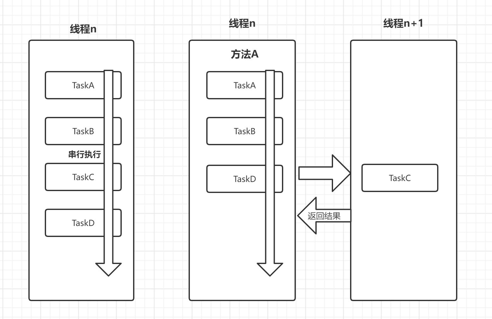

# 【并发编程】Future与FutureTask

FutureTask 叫未来任务，可以将一个复杂的任务剔除出去交给另外一个线程来完成。

## 1 主要方法

### get()

get 方法的行为取决于 Callable 任务的状态，只有以下 5 种情况：

- 任务正常完成：get方法会立刻返回结果
- 任务尚未完成：任务还没有开始或进行中，get将阻塞并直到任务完成。
- 任务执行过程中抛出Exception：get 方法会抛出 ExecutionException，这里抛出异常，是 `call()` 执行时产生的那个异常
- 任务被取消：get 方法会抛出 CancellationException 
- 任务超时：get 方法有一个重写方法，是传入一个延迟时间的，如果时间到了还没有获得结果，get 方法会抛出 TimeoutException

### get(long timeout,TimeUnit unit)

如果 `call()` 在规定时间内完成任务，那么就会正常获取到返回值，而如果在指定时间内没有计算出结果，则会抛出 TimeoutException。

### cancel()

- 如果这个任务还没有开始执行，任务会被正常取消，未来也不会被执行，返回 true
- 如果任务已经完成或已经取消，则 cancel() 方法会执行失败，方法返回false
- 如果这个任务已经开始，这个取消方法将不会直接取消该任务，而是会根据参数 mayInterruptIfRunningg 来做判断。如果是 true,就会发出中断信号给这个任务。

## 2 使用案例

**Future 用法 01 —— **用线程池 `submit` 方法提交任务，返回值 `Future` 任务结果

- 用线程池提交任务，线程池会立即返回一个空的 Future 容器
- 当线程的任务执行完成，线程池会将该任务执行结果填入 Future 中 
- 此时就可以从 Future 获取执行结果

**Future 用法 02 —— **用 `FutureTask` 来封装任务，获取 Future 任务的结果

- 用 FutureTask 包装任务，FutureTask 是 Future 和 Runnable 接口的实现类
- 可以使用new Thread().start()或线程池执行FutureTask
- 任务执行完成，可以从FutureTask中获取执行结果

