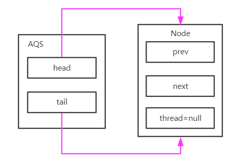
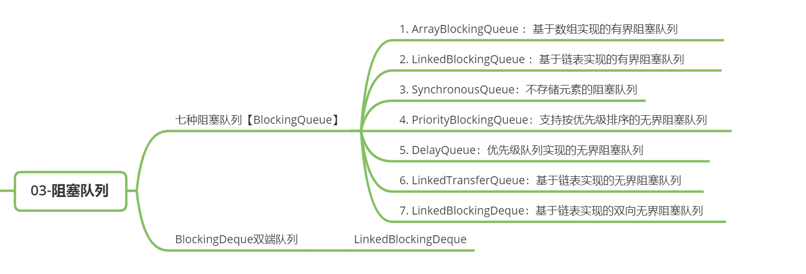

# 【并发编程】JUC

从 JDK1.5 起，Java API  中提供了 `java.util.concurrent`（简称JUC）包，在此包中定义了并发编程中很常用的工具，比如：线程池、阻塞队列、同步器、原子类等等。JUC 是 JSR 166 标准规范的一个实现，JSR166 以及 JUC 包的作者是同一个人 Doug Lea 。 


## 1 Atomic 包

包路径：`java.util.concurrent.atomic`

从JDK 1.5开始提供了 `java.util.concurrent.atomic` 包（以下简称 Atomic 包），这个包中的原子操作类提供了一种 **用法简单、性能高效、线程安全地更新一个变量的方式** 。可以解决 Volatile 原子性操作变量的问题。

因为变量的类型有很多种，所以在 Atomic 包里一共提供了 13 个类，属于 4 种类型的原子更新方式，分别是原子更新基本类型、原子更新数组、原子更新引用和原子更新属性（字段）。**Atomic 包里的类基本都是使用 Unsafe 实现的包装类。**

**Atomic 里的类主要包括：** 

- **基本类型 - 使用原子的方式更新基本类型**
  - AtomicInteger：整形原子类
  - AtomicLong：长整型原子类
  - AtomicBoolean ：布尔型原子类
- **引用类型**
  - AtomicReference：引用类型原子类
  - AtomicStampedReference：原子更新引用类型里的字段原子类
  - AtomicMarkableReference ：原子更新带有标记位的引用类型
- **数组类型 - 使用原子的方式更新数组里的某个元素**
  - AtomicIntegerArray：整形数组原子类
  - AtomicLongArray：长整形数组原子类
  - AtomicReferenceArray ：引用类型数组原子类
- **对象的属性修改类型**
  - AtomicIntegerFieldUpdater:原子更新整形字段的更新器
  - AtomicLongFieldUpdater：原子更新长整形字段的更新器
  - AtomicReferenceFieldUpdater ：原子更新引用类形字段的更新器
- JDK1.8 新增类
  - DoubleAdder：双浮点型原子类
  - LongAdder：长整型原子类
  - DoubleAccumulator：类似DoubleAdder，但要更加灵活(要传入一个函数式接口)
  - LongAccumulator：类似LongAdder，但要更加灵活(要传入一个函数式接口)

常用 API：


## 2 CAS（compare and swap）

CAS 即 **Compare And Swap（比较再替换）** ，同步组件中大量使用 CAS 技术实现了 Java 多线程的并发操作。整个 AQS、Atomic 原子类底层操作，都可以看见 CAS。甚至 `ConcurrentHashMap` 在 1.8 的版本中也调整为了 `CAS + Synchronized` 。可以说 CAS 是整个 JUC 的基石。


CAS 只是一个方法而已，这个方法长这样：**`执行函数：CAS(V,E,N)`**

- V：要读写的内存地址
- E：进行比较的值 （预期值）
- N：拟写入的新值
- 当且仅当 **内存地址的V** 中的值等于 **预期值E** 时，将 **内存地址的V** 中的值改为 **新值N** ，否则会进行自旋操作，即不断的重试。

**CAS 本质是一条 CPU 的原子指令，可以保证共享变量修改的原子性。**

### 2.1 CAS的实现：Unsafe

Java 不能像 C/C++ 那样直接操作内存区域，需要通过 **本地方法（native 方法）**来访问。**Java 中的 CAS 操作都是通过 sun 包下 `Unsafe` 类实现** ，而 `Unsafe` 类中的方法都是 native 方法。

`Unsafe` 类，全限定名是 `sun.misc.Unsafe` ，位于在 `sun.misc` 包下，不属于Java 标准API。

```java
/**
 * Atomically update Java variable to x if it is currently holding expected. 
 * @return true if successful 
 */ 
public final native boolean compareAndSwapInt(Object o, long offset, int expected, int x); 

/**
 * Atomically update Java variable to x if it is currently holding expected. 
 * @return true if successful 
 */ 
public final native boolean compareAndSwapObject(Object o, long offset,Object expected,Object x); 

/**
 * Atomically update Java variable to x if it is currently holding expected. 
 * @return true if successful 
 */ 
public final native boolean compareAndSwapLong(Object o, long offset, long expected, long x);
```

### 2.2 CAS的缺陷

CAS虽然高效地解决了原子操作，但是还是存在一些缺陷的，主要表现在三个地方：**循环时间太长、只能保证一个共享变量原子操作、ABA** 问题。

- **循环时间太长**：如果 CAS 一直不成功呢？如果自旋 CAS 长时间地不成功，则会给 CPU 带来非常大的开销。
- **只能保证一个共享变量原子操作：**看了 CAS 的实现就知道这 **只能针对一个共享变量** ，如果是多个共享变量就只能使用锁了。
- **ABA 问题**：CAS 需要检查操作值有没有发生改变，如果没有发生改变则更新。但是存在这样一种情况：**如果一个值原来是A，变成了B，然后又变成了A** ，那么在 CAS 检查的时候会发现没有改变，但是实质上它已经发生了改变，这就是所谓的 ABA 问题。对于 ABA 问题其解决方案是加上 **版本号**，即在每个变量绑定一个版本号，每次改变时加1，即 `A —> B —> A`，变成 `1A —> 2B —> 3A` 。

## 3 Lock

Java 提供了种类丰富的锁，每种锁因其特性的不同，在适当的场景下能够展现出非常高的效率。

JUC 包中提供的锁：

- **ReentrantLock 重入锁**，它是一种 **可重入的独享锁** ，具有与使用 synchronized 相同的一些基本行为和语义，但是它的API功能更强大，ReentrantLock 相当于 synchronized 的增强版，具有 synchronized 很多所没有的功能。
- **ReentrantReadWriteLock 读写锁**
  - **synchronized 和 ReentrantLock 都是 同步互斥锁** ，不管是读操作的线程还是写操作的线程，同时只能有一个线程获得锁，也就是在进行写操作的时候，在写线程进行访问的时候，所有的线程都会被阻塞。但是其实，读操作是不需要加锁访问的。互斥锁不区分读写，全部加锁实现起来简单，但是性能会大打折扣。
  - ReentrantReadWriteLock 维护了一对关联锁：ReadLock 和 WriteLock，由词知意，一个读锁一个写锁，合称“读写锁”。一个是 **ReadLock（读锁）**用于读操作的，一个是 **WriteLock（写锁）**用于写操作，这两个锁都实现了 Lock 接口。**读写锁适合于读多写少的场景，基本原则是读锁可以被多个线程同时持有进行访问，而写锁只能被一个线程持有** 。
- **StampedLock 重入读写锁**，JDK1.8 引入的锁类型，是对读写锁 ReentrantReadWriteLock 的增强版 

### 3.1 锁的分类

按 **上锁方式** 划分：

- **隐式锁** ：synchronized
  - synchronized 为 Java 的关键字，是 Java 提供的同步机制，当它用来修饰一个方法或一个代码块时，能够保证在同一时刻最多只能有一个线程执行该代码。当使用 synchronized 修饰代码时，并不需要显式的执行加锁和解锁过程，所以它也被称之为隐式锁。
- **显式锁** ：JUC包中提供的锁
  - JUC 中提供的锁都提供了常用的锁操作，加锁和解锁的方法都是显式的，我们称他们为显式锁。

按 **特性** 划分：

- **乐观锁 / 悲观锁** ：按照线程在使用共享资源时， **要不要锁住同步资源** ，划分为：乐观锁和悲观锁。
  - 悲观锁：比较悲观，总是假设最坏的情况，对于同一个数据的并发操作，**悲观锁认为自己在使用数据的时候一定有别的线程来修改数据，因此在获取数据的时候会先加锁* *，确保数据不会被别的线程修改。
    - JUC 的锁、`synchronized`
  - 乐观锁：比较乐观，总是假设最好的情况，对于同一个数据的并发操作，**乐观锁认为自己在使用数据时不会有别的线程修改数据，所以在获取数据的时候不会添加锁** 。只有在更新数据的时候才会去判断有没有别的线程更新了这个数据，如果这个数据没有被更新，当前线程将自己修改的数据成功写入；如果数据已经被其他线程更新，则会根据不同的情况执行不同的操作（例如：报错或自动重试）
    - CAS 算法，关系型数据库的版本号机制
- **可重入锁 / 不可重入锁** ：按照同一个线程是否可以重复获取同一把锁，划分为：可重入锁和不可重入锁。
  - 重入锁：**一个线程可以重复获取同一把锁**，不会因为之前已经获取了该锁未释放而被阻塞。在获得一个锁之后未释放锁之前，再次获得同一把锁时，只会增加获得锁的次数，当释放锁时，会同时减少锁定次数。可重入锁的一个优点是可一定程度避免死锁。
    - 实现：ReentrantLock、synchronized
  - 非重入锁：不可重入锁，与可重入锁相反，同一线程获得锁之后不可再次获取，重复获取会发生死锁。
- **公平锁 / 非公平锁** ：按照多个线程竞争同一锁时需不需要排队，能不能插队，划分为公平锁和非公平锁。
  - 公平锁：多个线程按照申请锁的顺序来获得锁
  - 非公平锁：多个线程获取锁的顺序并不是按照申请锁的顺序，允许“插队”，有可能后申请的线程比先申请的线程优先获取锁
- **独享锁 / 共享锁**：按照多个线程能不能同时共享同一个锁，锁被划分为独享锁和排他锁。
  - 独享锁（写锁）：独享锁也叫排他锁，是指同一个锁同时只能被一个线程所持有。如果线程 A 对获得了锁 S 后，则其他线程只能阻塞等待线程 A 释放锁 S 后，才能获得锁 S。
    - 实现：synchronized，ReentrantLock
  - 共享锁（读锁）：同一个锁可被多个线程同时持有。如果线程 A 对获得了共享锁S后，则其他线程无需等待可以获得共享锁 S。
    - 实现：ReentrantReadWriteLock 的读锁
  - 在ReentrantReadWriteLock 维护了一对关联锁：ReadLock 和 WriteLock，由词知意，一个读锁一个写锁，合称“读写锁”。ReadLock (读锁) 用于读操作的，WriteLock (写锁) 用于写操作，读锁是共享锁，写锁是独享锁，读锁可保证在读多写少的场景中，提高并发读的性能，增加程序的吞吐量。

### 3.2 Synchronized 和 JUC 的锁对比

`Synchronized` 同步锁提供了一种 **排他式的同步机制** ，当多个线程竞争锁资源时，同时只能有一个线程持有锁，当一个线程获取了锁，其他线程就会被阻塞只有等到占有锁的线程释放锁后，才能重新进行锁竞争。

使用 `synchronized` 同步锁，线程会三种情况下释放锁：

- 线程执行完了同步代码块/方法，释放锁；
- 线程执行时发生异常，此时 JVM 会让线程自动释放锁；
- 在同步代码块/方法中，锁对象执行了 wait 方法，线程释放锁。

因此，`Synchronized` 的缺陷：

- **Synchronized 无法控制阻塞时长，阻塞不可中断**
  - 使用 `Synchronized`，假如占有锁的线程被长时间阻塞（IO、sleep、join），由于线程阻塞时没法释放锁，会导致大量线程堆积，轻则影响性能，重则服务雪崩。
- **读多写少的场景中，多个读线程同时操作共享资源时不需要加锁**
  - Synchronized 不论是读还是写，均需要同步操作，这种做法并不是最优解
  - JUC 提供了读写锁：**ReentrantReadWriteLock**

### 3.3 ReentrantLock源码分析


我们看一下重入锁 ReentrantLock 类关系图，它是实现了 Lock 接口的类。NonfairSync 和 FairSync 都继承自抽象类 Sync，在 ReentrantLock 中有非公平锁 **NonfairSync** 和公平锁 **FairSync** 的实现。


在重入锁 ReentrantLock 类关系图中，我们可以看到 NonfairSync 和 FairSync 都继承自抽象类 Sync，而 Sync 类继承自抽象类 `AbstractQueuedSynchronizer`（简称 **AQS** ）。如果我们看过 JUC 的源代码，会发现不仅重入锁用到了 AQS， JUC 中绝大部分的同步工具也都是基于 AQS 构建的。**AQS是什么作用呢？**

### 3.4 AQS

**AQS（全称AbstractQueuedSynchronizer）即抽象队列同步器** 。它是构建锁或者其他同步组件的基础框架（如ReentrantLock、ReentrantReadWriteLock、Semaphore 等）。AQS 是 JUC 并发包中的核心基础组件，其本身是一个抽象类。

理论上还是利用管程实现的，在 AQS 中，有一个 volatile 修饰的 `state`，获取锁的时候，会读写 `state` 的值，解锁的时候，也会读写 `state` 的值。所以 AQS 就拥有了 volatile 的 happens-before 规则。加锁与解锁的效果上与 synchronized 是相同的。


由类图可以看到，**AQS 是一个 FIFO 的 双向队列** ，其内部通过节点 head 和 tail 记录队首和队尾元素，队列元素的类型为 `Node` 。

> 也就是让线程排队，从而进行同步！

- Node 中的 `thread` 变量用来 **存放进入 AQS 队列里面的线程** ，Node 节点内部：
  - prev 记录当前节点的前驱节点
  - next 记录当前节点的后继节点
- **SHARED** 用来标记 该线程是获取 **共享资源** 时被阻塞挂起后放入 AQS 队列的
- **EXCLUSIVE** 用来标记线程是获取 **独占资源** 时被挂起后放入 AQS 队列的
- **waitStatus** 记录当前线程等待状态，可以为：
  - CANCELLED （线程被取消了）
  - SIGNAL（线程需要被唤醒）
  - CONDITION（线程在 CONDITION 条件队列里面等待）
  - PROPAGATE（释放共享资源时需要通知其他节点）

在 AQS 中维持了一个单一的状态信息 `state` ，对于 ReentrantLock 的实现来说，`state` 可以 **用来表示当前线程获取锁的可重入次数** 。AQS 继承自 `AbstractOwnableSynchronizer`，其中的 `exclusiveOwnerThread` 变量表示 **当前共享资源的持有线程** 。

#### AQS 的实现原理

AQS 是一个同步队列，内部使用一个 FIFO 的双向链表，管理线程同步时的所有被阻塞线程。双向链表这种数据结构，它的每个数据节点中都有两个指针，分别指向直接后继节点和直接前驱节点。所以，从双向链表中的任意一个节点开始，都可以很方便地访问它的前驱节点和后继节点。


AQS 有两个节点 head，tail 分别是头节点和尾节点指针，默认为 null。AQS 中的 **内部静态类 Node** 为链表节点， **AQS 会在线程获取锁失败后，线程会被阻塞并被封装成 Node 加入到 AQS 队列中；当获取锁的线程释放锁后，会从 AQS 队列中的唤醒一个线程（节点）** 。

##### 场景01：线程抢夺锁失败时，AQS 队列的变化

1. AQS 的 head，tail 分别代表同步队列头节点和尾节点指针，默认为 null。 


2. 当第一个线程抢夺锁失败，同步队列会先初始化，随后线程会被封装成 Node 节点追加到 AQS 队列中。

   - 假设当前独占锁的的线程为 ThreadA，抢占锁失败的线程为 ThreadB

   - 同步队列初始化，首先会在队列中添加一个空 Node，这个节点中的 `thread=null` ，**代表当前获取锁成功的线程** 。随后，AQS 的 head 和 tail 会同时指向这个节点。

     

   - 接下来将 ThreadB 封装成 Node 节点，追加到 AQS 队列。设置新节点的 prev 指向 AQS 队尾节点；将队尾节点的 next 指向新节点；最后将 AQS 尾节点指针指向新节点。

     

3. 当下一个线程抢夺锁失败时，重复上面步骤即可。将线程封装成 Node，追加到 AQS 队列。假设此次抢占锁失败的线程为 ThreadC。

   

##### 场景02：线程被唤醒时，AQS 队列的变化

1. ReentrantLock 唤醒阻塞线程时，会按照 **FIFO 的原则从 AQS 中 head 头部开始唤醒首个节点中线程** 。
2. head 节点表示当前获取锁成功的线程 ThreadA 节点。
3. 当 ThreadA 释放锁时，它会唤醒后继节点线程 ThreadB，ThreadB 开始尝试获得锁，如果 ThreadB 获得锁成功，会将自己设置为 AQS 的头节点。
   - head 指针指向 ThreadB 节点
   - 将原来头节点的 next 指向 Null，从 AQS 中删除
   - 将 ThreadB 节点的 prev 指向 Null ，设置节点的 `thread=null` 。


### 3.5 ReentrantLock 源码分析：锁的获取

AQS 其实使用了一种典型的设计模式：**模板方法** 。

查看 AQS 的源码可以看到，AQS 为一个抽象类，AQS 中大多数方法都是 `final` 或 `private` 的，也就是说 **AQS 并不希望用户覆盖或直接使用这些方法，而是只能重写 AQS 规定的部分方法** 。

```java
public static void main(String[] args) {
  	// 创建一个 ReentrantLock 的公平锁
    Lock lock = new ReentrantLock(true);
    lock.lock();
    try {
        // 业务代码
    } finally {
        lock.unlock();
    }
}
```

获取锁时源码的调用过程，时序图如下：


（1）第一步：**ReentrantLock.lock()**

ReentrantLock 获取锁调用了 lock 方法，内部调用了`sync.lock()`：

```java
// ReentrantLock.java

public void lock() {
    sync.lock();
}
```

sync 是 `Sync` 类的一个实例，Sync 类实际上是 ReentrantLock 的 **抽象静态内部类**，它集成了 AQS 来实现重入锁的具体业务逻辑。AQS 是一个同步队列，实现了线程的阻塞和唤醒，没有实现具体的业务功能。在不同的同步场景中，需要用户继承 AQS 来实现对应的功能。

`Sync` 有两个实现类公平锁 `FairSync` 和非公平锁 `NoFairSync` 。

重入锁实例化时，根据参数 `fair` 为属性 `sync` 创建对应锁的实例。以公平锁为例，调用 `sync.lock` 事实上调用的是 `FairSync` 的 `lock` 方法。

```java
public ReentrantLock(boolean fair) {
    sync = fair ? new FairSync() : new NonfairSync();
}
```

（2）第二步：**FairSync.lock()**

该方法的内部，执行了方法 `acquire(1)`， acquire 为 AQS 中的 final 方法，**用于竞争锁**。

```java
final void lock() { 
  acquire(1); 
}
```

（3）第三步：**AQS.acquire(1)**

线程进入 AQS 中的 acquire 方法，arg=1 。这个方法逻辑：**先尝试抢占锁，抢占成功，直接返回；抢占失败，将线程封装成 Node 节点追加到 AQS 队列中并使线程阻塞等待** 。

- 首先会执行 `tryAcquire(1)` 尝试抢占锁，成功返回 true，失败返回 false。抢占成功了，就不会继续执行
- 抢占锁失败后，执行 `addWaiter(Node.EXCLUSIVE)` 将 x 线程封装成 `Node` 节点追加到 AQS 队列
- 然后调用 `acquireQueued` 将线程阻塞，线程阻塞

线程阻塞后，接下来就只需等待其他线程唤醒它，线程被唤醒后会重新竞争锁的使用。

```java
// AQS 获取锁的核心方法
public final void acquire(int arg) { 
  if (!tryAcquire(arg) && 	// 第一步：尝试获取锁
      acquireQueued(addWaiter(Node.EXCLUSIVE), arg)) 
    	// 第二步：如果获取失败，那么：
    		// 2.1 线程封装成 Node 节点追加到 AQS 队列
    		// 2.2 调用 acquireQueued 将线程阻塞
    
    // 自我中断
    selfInterrupt(); 
}
```

（4）第四步：**FairSync.tryAcquire(1)**

尝试获取锁：若获取锁成功，返回 true；获取锁失败，返回 false。

这个方法逻辑：**获取当前的锁状态，如果为无锁状态，当前线程会执行 CAS 操作尝试获取锁；若当前线程是重入获取锁，只需增加锁的重入次数即可** 。

```java
// 尝试以独占模式获取锁 
// 若锁是未锁定状态 state=0，CAS 修改 state=1，
// 修改成功说明当前线程获取锁成功，设置当前线程 为锁持有者，然后返回 true。 
protected final boolean tryAcquire(int acquires) { 
  final Thread current = Thread.currentThread(); 
  int c = getState(); //状态：0未锁定，大于0已被其他线程独占。 
  
  if (c == 0) {//未锁定，可以获取锁 
    if (!hasQueuedPredecessors() && compareAndSetState(0, acquires)) {
      //CAS 设置 state 为 1 
      setExclusiveOwnerThread(current); //设置当前线程为独占资源持有者 
      return true; 
    } 
  }
  
  //如果当前线程已经是为锁持有者，设置重入次数，state + 1 
  else if (current == getExclusiveOwnerThread()) { 
    int nextc = c + acquires;//设置重入次数+1 
    //重入次数，超过int最大值，溢出。 
    if (nextc < 0) 
      throw new Error("Maximum lock count exceeded"); 
    setState(nextc); //设置重入次数 
    return true; 
  }
  return false; 
}
```

（5）第五步：**AQS.addWaiter(Node.EXCLUSIVE)**

线程抢占锁失败后，执行 `addWaiter(Node.EXCLUSIVE)` 将线程封装成 `Node` 节点追加到 AQS 队列。

`addWaiter(Node mode)` 的 mode 表示节点的类型，`Node.EXCLUSIVE` 表示是 **独占排他锁**，也就是说重入锁是独占锁，用到了 AQS 的独占模式。

Node 定义了两种节点类型：

- 共享模式：`Node.SHARED`。共享锁，可以被多个线程同时持有，如读写锁的读锁。
- 独占模式：`Node.EXCLUSIVE`。独占很好理解，是自己独占资源，独占排他锁同时只能由一个线程持有。

```java
static final Node SHARED = new Node();	//共享模式 
static final Node EXCLUSIVE = null;			//独占模式
```

相应的AQS支持两种模式：支持独占模式和共享模式。

```java
/*
 * 模式有两种：共享模式和独占模式 
 */ 
private Node addWaiter(Node mode) {
  
  // 当前线程封装为Node准备排队获取锁 
  Node node = new Node(Thread.currentThread(), mode); 
  
  // 先尝试快速插入同步队列。如果失败，再使用完整的排队策略。 
  Node pred = tail; 
  if (pred != null) {
    // 如果双向链表不为空链表（有节点），追加节点到尾部 
    node.prev = pred; 
    if (compareAndSetTail(pred, node)) { 
      pred.next = node; 
      return node; 
    } 
  }
  enq(node);// 链表为空，将节点追加到同步队列队尾 
  return node; 
}

// 通过自旋插入节点到同步队列AQS中，如果队列为空时，需先初始化队列。 
private Node enq(final Node node) { 
  for (;;) {
    // 自旋，至少会有两次循环。 
    Node t = tail; 
    if (t == null) { 
      // 队列为空，先初始化队列 
      if (compareAndSetHead(new Node()))
        // CAS插入节点 
        tail = head; 
    } else {
      // 插入节点，追加节点到尾部 
      node.prev = t; 
      if (compareAndSetTail(t, node)) {
        // CAS插入节点 
        t.next = node; 
        return t; 
      } 
    } 
  } 
}
```

第六步：**AQS.acquireQueued(newNode,1)**

这个方法的主要作用就是将线程阻塞。

- 若同步队列中，若当前节点为队列第一个线程，则有资格竞争锁，再次尝试获得锁。尝试获得锁成功，移除链表 head 节点，并将当前线程节点设置为 head 节点。尝试获得锁失败，判断是否需要阻塞当前线程。
-  若发生异常，取消当前线程获得锁的资格。

```java
final boolean acquireQueued(final Node node, int arg) { 
  boolean failed = true;//获取锁是否失败，一般是发生异常 
  try {
    boolean interrupted = false;// 是否中断 
    for (;;) {
      // 无限循环，线程获得锁或者线程被阻塞 
      final Node p = node.predecessor();// 获取此节点的前一个节点 
      // 若此节点的前个节点为头节点，说明当前线程可以获取锁，阻塞前尝试获取锁，
      // 若获取锁成功，将当前线程从同步队列中删除。 
      if (p == head && tryAcquire(arg)) {// 获取锁成功
        /**
          * 将当前线程从同步队列中删除。 
          * 将当前节点置为空节点，节点的prev，next和thread都为null。 
          * 将等待列表头节点指向当前节点 
          */
        setHead(node); 
        p.next = null; // help GC 
        failed = false; 
        return interrupted; 
      }
      
      if (shouldParkAfterFailedAcquire(p, node) 
          && parkAndCheckInterrupt()) 
        interrupted = true;//当前线程被中断 
    } 
  } finally { 
    //如果出现异常，取消线程获取锁请求 
    if (failed) 
      cancelAcquire(node); 
  } 
}

private void setHead(Node node) { 
  head = node; 
  node.thread = null; 
  node.prev = null; 
}
```

### 3.6 ReentrantLock 源码分析：锁的释放


（1）第一步：**ReentrantLock.unlock()**

释放锁时，需调用 ReentrantLock 的 unlock 方法。这个方法内部，会调用 `sync.release(1)` ，release 方法为 AQS 类的 final 方法。

```java
public void unlock() {
    sync.release(1);
}
```

（2）第二步：**AQS.release(1)**

首先执行方法 `tryRelease(1)` ，tryRelease 方法为 ReentrantLock 中 Sync 类的 final 方法，用于释放锁。

```java
public final boolean release(int arg) { 
  if (tryRelease(arg)) {
    // 释放锁。若释放后锁状态为无锁状态，需唤醒后继线程 
    Node h = head; // 同步队列头节点 
    if (h != null && h.waitStatus != 0)
      // 若head不为null, 说明链表中有节点。其状态不为0，唤醒后继线程。
      unparkSuccessor(h);
    return true;
  }
  return false;
}
```

（3）第三步：**Sync.tryRelease(1)**

- 判断当前线程是否为锁持有者，若不是持有者，不能释放锁，直接抛出异常。
- 若当前线程是锁的持有者，将重入次数减1，并判断当前线程是否完全释放了锁。
  - 若重入次数为 0，则当前新线程完全释放了锁，将锁拥有线程设置为null，并 **将锁状态置为无锁状态** `(state=0)`，返回 true。
  - 若重入次数 >0 ，则当前新线程仍然持有锁，设置 `重入次数=重入次数-1`，返回 false。 
- 返回 true 说明，当前锁被释放，需要唤醒同步队列中的一个线程，执行 `unparkSuccessor` 唤醒同步队列中节点线程。

```java
/**
 * 释放锁返回值：true释放成功；false释放失败 
 */ 
protected final boolean tryRelease(int releases) { 
  int c = getState() - releases;// 重入次数减去1 
  
  //如果当前线程不是锁的独占线程，抛出异常 
  if (Thread.currentThread() != getExclusiveOwnerThread()) 
    throw new IllegalMonitorStateException(); 
  
  boolean free = false; 
  if (c == 0) { 
    // 如果线程将锁完全释放，将锁初始化未无锁状态 
    free = true; 
    setExclusiveOwnerThread(null); 
  }
  setState(c);// 修改锁重入次数 
  return free; 
}
```

### 3.7 ReentrantLock 源码分析：公平与非公平

**非公平锁与非公平锁获取锁的差异**

- 在公平锁中，线程获得锁的顺序按照请求锁的顺序，按照 **先来后到** 的规则获取锁。如果线程竞争公平锁失败后，都会到AQS同步队列队尾排队，将自己阻塞等待锁的使用资格，锁被释放后，会从队首开始查找可以获得锁的线程并唤醒。
- 非公平锁，允许新线程请求锁时，可以 **插队**，新线程先尝试获取锁，如果获取锁失败，才会AQS同步队列队尾排队。

#### 第一次插队

- `FairSync.lock` ：公平锁获取锁

  ```java
  final void lock() { 
    acquire(1); 
  }
  ```

- `NoFairSync.lock` ：非公平锁获取锁

  - lock 方法中新线程会先通过 CAS 操作 `compareAndSetState(0, 1)`，尝试获得锁

  ```java
  final void lock() { 
    if (compareAndSetState(0, 1))// 新线程，第一次插队 
      setExclusiveOwnerThread(Thread.currentThread()); 
    else
      acquire(1); 
  }
  ```

lock 方法中的 acquire 为 AQS 的 final 方法，公平锁和非公平锁，执行代码没有差别。差别之处在于公平锁和非公平锁对 `tryAcquire` 方法的实现。

#### 第二次插队

`FairSync.tryAcquire` ：公平锁获取锁，若锁为无锁状态时，本着公平原则，新线程在尝试获得锁前，需先判断 AQS 同步队列中是否有线程在等待。若有线程在等待，当前线程只能进入同步队列等待。若 AQS 同步无线程等待，则通过 CAS 抢占锁。

```java
protected final boolean tryAcquire(int acquires) { 
  final Thread current = Thread.currentThread(); 
  int c = getState();
  
  if (c == 0) {//未锁定，可以获取锁 
    // 公平锁，先判断同步队列中是否有线程在等待 hasQueuedPredecessors
    if (!hasQueuedPredecessors() && compareAndSetState(0, acquires)) {
      setExclusiveOwnerThread(current);
      return true; 
    } 
  }
  
  else if (current == getExclusiveOwnerThread()) { 
    int nextc = c + acquires;
    if (nextc < 0) 
      throw new Error("Maximum lock count exceeded"); 
    setState(nextc);
    return true; 
  }
  return false; 
}
```

而非公平锁，不管AQS是否有线程在等待，则都会先通过 CAS 抢占锁。

`NoFairSync.tryAcquire` 和 `NoFairSync.nonfairTryAcquire` ：

```java
protected final boolean tryAcquire(int acquires) { 
  return nonfairTryAcquire(acquires); 
}

final boolean nonfairTryAcquire(int acquires) { 
  final Thread current = Thread.currentThread(); 
  int c = getState(); 
  if (c == 0) { 
    // 非公平锁，入队前，二次插队 
    if (compareAndSetState(0, acquires)) { 
      setExclusiveOwnerThread(current); 
      return true; 
    } 
  } else if (current == getExclusiveOwnerThread()) { 
    int nextc = c + acquires; 
    if (nextc < 0) 
      throw new Error("Maximum lock count exceeded"); 
    setState(nextc);
    return true; 
  }
  return false; 
}
```

### 3.8 读写锁 ReentrantReadWriteLock

可重入锁 ReentrantLock 是互斥锁，**互斥锁在同一时刻仅有一个线程可以进行访问**，但是在大多数场景下，大部分时间都是提供读服务，而写服务占有的时间较少。然而读服务不存在数据竞争问题，如果一个线程在读时禁止其他线程读势必会导致性能降低，所以就出现了读写锁。

**读写锁维护着一对锁，一个读锁和一个写锁。** 通过分离读锁和写锁，使得并发性比一般的互斥锁有了较大的提升：在同一时间可以允许多个读线程同时访问，但是在写线程访问时，所有读线程和写线程都会被阻塞。

**读写锁的主要特性：**

- **公平性：** 支持公平性和非公平性。
- **重入性：** 支持重入。读写锁最多支持 65535 个递归写入锁和 65535个 递归读取锁。
- **锁降级：** 写锁能够降级成为读锁，但读锁不能升级为写锁。遵循获取写锁、获取读锁在释放写锁的次序

读写锁 `ReentrantReadWriteLock` 实现接口 `ReadWriteLock` ，该接口维护了一对相关的锁，一个用于只读操作，另一个用于写入操作。只要没有 writer，读取锁可以由多个 reader 线程同时保持。写入锁是独占的。

```java
public interface ReadWriteLock { 
  Lock readLock(); 
  Lock writeLock(); 
}
```

`ReadWriteLock` 定义了两个方法。`readLock()` 返回用于读操作的锁，`writeLock()` 返回用于写操作的锁。`ReentrantReadWriteLock` 定义如下：

```java
/** 内部类 读锁 */ 
private final ReentrantReadWriteLock.ReadLock readerLock; 
/** 内部类 写锁 */ 
private final ReentrantReadWriteLock.WriteLock writerLock; 

final Sync sync; 

/** 使用默认（非公平）的排序属性创建一个新的 ReentrantReadWriteLock */ 
public ReentrantReadWriteLock() { 
  this(false); 
}

/** 使用给定的公平策略创建一个新的 ReentrantReadWriteLock */ 
public ReentrantReadWriteLock(boolean fair) { 
  sync = fair ? new FairSync() : new NonfairSync();
  readerLock = new ReadLock(this); 
  writerLock = new WriteLock(this); 
}

/** 返回用于写入操作的锁 */ 
public ReentrantReadWriteLock.WriteLock writeLock() { 
  return writerLock; 
} 

/** 返回用于读取操作的锁 */ 
public ReentrantReadWriteLock.ReadLock readLock() { 
  return readerLock; 
} 

abstract static class Sync extends AbstractQueuedSynchronizer { 
  //省略其余源代码 
}

public static class WriteLock implements Lock, java.io.Serializable{ 
  //省略其余源代码 
}

public static class ReadLock implements Lock, java.io.Serializable { 
  //省略其余源代码 
}
```

ReentrantReadWriteLock 与 ReentrantLock 一样，其锁主体依然是 `Sync`，它的读锁、写锁都是依靠 `Sync` 来实现的。所以 `ReentrantReadWriteLock` 实际上只有一个锁，只是在获取读取锁和写入锁的方式上不一样而已，它的读写锁其实就是两个类：ReadLock、writeLock，这两个类都是 `Lock` 的实现。

### 3.9 锁优化

（1）**减少锁的持有时间**


（2）**减少锁粒度**

- 将大对象拆分成小对象，增加并行度，降低锁竞争。
- `ConcurrentHashMap` 允许多个线程同时进入。

（3）**锁分离**

- 根据功能进行锁分离
- ReadWriteLock在读多写少时，可以提高性能。

（4）**锁消除**

- 锁消除是发生在 **编译器级别** 的一种锁优化方式。
- 有时候我们写的代码完全不需要加锁，却执行了加锁操作。

（5）**锁粗化**

通常情况下，为了保证多线程间的有效并发，会要求每个线程持有锁的时间尽可能短，但是在某些情况下，一个程序对同一个锁不间断、高频地请求、同步与释放，会消耗掉一定的系统资源，因为锁的请求、同步与释放本身会带来性能损耗，这样高频的锁请求就反而不利于系统性能的优化了，虽然单次同步操作的时间可能很短。

锁粗化就是告诉我们任何事情都有个度，有些情况下我们反而希望把很 **多次锁的请求合并成一个请求**，以降低短时间内大量锁请求、同步、释放带来的性能损耗。


## 4 线程协作工具类

**线程协作工具类，**控制线程协作的工具类，帮助程序员让线程之间的协作变得更加简单。


### 4.1 CountDownLatch 计数门闩

倒数结束之前，一直处于等待状态，直到数到 0 结束，此线程才继续工作。

场景：购物拼团，大巴人满发车，**分布式锁** 

主要方法：

- 构造函数：`CountDownLatch(int count)`：只有一个构造函数，参数 count 为需要倒数的数值。
- `await()` ：当一个或多个线程调用 `await()` 时，这些线程会阻塞。
- `countDown()`：其他线程调用 `countDown()` 会将计数器减1，调用 `countDown` 方法的线程不会阻塞。当计数器的值变为0时，因 `await` 方法阻塞的线程会被唤醒，继续执行。

### 4.2 Semaphore 信号量

**Semaphore 用来 限制 或 管理数量有限 资源的使用情况**。信号量的作用就是维护一个”许可证”的计数，线程可以”获取”许可证，那信号量剩余的许可证就减少一个，线程也可以”释放”一个许可证，那信号量剩余的许可证就可以加一个。当信号量拥有的许可证数为 0 时，下一个还要要获取许可证的线程就需要等待，直到有另外的线程释放了许可证。

场景：Hystrix、**Sentinel 限流**

主要方法：

- 构造函数：`Semaphore(int permits,Boolean fair)` ：可以设置是否使用公平策略，如果传入true,则Semaphore会把之前等待的线程放到FIFO队列里，以便有了新许可证可以分给之前等待时间最长的线程。
- `acquire()` ：获取许可证，当一个线程调用 acquire 操作时，他要么通过成功获取信号量（信号量减 1），要么一直等待下去，直到有线程释放信号量，或超时。
- `release()` ：释放许可证，会将信号量加1，然后唤醒等待的线程。

### 4.3 CyclicBarrier 循环栅栏

CyclicBarrier：**线程会等待，直到线程到了事先规定的数目，然后触发执行条件进行下一步动作** 。

当有大量线程互相配合，分别计算不同任务，并且需要 **最后统一汇总** 时，就可以用 CyclicBarrier，它可以构造一个集结点，当某一个线程执行完，它就会到集结点等待，直到所有线程都到集结点，则该栅栏就被撤销，所有线程统一出再，继续执行剩下的任务。

主要方法：

- 构造函数：`CyclicBarrier(int parties, Runnable barrierAction)` ，设置聚集的线程数量和集齐线程数的结果之后要执行的动作。
- `await()` ：阻塞当前线程，待凑齐线程数量之后继续执行

**CyclicBarrier 和 CountDownLatch 区别：** 

- 作用不同：CyclicBarrier 要等 **固定数量的线程** 都到达了栅栏位置才能继续执行，而 CountDownLatch 只需要等待数字到 0，也就是说，**CountDownLatch 用于事件，而CyclicBarrier 用于线程** 。
- 可重用性不同：CountDownLatch 在倒数到 0 并触发门闩打开后，就不能再次使用，而 CyclicBarrier 可以重复使用。

### 4.4  Condition 条件对象

当线程1需要等待某个条件时就去执行 `condition.await()` 方法，一旦执行 `await()` 方法，线程就会进入阻塞状态。通常会有另一个线程2去执行对应条件，直到这个条件达成时，线程2就会执行 `condition.signal()` 方法，此时 JVM 就会从被阻塞的线程里找到那些等待该 condition 的线程，当线程1收到可执行信号时，它的线程状态就会变成 Runnable 可执行状态。

- `signalAll()` 会唤起所有正在等待的线程。
- `signal()` 是公平的，只会唤起那个等待时间最长的线程。

注意点：

- Condition 用来代替 `Object.wait/notify` 两者用法一样
- Condition 的 `await()` 会自动释放持有的 Lock 锁这点也和 `Object.wait` 一样
- 调用 `await` 时必须持有锁，否则会抛出异常

## 5 并发容器

在 JUC 包中，有一大部分是关于并发容器的，如 `ConcurrentHashMap` ，`ConcurrentSkipListMap` ，`CopyOnWriteArrayList` 及 阻塞队列。


**同步容器：**

Java 中的集合主要分为四大类：`List`、`Map`、`Set` 和 `Queue` ，但是并不是所有集合都是线程安全的。比如，我们经常使用的 ArrayList，HashMap，HashSet 就不是线程安全的。早期的 JDK1.0 中的就提供了线程安全的集合，包括 Vector，Stack 和 Hashtable。

此外还有在 JDK1.2 中增加的 Collections 中内部 `SynchronizedXxx` 类，它们也是线程安全的集合，可以由对应 `Collections.synchronizedXxx` 工厂方法创建。这些类实现线程安全的方式都是一样的：都是基于 `synchronized` 这个同步关键字实现的，对每个公有方法都进行了同步，**保证每次只有一个线程能访问集合，所以它们被称为 线程安全 的集合（同步容器）**。

**并发容器：**

在 JDK1.5 之前，JDK 提供的线程安全的类都是同步集合容器。**同步容器都是线程安全的，但是所有线程对容器只能串行访问，性能很差** 。在 JDK1.5 之后引入的 JUC 并发包，提供的更多类型的并发容器，在性能上做了很多改进优化，可以用来替代同步容器。**它们都是针对多线程并发访问来进行设计的，我们称它们为并发容器** 。

并发容器依然可以归属到我们提到的四大类：List、Map、Set 和 Queue。

### 5.1 ConcurrentHashMap

#### JDK1.7 结构图

Java7 中的 ConcurrentHashMap 最外层是多个 segment，每个 segment 的底层数据结构与 HashMap 类似，仍然是数组和链表组成。

每个 segment 独立上 ReentrantLock 锁，每个 segment 之间互不影响，提高并发效率。

默认有 16 个 segment，最多可以同时支持 **16 个线程并发写（操作分别分布在不同的Segment上）**。这个默认值可以在初始化时设置，**但一旦初始化以后，就不可以再扩容了** 。


#### JDK1.8 结构图

ConcurrentHashMap 是一个存储  key/value 对的容器，并且是线程安全的。

- 改进一： 取消 segments 字段，直接采用 `transient volatile HashEntry<K,V>[] table` 保存数据，采用 **table 数组元素作为锁**，从而实现了对每一行数据进行加锁，进一步减少并发冲突的概率。
- 改进二： 将原先 table 数组＋单向链表的数据结构，变更为 **table 数组＋单向链表＋红黑树** 的结构。查询更快


这是经典的数组加链表的形式。 并且在链表长度过长时转化为红黑树存储（ Java 8 的优化） ， 加快查找速度。

### 5.2 CopyOnWriteArrayList

**CopyOnWrite 思想** ：是平时查询的时候，都不需要加锁，随便访问，只有在更新的时候，才会从原来的数据复制一个副本出来，然后修改这个副本，最后把原数据替换成当前的副本。修改操作的同时，读操作不会被阻塞，而是继续读取旧的数据。这点要跟读写锁区分一下。

> 一句话：**读不加锁、读写不冲突！**

**CopyOnWriteArrayList** 底层数组实现，使用 **复制副本** 进行有锁写操作，适合读多写少，允许短暂的数据不一致的场景。

**优点：**

- **对于一些读多写少的数据，写入时复制的做法就很不错**，例如：配置、黑名单、物流地址等变化非常少的数据，这是一种无锁的实现。可以帮我们实现程序更高的并发。
- CopyOnWriteArrayList 并发安全且性能比 Vector 好。Vector 是增删改查方法都加了synchronized 来保证同步，但是每个方法执行的时候都要去获得锁，性能就会大大下降，而CopyOnWriteArrayList 只是在增删改上加锁，但是读不加锁，在读方面的性能就好于 Vector。

**缺点：**

- 数据一致性问题。这种实现 **只是保证数据的最终一致性**，在添加到拷贝数据而还没进行替换的时候，读到的仍然是旧数据。
- 内存占用问题。如果对象比较大，频繁地进行替换会消耗内存，从而引发 Java 的 GC 问题，这个时候，我们应该考虑其他的容器，例如 ConcurrentHashMap

### 5.3 并发队列

通过队列可以很容易的实现数据共享，并且 **解决上下游处理速度不匹配** 的问题，典型的**生产者消费者模式** 。


JUC提供了7种适合与不同应用场景的阻塞队列：



阻塞队列的一端是给生产者放数据用，另一端给消费者拿数据用。阻塞队列是线程安全的，所以生产者和消费者都可以是多线程的。

- `take()` 方法获取并移除队列的头结点，一旦执行 `take` 时，队列里无数据则阻塞，直到队列里有数据。
- `put()` 方法是插入元素，但是如何队列已满，则无法继续插入，则阻塞，直到队列中有空闲空间。
- 是否有界（容量多大），这是非常重要的属性，无界队列 `Integer.MAX_VALUE` ，认为是无限容量。