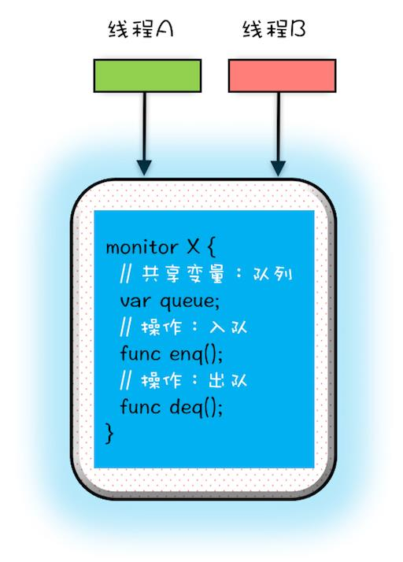

# 【并发编程】Synchronized

> Synchronized 是 JVM 级别的锁，基于 Monitor 机制实现，依赖于底层的互斥量 Mutex 机制，表面上是一个重量级锁，但在 JDK1.6 对其进行改进，引入了锁升级的机制，使其性能增强。

一般情况下，`synchronized` 称为 **重量级锁**。主要原因是因为 JDK1.6 之前，`synchronized` 相比于 `JUC` 的锁显得非常笨重，存在性能问题。JDK1.6 及之后，Java 对 `synchronized` 进行的了一系列优化，性能与 JUC 的锁不相上下。

**`synchronized` 保证方法或者代码块在运行时，同一时刻只有一个线程执行代码块** ，还可以保证共享变量的内存可见性，也可以保证修饰的代码块重排序也不会影响其执行结果。

一句话：`synchronized` 可以保证并发程序的 **原子性，可见性，有序性** 。

**可以修饰方法（静态和非静态）和代码块：**

- 同步代码块的锁：当前对象，字节码对象，其他对象
- 非静态同步方法：锁当前对象
- 静态同步方法：锁是当前类的 Class 对象

## 1 如何保证可见性？

JMM 对于 `Synchronized` 的规定：

- **解锁前：** 必须把自己本地内存中共享变量的最新值刷到主内存
- **加锁时：** 清空本地内存中的共享变量，从主内存中读取共享变量最新的值

`synchronized` 实现可见性的过程：

1. 获得互斥锁（同步获取锁）
2. 清空本地内存

3. 从主内存拷贝变量的最新副本到本地内存

4. 执行代码

5. 将更改后的共享变量的值刷新到主内存

6. 释放互斥锁

## 2 同步原理

同步操作主要是 `monitorenter` 和 `monitorexit` 这两个 JVM 指令实现的，先写一段简单的代码：

```java
public class Demo05Synchronized { 
  
  public synchronized void increase(){ 
    System.out.println("synchronized 方法"); 
  }
  
  public void syncBlock(){ 
    synchronized (this){ 
      System.out.println("synchronized 块"); 
    } 
  } 
}
```

在 cmd 命令行执行 `javac` 编译和 `javap -c ***.class` 生成 `class` 文件对应的字节码指令

```
javac Demo05Synchronized.java 
javap -c Demo05Synchronized.class
```

从结果可以看出，同步代码块使用的是 `monitorenter` 和 `monitorexit` 这两个 JVM 指令：

```java
//同步方法 
public synchronized void increase(); 
	flags: ACC_PUBLIC, ACC_SYNCHRONIZED //ACC_SYNCHRONIZED标记 
  Code: 
		stack=2, locals=1, args_size=1 
  		0: getstatic 			#2 // Field java/lang/System.out:Ljava/io/PrintStream; 
      3: ldc 						#3 // String synchronized 方法 
      5: invokevirtual 	#4 // Method java/io/PrintStream.println: (Ljava/lang/String;)V 
      8: return

//同步块 
public void syncBlock();
	flags: ACC_PUBLIC 
  Code: stack=2, locals=3, args_size=1 
  	0: aload_0 
    1: dup
    2: astore_1 
    3: monitorenter 		//monitorenter指令进入同步块 
    4: getstatic 			#2 // Field java/lang/System.out:Ljava/io/PrintStream; 
    7: ldc 						#5 // String synchronized 块 
    9: invokevirtual 	#4 // Method java/io/PrintStream.println: (Ljava/lang/String;)V 
    12: aload_1 
    13: monitorexit //monitorexit指令退出同步块 
    14: goto 22	
    17: astore_2 
    18: aload_1 
    19: monitorexit //monitorexit指令退出同步块 
    20: aload_2 
    21: athrow 
    22: return
```

从上述字节码指令看的到，**同步代码块** 和 **同步方法** 的字节码是不同的：

- 对于 `Synchronized` 方法，对应 `ACC_SYNCHRONIZED` 关键字，JVM 进行方法调用时，发现调用的方法被 `ACC_SYNCHRONIZED` 修饰，则会先尝试获得锁，方法调用结束了释放锁。
- 对于 `Synchronized`同步块，对应的 `monitorenter` 和 `monitorexit` 指令分别对应 `synchronized` 同步块的进入和退出。
  - **为什么会多一个 monitorexit ？** 编译器会为同步块添加一个隐式的 `try-finally` ，在 `finally` 中会调用 `monitorexit` 命令释放锁

在 JVM 底层，对于这两种 `synchronized` 的实现大致相同。都是 **基于 `monitorenter` 和 `monitorexit` 指令** 实现，底层还是使用 **标记字段 MarkWord** 和 **Monitor（管程）**来实现重量级锁。

## 3 管程 Monitor

**Monitor** 意译为管程，直译为监视器。所谓管程，就是 **管** 理共享变量及对共享变量操作的过 **程** 。让这个过程可以并发执行。

- Java 中的 **所有对象都可以作为锁，每个对象都与一个 monitor 相关联** ，线程可以对 monitor 执行 `lock` 和 `unlock` 操作。
- Java 并 **没有** 把 `lock` 和 `unlock` 操作直接开放给用户使用，但是却提供了两个指令来 **隐式地使用** 这两个操作：`moniterenter` 和 `moniterexit` 。
  - ` moniterenter` 对应 `lock` 操作，`moniterexit` 对应 `unlock` 操作，通过这两个指锁定和解锁 monitor 对象来实现同步。
- 当一个 monitor 对象被线程持有后，它将处于 **锁定状态** 。对于一个 monitor 而言，同时只能有一个线程能锁定 monitor，其它线程试图获得已被锁定的 monitor 时，都将被阻塞。当 monitor 被释放后，阻塞中的线程会尝试获得该 monitor 锁。
- 一个线程可以对一个 monitor 反复执行 lock 操作，对应的释放锁时，需要执行相同次数的 unlock 操作。



**Monitor 如何解决了线程安全问题？**

管程解决互斥问题的思路：就是将共享变量及其对共享变量的操作统一封装起来。

## 4 锁优化

在 JDK 1.6 之前，`synchronized` 使用传统的锁（重量级锁）实现。它依赖于 **操作系统（互斥量）** 的同步机制，涉及到用户态和内核态的切换、线程的上下文切换，性能开销较高。

然而，在并发编程出现的几种可能的情况：

- 只有一个线程运行
- 两个线程交替执行
- 多个线程并发执行

因此，**同步锁一共有四个状态：无锁，偏向锁，轻量级锁，重量级锁** 。**JVM会视情况来逐渐升级锁，而不是上来就加重量级锁，这就是 JDK1.6 的锁优化** 。

- **偏向锁** ：**只有一个线程** 访问锁资源（无竞争）的话，**偏向锁就会把整个同步措施都消除** ，并记录当前持有锁资源的线程和锁的类型。
- **轻量级锁** ：**只有两个线程交替运行** 时，如果线程竞争锁失败了，先不立即挂起，而是让它飞一会儿（自旋），在等待过程中，可能锁就被释放了，这时该线程就可以重新尝试获取锁，同时记录持有锁资源的线程和锁的类型。


