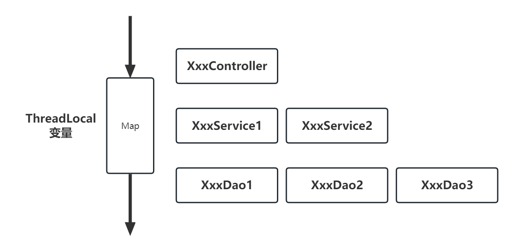
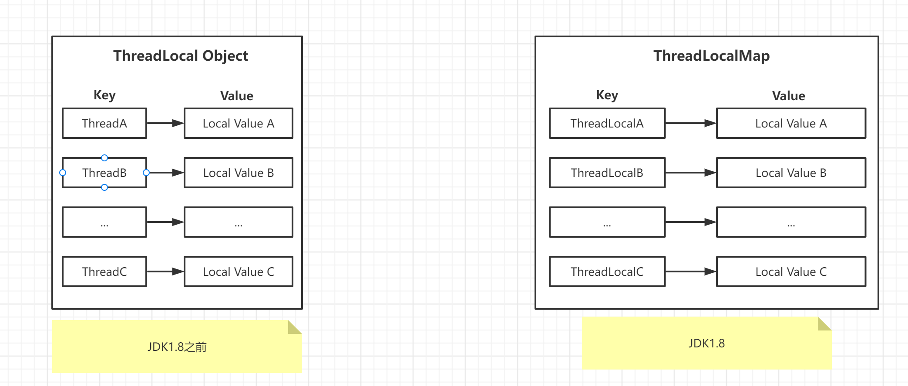
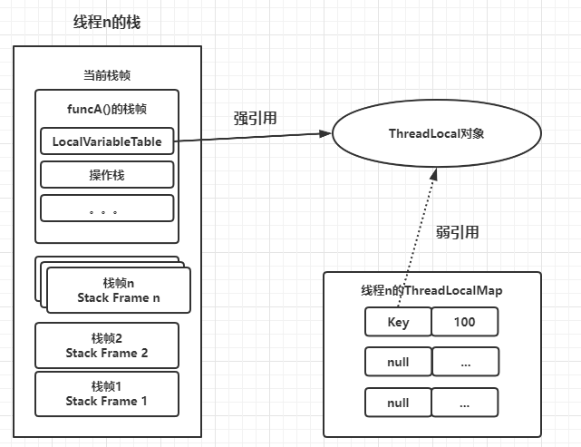
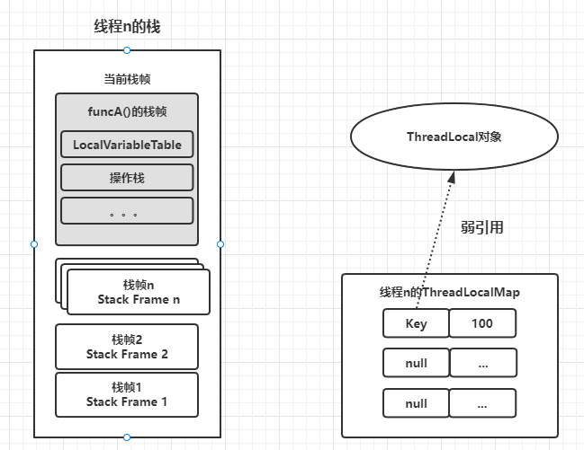

# 【并发编程】ThreadLocal

ThreadLocal 被译为 **“线程本地变量”** 类，在 Java 的多线程并发执行过程中，为保证多个线程对变量的安全访问，可以将变量放到 ThreadLocal 类型的对象中，使变量在每个线程中都有独立值，不会出现一个线程读取变量时而被另一个线程修改的现象。

ThreadLocal 是解决线程安全问题一个较好方案，**它通过为每个线程提供一个独立的本地值，去解决并发访问的冲突问题** 。很多情况下，使用 ThreadLocal 比直接使用同步机制（如 synchronized）解决线程安全问题更简单，更方便，且结果程序拥有更高的并发性。

## 1 使用场景

### 1.1 解决线程安全问题

ThreadLocal 的主要价值在于解决线程安全问题， **ThreadLocal 中数据只属于当前线程，其本地值对别的线程是不可见的**，在多线程环境下，可以防止自己的变量被其他线程篡改。另外，由于各个线程之间的数据相互隔离，避免同步加锁带来的性能损失，大大提升了并发性的性能。

**典型案例：**可以每个线程绑定一个数据库连接，是的这个数据库连接为线程所独享，从而避免数据库连接被混用而导致操作异常问题。

```java
//伪代码 
private static final ThreadLocal localSqlSession = new ThreadLocal(); 

public void startManagedSession() { 
  this.localSqlSession.set(openSession()); 
}

@Override public Connection getConnection() { 
  final SqlSession sqlSession = localSqlSession.get(); 
  if (sqlSession == null) { 
    throw new SqlSessionException("Error: Cannot get connection. No managed session is started."); 
  }
  return sqlSession.getConnection(); 
}
```

### 1.2 跨函数参数传递

通常用于同一个线程内，跨类、跨方法传递数据时，如果不用 ThreadLocal，那么相互之间的数据传递 **势必要靠返回值和参数**，这样无形之中增加了这些类或者方法之间的 **耦合度** 。

**跨函数传递数据** 场景典型案例：可以每个线程绑定一个 Session（用户会话）信息，这样一个线程的所有调用到的代码，都可以非常方便地访问这个本地会话，而不需要通过参数传递。



## 2 底层原理

早期 ThreadLocal 为一个全局的 Map。当工作线程 Thread 实例向本地变量保持某个值时，会以“Key-Value 对”的形式保存在 ThreadLocal 内部的 Map 中，其中 Key为线程 Thread 实例， Value 为待保存的值。当工作线程 Thread 实例从 ThreadLocal 本地变量取值时，会以 Thread 实例为 Key，获取其绑定的Value。

在 JDK8 版本中， ThreadLocal 的内部结构依然是 Map 结构，但是其 **拥有者为 Thread 线程对象**，**每一个Thread 实例拥有一个 ThreadLocalMap 对象** 。Key 为 ThreadLocal 实例。 



**与早期版本的** **ThreadLocalMap** **实现相比，新版本的主要的变化为：** 

- 拥有者发生了变化：新版本的 ThreadLocalMap 拥有者为 Thread，早期版本的ThreadLocalMap 拥有者为 ThreadLocal。 
- Key 发生了变化：新版本的 Key 为 ThreadLocal 实例，早期版本的 Key 为 Thread 实例。

**与早期版本的** **ThreadLocalMap** **实现相比，新版本的主要优势为：**

- ThreadLocalMap 存储的“Key-Value 对”数量变少
- Thread 实例销毁后， ThreadLocalMap 也会随之销毁，在一定程度上能减少内存的消耗。

**Thread、ThreadLocal、ThreadLocalMap 关系**：

```java
Thread --> ThreadLocalMap --> Entry(ThreadLocalN, LocalValueN)*n
```

### 2.1 Entry 中的 key 为什么要使用弱引用？

Entry 用于保存 ThreadLocalMap 的“Key-Value”条目，但是 **Entry 使用了对 Threadlocal 实例进行包装之后的弱引用（WeakReference）作为 Key** ，其代码如下：

```java
// Entry 继承了 WeakReference,并使用 WeakReference 对 Key 进行包装 

static class Entry extends WeakReference<ThreadLocal<?>> { 
  Object value; //值 
  Entry(ThreadLocal<?> k, Object v) { 
    super(k); //使用 WeakReference 对 Key 值进行包装 
    value = v; 
  } }
```

> 弱引用：只要发生GC，就会被回收

使用弱引用，是为了 **防止出现内存溢出的情况发生** 。如下代码：

```java
//伪代码 
public void funcA() { 
  //创建一个线程本地变量 
  ThreadLocal local = new ThreadLocal(); 
  //设置值 
  local.set(100); 
  //获取值 
  local.get(); 
  //函数末尾 
}
```

当线程 n 执行 funcA 方法到其末尾时，线程 n 相关的 JVM 栈内存以及内部  ThreadLocalMap 成员的结构，大致如图所示：



- 线程 n 调用 `funcA()` 方法新建了一个 ThreadLocal 实例，并使用 local 局部变量指向这个实例，**并且此 local 是强引用**
- 在调用 `local .set(100)`之后，线程 n 的 ThreadLocalMap 成员内部会新建一个 Entry 实例，**其 Key 以弱引用包装的方式指向 ThreadLocal 实例**
- 当线程 n 执行完 `funcA` 方法后， `funcA` 的方法栈帧将被销毁，**强引用 local 的值也就没有了**，但此时线程的 **ThreadLocalMap 里的对应的 Entry 的 Key 引用还指向了 ThreadLocal 实例** 
- 若 **Entry的 Key 引用是强引用**，就会导致 Key 引用指向的 ThreadLocal 实例、及其 Value 值都 **不能被 GC 回收，这将造成严重的内存泄露**



由于 ThreadLocalMap 中 Entry 的 Key 使用了弱引用，在下次 GC 发生时，就可以使那些没有被其他强引用指向、仅被 Entry 的 Key 所指向的 ThreadLocal 实例能被顺利回收。

并且，在 Entry的 Key 引用被回收之后，其 **Entry 的 Key 值变为 null**。后续当 ThreadLocal 的 `get` 、` set`  或 `remove` 被调用时，通过 `expungeStaleEntry` 方法， **ThreadLocalMap 的内部代码会清除这些 Key 为 null 的 Entry，从而完成相应的内存释放**。