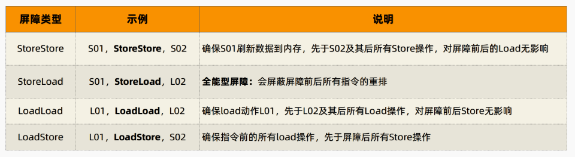

# 【并发编程】Volatile

Java 语言对 Volatile 的定义：Java 允许线程访问共享变量，为了确保共享变量能被准确和一致地更新，线程应该确保通过排他锁单独获得这个变量。

也就是说，Volatile 可以保证 **多线程场景** 下变量的 **可见性 和 有序性** 。如果某变量用 Volatile 修饰，则可以确保 **所有线程看到变量的值是一致的** 。

- **可见性** ：保证此变量的修改对所有线程的可见性。
- **有序性** ：在指令序列中插入 **内存屏障** 以 禁止指令重排序优化，编译器和处理器在进行指令优化时，不能把在 Volatile 变量操作（读/ 写）后面的语句放到其前面执行，也不能将 Volatile 变量操作前面的语句放在其后执行。遵循了 JMM 的 happens-before 规则。

## 1 实现原理：内存屏障

内存屏障（Memory Barrier）是一种 **CPU 指令** ，用于控制特定条件下的 **重排序** 和 **内存可见性** 问题。Java 编译器也会根据内存屏障的规则禁止重排序。

- 写操作时，通过在 **写操作指令后** 加入一条 `store` （写）屏障指令，把本地内存中变量的值刷新到主内存中
- 读操作时，通过在 **读操作指令前** 加入一条 `load` （读）屏障指令，及时读取到变量在主内存的值


重点看红色部分，可以看到，**内存屏障的实现本质上是添加了额外的汇编指令以禁止指令重排序的！**

**JMM 内存屏障插入策略**

- 在每个 volatile 写前，插入 StoreStore 屏障
- 在每个 volatile 写后，插入 StoreLoad 屏障
- 在每个 volatile 读后，插入 LoadLoad 屏障
- 在每个 volatile 读后，插入 LoadStore 屏障



## 2 缺陷：无法满足原子性

原子性的问题：虽然 volatile 可以保证可见性，但是不能满足原子性。

```java
public class VolatileDemo {
    public static void main(String[] args) throws InterruptedException {
        DemoV demoV = new DemoV();
        for (int i = 0; i < 2; i++) {
            Thread thread = new Thread(demoV);
            thread.start();
        }
        Thread.sleep(1000);
        System.out.println(demoV.count);
    }
}

class DemoV implements Runnable {

    public volatile int count = 0;

    @Override
    public void run() {
        addCount();
    }

    private void addCount() {
        for (int i = 0; i < 10000; ++i) {
            // count++ 在汇编层面上是三条指令，并非原子性操作
            count++;
        }
    }
}
```


结果并非 `20000`，以上出现原子性问题的原因是 `count++` 并不是原子性操作。

count = 5 开始，流程分析：

1. 线程1读取count的值为5 

2. 线程2读取count的值为5 
3. 线程2加1操作

4. 线程2最新count的值为6 

5. 线程2写入值到主内存的最新值为6 

6. 线程1执行加1count=6，写入到主内存的值是6。 

7. 结果：对count进行了两次加1操作，主内存实际上只是加1一次，结果为6。

**Volatile适合使用场景：** 共享变量 **独立于** 其他变量和自己之前的值，这类变量单独使用的时候适合用 volatile

- 对共享变量的写入操作不依赖其当前值：例如 `++` 和 `--` ，就不行
- 共享变量没有包含在有其他变量的不等式中

**如何解决这个问题呢？**

- 使用 `synchronized`
- 使用 `ReentrantLock` （可重入锁）
- 使用 `AtomicInteger`（原子操作）

与 `Synchronized` 相比较：


