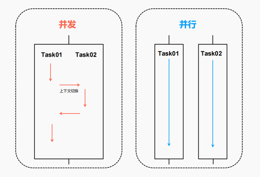
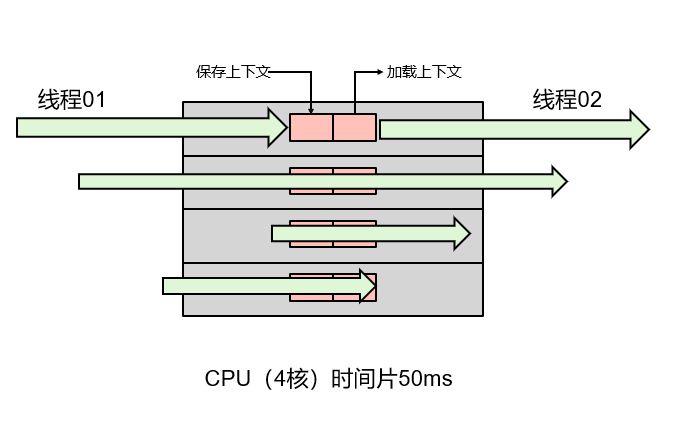
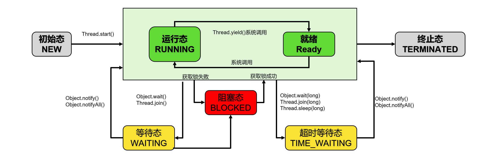
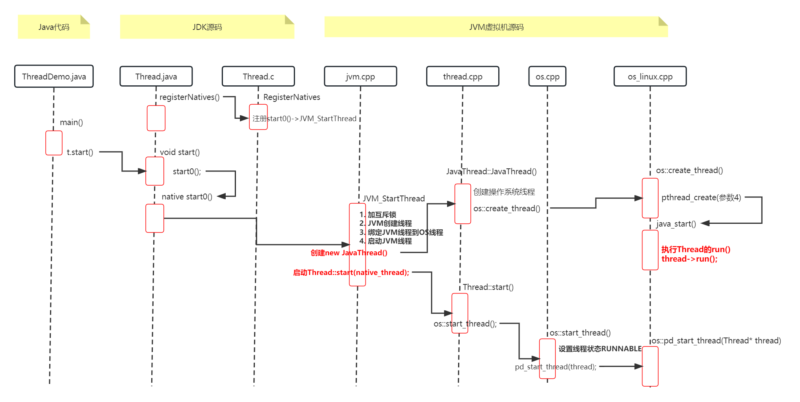
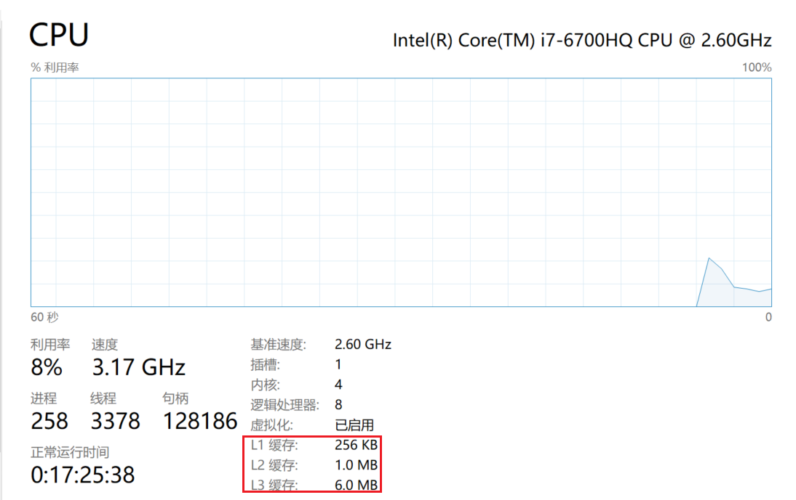
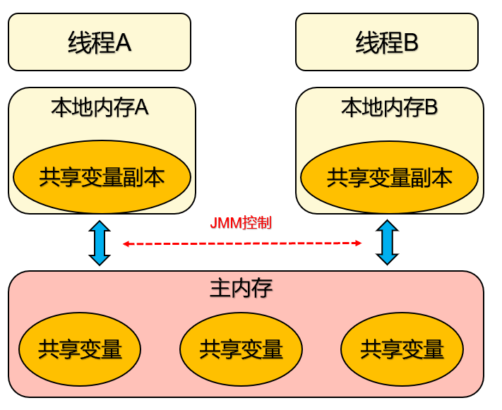

# 【并发编程】基本概念

> **多线程基础核心** **→** **Synchronized实现原理** **→** **Volatile实现原理** **→** **JMM和指令重排** →
>
> **JUC** **→** **原子类与CAS实现原理** **→** **锁与AQS实现原理** → **并发工具类** →  **并发容器** → **阻塞队列** → **线程池**

## 1 进程与线程

**进程**：是指内存中运行的一个应用程序，每个进程都有自己独立的内存空间；进程也是程序的一次执行过程，是 **系统运行程序的基本单位** 。系统运行一个程序即是一个进程从创建、运行到消亡的过程。

**线程**：是 **进程中的一个执行单元** ，负责当前进程中任务的执行。一个进程在其执行过程中，会产生很多个线程。

二者区别：

- 进程：有独立 **内存空间**，每个进程中的数据空间都是独立的。
- 线程：多线程之间 **堆空间** 与 **方法区** 是共享的，但每个线程的 **栈空间**、**程序计数器** 是独立的，线程消耗的资源比进程小的多

### 1.1 并发与并行

**并发（Concurrent）** ：同一时间段，多个任务都在执行 ，单位时间内不⼀定同时执行。

**并行（Parallel）** ：单位时间内，多个任务同时执行，单位时间内一定是同时执行。并行上限取决于 CPU 核数（CPU 时间片内 50ms）



> **注意：并发是一种能力，而并行是一种手段。** 当我们的系统拥有了并发的能力后，代码如果跑在多核 CPU 上就可以并行运行。所以咱们会说高并发处理，而不会说高并行处理。并行处理是基于硬件 CPU 的是固定的，而并发处理的能力是可以通过设计编码进行提高的。

### 1.2 线程上下文切换

**一个 CPU 内核，同一时刻只能被一个线程使用** 。为了提升 CPU 利用率，CPU 采用了 **时间片算法** 将 CPU 时间片轮流分配给多个线程，每个线程分配了一个时间片（几十毫秒/线程），线程在时间片内，使用 CPU 执行任务。当时间片用完后，线程会被挂起，然后把  CPU 让给其它线程。

> **那么问题来了，线程再次运行时，系统是怎么知道线程之前运行到哪里了呢？**

CPU 切换前会把当前任务状态保存下来，用于下次切换回任务时再次加载。**任务状态的保存及再加载的过程就叫做上下文切换。** 

> **任务状态信息保存在哪里呢？**

**程序计数器** ：用来存储 CPU 正在执行的指令的位置，和即将执行的下一条指令的位置。他们都是 CPU 在运行任何任务前，必须依赖的环境，被叫做 **CPU 上下文** 。



**上下文切换过程：**

1. 挂起当前任务任务，将这个任务在 CPU 中的状态（上下文）存储于内存中的某处。

2. 恢复一个任务，在内存中检索下一个任务的上下文并将在 CPU 的寄存器中恢复。

3. 跳转到程序计数器所指定的位置（即跳转到任务被中断时的代码行）。

### 1.3 线程的状态模型

在 JAVA 的 `Thread` 类中，定义了线程的六个状态：

```java
public enum State { 
  NEW, 
  RUNNABLE, 
  BLOCKED, 
  WAITING, 
  TIMED_WAITING, 
  TERMINATED; 
}
```



- **NEW（新建）** ：线程刚被创建，但是并未启动
- **RUNNABLE（可运行）**：线程可以在 Java 虚拟机中运行的状态，可能正在运行自己代码，也可能没有，这取决于操作系统处理器
- **BLOCKED（锁阻塞）**：当一个线程试图获取一个对象锁，而该对象锁被其他的线程持有，则该线程进入 `Blocked` 状态；当该线程持有锁时，该线程将变成 `Runnable` 状态
- **WAITING（无限等待）**：一个线程在等待另一个线程执行一个（唤醒）动作时，该线程进入Waiting 状态。进入这个状态后是不能自动唤醒的，必须等待另一个线程调用 `notify` 或者 `notifyAll` 方法才能够唤醒
- **TIMED_WAITING（计时等待）**：同 `Waiting` 状态，有几个方法有超时参数，调用他们将进入 `Timed Waiting` 状态。这一状态将一直保持到超时期满或者接收到唤醒通知。带有超时参数的常用方法有 `Thread.sleep` 、 `Object.wait`
- **TERMINATED（被终止）**：因为 `run` 方法正常退出而死亡，或者因为没有捕获的异常终止了 `run` 方法而死亡

## 2 多线程在 JVM 中的实现原理剖析

**分析**：Java 线程通过 `start()` 方法启动，启动会执行 `run()` 方法，具体是怎么实现的？

```java
public class ThreadDemo {
    public static void main(String[] args) {
        Runnable r = new Runnable() {
            @Override
            public void run() {
                System.out.printf("我是一个线程！");
            }
        };
        Thread thread = new Thread(r);
        // 为什么调用 start 方法，也就执行了 run 方法？
        thread.start();
    }
}
```

点进入 `start()` 可以看到源码：

```java
public synchronized void start() {	// synchronized 保证线程安全
		// 线程状态判断
    if (threadStatus != 0)
        throw new IllegalThreadStateException();
  
    group.add(this);

    boolean started = false;
    try {
      	// 重点步骤：start0
        start0();
        started = true;
    } finally {
        try {
            if (!started) {
                group.threadStartFailed(this);
            }
        } catch (Throwable ignore) {
        }
    }
}

// 重要：本地方法 start0
private native void start0();
```

那么这个 `start0()` 在哪呢，怎么读呢？

在 OpenJDK 源码 `share\native\java\lang\Thread.c` 文件中我们可以找到 `start0` 的定义，Java 线程将 `start0` 方法和真正的实现方法 `JVM_StartThread` 进行了绑定。也就是说调用 `start0` 相当与调用了 `JVM_StartThread` 方法。

```c
//定义了 JNINativeMethod 类型的数组，JNINativeMethod 是一个 C 语言的结构体类型，在 jni.h 头 文件中。 
//数组中的在 methods 数组中定义了 native 方法，与 JVM 中线程方法的对应关系。 
static JNINativeMethod methods[] = { 
  {"start0", "()V", 						(void *)&JVM_StartThread}, 
  {"stop0", "(" OBJ ")V", 			(void *)&JVM_StopThread}, 
  {"isAlive", "()Z", 						(void *)&JVM_IsThreadAlive}, 
  {"suspend0", "()V", 					(void *)&JVM_SuspendThread}, 
  {"resume0", "()V", 						(void *)&JVM_ResumeThread}, 
  {"setPriority0", "(I)V", 			(void *)&JVM_SetThreadPriority}, 
  {"yield", "()V", 							(void *)&JVM_Yield}, 
  {"sleep", "(J)V", 						(void *)&JVM_Sleep}, 
  {"currentThread", "()" THD, 	(void *)&JVM_CurrentThread}, 
  {"countStackFrames", "()I", 	(void *)&JVM_CountStackFrames}, 
  {"interrupt0", "()V", 				(void *)&JVM_Interrupt}, 
  {"isInterrupted", "(Z)Z", 		(void *)&JVM_IsInterrupted}, 
  {"holdsLock", "(" OBJ ")Z", 	(void *)&JVM_HoldsLock}, 
  {"getThreads", "()[" THD, 		(void *)&JVM_GetAllThreads}, 
  {"dumpThreads", "([" THD ")[[" STE, (void *)&JVM_DumpThreads}, 
  {"setNativeName", "(" STR ")V", 		(void *)&JVM_SetNativeThreadName}, 
};

//线程中 registerNatives 的 native 方法，对应的 C++ 方法，使用了传统的 JNI 调用函数命名规则，
//java.lang.Thread.registerNative 的方法对应的 JNI 函数。 
//在这个方法内，完成了 methods 数组中的所有native方法与 JVM 中 JNI 函数的映射。 
JNIEXPORT void JNICALL
```

在 **JVM 首次加载 Thread 类** 的时候，在 Thread 类的静态初始化块中，调用了 `native registerNatives` 方法，它对应的   Jni 方法就是上面的 `Java_java_lang_Thread_registerNatives` 方法，就是在这里完成了 state0 和 JVM_StartThread 的绑定。

```java
public class Thread implements Runnable { 
  private static native void registerNatives(); 
  static { 
    registerNatives(); 
  }
  ... 
}
```

至此，我们知道执行 `state0` 方法就是执行 `JVM_StartThread` 方法，它定义在 hotspot JVM 源码文件 `src\share\vm\prims\jvm.cpp` 中。

```cpp
JVM_ENTRY(void, JVM_StartThread(JNIEnv* env, jobject jthread)) 
  JVMWrapper("JVM_StartThread"); 
	JavaThread *native_thread = NULL; 
	bool throw_illegal_thread_state = false; { 
    // 1、获取互斥锁 
    MutexLocker mu(Threads_lock); 
    
    // 判断Java线程是否已启动，如果已启动，则抛异常。 
    if (java_lang_Thread::thread(JNIHandles::resolve_non_null(jthread)) != NULL) 
    {throw_illegal_thread_state = true;
     // 抛出非法线程状态异常 
    } else { 
      
      // 2、如果Java线程没有启动，创建 JVM 中的 JavaThread 
      jlong size =java_lang_Thread::stackSize(JNIHandles::resolve_non_null(jthread)); 
      size_t sz = size > 0 ? (size_t) size : 0; 
      
      // JVM 中的 JavaThread 构造函数在文件 thread.cpp
      native_thread = new JavaThread(&thread_entry, sz); 
      
      if (native_thread->osthread() != NULL) { 
        // 3、将 Java 中的 Thread 和 Jvm 中的 Thread 进行绑定。 
        native_thread->prepare(jthread); 
      } 
    } 
  }

// .....
	//开始启动执行 JVM Thread 线程。 
	Thread::start(native_thread);

JVM_END
```

进入 java 线程构造函数，在 `src\share\vm\runtime\thread.cpp` 中：

```cpp
JavaThread::JavaThread(ThreadFunction entry_point, size_t stack_sz) : Thread() 
{ 
  if (TraceThreadEvents) { 
    tty->print_cr("creating thread %p", this); 
  }
  
  initialize(); 
  _jni_attach_state = _not_attaching_via_jni; 
  set_entry_point(entry_point); 
  os::ThreadType thr_type = os::java_thread; 
  thr_type = entry_point == &compiler_thread_entry ? os::compiler_thread : os::java_thread;
  
  
  // 重点：创建操作系统线程,这个才是真正映射到系统层面。 
  os::create_thread(this, thr_type, stack_sz); 
  _safepoint_visible = false; }
```

JVM 在所有的操作系统中都实现了 `os::create_thread` ，我们看 Linux 操作系统的实现在 `src\os\linux\vm\os_linux.cpp` 中：

```cpp
bool os::create_thread(Thread* thread, ThreadType thr_type, size_t stack_size) {
  //  ......
    pthread_t tid; 
  
  //创建os级别的线程，pthread_create 是 linux 操作系统创建线程的函数。 
  //成功则返回0，否则返回出错编号 
  //第一个参数：指向线程标识符的指针。 
  //第二个参数：用来设置线程属性。 
  //第三个参数：java_start是新建的线程运行的初始函数地址； 
  //第四个参数：java_start函数的参数。 
  //java_start 就是新创建的线程启动入口，它会等待一个信号来调用Java中的run()方法
  	int ret = pthread_create(&tid, &attr, (void* (*)(void*)) java_start, thread); 
  // ...... 
    return true; 
}

//新建的操作系统线程从java_start方法开始执行。而在此函数中执行java线程对象的run方法。 
static void *java_start(Thread *thread) {
  //...... 
  thread->run();
  //此处的作用是执行java线程对象的run方法
  return 0; 
}
```

至此一个操作系统线程创建及初始化完毕了，返回到 `JVM_StartThread` 方法中，最后一行 `Thread::start(native_thread);` 开始执行操作系统线程。



### 总结

1. 线程类 `Thread` 被 JVM 加载时，完成线程所有 native 方法和 C++ 中的对应方法绑定。

2. Java 线程调用 start 方法：

   > `start` 方法 ==> `native state0` 方法 ==> `JVM_StartThread` ==> 创建 `JavaThread::JavaThread` 线程

3. 创建 OS 线程，并指定 OS 线程的运行入口：

   > 创建 `JavaThread::JavaThread` 线程 ==> 创建 OS 线程 `os::create_thread` ==> 指定 OS 线程执行入口，即 Java 线程 `run()` 方法

4. 启动 OS 线程：运行时会调用 Java 线程的 run 方法，至此实现了 Java 线程的运行。

5. 创建线程的时候使用的是 **互斥锁 MutexLocker 操作系统（互斥量）**，所以说创建线程是一个 **性能很差** 的操作！

## 3 线程安全问题

例子：代码模拟卖票

```java
public class DemoTickets {
    public static void main(String[] args) {
      	// 初始化任务
        SellTickets sellTickets = new SellTickets();

        Thread t1 = new Thread(sellTickets, "窗口1");
        Thread t2 = new Thread(sellTickets, "窗口2");
        Thread t3 = new Thread(sellTickets, "窗口3");
        t1.start();
        t2.start();
        t3.start();
    }
}

class SellTickets implements Runnable {

    // 一共 100 张票
    private int tickets = 100;

    @Override
    public void run() {
        while (true) {
            if (tickets > 0) {
                try {
                    Thread.sleep(20);
                } catch (InterruptedException e) {
                    throw new RuntimeException(e);
                }
                //获取当前线程对象的名字
                String name = Thread.currentThread().getName();
                System.out.println(name + "-正在卖:" + tickets--);
            }
        }
    }
}
```

结果出现了线程安全问题：


引发线程安全问题的根本原因：**多个线程共享变量！**

- 如果每个线程中对全局变量、静态变量只有读操作，而无写操作，一般来说，这个全局变量是线程安全的；
- 如果有多个线程同时执行写操作，一般都需要考虑线程同步，否则的话就可能影响线程安全问题。

#### 3.1 线程同步

为了保证不出现线程安全问题，Java 引入了线程同步机制（**synchronized**）。**那么怎么完成同步操作呢？**

1. **同步代码块 Synchronized —— 重量级锁** 

   ```java
   @Override
   public void run() {
       while (true) {
           // 同步代码块
           synchronized (lock) {
               if (tickets > 0) {
                   try {
                       Thread.sleep(20);
                   } catch (InterruptedException e) {
                       throw new RuntimeException(e);
                   }
                   //获取当前线程对象的名字
                   String name = Thread.currentThread().getName();
                   System.out.println(name + "-正在卖:" + tickets--);
               }
           }
       }
   }
   ```

2. **同步方法 Synchronized —— 重量级锁** 

   ```java
   //同步方法 
   public synchronized void method(){ 
     //可能会产生线程安全问题的代码 
   }
   ```

3. **锁机制【JUC】** 

   ```java
   Lock lock = new ReentrantLock();//可重入锁 
   lock.lock(); 
   		//需要同步操作的代码 
   lock.unlock();
   ```

## 4 线程并发的三大特性

并发编程中，三个非常重要的特性：**原子性，有序性 和 可见性** 。

- **原子性：** 即一个操作或多个操作，要么全部执行，要么就都不执行。执行过程中，不能被打断。
- **有序性：** 程序代码按照先后顺序执行。
  - **为什么会出现无序问题呢？** 因为 **指令重排** ！
- **可见性：** 当多个线程访问同一个变量时，一个线程修改了这个变量的值，其他线程能够立即看得到修改的值。
  - **为什么出现不可见性问题呢？** 可以说是因为 **Java 内存模型（JMM）**

### 4.1 有序性问题：指令重排

重排序是编译器和处理器为了提高程序运行效率，会对输入代码进行优化的一种手段。**它不保证程序中，各个语句执行先后顺序的一致。 ** 

```java
int count = 0; 
boolean flag = false; 
count = 1; //语句1 
flag = true; //语句2
```

在单线程中以上代码从顺序上看，语句1是在语句 2 前面的。

> **那么 JVM 在真正执行这段代码的时候，会保证语句 1 一定在语句 2 前面执行吗？**

- 还真不一定！**为什么呢？这里可能会发生 指令重排序（Instruction Reorder）。** 
- 无论如何重排序，**程序最终执行结果和代码顺序执行的结果是一致的** 。因为处理器在进行指令重排时，会考虑指令之间的数据依赖性！
- Java 编译器、运行时和处理器都会保证，在单线程下遵循 **as-if-serial 语义** 。

> **按顺序执行不好么，为什么要重排序去执行？** 

- 不进行指令重排，就相当于没有编译优化，那么程序执行效率打折扣。
- 当前线程获取 CPU 时间片（几十毫秒），如果按照先后顺序执行，并不能把 CPU 性能发挥完全，**上一个指令执行完执行下一个，CPU 会出现空挡期** 。

> **什么是 as-if-serial 语义？** 

- 不管编译器和处理器怎么优化字节码指令，怎样进行指令重排，**单线程** 所执行的结果不能受影响（多线程则不一定咯！）。
- 上面的代码中，语句 1 和语句 2 谁先执行对最终的程序结果并没有影响，那么就有可能在执行过程中，语句 2先执行而语句 1 后执行。

```java
int a = 10; //语句1 
int b = 2; //语句2 
a = a + 3; //语句3 
b = a*a; //语句4
```

- 这段代码有4个语句，那么可能的一个执行顺序是： **语句 2 ==> 语句 1 ==> 语句 3 ==> 语句 4**
  - 不可能是这个执行顺序： **语句 2 ==> 语句 1 ==> 语句 4 ==> 语句 3**
- 处理器在进行重排序时，会考虑指令之间的数据依赖性，如果一个指令 2 必须用到 指令 1 的结果，那么处理器会保证指令 1  会在指令 2 之前执行。
- **虽然重排序不会影响单个线程内程序执行的结果，但是多线程会有影响。**

再举个多线程的栗子：

```java
//线程1: 
init = false;
context = loadContext(); //语句1 
init = true; //语句2 


//线程2: 
while(!init){
  //如果初始化未完成，等待 
  sleep(); 
}
execute(context);//初始化完成，执行逻辑
```

- 上面代码中，由于语句 1 和语句 2 没有数据依赖性，因此可能会被重排序。
- 假如发生了重排序，在线程1执行过程中先执行语句2，而此是线程2会以为初始化工作已经完成，那么就会跳出 `while` 循环，去执行 `execute(context)` 方法，而此时 `context` 并没有被初始化，就会导致程序出错。
- 从上面可以看出，**重排序不会影响单个线程的执行，但是会影响到线程并发执行的正确性**。 

**要想多线程程序正确地执行，必须要保证 原子性、可见性 以及 有序性 。只要有一个没有被保证，就有可能会导致程序运行不正确。**

### 4.2 可见性问题：CPU与缓存一致性

**在多核** **CPU** **中，每个核的自己的缓存，关于同一个数据的缓存内容可能不一致。**

计算机在执行程序的时候，每条指令都是在 CPU 中执行的，而执行的时候，又免不了和数据打交道，而计算机上面的数据，是存放在计算机的物理内存上的。当内存的读取速度和 CPU 的执行速度相比差别不大的时候，这样的机制是没有任何问题的，可是随着 CPU 的技术的发展，CPU 的执行速度和内存的读取速度差距越来越大，导致 CPU 每次操作内存都要耗费很多等待时间。

为了解决这个问题，在 **CPU 和物理内存上新增高速缓存** ，这样程序的执行过程也就发生了改变，变成了程序在运行过程中，会将运算所需要的数据从主内存复制一份到 CPU 的高速缓存中，当 CPU 进行计算时就可以直接从高速缓存中读数据和写数据了，当运算结束再将数据刷新到主内存就可以了。



随着技术的发展，**CPU 开始出现了多核的概念，每个核都有一套自己的缓存** ，并且随着计算机能力不断提升，还开始支持多线程。

最终演变成，**多个线程访问进程中的某个共享内存，且这多个线程分别在不同的核心上执行，则每个核心都会在各自的 Cache 中保留一份共享内存的缓冲** ，我们知道多核是可以并行的，这样就会出现多个线程同时写各自的缓存的情况，**导致各自的 Cache 之间的数据不一致性问题** 。

### 4.3 JMM：保证三大特性

Java 为了保证并发编程中可以满足原子性、可见性及有序性，诞生出了一个重要的概念，那就是 **内存模型** ，**内存模型定义了 共享内存系统 中 多线程 程序读写操作行为的规范。** 通过这些规则来规范对内存的读写操作，从而保证指令执行的正确性，它解决了 CPU 多级缓存、处理器优化、指令重排等导致的内存访问问题。

Java 实现了 JMM 规范保证 Java 程序在各种平台下对内存的访问都能保证效果一致的机制及规范，JMM 在 Java 中的实现 **屏蔽了各种硬件和操作系统的访问差异** 。



> **内存模型怎么解决并发问题的？** 

- 内存模型解决并发问题主要采取两种方式，分别是 **限制处理器优化** ，另一种是 **使用了内存屏障** 。
- 而对于这两种方式，Java 底层其实已经封装好了一些关键字，我们只需要用起来就可以了，不需要关注底层具体如何实现。
- 关于解决并发编程中的 **原子性问题** ，Java 底层封装了 `Synchronized` 的方式，来保证方法和代码块内的操作都是原子性的。
- 关于解决并发编程中的 **可见性问题** ，Java 底层则封装了 `Volatile` 的方式，将被修饰的变量在修改后立即同步到主内存中。
- 关于解决并发编程中的 **有序性问题** ，其实也就是我们所说的重排序问题，`Volatile` 关键字也会 **禁止指令的重排序**，而 `Synchroinzed` 关键字 **由于保证了同一时刻只允许一条线程操作，自然也就保证了有序性** 。
- **JMM 定义一个共享变量何时写入，何时对另一个线程可见** 
- 线程之间的共享变量存储在主内存：
  - 主要存储的是 **Java实例对象** ，所有线程创建的实例对象都存放在主内存中，不管该实例对象是 **成员变量** 还是方法中的 **本地变量**（也称 **局部变量** ）。
  - 由于主内存是共享数据区，多条线程对同一个变量访问会出现线程安全问题。
- 每个线程都有一个私有的本地内存，本地内存存储共享变量的副本
  - 主要存储 **当前方法的所有本地变量** ，每个线程只能访问自己的本地内存。
  - **线程中的本地变量对其它线程是不可见的** ，就算是两个线程执行同一段代码，它们也会在自己的本地内存中，创建属于自己线程的本地变量。
- **本地内存是抽象概念涵盖：缓存，写缓冲区，寄存器等**

> **JMM 线程操作内存的基本规则：**

- 第一条，关于线程与主内存：**线程对共享变量的所有操作都必须在自己的本地内存中进行**，不能直接从主内存中读写。
- 第二条，关于线程间本地内存：**不同线程之间无法直接访问其他线程本地内存中的变量**，线程间变量值的传递需要经过主内存。

