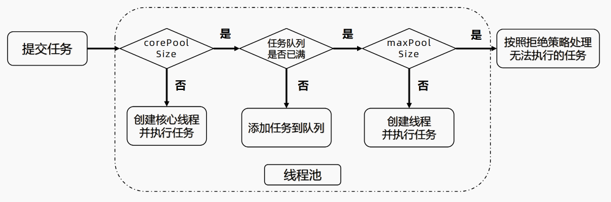

# 【并发编程】线程池

线程池（ThreadPool） 是一种基于 **池化思想** 管理线程的工具，看过 `new Thread` 源码之后我们发现，**频繁创建线程销毁线程的开销很大，会降低系统整体性能** 。线程池维护多个线程，等待监督和管理分配可并发执行的任务。

**优点：**

- **降低资源消耗：** 通过线程池复用线程，降低创建线程和释放线程的损耗
- **提高响应速度：** 任务到达时，无需等待即刻运行
- **提高线程的可管理性：** 使用线程池可以进行统一的分片、调优和监控线程
- **提供可扩展性：**线程池具备可扩展性，研发人员可以向其中增加各种功能，比如延时，定时，监控等

**适用场景** :

- **连接池：** 预先申请数据库连接，提升申请连接的速度，降低系统的开销
- **快速响应用户请求：** 服务器接受到大量请求时，使用线程池是很适合的，它可以大大减少线程的创建和销毁的次数，提高服务器的工作效率。
- 在实际开发中，如果需要创建 5 个以上的线程，就可以用线程池来管理。

## 1 线程池参数

|      参数名       |           类型           |             含义             |
| :---------------: | :----------------------: | :--------------------------: |
| **corePoolSize**  |           int            |          核心线程数          |
|  **maxPoolSize**  |           int            |          最大线程数          |
| **keepAliveTime** |           long           |         保持存活时间         |
|   **workQueue**   |      BlockingQueue       |         任务存储队列         |
| **threadFactory** |      ThreadFactory       |  线程池创建线程的线程工厂类  |
|    **Handler**    | RejectedExecutionHandler | 线程无法拒绝任务时的拒绝策略 |
|                   |                          |                              |

**参数详解：**

1. corePoolSize 核心线程数：即便线程空闲（Idle）也不会回收

2. maxPoolSize 最大线程数：线程池可能会在核心线程数的基础上，额外增加一些线程，但是这些新增加的线程数有一个上限，就是 maxPoolSize

3. ThreadFactory 新的线程是由 ThreadFactory 创建，默认使用 `Executors.defaultThreadFactory()` ，创建出来的线程都在同一个线程组，拥有同样的 NORM_PRIORITY 优先级并且都不是守护线程。如果自己指定ThreadFactory，则可以改变线程名、线程组、优先级、是否是守护线程

4. workQueue 工作队列类型
   - 直接交换：SynchronousQueue，这个队列没有容量，无法保存工作任务。
   - 无界队列：LinkedBlockingQueue 无界队列
   - 有界队列：ArrayBlockingQueue 有界队列

## 2 线程池原理



①  提交任务，如果线程数小于 `corePoolSize` 即使其他线程处于空闲状态，也会创建一个新线程来运行任务

②  如果线程数大于 `corePoolSize` ，但少于 `maxPoolSize` ，将任务放入工作队列

③  如果队列已满，并且线程数小于 `maxPoolSize`，则创建一个新线程来运行任务。

④  如果队列已满，并且线程数大于或等于 `maxPoolSize`，则拒绝该任务。

## 3 手动创建线程池

> 在《阿里巴巴 **Java** 开发手册》“并发处理” 这一章节，明确指出 **线程资源必须通过线程池提供，不允许在应用中自行显示创建线程**。
>
> 另外，在《阿里巴巴 Java 开发手册》中强制线程池不允许使用 Executors 去创建，而是通过 `ThreadPoolExecutor` 构造函数的方式，这样的处理方式让写的同学 **更加明确线程池的运行规则** ，规避资源耗尽的风险。

线程池的构造器：

```java
// 使用标准构造器，构造一个普通的线程池 
public ThreadPoolExecutor( 
  	int corePoolSize, // 核心线程数，即使线程空闲（Idle），也不会回收； 
  	int maximumPoolSize, // 线程数的上限； 
  	long keepAliveTime, TimeUnit unit, // 线程最大空闲（Idle）时长 
  	BlockingQueue workQueue, // 任务的排队队列 
  	ThreadFactory threadFactory, // 新线程的产生方式 
  	RejectedExecutionHandler handler) // 拒绝策略
```

### 线程数量的设置

- CPU密集型线程池：CPU 密集型任务也叫计算密集型任务，其特点是要进行大量计算而需要消耗 CPU 资源，比如计算圆周率、对视频进行高清解码等等。 CPU 密集型任务虽然也可以并行完成，但是并行的任务越多，花在任务切换的时间就越多， CPU 执行任务的效率就越低，所以，要最高效地利用 CPU，**CPU 密集型任务的并行执行的数量应当等于 CPU 的核心数**。
- IO密集型线程池：由于 IO 密集型任务的 CPU 使用率较低，导致线程空余时间很多，所以通常就 **需要开 CPU核心数两倍的线程** 。当 IO 线程空闲时，可以启用其他线程继续使用 CPU，以提高 CPU 的使用率。

### 拒绝策略

拒绝的时机：

- 当 Executor 关闭时，提交新任务会被拒绝。
- 当 Executor 对 **最大线程** 和 **工作队列容量使用有限边界并且已经饱和** 时

拒绝策略的类别：

- **AbortPolicy** ：直接抛出异常，说明任务没有提交成功。
- **DiscardPolicy** ：线程池会默默的丢弃任务，不会发出通知。
- **DiscardOldestPolicy** ：队列中存有很多任务，将队列中存在时间最久的任务给丢弃。
- **CallerRunsPolicy** ：当线程池无法处理任务时，那个线程提交任务由那个线程负责运行。**好处在于避免丢弃任务和降低提交任务的速度** ，给线程池一个缓冲时间。