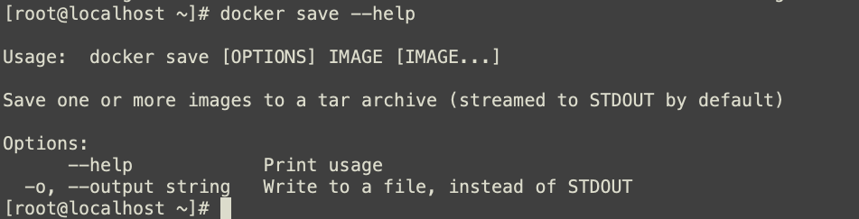

# 【Java开发笔记】Docker

## 1 基本概要

Docker 是一个快速交付应用、运行应用的技术，具备下列优势：

- 可以将程序及其依赖、运行环境一起打包为一个 **镜像**，可以迁移到任意 Linux 操作系统
- 运行时利用沙箱机制形成 **隔离容器**，各个应用互不干扰
- 启动、移除都可以通过一行命令完成，方便快捷

### 1.1 为什么需要Docker？

大型项目组件较多，运行环境也较为复杂，部署时会碰到一些问题：

- 依赖关系复杂，容易出现兼容性问题

- 开发、测试、生产环境有差异

例如一个项目中，部署时需要依赖于 `node.js`、`Redis`、`RabbitMQ`、`MySQL` 等，这些服务部署时所需要的 **函数库、依赖项** 各不相同，甚至会有冲突。给部署带来了极大的困难。

### 1.2 Docker如何解决依赖兼容问题？

Docker为了解决依赖的兼容问题的，采用了两个手段：

- 将应用的 `Libs（函数库）`、`Deps（依赖）`、`配置` 与 `应用` 一起打包

- 将每个应用放到一个隔离 **容器** 去运行，避免互相干扰


这样打包好的应用包中，既包含应用本身，也包含应用所需要的 Libs、Deps，无需再操作系统上安装这些，自然就不存在不同应用之间的兼容问题了。

虽然解决了不同应用的兼容问题，但是 **开发、测试等环境会存在差异，操作系统版本也会有差异**，怎么解决这些问题å呢？

### 1.3 Docker如何解决操作系统环境差异？

Docker 的解决方式：

- Docker 将用户程序与 **所需要调用的系统（比如Ubuntu）函数库** 一起打包
- Docker 运行到不同操作系统时，直接基于打包的函数库，借助于操作系统的 **Linux 内核** 来运行

如图：


因此，Docker 镜像中包含 **完整运行环境**，包括系统函数库，**仅依赖系统的 Linux 内核**，因此可以在任意 Linux 操作系统上运行。

### 1.4 Docker与虚拟机的区别

Docker 可以让一个应用在任何操作系统中非常方便的运行。而以前我们接触的虚拟机，也能在一个操作系统中，运行另外一个操作系统，保护系统中的任何应用。

二者的区别：

- **虚拟机**（virtual machine）是在操作系统中 **模拟** 硬件设备，然后运行另一个操作系统，比如在 Windows 系统里面运行 Ubuntu 系统，这样就可以运行任意的 Ubuntu 应用了。
- **Docker** 仅仅是封装函数库，并没有模拟完整的操作系统，只是 **一个系统进程**，如图：


对比来看：

|   特性   |  Docker  |  虚拟机  |
| :------: | :------: | :------: |
|   性能   | 接近原生 | 性能较差 |
| 硬盘占用 | 一般为MB | 一般为GB |
|   启动   |   秒级   |  分钟级  |

### 1.5 Docker架构

#### 镜像与容器

**镜像（Image）**：Docker 将应用程序及其所需的依赖、函数库、环境、配置等文件打包在一起，称为镜像。

**容器（Container）**：镜像中的应用程序运行后形成的进程就是 **容器**，只是 Docker 会给容器进程做隔离，对外不可见。


#### DockerHub

开源应用程序非常多，打包这些应用往往是重复的劳动。为了避免这些重复劳动，人们就会将自己打包的 **应用镜像**，例如 Redis、MySQL 镜像放到网络上，共享使用，就像 GitHub 的代码共享一样。

- **DockerHub**：DockerHub 是一个官方的 Docker 镜像的托管平台。这样的平台称为D ocker Registry。

- 国内也有类似于 DockerHub 的公开服务，比如 [网易云镜像服务](https://c.163yun.com/hub)、[阿里云镜像库](https://cr.console.aliyun.com/)等。

我们一方面可以将自己的镜像共享到 DockerHub，另一方面也可以从 DockerHub 拉取镜像：


#### Docker架构

我们要使用 Docker 来操作镜像、容器，就必须要安装 Docker。

Docker 是一个 **CS 架构** 的程序，由两部分组成：

- 服务端(server)：Docker 守护进程，负责处理 Docker 指令，管理镜像、容器等

- 客户端(client)：通过命令或 RestAPI 向 Docker 服务端发送指令。可以在本地或远程向服务端发送指令。


## 2 Docker安装

### 2.1 卸载（可选）

果之前安装过旧版本的Docker，可以使用下面命令卸载：

```
yum remove docker \
                  docker-client \
                  docker-client-latest \
                  docker-common \
                  docker-latest \
                  docker-latest-logrotate \
                  docker-logrotate \
                  docker-selinux \
                  docker-engine-selinux \
                  docker-engine \
                  docker-ce
```

### 2.2 安装步骤

首先需要虚拟机联网，安装 yum 工具

```sh
yum install -y yum-utils \
           device-mapper-persistent-data \
           lvm2 --skip-broken
```

输入命令：

```shell
yum install -y docker
```

稍等片刻，docker 即可安装成功。

### 2.3.启动docker

Docker应用需要用到各种端口，逐一去修改防火墙设置。非常麻烦，因此建议大家直接关闭防火墙！

启动docker前，一定要关闭防火墙！！

启动docker前，一定要关闭防火墙！！

启动docker前，一定要关闭防火墙！！

```sh
# 关闭
systemctl stop firewalld
# 禁止开机启动防火墙
systemctl disable firewalld
```

通过命令启动docker：

```sh
systemctl start docker  # 启动docker服务

systemctl stop docker  # 停止docker服务

systemctl restart docker  # 重启docker服务
```

然后输入命令，可以查看docker版本：

```
docker -v
```

如图：


### 2.4 配置镜像加速器

参考：https://cr.console.aliyun.com/cn-hangzhou/instances/mirrors

```sh
sudo mkdir -p /etc/docker
sudo tee /etc/docker/daemon.json <<-'EOF'
{
  "registry-mirrors": ["https://02ebyny6.mirror.aliyuncs.com"]
}
EOF
sudo systemctl daemon-reload
sudo systemctl restart docker
```

## 3 基本操作

### 3.1 镜像操作

镜像的名称组成：

- 镜名称一般分两部分组成：`[repository]:[tag]`。
- 在没有指定tag时，默认是latest，代表最新版本的镜像


这里的 mysql 就是 repository，5.7 就是 tag，合一起就是镜像名称，代表 5.7 版本的 MySQL 镜像。


#### 拉取、查看镜像

需求：从 DockerHub 中拉取一个 nginx 镜像并查看

1）首先去镜像仓库搜索 nginx 镜像，比如 [DockerHub](https://hub.docker.com/):


2）根据查看到的镜像名称，拉取自己需要的镜像，通过命令：`docker pull nginx`


3）通过命令：`docker images` 查看拉取到的镜像


#### 保存、导入镜像

需求：利用 `docker save` 将 nginx 镜像导出磁盘，然后再通过 `load` 加载回来

1）利用 `docker xx --help` 命令查看 `docker save` 和 `docker load` 的语法

例如，查看 save 命令用法，可以输入命令：

```sh
docker save --help
```



命令格式：

```shell
docker save -o [保存的目标文件名称] [镜像名称]
```

2）使用 `docker save` 导出镜像到磁盘 

运行命令：

```sh
docker save -o ./nginx.tar nginx:1.20
```

结果如图：


3）使用 `docker load` 加载镜像

先删除本地的 nginx 镜像：

```sh
docker rmi nginx:1.20
```

然后运行命令，加载本地文件：

```sh
docker load -i nginx.tar
```

结果：


### 3.2 容器操作


容器保护三个状态：

- 运行：进程正常运行
- 暂停：进程暂停，CPU 不再运行，并不释放内存
- 停止：进程终止，回收进程占用的内存、CPU 等资源

其中：

- `docker run`：创建并运行一个容器，处于运行状态
- `docker pause`：让一个运行的容器暂停
- `docker unpause`：让一个容器从暂停状态恢复运行
- `docker stop`：停止一个运行的容器
- `docker start`：让一个停止的容器再次运行

- `docker rm`：删除一个容器

#### 创建并运行一个容器

创建并运行 nginx 容器的命令：

```sh
docker run --name containerName -p 80:80 -d nginx
```

命令解读：

- docker run ：创建并运行一个容器
- --name : 给容器起一个名字，比如叫做 mn
- -p ：将宿主机端口与容器端口映射，冒号左侧是宿主机端口，右侧是容器端口
- -d：后台运行容器
- nginx：镜像名称，例如 nginx

这里的 `-p` 参数，是将容器端口映射到宿主机端口。

默认情况下，容器是隔离环境，我们直接访问宿主机的 80 端口，肯定访问不到容器中的 nginx。


现在，将容器的 80 与宿主机的 80 关联起来，当我们访问宿主机的 80 端口时，就会被映射到容器的 80，这样就能访问到 nginx 了：


#### 进入容器，修改文件

**需求**：进入 Nginx 容器，修改 HTML 文件内容，添加“hello world”

1）进入容器。进入我们刚刚创建的 nginx 容器的命令为：

```sh
docker exec -it mn bash
```

命令解读：

- docker exec ：进入容器内部，执行一个命令

- -it : 给当前进入的容器创建一个标准输入、输出终端，允许我们与容器交互

- mn ：要进入的容器的名称

- bash：进入容器后执行的命令，bash 是一个 linux 终端交互命令

2）进入 nginx 的 HTML 所在目录 `/usr/share/nginx/html`

容器内部会模拟一个独立的 Linux 文件系统，看起来如同一个 linux 服务器一样：


nginx 的环境、配置、运行文件全部都在这个文件系统中，包括我们要修改的html文件。

查看 DockerHub 网站中的 nginx 页面，可以知道 nginx 的 html 目录位置在`/usr/share/nginx/html`

我们执行命令，进入该目录：

```sh
cd /usr/share/nginx/html
```

 查看目录下文件：


3）修改 index.html 的内容

容器内没有 vi 命令，无法直接修改，我们用下面的命令来修改：

```sh
sed -i -e 's#Welcome to nginx#欢迎#g' -e 's#<head>#<head><meta charset="utf-8">#g' index.html
```

在浏览器访问自己的虚拟机地址，例如我的是：http://192.168.223.130:8080，即可看到结果。

### 3.3 数据卷（容器数据管理）

在之前的 nginx 案例中，修改 nginx 的 html 页面时，需要进入 nginx 内部。并且因为没有编辑器，修改文件也很麻烦。

这就是因为 **容器与数据（容器内文件）耦合** 带来的后果。


要解决这个问题，必须将数据与容器解耦，这就要用到 **数据卷** 了。

#### 什么是数据卷？

**数据卷（volume）**是一个虚拟目录，指向宿主机文件系统中的某个目录。


一旦完成数据卷挂载，对容器的一切操作都会作用在数据卷对应的宿主机目录了。

这样，我们操作宿主机的 `/var/lib/docker/volumes/html` 目录，就等于操作容器内的 `/usr/share/nginx/html` 目录了

#### 创建和查看数据卷

数据卷操作的基本语法如下：

```sh
docker volume [COMMAND]
```

docker volume 命令是数据卷操作，根据命令后跟随的 command 来确定下一步的操作：

- create 创建一个volume
- inspect 显示一个或多个volume的信息
- ls 列出所有的volume
- prune 删除未使用的volume
- rm 删除一个或多个指定的volume

**需求**：创建一个数据卷，并查看数据卷在宿主机的目录位置

1）创建数据卷

```sh
docker volume create html
```

2）查看所有数据

```sh
docker volume ls
```

3）查看数据卷详细信息卷

```sh
docker volume inspect html
```

可以看到，我们创建的 html 这个数据卷关联的宿主机目录为 `/var/lib/docker/volumes/html/_data` 目录。


#### 挂载数据卷

我们在创建容器时，可以通过 `-v` 参数来挂载一个数据卷到某个容器内目录，命令格式如下：

```sh
docker run \
  --name 容器名 \
  -v 卷名:容器目录 \
  -p 主机端口:容器端口
  镜像名:版本 \
```

这里的 `-v` 就是挂载数据卷的命令：

- `-v html:/root/htm` ：把html数据卷挂载到容器内的/root/html这个目录中

#### 案例：给 nginx 挂载数据卷

**需求**：创建一个 nginx 容器，修改容器内的 html 目录内的 index.html 内容

**分析**：上个案例中，我们进入 nginx 容器内部，已经知道 nginx 的 html 目录所在位置 `/usr/share/nginx/html` ，我们需要把这个目录挂载到 html 这个数据卷上，方便操作其中的内容。

1）创建容器并挂载数据卷到容器内的 HTML 目录

```sh
docker run --name mn -v html:/usr/share/nginx/html -p 80:80 -d nginx
```


2）进入 html 数据卷所在位置，并修改 HTML 内容

```sh
# 查看html数据卷的位置
docker volume inspect html
# 进入该目录
cd /var/lib/docker/volumes/html/_data
# 修改文件
vi index.html
```


#### 案例：给 mysql 挂载到本地目录

容器不仅仅可以挂载数据卷，也可以直接挂载到宿主机目录上。关联关系如下：

- 带数据卷模式：宿主机目录 --> 数据卷 ---> 容器内目录
- 直接挂载模式：宿主机目录 ---> 容器内目录


**语法**：

目录挂载与数据卷挂载的语法是类似的：

- -v [宿主机目录]:[容器内目录]
- -v [宿主机文件]:[容器内文件]

**需求**：创建并运行一个MySQL容器，将宿主机目录直接挂载到容器

实现思路如下：

1）下载镜像

2）创建目录 `/tmp/mysql/data`

3）创建目录 `/tmp/mysql/conf`，将课前资料提供的 `hmy.cnf` 文件上传到 `/tmp/mysql/conf`

4）去 DockerHub 查阅资料，创建并运行 MySQL 容器，要求：

​	① 挂载 `/tmp/mysql/data` 到 mysql 容器内数据存储目录

​	② 挂载` /tmp/mysql/conf/hmy.cnf` 到 mysql 容器的配置文件

​	③ 设置 MySQL 密码

```sh
mysql容器中的数据文件
/var/lib/mysql
mysql容器的配置文件
/etc/mysql/conf.d

#使用卷挂载
docker volume create mysqlconf
docker volume create mysqldata
# 创建mysql容器
docker run --name=mysql -p 13306:3306 \
-e MYSQL_ROOT_PASSWORD=123456 \
-v mysqlconf:/etc/mysql/conf.d \
-v mysqldata:/var/lib/mysql \
-d mysql:5.7

# 直接挂载
# 创建mysql.cnf文件，且内容为[mysql]
echo [mysql] > mysql.cnf 
# 使用直接挂载的方式来创建mysql容器
docker run -di --name=mysql2 -e MYSQL_ROOT_PASSWORD=123456 -p 23306:3306 \
-v /root/mysql/mysql.cnf:/etc/mysql/conf.d/mysql.cnf \
-v /root/mysql/data:/var/lib/mysql \
mysql:5.7

# 说明
/root/mysql/mysql.cnf 是一个文件 
-v /root/mysql/mysql.cnf:/etc/mysql/conf.d/mysql.cnf 是 映射容器的文件
宿主机下的/root/mysql/mysql.cnf与容器里的/etc/mysql/conf.d/mysql.cnf做映射
-v /root/mysql/data:/var/lib/mysql
映射宿主机下的/root/mysql目录与容器里的/var/lib/mysql
```

#### 数据卷挂载与目录直接挂载对比

- 数据卷挂载耦合度低，由 docker 来管理目录，但是目录较深，不好找
- 目录挂载耦合度高，需要我们自己管理目录，不过目录容易寻找查看
- 直接挂载方式：如果有配置得自已提供
- 数据卷挂载：宿主机不需要提供配置文件
- 如果是使用卷挂载时 如果宿主机没有提供配置文件，则容器会补充，如果宿主机有提供配置文件，则以宿主机为准。
- 直接挂载方式：配置目录，如果宿主没提供则不会补充

## 4 Dockerfile自定义镜像

### 4.1 镜像结构

镜像是将应用程序及其需要的系统函数库、环境、配置、依赖打包而成。

我们以 MySQL 为例，来看看镜像的组成结构：


简单来说，镜像就是在系统函数库、运行环境基础上，添加应用程序文件、配置文件、依赖文件等组合，然后编写好启动脚本打包在一起形成的文件。我们要构建镜像，其实就是实现上述打包的过程。

### 4.2 Dockerfile语法

构建自定义的镜像时，并不需要一个个文件去拷贝，打包。

我们只需要告诉 Docker，我们的镜像的组成，需要哪些 BaseImage、需要拷贝什么文件、需要安装什么依赖、启动脚本是什么，将来 Docker 会帮助我们构建镜像。

而描述上述信息的文件就是 Dockerfile 文件。

**Dockerfile** 就是一个文本文件，其中包含一个个的 **指令(Instruction)** ，用指令来说明要执行什么操作来构建镜像。每一个指令都会形成一层 Layer。


更新详细语法说明，请参考官网文档： https://docs.docker.com/engine/reference/builder

### 4.3 案例：基于 Centos7 构建Java项目

需求：基于 Centos7 镜像构建一个新镜像，运行一个java项目。

- 步骤1：新建一个空文件夹 docker-demo。将 jdk8.tar.gz 文件拷贝到 docker-demo 这个目录，将 Dockerfile 拷贝到 docker-demo 这个目录，将 docker-demo.jar 文件拷贝到 docker-demo 这个目录


其中，dockerfile 内容：

```
# 指定基础镜像
FROM centos:7
# 配置环境变量，JDK的安装目录
ENV JAVA_DIR=/usr/local

# 拷贝jdk和java项目的包
COPY ./jdk8.tar.gz $JAVA_DIR/
COPY ./docker-demo.jar /tmp/app.jar

# 安装JDK
RUN cd $JAVA_DIR \
 && tar -xf ./jdk8.tar.gz \
 && mv ./jdk1.8.0_144 ./java8

# 配置环境变量
ENV JAVA_HOME=$JAVA_DIR/java8
ENV PATH=$PATH:$JAVA_HOME/bin

# 暴露端口
EXPOSE 8090
# 入口，java项目的启动命令
ENTRYPOINT java -jar /tmp/app.jar
```

- 步骤5：进入 docker-demo

  将准备好的 docker-demo 上传到虚拟机任意目录，然后进入 docker-demo 目录下

- 步骤6：运行命令：

  ```sh
  docker build -t javaweb:1.0 .
  ```


最后访问 http://192.168.223.130:8090/hello/count

### 4.4 小结

1. Dockerfile 的本质是一个文件，通过指令描述镜像的构建过程

2. Dockerfile 的第一行必须是 `FROM`，从一个基础镜像来构建

3. 基础镜像可以是基本操作系统，如 Ubuntu。也可以是其他人制作好的镜像，例如：java:8-alpine

## 5 Docker-Compose

Docker Compose 可以基于 `Compose` 文件帮我们快速的部署分布式应用，而无需手动一个个创建和运行容器！


### 5.1 简介

Compose 文件是一个文本文件，**通过指令定义集群中的每个容器如何运行**。格式如下：

```json
version: "3.8"
 services:
  mysql:
    image: mysql:5.7.25
    environment:
     MYSQL_ROOT_PASSWORD: 123 
    volumes:
     - "/tmp/mysql/data:/var/lib/mysql"
     - "/tmp/mysql/conf/hmy.cnf:/etc/mysql/conf.d/hmy.cnf"
  web:
    build: .
    ports:
     - "8090:8090"

```

上面的 Compose 文件就描述一个项目，其中包含两个容器：

- mysql：一个基于 `mysql:5.7.25` 镜像构建的容器，并且挂载了两个目录
- web：一个基于 `docker build` 临时构建的镜像容器，映射端口时 8090

DockerCompose 的详细语法参考官网：https://docs.docker.com/compose/compose-file/

DockerCompose 文件可以看做是将多个 `docker run` 命令写到一个文件，只是语法稍有差异。

### 5.2 安装

安装epel源

```shell
yum install -y epel-release
```

安装docker-compose

```shell
yum install -y docker-compose 
```

修改文件权限：

```sh
# 修改权限
chmod +x /usr/local/bin/docker-compose
```

### 5.3 案例：部署微服务集群

**需求**：将之前学习的cloud-demo微服务集群利用DockerCompose部署

**实现思路**：

① 查看提供的 cloud-demo 文件夹，里面已经编写好了 docker-compose 文件

② 修改自己的 cloud-demo 项目，将数据库、nacos 地址都命名为 docker-compose 中的服务名

③ 使用 maven 打包工具，将项目中的每个微服务都打包为 app.jar

④ 将打包好的 app.jar 拷贝到 cloud-demo 中的每一个对应的子目录中

⑤ 将 cloud-demo 上传至虚拟机，利用 docker-compose up -d 来部署

#### 5.3.1 compose文件

查看课前资料提供的 cloud-demo 文件夹，里面已经编写好了 docker-compose 文件，而且每个微服务都准备了一个独立的目录：


内容如下：

```yaml
version: "3.2"

services:
  nacos:
    image: nacos/nacos-server
    environment:
      MODE: standalone
    ports:
      - "8848:8848"
  mysql:
    image: mysql:5.7.25
    environment:
      MYSQL_ROOT_PASSWORD: 123
    volumes:
      - "$PWD/mysql/data:/var/lib/mysql"
      - "$PWD/mysql/conf:/etc/mysql/conf.d/"
  userservice:
    build: ./user-service
  orderservice:
    build: ./order-service
  gateway:
    build: ./gateway
    ports:
      - "10010:10010"
```

可以看到，其中包含 5 个 service 服务：

- `nacos`：作为注册中心和配置中心
  - `image: nacos/nacos-server`： 基于nacos/nacos-server镜像构建
  - `environment`：环境变量
    - `MODE: standalone`：单点模式启动
  - `ports`：端口映射，这里暴露了8848端口
- `mysql`：数据库
  - `image: mysql:5.7.25`：镜像版本是mysql:5.7.25
  - `environment`：环境变量
    - `MYSQL_ROOT_PASSWORD: 123`：设置数据库root账户的密码为123
  - `volumes`：数据卷挂载，这里挂载了mysql的data、conf目录，其中有我提前准备好的数据
- `userservice`、`orderservice`、`gateway`：都是基于Dockerfile临时构建的

查看 mysql 目录，可以看到其中已经准备好了 cloud_order、cloud_user 表：


查看微服务目录，可以看到都包含 Dockerfile 文件：


内容如下：

```dockerfile
FROM java:8-alpine
COPY ./app.jar /tmp/app.jar
ENTRYPOINT java -jar /tmp/app.jar
```

#### 5.3.2 修改微服务配置

因为微服务将来要部署为docker容器，而容器之间互联不是通过IP地址，而是通过容器名。这里我们将order-service、user-service、gateway服务的mysql、nacos地址都修改为基于容器名的访问。

如下所示：

```yaml
spring:
  datasource:
    url: jdbc:mysql://mysql:3306/cloud_order?useSSL=false
    username: root
    password: 123
    driver-class-name: com.mysql.jdbc.Driver
  application:
    name: orderservice
  cloud:
    nacos:
      server-addr: nacos:8848 # nacos服务地址
```

#### 5.3.3 打包

接下来需要将我们的每个微服务都打包。因为之前查看到Dockerfile中的jar包名称都是app.jar，因此我们的每个微服务都需要用这个名称。

可以通过修改pom.xml中的打包名称来实现，每个微服务都需要修改：

```xml
<build>
  <!-- 服务打包的最终名称 -->
  <finalName>app</finalName>
  <plugins>
    <plugin>
      <groupId>org.springframework.boot</groupId>
      <artifactId>spring-boot-maven-plugin</artifactId>
    </plugin>
  </plugins>
</build>
```

打包后：


#### 5.3.4 拷贝jar包到部署目录

编译打包好的app.jar文件，需要放到Dockerfile的同级目录中。注意：每个微服务的app.jar放到与服务名称对应的目录，别搞错了。

user-service：


order-service：


gateway：


#### 5.3.5 部署

最后，我们需要将文件整个 cloud-demo 文件夹上传到虚拟机中，理由 DockerCompose 部署。

上传到任意目录：


部署：

进入 cloud-demo 目录，然后运行下面的命令：

```sh
docker-compose up -d
```


