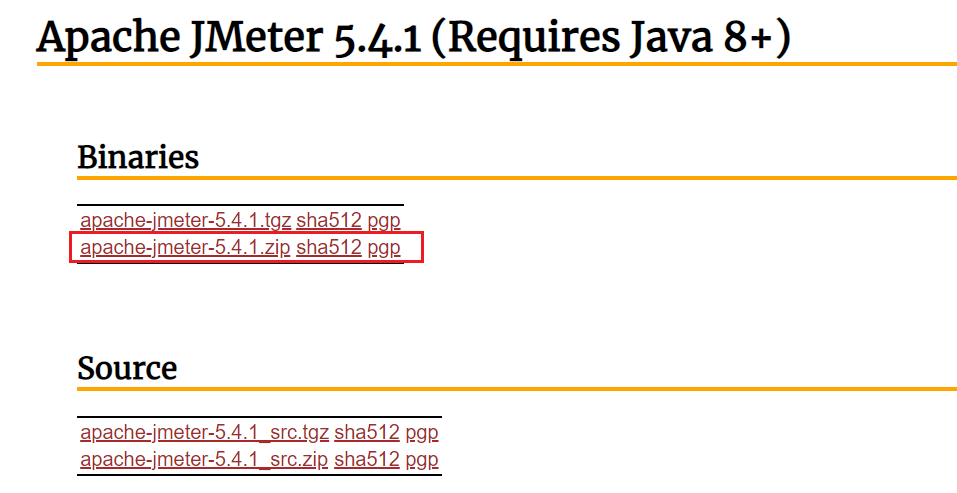
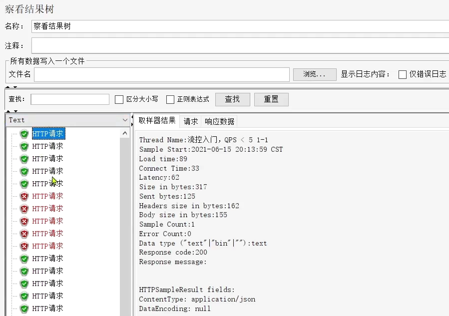

# 【Java开发笔记】Jemter

Jmeter依赖于JDK，所以必须确保当前计算机上已经安装了JDK，并且配置了环境变量。

## 1 安装

### 1.1 下载

可以 Apache Jmeter 官网下载，地址：http://jmeter.apache.org/download_jmeter.cgi

### 1.2 解压

我的解压路径：`/Users/mac/Desktop/Softs/apache-jmeter-5.4.1`

### 1.3 运行

进入 `/bin` 目录，执行 `sh jmeter.sh`

## 2 基本操作

在测试计划上点鼠标右键，选择添加 > 线程（用户） > 线程组：

在新增的线程组中，填写线程信息：

给线程组点鼠标右键，添加http取样器：

编写取样器内容：

添加监听报告：

添加监听结果树：

汇总报告结果：

结果树：

