# 【Java开发笔记】MQ

## 1 MQ基本介绍

### 1.1 同步通讯与异步通讯

微服务间通讯有同步和异步两种方式：

**同步通讯** ：就像打电话，需要 **实时** 响应。

**异步通讯** ：就像发邮件，不需要马上回复。

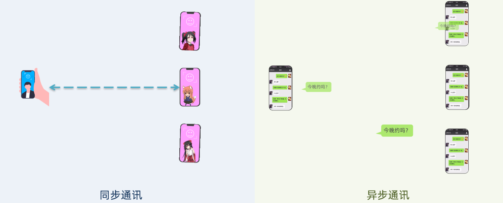

两种方式各有优劣，打电话可以立即得到响应，但是你却不能跟多个人同时通话。发送邮件可以同时与多个人收发邮件，但是往往响应会有延迟。

#### 1.1.1 同步通讯

我们之前学习的 `Feign` 调用就属于 **同步方式** ，虽然调用可以实时得到结果，但存在下面的问题：


同步调用的优点：

- 时效性较强，可以立即得到结果

同步调用的问题：

- 耦合度高
- 性能和吞吐能力下降
- 有额外的资源消耗
- 有 **级联失败** 问题

#### 1.1.2 异步通讯

异步调用则可以避免上述问题。

我们以购买商品为例，用户支付后需要调用 **订单服务** 完成订单状态修改，调用 **物流服务**，从仓库分配响应的库存并准备发货。

在事件模式中，支付服务是 **事件发布者（publisher）**，在支付完成后只需要发布一个支付成功的 **事件（event）**，事件中带上订单 id。

订单服务和物流服务是 **事件订阅者（Consumer）**，订阅支付成功的事件，**监听到事件后完成自己业务即可** 。

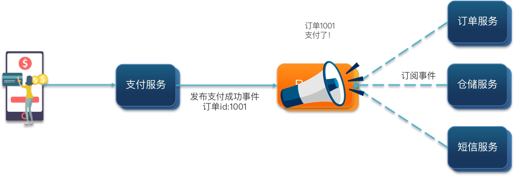

为了解除事件发布者与订阅者之间的耦合，**两者并不是直接通信，而是有一个中间人（Broker）** 。发布者发布事件到 Broker，不关心谁来订阅事件。订阅者从 Broker 订阅事件，不关心谁发来的消息。


Broker 是一个像数据总线一样的东西，所有的服务要接收数据和发送数据都发到这个总线上，这个总线就像协议一样，让服务间的通讯变得标准和可控。

好处：

- 吞吐量提升：无需等待订阅者处理完成，响应更快速

- 故障隔离：服务没有直接调用，不存在级联失败问题
- 调用间没有阻塞，不会造成无效的资源占用
- 耦合度极低，每个服务都可以灵活插拔，可替换
- 流量削峰：不管发布事件的流量波动多大，都由Broker接收，订阅者可以按照自己的速度去处理事件

缺点：

- 架构复杂了，业务没有明显的流程线，不好管理
- 需要 **依赖于 Broker 的可靠、安全、性能**

### 1.2 技术对比

**MQ 中文是 消息队列（Messag eQueue）**，字面来看就是存放消息的队列。也就是事件驱动架构中的 Broker。

比较常见的MQ实现：

- ActiveMQ
- RabbitMQ
- RocketMQ
- Kafka

几种常见MQ的对比：

|            |      **RabbitMQ**       |          **ActiveMQ**          | **RocketMQ** |  **Kafka**   |
| :--------: | :---------------------: | :----------------------------: | :----------: | :----------: |
| 公司/社区  |         Rabbit          |             Apache             |     阿里     |    Apache    |
|  开发语言  |         Erlang          |              Java              |     Java     | Scala & Java |
|  协议支持  | AMQP，XMPP，SMTP，STOMP | OpenWire,STOMP，REST,XMPP,AMQP |  自定义协议  |  自定义协议  |
|   可用性   |           高            |              一般              |      高      |      高      |
| 单机吞吐量 |          一般           |               差               |      高      |  **非常高**  |
|  消息延迟  |       **微秒级**        |             毫秒级             |    毫秒级    |   毫秒以内   |
| 消息可靠性 |           高            |              一般              |      高      |     一般     |

追求可用性：`Kafka、 RocketMQ 、RabbitMQ`

追求可靠性：`RabbitMQ、RocketMQ`

追求吞吐能力：`RocketMQ、Kafka`

追求消息低延迟：`RabbitMQ、Kafka`

## 2 RabbitMQ入门

MQ 的基本结构：


RabbitMQ 中的一些角色：

- `publisher` ：生产者
- `consumer` ：消费者
- `exchange` ：交换机，负责消息路由
- `queue` ：队列，存储消息
- `virtualHost` ：虚拟主机，隔离不同租户的 exchange、queue、消息的隔离

### 2.1 单机部署安装

> 基于 docker 安装过程：

1. 在线拉取

``` sh
docker pull rabbitmq:3.8-management
```

2. 安装运行

执行下面的命令来运行 MQ 容器：

```sh
docker run \
 -e RABBITMQ_DEFAULT_USER=root \
 -e RABBITMQ_DEFAULT_PASS=123456 \
 -v mq-plugins:/plugins \
 --name mq \
 --hostname mq \
 -p 15672:15672 \
 -p 5672:5672 \
 -d \
 rabbitmq:3.8-management
```

浏览器访问：http://192.168.223.132:15672/

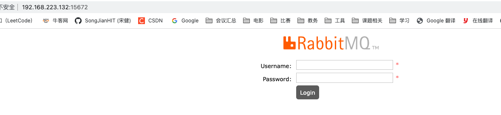

根据命令中的用户名、密码进行登入：

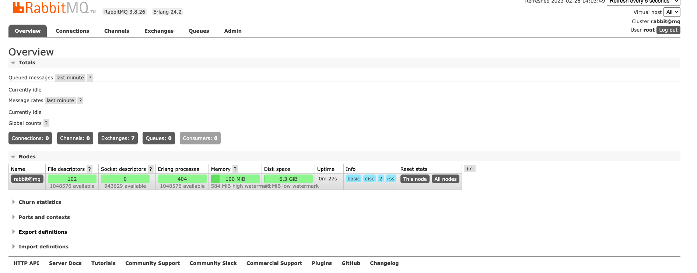

### 2.2 RabbitMQ消息模型


### 2.3 案例

官方的 HelloWorld 是基于最基础的消息队列模型来实现的，只包括三个角色：

- publisher：消息发布者，将消息发送到队列queue
- queue：消息队列，负责接受并缓存消息
- consumer：订阅队列，处理队列中的消息

项目结构：

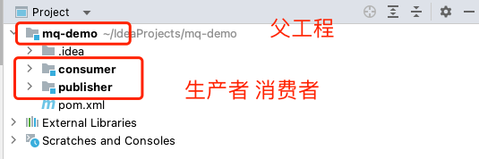

#### 2.3.1 publisher实现

思路：

- 建立连接
- 创建 Channel
- 利用 Channel 声明队列
- 利用 Channel 发送消息
- 关闭连接和 Channel

代码实现：

```java
public class PublisherTest {
    @Test
    public void testSendMessage() throws IOException, TimeoutException {
        // 1.建立连接
        ConnectionFactory factory = new ConnectionFactory();
        // 1.1.设置连接参数，分别是：主机名、端口号、vhost、用户名、密码
        factory.setHost("192.168.223.132");
        factory.setPort(5672);
        factory.setVirtualHost("/");
        factory.setUsername("root");
        factory.setPassword("123456");
        // 1.2.建立连接
        Connection connection = factory.newConnection();

        // 2.创建通道Channel
        Channel channel = connection.createChannel();

        // 3.创建队列
        String queueName = "simple.queue";
        channel.queueDeclare(queueName, false, false, false, null);

        // 4.发送消息
        String message = "hello, rabbitmq!";
        channel.basicPublish("", queueName, null, message.getBytes());
        System.out.println("发送消息成功：【" + message + "】");

        // 5.关闭通道和连接
        channel.close();
        connection.close();

    }
}
```

运行到：`Connection connection = factory.newConnection();` ：

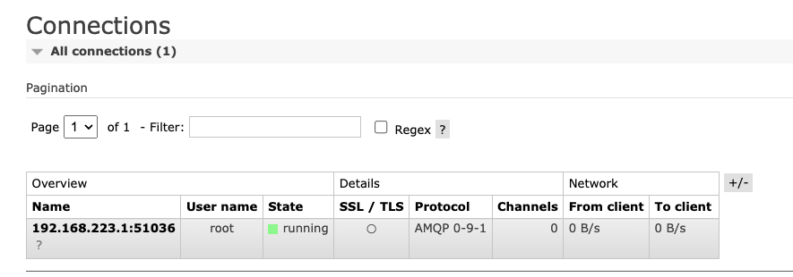

运行到：`Channel channel = connection.createChannel();` ：

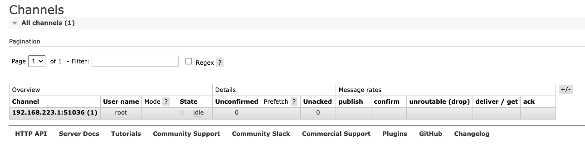

发送消息 `channel.basicPublish("", queueName, null, message.getBytes());` ：

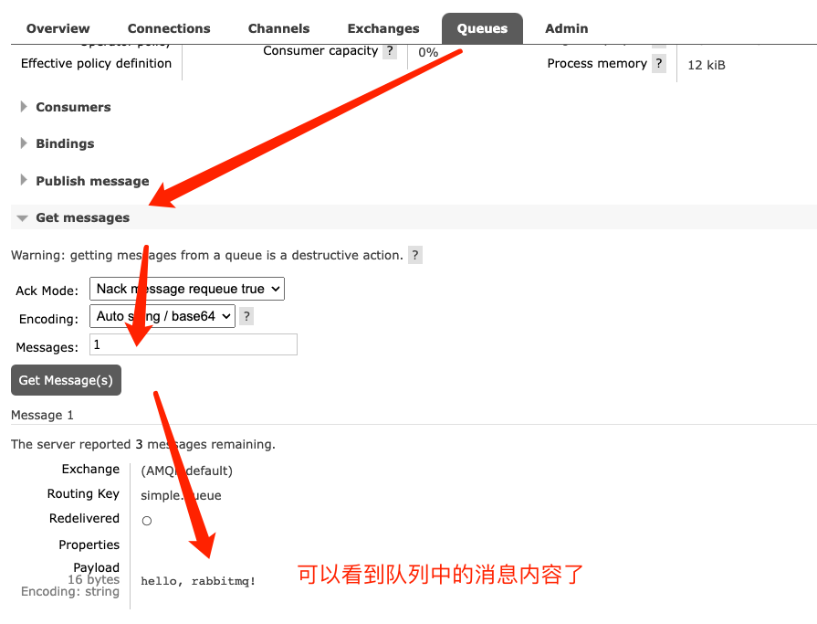

#### 2.3.2.consumer实现

代码思路：

- 建立连接
- 创建Channel
- 利用 Channel 声明队列
- 定义 consumer 的消费行为 `handleDelivery()`
- 利用 channel 将消费者与队列绑定

代码实现：

```java
public class ConsumerTest {

    public static void main(String[] args) throws IOException, TimeoutException {
        // 1.建立连接
        ConnectionFactory factory = new ConnectionFactory();
        // 1.1.设置连接参数，分别是：主机名、端口号、vhost、用户名、密码
        factory.setHost("192.168.223.132");
        factory.setPort(5672);
        factory.setVirtualHost("/");
        factory.setUsername("root");
        factory.setPassword("123456");
        // 1.2.建立连接
        Connection connection = factory.newConnection();

        // 2.创建通道Channel
        Channel channel = connection.createChannel();

        // 3.创建队列
        String queueName = "simple.queue";
        channel.queueDeclare(queueName, false, false, false, null);

        // 4.订阅消息
        channel.basicConsume(queueName, true, new DefaultConsumer(channel){
            @Override
            public void handleDelivery(String consumerTag, Envelope envelope,
                                       AMQP.BasicProperties properties, byte[] body) throws IOException {
                // 5.处理消息
                String message = new String(body);
                System.out.println("接收到消息：【" + message + "】");
            }
        });
        System.out.println("等待接收消息。。。。");
    }
}
```

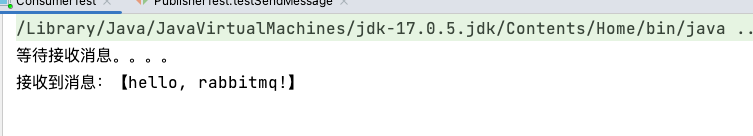

## 3 SpringAMQP

**SpringAMQP** 是基于 **RabbitMQ** 封装的一套 **模板**，并且还利用 SpringBoot 对其实现了自动装配，使用起来非常方便。

SpringAMQP 的官方地址：https://spring.io/projects/spring-amqp

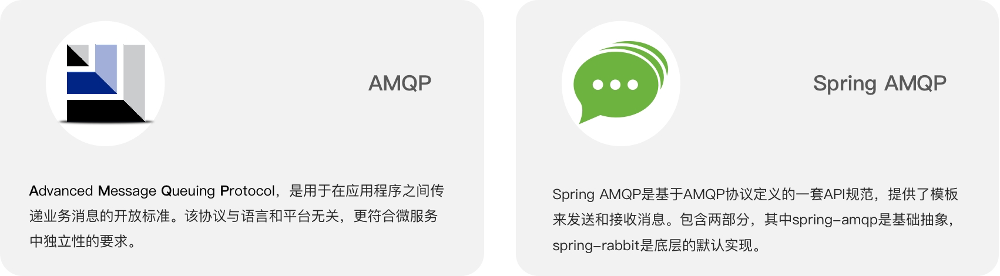

SpringAMQP 提供了三个功能：

- 自动声明队列、交换机及其绑定关系
- 基于注解的监听器模式，异步接收消息
- 封装了 RabbitTemplate 工具，用于发送消息 

### 3.1 BasicQueue

1. **导入依赖**

```xml
<!--AMQP依赖，包含RabbitMQ-->
<dependency>
    <groupId>org.springframework.boot</groupId>
    <artifactId>spring-boot-starter-amqp</artifactId>
</dependency>
```

2. **配置文件**

配置 MQ 地址，在 **publisher** 和 **consumer** 服务的 `application.yml` 中添加配置：

```yaml
spring:
  rabbitmq:
    host: 192.168.223.132 # 主机名
    port: 5672 # 端口
    virtual-host: / # 虚拟主机
    username: root # 用户名
    password: 123456 # 密码
```

3. **编写生产者**

在 **publisher** 服务中编写测试类 SpringAmqpTest，并利用 `RabbitTemplate` 实现消息发送：

```java
@SpringBootTest
public class SpringAMQPTest {

    @Autowired
    private RabbitTemplate rabbitTemplate;

    @Test
    public void testSimpleQueue() {
      	// 队列名称
        String queueName = "simple.queue";
      	// 消息
        String message = "hello, SpringAMQP";
      	// 发送信息
        rabbitTemplate.convertAndSend(queueName, message);
    }
}
```

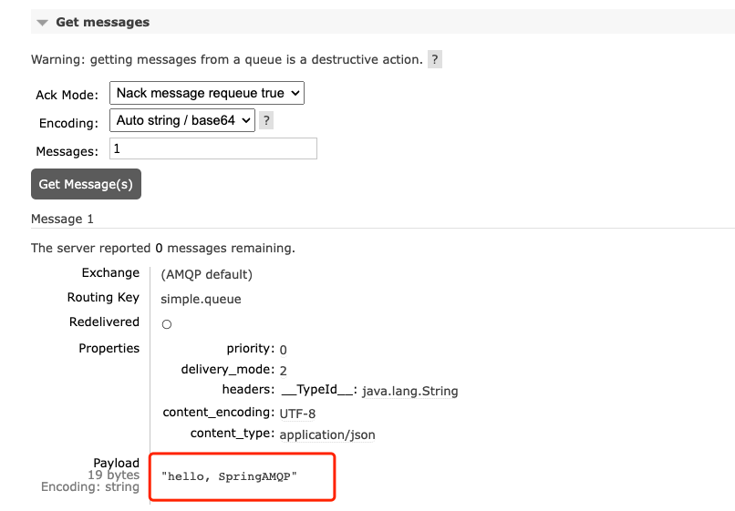

4. **编写消费者**

在 **consumer** 服务中新建一个类 SpringRabbitListener，代码如下：

```java
@Component
public class SpringRabbitListener {

    @RabbitListener(queues = "simple.queue")
    public void listenSimpleQueueMessage(String msg) throws InterruptedException {
        System.out.println("spring 消费者接收到消息：【" + msg + "】");
    }
}
```

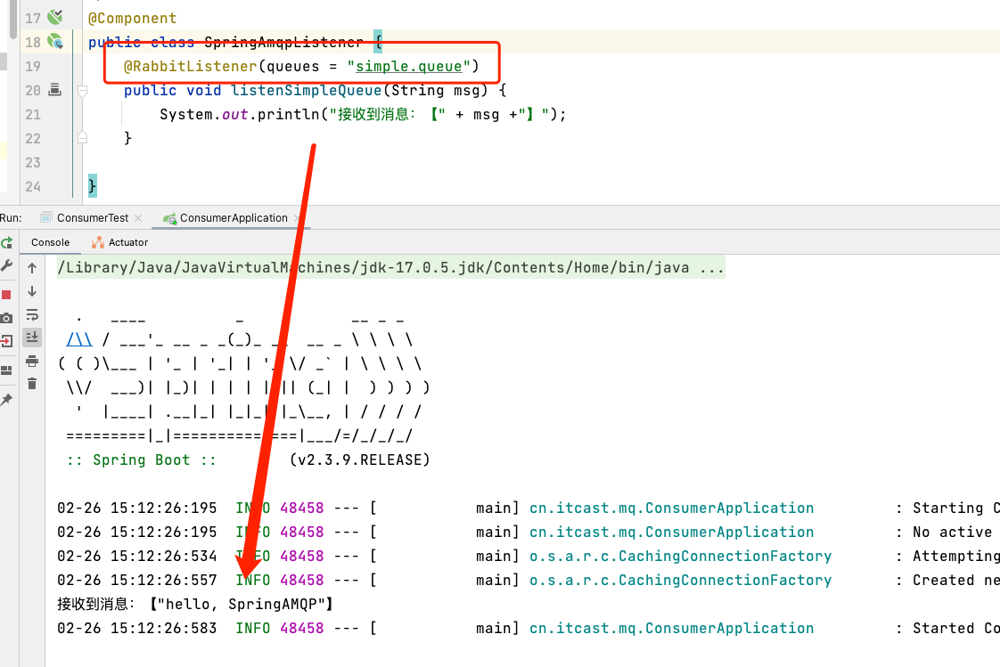

### 3.2 WorkQueue

Work queues，也被称为（Task queues），任务模型。简单来说就是 **让多个消费者绑定到一个队列，共同消费队列中的消息**。


当消息处理比较耗时的时候，可能生产消息的速度会远远大于消息的消费速度。长此以往，消息就会堆积越来越多，无法及时处理。

此时就可以使用 **Work 模型，多个消费者共同处理消息处理** ，速度就能大大提高了。

1. **编写生产者**

在 **publisher** 服务中的 SpringAmqpTest 类中添加一个测试方法，每秒发送 50 条消息：

```java
@Test
public void testWorkQueue() throws InterruptedException {
    String queueName = "simple.queue";
    String message = "hello, message_";

    for (int i = 0; i < 50; i++) {
        rabbitTemplate.convertAndSend(queueName, message + i);
        Thread.sleep(20);
    }
}
```

2. **编写消费者**

```java
@Component
public class SpringAmqpListener {
  
    @RabbitListener(queues = "simple.queue")
    public void listenWorkQueue_1(String msg) throws InterruptedException {
        System.out.println("消费者 1 接收到消息：【" + msg +"】" + LocalTime.now());
        Thread.sleep(10);
    }

  	// 注意到这个消费者 sleep 了 1000 秒，模拟任务耗时
    @RabbitListener(queues = "simple.queue")
    public void listenWorkQueue_2(String msg) throws InterruptedException {
        System.out.println("消费者 2 接收到消息：【" + msg +"】"+ LocalTime.now());
        Thread.sleep(1000);
    }
}
```

3. **消息接收测试**

启动 ConsumerApplication 后，在执行 **publisher** 服务中刚刚编写的发送测试方法 testWorkQueue。

可以看到消费者 1 很快完成了自己的 **25** 条消息。消费者 2 却在缓慢的处理自己的 25 条消息。

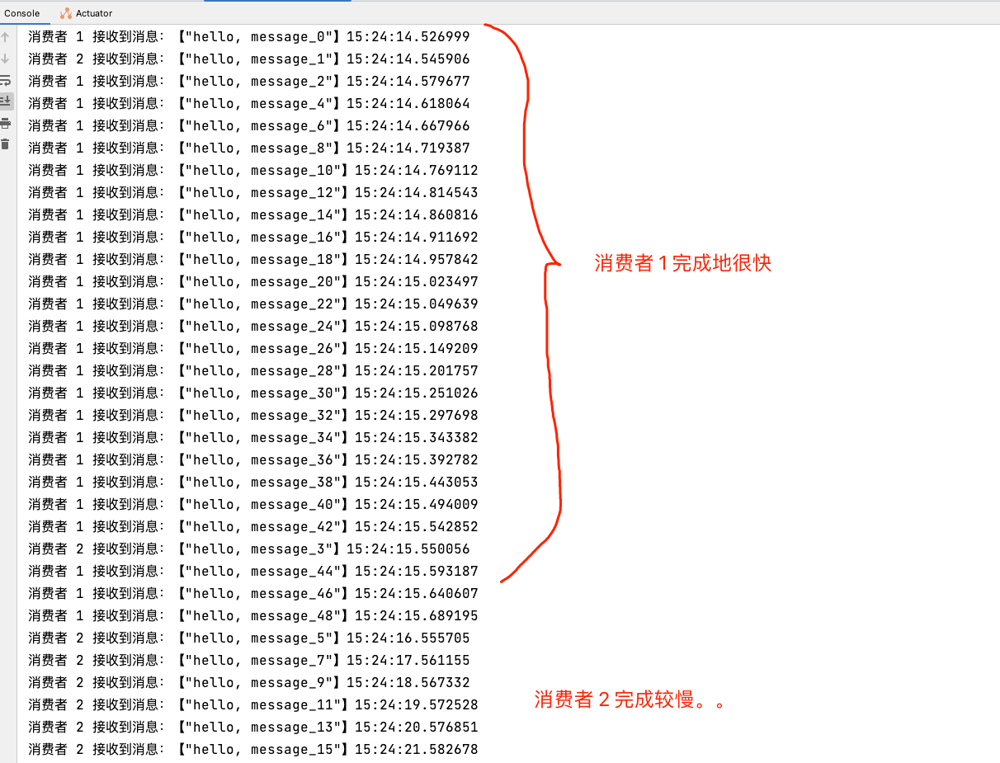

> 也就是说 **消息是平均分配给每个消费者，并没有考虑到消费者的处理能力** 。这样显然是有问题的。

4. **能者多劳配置 —— 配置消息预取数量**

在 spring 中有一个简单的配置，可以解决这个问题。我们修改 **consumer** 服务的 `application.yml` 文件，添加配置：

```yaml
spring:
  rabbitmq:
    listener:
      simple:
        prefetch: 1 # 每次只能获取一条消息，处理完成才能获取下一个消息
```

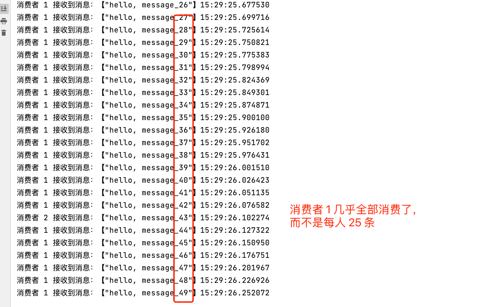


