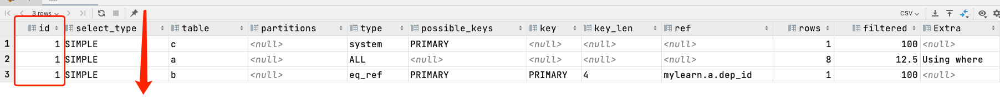
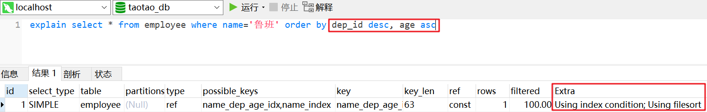
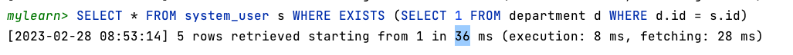

# 【Java开发笔记】Mysql

## 1 MySQL体系结构


**客户端连接**

​    支持接口：支持的客户端连接，例如 C、Java、PHP 等语言来连接 MySQL 数据库。

**第一层：网络连接层**

​    连接池：管理、缓冲用户的连接，线程处理等需要缓存的需求。

**第二层：核心服务层**

​    管理服务和工具：系统的管理和控制工具，例如备份恢复、复制、集群等。 

​    SQL 接口：接受 SQL 命令，并且返回查询结果。

​    查询解析器：验证和解析 SQL 命令，例如过滤条件、语法结构等。 

​    查询优化器：在执行查询之前，使用默认的一套优化机制进行优化sql语句。

​    缓存：如果缓存当中有想查询的数据，则直接将缓存中的数据返回。没有的话再重新查询。

**第三层：存储引擎层**

​    插件式存储引擎：管理和操作数据的一种机制，包括(存储数据、如何更新、查询数据等)

**第四层：系统文件层**

​    文件系统：配置文件、数据文件、日志文件、错误文件、二进制文件等等的保存。

## 2 性能优化概述

在应用开发的过程中，由于前期数据量少，开发人员编写的 SQL 语句或者数据库整体解决方案都更重视在功能上的实现，但是当应用系统正式上线后，随着生产环境中数据量的急剧增长，很多 SQL 语句和数据库整体方案开始逐渐显露出了性能问题，对生产的影响也越来越大，**此时 MySQL 数据库的性能问题成为系统应用的瓶颈，因此需要进行 MySQL 数据库的性能优化。**

### 2.1 为什么要进行数据库优化

1. 避免网站页面出现访问错误

   - 由于数据库连接 timeout 产生页面 5xx 错误

   - 由于慢查询造成页面无法加载

2. **增加数据库的稳定性**

   - 很多数据库问题都是由于低效的查询引起的

3. 优化用户体验

   - 流畅页面的访问速度

### 2.2 性能下降的原因

+ 数据量太大
+ 没有建立索引
+ 建立的 **索引失效** ，建立了索引，在真正执行时有用上建立的索引（通过执行 `explain` 来解决）
+ 关联查询太多 `join` （笛卡尔积）查询语句写的不好，各种连接，各种子查询导致用不上索引
+ 服务器调优及配置参数导致，如果设置的不合理，不恰当，也会导致性能下降，sql 变慢（专业DBA）
+ 系统架构的问题

### 2.3 常见优化方案

+ **索引优化** : 添加适当索引（index）

+ **sql优化** : 写出高质量的 sql，避免索引失效

+ **关联查询** : 不允许超过 3 张表，如果超过说明你表设计不合理，就进行优化和合并

+ **设计优化** : 表的设计合理化（符合3NF，有时候要进行反三范式操作）

+ **架构优化** : 分表技术（水平分割、垂直分割）主从复制，读写分离

+ **配置优化** : 对 MySQL 配置优化（配置最大并发数 `my.ini` , 调整缓存大小）

+ 考虑其他的存储方式（redis/mongodb/es/solr等）

+ 直接修改 MySQL 内核（阿里）

+ **硬件优化**: 增加硬件（CPU/内存/硬盘）


## 3 存储引擎

MySQL 支持的存储引擎有很多，常用的有三种：`InnoDB、MyISAM、MEMORY` 。

特性对比：

- MyISAM 存储引擎：**访问快，不支持事务和外键操作** 。
- InnoDB 存储引擎：**支持事务和外键操作，支持并发控制，占用磁盘空间大。**(MySQL 5.5版本后默认)
- MEMORY 存储引擎：**内存存储，速度快，不安全。适合 小量快速 访问的数据。**

### 3.1 查看存储引擎

```sql
show engines;
```

来查看 mysql 的引擎


我们常用的是 `InnoDB` 和 `MyISAM`，二者有什么区别呢？

#### 2.2 修改存储引擎

```sql
-- 修改存储引擎为MyISAM
ALTER TABLE 表名 ENGINE = MyISAM;

-- 修改存储引擎为InnoDB
ALTER TABLE 表名 ENGINE = InnoDB;
```


所以也就是说，InnoDB 是一起存的，而 MyISAM 是将索引和数据分开存储的。

## 4 索引

索引的分类：

+ 主键索引: primary key（不为空且唯一）

+ 唯一索引: unique index（唯一）

+ 普通索引: index(id) 

+ 联合索引（组合索引）:

  + primary key(id, name): 联合主键索引
  + unique index(id, name): 联合唯一索引
  + index(id, name): 联合普通索引

+ 全文索引: fulltext index（字段名）用于搜索很长一篇文章的时候，效果比较好。

  说明: 最好还是用全文搜索服务 Elasticsearch、solr 来解决。

### 4.0 页与索引

https://javap.blog.csdn.net/article/details/123214731

通过**「行格式」**我们知道了记录在磁盘里的存储格式，除了存储记录的真实数据外，**每条记录还会有额外的头信息、变长字段长度列表、NULL值列表等信息** 。为了更好的管理记录，InnoDB以**「页」**为基本单位，将一条条记录存储在一个个单独的页中，**页内的记录按照主键排序并形成单向链表**，页与页之间通过在File Header里记录上一个和下一个页的页号来形成双向链表。

现有一张仅有两个列的表T，如下所示：

```sql
CREATE TABLE `T` (
  `id` INT NOT NULL,
  `c` VARCHAR(10) DEFAULT NULL,
  PRIMARY KEY (`id`)
) ENGINE=InnoDB ROW_FORMAT=COMPACT;
12345
```

现假设一个页仅能存下三条记录，随着用户记录不断插入，InnoDB不断申请新的索引页，最终结构如下图所示：


现在我们要查询`id=10`的记录，InnoDB会怎么做呢？很遗憾，只能从页1开始一个页一个页的往后找。InnoDB会先将页1从磁盘加载到内存，然后遍历用户记录，判断是否存在`id=10`的记录，没有找到则继续加载页2，然后重复前面的过程，这就是**「全表扫描」**。当然，这个查找的过程也可以偷懒。首先，页内的记录无需全部遍历，**通过Page Directory使用二分法即可快速查找**。其次，找到第一条id>10的记录就不用再往后找了，因为记录是按照id排好序的，后面的记录id也肯定也比10大。

> 页内二分，页间遍历

如何提高根据主键查询记录的效率呢？还记得Page Directory吗？页内的记录是有序的，通过将多条记录划分成一组，将每个组里最大的那条记录的地址偏移量填充到Page Directory的槽里，通过二分法即可快速定位到组。

有没有发现？索引页本身其实和页内记录的分组很像，页内的记录是有序的，页与页之间也是有序的。于是，InnoDB直接借鉴了Page Directory的设计，将每个索引页内最小的主键值提取出来，给所有的索引页再建立一个目录。目录项最少要记录主键值+页号，例如上图中的记录，先给页1创建一个目录项，存储主键值1和页号1；再给页2创建一个目录项，存储主键值4和页号2；以此类推。这些目录项存在哪里呢？有没有发现目录项和用户记录也很像？只是用户记录存储的是用户自定义的列数据，而目录项存储的是主键值+页号。

所以，**InnoDB直接使用索引页来存储目录项，把目录项和用户记录同等对待**，只在记录头信息里通过`record_type`属性做区分，0是用户记录，1是目录项记录，除此之外两者结构完全一样。存放目录项记录的页类型和存放用户记录的页类型也是一样的，都是`0x45BF`。目录项之间也是有序的单向链表，也可以通过Page Directory快速查找等等。

现在假设表的每条记录平均占用约200字节，那么一页16KB可以存储约`16*1024/200`80条记录。假设表有一亿条记录，那么约需要`1250000`个页才能容纳所有记录。现在要给这些页建立目录，假设主键用BIGINT类型占用8字节，页号INT类型占用4字节，记录头信息占用5字节，那么一条目录项记录约占用17字节。光是存储目录项记录就需要约`1250000*17/1024/1024`20MB的空间，远远超过了一个页的大小，怎么办？当然是使用多个页存储了，经过计算，发现需要约`1250000*17/(16*1024)`1300个页来存储目录项记录。

遍历1300个页开销还是太大了，怎么办？俄罗斯套娃，**继续给这1300个页再建立一个目录**，只需要`1300*17/(16*1024)`2个页就够了。最终，数据的组织形式就会变成这样：


是不是很熟悉？这就是传说中的B+树。经过我们上面的计算发现，**哪怕上亿条记录的表，树的高度也就在3到4之间，很少会超过4的**。这意味着你 **根据主键检索记录时，最多只需要加载4个索引页，相较于全表扫描，这快的可不是一星半点儿啊。**

现在我们再来看一下，有索引的情况下，InnoDB通过主键查找记录的流程：

- 先将 B+ 树的「根节点页面」加载到内存，通过 Page Directory 使用二分法快速定位到分组，遍历组内的目录项
- 通过页号定位到第二层页节点，将该节点页加载到内存
- 重复前面的过程，直到定位到叶子节点页，最终获取到记录

加载数据页的个数，其实就是 B+ 树的高度，而且InnoDB **B+树有个特点，就是根节点一旦确定就不会改变，这样InnoDB就可以将根节点页做缓存了，进一步减少页的加载次数**。

根据主键id将记录组织成一棵B+树，这样就可以通过id快速查找记录了。那如果我要根据列c查找，是否也可以使用这棵B+树呢？很抱歉并不能，B+树快速查找有个前提，那就是数据必须有序，很明显，列c在这棵树里并没有顺序，所以是无法使用这棵树的。那如果想通过索引使用列c查找呢？很简单，给列c单独建个索引就好了，语法如下：

```sql
ALTER TABLE T ADD INDEX `idx_c` (c) USING BTREE;
```

上述命令执行完毕后，**InnoDB 就会给列c构建一棵B+树索引，这棵树结构上和主键索引一样，内容上稍有不同**：

**B+树的叶子节点，存储的不再是完整的用户记录，而是列c+id**。要想获取完整的用户记录，需要通过id再去主键索引上再查询一次，这个过程称作「**回表**」。

**为什么不在叶子节点存储完整的用户记录，而是通过id再「回表查询」一次呢？**回表固然影响了效率，但是每棵B+树都存储一份完整的用户记录实在是太浪费空间了。所以，像主键索引这种B+树存储了完整的用户记录的索引叫作「聚簇索引」，像列c这种B+树只存储了主键，需要获取完整的用户记录需要回表查询的索引就叫作**「非聚簇索引」，也叫「二级索引」或「辅助索引」**。

### 4.1 什么是索引？

> 索引是帮助数据库快速查询数据的技术，**终极目的是 减少磁盘 IO 次数！**

**在 MySQL 中索引使用 B+ Tree（N-叉树） 数据结构**，索引类似新华字典的索引目录，可以通过索引目录快速查到你想要的字快速查找数据。索引是解决 SQL 性能问题的重要手段之一，使用索引可以帮助用户解决大多数的 SQL 性能问题。

### 4.2 索引的底层原理

#### 4.2.1 为什么二叉树不能作索引？

> 每层只有两个节点，使得树过于深，发生磁盘 IO 的次数会越频繁。

为了加快数据的查找，可以维护 **二叉查找树** ，每个节点分别包含索引键和一个指向对应数据记录的物理地址的指针，这样就可以运用二叉查找在一定的复杂度内获取相应的数据，从而快速的检索出符合条件的记录。

二叉树作为索引的 **缺点** ：从二叉树的查找过程了来看，**最坏的情况下磁盘 IO 的次数由树的高度来决定** 。二叉树在每层只能存两个节点，层级越来越大越来越深，发生磁盘的 IO 会越频繁。

减少磁盘 IO 的次数就必须要压缩树的高度，让瘦高的树尽量变成矮胖的树，所 以B-Tree 强势登场。


#### 4.2.2 为什么B-Tree不能作索引？

> B-Tree 将数据和索引都存储在节点中，会造成极大的内存浪费和性能消耗，同时不能进行范围查询（没有链表连起来）

B-tree，B 即 Balanced ，**B-Tree** 又称为 **多路平衡查找树**。因为 B 树的原英文名称为 B-Tree，B-Tree 是为磁盘等待外存设备设计的一种平衡查找树。每个节点包含 key 和 data。

系统从磁盘读取数据到内存时以磁盘块 block 为基本单位的，位于同一个磁盘块中的数据会被一次性读取出来，不是需要什么取什么。B-tree 是一种多路平衡搜索树，它类似普通的二叉树，但是 B-tree 允许每个节点有更多的子节点。  


模拟查找关键字 29 的过程:

+ 找到根节点对应的磁盘块1，读入内存。【磁盘I/O操作第1次】
+ 比较关键字29在区间（17,35）。
+ 找到磁盘块3，读入内存。【磁盘I/O操作第2次】
+ 比较关键字29在区间（26,30）。
+ 找到磁盘块8，读入内存。【磁盘I/O操作第3次】
+ 在磁盘块8中的关键字列表中找到关键字29。

> 分析上面过程，发现需要 3 次磁盘 I/O 操作。由于内存中的关键字是一个有序表结构，可以利用二分法查找提高效率。而3次磁盘 I/O 操作是影响整个 B-Tree 查找效率的决定因素。B-Tree 相对于二叉树缩减了节点个数，使每次磁盘 I/O 取到内存的数据都发挥了作用，从而提高了查询效率。

**优点说明**

- **平衡查询树，它对数据会进行自我平衡，**它比二叉树的层级要低，所以查询的性能要比二叉树高很多。
- 和二叉树一样比父节点大的数据存储在右边，小的存储在左边。
- 度（degree）节点的数据存储个数。**度越深代表存储的数据越密，树的层级和高度就越低。** 越利于搜索和存储数据。评价一个索引的好坏一定是进入索引的次数越小越快。
- 节点中数据key从左到右递增排列

**缺点说明**

- **B-tree 数据是存储到每个节点中**，所以每次查询的和维护的时候就会维护索引值又维护了数据，这样会就是造成 **内存的浪费和性能的消耗**。这也是 B+Tree 优化的地方。
- 为了提升度的长度，还需要对这种数据结构进行优化，所以它的升华版 B+Tree 诞生了。

#### 4.2.3 为什么选择B+Tree？

> 1. B树 的非叶子节点不仅存放键值和指针，同时存放数据，而一个页的数据大小为 `16k` ，这样一个页中所存储的键值就会减少，导致整颗 B树 的高度增加，那么查找某个键值的I/O次数变多，耗时变长。而 **B+树 非叶子节点只存储键值，无疑会降低整颗树的高度**，即一颗1000W的数据查找最多也只需要3次磁盘I/O。
> 2. 同时 B+树 的叶子节点为 **循环链表** 数据结构，非常有利于 **范围查询**

B+Tree 在 B-Tree 基础上进行优化，使其更适合实现外存储索引结构。**InnoDB 就是存储引擎就是用 B+Tree。** 

B+Tree 中，**所有 数据记录节点 都是按照键值 大小顺序 存放在同一层叶子节点上，并通过 循环链表 进行连接，而非叶子节点上只存储 key 值信息**，可以大大增大每个节点存储的 key 值的数量，降低 B+Tree 的高度。

B+Tree 是 B-tree 的变体，也是一种多路平衡查找树。


**特点说明**

+ 非叶子节点只存储 key 值，一个磁盘块可以存储更多的key，叶子节点存储key和数据，所有叶子节点之间都有连接指针，提高区间访问能力。

B+Tree **索引的性能分析**

- 一般使用 **磁盘 I/O 次数** 评价索引结构的优劣		
- B+Tree 的度一般会超过 100，因此高度非常小 (一般为3到5之间)，减少磁盘的 IO 次数，性能非常稳定
- B+Tree 叶子节点有顺序指针，更容易做范围查询
- **存储器读取数据按磁盘块读取** 
- **每个磁盘块的大小为扇区（页）的 2 的 N 次方**
- **每个扇区的最小单位 512B 不同的生产厂家不同**

### 4.3 索引操作

#### 查询表中的索引

```sql
show index from 表名;
```


#### 向表中创建索引

```sql
-- 创建主键索引: alter table 表名 add primary key(列名)
ALTER TABLE goods ADD PRIMARY KEY (id);

-- 创建唯一索引: CREATE UNIQUE INDEX 索引名 ON 表名(列名)
CREATE UNIQUE INDEX idx_name ON goods(NAME);

-- 创建普通索引: CREATE INDEX 索引名 ON 表名(列名)
CREATE INDEX idx_price ON goods(price);
```


#### 索引查询对比

我们主要在 `system_user` 上进行实验：


+ **没有使用索引查询**

  ```sql
  -- 根据手机号码查询
  select * from system_user where user_phone = '15400008514';
  ```

  

+ **使用索引查询**

  ```sql
  -- 创建索引
  create index user_phone_index on system_user(user_phone);
  -- 根据手机号码查询
  select * from system_user where user_phone = '15400008514';
  ```

  

- 测试某些列不适合建立索引

  - 通过性别查询用户

    ```sql
    -- 通过性别查询用户
    SELECT * FROM SYSTEM_USER WHERE user_sex=1 LIMIT 100000000;
    ```

    

  - 给性别建立索引

    ```sql
    -- 给性别建立索引
    CREATE INDEX user_sex_index ON SYSTEM_USER(user_sex);
    
    -- 通过性别查询用户
    SELECT * FROM SYSTEM_USER WHERE user_sex=1 LIMIT 100000000;
    ```

    

#### 删除索引

```sql
-- 删除主键索引(非自增长): alter table 表名 drop primary key
ALTER TABLE goods DROP PRIMARY KEY;

-- 删除唯一索引和普通索引: DROP INDEX 索引名 ON 表名
DROP INDEX idx_name ON goods;
DROP INDEX idx_price ON goods;
```

#### 查看索引详解

```sql
-- SHOW INDEX FROM 表名
show index from system_user;
```

 

字段解析：

+ Table: 表的名称。
+ Non_unique: 如果索引不能包括重复词则为0，如果可以重复则为1。
+ Key_name: 索引的名称。
+ Seq_in_index: 索引中的序列号，从1开始。
+ Column_name: 列名称。
+ Collation: 列以什么方式存储在索引中。在MySQL中，‘A’（升序）或 NULL（无分类）。
+ **Cardinality**: 基数，**基数** 越大，越适合建立索引，当进行查询时，MySQL 使用该索引的机会就越大。
+ Sub_part: 如果列只是被部分地编入索引，则为被编入索引的字符的数目。如果整列被编入索引，则为NULL。
+ Packed: 关键字如何被压缩。如果没有被压缩，则为 NULL。
+ Null: 如果列含有 NULL，则含有 YES。如果没有，则该列含有 NO。
+ Index_type: 索引存储数据结构（BTREE, FULLTEXT, HASH, RTREE）。
+ Comment: 评论。

### 4.4 InnoDB聚簇索引

>数据文件: 本身就是索引文件
>表数据文件本身就是按照 B+Tree 组织的一个索引结构文件
>**主键索引的叶节点包含了完整的数据记录，非主键索引的叶子节点指向主键**

 

+ InnoDB: 没有 `.MYD` 和 `.MYI` ，`.frm` 文件（包括的数据结构和索引结构），其数据文件对应于 `ibdata(1..n)` 文件中。
+ InnoDB: 在实际的开发中 **一定要建立主键**，因为索引都是通过主键索引获取和查找的。在开发过程中如果你使用的是 Innodb 引擎一定要建立一个主键列。

### 4.5 MyISAM非聚簇索引

非聚簇是指: **索引文件和数据文件是分离的，叶子节点存储的是数据的磁盘地址**，非主键索引和主键索引类似。


> 说明: `.frm` 表结构文件、`.MYD` 表数据文件、`.MYI` 表索引文件。

### 4.6 索引的优劣

#### 4.6.1 索引优势

+ 可以通过建立唯一索引或者主键索引，保证数据库表中每一行数据的 **唯一性** 。

+ 建立索引，减少表的检索行数，大大 **提高查询性能** 。

+ 在表连接的连接条件可以加速表与表之间的相连。

#### 5.2 索引劣势

+ 在 **创建索引和维护索引会耗费时间** ，随着数据量的增加而增加。

+ **索引文件会占用物理空间**，除了数据表需要占用物理空间之外，每一个索引还会占用一定的物理空间。

+ 当对表的数据进行 INSERT，UPDATE，DELETE 的时候，**索引也要动态的维护，这样就会降低增删改数据的速度** 。(建立索引会占用磁盘空间的索引文件。一般情况这个问题不太严重，但如果你在一个大表上创建了多种组合索引，索引文件的会膨胀很快)。


#### 4.6.3 注意事项【重点】

+ 建立索引后需要注意的问题?

  - **增，删，改都会触发索引重建，并且会产生锁**
  - **删除尽量逻辑删除，不要物理删除，防止索引重建**（is_delete=0 未删除；1 删除）
  - 尽量不要更新索引的列

+ 哪些列适合建立索引?

  + 不经常变动的列: 主键、手机号码、邮箱、订单编号、UUID、身份证。

- 哪些列不适合建立索引?
  - 经常变动的列: 昵称，余额。
  - 数据比例种类太少的列（数据离散程度不高，可能存在大量重复数据的列）: 年龄、性别、状态。

 **公式: 用当前表中某列的去重数/表总记录数 == 1(接近1)，那么这种列就特别适合建立索引。**

```sql
select   COUNT( DISTINCT `user_sex`) / count(*) from system_user;
```

### 4.7 B+树索引的特性

**1、根节点固定不变**
一张全新的表，它的聚簇索引B+树默认会生成一个根节点，但是里面的记录是空的。当我们插入记录时，会先插入到根节点中，根节点“满”了就会再申请两个新的页，然后将数据拷贝到这两个新页中，根节点自动升级为目录项节点，存储的不再是用户记录，而是目录项记录。不管表里的数据怎么变，B+树的根节点始终都不会改变。**InnoDB会将索引树的根节点的页号存储在某个地方便于管理**，根节点固定不变，**也便于InnoDB将根节点缓存起来，减少一次磁盘IO**。

**2、目录项记录的唯一性**
InnoDB允许创建「非唯一索引」，这意味着二级索引B+树中可能存在**大量索引值相同的目录项**，如果连续的页索引值都相同，那意味着内节点中会有两条索引值相同的目录项记录。此时，如果再插入一条索引值相同的记录，那到底该插入到哪一个页里呢？这种情况下InnoDB也不知道该怎么办了。所以，**对于非唯一索引，B+树中的目录项记录除了记录索引列+页号外，还会额外存储主键id，确保目录项记录是唯一且有序的，索引值相同则按照id排序**。

**3、一个页面最少存储2条记录**
B+树快速检索的本质是因为它每经过一个节点都可以快速的过滤掉大量的无效节点，大大的减少了索引页的加载次数。**理论上来说，单个索引页包含的记录数越多，查询的效率就越高。**我们上面计算过，一个页面可以包含约80条200字节的用户记录、约960条目录项记录，这样即使上亿条记录树的高度也不会超过4。**一旦页内包含的记录数少了，B+树就会变高，查询效率会指数级下降。**所以，为了防止极端情况出现，InnoDB规定，单个索引页内最少包含2条记录。

## 5 执行计划Explain

### 5.1 语法

```mysql
-- 使用Explain关键字 放到sql语句前
explain select * from system_user where id = 1;
```


### 5.2 作用

通过 explain 可以让我们知道：

- SQL 语句的执行顺序
- SQL 查询语句是否命中索引
- 分析查询语句或表结构的性能瓶颈

### 5.3 列名

|                 列名                 | 说明                                                         |
| :----------------------------------: | :----------------------------------------------------------- |
|   <font color="red">**id**</font>    | 查询标识符，SQL 执行的顺序标识符，SQL 从大到小的执行。       |
|             select_type              | 显示本行是简单或复杂查询t。如果查询有任何复杂的子查询，则最外层标记为 PRIMARY（DERIVED、UNION、UNION RESUlT） |
|  <font color="red">**table**</font>  | 访问哪张表                                                   |
|              partitions              | 在分区数据库中，一个表可以分布在一个或多个数据库分区中       |
|  <font color="red">**type**</font>   | 访问类型（ALL、index、range、ref、eq_ref、const、system）    |
|            possible_keys             | 显示 MySQL 可能采用哪些索引来优化查询                        |
|   <font color="red">**key**</font>   | 显示 MySQL **决定** 采用哪个索引来优化查询                   |
| <font color="red">**key_len**</font> | 显示索引所使用的字节数                                       |
|                 ref                  | 显示查询时所引用到的索引(关联查询)                           |
|                 rows                 | 粗略估算整个查询需要检查的行数(如果值越大，查询速度就越慢)   |
|               filtered               | 过滤行的百分比                                               |
|                Extra                 | 额外信息（用了where条件、用了排序、用了分组）等              |

#### id查询标识符

id查询标识符，SQL 执行的顺序的标识，SQL 从大到小的执行。

若 id 值相同，则由上到下执行：

```sql
-- id值相同, 由上到下执行
EXPLAIN SELECT * from employee a, department b, customer c where a.dep_id = b.id and a.cus_id = c.id;
```



若 id 值不同，则 id 大到小执行：

```sql
EXPLAIN SELECT * from department WHERE id = (SELECT id from employee WHERE id=(SELECT id from customer WHERE id = 1));
```


若 id 值相同，又包含不同，不同的由大到小执行，相同的由上到下执行：

```sql
-- id值相同 不同都存在, 不同的由大到小执行，相同的由上到下执行 deriverd 衍生出来的虚表
EXPLAIN select * from department d, (select dep_id from employee group by dep_id) t where d.id = t.dep_id;
```


#### select_type查询类型

查询类型: 主要用来区分是 **普通查询**、**联合查询**、**子查询** 等。

|   查询类型   | 说明                                                         |
| :----------: | ------------------------------------------------------------ |
|    SIMPLE    | 简单查询，查询中不包含子查询或者union                        |
|   PRIMARY    | 查询中如果包含子查询或union，最外层查询则被标记为primary     |
|   SUBQUERY   | 查询时包含了子查询                                           |
|   DERIVED    | from列表中包含了子查询就会标记为derived(派生表)，查询结果放在临时表中 |
|    UNION     | 查询时包含了union查询                                        |
| UNION RESULT | UNION合并的结果集                                            |

```sql
-- union联合查询
EXPLAIN select * from employee e LEFT JOIN department d on e.dep_id = d.id
UNION 
select * from employee e RIGHT JOIN department D ON e.dep_id = d.id;
```


#### type访问类型

衡量 sql 语句性能好坏的参考指标，**以消除ALL为己任**，如果出现 ALL 代表没有命中索引，是 **全表查询**。


`system`: 主键、唯一索引扫描（表中只有一行数据，`MyISAM`引擎）

```sql
-- 表 customer 中只有一条数据
EXPLAIN SELECT id FROM customer WHERE id = 1;
```


`const`：主键、唯一索引扫描（主键列、唯一列查询）

```sql
-- 表示通过索引一次就找到了，const用于primary key 或者 unique索引。
explain select * from system_user where id = 1;
```


`eq_ref`: 主键、唯一索引扫描（关联查询比较时用）

```sql
-- 常见于主键或唯一索引扫描，一对一的情况下会出现比较多
EXPLAIN select * from employee e, department d where e.id = d.id;
```


`ref`: 非唯一索引扫描（index）

```sql
EXPLAIN select * from system_user where user_phone = '15400008514';
```


`range`: 范围索引扫描（between、in、>=、like）等操作

```sql
EXPLAIN select * from system_user where id < 3;
EXPLAIN SELECT * FROM SYSTEM_USER WHERE id IN (3, 5, 7, 8);
EXPLAIN select * from system_user where user_phone like '1540000851%';
```


`index`: 全索引扫描，遍历整个索引树


`ALL`: 全表扫描，MySQL 将遍历全表数据直至找到匹配的行 （**不走索引**）


> 说明: 一般来说，保证查询至少达到 `range` 级别，最好能达到 `ref` 。
> 注意: 数据很少的情况下，MySQL 优化器可能会直接走表查询而不会走索引查询。因 为MySQ L优化器觉得走表或走索引是差不多的。

#### possible_keys

显示 MySQL 可能采用哪些索引来优化查询：

```sql
-- 为dep_id创建普通索引
create index dept_index on employee(dep_id);
--  可能不会用到索引，实际用到索引
explain select dep_id from employee;
```


```sql
-- 可能会使用索引，实际没用到索引
explain select * from employee e, department d where e.dep_id = d.id;
```


#### key

显示 MySQL 决定采用哪个索引来优化查询

```sql
explain select * from employee where id = 1;
```


#### key_len索引长度

```sql
-- 表示索引所使用的字节数，可以通过该列计算出使用的索引长度
explain select * from employee where dep_id = 1 and name = '鲁班' and age = 10;
```


#### ref引用索引

显示查询时所引用到的索引

```mysql
-- 显示查询时所引用到的索引
explain select e.dep_id from employee e, department d, customer c where e.dep_id = d.id and e.cus_id = c.id and e.name = '鲁班';
```

  

#### rows检查行数

粗略估算整个查询需要检查的行数（如果值越大，查询速度就越慢）

它体现建立索引以后，优化的行数，越小速度越快，如果你建立索引，type=ref并且也命中到了，但是row还很大，那说明该表已经没有建立索引的意义了，已经优化到了极限(索引不是万能的)，你需要通过其它持术手段来优化。

比如：分库分表、缓存、把数据迁移到es/solr。

```sql
create index user_name_index on system_user(user_name);

explain select * from system_user where user_name like '田%';
```


#### Extra额外信息

额外信息（用了where条件、用了排序、用了分组）等

```sql
-- Using where; Using filesort
explain select * from employee where dep_id = 1 ORDER BY cus_id;
```

  

```mysql
-- Using where; Using temporary; Using filesort
explain select cus_id from employee where dep_id in (1,2,3) GROUP BY cus_id;
```


## 6 避免索引失效

### 6.1 全部匹配

```sql
-- 删除部门索引 
drop index dept_index on employee;
-- 创建联合索引
create index name_dep_age_idx on employee(name, dep_id, age);
-- 索引列全部用上(命中索引)
explain select * from employee where name = '鲁班' and dep_id = 1 and age = 10;
```


### 6.2 联合索引的最左匹配原则

创建联合索引：

```sql
create index name_dep_age_idx on employee(name, dep_id, age);
```


> **最左匹配原则：搜索时必须出现最左边的元素（这里为 `name` ）作为条件，否则索引失效！**

```sql
-- 去掉name条件(索引失效)
explain select * from employee where dep_id = 1 and age = 10;
```


```sql
-- 去掉dep_id(命中name索引)
explain select * from employee where name = '鲁班' and age = 10;
```


### 6.3 索引列使用函数（不走索引）

> **在索引列上使用函数，会使得索引失效！**

```sql
-- 在name列上加去除空格的函数(索引失效)
explain select * from employee where TRIM(name) = '鲁班' and dep_id = 1 and age = 10;
```


### 6.4 范围条件

```sql
-- 联合索引使用范围条件(范围后的索引失效)
explain select * from employee where name = '鲁班' and dep_id > 1 and age = 10;
```


### 6.5 比较运算符(!=或者<>、>、>=)索引可能失效

```sql
-- 创建age_index索引
create index age_index on employee(age);
-- 使用不等于(!=或者<>)索引失效
explain select * from employee where age != 10;
-- 使用大于(>)索引失效
explain select * from employee where age > 10;
-- 使用大于等于(>=)索引失效
explain select * from employee where age >= 10;
```

  

### 6.6 is not null 索引失效

```sql
-- 创建name_index索引
create index name_index on employee(name);
-- is not null
explain select * from employee where name is not NULL;
```


### 6.7 like 索引失效

```sql
-- %开头 (索引失效)
explain select * from employee where name like '%鲁';

-- x%结尾(命中索引) 推荐写法
explain select * from employee where name like '鲁%';
```

### 6.8 字符串不加引号（索引失效）

```sql
explain select * from employee where name = '200';
explain select * from employee where name = 200;
```


### 6.9 使用or索引失效

```sql
explain select * from employee where name = '鲁班' or age > 10;
```


### 6.10 使用全索引

```sql
-- 全索引: 需要查询的列全部是索引列
-- 上面情况会触发全表扫描，不过若使用了全索引，则会只扫描索引文件
explain select name,dep_id,age from employee where name = '鲁班' or age > 10;
```


### 总结

- 联合索引，**采用最左匹配原则**。
- 索引列，最好不要出现(!=、<>、>、>=、or、is not null、内置函数、数据类型要正确)。
- 如果采用 like 查询，**%在后面走索引**。

## 7 排序与分组优化

两个注意的点：

- 联合索引必须按照创建的顺序来，否则走 `filesort`
- 必须同升降，否则 `filesort`

<font color="red">**我们的目标是消灭 Using filesort**</font>: 避免排序时使用文件排序。

> **注意: **
>
> - order by 本身是不会走索引，如果你想要 order by 走索引，那么必须前面的 where 一定要有索引，并且遵循最左匹配原则。
> - group up 与 order by 情况类似，分组必定触发排序。

注意1:

```sql
-- 如果排序的字段没有建立索引，会使用文件排序（USING filesort），文件排序的效率是相对较低的，我们要避免文件排序
explain select * from employee order by name, dep_id, age;
```

  

注意2:

```sql
-- select语句使用到联合索引中的列(最左匹配原则) 使用索引排序
explain select * from employee where name='鲁班' order by dep_id, age;
```

  

注意3:

```sql
-- 联合索引在order by后面顺序不一致。会使用文件排序
explain select * from employee where name='鲁班' order by age, dep_id;
```

  

注意4:

```sql
-- 排序使用一升一降，会使用文件排序
explain select * from employee where name='鲁班' order by dep_id desc, age asc;
```

  

## 8 大数据量分页优化

分页是我们经常使用的功能，在数据量少时单纯的使用 `limit m, n` 不会感觉到性能的影响，但我们的数据达到成百上千万时，就会明显查询速度越来越低。

```mysql
-- 测试一下大数据量分页查询
-- limit 0,20 时间: 0.002s
select * from system_user limit 0, 20;
-- limit 10000,20 时间: 0.006s
select * from system_user limit 10000, 20;
-- limit 100000,20 时间: 0.048s
select * from system_user limit 100000, 20;
-- limit 1000000,20 时间: 0.991s
select * from system_user limit 1000000, 20;
-- limit 3000000,20 时间: 2.251s
select * from system_user limit 3000000, 20;
```

### 8.1 使用id限定

条件比较苛刻！

```mysql
-- 使用id限定方案，将上一页的ID传递过来，根据id范围进行分页查询
-- 通过程序的设计，持续保留上一页的ID，并且ID保证自增
select * from system_user where id > 3000000 limit 20;
```


### 8.2 子查询优化

利用索引查询出对应的所有ID，再通过关联查询，查询出对应的全部数据，性能有了明显提升(失去了默认的按主键id排序)

```mysql
-- 通过explain发现，之前我们没有利用到索引，这次我们利用索引查询出对应的所有ID
-- 再通过关联查询，查询出对应的全部数据，性能有了明显提升(失去了默认的按主键id排序)
-- limit 3000000,20 时间:  2.251s -> 时间: 1.364s
explain select * from system_user u, (select id from system_user limit 3000000, 20) t where u.id = t.id;

-- 需要指定id排序
explain select * from system_user u, (select id from system_user ORDER by id limit 3000000, 20) t where u.id = t.id;
```


## 9 小表驱动大表

### 9.1 exists介绍

exists：表示存在，**当子查询有结果，就会显示主查询中的数据** 。当子查询没有结果，就不会显示主查询中的数据。

```sql
SELECT * FROM employee WHERE EXISTS (SELECT * FROM employee WHERE id=8);
```

### 9.2 关联查询

MySQL 表关联的算法是 Nest Loop Join（嵌套循环连接），**是通过驱动表的结果集作为循环基础数据，然后一条一条地通过该结果集中的数据作为过滤条件到下一个表中查询数据，然后合并结果。**

**如果小的循环在外层，外层表只需要锁 5 次，如果 1000 在外，则需要锁 1000 次，从而浪费资源，增加消耗。**这就是为什么要小表驱动大表。

> 总结: **多表关联查询时，一定要让小表驱动大表** 。

### 9.3 in & exists

```sql
-- 使用in 时间:  27 ms 
select * from system_user where id IN (select id from department);

使用department表中数据作为外层循环 5次
for(select id from department d)
	每次循环执行system_user表中的查询 300万次
	for( select * from system_user e where e.dep_id=d.id)
```


```sql
-- 使用exists 时间: 36 ms
SELECT * FROM system_user s WHERE EXISTS (SELECT 1 FROM department d WHERE d.id = s.id);

使用system_user表中数据作为外层循环 300万次
for(select * from system_user e)
	每次循环执行department表中的查询 5次
	for( select 1 from department d where d.id = e.dep_id)
```



**小结** 

+ 当 A 表数据多于 B 表中的数据时，使用 in 优于 exists。
+ 当 A 表数据小于 B 表中的数据时，使用 exists 优于 in。
+ 如果两张表数据量差不多，那么它们的执行性能差不多。

## 10 慢查询性能分析

### 10.1 慢查询日志介绍

MySQL 的 **慢查询日志** 是 MySQL 提供的一种日志记录，**它用来记录在 MySQL 中响应时间超过阀值的语句**，MySQL 的日志是跟踪MySQL 性能瓶颈的最快和最直接的方式了，系统性能出现瓶颈的时候，首先要打开慢查询日志，进行跟踪，尽快的分析和排查出执行效率较慢的 SQL ,及时解决避免造成不好的影响。

### 10.2 开启慢查询日志

```sql
-- 查看慢查询日志变量
show variables like '%slow_query_log%';
show variables like '%slow_query_log_file%';
show variables like '%long_query_time%';


-- 开启方式一: 只对当前数据库生效，MySQL重启后，会失效 0=OFF 1=ON
set global slow_query_log=1;
set global long_query_time=0.2;


-- 开启方式二: 想永久生效，提供配置文件my.ini(推荐)
slow_query_log=1
slow_query_log_file=日志文件存储路径
# 设置慢查询的阈值(默认: 10s)
long_query_time=0.2;
```


执行一条慢sql：

```sql
select * from system_user limit 3000000;
```


### 10.3 慢查询日志分析

慢查询日志中可能会出现很多的日志记录，我们可以通过慢查询日志工具进行分析，MySQL 默认安装了
mysqldumpslow.pl 工具实现对慢查询日志信息的分析。

> 检查是否已安装perl环境: perl -v
>
> 说明: 需要安装perl脚本环境下载地址: <https://www.perl.org/get.html> 

```sql
-- 得到返回记录集最多的10个SQL。
perl mysqldumpslow.pl -s r -t 10 F:\mysqlslowquery.log
-- 得到访问次数最多的10个SQL
perl mysqldumpslow.pl -s c -t 10 F:\mysqlslowquery.log

Count: 2（执行了多少次）
Time=6.99s(13s) 平均执行的时间（总的执行时间）
Lock=0.00s(0s)（等待锁的时间）
Rows=1661268.0（每次返回的记录数） (3322536)（总共返回的记录数)
username[password]@[localhost]
```

   

参数说明:

```txt
-s 按照那种方式排序
   c: 访问统计
   l: 锁定时间
   r: 返回记录
   al: 平均锁定时间
   ar: 平均访问记录数
   at: 平均查询时间
   
-t 是top，返回多少条数据。

-g 可以跟上正则匹配模式，大小写不敏感。
```
