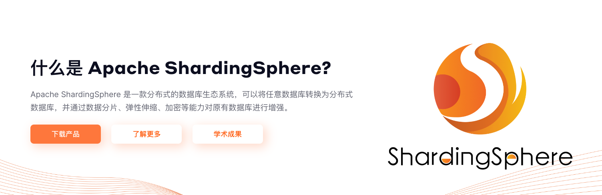
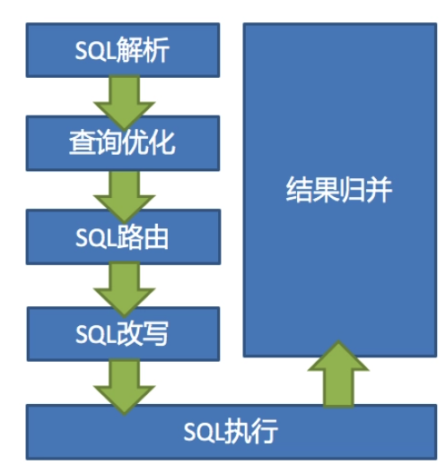

# 【Java开发笔记】ShardingShpere

## 1 基本介绍



`Apache ShardingSphere` 是一套开源的 **分布式数据库** 中间件解决方案组成的生态圈，它由 **JDBC**、Proxy 和 Sidecar（规划中）这 3 款相互独立，却又能够混合部署配合使用的产品组成。 它们均提供标准化的 **数据水平扩展、分布式事务和分布式数据库治理** 功能，可适用于如 Java 同构、异构语言、云原生等各种多样化的应用场景。

它关注如何充分合理地 **利用数据库的计算和存储能力**，而并非实现一个全新的数据库。它站在数据库的上层视角，关注它们之间的协作多于数据库自身。

## 2 Sharding-JDBC架构

`Sharding-JDBC` 定位为轻量级 Java 框架，在 Java 的 JDBC 层提供的额外服务。它使用客户端直连数据库，**以 jar 包形式提供服务，无需额外部署和依赖**，可理解为增强版的 JDBC 驱动，完全兼容 JDBC 和各种 ORM 框架。

- 适用于任何基于 JDBC 的 ORM 框架，如：JPA, Hibernate, Mybatis, Spring JDBC Template 或直接使用 JDBC；
- 支持任何第三方的数据库连接池，如：DBCP, C3P0, BoneCP, HikariCP 等；
- 支持任意实现 JDBC 规范的数据库，目前支持 MySQL，PostgreSQL，Oracle，SQLServer 以及任何可使用 JDBC 访问的数据库。

### 2.1 相关概念

#### 逻辑表(LogicTable)

进行 **水平拆分** 的时候同一类型（逻辑、数据结构相同）的表的总称。例如，用户数据根据主键尾数拆分为两张表，分别是 `table_user_0` 与 `table_user_1`，他们的逻辑表表名为 `table_user`。

> **`Sharding-JDBC` 通过操作逻辑表，从而间接达到操作真实表的目的。**

#### 真实表(ActualTable)

在分片的数据库中真实存在的物理表，即上述 `table_user_0` 与 `table_user_1`

#### 数据节点(DataNode)

数据分片的最小单元，由数据源名称和数据表组成。也就是，**具体到 指定库 下的 指定表，就是一个数据节点。**

#### 动态表(DynamicTable)

逻辑表和物理表不一定需要在配置规则中静态配置。如，按照日期分片的场景，物理表的名称随着时间推移会产生变化。

#### 广播表

指 **所有的分片数据源中都存在的表**，表结构和表中数据在 **每个数据库均完全一致**，适用于数据量不大且需要与海量数据的表进行关联查询的场景。比如省份信息表，全国也就30多条数据，这种表在每一个节点上都是一样的。

#### 绑定表(BindingTable)

指 **分片规则一致的主表和子表**。例如：`t_order` 表和 `t_order_item` 表，均按照 `order_id` 分片，则此两张表互为绑定表关系。绑定表之间的多表关联查询不会出现 `笛卡尔积` 关联，关联查询效率将大大提升。如果 SQL 为：

```sql
SELECT i.* FROM t_order o JOIN t_order_item i ON o.order_id=i.order_id WHERE o.order_id in (10, 11);
```

在不配置绑定表关系时，假设分片键 `order_id` 将数值 10 路由至第 0 片，将数值 11 路由至第 1 片，那么路由后的 SQL 应该为 4 条，它们呈现为笛卡尔积：

```sql
SELECT i.* FROM t_order_0 o JOIN t_order_item_0 i ON o.order_id=i.order_id WHERE o.order_id in (10, 11);

SELECT i.* FROM t_order_0 o JOIN t_order_item_1 i ON o.order_id=i.order_id WHERE o.order_id in (10, 11);

SELECT i.* FROM t_order_1 o JOIN t_order_item_0 i ON o.order_id=i.order_id WHERE o.order_id in (10, 11);

SELECT i.* FROM t_order_1 o JOIN t_order_item_1 i ON o.order_id=i.order_id WHERE o.order_id in (10, 11);
```

在配置绑定表关系后，路由的 SQL 应该为 2 条：

```sql
SELECT i.* FROM t_order_0 o JOIN t_order_item_0 i ON o.order_id=i.order_id WHERE o.order_id in (10, 11);

SELECT i.* FROM t_order_1 o JOIN t_order_item_1 i ON o.order_id=i.order_id WHERE o.order_id in (10, 11);
```

#### 分片键(ShardingColumn)

分片字段用于将数据库（表）**水平拆分** 的字段，支持单字段及多字段分片。例：将用户表中的用户 ID 取模分片，则用户 ID 为分片字段。SQL中如果无分片字段，将执行全路由，性能较差。

### 2.2 执行原理

当 Sharding-JDBC 接受到一条 SQL 语句时，会陆续执行 `SQL解析 -> 查询优化 -> SQL路由 -> SQL改写 -> SQL执行 ->结果归并` ，最终返回执行结果。



- **SQL解析**：过程包括词法解析和语法解析。词法解析器用于将SQL拆解为不可再分的原子符号，称为Token。并根据不同数据库方言所提供的字典，将其归类为关键字、表达式、字面量和操作符。再使用语法解析器将SQL转换为抽象语法树。
- **查询优化**：优化，提高SQL效率。

- **SQL路由**：把针对 **逻辑表** 的数据操作映射到对 **数据结点** 操作的过程。
- **SQL改写**：在开发过程中 **面向逻辑表** 书写的SQL并不能够直接在真实的数据库中执行，需要将逻辑 SQL 改写为能在真实数据库中可以正确执行的SQL。
- **SQL执行**：Sharding-JDBC 采用一套自动化的执行引擎，负责将路由和改写完成之后的真实SQL安全且高效发送到底层数据源执行。 它不是简单地将SQL通过JDBC直接发送至数据源执行，也不是直接将执行请求放入线程池去并发执行。它更关注平衡数据源连接创建以及内存占用所产生的消耗，以及最大限度地合理利用并发等问题。
- **结果归并**：将从各个数据节点获取的多数据结果集，组合成为一个结果集并正确的返回至请求客户端，称为结果归并。

## 3 Sharding-JDBC入门

### 3.1 分片策略

Sharding-JDBC 中实现数据分片有四种策略：

- `inline` 模式：行表达式分片策略（单片键）
- `standard` 模式：标准分片策略（单片键）
- `complex` 模式：用于多分片键的复合分片策略（多片键）
- `Hint` 模式：强制分片策略（强制路由）

大部分使用前两种。


