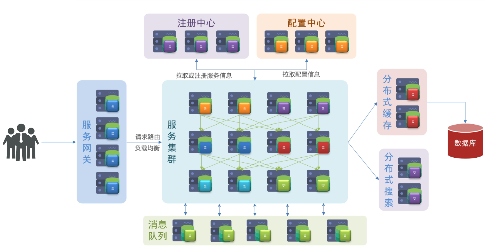
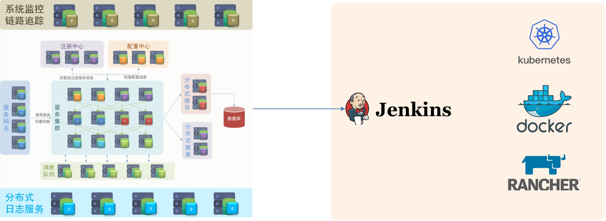
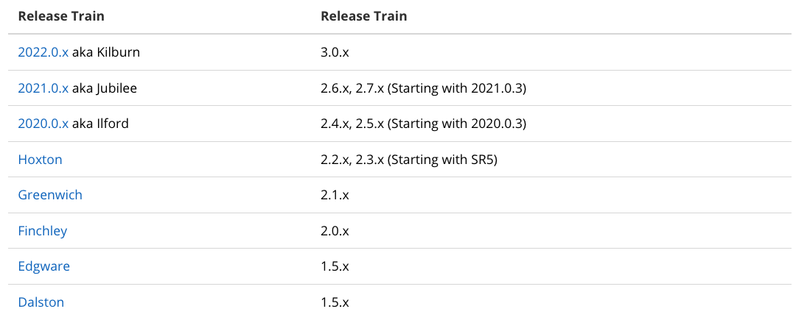

# 【Java开发笔记】SpringCloud

## 1 微服务基本概要

微服务相关知识点：

- 注册中心：微服务调用的统一管理
- 配置中心：微服务的配置统一管理
- 服务网关：拦截服务请求，进行身份验证和权限校验，以及限流
- 负载均衡：业务请求分担在不同服务节点上
- 分布式缓存：常用数据存储
- 分布式搜索：某些数据的索引不是特别好，如文本。使用搜索引擎替代 mysql
- 消息队列：服务集群根据自己的业务处理速度，从消息队列中取出处理，避免了突然的请求暴增，限流削峰

- 分布式日志服务：服务集群中的所有错误日志进行搜集，形成报表，便于排错
- 系统监控，链路追踪：集群的排错
- 集群部署：`Jenkins` （编译打包，集成测试）和 `docker` （批量部署）
- 管理集群：`kubernetes`

### 1.1 服务架构的演变

#### 单体架构

**【单体架构】**：将业务的所有功能集中在一个项目中开发，打成一个包部署。

单体架构，架构简单，部署成本低，但业务代码的 **耦合度高，导致了维护困难，升级困难**。

#### 分布式架构

**【分布式架构】**：根据业务功能对系统做拆分，每个业务功能模块作为独立项目开发，称为一个服务。

分布式架构能够 **降低服务耦合，有利于服务升级和拓展，但服务调用关系错综复杂**。

分布式架构虽然降低了服务耦合，但是服务拆分时也有很多问题需要思考：

- 服务拆分的粒度如何界定？
- 服务之间如何调用？
- 服务的调用关系如何管理？

人们需要制定一套行之有效的标准来约束分布式架构。

#### 微服务架构

**【微服务】**：一种经过 **良好架构设计** 的分布式架构方案，架构特征：

- 单一职责：微服务拆分粒度更小，每一个服务都对应唯一的业务能力，做到单一职责
- 自治：团队独立、技术独立、数据独立，独立部署和交付
- 面向服务：服务提供统一标准的接口，与语言和技术无关
- 隔离性强：服务调用做好隔离、容错、降级，避免出现级联问题

上述特性其实是在给分布式架构制定一个标准，进一步降低服务之间的耦合度，提供服务的独立性和灵活性。做到高内聚，低耦合。

在 `Java` 领域最引人注目的就是 `SpringCloud` 提供的方案了。

### 1.2 SpringCloud简介

SpringCloud 是目前国内使用最广泛的微服务框架。官网地址：https://spring.io/projects/spring-cloud。

SpringCloud 集成了各种微服务功能组件，并基于 SpringBoot 实现了这些组件的自动装配，从而提供了良好的开箱即用体验。

其中常见的组件包括：

SpringCloud 底层是依赖于 SpringBoot 的，并且有版本的兼容关系，如下：

学习版本是 `Hoxton.SR10`，因此对应的 SpringBoot 版本是 `2.3.x` 版本。

