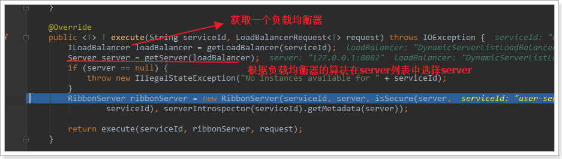

# 【Java开发笔记】SpringCloud

## 1 微服务基本概要

微服务相关知识点：

- 注册中心：微服务调用的统一管理
- 配置中心：微服务的配置统一管理
- 服务网关：拦截服务请求，进行身份验证和权限校验，以及限流
- 负载均衡：业务请求分担在不同服务节点上
- 分布式缓存：常用数据存储
- 分布式搜索：某些数据的索引不是特别好，如文本。使用搜索引擎替代 mysql
- 消息队列：服务集群根据自己的业务处理速度，从消息队列中取出处理，避免了突然的请求暴增，限流削峰


- 分布式日志服务：服务集群中的所有错误日志进行搜集，形成报表，便于排错
- 系统监控，链路追踪：集群的排错
- 集群部署：`Jenkins` （编译打包，集成测试）和 `docker` （批量部署）
- 管理集群：`kubernetes`


### 1.1 服务架构的演变

#### 单体架构

**【单体架构】**：将业务的所有功能集中在一个项目中开发，打成一个包部署。

单体架构，架构简单，部署成本低，但业务代码的 **耦合度高，导致了维护困难，升级困难**。


#### 分布式架构

**【分布式架构】**：根据业务功能对系统做拆分，每个业务功能模块作为独立项目开发，称为一个服务。

分布式架构能够 **降低服务耦合，有利于服务升级和拓展，但服务调用关系错综复杂**。


分布式架构虽然降低了服务耦合，但是服务拆分时也有很多问题需要思考：

- 服务拆分的粒度如何界定？
- 服务之间如何调用？
- 服务的调用关系如何管理？

人们需要制定一套行之有效的标准来约束分布式架构。

#### 微服务架构

**【微服务】**：一种经过 **良好架构设计** 的分布式架构方案，架构特征：

- 单一职责：微服务拆分粒度更小，每一个服务都对应唯一的业务能力，做到单一职责
- 自治：团队独立、技术独立、数据独立，独立部署和交付
- 面向服务：服务提供统一标准的接口，与语言和技术无关
- 隔离性强：服务调用做好隔离、容错、降级，避免出现级联问题


上述特性其实是在给分布式架构制定一个标准，进一步降低服务之间的耦合度，提供服务的独立性和灵活性。做到高内聚，低耦合。

在 `Java` 领域最引人注目的就是 `SpringCloud` 提供的方案了。

### 1.2 SpringCloud简介

SpringCloud 是目前国内使用最广泛的微服务框架。官网地址：https://spring.io/projects/spring-cloud。

SpringCloud 集成了各种微服务功能组件，并基于 SpringBoot 实现了这些组件的自动装配，从而提供了良好的开箱即用体验。

其中常见的组件包括：


SpringCloud 底层是依赖于 SpringBoot 的，并且有版本的兼容关系，如下：


学习版本是 `Hoxton.SR10`，因此对应的 SpringBoot 版本是 `2.3.x` 版本。

## 2 服务拆分与远程调用

### 2.1 服务拆分原则

1. 单一指责：不同微服务，不能重复开发相同业务
2. 数据独立：不要访问其他微服务的数据库
3. 面向服务：将自己的业务暴露为接口，供其他微服务调用


### 2.2 服务拆分案例

构建一个简单的工程 `cloud-demo` ，管理依赖

- order-service：订单微服务，负责订单相关业务
- user-service：用户微服务，负责用户相关业务


> 【要求】
>
> - 订单微服务和用户微服务都必须有 **各自的数据库**，相互独立
> - 订单服务和用户服务都对外暴露 Restful 的接口
> - 订单服务如果需要查询用户信息，**只能调用用户服务的 Restful 接口，不能查询用户数据库**

#### 创建数据库与表

`cloud_order` 表：

```sql
CREATE DATABASE cloud_order;
USE cloud_order;

SET NAMES utf8mb4;
SET FOREIGN_KEY_CHECKS = 0;

-- ----------------------------
-- Table structure for tb_order
-- ----------------------------
DROP TABLE IF EXISTS `tb_order`;
CREATE TABLE `tb_order`  (
  `id` bigint(20) NOT NULL AUTO_INCREMENT COMMENT '订单id',
  `user_id` bigint(20) NOT NULL COMMENT '用户id',
  `name` varchar(100) CHARACTER SET utf8 COLLATE utf8_general_ci NULL DEFAULT NULL COMMENT '商品名称',
  `price` bigint(20) NOT NULL COMMENT '商品价格',
  `num` int(10) NULL DEFAULT 0 COMMENT '商品数量',
  PRIMARY KEY (`id`) USING BTREE,
  UNIQUE INDEX `username`(`name`) USING BTREE
) ENGINE = InnoDB AUTO_INCREMENT = 109 CHARACTER SET = utf8 COLLATE = utf8_general_ci ROW_FORMAT = Compact;

-- ----------------------------
-- Records of tb_order
-- ----------------------------
INSERT INTO `tb_order` VALUES (101, 1, 'Apple 苹果 iPhone 12 ', 699900, 1);
INSERT INTO `tb_order` VALUES (102, 2, '雅迪 yadea 新国标电动车', 209900, 1);
INSERT INTO `tb_order` VALUES (103, 3, '骆驼（CAMEL）休闲运动鞋女', 43900, 1);
INSERT INTO `tb_order` VALUES (104, 4, '小米10 双模5G 骁龙865', 359900, 1);
INSERT INTO `tb_order` VALUES (105, 5, 'OPPO Reno3 Pro 双模5G 视频双防抖', 299900, 1);
INSERT INTO `tb_order` VALUES (106, 6, '美的（Midea) 新能效 冷静星II ', 544900, 1);
INSERT INTO `tb_order` VALUES (107, 2, '西昊/SIHOO 人体工学电脑椅子', 79900, 1);
INSERT INTO `tb_order` VALUES (108, 3, '梵班（FAMDBANN）休闲男鞋', 31900, 1);

SET FOREIGN_KEY_CHECKS = 1;
```


`cloud-user`：

```sql
CREATE DATABASE cloud_user;
USE cloud_user;

SET NAMES utf8mb4;
SET FOREIGN_KEY_CHECKS = 0;

-- ----------------------------
-- Table structure for tb_user
-- ----------------------------
DROP TABLE IF EXISTS `tb_user`;
CREATE TABLE `tb_user`  (
  `id` bigint(20) NOT NULL AUTO_INCREMENT,
  `username` varchar(100) CHARACTER SET utf8 COLLATE utf8_general_ci NULL DEFAULT NULL COMMENT '收件人',
  `address` varchar(255) CHARACTER SET utf8 COLLATE utf8_general_ci NULL DEFAULT NULL COMMENT '地址',
  PRIMARY KEY (`id`) USING BTREE,
  UNIQUE INDEX `username`(`username`) USING BTREE
) ENGINE = InnoDB AUTO_INCREMENT = 109 CHARACTER SET = utf8 COLLATE = utf8_general_ci ROW_FORMAT = Compact;

-- ----------------------------
-- Records of tb_user
-- ----------------------------
INSERT INTO `tb_user` VALUES (1, '柳岩', '湖南省衡阳市');
INSERT INTO `tb_user` VALUES (2, '文二狗', '陕西省西安市');
INSERT INTO `tb_user` VALUES (3, '华沉鱼', '湖北省十堰市');
INSERT INTO `tb_user` VALUES (4, '张必沉', '天津市');
INSERT INTO `tb_user` VALUES (5, '郑爽爽', '辽宁省沈阳市大东区');
INSERT INTO `tb_user` VALUES (6, '范兵兵', '山东省青岛市');

SET FOREIGN_KEY_CHECKS = 1;
```


#### 项目结构

项目结构包含：


然后把两个 service 都跑起来：


访问一下接口试试：


至此，我们相当于把 `订单服务` 和 `用户服务` 进行了一个拆分隔离。

### 2.3 远程调用

接着上面的案例，我们提一个需求：

> 根据订单 id 查询订单的同时，把订单所属的用户信息一起返回。


因此，我们需要在 `order-service` 中向 `user-service` 发起一个 http 的请求，调用 `http://localhost:8081/user/{userId}` 这个接口。

大概的步骤是这样的：

- 注册一个 RestTemplate 的实例到 Spring 容器
- 修改 order-service 服务中的 OrderService 类中的 queryOrderById 方法，根据 Order 对象中的 userId 查询User
- 将查询的 User 填充到 Order 对象，一起返回

#### 注册RestTemplate

RestTemplate 用来发起 http 请求：

```java
@MapperScan("cn.itcast.order.mapper")
@SpringBootApplication
public class OrderApplication {

    public static void main(String[] args) {
        SpringApplication.run(OrderApplication.class, args);
    }
    @Bean
    public RestTemplate restTemplate() {
        return new RestTemplate();
    }
}
```

#### 服务远程调用RestTemplate

```java
@RequiredArgsConstructor
@Service
public class OrderService {

    private final OrderMapper orderMapper;

    @Autowired
    private RestTemplate restTemplate;

    public Order queryOrderById(Long orderId) {
        // 1.查询订单信息
        Order order = orderMapper.findById(orderId);
        // 2. 通过restTemplate调用userService，获取user数据
        String url = "http://localhost:8081/user/" + order.getUserId();
        User user = restTemplate.getForObject(url, User.class);
        order.setUser(user);
        return order;
    }
}
```

#### 测试


### 2.4 提供者与消费者

在服务调用关系中，会有两个不同的角色：

**服务提供者**：一次业务中，被其它微服务调用的服务。（提供接口给其它微服务）

**服务消费者**：一次业务中，调用其它微服务的服务。（调用其它微服务提供的接口）


但是，服务提供者与服务消费者的角色并不是绝对的，而是相对于业务而言。

如果服务 A 调用了服务 B，而服务 B 又调用了服务 C，服务 B 的角色是什么？

- 对于 A 调用 B 的业务而言：A 是服务消费者，B 是服务提供者
- 对于 B 调用 C 的业务而言：B 是服务消费者，C 是服务提供者

因此，服务 B 既可以是服务提供者，也可以是服务消费者。

## 3 Eureka注册中心

前面案例的问题：


假如我们的服务提供者 user-service 部署了多个实例，如图：

大家思考几个问题：

- （去哪找）order-service 在发起远程调用的时候，该如何得知 user-service 实例的 ip 地址和端口？
- （找哪个）有多个 user-service 实例地址，order-service 调用时该如何选择？
- （找的管用吗）order-service 如何得知某个 user-service 实例是否依然健康，是不是已经宕机？

### 3.1 Eureka的结构与作用

这些问题都需要利用 SpringCloud 中的 **注册中心** 来解决，其中最广为人知的注册中心就是 **Eureka**，其结构如下：


> 【问题1】order-service 如何得知 user-service 实例地址？

获取地址信息的流程如下：

- user-service 服务实例启动后，将自己的信息注册到 **eureka-server（Eureka服务端）** ，这个叫 **服务注册**
- eureka-server 保存服务名称到服务实例地址列表的映射关系
- order-service 根据服务名称，拉取实例地址列表，这个叫 **服务发现** 或 **服务拉取**

> 【问题2】order-service 如何从多个 user-service 实例中选择具体的实例？

- order-service 从实例列表中利用 **负载均衡算法** 选中一个实例地址
- 向该实例地址发起远程调用

> 【问题3】order-service 如何得知某个 user-service 实例是否依然健康，是不是已经宕机？

- user-service 会每隔一段时间（默认30秒）向 eureka-server 发起请求，报告自己状态，称为 **心跳**
- 当超过一定时间没有发送心跳时，eureka-server 会认为微服务实例故障，将该实例 **从服务列表中剔除**
- order-service **定时拉取服务** 时，就能将故障实例排除了

### 3.2 Eureka使用案例


#### 3.2.1 搭建注册中心EurekaServer

在父工程下，创建模块 `eureka-server`：

1. **导入依赖**

```xml
<dependency>
    <groupId>org.springframework.cloud</groupId>
    <artifactId>spring-cloud-starter-netflix-eureka-server</artifactId>
</dependency>
```

2. **编写 `EurekaServer` 启动类**

```java
/**
 * EurekaServer
 * @description
 * @author SongJian
 * @date 2023/2/22 10:40
 * @version
 */
@SpringBootApplication
@EnableEurekaServer
public class EurekaServer {
    public static void main(String[] args) {
        SpringApplication.run(EurekaServer.class, args);
    }
}
```

3. **编写配置 `application.yml`**

```yml
server:
  port: 10010
spring:
  application:
    name: eureka-server
eureka:
  client:
    service-url:
      defaultZone: http://127.0.0.1:10010/eureka
```

启动服务：


#### 3.2.2 服务注册

我们将 user-service 注册到 eureka-server 中去。

1. **导入依赖**

在 `user-service` 的 pom 文件中，引入下面的 eureka-client 依赖：

```xml
<dependency>
    <groupId>org.springframework.cloud</groupId>
    <artifactId>spring-cloud-starter-netflix-eureka-client</artifactId>
</dependency>
```

2. **修改配置文件**

在 `user-service` 中，修改 `application.yml` 文件，**添加服务名称、eureka地址** ：

```yml
eureka:
  client:
    service-url:
      defaultZone: http://127.0.0.1:10010/eureka
```

3. **启动多个 user-service 实例**

为了演示一个服务有多个实例的场景，我们添加一个 SpringBoot 的启动配置，再启动一个 user-service。

首先，复制原来的 user-service 启动配置：


然后，在弹出的窗口中，填写信息：


现在，SpringBoot 窗口会出现两个 user-service 启动配置：


不过，第一个是 8081 端口，第二个是 8082 端口。

查看 eureka-server 管理页面：


同样，可以注册 `order-service`


#### 3.2.3 服务发现

我们将 `order-service` 的逻辑修改：向 `eureka-server` 拉取 `user-service` 的信息，实现 **服务发现**。

1. **导入依赖**

**服务发现、服务注册统一都封装在 `eureka-client` 依赖**，因此这一步与服务注册时一致。在 `order-service` 的 pom 文件中，引入下面的 eureka-client 依赖：

```xml
<dependency>
    <groupId>org.springframework.cloud</groupId>
    <artifactId>spring-cloud-starter-netflix-eureka-client</artifactId>
</dependency>
```

2. **配置文件**

服务发现也需要知道 eureka 地址，因此第二步与服务注册一致，都是配置 eureka 信息：

在 order-service 中，修改 `application.yml` 文件，添加服务名称、eureka地址：

```yaml
spring:
  application:
    name: orderservice
eureka:
  client:
    service-url:
      defaultZone: http://127.0.0.1:10010/eureka
```

3. **服务拉取与负载均衡**

最后，我们要去 eureka-server 中拉取 user-service 服务的实例列表，并且实现负载均衡。

不过这些动作不用我们去做，只需要添加一些注解即可。

在 order-service 的 `OrderApplication` 中，给 `RestTemplate` 这个 Bean 添加一个 `@LoadBalanced` 注解：


修改 order-service 服务中的 cn.itcast.order.service 包下的 OrderService 类中的 queryOrderById 方法。修改访问的 url 路径，**用 服务名 代替ip、端口**：


spring 会自动帮助我们从 eureka-server 端，根据 userservice 这个服务名称，获取实例列表，而后完成负载均衡。

多次请求效果：


## 4 Ribbon负载均衡

在上述案例，我们添加了 `@LoadBalanced` 注解，即可实现负载均衡功能，这是什么原理呢？

### 4.1 负载均衡原理

SpringCloud 底层其实是利用了一个名为 Ribbon 的组件，来实现负载均衡功能的。


那么我们发出的请求明明是 `http://userservice/user/1`，怎么变成了 `http://localhost:8081` 的呢？

### 4.2 源码追踪

整体流程：**SpringCloudRibbon** 的底层采用了一个拦截器，拦截了 RestTemplate 发出的请求，对地址做了修改。


基本流程如下：

- 拦截我们的 RestTemplate 请求 `http://userservice/user/1`
- `RibbonLoadBalancerClient` 会从请求 url 中获取服务名称，也就是 userservice
- `DynamicServerListLoadBalancer` 根据 `userservice` 到 eureka 拉取服务列表
- eureka 返回列表，localhost:8081、localhost:8082
- `IRule` 利用内置负载均衡规则，从列表中选择一个，例如 localhost:8081
- `RibbonLoadBalancerClient` **修改请求地址**，用 localhost:8081 替代 userservice，得到 `http://localhost:8081/user/1`，发起真实请求

#### 1）LoadBalancerIntercepor


可以看到这里的 intercept 方法，拦截了用户的 HttpRequest 请求，然后做了几件事：

- `request.getURI()`：获取请求 uri，本例中就是 `http://userservice/user/5`
- `originalUri.getHost()`：获取 uri 路径的主机名，其实就是服务 id，`userservice`
- `this.loadBalancer.execute()`：处理服务 id，和用户请求。

这里的 `this.loadBalancer`是 `LoadBalancerClient` 类型，我们继续跟入。

#### 2）LoadBalancerClient

继续跟入 execute 方法：



代码是这样的：

- `getLoadBalancer(serviceId)` ：根据服务 id 获取 ILoadBalancer，而 ILoadBalancer 会拿着服务 id 去 eureka 中获取 **服务列表** 并保存起来。
- `getServer(loadBalancer)` ：利用内置的负载均衡算法，从服务列表中选择 **其中一个服务地址**。本例中，可以看到获取了 8081 端口的服务


#### 3）负载均衡策略IRule

在刚才的代码中，可以看到获取服务使通过一个 `getServer` 方法来做负载均衡:


我们继续跟入：


继续跟踪源码 chooseServer 方法，发现这么一段代码:


我们看看这个 rule 是谁：


这里的 rule 默认值是一个`RoundRobinRule`，看类的介绍：


这不就是 **轮询** 的意思嘛。


### 4.3 自定义负载均衡策略

**【方式一：代码方式】** 在 order-service 中的 OrderApplication 类中，定义一个新的 IRule

```java
@Bean
public IRule randomRule() {
    return new RandomRule();
}
```

**【方式二：配置方式】** 在 order-service 的 application.yml 文件中，添加新的配置也可以修改规则

```yml
userservice:
  ribbon:
    NFLoadBalancerRuleClassName: com.netflix.loadbalancer.RandomRule # 负载均衡规则
```

### 4.4 饥饿加载

Ribbon 默认使用的是 **懒加载** 机制，即第一次访问时才会去创建 `LoadBalanceClient`，请求时间会很长。

而 **饥饿加载则会在项目启动时创建，降低一次访问的耗时**，可通过配置开启饥饿加载：

```yml
ribbon:
  eager-load:
  	# 开启饥饿加载
    enabled: true
    # 指定对 userservice 这个服务开启饥饿加载
    clients: userservice
```

## 5 Nacos注册中心

国内公司一般都推崇阿里巴巴的技术，比如注册中心，`SpringCloudAlibaba` 也推出了一个名为 `Nacos` 的注册中心。

### 5.1 Nacos基本介绍

[Nacos](https://nacos.io/) 是阿里巴巴的产品，现在是 [SpringCloud](https://spring.io/projects/spring-cloud) 中的一个组件。相比 [Eureka](https://github.com/Netflix/eureka) 功能更加丰富，在国内受欢迎程度较高。


### 5.2 Nacos安装

下载地址：https://github.com/alibaba/nacos/releases


解压到本地：


目录说明：

- bin：启动脚本
- conf：配置文件

配置端口：

Nacos的默认端口是8848，如果你电脑上的其它进程占用了8848端口，请先尝试关闭该进程。

**如果无法关闭占用8848端口的进程**，也可以进入 nacos 的 `conf` 目录，修改配置文件中的端口：


修改其中的内容：


启动：

在 `nacos/bin` 目录中，输入命令启动 Nacos：

```sh
sh startup.sh -m standalone
```


启动成功，访问：http://127.0.0.1:8848/nacos

```
用户名：nacos
密码：nacos
```


### 5.3 Nacos的依赖

父工程：

```xml
<dependency>
    <groupId>com.alibaba.cloud</groupId>
    <artifactId>spring-cloud-alibaba-dependencies</artifactId>
    <version>2.2.5.RELEASE</version>
    <type>pom</type>
    <scope>import</scope>
</dependency>
```

客户端：

```xml
<!-- nacos客户端依赖包 -->
<dependency>
    <groupId>com.alibaba.cloud</groupId>
    <artifactId>spring-cloud-starter-alibaba-nacos-discovery</artifactId>
</dependency>
```

### 5.4 服务注册

Nacos 是 SpringCloudAlibaba 的组件，而 SpringCloudAlibaba 也遵循 SpringCloud 中定义的服务注册、服务发现规范。因此使用 Nacos 和使用 Eureka 对于微服务来说，并没有太大区别。

主要差异在于：

- 依赖不同
- 服务地址不同

#### 1）导入依赖

在 cloud-demo 父工程的 pom 文件中的 `<dependencyManagement>` 中引入 SpringCloudAlibaba 的依赖：

```xml
<!--nacos的管理依赖-->
<dependency>
    <groupId>com.alibaba.cloud</groupId>
    <artifactId>spring-cloud-alibaba-dependencies</artifactId>
    <version>2.2.5.RELEASE</version>
    <type>pom</type>
    <scope>import</scope>
</dependency>
```

然后在 user-service 和 order-service 中的 pom 文件中引入 nacos-discovery 依赖：

```xml
<dependency>
    <groupId>com.alibaba.cloud</groupId>
    <artifactId>spring-cloud-starter-alibaba-nacos-discovery</artifactId>
</dependency>
```

> **注意**：不要忘了注释掉eureka的依赖。

#### 2）配置Nacos地址

在 user-service 和 order-service 的 application.yml 中添加 nacos 地址：

```yaml
spring:
  cloud:
    nacos:
      server-addr: localhost:8848
```

> **注意**：不要忘了注释掉eureka的地址

#### 3）重启

重启微服务后，登录 nacos 管理页面，可以看到微服务信息：


正确地显示了ip地址和端口：


### 5.5 服务分级存储模型

一个 **服务** 可以有多个 **实例** ，例如我们的 user-service ，可以有:

- 127.0.0.1:8081
- 127.0.0.1:8082
- 127.0.0.1:8083

假如这些实例分布于全国各地的不同机房，例如：

- 127.0.0.1:8081，在上海机房
- 127.0.0.1:8082，在上海机房
- 127.0.0.1:8083，在杭州机房

Nacos 就将同一机房内的实例划分为一个 **集群**。

也就是说，user-service 是服务，一个服务可以包含多个集群，如杭州、上海，每个集群下可以有多个实例，形成分级模型，如图：


> **【服务分级存储模型】**
>
> - 第一级：服务
> - 第二级：集群
> - 第三级：实例

微服务互相访问时，应该 **尽可能访问同集群实例，因为本地访问速度更快** 。当本集群内不可用时，才访问其它集群。例如：


杭州机房内的 order-service 应该优先访问同机房的 user-service。

#### 5.3.1 配置集群

修改 user-service 的 application.yml 文件，添加集群配置：

```yml
spring:
  cloud:
    nacos:
      server-addr: localhost:8848
      discovery:
        cluster-name: HZ
```

重启两个 user-service 实例后，我们可以在 nacos 控制台看到下面结果：


#### 5.3.2.同集群优先的负载均衡

默认的 `ZoneAvoidanceRule` 并不能实现根据同集群优先来实现负载均衡。因此 Nacos 中提供了一个 `NacosRule` 的实现，可以 **优先从同集群中挑选实例** 。

1. **给 order-service 配置集群信息**

修改 order-service 的 application.yml 文件，添加集群配置：

```yml
spring:
  cloud:
    nacos:
      server-addr: localhost:8848
      discovery:
        cluster-name: HZ # 集群名称
```

2. **修改负载均衡规则**

修改 order-service 的 application.yml 文件，修改负载均衡规则：

```yaml
userservice:
  ribbon:
    NFLoadBalancerRuleClassName: com.alibaba.cloud.nacos.ribbon.NacosRule # 负载均衡规则 
```

注意：这里配置负载均衡的方法可以通过配置文件，也可以定义 Bean。

3. **结果展示**

我们把 order-service 配置在 SZ 集群：


user-service 配置一个 SZ，一个 HZ：


因此，后续的服务调用会在同集群优先的 SZ 集群获取：


而 HZ 集群没有被调用：


> 【总结】NacosRule 负载均衡策略：
>
> - **优先选择同集群服务实例列表**
> - 本地集群找不到服务提供者，才会去其他集群找，并且报警告
> - 确定了可用的实例列表后，再采用 **随机负载均衡** 挑选实例

### 5.6 权重配置

实际部署中会出现这样的场景：服务器设备性能有差异，部分实例所在机器性能较好，另一些较差，我们希望性能好的机器承担更多的用户请求。

但默认情况下 `NacosRule` 是同集群内 **随机挑选**，不会考虑机器的性能问题。

因此，Nacos 提供了权重配置来控制访问频率，**权重越大则访问频率越高**。

在 nacos 控制台，找到 user-service 的实例列表，点击编辑，即可修改权重：


在弹出的编辑窗口，修改权重：


**注意**：如果权重修改为 `0`，则该实例永远不会被访问

> 【总结】**实例的权重控制**：
>
> - Nacos 控制台可以设置实例的权重值，`0-1`
> - 同集群内的多个实例，权重越高，被访问的频率越高
> - 权重设置为 0 则完全不被访问

### 5.7 环境隔离

Nacos 提供了 `namespace` 来实现环境隔离功能。

- nacos 中可以有多个 namespace
- namespace 下可以有 group、service 等
- 不同 namespace 之间相互隔离，例如不同 namespace 的服务互相不可见


#### 5.7.1 创建namespace

默认情况下，所有 `service、data、group` 都在同一个 `namespace` ，名为 `public` ：


创建新的命名空间：


#### 5.7.2 给微服务配置namespace

给微服务配置 namespace **只能通过修改配置来实现**。

例如，修改 order-service 的 application.yml 文件：

```yaml
spring:
  cloud:
    nacos:
      server-addr: localhost:8848
      discovery:
        cluster-name: HZ
        namespace: e1c4bca4-6f0a-4559-98e6-ca9e0e1c0b45 # 命名空间，填ID
```

重启 order-service 后，访问控制台，可以看到下面的结果：


我们尝试访问 order-service，看看能不能跨 namespace 访问到 `public` 的 order-service：


发现是无法请求到该服务的！

> 【总结】**Nacos环境隔离**：
>
> - 每个 namespace 都有唯一 ID
> - 服务设置 namespace 时，要写 ID 而不是名称
> - **不同 namespace 下的服务，相互不可见**
> - 优点：开发环境和测试环境，可以通过 namespace 实现隔离

### 5.8 Nacos服务实例类型

Nacos 的服务实例分为 **两种类型**：

- **临时实例** ：如果实例宕机超过一定时间，会从服务列表剔除，**默认的类型**。

- **非临时实例** ：如果实例宕机，不会从服务列表剔除，也可以叫 **永久实例**。

配置一个服务实例为永久实例：

```yaml
spring:
  cloud:
    nacos:
      discovery:
        ephemeral: false # 设置为非临时实例
```


## 6 Nacos与Eureka的区别

Nacos 和 Eureka 整体结构类似，服务注册、服务拉取、心跳等待，但是也存在一些差异：


- Nacos 与 eureka 的共同点
  - 都支持服务注册和服务拉取
  - 都支持服务提供者心跳方式做健康检测

- Nacos 与 Eureka 的区别
  - Nacos 支持服务端主动检测提供者状态：**临时实例采用心跳模式，非临时实例采用主动检测模式**
  - 临时实例心跳不正常会被剔除，**非临时实例则不会被剔除**
  - **Nacos 支持服务列表变更的消息推送模式**，服务列表更新更及时
  - Nacos 集群默认采用 AP 方式，**当集群中存在非临时实例时，采用 CP 模式**；Eureka 采用 AP 方式

> 【CAP定理】
>
> - C：一致性
> - A：可用性
> - P：分区容错性


