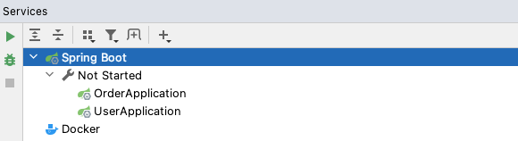
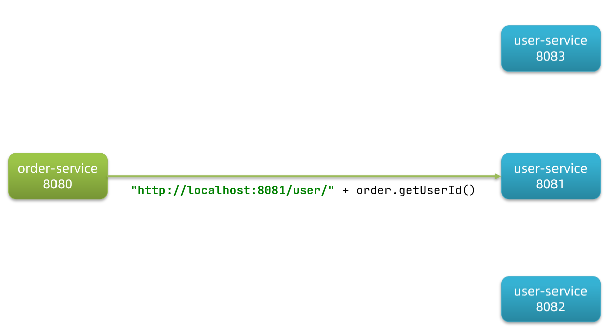
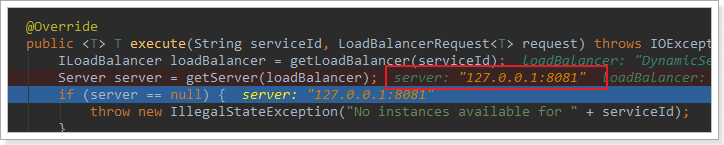
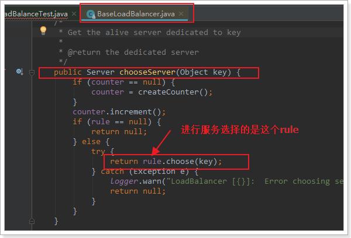
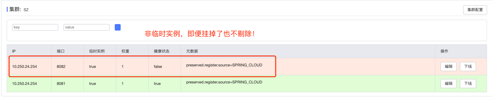
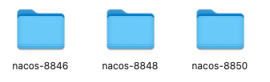
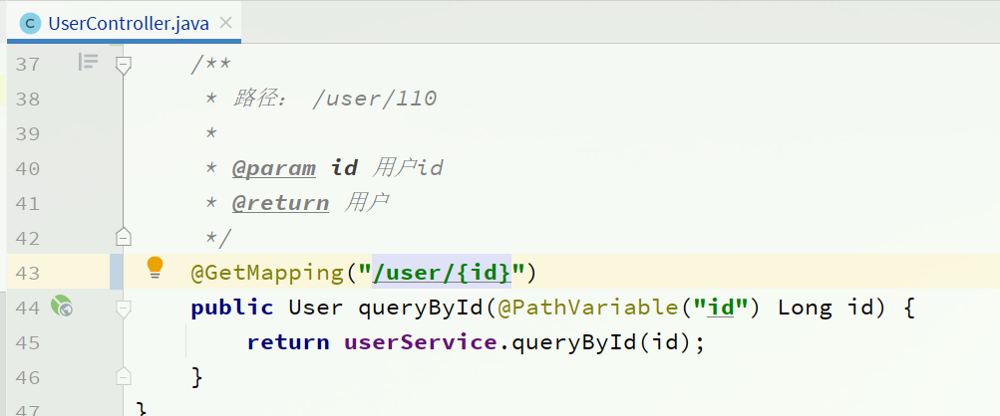

# 【Java开发笔记】SpringCloud

## 1 微服务基本概要

微服务相关知识点：

- 注册中心：微服务调用的统一管理
- 配置中心：微服务的配置统一管理
- 服务网关：拦截服务请求，进行身份验证和权限校验，以及限流
- 负载均衡：业务请求分担在不同服务节点上
- 分布式缓存：常用数据存储
- 分布式搜索：某些数据的索引不是特别好，如文本。使用搜索引擎替代 mysql
- 消息队列：服务集群根据自己的业务处理速度，从消息队列中取出处理，避免了突然的请求暴增，限流削峰


- 分布式日志服务：服务集群中的所有错误日志进行搜集，形成报表，便于排错
- 系统监控，链路追踪：集群的排错
- 集群部署：`Jenkins` （编译打包，集成测试）和 `docker` （批量部署）
- 管理集群：`kubernetes`


### 1.1 服务架构的演变

#### 单体架构

**【单体架构】**：将业务的所有功能集中在一个项目中开发，打成一个包部署。

单体架构，架构简单，部署成本低，但业务代码的 **耦合度高，导致了维护困难，升级困难**。


#### 分布式架构

**【分布式架构】**：根据业务功能对系统做拆分，每个业务功能模块作为独立项目开发，称为一个服务。

分布式架构能够 **降低服务耦合，有利于服务升级和拓展，但服务调用关系错综复杂**。


分布式架构虽然降低了服务耦合，但是服务拆分时也有很多问题需要思考：

- 服务拆分的粒度如何界定？
- 服务之间如何调用？
- 服务的调用关系如何管理？

人们需要制定一套行之有效的标准来约束分布式架构。

#### 微服务架构

**【微服务】**：一种经过 **良好架构设计** 的分布式架构方案，架构特征：

- 单一职责：微服务拆分粒度更小，每一个服务都对应唯一的业务能力，做到单一职责
- 自治：团队独立、技术独立、数据独立，独立部署和交付
- 面向服务：服务提供统一标准的接口，与语言和技术无关
- 隔离性强：服务调用做好隔离、容错、降级，避免出现级联问题


上述特性其实是在给分布式架构制定一个标准，进一步降低服务之间的耦合度，提供服务的独立性和灵活性。做到高内聚，低耦合。

在 `Java` 领域最引人注目的就是 `SpringCloud` 提供的方案了。

### 1.2 SpringCloud简介

SpringCloud 是目前国内使用最广泛的微服务框架。官网地址：https://spring.io/projects/spring-cloud。

SpringCloud 集成了各种微服务功能组件，并基于 SpringBoot 实现了这些组件的自动装配，从而提供了良好的开箱即用体验。

其中常见的组件包括：


SpringCloud 底层是依赖于 SpringBoot 的，并且有版本的兼容关系，如下：


学习版本是 `Hoxton.SR10`，因此对应的 SpringBoot 版本是 `2.3.x` 版本。

## 2 服务拆分与远程调用

### 2.1 服务拆分原则

1. 单一指责：不同微服务，不能重复开发相同业务
2. 数据独立：不要访问其他微服务的数据库
3. 面向服务：将自己的业务暴露为接口，供其他微服务调用


### 2.2 服务拆分案例

构建一个简单的工程 `cloud-demo` ，管理依赖

- order-service：订单微服务，负责订单相关业务
- user-service：用户微服务，负责用户相关业务


> 【要求】
>
> - 订单微服务和用户微服务都必须有 **各自的数据库**，相互独立
> - 订单服务和用户服务都对外暴露 Restful 的接口
> - 订单服务如果需要查询用户信息，**只能调用用户服务的 Restful 接口，不能查询用户数据库**

#### 创建数据库与表

`cloud_order` 表：

```sql
CREATE DATABASE cloud_order;
USE cloud_order;

SET NAMES utf8mb4;
SET FOREIGN_KEY_CHECKS = 0;

-- ----------------------------
-- Table structure for tb_order
-- ----------------------------
DROP TABLE IF EXISTS `tb_order`;
CREATE TABLE `tb_order`  (
  `id` bigint(20) NOT NULL AUTO_INCREMENT COMMENT '订单id',
  `user_id` bigint(20) NOT NULL COMMENT '用户id',
  `name` varchar(100) CHARACTER SET utf8 COLLATE utf8_general_ci NULL DEFAULT NULL COMMENT '商品名称',
  `price` bigint(20) NOT NULL COMMENT '商品价格',
  `num` int(10) NULL DEFAULT 0 COMMENT '商品数量',
  PRIMARY KEY (`id`) USING BTREE,
  UNIQUE INDEX `username`(`name`) USING BTREE
) ENGINE = InnoDB AUTO_INCREMENT = 109 CHARACTER SET = utf8 COLLATE = utf8_general_ci ROW_FORMAT = Compact;

-- ----------------------------
-- Records of tb_order
-- ----------------------------
INSERT INTO `tb_order` VALUES (101, 1, 'Apple 苹果 iPhone 12 ', 699900, 1);
INSERT INTO `tb_order` VALUES (102, 2, '雅迪 yadea 新国标电动车', 209900, 1);
INSERT INTO `tb_order` VALUES (103, 3, '骆驼（CAMEL）休闲运动鞋女', 43900, 1);
INSERT INTO `tb_order` VALUES (104, 4, '小米10 双模5G 骁龙865', 359900, 1);
INSERT INTO `tb_order` VALUES (105, 5, 'OPPO Reno3 Pro 双模5G 视频双防抖', 299900, 1);
INSERT INTO `tb_order` VALUES (106, 6, '美的（Midea) 新能效 冷静星II ', 544900, 1);
INSERT INTO `tb_order` VALUES (107, 2, '西昊/SIHOO 人体工学电脑椅子', 79900, 1);
INSERT INTO `tb_order` VALUES (108, 3, '梵班（FAMDBANN）休闲男鞋', 31900, 1);

SET FOREIGN_KEY_CHECKS = 1;
```


`cloud-user`：

```sql
CREATE DATABASE cloud_user;
USE cloud_user;

SET NAMES utf8mb4;
SET FOREIGN_KEY_CHECKS = 0;

-- ----------------------------
-- Table structure for tb_user
-- ----------------------------
DROP TABLE IF EXISTS `tb_user`;
CREATE TABLE `tb_user`  (
  `id` bigint(20) NOT NULL AUTO_INCREMENT,
  `username` varchar(100) CHARACTER SET utf8 COLLATE utf8_general_ci NULL DEFAULT NULL COMMENT '收件人',
  `address` varchar(255) CHARACTER SET utf8 COLLATE utf8_general_ci NULL DEFAULT NULL COMMENT '地址',
  PRIMARY KEY (`id`) USING BTREE,
  UNIQUE INDEX `username`(`username`) USING BTREE
) ENGINE = InnoDB AUTO_INCREMENT = 109 CHARACTER SET = utf8 COLLATE = utf8_general_ci ROW_FORMAT = Compact;

-- ----------------------------
-- Records of tb_user
-- ----------------------------
INSERT INTO `tb_user` VALUES (1, '柳岩', '湖南省衡阳市');
INSERT INTO `tb_user` VALUES (2, '文二狗', '陕西省西安市');
INSERT INTO `tb_user` VALUES (3, '华沉鱼', '湖北省十堰市');
INSERT INTO `tb_user` VALUES (4, '张必沉', '天津市');
INSERT INTO `tb_user` VALUES (5, '郑爽爽', '辽宁省沈阳市大东区');
INSERT INTO `tb_user` VALUES (6, '范兵兵', '山东省青岛市');

SET FOREIGN_KEY_CHECKS = 1;
```


#### 项目结构

项目结构包含：




然后把两个 service 都跑起来：


访问一下接口试试：


至此，我们相当于把 `订单服务` 和 `用户服务` 进行了一个拆分隔离。

### 2.3 远程调用

接着上面的案例，我们提一个需求：

> 根据订单 id 查询订单的同时，把订单所属的用户信息一起返回。


因此，我们需要在 `order-service` 中向 `user-service` 发起一个 http 的请求，调用 `http://localhost:8081/user/{userId}` 这个接口。

大概的步骤是这样的：

- 注册一个 RestTemplate 的实例到 Spring 容器
- 修改 order-service 服务中的 OrderService 类中的 queryOrderById 方法，根据 Order 对象中的 userId 查询User
- 将查询的 User 填充到 Order 对象，一起返回

#### 注册RestTemplate

RestTemplate 用来发起 http 请求：

```java
@MapperScan("cn.itcast.order.mapper")
@SpringBootApplication
public class OrderApplication {

    public static void main(String[] args) {
        SpringApplication.run(OrderApplication.class, args);
    }
    @Bean
    public RestTemplate restTemplate() {
        return new RestTemplate();
    }
}
```

#### 服务远程调用RestTemplate

```java
@RequiredArgsConstructor
@Service
public class OrderService {

    private final OrderMapper orderMapper;

    @Autowired
    private RestTemplate restTemplate;

    public Order queryOrderById(Long orderId) {
        // 1.查询订单信息
        Order order = orderMapper.findById(orderId);
        // 2. 通过restTemplate调用userService，获取user数据
        String url = "http://localhost:8081/user/" + order.getUserId();
        User user = restTemplate.getForObject(url, User.class);
        order.setUser(user);
        return order;
    }
}
```

#### 测试


### 2.4 提供者与消费者

在服务调用关系中，会有两个不同的角色：

**服务提供者**：一次业务中，被其它微服务调用的服务。（提供接口给其它微服务）

**服务消费者**：一次业务中，调用其它微服务的服务。（调用其它微服务提供的接口）


但是，服务提供者与服务消费者的角色并不是绝对的，而是相对于业务而言。

如果服务 A 调用了服务 B，而服务 B 又调用了服务 C，服务 B 的角色是什么？

- 对于 A 调用 B 的业务而言：A 是服务消费者，B 是服务提供者
- 对于 B 调用 C 的业务而言：B 是服务消费者，C 是服务提供者

因此，服务 B 既可以是服务提供者，也可以是服务消费者。

## 3 Eureka注册中心

前面案例的问题：



假如我们的服务提供者 user-service 部署了多个实例，如图：

大家思考几个问题：

- （去哪找）order-service 在发起远程调用的时候，该如何得知 user-service 实例的 ip 地址和端口？
- （找哪个）有多个 user-service 实例地址，order-service 调用时该如何选择？
- （找的管用吗）order-service 如何得知某个 user-service 实例是否依然健康，是不是已经宕机？

### 3.1 Eureka的结构与作用

这些问题都需要利用 SpringCloud 中的 **注册中心** 来解决，其中最广为人知的注册中心就是 **Eureka**，其结构如下：


> 【问题1】order-service 如何得知 user-service 实例地址？

获取地址信息的流程如下：

- user-service 服务实例启动后，将自己的信息注册到 **eureka-server（Eureka服务端）** ，这个叫 **服务注册**
- eureka-server 保存服务名称到服务实例地址列表的映射关系
- order-service 根据服务名称，拉取实例地址列表，这个叫 **服务发现** 或 **服务拉取**

> 【问题2】order-service 如何从多个 user-service 实例中选择具体的实例？

- order-service 从实例列表中利用 **负载均衡算法** 选中一个实例地址
- 向该实例地址发起远程调用

> 【问题3】order-service 如何得知某个 user-service 实例是否依然健康，是不是已经宕机？

- user-service 会每隔一段时间（默认30秒）向 eureka-server 发起请求，报告自己状态，称为 **心跳**
- 当超过一定时间没有发送心跳时，eureka-server 会认为微服务实例故障，将该实例 **从服务列表中剔除**
- order-service **定时拉取服务** 时，就能将故障实例排除了

### 3.2 Eureka使用案例


#### 3.2.1 搭建注册中心EurekaServer

在父工程下，创建模块 `eureka-server`：

1. **导入依赖**

```xml
<dependency>
    <groupId>org.springframework.cloud</groupId>
    <artifactId>spring-cloud-starter-netflix-eureka-server</artifactId>
</dependency>
```

2. **编写 `EurekaServer` 启动类**

```java
/**
 * EurekaServer
 * @description
 * @author SongJian
 * @date 2023/2/22 10:40
 * @version
 */
@SpringBootApplication
@EnableEurekaServer
public class EurekaServer {
    public static void main(String[] args) {
        SpringApplication.run(EurekaServer.class, args);
    }
}
```

3. **编写配置 `application.yml`**

```yml
server:
  port: 10010
spring:
  application:
    name: eureka-server
eureka:
  client:
    service-url:
      defaultZone: http://127.0.0.1:10010/eureka
```

启动服务：


#### 3.2.2 服务注册

我们将 user-service 注册到 eureka-server 中去。

1. **导入依赖**

在 `user-service` 的 pom 文件中，引入下面的 eureka-client 依赖：

```xml
<dependency>
    <groupId>org.springframework.cloud</groupId>
    <artifactId>spring-cloud-starter-netflix-eureka-client</artifactId>
</dependency>
```

2. **修改配置文件**

在 `user-service` 中，修改 `application.yml` 文件，**添加服务名称、eureka地址** ：

```yml
eureka:
  client:
    service-url:
      defaultZone: http://127.0.0.1:10010/eureka
```

3. **启动多个 user-service 实例**

为了演示一个服务有多个实例的场景，我们添加一个 SpringBoot 的启动配置，再启动一个 user-service。

首先，复制原来的 user-service 启动配置：


然后，在弹出的窗口中，填写信息：


现在，SpringBoot 窗口会出现两个 user-service 启动配置：


不过，第一个是 8081 端口，第二个是 8082 端口。

查看 eureka-server 管理页面：


同样，可以注册 `order-service`


#### 3.2.3 服务发现

我们将 `order-service` 的逻辑修改：向 `eureka-server` 拉取 `user-service` 的信息，实现 **服务发现**。

1. **导入依赖**

**服务发现、服务注册统一都封装在 `eureka-client` 依赖**，因此这一步与服务注册时一致。在 `order-service` 的 pom 文件中，引入下面的 eureka-client 依赖：

```xml
<dependency>
    <groupId>org.springframework.cloud</groupId>
    <artifactId>spring-cloud-starter-netflix-eureka-client</artifactId>
</dependency>
```

2. **配置文件**

服务发现也需要知道 eureka 地址，因此第二步与服务注册一致，都是配置 eureka 信息：

在 order-service 中，修改 `application.yml` 文件，添加服务名称、eureka地址：

```yaml
spring:
  application:
    name: orderservice
eureka:
  client:
    service-url:
      defaultZone: http://127.0.0.1:10010/eureka
```

3. **服务拉取与负载均衡**

最后，我们要去 eureka-server 中拉取 user-service 服务的实例列表，并且实现负载均衡。

不过这些动作不用我们去做，只需要添加一些注解即可。

在 order-service 的 `OrderApplication` 中，给 `RestTemplate` 这个 Bean 添加一个 `@LoadBalanced` 注解：


修改 order-service 服务中的 cn.itcast.order.service 包下的 OrderService 类中的 queryOrderById 方法。修改访问的 url 路径，**用 服务名 代替ip、端口**：


spring 会自动帮助我们从 eureka-server 端，根据 userservice 这个服务名称，获取实例列表，而后完成负载均衡。

多次请求效果：


## 4 Ribbon负载均衡

在上述案例，我们添加了 `@LoadBalanced` 注解，即可实现负载均衡功能，这是什么原理呢？

### 4.1 负载均衡原理

SpringCloud 底层其实是利用了一个名为 Ribbon 的组件，来实现负载均衡功能的。


那么我们发出的请求明明是 `http://userservice/user/1`，怎么变成了 `http://localhost:8081` 的呢？

### 4.2 源码追踪

整体流程：**SpringCloudRibbon** 的底层采用了一个拦截器，拦截了 RestTemplate 发出的请求，对地址做了修改。


基本流程如下：

- 拦截我们的 RestTemplate 请求 `http://userservice/user/1`
- `RibbonLoadBalancerClient` 会从请求 url 中获取服务名称，也就是 userservice
- `DynamicServerListLoadBalancer` 根据 `userservice` 到 eureka 拉取服务列表
- eureka 返回列表，localhost:8081、localhost:8082
- `IRule` 利用内置负载均衡规则，从列表中选择一个，例如 localhost:8081
- `RibbonLoadBalancerClient` **修改请求地址**，用 localhost:8081 替代 userservice，得到 `http://localhost:8081/user/1`，发起真实请求

#### 1）LoadBalancerIntercepor


可以看到这里的 intercept 方法，拦截了用户的 HttpRequest 请求，然后做了几件事：

- `request.getURI()`：获取请求 uri，本例中就是 `http://userservice/user/5`
- `originalUri.getHost()`：获取 uri 路径的主机名，其实就是服务 id，`userservice`
- `this.loadBalancer.execute()`：处理服务 id，和用户请求。

这里的 `this.loadBalancer`是 `LoadBalancerClient` 类型，我们继续跟入。

#### 2）LoadBalancerClient

继续跟入 execute 方法：


代码是这样的：

- `getLoadBalancer(serviceId)` ：根据服务 id 获取 ILoadBalancer，而 ILoadBalancer 会拿着服务 id 去 eureka 中获取 **服务列表** 并保存起来。
- `getServer(loadBalancer)` ：利用内置的负载均衡算法，从服务列表中选择 **其中一个服务地址**。本例中，可以看到获取了 8081 端口的服务


#### 3）负载均衡策略IRule

在刚才的代码中，可以看到获取服务使通过一个 `getServer` 方法来做负载均衡:



我们继续跟入：


继续跟踪源码 chooseServer 方法，发现这么一段代码:



我们看看这个 rule 是谁：


这里的 rule 默认值是一个`RoundRobinRule`，看类的介绍：


这不就是 **轮询** 的意思嘛。


### 4.3 自定义负载均衡策略

**【方式一：代码方式】** 在 order-service 中的 OrderApplication 类中，定义一个新的 IRule

```java
@Bean
public IRule randomRule() {
    return new RandomRule();
}
```

**【方式二：配置方式】** 在 order-service 的 application.yml 文件中，添加新的配置也可以修改规则

```yml
userservice:
  ribbon:
    NFLoadBalancerRuleClassName: com.netflix.loadbalancer.RandomRule # 负载均衡规则
```

### 4.4 饥饿加载

Ribbon 默认使用的是 **懒加载** 机制，即第一次访问时才会去创建 `LoadBalanceClient`，请求时间会很长。

而 **饥饿加载则会在项目启动时创建，降低一次访问的耗时**，可通过配置开启饥饿加载：

```yml
ribbon:
  eager-load:
  	# 开启饥饿加载
    enabled: true
    # 指定对 userservice 这个服务开启饥饿加载
    clients: userservice
```

## 5 Nacos注册中心

国内公司一般都推崇阿里巴巴的技术，比如注册中心，`SpringCloudAlibaba` 也推出了一个名为 `Nacos` 的注册中心。

### 5.1 Nacos基本介绍

[Nacos](https://nacos.io/) 是阿里巴巴的产品，现在是 [SpringCloud](https://spring.io/projects/spring-cloud) 中的一个组件。相比 [Eureka](https://github.com/Netflix/eureka) 功能更加丰富，在国内受欢迎程度较高。


### 5.2 Nacos安装

下载地址：https://github.com/alibaba/nacos/releases


解压到本地：


目录说明：

- bin：启动脚本
- conf：配置文件

配置端口：

Nacos的默认端口是8848，如果你电脑上的其它进程占用了8848端口，请先尝试关闭该进程。

**如果无法关闭占用8848端口的进程**，也可以进入 nacos 的 `conf` 目录，修改配置文件中的端口：


修改其中的内容：


启动：

在 `nacos/bin` 目录中，输入命令启动 Nacos：

```sh
sh startup.sh -m standalone
```


启动成功，访问：http://127.0.0.1:8848/nacos

```
用户名：nacos
密码：nacos
```


### 5.3 Nacos的依赖

父工程：

```xml
<dependency>
    <groupId>com.alibaba.cloud</groupId>
    <artifactId>spring-cloud-alibaba-dependencies</artifactId>
    <version>2.2.5.RELEASE</version>
    <type>pom</type>
    <scope>import</scope>
</dependency>
```

客户端：

```xml
<!-- nacos客户端依赖包 -->
<dependency>
    <groupId>com.alibaba.cloud</groupId>
    <artifactId>spring-cloud-starter-alibaba-nacos-discovery</artifactId>
</dependency>
```

### 5.4 服务注册

Nacos 是 SpringCloudAlibaba 的组件，而 SpringCloudAlibaba 也遵循 SpringCloud 中定义的服务注册、服务发现规范。因此使用 Nacos 和使用 Eureka 对于微服务来说，并没有太大区别。

主要差异在于：

- 依赖不同
- 服务地址不同

#### 1）导入依赖

在 cloud-demo 父工程的 pom 文件中的 `<dependencyManagement>` 中引入 SpringCloudAlibaba 的依赖：

```xml
<!--nacos的管理依赖-->
<dependency>
    <groupId>com.alibaba.cloud</groupId>
    <artifactId>spring-cloud-alibaba-dependencies</artifactId>
    <version>2.2.5.RELEASE</version>
    <type>pom</type>
    <scope>import</scope>
</dependency>
```

然后在 user-service 和 order-service 中的 pom 文件中引入 nacos-discovery 依赖：

```xml
<dependency>
    <groupId>com.alibaba.cloud</groupId>
    <artifactId>spring-cloud-starter-alibaba-nacos-discovery</artifactId>
</dependency>
```

> **注意**：不要忘了注释掉eureka的依赖。

#### 2）配置Nacos地址

在 user-service 和 order-service 的 application.yml 中添加 nacos 地址：

```yaml
spring:
  cloud:
    nacos:
      server-addr: localhost:8848
```

> **注意**：不要忘了注释掉eureka的地址

#### 3）重启

重启微服务后，登录 nacos 管理页面，可以看到微服务信息：


正确地显示了ip地址和端口：


### 5.5 服务分级存储模型

一个 **服务** 可以有多个 **实例** ，例如我们的 user-service ，可以有:

- 127.0.0.1:8081
- 127.0.0.1:8082
- 127.0.0.1:8083

假如这些实例分布于全国各地的不同机房，例如：

- 127.0.0.1:8081，在上海机房
- 127.0.0.1:8082，在上海机房
- 127.0.0.1:8083，在杭州机房

Nacos 就将同一机房内的实例划分为一个 **集群**。

也就是说，user-service 是服务，一个服务可以包含多个集群，如杭州、上海，每个集群下可以有多个实例，形成分级模型，如图：


> **【服务分级存储模型】**
>
> - 第一级：服务
> - 第二级：集群
> - 第三级：实例

微服务互相访问时，应该 **尽可能访问同集群实例，因为本地访问速度更快** 。当本集群内不可用时，才访问其它集群。例如：


杭州机房内的 order-service 应该优先访问同机房的 user-service。

#### 5.3.1 配置集群

修改 user-service 的 application.yml 文件，添加集群配置：

```yml
spring:
  cloud:
    nacos:
      server-addr: localhost:8848
      discovery:
        cluster-name: HZ
```

重启两个 user-service 实例后，我们可以在 nacos 控制台看到下面结果：


#### 5.3.2.同集群优先的负载均衡

默认的 `ZoneAvoidanceRule` 并不能实现根据同集群优先来实现负载均衡。因此 Nacos 中提供了一个 `NacosRule` 的实现，可以 **优先从同集群中挑选实例** 。

1. **给 order-service 配置集群信息**

修改 order-service 的 application.yml 文件，添加集群配置：

```yml
spring:
  cloud:
    nacos:
      server-addr: localhost:8848
      discovery:
        cluster-name: HZ # 集群名称
```

2. **修改负载均衡规则**

修改 order-service 的 application.yml 文件，修改负载均衡规则：

```yaml
userservice:
  ribbon:
    NFLoadBalancerRuleClassName: com.alibaba.cloud.nacos.ribbon.NacosRule # 负载均衡规则 
```

注意：这里配置负载均衡的方法可以通过配置文件，也可以定义 Bean。

3. **结果展示**

我们把 order-service 配置在 SZ 集群：


user-service 配置一个 SZ，一个 HZ：


因此，后续的服务调用会在同集群优先的 SZ 集群获取：


而 HZ 集群没有被调用：


> 【总结】NacosRule 负载均衡策略：
>
> - **优先选择同集群服务实例列表**
> - 本地集群找不到服务提供者，才会去其他集群找，并且报警告
> - 确定了可用的实例列表后，再采用 **随机负载均衡** 挑选实例

### 5.6 权重配置

实际部署中会出现这样的场景：服务器设备性能有差异，部分实例所在机器性能较好，另一些较差，我们希望性能好的机器承担更多的用户请求。

但默认情况下 `NacosRule` 是同集群内 **随机挑选**，不会考虑机器的性能问题。

因此，Nacos 提供了权重配置来控制访问频率，**权重越大则访问频率越高**。

在 nacos 控制台，找到 user-service 的实例列表，点击编辑，即可修改权重：


在弹出的编辑窗口，修改权重：


**注意**：如果权重修改为 `0`，则该实例永远不会被访问

> 【总结】**实例的权重控制**：
>
> - Nacos 控制台可以设置实例的权重值，`0-1`
> - 同集群内的多个实例，权重越高，被访问的频率越高
> - 权重设置为 0 则完全不被访问

### 5.7 环境隔离

Nacos 提供了 `namespace` 来实现环境隔离功能。

- nacos 中可以有多个 namespace
- namespace 下可以有 group、service 等
- 不同 namespace 之间相互隔离，例如不同 namespace 的服务互相不可见


#### 5.7.1 创建namespace

默认情况下，所有 `service、data、group` 都在同一个 `namespace` ，名为 `public` ：


创建新的命名空间：


#### 5.7.2 给微服务配置namespace

给微服务配置 namespace **只能通过修改配置来实现**。

例如，修改 order-service 的 application.yml 文件：

```yaml
spring:
  cloud:
    nacos:
      server-addr: localhost:8848
      discovery:
        cluster-name: HZ
        namespace: e1c4bca4-6f0a-4559-98e6-ca9e0e1c0b45 # 命名空间，填ID
```

重启 order-service 后，访问控制台，可以看到下面的结果：


我们尝试访问 order-service，看看能不能跨 namespace 访问到 `public` 的 order-service：


发现是无法请求到该服务的！

> 【总结】**Nacos环境隔离**：
>
> - 每个 namespace 都有唯一 ID
> - 服务设置 namespace 时，要写 ID 而不是名称
> - **不同 namespace 下的服务，相互不可见**
> - 优点：开发环境和测试环境，可以通过 namespace 实现隔离

### 5.8 Nacos服务实例类型

Nacos 的服务实例分为 **两种类型**：

- **临时实例** ：如果实例宕机超过一定时间，会从服务列表剔除，**默认的类型**。

- **非临时实例** ：如果实例宕机，不会从服务列表剔除，也可以叫 **永久实例**。

配置一个服务实例为永久实例：

```yaml
spring:
  cloud:
    nacos:
      discovery:
        ephemeral: false # 设置为非临时实例
```



## 6 Nacos与Eureka的区别

Nacos 和 Eureka 整体结构类似，服务注册、服务拉取、心跳等待，但是也存在一些差异：


- Nacos 与 eureka 的共同点
  - 都支持服务注册和服务拉取
  - 都支持服务提供者心跳方式做健康检测

- Nacos 与 Eureka 的区别
  - Nacos 支持服务端主动检测提供者状态：**临时实例采用心跳模式，非临时实例采用主动检测模式**
  - 临时实例心跳不正常会被剔除，**非临时实例则不会被剔除**
  - **Nacos 支持服务列表变更的消息推送模式**，服务列表更新更及时
  - Nacos 集群默认采用 AP 方式，**当集群中存在非临时实例时，采用 CP 模式**；Eureka 采用 AP 方式

> 【CAP定理】
>
> - C：一致性
> - A：可用性
> - P：分区容错性

## 7 Nacos配置管理

### 7.1 统一配置管理

当微服务部署的实例越来越多，达到数十、数百时，逐个修改微服务配置就会让人抓狂，而且很容易出错。

我们需要一种 **统一配置管理方案，可以集中管理所有实例的配置。**


> Nacos 一方面可以 **将配置集中管理**，另一方可以 在配置变更时，及时通知微服务，实现配置的 **热更新**。

#### 在 Nacos 中添加配置文件

如何在 Nacos 中管理配置呢？


然后在弹出的表单中，填写配置信息：


> 注意：**项目的核心配置，需要热更新的配置才有放到 Nacos 管理的必要**。基本不会变更的一些配置还是保存在微服务本地比较好。

#### 微服务从 Nacos 拉取配置

微服务要拉取 Nacos 中管理的配置，并且与本地的 `application.yml` 配置合并，才能完成项目启动。

但如果尚未读取 `application.yml` ，又如何得知 Nacos 地址呢？

因此 spring 引入了一种新的配置文件：`bootstrap.yaml` 文件，会在 `application.yml` 之前被读取，流程如下：


1. **引入 Nacos-config 依赖**

```xml
<!--nacos配置管理依赖-->
<dependency>
    <groupId>com.alibaba.cloud</groupId>
    <artifactId>spring-cloud-starter-alibaba-nacos-config</artifactId>
</dependency>
```

2. **在微服务的 resource 目录中添加 `bootstrap.yaml`**

`bootstrap.yaml` 的优先级高于 `application.yml`：

```yaml
spring:
  application:
    name: userservice # 服务名称
  profiles:
    active: dev #开发环境，这里是dev 
  cloud:
    nacos:
      server-addr: localhost:8848 # Nacos地址
      config:
        file-extension: yaml # 文件后缀名
```

这里会根据 `spring.cloud.nacos.server-addr` 获取 Nacos 地址，再根据

 `${spring.application.name}-${spring.profiles.active}.${spring.cloud.nacos.config.file-extension}` 作为文件 id，来读取配置。本例中，就是去读取 `userservice-dev.yaml` ：


3. **读取 Nacos 配置**

在 user-service 中的 UserController 中添加业务逻辑，读取 pattern.dateformat 配置：

```java
@Slf4j
@RestController
@RequestMapping("/user")
public class UserController {

    @Autowired
    private UserService userService;

  	// 通过 Value 注解读取配置
    @Value("${pattern.dateformat}")
    private String dateformat;

    /**
     * 路径： /user/110
     *
     * @param id 用户id
     * @return 用户
     */
    @GetMapping("/{id}")
    public User queryById(@PathVariable("id") Long id) {
        return userService.queryById(id);
    }

    @GetMapping("now")
    public String now(){
        return LocalDateTime.now().format(DateTimeFormatter.ofPattern(dateformat));
    }
}
```

访问 `loaclhost:8081/user/now`：


### 7.2 配置热更新

修改 Nacos 中的配置后，微服务中无需重启即可让配置生效，也就是 **配置热更新**。

#### 方式一：Value+RefreshScope注解

在 `@Value` 注入的变量所在类上添加注解 `@RefreshScope` ：


#### 方式二：配置类+ConfigurationProperties注解

使用 `@ConfigurationProperties` 注解代替 `@Value` 注解。

在 user-service 服务中，添加一个类，读取 `patterrn.dateformat` 属性：

```java
/**
 * PartternProperties
 * @description
 * @author SongJian
 * @date 2023/2/23 09:49
 * @version
 */
@Component
@Data
@ConfigurationProperties(prefix = "pattern")
public class PartternProperties {
    
    private String dateformat;
}
```

然后在 UserController 中使用这个类代替 `@Value` ：


### 7.3 多环境配置共享

其实微服务启动时，会去 Nacos 读取多个配置文件，例如：

- `[spring.application.name]-[spring.profiles.active].yaml`，例如：userservice-dev.yaml
- `[spring.application.name].yaml`，例如：userservice.yaml

而 `[spring.application.name].yaml` **不包含环境，因此可以被多个环境共享**。

1. **添加环境共享配置**

在 Nacos 中添加一个 `userservice.yaml` 文件。注意，配置名称不需要带 `profiles`


2. **在user-service中去读共享配置**

在user-service服务中，修改 PatternProperties 类，读取新添加的属性：

```java
@Component
@Data
@ConfigurationProperties(prefix = "pattern")
public class PartternProperties {

    private String dateformat;

    private String envSharedValue;
}
```

在user-service服务中，修改 UserController，添加一个方法：

```java
@GetMapping("prop")
public Object prop(){
    return partternProperties;
}
```


3. **运行两个UserApplication，使用不同的profile**

修改 UserApplication2 这个启动项，改变其 profile 值：


这样，UserApplication(8081) 使用的 profile 是 dev，UserApplication2(8082) 使用的 profile 是test。

启动 UserApplication 和 UserApplication2 :


可以看出来，不管是 dev，还是 test 环境，都读取到了 envSharedValue 这个属性的值。

### 7.4 配置共享的优先级

当 **Nacos、服务本地 同时出现相同属性** 时，优先级有高低之分：


## 8 Nacos集群搭建(案例)

官方给出的 Nacos 集群图：


其中包含 3 个 nacos 节点，然后一个负载均衡器代理 3 个 Nacos。这里负载均衡器可以使用 nginx。

我们计划的集群结构：


三个 nacos 节点的地址：

| 节点   | ip            | port |
| ------ | ------------- | ---- |
| nacos1 | 192.168.150.1 | 8846 |
| nacos2 | 192.168.150.1 | 8850 |
| nacos3 | 192.168.150.1 | 8853 |

> 注意：Nacos 2.x 版本每个节点除了服务端口之外，会额外占用两个连续的端口号。因此，单机模拟 nacos 集群部署时，每个节点的服务端口号不能连续，否则端口号被占用的节点启动不成功。

### 8.1 配置Nacos并启动

复制多个 nacos 目录：



进入 nacos 的 conf 目录，修改配置文件 `cluster.conf.example` ，重命名为 `cluster.conf` ：

然后将里面的内容清空，再添加如下内容：

```
127.0.0.1:8846
127.0.0.1:8850
127.0.0.1:8853
```


然后把这个 `cluster.conf` 拷贝到每个 nacos 的 conf 中。

然后修改每个 nacos 的 `application.properties` 文件，添加数据库配置，同时记得修改对应的端口：

```properties
server.port=8846
spring.datasource.platform=mysql
db.num=1
db.url.0=jdbc:mysql://127.0.0.1:3306/nacos?characterEncoding=utf8&connectTimeout=1000&socketTimeout=3000&autoReconnect=true&useUnicode=true&useSSL=false&serverTimezone=UTC
db.user.0=root
db.password.0=123
```


修改 `application.properties` 文件，配置 nacos 使用的本机IP地址：

```properties
### Specify local server's IP:
nacos.inetutils.ip-address=127.0.0.1
```

然后分别启动三个 nacos 节点：


### 8.2 数据库环境搭建

创建 `nacos` 数据库，在其中执行 sql：

```sql
CREATE TABLE `config_info` (
  `id` bigint(20) NOT NULL AUTO_INCREMENT COMMENT 'id',
  `data_id` varchar(255) NOT NULL COMMENT 'data_id',
  `group_id` varchar(255) DEFAULT NULL,
  `content` longtext NOT NULL COMMENT 'content',
  `md5` varchar(32) DEFAULT NULL COMMENT 'md5',
  `gmt_create` datetime NOT NULL DEFAULT CURRENT_TIMESTAMP COMMENT '创建时间',
  `gmt_modified` datetime NOT NULL DEFAULT CURRENT_TIMESTAMP COMMENT '修改时间',
  `src_user` text COMMENT 'source user',
  `src_ip` varchar(50) DEFAULT NULL COMMENT 'source ip',
  `app_name` varchar(128) DEFAULT NULL,
  `tenant_id` varchar(128) DEFAULT '' COMMENT '租户字段',
  `c_desc` varchar(256) DEFAULT NULL,
  `c_use` varchar(64) DEFAULT NULL,
  `effect` varchar(64) DEFAULT NULL,
  `type` varchar(64) DEFAULT NULL,
  `c_schema` text,
  PRIMARY KEY (`id`),
  UNIQUE KEY `uk_configinfo_datagrouptenant` (`data_id`,`group_id`,`tenant_id`)
) ENGINE=InnoDB DEFAULT CHARSET=utf8 COLLATE=utf8_bin COMMENT='config_info';

/******************************************/
/*   数据库全名 = nacos_config   */
/*   表名称 = config_info_aggr   */
/******************************************/
CREATE TABLE `config_info_aggr` (
  `id` bigint(20) NOT NULL AUTO_INCREMENT COMMENT 'id',
  `data_id` varchar(255) NOT NULL COMMENT 'data_id',
  `group_id` varchar(255) NOT NULL COMMENT 'group_id',
  `datum_id` varchar(255) NOT NULL COMMENT 'datum_id',
  `content` longtext NOT NULL COMMENT '内容',
  `gmt_modified` datetime NOT NULL COMMENT '修改时间',
  `app_name` varchar(128) DEFAULT NULL,
  `tenant_id` varchar(128) DEFAULT '' COMMENT '租户字段',
  PRIMARY KEY (`id`),
  UNIQUE KEY `uk_configinfoaggr_datagrouptenantdatum` (`data_id`,`group_id`,`tenant_id`,`datum_id`)
) ENGINE=InnoDB DEFAULT CHARSET=utf8 COLLATE=utf8_bin COMMENT='增加租户字段';


/******************************************/
/*   数据库全名 = nacos_config   */
/*   表名称 = config_info_beta   */
/******************************************/
CREATE TABLE `config_info_beta` (
  `id` bigint(20) NOT NULL AUTO_INCREMENT COMMENT 'id',
  `data_id` varchar(255) NOT NULL COMMENT 'data_id',
  `group_id` varchar(128) NOT NULL COMMENT 'group_id',
  `app_name` varchar(128) DEFAULT NULL COMMENT 'app_name',
  `content` longtext NOT NULL COMMENT 'content',
  `beta_ips` varchar(1024) DEFAULT NULL COMMENT 'betaIps',
  `md5` varchar(32) DEFAULT NULL COMMENT 'md5',
  `gmt_create` datetime NOT NULL DEFAULT CURRENT_TIMESTAMP COMMENT '创建时间',
  `gmt_modified` datetime NOT NULL DEFAULT CURRENT_TIMESTAMP COMMENT '修改时间',
  `src_user` text COMMENT 'source user',
  `src_ip` varchar(50) DEFAULT NULL COMMENT 'source ip',
  `tenant_id` varchar(128) DEFAULT '' COMMENT '租户字段',
  PRIMARY KEY (`id`),
  UNIQUE KEY `uk_configinfobeta_datagrouptenant` (`data_id`,`group_id`,`tenant_id`)
) ENGINE=InnoDB DEFAULT CHARSET=utf8 COLLATE=utf8_bin COMMENT='config_info_beta';

/******************************************/
/*   数据库全名 = nacos_config   */
/*   表名称 = config_info_tag   */
/******************************************/
CREATE TABLE `config_info_tag` (
  `id` bigint(20) NOT NULL AUTO_INCREMENT COMMENT 'id',
  `data_id` varchar(255) NOT NULL COMMENT 'data_id',
  `group_id` varchar(128) NOT NULL COMMENT 'group_id',
  `tenant_id` varchar(128) DEFAULT '' COMMENT 'tenant_id',
  `tag_id` varchar(128) NOT NULL COMMENT 'tag_id',
  `app_name` varchar(128) DEFAULT NULL COMMENT 'app_name',
  `content` longtext NOT NULL COMMENT 'content',
  `md5` varchar(32) DEFAULT NULL COMMENT 'md5',
  `gmt_create` datetime NOT NULL DEFAULT CURRENT_TIMESTAMP COMMENT '创建时间',
  `gmt_modified` datetime NOT NULL DEFAULT CURRENT_TIMESTAMP COMMENT '修改时间',
  `src_user` text COMMENT 'source user',
  `src_ip` varchar(50) DEFAULT NULL COMMENT 'source ip',
  PRIMARY KEY (`id`),
  UNIQUE KEY `uk_configinfotag_datagrouptenanttag` (`data_id`,`group_id`,`tenant_id`,`tag_id`)
) ENGINE=InnoDB DEFAULT CHARSET=utf8 COLLATE=utf8_bin COMMENT='config_info_tag';

/******************************************/
/*   数据库全名 = nacos_config   */
/*   表名称 = config_tags_relation   */
/******************************************/
CREATE TABLE `config_tags_relation` (
  `id` bigint(20) NOT NULL COMMENT 'id',
  `tag_name` varchar(128) NOT NULL COMMENT 'tag_name',
  `tag_type` varchar(64) DEFAULT NULL COMMENT 'tag_type',
  `data_id` varchar(255) NOT NULL COMMENT 'data_id',
  `group_id` varchar(128) NOT NULL COMMENT 'group_id',
  `tenant_id` varchar(128) DEFAULT '' COMMENT 'tenant_id',
  `nid` bigint(20) NOT NULL AUTO_INCREMENT,
  PRIMARY KEY (`nid`),
  UNIQUE KEY `uk_configtagrelation_configidtag` (`id`,`tag_name`,`tag_type`),
  KEY `idx_tenant_id` (`tenant_id`)
) ENGINE=InnoDB DEFAULT CHARSET=utf8 COLLATE=utf8_bin COMMENT='config_tag_relation';

/******************************************/
/*   数据库全名 = nacos_config   */
/*   表名称 = group_capacity   */
/******************************************/
CREATE TABLE `group_capacity` (
  `id` bigint(20) unsigned NOT NULL AUTO_INCREMENT COMMENT '主键ID',
  `group_id` varchar(128) NOT NULL DEFAULT '' COMMENT 'Group ID，空字符表示整个集群',
  `quota` int(10) unsigned NOT NULL DEFAULT '0' COMMENT '配额，0表示使用默认值',
  `usage` int(10) unsigned NOT NULL DEFAULT '0' COMMENT '使用量',
  `max_size` int(10) unsigned NOT NULL DEFAULT '0' COMMENT '单个配置大小上限，单位为字节，0表示使用默认值',
  `max_aggr_count` int(10) unsigned NOT NULL DEFAULT '0' COMMENT '聚合子配置最大个数，，0表示使用默认值',
  `max_aggr_size` int(10) unsigned NOT NULL DEFAULT '0' COMMENT '单个聚合数据的子配置大小上限，单位为字节，0表示使用默认值',
  `max_history_count` int(10) unsigned NOT NULL DEFAULT '0' COMMENT '最大变更历史数量',
  `gmt_create` datetime NOT NULL DEFAULT CURRENT_TIMESTAMP COMMENT '创建时间',
  `gmt_modified` datetime NOT NULL DEFAULT CURRENT_TIMESTAMP COMMENT '修改时间',
  PRIMARY KEY (`id`),
  UNIQUE KEY `uk_group_id` (`group_id`)
) ENGINE=InnoDB DEFAULT CHARSET=utf8 COLLATE=utf8_bin COMMENT='集群、各Group容量信息表';

/******************************************/
/*   数据库全名 = nacos_config   */
/*   表名称 = his_config_info   */
/******************************************/
CREATE TABLE `his_config_info` (
  `id` bigint(64) unsigned NOT NULL,
  `nid` bigint(20) unsigned NOT NULL AUTO_INCREMENT,
  `data_id` varchar(255) NOT NULL,
  `group_id` varchar(128) NOT NULL,
  `app_name` varchar(128) DEFAULT NULL COMMENT 'app_name',
  `content` longtext NOT NULL,
  `md5` varchar(32) DEFAULT NULL,
  `gmt_create` datetime NOT NULL DEFAULT CURRENT_TIMESTAMP,
  `gmt_modified` datetime NOT NULL DEFAULT CURRENT_TIMESTAMP,
  `src_user` text,
  `src_ip` varchar(50) DEFAULT NULL,
  `op_type` char(10) DEFAULT NULL,
  `tenant_id` varchar(128) DEFAULT '' COMMENT '租户字段',
  PRIMARY KEY (`nid`),
  KEY `idx_gmt_create` (`gmt_create`),
  KEY `idx_gmt_modified` (`gmt_modified`),
  KEY `idx_did` (`data_id`)
) ENGINE=InnoDB DEFAULT CHARSET=utf8 COLLATE=utf8_bin COMMENT='多租户改造';


/******************************************/
/*   数据库全名 = nacos_config   */
/*   表名称 = tenant_capacity   */
/******************************************/
CREATE TABLE `tenant_capacity` (
  `id` bigint(20) unsigned NOT NULL AUTO_INCREMENT COMMENT '主键ID',
  `tenant_id` varchar(128) NOT NULL DEFAULT '' COMMENT 'Tenant ID',
  `quota` int(10) unsigned NOT NULL DEFAULT '0' COMMENT '配额，0表示使用默认值',
  `usage` int(10) unsigned NOT NULL DEFAULT '0' COMMENT '使用量',
  `max_size` int(10) unsigned NOT NULL DEFAULT '0' COMMENT '单个配置大小上限，单位为字节，0表示使用默认值',
  `max_aggr_count` int(10) unsigned NOT NULL DEFAULT '0' COMMENT '聚合子配置最大个数',
  `max_aggr_size` int(10) unsigned NOT NULL DEFAULT '0' COMMENT '单个聚合数据的子配置大小上限，单位为字节，0表示使用默认值',
  `max_history_count` int(10) unsigned NOT NULL DEFAULT '0' COMMENT '最大变更历史数量',
  `gmt_create` datetime NOT NULL DEFAULT CURRENT_TIMESTAMP COMMENT '创建时间',
  `gmt_modified` datetime NOT NULL DEFAULT CURRENT_TIMESTAMP COMMENT '修改时间',
  PRIMARY KEY (`id`),
  UNIQUE KEY `uk_tenant_id` (`tenant_id`)
) ENGINE=InnoDB DEFAULT CHARSET=utf8 COLLATE=utf8_bin COMMENT='租户容量信息表';


CREATE TABLE `tenant_info` (
  `id` bigint(20) NOT NULL AUTO_INCREMENT COMMENT 'id',
  `kp` varchar(128) NOT NULL COMMENT 'kp',
  `tenant_id` varchar(128) default '' COMMENT 'tenant_id',
  `tenant_name` varchar(128) default '' COMMENT 'tenant_name',
  `tenant_desc` varchar(256) DEFAULT NULL COMMENT 'tenant_desc',
  `create_source` varchar(32) DEFAULT NULL COMMENT 'create_source',
  `gmt_create` bigint(20) NOT NULL COMMENT '创建时间',
  `gmt_modified` bigint(20) NOT NULL COMMENT '修改时间',
  PRIMARY KEY (`id`),
  UNIQUE KEY `uk_tenant_info_kptenantid` (`kp`,`tenant_id`),
  KEY `idx_tenant_id` (`tenant_id`)
) ENGINE=InnoDB DEFAULT CHARSET=utf8 COLLATE=utf8_bin COMMENT='tenant_info';

CREATE TABLE `users` (
	`username` varchar(50) NOT NULL PRIMARY KEY,
	`password` varchar(500) NOT NULL,
	`enabled` boolean NOT NULL
);

CREATE TABLE `roles` (
	`username` varchar(50) NOT NULL,
	`role` varchar(50) NOT NULL,
	UNIQUE INDEX `idx_user_role` (`username` ASC, `role` ASC) USING BTREE
);

CREATE TABLE `permissions` (
    `role` varchar(50) NOT NULL,
    `resource` varchar(255) NOT NULL,
    `action` varchar(8) NOT NULL,
    UNIQUE INDEX `uk_role_permission` (`role`,`resource`,`action`) USING BTREE
);

INSERT INTO users (username, password, enabled) VALUES ('nacos', '$2a$10$EuWPZHzz32dJN7jexM34MOeYirDdFAZm2kuWj7VEOJhhZkDrxfvUu', TRUE);

INSERT INTO roles (username, role) VALUES ('nacos', 'ROLE_ADMIN');
```


### 8.3 nginx反向代理 

修改 `conf/nginx.conf` 文件，配置如下：

```nginx
upstream nacos_cluster {
    server 127.0.0.1:8846;
		server 127.0.0.1:8840;	
		server 127.0.0.1:8853;
}

server {
    listen       80;
    server_name  localhost;

    location / {
    	proxy_set_header Host $http_host;
    	proxy_pass http://nacos_cluster;
    }
}
```


而后在浏览器访问 http://localhost/nacos 即可。


代码中 `application.yml` 文件配置如下：

```yaml
spring:
  cloud:
    nacos:
      server-addr: localhost:80 # Nacos地址
```


优化：

- 实际部署时，需要给做反向代理的 nginx 服务器设置一个域名，这样后续如果有服务器迁移 Nacos 的客户端也无需更改配置.

- Nacos 的各个节点应该部署到多个不同服务器，做好容灾和隔离

## 9 Fegin远程调用

先来看我们以前利用 `RestTemplate` 发起远程调用的代码：


存在下面的问题：

- 代码可读性差，编程体验不统一
- 参数复杂URL难以维护

Feign 是一个 **声明式** 的 http 客户端，官方地址：https://github.com/OpenFeign/feign

其作用就是帮助我们优雅的实现 http 请求的发送，解决上面提到的问题。


### 9.1 Feign替代RestTemplate

1. **引入 Feign 依赖**

```xml
<dependency>
    <groupId>org.springframework.cloud</groupId>
    <artifactId>spring-cloud-starter-openfeign</artifactId>
</dependency>
```

2. **启动类添加注解**


3. **编写 Feign 客户端接口**


这个客户端主要是基于 SpringMVC 的注解来声明远程调用的信息，比如：

- 服务名称：userservice
- 请求方式：GET
- 请求路径：/user/{id}
- 请求参数：Long id
- 返回值类型：User

这样，Feign 就可以帮助我们发送 http 请求，无需自己使用 RestTemplate 来发送了。

4. **测试**


成功！


> 【总结】使用 Feign 的步骤
>
> - 引入依赖
> - 添加 `@EnableFeignClients` 注解
> - 编写 `FeignClient` 接口
> - 使用 `FeignClient` 中定义的方法代替 `RestTemplate`

### 9.2 自定义配置

Feign可以支持很多的自定义配置，如下表所示：

| 类型                   | 作用             | 说明                                                   |
| ---------------------- | ---------------- | ------------------------------------------------------ |
| **feign.Logger.Level** | 修改日志级别     | 包含四种不同的级别：NONE、BASIC、HEADERS、FULL         |
| feign.codec.Decoder    | 响应结果的解析器 | http远程调用的结果做解析，例如解析json字符串为java对象 |
| feign.codec.Encoder    | 请求参数编码     | 将请求参数编码，便于通过http请求发送                   |
| feign.Contract         | 支持的注解格式   | 默认是SpringMVC的注解                                  |
| feign.Retryer          | 失败重试机制     | 请求失败的重试机制，默认是没有，不过会使用Ribbon的重试 |

一般情况下，默认值就能满足我们使用，如果要自定义时，只需要创建自定义的 `@Bean` 覆盖默认 Bean 即可。

#### 方式一：配置文件方式

基于配置文件修改 feign 的日志级别可以针对单个服务：

```yaml
feign:  
  client:
    config: 
      userservice: # 针对某个微服务的配置
        loggerLevel: FULL #  日志级别 
```

也可以针对所有服务：

```yaml
feign:  
  client:
    config: 
      default: # 这里用 default 就是全局配置，如果是写服务名称，则是针对某个微服务的配置
        loggerLevel: FULL #  日志级别 
```

而日志的级别分为四种：

- NONE：不记录任何日志信息，这是默认值
- BASIC：仅记录请求的方法，URL以及响应状态码和执行时间
- HEADERS：在BASIC的基础上，额外记录了请求和响应的头信息
- FULL：记录所有请求和响应的明细，包括头信息、请求体、元数据

#### 方式二：代码方式注解

也可以基于 Java 代码来修改日志级别，先声明一个类，然后声明一个 `Logger.Level` 的对象：

```java
public class DefaultFeignConfiguration  {
    @Bean
    public Logger.Level feignLogLevel(){
        return Logger.Level.BASIC; // 日志级别为BASIC
    }
}
```

如果要 **全局生效**，将其放到启动类的 `@EnableFeignClients` 这个注解中：

```java
@EnableFeignClients(defaultConfiguration = DefaultFeignConfiguration.class) 
```

如果是 **局部生效**，则把它放到对应的 `@FeignClient` 这个注解中：

```java
@FeignClient(value = "userservice", configuration = DefaultFeignConfiguration.class) 
```

### 9.3 Feign性能优化

Feign底层发起 http 请求，依赖于其它的框架。其底层客户端实现包括：

- URLConnection：默认实现，不支持连接池
- Apache HttpClient ：支持连接池
- OKHttp：支持连接池

> 因此提高 Feign 的性能主要手段就是使用 **连接池** 代替默认的 URLConnection。

这里我们用 `Apache HttpClient` 来演示。

1. **引入依赖**

在 order-service 的 pom 文件中引入 Apache HttpClient 依赖：

```xml
<!--httpClient的依赖 -->
<dependency>
    <groupId>io.github.openfeign</groupId>
    <artifactId>feign-httpclient</artifactId>
</dependency>
```

2. **配置连接池**

在 order-service 的 `application.yml` 中添加配置：

```yaml
feign:
  client:
    config:
      default: # default全局的配置
        loggerLevel: BASIC # 日志级别，BASIC就是基本的请求和响应信息
  httpclient:
    enabled: true # 开启feign对HttpClient的支持
    max-connections: 10 # 最大的连接数
    max-connections-per-route: 10 # 每个路径的最大连接数
```

接下来，在FeignClientFactoryBean中的loadBalance方法中打断点：


Debug 方式启动 order-service 服务，可以看到这里的 client，底层就是 Apache HttpClient：


> 总结，Feign 的优化：
>
> 1. 日志级别尽量用 basic
>
> 2. 使用 HttpClient 或 OKHttp 代替 URLConnection
>
> - 引入 feign-httpClient 依赖
> - 配置文件开启 httpClient 功能，设置连接池参数

### 9.4 Fegin最佳实践

所谓最近实践，就是使用过程中总结的经验，最好的一种使用方式。

自习观察可以发现，Feign 的客户端与服务提供者的 controller 代码非常相似：

feign 客户端：


UserController：



有没有一种办法简化这种重复的代码编写呢？

#### 继承方式

**一样的代码可以通过继承来共享：**

1. 定义一个 API 接口，利用定义方法，并基于 SpringMVC 注解做声明。
2. Feign 客户端和 Controller 都继承/实现改接口


优点：

- 简单
- 实现了代码共享

缺点：

- 服务提供方、服务消费方紧耦合

- **参数列表中的注解映射并不会继承**，因此 Controller 中必须再次声明方法、参数列表、注解

#### 抽取方式

将 Feign 的 Client 抽取为 **独立模块**，并且把接口有关的 POJO、默认的 Feign 配置都放到这个模块中，提供给所有消费者使用。例如，将 UserClient、User、Feign 的默认配置都抽取到一个 feign-api 包中，所有微服务引用该依赖包，即可直接使用。


#### 案例：基于抽取的方式实现最佳实践

1. **抽取**

首先创建一个 module，命名为 feign-api：


项目结构：


在 feign-api 中然后引入 feign 的 starter 依赖

```xml
<dependency>
    <groupId>org.springframework.cloud</groupId>
    <artifactId>spring-cloud-starter-openfeign</artifactId>
</dependency>
```

然后，order-service 中编写的 `UserClient、User、DefaultFeignConfiguration` 都复制到 feign-api 项目中


2. **在 order-service 中使用 feign-api**

首先，删除 order-service 中的 UserClient、User、DefaultFeignConfiguration 等类或接口。

在 order-service 的pom文件中中引入 feign-api 的依赖：

```xml
<dependency>
    <groupId>cn.itcast.demo</groupId>
    <artifactId>feign-api</artifactId>
    <version>1.0</version>
</dependency>
```

修改 order-service 中的所有与上述三个组件有关的导包部分，改成导入 feign-api 中的包。

3. **启动服务**

重启后，发现服务报错了：


这是因为 UserClient 现在在 `cn.itcast.feign.clients` 包下，

而 order-service 的 `@EnableFeignClients` 注解是在 `cn.itcast.order` 包下，不在同一个包，无法扫描到 UserClient。

4. **解决扫描包问题**

方式一：指定 Feign 应该扫描的包

```java
@EnableFeignClients(basePackages = "cn.itcast.feign.clients")
```

方式二：指定需要加载的 Client 接口：

```java
@EnableFeignClients(clients = {UserClient.class})
```

## 10 Gatway统一网关

Spring Cloud Gateway 是 Spring Cloud 的一个全新项目，该项目是基于 Spring 5.0，Spring Boot 2.0 和 Project Reactor 等响应式编程和事件流技术开发的网关，它旨在为微服务架构提供一种简单有效的统一的 API 路由管理方式。

Gateway网关是我们服务的守门神，**所有微服务的统一入口**。

网关的 **核心功能特性**：

- **请求路由**

  一切请求都必须先经过 gateway，但网关不处理业务，而是根据某种规则，把请求转发到某个微服务，这个过程叫做路由。当然路由的目标服务有多个时，还需要做负载均衡。

- **权限控制**

  网关作为微服务入口，需要校验用户是是否有请求资格，如果没有则进行拦截

- **限流削峰**

  当请求流量过高时，在网关中按照下流的微服务能够接受的速度来放行请求，避免服务压力过大

架构图：


在 SpringCloud 中网关的实现包括两种：

- gateway
- zuul

`Zuul` 是基于 `Servlet` 的实现，属于阻塞式编程。

`SpringCloudGateway` 则是基于 Spring5 中提供的 `WebFlux`，属于响应式编程的实现，具备更好的性能。

### 10.1 快速入门

服务网关工作流程：

1. 微服务启动，在注册中心进行服务注册、服务发现。因此，**注册中心保存了微服务的服务地址** ！
2. 服务网关启动，在注册中心进行服务注册，服务发现
3. 用户对服务网关发出请求
4. 服务网关根据请求地址，通过 **路由规则配置** 进行路由，具体：
   1. 先去根据微服务名称，拉取服务列表
   2. 再根据负载均衡算法，发送请求
5. 请求完成


#### 搭建服务网关基本流程

1. **创建 SpringBoot 工程 gateway，引入网关依赖**

创建服务：


引入依赖：

```xml
<!--网关-->
<dependency>
    <groupId>org.springframework.cloud</groupId>
    <artifactId>spring-cloud-starter-gateway</artifactId>
</dependency>
<!--nacos服务发现依赖-->
<dependency>
    <groupId>com.alibaba.cloud</groupId>
    <artifactId>spring-cloud-starter-alibaba-nacos-discovery</artifactId>
</dependency>
```

2. **编写启动类**

```java
@SpringBootApplication
public class GatewayApplication {
    public static void main(String[] args) {
        SpringApplication.run(GatewayApplication.class);
    }
}
```

3. **编写基础配置和路由规则，以及 nacos 地址**

创建 `application.yml` 文件，添加：

```yml
server:
  port: 10010 # 网关端口
spring:
  application:
    name: gateway # 服务名称
  cloud:
    nacos:
      server-addr: localhost:8848 # nacos地址
    gateway:
      routes: # 网关路由配置
        - id: user-service # 路由id，自定义，只要唯一即可
          # uri: http://127.0.0.1:8081 # 路由的目标地址 http就是固定地址
          uri: lb://userservice # 路由的目标地址 lb就是负载均衡，后面跟服务名称
          predicates: # 路由断言，也就是判断请求是否符合路由规则的条件
            - Path=/user/** # 这个是按照路径匹配，只要以/user/开头就符合要求
```


我们将符合 `Path` 规则的一切请求，都代理到 `uri` 参数指定的地址。

本例中，我们将 `/user/**` 开头的请求，代理到 `lb://userservice` ，lb是负载均衡，根据服务名拉取服务列表，实现负载均衡。

4. **启动网关服务进行测试**


#### 总结：路由配置

路由配置包括：

1. 路由id：路由的唯一标示（自定义）

2. 路由目标（uri）：路由的目标地址，**http 代表固定地址，lb 代表根据服务名负载均衡**

3. 路由断言（predicates）：判断路由的规则

4. 路由过滤器（filters）：对请求或响应做处理

### 10.2 路由断言工厂

> 作用：**读取用户定义的断言条件，对请求做出判断**

我们在配置文件中写的 **断言规则** 只是字符串，这些字符串会被 `Route Predicate Factory` 读取并处理，转变为路由判断的条件。

例如 `Path=/user/**` 是按照路径匹配，这个规则是由 

`org.springframework.cloud.gateway.handler.predicate.PathRoutePredicateFactory` 类来

处理的，像这样的断言工厂在 `SpringCloudGateway` 还有十几个：

|  **名称**  | **说明**                       | **示例**                                                     |
| :--------: | :----------------------------- | :----------------------------------------------------------- |
|   After    | 是某个时间点后的请求           | `- After=2037-01-20T17:42:47.789-07:00[America/Denver]`      |
|   Before   | 是某个时间点之前的请求         | `- Before=2031-04-13T15:14:47.433+08:00[Asia/Shanghai]`      |
|  Between   | 是某两个时间点之前的请求       | `- Between=2037-01-20T17:42:47.789-07:00[America/Denver],  2037-01-21T17:42:47.789-07:00[America/Denver]` |
|   Cookie   | 请求必须包含某些cookie         | `- Cookie=chocolate, ch.p`                                   |
|   Header   | 请求必须包含某些header         | `- Header=X-Request-Id, \d+`                                 |
|    Host    | 请求必须是访问某个host（域名） | `- Host=**.somehost.org,**.anotherhost.org`                  |
|   Method   | 请求方式必须是指定方式         | `- Method=GET,POST`                                          |
|    Path    | 请求路径必须符合指定规则       | `- Path=/red/{segment},/blue/**`                             |
|   Query    | 请求参数必须包含指定参数       | `- Query=name,Jack 或者 - Query=name`                        |
| RemoteAddr | 请求者的ip必须是指定范围       | `- RemoteAddr=192.168.1.1/24`                                |
|   Weight   | 权重处理                       |                                                              |

#### 案例


看看效果：


### 10.3 路由过滤器

`GatewayFilter` 是网关中提供的一种过滤器，可以对进入网关的请求和微服务返回的响应做处理：


#### 路由过滤器的种类

Spring 提供了 31 种不同的路由过滤器工厂。例如：

| **名称**             | **说明**                     |
| :------------------- | ---------------------------- |
| AddRequestHeader     | 给当前请求添加一个请求头     |
| RemoveRequestHeader  | 移除请求中的一个请求头       |
| AddResponseHeader    | 给响应结果中添加一个响应头   |
| RemoveResponseHeader | 从响应结果中移除有一个响应头 |
| RequestRateLimiter   | 限制请求的流量               |

#### 请求头过滤器

下面我们以 `AddRequestHeader` 为例来讲解。

> **需求**：给所有进入 `userservice` 的请求添加一个请求头：`Truth=itcast is freaking awesome!`

只需要修改 gateway 服务的 `application.yml` 文件，添加路由过滤即可：

```yaml
spring:
  cloud:
    gateway:
      routes:
      - id: user-service 
        uri: lb://userservice 
        predicates: 
        - Path=/user/** 
        filters: # 过滤器
        - AddRequestHeader=Truth,XXX is freaking awesome! # 添加请求头
```

当前过滤器写在 userservice 路由下，因此仅仅对访问 userservice 的请求有效。

#### 默认过滤器

如果要 **对所有的路由都生效，则可以将过滤器工厂写到 default 下**。格式如下：

```yaml
spring:
  cloud:
    gateway:
      routes:
      - id: user-service 
        uri: lb://userservice 
        predicates: 
        - Path=/user/**
      default-filters: # 默认过滤项
      - AddRequestHeader=Truth, XXX is freaking awesome! 
```

#### 全局过滤器

> Gateway 提供了 31 种过滤器，每一种过滤器的作用都是固定的。如果我们希望拦截请求，做自己的业务逻辑则没办法实现。

##### 作用

全局过滤器的作用也是 **处理一切进入网关的请求和微服务响应**，与 `GatewayFilter` 的作用一样。区别在于：

- `GatewayFilter` 通过配置定义，处理逻辑是固定的；
- 而 `GlobalFilter` 的逻辑需要自己写代码实现。

定义方式是实现 `GlobalFilter` 接口。

```java
public interface GlobalFilter {
    /**
     *  处理当前请求，有必要的话通过{@link GatewayFilterChain}将请求交给下一个过滤器处理
     *
     * @param exchange 请求上下文，里面可以获取Request、Response等信息
     * @param chain 用来把请求委托给下一个过滤器 
     * @return {@code Mono<Void>} 返回标示当前过滤器业务结束
     */
    Mono<Void> filter(ServerWebExchange exchange, GatewayFilterChain chain);
}
```

在 filter 中编写自定义逻辑，可以实现下列功能：

- 登录状态判断
- 权限校验
- 请求限流等

##### 自定义全局过滤器

> 需求：定义全局过滤器，拦截请求，判断请求的参数是否满足下面条件：
>
> - 参数中是否有 authorization，
>
> - authorization 参数值是否为 admin
>
> 如果同时满足则放行，否则拦截。

在 gateway 中定义一个过滤器，并添加 `@Order` 注解：

```java
@Order(-1)
@Component
public class AuthorizeFilter implements GlobalFilter {
    @Override
    public Mono<Void> filter(ServerWebExchange exchange, GatewayFilterChain chain) {
        // 1.获取请求参数
        MultiValueMap<String, String> params = exchange.getRequest().getQueryParams();
        // 2.获取authorization参数
        String auth = params.getFirst("authorization");
        // 3.校验
        if ("admin".equals(auth)) {
            // 放行
            return chain.filter(exchange);
        }
        // 4.拦截
        // 4.1.禁止访问，设置状态码
        exchange.getResponse().setStatusCode(HttpStatus.FORBIDDEN);
        // 4.2.结束处理
        return exchange.getResponse().setComplete();
    }
}
```

### 10.4 过滤器执行顺序

请求进入网关会碰到三类过滤器：当前路由的过滤器、DefaultFilter、GlobalFilter

请求路由后，会将 当前路由过滤器 和 DefaultFilter、GlobalFilter，合并到一个过滤器链（集合）中，排序后依次执行每个过滤器：


排序的规则是什么呢？

- 每一个过滤器都必须指定一个 int 类型的 order 值，**order 值越小，优先级越高，执行顺序越靠前**。
- GlobalFilter 通过实现 Ordered 接口，或者添加 `@Order` 注解来指定 order 值，由我们自己指定
- 路由过滤器和 defaultFilter 的 order 由 Spring 指定，默认是按照声明顺序从 1 递增。
- 当过滤器的 order 值一样时，会按照 `defaultFilter > 路由过滤器 > GlobalFilter` 的顺序执行。

详细内容，可以查看源码：

`org.springframework.cloud.gateway.route.RouteDefinitionRouteLocator#getFilters()` 方法是先加载defaultFilters，然后再加载某个 route的filters，然后合并。

`org.springframework.cloud.gateway.handler.FilteringWebHandler#handle()` 方法会加载全局过滤器，与前面的过滤器合并后根据 order 排序，组织过滤器链。

### 10.5 跨域问题

**跨域：域名不一致就是跨域**，主要包括：

- 域名不同： www.taobao.com 和 www.taobao.org 和 www.jd.com 和 miaosha.jd.com

- 域名相同，端口不同：localhost:8080 和 localhost8081

跨域问题：浏览器禁止请求的发起者与服务端发生跨域 ajax 请求，请求被浏览器拦截的问题

解决方案：CORS，这个以前应该学习过，这里不再赘述了。

> 不知道的小伙伴可以查看 https://www.ruanyifeng.com/blog/2016/04/cors.html

在 gateway 服务的 `application.yml` 文件中，添加下面的配置：

```yaml
spring:
  cloud:
    gateway:
      # 。。。
      globalcors: # 全局的跨域处理
        add-to-simple-url-handler-mapping: true # 解决options请求被拦截问题
        corsConfigurations:
          '[/**]':
            allowedOrigins: # 允许哪些网站的跨域请求 
              - "http://localhost:8090"
            allowedMethods: # 允许的跨域ajax的请求方式
              - "GET"
              - "POST"
              - "DELETE"
              - "PUT"
              - "OPTIONS"
            allowedHeaders: "*" # 允许在请求中携带的头信息
            allowCredentials: true # 是否允许携带cookie
            maxAge: 360000 # 这次跨域检测的有效期
```


