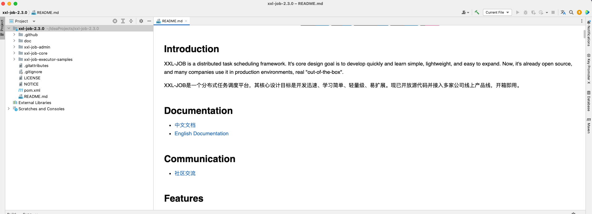
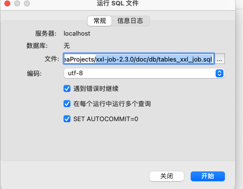
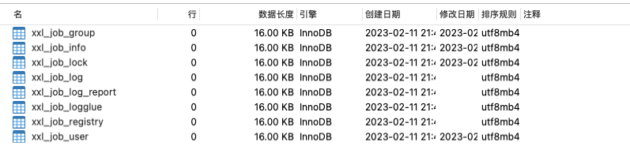
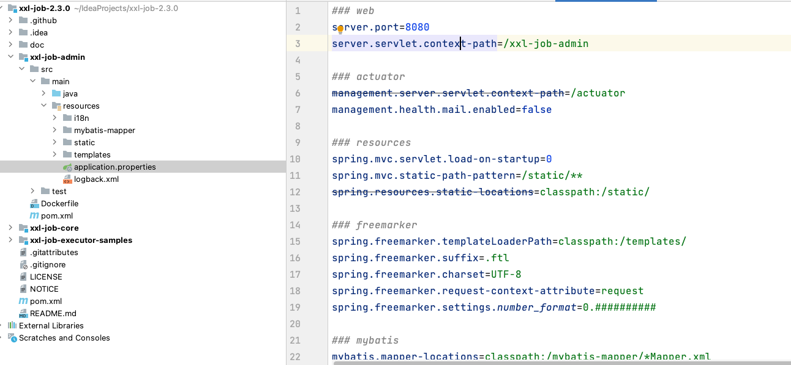
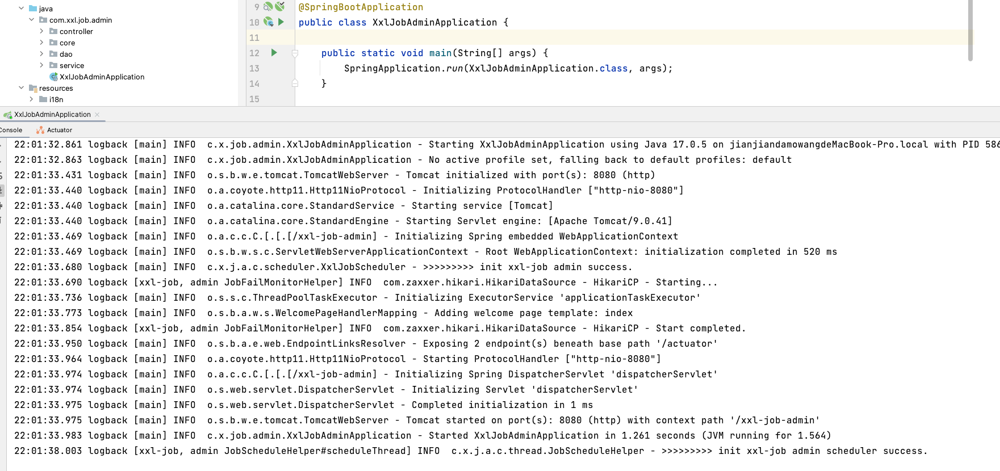
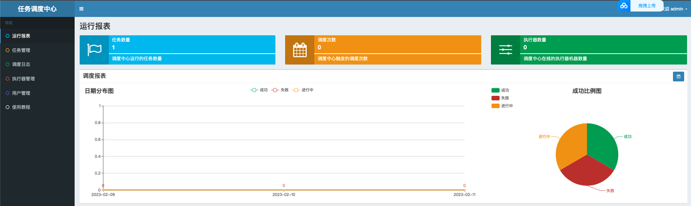

# 【Java开发笔记】XXL-JOB定时任务框架

## 1 基本介绍

XXL-JOB 是一个 **分布式的任务调度平台**，其核心设计目标是：学习简单、开发迅速、轻量级、易扩展，现在已经开放源代码并接入多家公司的线上产品线，开箱即用。XXL 是 XXL-JOB 的开发者大众点评的许雪里名称的拼音开头。

XXL-JOB 框架主要用于处理分布式的定时任务，其主要由调度中心和执行器组成。

官网平台：https://www.xuxueli.com/xxl-job/

特性：

- 简单：支持通过Web页面对任务进行CRUD操作，操作简单，一分钟上手；
- 动态：支持动态修改任务状态、启动/停止任务，以及终止运行中任务，即时生效；
- 调度中心HA（中心式）：调度采用中心式设计，“调度中心”自研调度组件并支持集群部署，可保证调度中心HA；
- 执行器HA（分布式）：任务分布式执行，任务”执行器”支持集群部署，可保证任务执行HA；
- ...

## 2 简单入门

### 2.1 下载

先进行下载：


下载后，使用idea打开工程：



其中，`xxl-job-admin` 是集中化的任务注册平台和管理平台，`xxl-job-core` 是核心依赖，如果某工程想使用 xxl-job，就必须导入此包。

### 2.2 配置数据库

在项目源码中，获取 “调度数据库初始化SQL脚本” 并执行。sql脚本路径：

```
/xxl-job/doc/db/tables_xxl_job.sql
```



执行sql脚本：



可以在 `application.properties` 中修改相关配置：



### 2.3 启动admin

启动admin，访问 http://localhost:8080/xxl-job-admin/ 

默认用户名 admin，默认密码 123456






