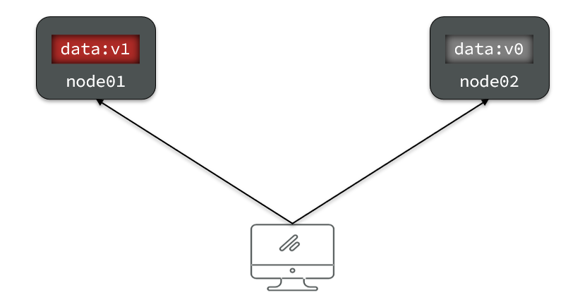
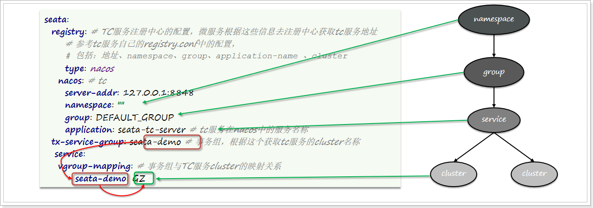
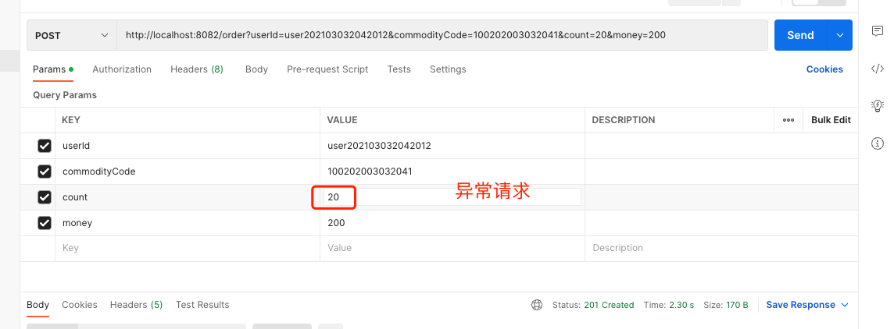
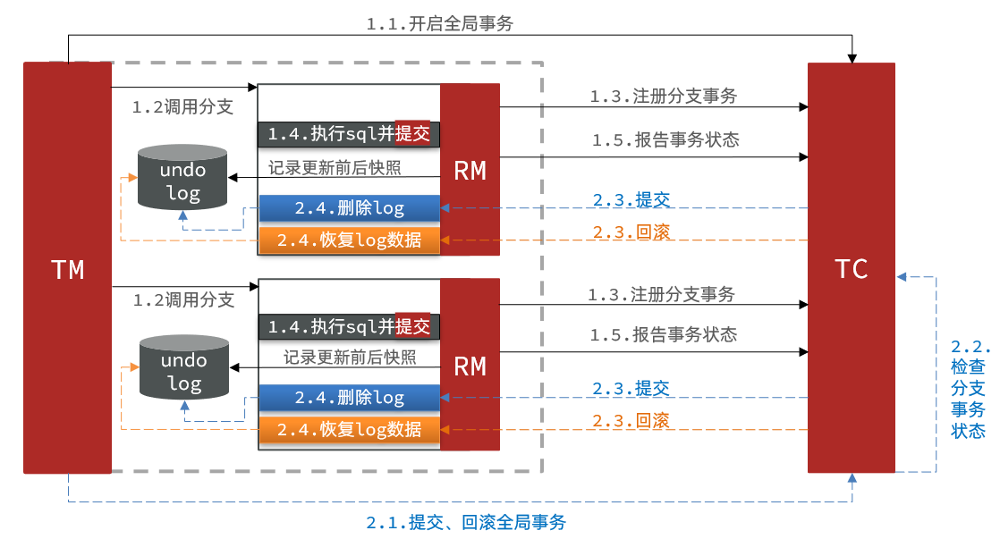
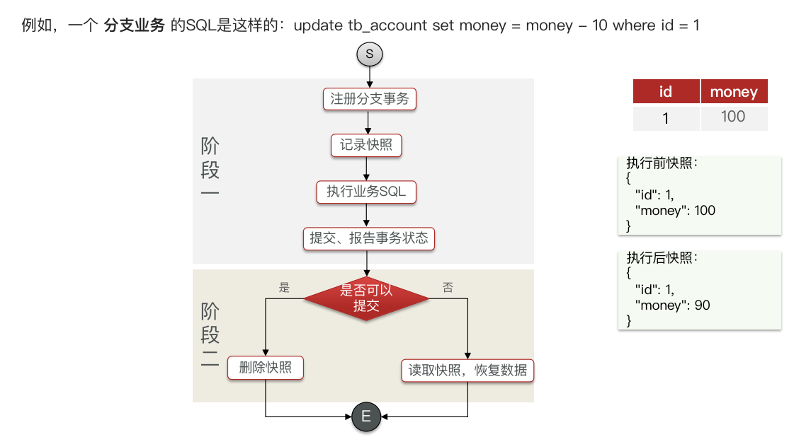

# 【Java开发笔记】分布式事务

## 1 分布式事务问题

### 1.1 本地事务

本地事务，也就是传统的 **单机事务** 。在传统数据库事务中，必须要满足四个原则：


### 1.2 分布式事务

**分布式事务**，就是指不是在单个服务或单个数据库架构下，产生的事务，例如：

- **跨数据源** 的分布式事务
- **跨服务** 的分布式事务
- 综合情况

在数据库水平拆分、服务垂直拆分之后，一个业务操作通常要跨多个数据库、服务才能完成。例如电商行业中比较常见的下单付款案例，包括下面几个行为：

- 创建新订单
- 扣减商品库存
- 从用户账户余额扣除金额

完成上面的操作需要访问 三个不同的微服务 和 三个不同的数据库。


订单的创建、库存的扣减、账户扣款在每一个服务和数据库内是一个本地事务，可以保证 ACID 原则。

但是当我们把三件事情看做一个"业务"，要满足保证 **“业务”的原子性** ，要么所有操作全部成功，要么全部失败，不允许出现部分成功部分失败的现象，这就是 **分布式系统下的事务** 了。

此时 ACID 难以满足，这是分布式事务要解决的问题。

#### 案例

创建三个表和对应的微服务：订单服务、账户服务和库存服务

用户表中只有一个用户，有 1000 块钱：


库存表中有一种商品，库存为 10 :


订单表为空：


我们发送一个请求：用户下单 20 个商品，花费 200：


显然会出错：


库存表仍然是 10 ，没有问题：


订单仍然是空，没有问题：


但是，用户被扣了 200 块：


测试发现，当库存不足时，如果余额已经扣减，并不会回滚，出现了分布式事务问题。

## 2 理论基础

### 2.1 CAP定理

Eric Brewer 提出，分布式系统有三个指标：

- Consistency（一致性）
- Availability（可用性）
- Partition tolerance （分区容错性）


> 这三个指标不可能同时做到，这个结论就是 CAP 定理。

#### 一致性

`Consistency（一致性）` ：用户访问分布式系统中的 **任意节点，得到的数据必须一致** 。

比如现在包含两个节点，其中的初始数据是一致的：


当我们修改其中一个节点的数据时，两者的数据产生了差异：



要想保住一致性，就必须实现 node01 到 node02 的数据 同步：


#### 可用性

`Availability （可用性）` ：用户访问集群中的 **任意健康节点，必须能得到响应，而不是超时或拒绝** 。

如图，有三个节点的集群，访问任何一个都可以及时得到响应：


当有部分节点因为网络故障或其它原因无法访问时，代表节点不可用：


#### 分区容错

**Partition（分区）**：因为网络故障或其它原因导致分布式系统中的部分节点与其它节点失去连接，形成 **独立分区**。


**Tolerance（容错）**：**在集群出现分区时，整个系统也要持续对外提供服务**

#### A、C 存在矛盾

在分布式系统中，系统间的网络不能 100% 保证健康，一定会有故障的时候，而服务又必须对外保证服务。

因此 **Partition Tolerance 不可避免。**

当节点接收到新的数据变更时，就会出现问题了：


如果此时要保证 **一致性**，就必须等待网络恢复，完成数据同步后，整个集群才对外提供服务，服务处于阻塞状态，不可用。

如果此时要保证 **可用性**，就不能等待网络恢复，那 node01、node02 与 node03 之间就会出现数据不一致。

> 也就是说，在 P 一定会出现的情况下，A 和 C 之间只能实现一个。

### 2.2 BASE理论

BASE 理论是对 CAP 的一种 **解决思路** ，包含三个思想：

- **Basically Available** **（基本可用）** ：分布式系统在出现故障时，允许损失部分可用性，即 **保证核心可用** 。
- **Soft State（软状态） ：**在一定时间内，**允许出现中间状态**，比如临时的不一致状态。
- **Eventually Consistent（最终一致性）** ：虽然无法保证强一致性，但是 **在软状态结束后，最终达到数据一致** 。

### 2.3 解决分布式事务的思路

> 需要根据 **业务需求** 来选择使用 AP 还是 CP。

分布式事务最大的问题是 **各个子事务的一致性问题** ，因此可以借鉴 CAP 定理和 BASE 理论，有两种解决思路：

- `AP 模式` ：各子事务分别执行和提交，允许出现结果不一致，然后采用弥补措施恢复数据即可，实现 **最终一致**。

- `CP 模式` ：各个子事务执行后互相等待，同时提交，同时回滚，达成 **强一致**。但事务等待过程中，处于弱可用状态。

但不管是哪一种模式，**都需要在子系统事务之间互相通讯，协调事务状态** ，也就是需要一个 **事务协调者(TC)**：


这里的子系统事务，称为 **分支事务** ，有关联的各个分支事务在一起称为 **全局事务** 。

## 3 Seata基本介绍

Seata 是 2019 年 1 月份蚂蚁金服和阿里巴巴共同开源的分布式事务解决方案。致力于提供高性能和简单易用的分布式事务服务，为用户打造一站式的分布式解决方案。

官网地址：http://seata.io/，其中的文档、播客中提供了大量的使用说明、源码分析。

### 3.1 Seata的架构

Seata 事务管理中有三个重要的角色：

- **TC (Transaction Coordinator) -** **事务协调者：**维护全局和分支事务的状态，协调全局事务提交或回滚。

- **TM (Transaction Manager) -** **事务管理器：**定义 **全局事务** 的范围、开始全局事务、提交或回滚全局事务。

- **RM (Resource Manager) -** **资源管理器：**管理 **分支事务** 处理的资源，与TC交谈以注册分支事务和报告分支事务的状态，并驱动分支事务提交或回滚。


Seata 基于上述架构提供了四种不同的分布式事务解决方案：

- `XA` 模式：**强一致性** 分阶段事务模式，牺牲了一定的可用性，无业务侵入
- `TCC` 模式：**最终一致** 的分阶段事务模式，有业务侵入
- `AT` 模式：**最终一致** 的分阶段事务模式，无业务侵入，也是 Seata 的 **默认模式**
- `SAGA` 模式：**长事务模式**，有业务侵入

无论哪种方案，都离不开 TC，也就是事务协调者。

### 3.2 部署TC服务

#### 下载 & 解压

地址：https://github.com/seata/seata/releases

#### 修改配置

修改 conf 目录下的 `application.yml` 文件：

内容如下：

```properties
server:
  port: 7091

spring:
  application:
    name: seata-server

logging:
  config: classpath:logback-spring.xml
  file:
    path: ${user.home}/logs/seata

console:
  user:
    username: seata
    password: seata

seata:
  config:
    # 读取tc服务端的配置文件的方式，这里是从nacos配置中心读取，这样如果tc是集群，可以共享配置
    type: nacos
    nacos:
      server-addr: 127.0.0.1:8846
      namespace:
      group: SEATA_GROUP
      username: nacos
      password: nacos
      ##if use MSE Nacos with auth, mutex with username/password attribute
      #access-key: ""
      #secret-key: ""
      data-id: seataServer.properties
  registry:
    # tc服务的注册中心类，这里选择nacos，也可以是eureka、zookeeper等
    type: nacos
    nacos:
      application: seata-server
      server-addr: 127.0.0.1:8846
      group: DEFAULT_GROUP
      namespace:
      cluster: GZ
      username: nacos
      password: nacos

#  server:
#    service-port: 8091 #If not configured, the default is '${server.port} + 1000'
  security:
    secretKey: SeataSecretKey0c382ef121d778043159209298fd40bf3850a017
    tokenValidityInMilliseconds: 1800000
    ignore:
      urls: /,/**/*.css,/**/*.js,/**/*.html,/**/*.map,/**/*.svg,/**/*.png,/**/*.ico,/console-fe/public/**,/api/v1/auth/login
```

#### 在Nacos中添加配置

特别注意，为了让 TC 服务的集群可以共享配置，我们选择了 nacos 作为统一配置中心。

因此服务端配置文件 `seataServer.properties` 文件需要在 nacos 中配好。

配置内容如下：

```properties
# 数据存储方式，db代表数据库
store.mode=db
store.db.datasource=druid
store.db.dbType=mysql
store.db.driverClassName=com.mysql.jdbc.Driver
store.db.url=jdbc:mysql://127.0.0.1:3306/seata?useUnicode=true&rewriteBatchedStatements=true
store.db.user=root
store.db.password=root
store.db.minConn=5
store.db.maxConn=30
store.db.globalTable=global_table
store.db.branchTable=branch_table
store.db.queryLimit=100
store.db.lockTable=lock_table
store.db.maxWait=5000
# 事务、日志等配置
server.recovery.committingRetryPeriod=1000
server.recovery.asynCommittingRetryPeriod=1000
server.recovery.rollbackingRetryPeriod=1000
server.recovery.timeoutRetryPeriod=1000
server.maxCommitRetryTimeout=-1
server.maxRollbackRetryTimeout=-1
server.rollbackRetryTimeoutUnlockEnable=false
server.undo.logSaveDays=7
server.undo.logDeletePeriod=86400000

# 客户端与服务端传输方式
transport.serialization=seata
transport.compressor=none
# 关闭metrics功能，提高性能
metrics.enabled=false
metrics.registryType=compact
metrics.exporterList=prometheus
metrics.exporterPrometheusPort=9898
```

其中的数据库地址、用户名、密码都需要修改成你自己的数据库信息。


#### 创建数据库表

记录全局事务、分支事务、全局锁等信息。


```sql

SET NAMES utf8mb4;
SET FOREIGN_KEY_CHECKS = 0;

-- ----------------------------
-- 分支事务表
-- ----------------------------
DROP TABLE IF EXISTS `branch_table`;
CREATE TABLE `branch_table`  (
  `branch_id` bigint(20) NOT NULL,
  `xid` varchar(128) CHARACTER SET utf8 COLLATE utf8_general_ci NOT NULL,
  `transaction_id` bigint(20) NULL DEFAULT NULL,
  `resource_group_id` varchar(32) CHARACTER SET utf8 COLLATE utf8_general_ci NULL DEFAULT NULL,
  `resource_id` varchar(256) CHARACTER SET utf8 COLLATE utf8_general_ci NULL DEFAULT NULL,
  `branch_type` varchar(8) CHARACTER SET utf8 COLLATE utf8_general_ci NULL DEFAULT NULL,
  `status` tinyint(4) NULL DEFAULT NULL,
  `client_id` varchar(64) CHARACTER SET utf8 COLLATE utf8_general_ci NULL DEFAULT NULL,
  `application_data` varchar(2000) CHARACTER SET utf8 COLLATE utf8_general_ci NULL DEFAULT NULL,
  `gmt_create` datetime(6) NULL DEFAULT NULL,
  `gmt_modified` datetime(6) NULL DEFAULT NULL,
  PRIMARY KEY (`branch_id`) USING BTREE,
  INDEX `idx_xid`(`xid`) USING BTREE
) ENGINE = InnoDB CHARACTER SET = utf8 COLLATE = utf8_general_ci ROW_FORMAT = Compact;

-- ----------------------------
-- 全局事务表
-- ----------------------------
DROP TABLE IF EXISTS `global_table`;
CREATE TABLE `global_table`  (
  `xid` varchar(128) CHARACTER SET utf8 COLLATE utf8_general_ci NOT NULL,
  `transaction_id` bigint(20) NULL DEFAULT NULL,
  `status` tinyint(4) NOT NULL,
  `application_id` varchar(32) CHARACTER SET utf8 COLLATE utf8_general_ci NULL DEFAULT NULL,
  `transaction_service_group` varchar(32) CHARACTER SET utf8 COLLATE utf8_general_ci NULL DEFAULT NULL,
  `transaction_name` varchar(128) CHARACTER SET utf8 COLLATE utf8_general_ci NULL DEFAULT NULL,
  `timeout` int(11) NULL DEFAULT NULL,
  `begin_time` bigint(20) NULL DEFAULT NULL,
  `application_data` varchar(2000) CHARACTER SET utf8 COLLATE utf8_general_ci NULL DEFAULT NULL,
  `gmt_create` datetime NULL DEFAULT NULL,
  `gmt_modified` datetime NULL DEFAULT NULL,
  PRIMARY KEY (`xid`) USING BTREE,
  INDEX `idx_gmt_modified_status`(`gmt_modified`, `status`) USING BTREE,
  INDEX `idx_transaction_id`(`transaction_id`) USING BTREE
) ENGINE = InnoDB CHARACTER SET = utf8 COLLATE = utf8_general_ci ROW_FORMAT = Compact;

SET FOREIGN_KEY_CHECKS = 1;
```

#### 启动TC服务

```sh
sh seata-server.sh
```


打开浏览器，访问 seata 控制台；地址：http://localhost:7091


打开浏览器，访问 nacos 地址：http://localhost:8848/nacos，然后进入服务列表页面，可以看到 seata-server 的信息：


### 3.3 微服务集成Seata

#### 3.3.1 引入依赖

需要在每个微服务中引入seata依赖：

```xml
<dependency>
    <groupId>com.alibaba.cloud</groupId>
    <artifactId>spring-cloud-starter-alibaba-seata</artifactId>
    <exclusions>
        <!--版本较低，1.3.0，因此排除-->
        <exclusion>
            <artifactId>seata-spring-boot-starter</artifactId>
            <groupId>io.seata</groupId>
        </exclusion>
    </exclusions>
</dependency>
<!--seata starter 采用1.5.1版本-->
<dependency>
    <groupId>io.seata</groupId>
    <artifactId>seata-spring-boot-starter</artifactId>
    <version>${seata.version}</version>
</dependency>
```

#### 3.3.2 修改配置文件

需要修改每个微服务中的 application.yml 文件，添加一些配置：

```yaml
seata:
  registry: # TC服务注册中心的配置，微服务根据这些信息去注册中心获取tc服务地址
    # 参考tc服务自己的 application.yml 中的配置
    type: nacos
    nacos: # tc
      server-addr: 127.0.0.1:8846
      namespace: ""
      group: DEFAULT_GROUP
      application: seata-server # tc服务在nacos中的服务名称
      cluster: GZ  #无效
  tx-service-group: seata-demo # 事务组，根据这个获取tc服务的cluster名称
  service:
    vgroup-mapping: # 事务组与TC服务cluster的映射关系
      seata-demo: GZ
```

微服务如何根据这些配置寻找TC的地址呢？

我们知道注册到 Nacos 中的微服务，确定一个具体实例需要四个信息：

- **namespace**：命名空间
- **group**：分组
- **application**：服务名
- **cluster**：集群名

以上四个信息，在刚才的yaml文件中都能找到：



namespace 为空，就是默认的 public

结合起来，TC 服务的信息就是：`public@DEFAULT_GROUP@seata-tc-server@GZ`，这样就能确定TC服务集群了。然后就可以去Nacos拉取对应的实例信息了。

## 4 事务模式

### 4.1 XA模式（强一致性）

XA 规范 是 X/Open 组织定义的分布式事务处理（DTP，Distributed Transaction Processing）标准，**XA 规范描述了全局的 TM 与局部的 RM 之间的接口** ，几乎所有主流的数据库都对 XA 规范 提供了支持。

#### 4.1.1 两阶段提交

XA 是规范，目前主流数据库都实现了这种规范，实现的原理都是 **基于两阶段提交** 。

正常情况：


异常情况：


一阶段：

- 事务协调者 **通知** 每个事务参与者执行本地事务
- 本地事务执行完成后报告事务执行状态给事务协调者，**此时事务不提交，继续持有数据库锁**

二阶段：

- 事务协调者基于一阶段的报告来判断下一步操作
  - 如果一阶段都成功，则通知所有事务参与者，提交事务
  - 如果一阶段任意一个参与者失败，则通知所有事务参与者回滚事务

#### 4.1.2.Seata的XA模型

Seata 对原始的 XA 模式做了简单的封装和改造，以适应自己的事务模型，基本架构如图：


RM 一阶段的工作：

- 注册分支事务到 TC
- 执行分支业务 sql 但不提交
- 报告执行状态到 TC

TC 二阶段的工作：

- TC 检测各分支事务执行状态
  - 如果都成功，通知所有 RM 提交事务
  - 如果有失败，通知所有 RM 回滚事务


RM 二阶段的工作：

- 接收 TC 指令，提交或回滚事务

#### 4.1.3.优缺点

XA 模式的优点是什么？

- **事务的强一致性，满足 ACID 原则。**
- 常用关系型数据库都支持，实现简单，并且没有代码侵入

XA 模式的缺点是什么？

- 因为一阶段需要 **锁定数据库资源，等待二阶段结束才释放** ，**性能较差**
- 依赖关系型数据库实现事务

#### 4.1.4 实现XA模式

Seata 的 starter 已经完成了XA模式的自动装配，实现非常简单，步骤如下：

1）修改 `application.yml` 文件（**每个参与事务的微服务**），开启 XA 模式：

```yaml
seata:
  data-source-proxy-mode: XA
```

2）给发起全局事务的入口方法添加 `@GlobalTransactional` 注解:

本例中是 `OrderServiceImpl` 中的 `create` 方法.


3）重启服务并测试

重启 order-service，再次测试，发现无论怎样，三个微服务都能成功回滚。


能够正常交易，产生订单：


测试分布式事务：



测试通过：


### 4.2 AT模式（弱一致）

AT 模式同样是 **分阶段提交** 的事务模型，不过缺弥补了 XA 模型中 **资源锁定周期过长的缺陷** 。

#### 4.2.1.Seata的AT模型

基本流程图：



阶段一 RM 的工作：

- 注册分支事务
- **记录 undo-log（数据快照）**
- **执行业务 sql 并提交**
- 报告事务状态

阶段二「提交」时 RM 的工作：

- **删除 undo-log 即可**

阶段二「回滚」时 RM 的工作：

- **根据 undo-log 恢复数据到更新前**



#### 4.2.3 AT与XA的区别

> 简述 AT 模式与 XA 模式最大的区别是什么？

- XA 模式一阶段不提交事务，锁定资源；AT 模式一阶段直接提交，不锁定资源。
- XA 模式依赖数据库机制实现回滚；AT 模式利用数据快照实现数据回滚。
- XA 模式强一致；AT 模式最终一致

#### 4.2.4 脏写问题

在多线程并发访问 AT 模式的分布式事务时，有可能出现脏写问题，如图：


解决思路：引入 **全局锁** 。**在释放 DB 锁之前，先拿到全局锁，避免同一时刻有另外一个事务来操作当前数据。**


但如果不是使用 seata 管理的全局事务插入，对同行数据进行修改：


#### 4.2.5 优缺点

AT 模式的优点：

- **一阶段完成直接提交事务，释放数据库资源，性能比较好**
- **利用全局锁实现读写隔离，解决多线程的脏写问题**
- 没有代码侵入，框架自动完成回滚和提交

AT 模式的缺点：

- 两阶段之间属于 **软状态，属于最终一致**
- 框架的 **快照功能** 会影响性能，但比 XA 模式要好很多

#### 4.2.6 案例

1）在业务微服务数据库中创建表 `undo_log`：


在 seata 自己的数据库中创建表：


2）修改 `application.yml` 文件，将事务模式修改为AT模式即可：

```yaml
seata:
  data-source-proxy-mode: AT # 默认就是AT
```

3）重启服务并测试

发现确实会回滚数据


### 4.3 TCC模式（弱一致）

TCC 模式与 AT 模式非常相似，**每阶段都是独立事务**，不同的是 TCC 通过 **人工编码** 来实现数据恢复。需要实现三个方法：

- `Try` ：资源的检测和预留；
- `Confirm` ：完成资源操作业务；要求 Try 成功 Confirm 一定要能成功
- `Cancel` ：预留资源释放，可以理解为 Try 的反向操作

#### 4.3.1 流程分析

举例，一个扣减用户余额的业务。假设账户 A 原来余额是 100，需要余额扣减 30 元。

- **阶段一（ Try ）**：检查余额是否充足，如果充足则冻结金额增加 30 元，可用余额扣除 30

初识余额：


余额充足，可以冻结：


此时，总金额 = 冻结金额 + 可用金额，数量依然是 100 不变。事务直接提交无需等待其它事务。

- **阶段二（Confirm)**：假如要提交（Confirm），则冻结金额扣减30

确认可以提交，不过之前可用金额已经扣减过了，这里只要清除冻结金额就好了：


此时，总金额 = 冻结金额 + 可用金额 = 0 + 70  = 70元

- **阶段二(Canncel)**：如果要回滚（Cancel），则冻结金额扣减 30，可用余额增加 30

需要回滚，那么就要释放冻结金额，恢复可用金额：


#### 4.3.2 Seata的TCC模型

Seata 中的 TCC 模型依然延续之前的事务架构，如图：


#### 4.3.3 优缺点

TCC 模式的每个阶段是做什么的？

- Try：资源检查和预留
- Confirm：业务执行和提交
- Cancel：预留资源的释放

TCC 的优点是什么？

- 一阶段完成直接提交事务，释放数据库资源，**性能好**
- 相比 AT 模型，**无需生成快照，无需使用全局锁，性能最强**
- **不依赖数据库事务，而是依赖补偿操作，可以用于非事务型数据库**

TCC 的缺点是什么？

- **有代码侵入**，需要人为编写 try、Confirm 和 Cancel 接口，太麻烦
- 软状态，事务是最终一致
- 需要考虑 Confirm 和 Cancel 的失败情况，做好幂等处理

#### 4.3.4 事务悬挂和空回滚

##### 1）空回滚

当某分支事务的 try 阶段 **阻塞** 时，可能导致全局事务超时而触发二阶段的 cancel 操作。在未执行 try 操作时先执行了cancel 操作，这时 cancel 不能做回滚，就是 **空回滚**。

如图：


> **执行 cancel 操作时，应当判断 try 是否已经执行**，如果尚未执行，则应该空回滚。

##### 2）业务悬挂

对于已经空回滚的业务，**之前被阻塞的 try 操作恢复，继续执行 try，就永远不可能 confirm 或 cancel** ，事务一直处于中间状态，这就是 **业务悬挂**。

> **执行 try 操作时，应当判断 cancel 是否已经执行过了**，如果已经执行，应当阻止空回滚后的 try 操作，避免悬挂。

#### 4.3.5 实现TCC模式

解决 **空回滚** 和 **业务悬挂** 问题，必须要记录当前事务状态，是在 try、还是 cancel？


**1）思路分析**

这里我们定义一张表；在 seata_demo数据库中创建如下表：

```sql
CREATE TABLE `account_freeze_tbl`(
    `xid` varchar(128) NOT NULL,
    `user_id` varchar(255) DEFAULT NULL COMMENT'用户id',
    `freeze_money`int(11) unsigned DEFAULT'0'COMMENT'冻结金额',
    `state`int(1) DEFAULT NULL COMMENT'事务状态，0:try，1:confirm，2:cancel',
    PRIMARY KEY(`xid`)USING BTREE
)ENGINE=InnoDB DEFAULT CHARSET=utf8 ROW_FORMAT=COMPACT;
```

其中：

- xid：是全局事务id
- freeze_money：用来记录用户冻结金额
- state：用来记录事务状态

那此时，我们的业务开怎么做呢？

- Try 业务：
  - 记录冻结金额和事务状态到 account_freeze 表
  - 扣减 account 表可用金额
- Confirm 业务
  - 根据 xid 删除 account_freeze 表的冻结记录
- Cancel 业务
  - 修改 account_freeze 表，冻结金额为0，state为2
  - 修改 account 表，恢复可用金额
- 如何判断是否空回滚？
  - cancel 业务中，根据 xid 查询 account_freeze，如果为 null 则说明 try 还没做，需要空回滚
- 如何避免业务悬挂？
  - try 业务中，根据 xid 查询 account_freeze ，如果已经存在则证明 Cancel 已经执行，拒绝执行 try 业务

接下来，我们改造 account-service，利用 TCC 实现余额扣减功能。

**2）声明TCC接口**

TCC 的 Try、Confirm、Cancel 方法都需要在接口中基于注解来声明，

我们在 `account-service` 项目中的 `cn.itcast.account.service` 包中新建一个接口，声明TCC三个接口：

```java
@LocalTCC
public interface AccountTCCService {

    /**
     * 根据用户id扣减余额，记录冻结金额
     * commitMethod 提交时对于的方法；rollbackMethod回滚时对于的方法
     * @param userId 用户id
     * @param money 扣减金额
     */
    @TwoPhaseBusinessAction(name = "deduct", commitMethod = "confirm", rollbackMethod = "cancel")
    void deduct(@BusinessActionContextParameter("userId")String userId,
                @BusinessActionContextParameter("money")int money);

    /**
     * 执行TCC事务时，提交事务时执行的方法
     * @param ctx 上下文对象
     * @return 执行结果
     */
    Boolean confirm(BusinessActionContext ctx);
    /**
     * 执行TCC事务时，回滚事务时执行的方法
     * @param ctx 上下文对象
     * @return 执行结果
     */
    Boolean cancel(BusinessActionContext ctx);
}
```

在 `account-service` 服务中的 `cn.itcast.account.service.impl` 包下新建一个类，实现TCC业务：

```java
@Service
public class AccountTCCServiceImpl implements AccountTCCService {

    @Autowired
    private AccountMapper accountMapper;

    @Autowired
    private AccountFreezeMapper accountFreezeMapper;

    @Override
    @Transactional
    public void deduct(String userId, int money) {
        //获取事务id
        String xid = RootContext.getXID();
        //处理业务悬挂
        AccountFreeze freeze = accountFreezeMapper.selectById(xid);
        if (freeze != null) {
            //已经cancel过，拒绝业务
            return;
        }

        //1 扣减余额
        accountMapper.deduct(userId, money);

        //2 记录冻结金额
        AccountFreeze accountFreeze = new AccountFreeze();
        accountFreeze.setXid(xid);
        accountFreeze.setUserId(userId);
        accountFreeze.setFreezeMoney(money);
        accountFreeze.setState(AccountFreeze.State.TRY);
        accountFreezeMapper.insert(accountFreeze);
    }

    @Override
    public Boolean confirm(BusinessActionContext ctx) {
        //删除冻结金额
        String xid = ctx.getXid();
        int count = accountFreezeMapper.deleteById(xid);
        return count==1;
    }

    @Override
    public Boolean cancel(BusinessActionContext ctx) {
        //获取全局事务id
        String xid = ctx.getXid();
        //用户id
        String userId = ctx.getActionContext("userId").toString();
        AccountFreeze accountFreeze = accountFreezeMapper.selectById(xid);

        //处理空回滚
        if (accountFreeze == null) {
            accountFreeze = new AccountFreeze();
            accountFreeze.setXid(xid);
            accountFreeze.setUserId(userId);
            accountFreeze.setFreezeMoney(0);
            accountFreeze.setState(AccountFreeze.State.CANCEL);
            accountFreezeMapper.insert(accountFreeze);
            return true;
        }

        //幂等处理
        if (accountFreeze.getState() == AccountFreeze.State.CANCEL) {
            //说明已经回滚过了；不需要再处理
            return true;
        }

        //1 回退金额
        accountMapper.refund(userId, accountFreeze.getFreezeMoney());

        //2 更新冻结金额为0和状态
        accountFreeze.setFreezeMoney(0);
        accountFreeze.setState(AccountFreeze.State.CANCEL);
        int count = accountFreezeMapper.updateById(accountFreeze);

        return count==1;
    }
}
```

改造 `src/main/java/cn/itcast/account/web/AccountController.java` 如下：


### 4.4 SAGA模式（最终一致）

Saga 模式是 Seata 即将开源的 **长事务** 解决方案，将由蚂蚁金服主要贡献。

#### 4.4.1 原理

在 Saga 模式下，分布式事务内有多个参与者，每一个参与者都是一个冲正补偿服务，需要用户根据业务场景实现其正向操作和逆向回滚操作。

分布式事务执行过程中，依次执行各参与者的正向操作，如果所有正向操作均执行成功，那么分布式事务提交。如果任何一个正向操作执行失败，那么分布式事务会去退回去执行前面各参与者的逆向回滚操作，回滚已提交的参与者，使分布式事务回到初始状态。


Saga 也分为两个阶段：

- 一阶段：直接提交本地事务
- 二阶段：成功则什么都不做；失败则通过 **编写补偿业务** 来回滚

#### 4.4.2 优缺点

优点：

- 事务参与者可以基于事件驱动实现异步调用，吞吐高
- 一阶段直接提交事务，无锁，性能好
- 不用编写 TCC 中的三个阶段，实现简单

缺点：

- **软状态持续时间不确定，时效性差**
- **没有锁，没有事务隔离，会有脏写**

### 4.5 四种模式对比

我们从以下几个方面来对比四种实现：

- 一致性：能否保证事务的一致性？强一致还是最终一致？
- 隔离性：事务之间的隔离性如何？
- 代码侵入：是否需要对业务代码改造？
- 性能：有无性能损耗？
- 场景：常见的业务场景


## 5 TC高可用和异地容灾

搭建TC服务集群非常简单，启动多个 TC 服务，注册到 nacos 即可。

但集群并不能确保 100% 安全，万一集群所在机房故障怎么办？所以如果要求较高，一般都会做异地多机房容灾。

比如一个TC集群在广州，另一个TC集群在杭州：


微服务基于事务组（tx-service-group)与 TC 集群的映射关系，来查找当前应该使用哪个 TC 集群。当 GZ 集群故障时，只需要将 vgroup-mapping 中的映射关系改成HZ。则所有微服务就会切换到 HZ 的 TC 集群了。

### 5.1 模拟异地容灾的TC集群

计划启动两台 seata 的 tc 服务节点：

| 节点名称 | ip地址    | 端口号 | 集群名称 |
| -------- | --------- | ------ | -------- |
| seata    | 127.0.0.1 | 8091   | GZ       |
| seata2   | 127.0.0.1 | 8092   | HZ       |

之前我们已经启动了一台 seata 服务，端口是 8091，集群名为 GZ。

现在，将 seata 目录复制一份，起名为 seata2

修改 seata2/conf/application.yml 内容如下：

```nginx
server:
  port: 7092

spring:
  application:
    name: seata-server

logging:
  config: classpath:logback-spring.xml
  file:
    path: ${user.home}/logs/seata

console:
  user:
    username: seata
    password: seata

seata:
  config:
    # 读取tc服务端的配置文件的方式，这里是从nacos配置中心读取，这样如果tc是集群，可以共享配置
    type: nacos
    nacos:
      server-addr: 127.0.0.1:8848
      namespace:
      group: SEATA_GROUP
      username: nacos
      password: nacos
      ##if use MSE Nacos with auth, mutex with username/password attribute
      #access-key: ""
      #secret-key: ""
      data-id: seataServer.properties
  registry:
    # tc服务的注册中心类，这里选择nacos，也可以是eureka、zookeeper等
    type: nacos
    nacos:
      application: seata-server
      server-addr: 127.0.0.1:8848
      group: DEFAULT_GROUP
      namespace:
      cluster: HZ
      username: nacos
      password: nacos
  server:
    service-port: 8092 #If not configured, the default is '${server.port} + 1000'
  security:
    secretKey: SeataSecretKey0c382ef121d778043159209298fd40bf3850a017
    tokenValidityInMilliseconds: 1800000
    ignore:
      urls: /,/**/*.css,/**/*.js,/**/*.html,/**/*.map,/**/*.svg,/**/*.png,/**/*.ico,/console-fe/public/**,/api/v1/auth/login
```

进入seata2/bin目录，然后运行双击 `seata-server.bat`

打开nacos控制台，查看服务列表：


点进详情查看：


### 5.2 将事务组映射配置到nacos

接下来，我们需要将 tx-service-group 与 cluster 的映射关系都配置到nacos配置中心。

新建一个配置：


配置的内容如下：

```properties
# 事务组映射关系
service.vgroupMapping.seata-demo=GZ

service.enableDegrade=false
service.disableGlobalTransaction=false
# 与TC服务的通信配置
transport.type=TCP
transport.server=NIO
transport.heartbeat=true
transport.enableClientBatchSendRequest=false
transport.threadFactory.bossThreadPrefix=NettyBoss
transport.threadFactory.workerThreadPrefix=NettyServerNIOWorker
transport.threadFactory.serverExecutorThreadPrefix=NettyServerBizHandler
transport.threadFactory.shareBossWorker=false
transport.threadFactory.clientSelectorThreadPrefix=NettyClientSelector
transport.threadFactory.clientSelectorThreadSize=1
transport.threadFactory.clientWorkerThreadPrefix=NettyClientWorkerThread
transport.threadFactory.bossThreadSize=1
transport.threadFactory.workerThreadSize=default
transport.shutdown.wait=3
# RM配置
client.rm.asyncCommitBufferLimit=10000
client.rm.lock.retryInterval=10
client.rm.lock.retryTimes=30
client.rm.lock.retryPolicyBranchRollbackOnConflict=true
client.rm.reportRetryCount=5
client.rm.tableMetaCheckEnable=false
client.rm.tableMetaCheckerInterval=60000
client.rm.sqlParserType=druid
client.rm.reportSuccessEnable=false
client.rm.sagaBranchRegisterEnable=false
# TM配置
client.tm.commitRetryCount=5
client.tm.rollbackRetryCount=5
client.tm.defaultGlobalTransactionTimeout=60000
client.tm.degradeCheck=false
client.tm.degradeCheckAllowTimes=10
client.tm.degradeCheckPeriod=2000

# undo日志配置
client.undo.dataValidation=true
client.undo.logSerialization=jackson
client.undo.onlyCareUpdateColumns=true
client.undo.logTable=undo_log
client.undo.compress.enable=true
client.undo.compress.type=zip
client.undo.compress.threshold=64k
client.log.exceptionRate=100
```

### 5.3 微服务读取nacos配置

接下来，需要修改每一个微服务的application.yml文件，让微服务读取nacos中的client.properties文件：

```yaml
seata:
  config:
    type: nacos
    nacos:
      server-addr: 127.0.0.1:8848
      username: nacos
      password: nacos
      group: SEATA_GROUP
      data-id: client.properties
```

> 也注释掉原来文件中的如下内容（如果不注释也可以；则作为一个默认，对动态切换集群不受影响）：
>
> ```
> service:
> vgroup-mapping: # 事务组与TC服务cluster的映射关系
>  seata-demo: GZ
> ```

重启微服务，现在微服务到底是连接tc的GZ集群，还是tc的HZ集群，都统一由nacos的client.properties来决定了。


