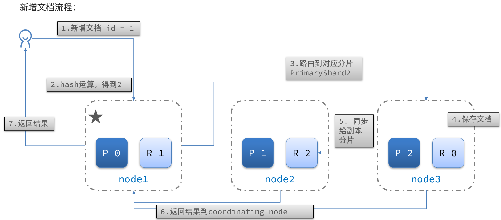
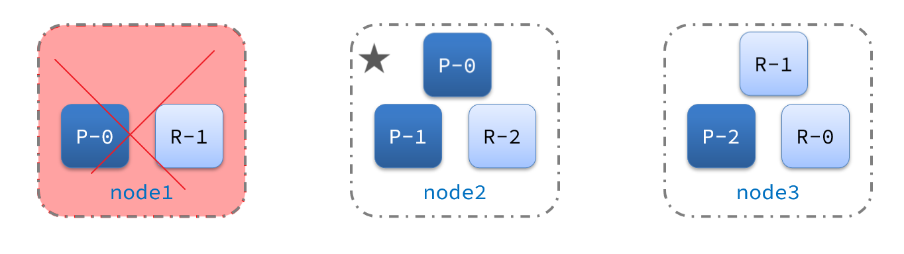

# 【Java开发笔记】分布式搜索引擎

## 1 Elasticsearch基本介绍

想象下假设 JD 上有上千万商品，现在要求搜索出包含 “手机” 的商品有哪些（并搜索出商品ID，商品图片地址，商品价格，商品的名称）也就是说实现 JD 的搜索的功能，如何处理？

```properties
SSM的缺点：
	+ 搜索精度不高
	+ 搜索的速度太慢，主要是正向搜索的方式
可以使用 elasticsearch 解决上面的问题：
	+ 分词器 精度提高
	+ 倒排索引 方式极大提高搜索速度	
```

Elasticsearch 是一款非常强大的开源搜索引擎，具备非常多强大功能，可以帮助我们从海量数据中快速找到需要的内容。

官方地址：https://www.elastic.co/guide/cn/elasticsearch/guide/2.x/intro.html

### 1.1 ELK技术栈

Elasticsearch 结合 kibana、Logstash、Beats，也就是 **Elastic stack（ELK）**。

被广泛应用在 **日志数据分析、实时监控** 等领域：

 

而 Elasticsearch 是 Elastic stack 的核心，负责 **存储、搜索、分析数据**。


### 1.2 正向索引与倒排索引

先对比一下正向索引和倒排索引。

#### 1.2.1 正向索引

那么什么是正向索引呢？例如给下表（tb_goods）中的 id 创建索引：


**如果是根据 id 查询，那么直接走索引，查询速度非常快。**

**但如果是基于 title 做模糊查询，只能是逐行扫描数据**，流程如下：

1）用户搜索数据，条件是 title 符合`"%手机%"`

2）逐行获取数据，比如 id 为 1 的数据

3）判断数据中的 title 是否符合用户搜索条件

4）如果符合则放入结果集，不符合则丢弃。回到步骤1

因为上述是使用了模糊查询，因此 **索引会失效**，只能逐行扫描，也就是 **全表扫描（全表查询）**，随着数据量增加，其查询效率也会越来越低。当数据量达到数百万时，就是一场灾难。

#### 1.2.2 倒排索引

倒排索引中有两个非常重要的概念：

- 文档（`Document`）：用来搜索的数据，其中的每一条数据就是一个文档。例如一个网页、一个商品信息
- 词条（`Term`）：对文档数据或用户搜索数据，利用某种算法分词，得到的具备含义的词语就是词条。例如：我是中国人，就可以分为：我、是、中国人、中国、国人这样的几个词条

**创建倒排索引** 是对正向索引的一种特殊处理，流程如下：

- 将每一个文档的数据利用 **算法分词**，得到一个个词条
- 创建表，每行数据包括词条、词条所在文档 id、位置等信息
- 因为词条唯一性，可以给词条创建索引，例如 hash 表结构索引

如图：


倒排索引的 **搜索流程** 如下（以搜索"华为手机"为例）：

1）用户输入条件 `"华为手机"` 进行搜索。

2）对用户输入内容 **分词**，得到词条：`华为`、`手机`。

3）拿着词条在倒排索引中查找，可以得到包含词条的文档id：1、2、3。

4）拿着文档 id 到 **正向索引** 中查找具体文档。

如图：


**虽然要先查询倒排索引，再查询正向索引，但是无论是 词条、还是文档 id 都建立了索引，查询速度非常快！无需全表扫描。**

倒排索引中包含两部分内容：

- **词条字典（Term Dictionary）**：记录所有词条，以及词条与倒排列表之间的关系，会给词条建立索引，提高查询和插入效率。
- **倒排列表（Posting List）**：记录词条所在的文档 id、词条出现频率、词条在文档中的位置等信息。
  - 文档 id：用于快速获取文档
  - 词条频率（TF）：文档在词条出现的次数，用于评分


> 【总结】什么是文档？什么是词条？
>
> - 文档：mysql中的一条数据就是一个文档
> - 词条：对文档中的内容进行分词得到的词条
>
> 【总结】什么是正向索引？
>
> - 基于文档 id 创建索引，查询词条时，必须根据先找到文档，再对文档内容进行判断
>
> 【总结】什么是倒排索引？
>
> - 先根据文档内容进行分词，对词条创建索引，并记录词条所在的文档 id。
> - 查询时，先根据词条查询文档 id，再根据文档 id 获取到文档。

### 1.3 ES的基本概念

#### 1.3.1.文档和字段

elasticsearch 是面向 **文档（Document）（就是说 ES 存储的都是 JSON 数据）存储的**，可以是数据库中的一条商品数据，一个订单信息。文档数据会被 **序列化** 为 `json` 格式后存储在 elasticsearch 中：


而 Json 文档中往往包含很多的 **字段（Field）** ，类似于数据库中的列。

#### 1.3.2 索引和映射

**索引（Index）**，就是 **相同类型的文档的集合** 。

例如：

- 所有用户文档，就可以组织在一起，称为用户的索引；
- 所有商品的文档，可以组织在一起，称为商品的索引；
- 所有订单的文档，可以组织在一起，称为订单的索引；


因此，我们 **可以把 索引 当做是数据库中的 表** 。

数据库的表会有约束信息，用来定义表的结构、字段的名称、类型等信息。因此，索引库中就有 **映射（mapping）** 这样的概念，是索引中 **文档的字段约束信息，类似表的结构约束** 。

#### 1.3.3 与mysql对比

我们统一的把 mysql 与 elasticsearch 的概念做一下对比：

|   **MySQL**   | **Elasticsearch** | **说明**                                                     |
| :-----------: | :---------------: | ------------------------------------------------------------ |
|     Table     |       Index       | 索引(index)，就是文档的集合，类似数据库的表(table)           |
|      Row      |     Document      | 文档（Document），就是一条条的数据，类似数据库中的行（Row），文档都是 JSON 格式 |
|    Column     |       Field       | 字段（Field），就是 JSON 文档中的字段，类似数据库中的列（Column） |
| Schema（DDL） |      Mapping      | Mapping（映射）是索引中文档的约束，例如字段类型约束。类似数据库的表结构（Schema） |
|      SQL      |        DSL        | DSL (Domain Specific Language)是 elasticsearch 提供的 JSON 风格的请求语句，用来操作 elasticsearch，实现 CRUD |

> 是不是说，我们学习了 elasticsearch 就不再需要 mysql 了呢？
>
> 并不是如此，两者各自有自己的擅长：
>
> - Mysql：擅长 **事务类型** 操作，可以确保数据的 **安全和一致性**
>
> - Elasticsearch：擅长 **海量数据的搜索、分析、计算**

因此在企业中，往往是两者结合使用：

- 对安全性要求较高的写操作，使用 mysql 实现
- 对 **查询性能要求较高的搜索需求** ，使用 elasticsearch 实现
- 两者再基于某种方式，实现数据的同步，保证一致性


### 1.4 安装ES、Kibana、IK插件

1. **卸载**

```shell
docker rm -f `docker  ps -a -q`

docker volume rm es-data

docker volume rm es-plugins
```

2. **创建网络**

因为我们还需要部署 kibana 容器，因此需要让 **es 和 kibana 容器互联** 。这里先创建一个网络：

> 注意：**容器与容器之间进行通信，必须创建网络！**

```sh
docker network create es-net
```

3. **下载镜像**

这里我们采用 elasticsearch 的 7.12.1 版本的镜像。

```sh
docker pull elasticsearch:7.12.1
```

4. **运行容器**

```
docker run -d \
    --name es \
    -e "ES_JAVA_OPTS=-Xms512m -Xmx512m" \
    -e "discovery.type=single-node" \
    -v es-data:/usr/share/elasticsearch/data \
    -v es-plugins:/usr/share/elasticsearch/plugins \
    --privileged \
    --network es-net \
    -p 9200:9200 \
    -p 9300:9300 \
elasticsearch:7.12.1
```

命令解释：

- `-e "cluster.name=es-docker-cluster"`：设置集群名称
- `-e "http.host=0.0.0.0"`：监听的地址，可以外网访问
- `-e "ES_JAVA_OPTS=-Xms512m -Xmx512m"`：内存大小
- `-e "discovery.type=single-node"`：非集群模式
- `-v es-data:/usr/share/elasticsearch/data`：挂载逻辑卷，绑定es的数据目录
- `-v es-logs:/usr/share/elasticsearch/logs`：挂载逻辑卷，绑定es的日志目录
- `-v es-plugins:/usr/share/elasticsearch/plugins`：挂载逻辑卷，绑定es的插件目录
- `--privileged`：授予逻辑卷访问权
- `--network es-net` ：加入一个名为es-net的网络中
- `-p 9200:9200`：端口映射配置

在浏览器中输入：http://192.168.223.130:9200 即可看到 elasticsearch 的响应结果：


5. **下载、运行 kibana**

```sh
docker run -d \
--name kibana \
-e ELASTICSEARCH_HOSTS=http://es:9200 \
--network=es-net \
-p 5601:5601  \
kibana:7.12.1
```


6. **开发工具**


kibana 中提供了一个 DevTools 界面：


这个界面中可以编写 DSL 来操作 elasticsearch。并且对 DSL 语句有自动补全功能。

7. **在线安装ik插件（很慢！！！）**

IK分词器包含两种模式：

* `ik_smart`：最少切分

* `ik_max_word`：最细切分

```sh
# 进入容器内部
docker exec -it es /bin/bash

# 在线下载并安装
./bin/elasticsearch-plugin  install https://github.com/medcl/elasticsearch-analysis-ik/releases/download/v7.12.1/elasticsearch-analysis-ik-7.12.1.zip

#退出
exit
#重启容器
docker restart es
```


加载成功，尝试使用下：


8. **扩展词词典**

随着互联网的发展，“造词运动”也越发的频繁。出现了很多新的词语，在原有的词汇列表中并不存在。比如：“奥力给”等。所以我们的词汇也需要不断的更新，IK分词器提供了扩展词汇的功能。

1）打开 IK 分词器 config 目录：

2）在IKAnalyzer.cfg.xml配置文件内容添加：

```xml
<?xml version="1.0" encoding="UTF-8"?>
<!DOCTYPE properties SYSTEM "http://java.sun.com/dtd/properties.dtd">
<properties>
        <comment>IK Analyzer 扩展配置</comment>
        <!--用户可以在这里配置自己的扩展字典 *** 添加扩展词典-->
        <entry key="ext_dict">ext.dic</entry>
</properties>
```


3）新建一个 `ext_tmp.dic`，可以参考config目录下复制一个配置文件进行修改

```properties
奥力给
德玛西亚
诺克萨斯
```

4）重启elasticsearch 

```sh
docker restart es

# 查看 日志
docker logs -f es
```


9. **停用词典**

在互联网项目中，在网络间传输的速度很快，所以很多语言是不允许在网络上传递的，如：关于宗教、政治等敏感词语，那么我们在搜索时也应该忽略当前词汇。

IK 分词器也提供了强大的停用词功能，让我们在索引时就直接忽略当前的停用词汇表中的内容。

1）IKAnalyzer.cfg.xml 配置文件内容添加：

```xml
<?xml version="1.0" encoding="UTF-8"?>
<!DOCTYPE properties SYSTEM "http://java.sun.com/dtd/properties.dtd">
<properties>
        <comment>IK Analyzer 扩展配置</comment>
        <!--用户可以在这里配置自己的扩展字典-->
        <entry key="ext_dict">ext.dic</entry>
         <!--用户可以在这里配置自己的扩展停止词字典  *** 添加停用词词典-->
        <entry key="ext_stopwords">stopword.dic</entry>
</properties>
```

3）在 stopword.dic 添加停用词

```properties
习大大
```

4）重启elasticsearch 

```sh
# 重启服务
docker restart es
docker restart kibana

# 查看 日志
docker logs -f es
```

日志中已经成功加载 stopword.dic 配置文件

10. **部署ES集群**

部署 es 集群可以直接使用 docker-compose 来完成，不过要求你的 Linux 虚拟机至少有 **4G **的内存空间

首先编写一个 docker-compose 文件，内容如下：

```sh
version: '2.2'
services:
  es01:
    image: docker.elastic.co/elasticsearch/elasticsearch:7.12.1
    container_name: es01
    environment:
      - node.name=es01
      - cluster.name=es-docker-cluster
      - discovery.seed_hosts=es02,es03
      - cluster.initial_master_nodes=es01,es02,es03
      - bootstrap.memory_lock=true
      - "ES_JAVA_OPTS=-Xms512m -Xmx512m"
    ulimits:
      memlock:
        soft: -1
        hard: -1
    volumes:
      - data01:/usr/share/elasticsearch/data
    ports:
      - 9200:9200
    networks:
      - elastic
  es02:
    image: docker.elastic.co/elasticsearch/elasticsearch:7.12.1
    container_name: es02
    environment:
      - node.name=es02
      - cluster.name=es-docker-cluster
      - discovery.seed_hosts=es01,es03
      - cluster.initial_master_nodes=es01,es02,es03
      - bootstrap.memory_lock=true
      - "ES_JAVA_OPTS=-Xms512m -Xmx512m"
    ulimits:
      memlock:
        soft: -1
        hard: -1
    volumes:
      - data02:/usr/share/elasticsearch/data
    networks:
      - elastic
  es03:
    image: docker.elastic.co/elasticsearch/elasticsearch:7.12.1
    container_name: es03
    environment:
      - node.name=es03
      - cluster.name=es-docker-cluster
      - discovery.seed_hosts=es01,es02
      - cluster.initial_master_nodes=es01,es02,es03
      - bootstrap.memory_lock=true
      - "ES_JAVA_OPTS=-Xms512m -Xmx512m"
    ulimits:
      memlock:
        soft: -1
        hard: -1
    volumes:
      - data03:/usr/share/elasticsearch/data
    networks:
      - elastic

volumes:
  data01:
    driver: local
  data02:
    driver: local
  data03:
    driver: local

networks:
  elastic:
    driver: bridge
```

Run `docker-compose` to bring up the cluster:

```sh
docker-compose up
```

>【总结】分词器的作用是什么？
>
>- 对文档内容进行分词，构建倒排索引库
>- 用户搜索时，对输入的内容进行分词
>
>【总结】IK 分词器有几种模式？
>
>- `ik_smart`：智能切分，粗粒度
>- `ik_max_word`：最细切分，细粒度

## 2 索引库操作和文档操作

索引库就类似数据库表，**mapping 映射就类似表的结构**。我们要向 es 中存储数据，必须先创建“库”和“表”。就需要编写 DDL 语句实现创建库和表。之前我们对比理解过 mapping 等同于数据库中 DDL。 

### 2.1 mapping映射属性

mapping 是对索引库中 **文档的约束**，具体的映射针对的是字段。常见的 mapping 属性包括：

- `type`：字段数据类型，常见的简单类型有：
  - **字符串**：`text`（ **可分词的文本** ）、`keyword`（ **精确值，不进行分词**，例如：品牌、国家、ip地址）
  - 数值：`long、integer、short、byte、double、float`
  - 布尔：`boolean`
  - 日期：`date`
  - 对象：`object`
  - geo_point gps 坐标
- `index`：是否创建索引，默认为true
- `analyzer`：使用哪种分词器（前提是：要分词 才需要指定分词器） 
- `properties`：该字段的子字段

```
https://www.elastic.co/guide/en/elasticsearch/reference/7.12/mapping-types.html
```

### 2.2 索引库的CRUD

#### （1）创建索引库和映射

ES 中通过 Restful 请求使用 DSL 语句来操作索引库、文档。

创建索引库和 mapping 的 DSL 语法如下：

- 请求方式：`PUT`
- 请求路径：`/索引库名`，可以自定义
- 请求参数：mapping 映射

格式：

```json
PUT /索引库名称
{
  "mappings": {
    "properties": {
      "字段名":{
        "type": "text",
        "analyzer": "ik_smart"
      },
      "字段名2":{
        "type": "keyword",
        "index": "false"
      },
      "字段名3":{
        "properties": {
          "子字段": {
            "type": "keyword"
          }
        }
      },
      // ...略
    }
  }
}
```


#### （2）查询索引库

**基本语法**：

- 请求方式：GET

- 请求路径：/索引库名

- 请求参数：无

**格式**：

```
GET /索引库名
```


#### （3）删除索引库

**语法：**

- 请求方式：DELETE

- 请求路径：/索引库名

- 请求参数：无

**格式：**

```
DELETE /索引库名
```

#### （4）修改索引库

倒排索引结构虽然不复杂，但是一旦数据结构改变（比如改变了分词器），就需要重新创建倒排索引，这简直是灾难。

因此索引库 **一旦创建，无法修改 mapping**。

虽然无法修改 mapping 中已有的字段，但是却 **允许添加新的字段到 mapping 中，因为不会对倒排索引产生影响。**

**语法说明**：

```json
PUT /索引库名/_mapping
{
  "properties": {
    "新字段名":{
      "type": "integer"
    }
  }
}
```


### 2.3 文档操作

#### （1）新增文档

**语法：**

```json
POST /索引库名/_doc/文档id
{
    "字段1": "值1",
    "字段2": "值2",
    "字段3": {
        "子属性1": "值3",
        "子属性2": "值4"
    },
    // ...
}
```

**示例：**

```json
POST /ceshi/_doc/10
{
  "info": "今天你吃饭了吗",
  "email": "122@qq.com",
  "name": {
    "firstName": "见",
    "lastName": "多"
  },
  "age": 10
}
```

**响应：**


> 注意，文档都会有一个 **唯一标识**，叫做 `_id`  (文档ID) 类似于数据库的一行都会有一个主键来作为唯一标识一样。

#### （2）根据id查询文档

根据 rest 风格，新增是 post，查询应该是 get，不过查询一般都需要条件，这里我们把文档 id 带上。

**语法：**

```json
GET /{索引库名称}/_doc/{id}
```

**通过 kibana 查看数据：** 

```js
GET /ceshi/_doc/10
```

**查看结果：**


#### （3）根据id删除文档

> 注意：ES中的删除是逻辑删除，因为真删会破坏索引！

删除使用 DELETE 请求，同样，需要根据id进行删除：

**语法：**

```js
DELETE /{索引库名}/_doc/id值
```

**示例：**

```json
# 根据id删除数据
DELETE /ceshi/_doc/10
```

**结果：**


#### （4）根据id修改文档

修改有两种方式：

- 修改全部：直接覆盖原来的文档，实际上当有存在的 ID 的时候，修改便是（先删除再添加，版本号进行叠加）
- 修改部分：修改文档中的部分字段

**【修改全部】**（一般不用）

全量修改是覆盖原来的文档，其本质是：

- 根据指定的 id 删除文档
- 新增一个相同 id 的文档

> **注意**：如果根据 id 删除时，id 不存在，第二步的新增也会执行，也就从修改变成了新增操作了。

**语法：**

```json
PUT /{索引库名}/_doc/文档id
{
    "字段1": "值1",
    "字段2": "值2",
    // ... 略
}
```

**示例：**


**【修改部分】**

增量修改是只修改指定 id 匹配的文档中的部分字段。

**语法：**

```json
POST /{索引库名}/_update/文档id
{
    "doc": {
         "字段名": "新的值",
    }
}
```

**示例：**

```json
POST /ceshi/_update/10
{
  "doc": {
    
    "info": "今天晚上睡不着咯～"
  }
}
```


#### （5）补充：动态映射

> 如果新增文档的结构与 mapping 结构不一致，会报什么错误？


查询一下索引：


当我们向 ES 中插入文档时，**如果文档中字段没有对应的 mapping，ES 会帮助我们字段设置 mapping**，规则如下


## 3 RestClient基本操作

ES 官方提供了各种不同语言的客户端，用来操作 ES。这些客户端的 **本质就是组装 DSL 语句，通过 http 请求发送给 ES**。

官方文档地址：https://www.elastic.co/guide/en/elasticsearch/client/index.html

其中的Java Rest Client又包括两种：

- Java Low Level Rest Client
- Java High Level Rest Client


后续学习均使用 `Java High Level Rest Client 7.12` 版本 

### 3.1 RestClient操作索引

1. **导入demo工程**

如图，需求是 酒店搜索，数据存储到了 MYSQL，需要在 ES 中实现搜索功能。


项目结构如图：


2. **mapping映射分析**

创建索引库，最关键的是 mapping 映射，而 mapping 映射要考虑的信息包括：

- 字段名
- 字段数据类型
- 是否参与搜索
- 是否需要分词
- 如果分词，分词器是什么？

其中：

- 字段名、字段数据类型，可以参考数据表结构的名称和类型
- 是否参与搜索要分析业务来判断，例如图片地址，就无需参与搜索
- 是否分词呢要看内容，内容如果是一个整体就无需分词，反之则要分词
- 分词器，我们可以统一使用 ik_max_word

来看下酒店数据的索引库结构:

```json
PUT /hotel
{
  "mappings": {
    "properties": {
      "id": {
        "type": "long",
        "index": false
      },
      "name":{
        "type": "text",
        "analyzer": "ik_max_word",
        "copy_to": "all"
      },
      "address":{
        "type": "keyword",
        "index": false
      },
      "price":{
        "type": "integer"
      },
      "score":{
        "type": "integer"
      },
      "brand":{
        "type": "keyword",
        "copy_to": "all"
      },
      "city":{
        "type": "keyword",
        "copy_to": "all"
      },
      "starName":{
        "type": "keyword"
      },
      "business":{
        "type": "keyword"
      },
      "location":{
        "type": "geo_point"
      },
      "pic":{
        "type": "keyword",
        "index": false
      },
      "all":{
        "type": "text",
        "analyzer": "ik_max_word"
      }
    }
  }
}
```

几个特殊字段说明：

- location：地理坐标，里面包含精度、纬度
- all：一个组合字段，**其目的是将多字段的值利用 `copy_to` 合并，提供给用户搜索，加快搜索速度。**

地理坐标说明：


`copy_to` 说明：


3. **初始化 JavaRestClient 对象**

在 elasticsearch 提供的 API 中，与 elasticsearch 一切交互都封装在一个名为 RestHighLevelClient 的类中，必须先完成这个对象的初始化，建立与 elasticsearch 的连接。 可以直接参考工程即可。

分为三步：

1）引入 es 的 RestHighLevelClient 依赖：

```xml
<dependency>
    <groupId>org.elasticsearch.client</groupId>
    <artifactId>elasticsearch-rest-high-level-client</artifactId>
</dependency>
```

2）因为 SpringBoot 默认的 ES 版本是7.6.2，所以我们可以覆盖默认的ES版本，**当然也可以不用管**，如果要改如下：

```xml
<properties>
    <java.version>1.8</java.version>
    <elasticsearch.version>7.12.1</elasticsearch.version>
</properties>
```

3）初始化 RestHighLevelClient：

初始化的代码如下：

```java
RestHighLevelClient client = new RestHighLevelClient(RestClient.builder(
        HttpHost.create("http://localhost:9200")
));
```

4. **创建索引库**


代码分为三步：

- 创建 Request 对象。因为是创建索引库的操作，因此 Request 是 `CreateIndexRequest` 。
- 添加请求参数，其实就是 DSL 的 JSON 参数部分。因为 json 字符串很长，这里是定义了静态字符串常量 MAPPING_TEMPLATE，让代码看起来更加优雅。
- 发送请求，`client.indices()` 方法的返回值是 IndicesClient 类型，封装了所有与索引库操作有关的方法。

```java
class HotelIndexTest {

    private RestHighLevelClient client;

    //创建索引和映射
    @Test
    void testCreateIndex() throws IOException {
        // 1、创建 request 对象
        CreateIndexRequest request = new CreateIndexRequest("hotel");
        // 请求参数，MAPPING_TEMPLATE
        request.source(MAPPING_TEMPLATE, XContentType.JSON);
        // 3、发请求
        client.indices().create(request, RequestOptions.DEFAULT);
    }
  
  	// 创建 restclient 客户端对象
    @BeforeEach
    void setUp() {
        client = new RestHighLevelClient(RestClient.builder(
                HttpHost.create("http://127.0.0.1:9200")
        ));
    }

    @AfterEach
    void tearDown() throws IOException {
        client.close();
    }
}
```

创建成功：


5. **删除索引库**

```java
// 删除索引库
@Test
void testDeleteIndex() throws IOException {
    DeleteIndexRequest request = new DeleteIndexRequest("hotel");
    client.indices().delete(request, RequestOptions.DEFAULT);
}
```

6. **查询索引库是否存在**

```java
// 判断索引库是否存在
@Test
void testExistsIndex() throws IOException {
    GetIndexRequest getIndexRequest = new GetIndexRequest("hotel");
    boolean e = client.indices().exists(getIndexRequest, RequestOptions.DEFAULT);
    System.out.println(e);
}
```

### 3.2 RestClient操作文档

1. **新建文档**

我们来完成「去数据库查询数据，导入到 ES 索引库中」任务。

需要注意的是，mysql结构 与 索引库结构 存在差异，因此：我们新创建一个 pojo，将 `longitude` 和 `latitude` 需要合并为 `location`。

```java
@Test
void testAddDocument() throws IOException {
    // 1.根据 id 去 mysql 中查询酒店数据
    Hotel hotel = hotelService.getById(36934L);
    // 2.转换为文档类型
    HotelDoc hotelDoc = new HotelDoc(hotel);
    // 3.将 HotelDoc 转 json
    String json = JSON.toJSONString(hotelDoc);

    // 1.准备 Request 对象
    IndexRequest request = new IndexRequest("hotel").id(hotelDoc.getId().toString());
    // 2.准备 Json 文档
    request.source(json, XContentType.JSON);
    // 3.发送请求
    client.index(request, RequestOptions.DEFAULT);
}
```


2. **根据id查询酒店数据**

```java
@Test
void testGetDocumentById() throws IOException {
    // 创建 request 对象
    GetRequest getRequest = new GetRequest("hotel", "36934");
    // 执行查询
    GetResponse response = client.get(getRequest, RequestOptions.DEFAULT);
    // 解析响应的内容 _source
    String sourceAsString = response.getSourceAsString();
    // 转化为java对象
    HotelDoc doc = JSON.parseObject(sourceAsString, HotelDoc.class);
    doc.toString();
}
```


3. **修改文档**

修改我们讲过两种方式：

- 全量修改：本质是先根据id删除，再新增
- 增量修改：修改文档中的指定字段值

在RestClient的API中，全量修改与新增的API完全一致，判断依据是ID：

- 如果新增时，ID已经存在，则修改
- 如果新增时，ID不存在，则新增

这里不再赘述，我们主要关注增量修改。

代码示例如图：


与之前类似，也是三步走：

- 准备Request对象。这次是修改，所以是UpdateRequest
- 准备参数。也就是JSON文档，里面包含要修改的字段
- 更新文档。这里调用client.update()方法

```java
@Test
void testUpdateById() throws IOException {
    UpdateRequest request = new UpdateRequest("hotel", "36934");
    request.doc(
            "price", 3360,
            "score", 777
    );
    client.update(request, RequestOptions.DEFAULT);
}
```


4. **删除文档**

删除的 DSL 为是这样的：

```json
DELETE /hotel/_doc/{id}
```

与查询相比，仅仅是请求方式从 DELETE 变成 GET，可以想象Java代码应该依然是三步走：

- 准备Request对象，因为是删除，这次是 DeleteRequest 对象。要指定索引库名和id
- 准备参数，无参
- 发送请求。因为是删除，所以是 client.delete() 方法

```java
@Test
void testDeleteDocumentById() throws IOException {
    DeleteRequest hotel = new DeleteRequest("hotel", "36934");
    client.delete(hotel, RequestOptions.DEFAULT);
}
```

5. **批量导入文档**

案例需求：利用 `BulkRequest` 批量将数据库数据导入到索引库中。

步骤如下：

- 利用 mybatis-plus 查询酒店数据

- 将查询到的酒店数据（Hotel）转换为文档类型数据（HotelDoc）

- 利用 JavaRestClient 中的 **BulkRequest** 批处理，实现批量新增文档


可以看到，能添加的请求包括：

- IndexRequest，也就是新增
- UpdateRequest，也就是修改
- DeleteRequest，也就是删除

因此 Bulk 中添加了多个 IndexRequest，就是批量新增功能了。示例：

```java
//批量添加数据到es中
@Test
void testBulkRequest() throws IOException {
    // 查询全部酒店列表
    List<Hotel> list = hotelService.list();
    // 创建一个批处理对象
    BulkRequest request = new BulkRequest();
    // 遍历酒店列表，转化为 HotelDoc 对象
    for (Hotel h : list) {
        HotelDoc doc = new HotelDoc(h);
        // 将 indexrequest 添加到 BulkRequest 对象中
        IndexRequest indexRequest = new IndexRequest("hotel")
                .id(doc.getId().toString())
                .source(JSON.toJSONString(doc), XContentType.JSON);
        request.add(indexRequest);
    }
    client.bulk(request, RequestOptions.DEFAULT);
}
```

> 【总结】文档操作步骤：
>
> - 初始化 RestHighLevelClient
> - 创建 XxxRequest。XXX 是 Index、Get、Update、Delete、Bulk
> - 准备参数（Index、Update、Bulk 时需要）
> - 发送请求。调用 RestHighLevelClient#.xxx() 方法，xxx 是 index、get、update、delete、bulk
> - 解析结果（Get时需要）
>

## 4 DSL查询文档

### 4.1 DSL查询分类 

Elasticsearch 提供了基于 JSON 的 DSL（Domain Specific Language）来定义查询。常见的查询类型包括：

- **查询所有**：查询出所有数据，一般测试用。例如：`match_all`

- **全文检索（full text）查询**：利用分词器对用户输入内容分词，然后去倒排索引库中匹配。例如：
  - `match_query`：单个字段
  - `multi_match_query`：多个字段
- **精确查询**：根据精确词条值查找数据，一般是查找 keyword、数值、日期、boolean 等类型字段。例如：
  - `ids`
  - `range`
  - `term`
- **地理（geo）查询**：根据经纬度查询。例如：
  - `geo_distance`
  - `geo_bounding_box`
- **复合（compound）查询**：复合查询可以将上述各种查询条件组合起来，合并查询条件。例如：
  - `bool`
  - `function_score`

查询的语法基本一致：

```json
GET /indexName/_search
{
  "query": {
    "查询类型": {
      "查询条件": "条件值"
    }
  }
}
```

### 4.2 查询所有

查询所有的文档，使用 “match_all”：

```json
// 查询所有
GET /indexName/_search
{
  "query": {
    "match_all": {
    }
  }
}
```


### 4.2 全文检索

全文检索查询的基本流程如下：

- 对用户搜索的内容做分词，得到词条
- 根据词条去倒排索引库中匹配，得到文档id
- 根据文档id找到文档，返回给用户

比较常用的场景包括：

- 商城的输入框搜索
- 百度输入框搜索

例如京东：


因为是拿着词条去匹配，因此参与搜索的字段也 **必须是可分词的** `text` 类型的字段。

常见的全文检索查询包括：

- match查询：单字段查询
- multi_match查询：多字段查询，任意一个字段符合条件就算符合查询条件

`match` 查询语法如下：

```json
GET /indexName/_search
{
  "query": {
    "match": {
      "FIELD": "TEXT"
    }
  }
}
```


`mulit_match` 语法如下：

```json
GET /indexName/_search
{
  "query": {
    "multi_match": {
      "query": "TEXT",
      "fields": ["FIELD1", " FIELD12"]
    }
  }
}
```


搜索字段越多，对查询性能影响越大，**因此建议采用 copy_to，然后单字段查询的方式**。

### 4.3 精确查询

精确查询一般是查找 keyword、数值、日期、boolean 等类型字段。所以 **不会** 对搜索条件分词。常见的有：

- term：根据词条精确值查询
- range：根据值的范围查询

#### term查询

因为精确查询的字段搜是不分词的字段，因此查询的条件也必须是 **不分词** 的词条。查询时，用户输入的内容跟自动值完全匹配时才认为符合条件。如果用户输入的内容过多，反而搜索不到数据。

语法说明：

```json
// term查询
GET /indexName/_search
{
  "query": {
    "term": {
      "FIELD": {
        "value": "VALUE"
      }
    }
  }
}
```


#### range查询

范围查询，一般应用在 **对数值类型做范围过滤** 的时候。比如做价格范围过滤。

基本语法：

```json
// range查询
GET /indexName/_search
{
  "query": {
    "range": {
      "FIELD": {
        "gte": 10, // 这里的gte代表大于等于，gt则代表大于
        "lte": 20 // lte代表小于等于，lt则代表小于
      }
    }
  }
}
```


### 4.4 地理坐标查询

所谓的地理坐标查询，其实就是根据经纬度查询。

常见的使用场景包括：

- 携程：搜索我附近的酒店
- 滴滴：搜索我附近的出租车
- 微信：搜索我附近的人

#### 矩阵范围查询

矩形范围查询，也就是 `geo_bounding_box` 查询，查询坐标落在某个矩形范围的所有文档：


查询时，需要指定矩形的 **左上**、**右下** 两个点的坐标，然后画出一个矩形，落在该矩形内的都是符合条件的点。

语法如下：

```json
// geo_bounding_box 查询
GET /indexName/_search
{
  "query": {
    "geo_bounding_box": {
      "FIELD": {
        "top_left": { // 左上点
          "lat": 31.1,
          "lon": 121.5
        },
        "bottom_right": { // 右下点
          "lat": 30.9,
          "lon": 121.7
        }
      }
    }
  }
}
```

#### 附近查询

附近查询，也叫做距离查询（geo_distance）：**查询到指定中心点小于某个距离值的所有文档**。

换句话来说，在地图上找一个点作为圆心，以指定距离为半径，画一个圆，落在圆内的坐标都算符合条件： 


语法说明：

```json
// geo_distance 查询
GET /indexName/_search
{
  "query": {
    "geo_distance": {
      "distance": "15km", // 半径
      "FIELD": "31.21,121.5" // 圆心
    }
  }
}
```


### 4.5 复合查询

复合（compound）查询：复合查询可以 **将其它简单查询组合起来，实现更复杂的搜索逻辑** 。常见的有两种：

- `fuction score` ：算分函数查询，可以控制文档相关性算分，控制文档排名
- `bool query` ：布尔查询，利用逻辑关系组合多个其它的查询，实现复杂搜索

#### 相关性算分

当我们利用 match 查询时，文档结果会根据与搜索词条的关联度打分（ `_score` ），返回结果时按照分值降序排列。

#### 算分函数查询

可以使用 `function score query`，修改文档的相关性算分（query score），根据新得到的算分排序。


function score 查询中包含四部分内容：

- **原始查询** 条件：query 部分，基于这个条件搜索文档，并且基于 BM25 算法给文档打分，**原始算分**（query score)
- **过滤条件** ：filter 部分，符合该条件的文档才会重新算分
- **算分函数** ：符合 filter 条件的文档要根据这个函数做运算，得到的 **函数算分**（function score），有四种函数
  - weight：函数结果是常量
  - field_value_factor：以文档中的某个字段值作为函数结果
  - random_score：以随机数作为函数结果
  - script_score：自定义算分函数算法
- **运算模式** ：算分函数的结果、原始查询的相关性算分，两者之间的运算方式，包括：
  - multiply：相乘
  - replace：用function score替换query score
  - 其它，例如：sum、avg、max、min

Function score 的运行流程如下：

1. 根据 **原始条件 **查询搜索文档，并且计算相关性算分，称为 **原始算分**（query score）
2. 根据 **过滤条件**，过滤文档
3. 符合 **过滤条件** 的文档，基于 **算分函数** 运算，得到 **函数算分**（function score）
4. 将 **原始算分**（query score）和 **函数算分**（function score）基于 **运算模式** 做运算，得到最终结果，作为相关性算分。

> 因此，其中的关键点是：
>
> - 过滤条件：决定哪些文档的算分被修改
> - 算分函数：决定函数算分的算法
> - 运算模式：决定最终算分结果

#### 布尔查询

布尔查询是一个或多个查询子句的组合，每一个子句就是一个 **子查询**。子查询的组合方式有：

- must：必须匹配每个子查询，类似“与”
- should：选择性匹配子查询，类似“或”
- must_not：必须不匹配，**不参与算分**，类似“非”
- filter：必须匹配，**不参与算分**

比如在搜索酒店时，除了关键字搜索外，我们还可能根据品牌、价格、城市等字段做过滤：


每一个不同的字段，其查询的条件、方式都不一样，必须是多个不同的查询，而要组合这些查询，就必须用 bool 查询了。

需要注意的是，搜索时，参与 **打分的字段越多，查询的性能也越差** 。因此这种多条件查询时，建议这样做：

- 搜索框的关键字搜索，是全文检索查询，使用 must 查询，参与算分
- 其它过滤条件，采用 filter 查询。不参与算分

示例：

```json
GET /hotel/_search
{
  "query": {
    "bool": {
      "must": [
        {"term": {"city": "上海" }}
      ],
      "should": [
        {"term": {"brand": "皇冠假日" }},
        {"term": {"brand": "华美达" }}
      ],
      "must_not": [
        { "range": { "price": { "lte": 500 } }}
      ],
      "filter": [
        { "range": {"score": { "gte": 45 } }}
      ]
    }
  }
}
```

需求：搜索名字包含“如家”，价格不高于400，在坐标31.21,121.5周围10km范围内的酒店。

分析：

- 名称搜索，属于全文检索查询，应该参与算分。放到must中
- 价格不高于400，用range查询，属于过滤条件，不参与算分。放到must_not中
- 周围10km范围内，用geo_distance查询，属于过滤条件，不参与算分。放到filter中


## 5 搜索结果处理

### 5.1 排序

elasticsearch 默认 是根据 **相关度算分（_score）** 来排序，但是也支持自定义方式对搜索 **结果排序**。

可以排序字段类型有：`keyword 类型、数值类型、地理坐标类型、日期类型` 等。

#### 普通字段排序

keyword、数值、日期类型排序的语法基本一致。

**语法**：

```json
GET /indexName/_search
{
  "query": {
    "match_all": {}
  },
  "sort": [
    {
      "FIELD": "desc"  // 排序字段、排序方式ASC、DESC
    }
  ]
}
```

排序条件是一个数组，也就是可以写多个排序条件。按照声明的顺序，当第一个条件相等时，再按照第二个条件排序，以此类推。

案例：酒店数据按照用户评价（score) 降序排序，评价相同的按照价格 (price) 升序排序


#### 地理坐标排序

地理坐标排序略有不同，语法：

```json
GET /indexName/_search
{
  "query": {
    "match_all": {}
  },
  "sort": [
    {
      "_geo_distance" : {
          "FIELD" : "纬度，经度", // 文档中geo_point类型的字段名、目标坐标点
          "order" : "asc", // 排序方式
          "unit" : "km" // 排序的距离单位
      }
    }
  ]
}
```

这个查询的含义是：

- 指定一个坐标，作为目标点
- 计算每一个文档中，指定字段（必须是 geo_point 类型）的坐标 到目标点的距离是多少
- 根据距离排序

### 5.2 分页

elasticsearch **默认情况下只返回 top10 的数据**。而如果要查询更多数据就需要修改分页参数了。

elasticsearch 中通过修改 `from、size` 参数来控制要返回的分页结果：

- `from` ：从第几个文档开始
- `size` ：总共查询几个文档

类似于mysql中的 `limit ?, ?`

#### 基本的分页

分页的基本语法如下：

```json
GET /hotel/_search
{
  "query": {
    "match_all": {}
  },
  "from": 0, // 分页开始的位置，默认为0
  "size": 10, // 期望获取的文档总数
  "sort": [
    {"price": "asc"}
  ]
}
```

#### 深度分页问题（了解）

现在，我要查询 990~1000 的数据，查询逻辑要这么写：

```json
GET /hotel/_search
{
  "query": {
    "match_all": {}
  },
  "from": 990, // 分页开始的位置，默认为0
  "size": 10, // 期望获取的文档总数
  "sort": [
    {"price": "asc"}
  ]
}
```

这里是查询 990 开始的数据，也就是 第 990 到第 1000 条 数据。

不过，elasticsearch 内部分页时，**必须先查询 0~1000 条，然后截取其中的 990 ~ 1000 的这 10 条**：


查询 TOP1000，如果 es 是单点模式，这并无太大影响。

但是 elasticsearch 如果是集群，例如我集群有 5 个节点，我要查询 TOP1000 的数据，并不是每个节点查询 200 条就可以了。因为节点 A 的 TOP200，在另一个节点可能排到 10000 名以外了。

**因此要想获取整个集群的 TOP1000，必须先查询出每个节点的 TOP1000，汇总结果后，重新排名，重新截取 TOP1000。（赛道赛马机制）**


> 那如果我要查询 9900~10000 的数据呢？是不是要先查询 TOP10000 呢？那每个节点都要查询 10000 条？汇总到内存中？

当查询分页深度较大时，汇总数据过多，对内存和 CPU 会产生非常大的压力。**因此 elasticsearch 会禁止 `from+ size` 超过10000 的请求。**

针对深度分页，ES 提供了两种解决方案：

- `search after` ：分页时需要排序，原理是从上一次的排序值开始，查询下一页数据。官方推荐使用的方式。
- `scroll` ：原理将排序后的文档 id 形成快照，保存在内存。官方已经不推荐使用。

> 【总结】分页查询的常见实现方案以及优缺点：
>
> - `from + size`：
>   - 优点：**支持随机翻页**
>   - 缺点：深度分页问题，默认查询上限（from + size）是10000
>   - 场景：百度、京东、谷歌、淘宝这样的随机翻页搜索
> - `after search`：
>   - 优点：没有查询上限（单次查询的size不超过10000）
>   - 缺点：只能向后逐页查询，不支持随机翻页
>   - 场景：没有随机翻页需求的搜索，例如手机向下滚动翻页
>
> - `scroll`：
>   - 优点：没有查询上限（单次查询的size不超过10000）
>   - 缺点：会有额外内存消耗，并且搜索结果是非实时的
>   - 场景：海量数据的获取和迁移。从ES7.1开始不推荐，建议用 after search方案。

### 5.3 高亮

#### 高亮原理

什么是高亮显示呢？我们在百度，京东搜索时，关键字会变成红色，比较醒目，这叫高亮显示：


高亮显示的实现分为两步：

- 给文档中的所有关键字都添加一个标签，例如 `<em>` 标签
- 页面给 `<em>` 标签编写CSS样式

#### 实现高亮

高亮的语法：

```json
GET /hotel/_search
{
  "query": {
    "match": {
      "FIELD": "TEXT" // 查询条件，高亮一定要使用全文检索查询
    }
  },
  "highlight": {
    "fields": { // 指定要高亮的字段
      "FIELD": {
        "pre_tags": "<em>",  // 用来标记高亮字段的前置标签
        "post_tags": "</em>" // 用来标记高亮字段的后置标签
      }
    }
  }
}
```

**注意：**

- 高亮是对关键字高亮，因此 **搜索条件必须带有关键字** ，而不能是范围这样的查询。
- 默认情况下，**高亮的字段，必须与搜索指定的字段一致**，否则无法高亮
- 如果要对非搜索字段高亮，则需要添加一个属性：`required_field_match=false`


## 6 RestClient文档查询（重点）

文档的查询同样适用昨天学习的 RestHighLevelClient对象，基本步骤包括：

- 准备Request对象
- 准备请求参数
- 发起请求
- 解析响应

### 6.1 查询所有

```java
// 查询所有-match-all
@Test
void testMatchAll() throws IOException {
    // 1、创建 request 对象
    SearchRequest hotel = new SearchRequest("hotel");
    // 2、构造 dsl 参数
    hotel.source().query(QueryBuilders.matchAllQuery());
    // 3、发送请求
    SearchResponse search = client.search(hotel, RequestOptions.DEFAULT);
    // 4、解析结果
    getResponse(search);
}
```

elasticsearch 返回的结果是一个 JSON 字符串，结构包含：

- `hits`：命中的结果
  - `total`：总条数，其中的 value 是具体的总条数值
  - `max_score`：所有结果中得分最高的文档的相关性算分
  - `hits`：搜索结果的文档数组，其中的每个文档都是一个 json 对象
    - `_source`：文档中的原始数据，也是 json 对象

因此，我们解析响应结果，就是逐层解析 JSON 字符串，流程如下：

- `SearchHits`：通过 response.getHits() 获取，就是 JSON 中的最外层的 hits，代表命中的结果
  - `SearchHits#getTotalHits().value`：获取总条数信息
  - `SearchHits#getHits()`：获取 SearchHit 数组，也就是文档数组
    - `SearchHit#getSourceAsString()`：获取文档结果中的 _source，也就是原始的 json 文档数据

解析结果函数需要服用，我们单独抽取出：

```java
/**
 * 结果解析
 * @param response
 */
private void getResponse(SearchResponse response) {
    SearchHits hits = response.getHits();
    if (hits != null) {
        // 得到总的搜索记录数
        long details = hits.getTotalHits().value;
        SearchHit[] searchHits = hits.getHits();
        for (SearchHit s : searchHits) {
            String sourceHit = s.getSourceAsString();
            // 将 json 转化为 HotelDoc
            HotelDoc doc = JSON.parseObject(sourceHit, HotelDoc.class);
            System.out.println("------"+doc.toString());
        }
    }
}
```


### 6.2 全文检索

整体结构没啥区别，只需要改变 `QueryBuilders.XXX` 来构造 DSL 参数即可。

```java
/**
 * 全文检索-match
 * @throws IOException
 */
@Test
void testMatch() throws IOException {
    // 1、创建 request 对象
    SearchRequest hotel = new SearchRequest("hotel");
    // 2、构造 dsl 参数
    hotel.source().query(QueryBuilders.matchQuery("all", "如家"));
    // 3、发送请求
    SearchResponse search = client.search(hotel, RequestOptions.DEFAULT);
    // 4、解析结果
    getResponse(search);
}
```


### 6.3 精确查询

精确查询主要是两者：

- term：词条精确匹配
- range：范围查询

与之前的查询相比，差异同样在查询条件，其它都一样。

```java
// term
@Test
void testTerm() throws IOException {
    // 1、创建 request 对象
    SearchRequest hotel = new SearchRequest("hotel");
    // 2、构造 dsl 参数
    hotel.source().query(QueryBuilders.termQuery("city", "深圳"));
    // 3、发送请求
    SearchResponse search = client.search(hotel, RequestOptions.DEFAULT);
    // 4、解析结果
    getResponse(search);
}
```


```java
// range
@Test
void testRange() throws IOException {
    // 1、创建 request 对象
    SearchRequest hotel = new SearchRequest("hotel");
    // 2、构造 dsl 参数
    hotel.source().query(QueryBuilders.rangeQuery("price").gte(100).lte(200));
    // 3、发送请求
    SearchResponse search = client.search(hotel, RequestOptions.DEFAULT);
    // 4、解析结果
    getResponse(search);
}
```


### 6.4 布尔查询

布尔查询是用 must、must_not、filter 等方式组合其它查询，代码示例如下：


可以看到，API 与其它查询的差别是在查询条件的构建 `QueryBuilders` ，结果解析等其他代码完全不变。

```java
@Test
void testBool() throws IOException {
    // 1、创建 request 对象
    SearchRequest request = new SearchRequest("hotel");
    // 2、构造 dsl 参数
    BoolQueryBuilder boolQueryBuilder = QueryBuilders.boolQuery();
    boolQueryBuilder.must(QueryBuilders.termQuery("city", "深圳"));
    boolQueryBuilder.filter(QueryBuilders.rangeQuery("price").lte(250));
    // 3、发送请求
    request.source().query(boolQueryBuilder);
    SearchResponse response = client.search(request, RequestOptions.DEFAULT);
    // 4、解析结果
    getResponse(response);
}
```

### 6.5 排序、分页

搜索结果的排序和分页是与 query 同级的参数，因此同样是使用 `request.source()` 来设置。

```java
@Test
void testPageSort() throws IOException {
    // 1、创建 request 对象
    SearchRequest request = new SearchRequest("hotel");
    // 2、构造 dsl 参数
    request.source().query(QueryBuilders.matchAllQuery());
    request.source().from(0).size(5);
    request.source().sort("price", SortOrder.DESC);
    // 3、发送请求
    SearchResponse response = client.search(request, RequestOptions.DEFAULT);
    // 4、解析结果
    getResponse(response);
}
```


### 6.6 高亮

高亮的代码与之前代码差异较大，有两点：

- 查询的DSL：其中除了查询条件，还需要添加高亮条件，同样是与 query 同级。
- 结果解析：结果除了要解析 _source 文档数据，还要解析高亮结果

高亮请求的构建 API 如下：


上述代码省略了查询条件部分，但是不要忘了：**高亮查询必须使用全文检索查询，并且要有搜索关键字**，将来才可以对关键字高亮。

```java
@Test
void testHighLight() throws IOException {
    // 1、创建 request 对象
    SearchRequest request = new SearchRequest("hotel");
    // 2、构造 dsl 参数
    request.source().query(
            QueryBuilders.matchQuery("all", "如家")
    );
    request.source().highlighter(new HighlightBuilder()
            .field("name")
            .requireFieldMatch(false));
    // 3、发送请求
    SearchResponse response = client.search(request, RequestOptions.DEFAULT);
    // 4、解析结果
    getResponse(response);
}
```


## 7 聚合

### 7.1 聚合的分类

聚合常见的有三类：

- **桶（Bucket）**聚合：用来对文档做分组
  - `TermAggregation` ：按照 **文档字段值** 分组，例如按照品牌值分组、按照国家分组
  - `Date Histogram` ：按照 **日期阶梯** 分组，例如一周为一组，或者一月为一组

- **度量（Metric）**聚合：用以计算一些值，比如：最大值、最小值、平均值等
  - `Avg` ：求平均值
  - `Max` ：求最大值
  - `Min` ：求最小值
  - `Stats` ：同时求 max、min、avg、sum 等
- **管道（pipeline）**聚合：其它聚合的结果为基础做聚合

> **注意：**参加聚合的字段必须是 `keyword、日期、数值、布尔类型`

### 7.2 DSL实现聚合

> 聚合必须的三要素：
>
> - 聚合名称
> - 聚合类型
> - 聚合字段
>
> 聚合可配置的属性：
>
> - `size` ：聚合结果的数量
> - `order` ：聚合结果排序的方式
> - `field` ：指定聚合字段

#### Bucket聚合

现在，我们要统计所有数据中的酒店品牌有几种，其实就是按照品牌对数据分组。此时可以根据酒店品牌的名称做聚合，也就是 Bucket 聚合。

语法如下：

```json
GET /hotel/_search
{
  "size": 0,  // 设置size为0，结果中不包含文档，只包含聚合结果
  "aggs": { // 定义聚合
    "brandAgg": { //给聚合起个名字
      "terms": { // 聚合的类型，按照品牌值聚合，所以选择term
        "field": "brand", // 参与聚合的字段
        "size": 20 // 希望获取的聚合结果数量
      }
    }
  }
}
```

结果如图：


#### 聚合结果排序

默认情况下，Bucket 聚合会统计 Bucket 内的文档数量，记为`_count`，并且按照 `_count` 降序排序。

我们可以指定 order 属性，自定义聚合的排序方式：

```json
GET /hotel/_search
{
  "size": 0, 
  "aggs": {
    "brandAgg": {
      "terms": {
        "field": "brand",
        "order": {
          "_count": "asc" // 按照_count升序排列
        },
        "size": 20
      }
    }
  }
}
```

#### 限定聚合范围

默认情况下，Bucket 聚合是对索引库的 **所有文档** 做聚合，但真实场景下，用户会输入搜索条件，因此聚合必须是对搜索结果聚合。那么聚合必须添加 **限定条件** 。

我们可以 **限定要聚合的文档范围**，只要添加 `query` 条件即可：

这次，聚合得到的品牌明显变少了：

```json
GET /hotel/_search
{
  "query": {
    "range": {
      "price": {
        "lte": 200 // 只对200元以下的文档聚合
      }
    }
  }, 
  "size": 0, 
  "aggs": {
    "brandAgg": {
      "terms": {
        "field": "brand",
        "size": 20
      }
    }
  }
}
```


#### Metric聚合

现在我们需要对桶内的酒店做运算，获取每个品牌的用户评分的 min、max、avg 等值。

这就要用到 `Metric` 聚合了，例如 stat 聚合：就可以获取 min、max、avg 等结果。

语法如下：

```json
GET /hotel/_search
{
  "size": 0, 
  "aggs": {
    "brandAgg": { 
      "terms": { 
        "field": "brand", 
        "size": 20
      },
      "aggs": { 					   // 是brands聚合的子聚合，也就是分组后对每组分别计算
        "score_stats": { 		 // 聚合名称
          "stats": { 				 // 聚合类型，这里stats可以计算min、max、avg等
            "field": "score" // 聚合字段，这里是score
          }
        }
      }
    }
  }
}
```

这次的 `score_stats` 聚合是在 brandAgg 的 **聚合内部嵌套的子聚合** 。因为我们需要在每个桶分别计算。

另外，我们还可以给聚合结果做个排序，例如按照每个桶的酒店平均分做排序：


## 8 自动补全

当用户在搜索框输入字符时，我们应该提示出与该字符有关的搜索项，如图：


这种根据用户输入的字母，提示完整词条的功能，就是自动补全了。

因为需要根据拼音字母来推断，因此要用到拼音分词功能。

### 8.1 拼音分词器

要实现根据字母做补全，就 **必须对文档按照拼音分词** 。在 GitHub 上恰好有 elasticsearch 的拼音分词插件。

地址：https://github.com/medcl/elasticsearch-analysis-pinyin/tree/v7.12.1


安装方式与 IK 分词器一样，分三步：

- 解压
- 上传到 elasticsearch 的 plugin 目录
- 重启 elasticsearch

详细安装步骤可以参考IK分词器的安装过程。

测试用法如下：

```json
POST /_analyze
{
  "text": "如家酒店还不错",
  "analyzer": "pinyin"
}
```

结果：


### 8.2 自定义分词器

默认的拼音分词器会将每个汉字单独分为拼音，而我们希望的是 每个词条形成一组拼音，需要对拼音分词器做个性化定制，形成自定义分词器。

elasticsearch 中 **分词器（analyzer）** 的组成包含三部分：[参考地址](https://www.elastic.co/guide/en/elasticsearch/reference/7.15/analysis.html)

- **character filters**：在 tokenizer 之前对文本进行处理。例如删除字符、替换字符
- **tokenizer**：将文本按照一定的规则切割成词条（term）。例如 `keyword`，就是不分词；还有 `ik_smart`
- **tokenizer filter**：将 tokenizer 输出的词条做进一步处理。例如大小写转换、同义词处理、拼音处理等

文档分词时会依次由这三部分来处理文档：   

在 **创建索引库** 时，声明自定义分词器的语法如下：

```json
PUT /test
{
  "settings": {
    "analysis": {
      "analyzer": { // 自定义分词器
        "my_analyzer": {  // 分词器名称
          "tokenizer": "ik_max_word",
          "filter": "py"	// 过滤器名称
        }
      },
      "filter": { // 自定义tokenizer filter
        "py": { // 过滤器名称
          "type": "pinyin", // 过滤器类型，这里是pinyin
		  		"keep_full_pinyin": false,
          "keep_joined_full_pinyin": true,
          "keep_original": true,
          "limit_first_letter_length": 16,
          "remove_duplicated_term": true,
          "none_chinese_pinyin_tokenize": false
        }
      }
    }
  },
  "mappings": {	
    "properties": {
      "name": {
        "type": "text",
        "analyzer": "my_analyzer",
        "search_analyzer": "ik_smart"
      }
    }
  }
}
```

测试：


> 需要注意的是：当输入 **中文 ，只按照中文进行搜索**，**当输入 pinyin 按照 pinyin 进行搜索**。否则，会出现：
>
> 
>
> 应该注意，需要设置搜索的时候采用 ik_smart 或者 ik_max_word 分词器，建立索引的时候使用自定义的 pinyin 分词器即可。

### 8.3 自动补全查询

elasticsearch 提供了 [Completion Suggester](https://www.elastic.co/guide/en/elasticsearch/reference/7.6/search-suggesters.html) 查询来实现自动补全功能。**这个查询会匹配以用户输入内容开头的词条并返回**。为了提高补全查询的效率，对于文档中字段的类型有一些约束：

- 参与 **补全查询的字段** 必须是 `completion` 类型。

- 字段的内容一般是用来补全的多个词条形成的数组。

比如，一个这样的索引库：

比如，一个这样的索引库：

```json
// 创建索引库
PUT test
{
  "mappings": {
    "properties": {
      "title":{
        "type": "completion"
      }
    }
  }
}
```

然后插入下面的数据：

```json
// 示例数据
POST test/_doc
{
  "title": ["Sony", "WH-1000XM3"]
}
POST test/_doc
{
  "title": ["SK-II", "PITERA"]
}
POST test/_doc
{
  "title": ["Nintendo", "switch"]
}
```

查询的DSL语句如下：

```json
// 自动补全查询
GET /test/_search
{
  "suggest": {
    "title_suggest": {
      "text": "s", // 关键字
      "completion": {
        "field": "title", // 补全查询的字段
        "skip_duplicates": true, // 跳过重复的
        "size": 10 // 获取前10条结果
      }
    }
  }
}
```

## 9 数据同步

elasticsearch 中的酒店数据来自于 mysql 数据库，因此 mysql 数据发生改变时，elasticsearch 也必须跟着改变，这个就是 elasticsearch 与 mysql 之间的 **数据同步** 。


### 9.1 思路分析

常见的数据同步方案有三种：

- 同步调用
- 异步通知
- 监听binlog

#### 方案一：同步调用


基本步骤如下：

- hotel-demo 对外提供接口，用来修改 elasticsearch 中的数据
- 酒店管理服务在完成数据库操作后，直接通过 Feign 调用 hotel-demo 提供的接口，

#### 方案二：异步通知


流程如下：

- hotel-admin 对 mysql 数据库数据完成增、删、改后，发送 MQ 消息
- hotel-demo 监听 MQ，接收到消息后完成 elasticsearch 数据修改

#### 方案三：监听binlog


流程如下：

- 给 mysql 开启 binlog 功能
- mysql 完成增、删、改操作都会记录在 binlog 中
- hotel-demo 基于 canal 监听 binlog 变化，实时更新 elasticsearch 中的内容

### 9.2 同步方案对比

方式一：同步调用

- 优点：实现简单，粗暴
- 缺点：业务耦合度高

方式二：异步通知

- 优点：低耦合，实现难度一般
- 缺点：**依赖 mq 的可靠性**

方式三：监听binlog

- 优点：完全解除服务间耦合
- 缺点：开启 binlog 增加数据库负担、实现复杂度高

## 10 ES集群

单机的 elasticsearch 做数据存储，必然面临两个问题：**海量数据存储问题、单点故障** 问题。

- `海量数据存储问题` ：将索引库从逻辑上拆分为 N 个分片（shard），存储到多个节点
- `单点故障问题` ：将分片数据在不同节点备份（replica）

**ES集群相关概念**:

* **集群（cluster）**：一组拥有共同的 cluster name 的节点。

* **节点（node）**：集群中的一个 Elasticearch 实例

* **分片（shard）**：索引可以被拆分为不同的部分进行存储，称为分片。在集群环境下，一个索引的不同分片可以拆分到不同的节点中

  解决问题：数据量太大，单点存储量有限的问题。

  

  > 此处，我们把数据分成3片：shard0、shard1、shard2

* 主分片（Primary shard）：相对于副本分片的定义。

* 副本分片（Replica shard）每个主分片可以有一个或者多个副本，数据和主分片一样。

数据备份可以保证高可用，但是每个分片备份一份，所需要的节点数量就会翻一倍，成本实在是太高了！

为了在高可用和成本间寻求平衡，我们可以这样做：

- 首先对 **数据分片，存储到不同节点**
- 然后 **对每个分片进行备份，放到对方节点，完成互相备份**

这样可以大大减少所需要的服务节点数量，如图，我们以 3 分片，每个分片备份一份为例：


**为了减少单点故障，为此我们可以将备份数据放到不同的机器上（交叉备份）**，否则即使有了备份在一台电脑上还是没法保证数据完整（比如机器直接宕机。如图：


### 10.1 搭建ES集群

部署 es 集群可以直接使用 docker-compose 来完成，不过要求你的 Linux 虚拟机至少有**4G**的内存空间

修改允许单个进程的最大使用内存数（已经配置了，不需要再执行）

```sh
vi /etc/sysctl.conf
```

添加

```properties
vm.max_map_count=262144
```

生效

```sh
sysctl -p
```

创建目录es

```sh
mkdir /root/es
cd /root/es
vi docker-compose.yml
# 内容如下：
version: '2.2'
services:
  es01:
    image: docker.elastic.co/elasticsearch/elasticsearch:7.12.1
    container_name: es01
    environment:
      - node.name=es01
      - cluster.name=es-docker-cluster
      - discovery.seed_hosts=es02,es03
      - cluster.initial_master_nodes=es01,es02,es03
      - bootstrap.memory_lock=true
      - "ES_JAVA_OPTS=-Xms512m -Xmx512m"
    ulimits:
      memlock:
        soft: -1
        hard: -1
    volumes:
      - data01:/usr/share/elasticsearch/data
    ports:
      - 9201:9200
    networks:
      - elastic
  es02:
    image: docker.elastic.co/elasticsearch/elasticsearch:7.12.1
    container_name: es02
    environment:
      - node.name=es02
      - cluster.name=es-docker-cluster
      - discovery.seed_hosts=es01,es03
      - cluster.initial_master_nodes=es01,es02,es03
      - bootstrap.memory_lock=true
      - "ES_JAVA_OPTS=-Xms512m -Xmx512m"
    ulimits:
      memlock:
        soft: -1
        hard: -1
    volumes:
      - data02:/usr/share/elasticsearch/data
    networks:
      - elastic
    ports:
      - 9202:9200
  es03:
    image: docker.elastic.co/elasticsearch/elasticsearch:7.12.1
    container_name: es03
    environment:
      - node.name=es03
      - cluster.name=es-docker-cluster
      - discovery.seed_hosts=es01,es02
      - cluster.initial_master_nodes=es01,es02,es03
      - bootstrap.memory_lock=true
      - "ES_JAVA_OPTS=-Xms512m -Xmx512m"
    ulimits:
      memlock:
        soft: -1
        hard: -1
    volumes:
      - data03:/usr/share/elasticsearch/data
    networks:
      - elastic
    ports:
      - 9203:9200
volumes:
  data01:
    driver: local
  data02:
    driver: local
  data03:
    driver: local

networks:
  elastic:
    driver: bridge
```

运行：

```sh
docker-compose up
```

### 10.2 集群脑裂问题

#### 10.2.1 集群指责划分

elasticsearch 中集群节点有不同的职责划分：


**默认情况下，集群中的任何一个节点都同时具备上述四种角色。**

但是真实的集群一定要将集群职责分离：

- master 节点：对 CPU 要求高，但是内存要求低
- data 节点：对 CPU 和内存要求都高
- coordinating 节点：对网络带宽、CPU 要求高

**职责分离可以让我们根据不同节点的需求分配不同的硬件去部署，而且避免业务之间的互相干扰。**

一个典型的 es 集群职责划分如图：


#### 10.2.2 脑裂问题

脑裂是因为集群中的节点失联导致的。例如一个集群中，**主节点与其它节点失联：**


此时，node2 和 node3 认为 node1 宕机，就会重新选主：


当 node3 当选后，集群继续对外提供服务，node2 和 node3 自成集群，node1 自成集群，两个集群数据不同步，出现数据差异。当网络恢复后，因为集群中有两个 master 节点，集群状态的不一致，出现脑裂的情况：


解决脑裂的方案是：要求选票超过 `(eligible 节点数量 + 1）/ 2 ` 才能当选为主，因此 eligible 节点数量最好是奇数。对应配置项是discovery.zen.minimum_master_nodes，**在 es7.0 以后，已经成为默认配置，因此一般不会发生脑裂问题**。

> 例如：3个节点形成的集群，选票必须超过 （3 + 1） / 2 ，也就是 2 票。node3 得到 node2 和 node3 的选票，当选为主。node1 只有自己 1 票，没有当选。集群中依然只有 1 个主节点，没有出现脑裂。

### 10.3 集群分布式存储

当新增文档时，应该保存到不同分片，**保证数据均衡**，那么 `coordinating node` **如何确定数据该存储到哪个分片呢？**

elasticsearch 会通过 **hash 算法** 来计算文档应该存储到哪个分片：


说明：

- _routing 默认是文档的id
- 算法与分片数量有关，因此索引库一旦创建，分片数量不能修改！

新增文档的流程如下：



解读：

- 新增一个 id=1 的文档
- 对 id 做 hash 运算，假如得到的是 2，则应该存储到 shard-2
- shard-2 的主分片在 node3 节点，将数据路由到 node3
- 保存文档
- 同步给 shard-2 的副本 replica-2，在 node2 节点
- 返回结果给 coordinating-node 节点

### 10.4 集群分布式查询

elasticsearch 的查询分成两个阶段：

- **scatter phase**：分散阶段，coordinating node 会把请求分发到每一个分片

- **gather phase**：聚集阶段，coordinating node 汇总 data node 的搜索结果，并处理为最终结果集返回给用户


### 10.5 集群故障转移

集群的 master 节点会监控集群中的节点状态，**如果发现有节点宕机，会立即将宕机节点的分片数据迁移到其它节点** ，确保数据安全，这个叫做 **故障转移** 。

1）例如一个集群结构如图：


现在，node1 是主节点，其它两个节点是从节点。

2）突然，node1 发生了故障：


宕机后的第一件事，需要重新选主，例如选中了 node2：


node2 成为主节点后，会检测集群监控状态，发现：shard-1、shard-0 没有副本节点。因此需要将 node1 上的数据迁移到node2、node3：


